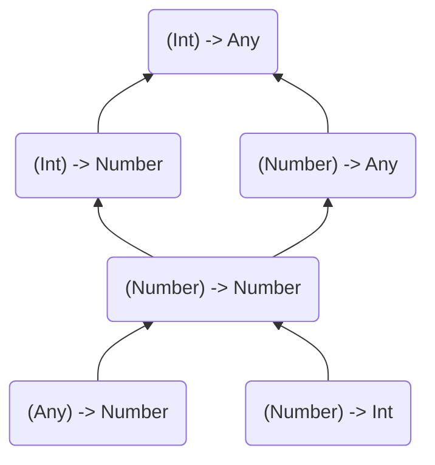

# Item 24 : 제네릭 타입의 공변성과 반공변성 고려

```kotlin
class Cup<T>
```

타입 파라미터 `T`는 아무런 변위 수식어(`out` or `in`)가 없으로므로 기본적으로 불변입니다.  
이는 해당 제네릭 클래스로 생성된 타입 사이에는 어떤 관계도 없음을 의미 합니다.  
예를 들어, `Cup<Int>`, `Cup<Number>`, `Cup<Any>`, `Cup<Nothing>` 사이에는 어떠한 관계도 없습니다.

```kotlin
fun main() {
    val anys: Cup<Any> = Cup<Int>() // Error Type mismatch
    val nothings: Cup<Nothing> = Cup<Int>() // Error Type mismatch
}
```

## 변위 수식어(variance modifier) out과 in
위와 같은 관계가 필요한 경우, 변위 수식어 `out` 또는 `in`을 사용해야 합니다.

### out
`out` 수식어는 타입 파라미터를 공변(covariant)으로 만들어 줍니다.  
`Cup`이 `out` 수식어를 사용하여 공변이 되고, A가 B의 하위 타입일 경우 타입 `Cup<A>`는 `Cup<B>`의 하위 타입이 됩니다.

```kotlin
class Cup<out T>
open class Dog
class Puppy: Dog()

fun main(args: Array<String>) {
    val dogs: Cup<Dog> = Cup<Puppy>() // OK
    val puppies: Cup<Puppy> = Cup<Dog>() // Error Type mismatch
    
    val anys: Cup<Any> = Cup<Int>() // OK
    val nothings: Cup<Nothing> = Cup<Int>() // Error Type mismatch
}
```

### in

`out`의 반대 효과는 `in` 수식어를 사용하여 얻을 수 있으며, 이는 타입 파라미터를 반공변(contravariant)으로 만듭니다.  
즉, A가 B의 하위 타입이고, `in`을 사용하여 `Cup`이 반공변이면 `Cup<A>`는 `Cup<B>`의 상위 타입이 됩니다.


```kotlin
class Cup<in T>
open class Dog
class Puppy: Dog()

fun main(args: Array<String>) {
    val dogs: Cup<Dog> = Cup<Puppy>() // Error Type mismatch
    val puppies: Cup<Puppy> = Cup<Dog>() // OK
    
    val anys: Cup<Any> = Cup<Int>() // Error Type mismatch
    val nothings: Cup<Nothing> = Cup<Int>() // OK
}
```

---

## Function Type

함수 타입 사이에는 예상되는 타입이나 파라미터, 반환 타입이 다른 경우에도 연관성이 있습니다.

```kotlin
fun printProcessedNumber(transition: (Int) -> Any) { 
    print(transition(42))
}
```

위 `printProcessedNumber`함수는 `transition` 함수를 인수(Argument)로 받고 있습니다.  
`transition`은 `Int`를 인수로 받고 `Any`를 반환하는 함수입니다.

하지만 `transition`함수는 `(Int)->Number`, `(Number)->Any`, `(Number)->Number`, `(Any)->Number`, `(Number)->Int` 등과 같이 사용될 수 있습니다.

```kotlin
val intToDouble: (Int) -> Number = { it.toDouble() }
val numberAsText: (Number) -> Any = { it.toShort()() }
val identity: (Number) -> Number = { it }
val numberToInt: (Number) -> Int = { it.toInt() }
val numberHash: (Any) -> Number = { it.hashCode() }

printProcessedNumber(intToDouble)
printProcessedNumber(numberAsText)
printProcessedNumber(identity)
printProcessedNumber(numberToInt)
printProcessedNumber(numberHash)
```

그 이유는 위 모든 타입들 사이에 아래와 같은 관계가 있기 때문입니다.



위 계층에서는 위에서 아래로 내려갈수록 다음과 같은 특징을 가지는 것을 알 수 있습니다.
- 파라미터 타입은 더 상위 타입으로 이동
- 반환 타입은 더 하위 타입으로 이동

이러한 사실로 우리는 다음과 같은 사실을 알 수 있습니다.

- 함수 타입의 파라미터 타입은 `in` 수식어가 나타내는 것처럼 반공변(contravariant)
- 함수 타입의 반환 타입은 `out` 수식어가 나태는 것처럼 공변(covariant)

> ( T<sub>1</sub> , T<sub>2</sub> ) → Q  
> `in` → T<sub>1</sub>  
> `in` → T<sub>2</sub>  
> `out` → Q

위와 같은 함수 타입 말고도 변위 수식어를 가진 유명한 타입들은 다음과 같이 있습니다.
- `List`는 `out` 수식어를 가진 공변(covariant) 타입
- `MutableList`는 `in` 수식어를 가진 반공변(contravariant) 타입

---

## `in`과 `out` 제한자의 안전성

**Java에서 배열은 '공변(covariant)'이라는 특징**을 가지고 있습니다.   
즉, 어떤 타입의 배열이든 간에 공통된 상위 타입의 배열로 취급할 수 있다는 것을 의미합니다. 

이런 설계의 목적은, 정렬(`sort`)와 같은 일반적인 연산을 모든 타입의 배열에 적용할 수 있도록 하기 위함이었습니다. 
하지만 이러한 설계 결정에는 큰 문제가 있었습니다.

```java
Integer[] numbers = {1, 4, 2, 1};
Object[] objects = numbers;
objects[2] = "B"; // RunTime Error: ArrayStoreException
```
위 코드에서 볼 수 있듯이, `numbers` 배열을 `Object[]`로 캐스팅해도 배열 내부에서 사용되는 실제 타입(`Integer`)는 변하지 않습니다. 

이 때문에 `String` 타입의 값을 이 배열에 할당하려고 시도하면 런타임 오류가 발생합니다. 
이것은 Java의 결함이라고 할 수 있으며, Kotlin은 배열을 '불변(invariant)'으로 만들어 이런 문제를 해결하고자 했습니다. 
즉, Kotlin에서는 Array<Int>를 Array<Any>로 업캐스팅하는 것이 불가능합니다.

이러한 문제를 완전히 이해하려면, 함수의 파라미터로 특정 타입이 기대될 때 이 타입의 하위 타입을 어떤 것이든 전달할 수 있습니다.
이를 암시적 업캐스팅(implicit upcasting)이라고 합니다.

다음 코드를 통해 공변성과 암시적 업캐스팅이 어떻게 충돌하는지를 보여줄 수 있습니다.

### 공변성과 암시적 업캐스팅 충돌

```kotlin
open class Dog
class Puppy: Dog()
class Hound: Dog()

fun takeDog(dog: Dog) { /* ... */ }

takeDog(Dog())
takeDog(Puppy())
takeDog(Hound())
```

만약 `Dog`가 `out` 제한자를 가진 제네릭 타입이었다면, 
`takeDog(dog: Dog)`에는 `Dog` 타입을 상속받지 않은 아무 타입이나 `dog`를 대체할 수 있습니다.
이와 같은점은 타입 안정성을 깨드리게 됩니다.

예를 들어, `open class Dog<out T>`에서 `String` 타입의 객체를 `takeDog()`의 in-position인 `dog` 자리에 넣었다고 상상해보면, 이는 문제가 될 것입니다. 
왜냐하면 `String` 타입은 `Dog` 타입을 상속받지 않았으므로, `Dog` 타입의 파라미터를 기대하는 함수에 `String` 객체를 전달하면 런타임 오류가 발생하게 됩니다. 

위와 같은 이유로, **Kotlin은 'in-position'에서 공변성(covariance)을 허용하지 않습니다.**   
이는 암시적 업캐스팅이 이루어져도 타입 안전성을 보장하기 위한 설계 결정입니다.

```kotlin
class Box<Out T> {
    private var value: T? = null
    
    private fun set(value: T) { 
        this.value = value
    }
    
    fun get(): T = value ?: error("Value not set")
}
```
이 코드는 Kotlin에서 공변성(`out` 제한자)이 어떻게 동작하는지를 설명합니다.
여기에서 `Box<out T>`는 `T`의 값을 읽을 수 있지만(즉, 값을 반환할 수 있지만), `T`의 값을 변경할 수 없음을 의미합니다.
이는 `T`가 공변적(covariant)이므로, `Box<T>`가 **읽기 전용**이어야 함을 나타냅니다.

`set(value: T)` 메소드가 `private`로 선언되어 있으므로, 이 메소드는 `Box` 클래스 외부에서는 접근할 수 없습니다.
이렇게 되면, `Box` 클래스는 `T`의 값을 안전하게 변경할 수 있지만, 외부에서는 이 메소드를 호출할 수 없습니다.
따라서 `T`의 값을 변경할 수 없는(read-only) 공변성(`out` 제한자)을 지키는 동시에, 타입 안정성을 지킬 수 있습니다.

이에 반해 `get(): T` 메소드는 `T`의 값을 반환하기 때문에 공개되어 있습니다.
이 메소드는 공변성이 허용하는 읽기 작업을 수행합니다. 이 메소드를 통해 어떤 종류의 `T` 값을 얻을 수 있지만, 그 값은 변경할 수 없습니다.

> 공변성은 함수의 결과값으로 사용될 때(out-position)나, 불변의 값을 가지는 `data class` 등에서 안전하게 사용될 수 있습니다. 

예를 들어, Kotlin의 `List<T>`에서는 `T`가 공변입니다. 이 덕분에 `List<Any?>`를 요구하는 함수에는 어떤 종류의 `List<T>`라도 전달할 수 있습니다. 
반면에, `MutableList<T>`에서는 `T`가 in-position에서 사용되므로 불변인 것이 안전합니다.

```kotlin
fun append(list: MutableList<Any>) {
    list.add(42)
}

val strs = mutableListOf<String>("A", "B", "C")
append(strs) // Illegal in kotlin
val str: String = strs[3] 

print(str)
```

### 공변성을 활용한 이익

아래 코드는 공변성을 활용하여 이익을 볼 수 있는 좋은 예시 입니다.

```kotlin
sealed class Response<out R, out E>
class Success<out R>(val value: R) : Response<R, Nothing>()
class Failure<out E>(val error: E) : Response<Nothing, E>()
```

|       기댓값        |         허용 범위         |                              기대값 예시                               |
|:----------------:|:---------------------:|:-----------------------------------------------------------------:|
|   `Response<T>`    |   `T`의 모든 하위 응답 타입    |          `Response<Any>` → `Response<Int>`, `Response<String>`          |
| `Response<T1, T2>` | `T1`과 `T2`의 모든 하위 타입  | `Response<Any, Any>` → `Response<Int, String>`, `Response<String, Int>` |
|    `Failure<T>`    |   `T`의 모든 하위 실패 타입    |          `Failure<Number>` → `Failure<Int>`, `Failure<Double>`          |

**공변성과 `Nothing` 타입 덕분에 다음과 같은 조건이 성립됩니다.**
- `Success`는 잠재적인 오류 타입을 지정할 필요가 없음
- `Failure`은 잠재적인 성공 값의 타입을 지정할 필요가 없음

### 반공변성과 업캐스팅 충돌

공변성과 [in-positions](../용어.md#in-positions)에서 발생하는 비슷한 문제가 반공변성을 [out-positions](../용어.md#out-positions)에서 사용하려고 할 때 발생됩니다. 

Out-positions 역시 암시적인 업캐스팅을 허용합니다.

```kotlin
open class Car
interface Boat

class Amphibious: Car(), Boat

fun getAmphibious() : Amphibious = Amphibious()

val car: Car = getAmphibious()
val boat: Boat = getAmphibious()
```

위 코드는 반공변성과 잘 맞지 않습니다. `car`와 `boat`는 또 다시 어떤 상자에서든 다른 것을 기대하는 것으로 사용될 수 있습니다.

```kotlin
class Box<in T>(
    // 코틀린에서는 허용되지 않음
    val value: T
)

val garage: Box<Car> = Box(Car())
val amphibiousSpot: Box<Amphibious> = garage
val boat: Boat = garage.value // But I only have a Car

val noSpot: Box<Nothing> = Box<Car>(Car())
val boat: Nothing = noSpot.value // I cannot product Nothing
```

위와 같은 상황을 막기 위해, Kotlin은 `in` 제한자가 붙은 반공변성 타입 파라미터를 out-positions에서 사용한는 것을 막습니다.

```kotlin
class Box<in T> {
    private var value: T? = null
    
    fun set(value: T) {
        this.value = value
    }

    private fun get() : T = value ?: error("Value not set")
}
```

위와 같은 방식으로 `Box` 클래스는 `T`의 값을 안전하게 변경할 수 있지만, 외부에서는 `T`의 값을 가져올 수 없습니다.
이런 방식으로 우리는 오직 소비되거나 받아들여지는 타입 매개변수에 대해 반공변성(in 제한자)을 사용합니다.

이와 같이 Kotlin은 타입 시스템의 안전성을 보장하고, 더 풍부한 타입 추론을 가능하게 하는 등 다양한 용도로 공변성과 반공변성을 활용합니다. 
한 예로, 코루틴의 `Continuation` 인터페이스에서는 타입 매개변수 `T`에 `in` 제한자를 사용하여 이를 반공변으로 만들어, 
이 인터페이스를 안전하게 사용할 수 있게 합니다.

```kotlin
public interface Continuation<in T> {
    public val context: CoroutineContext
    public fun resumeWith(result: Result<T>)
}
```

---

## 변위 수식어(variance modifier)의 위치

variance modifier의 위치는 2가지 위치에서 사용될 수 있습니다.

첫 번째는 일반적인 선언 위치(declaration-side)입니다. 
이는 클래스나 인터페이스 선언에 붙어 해당 클래스나 인터페이스가 사용되는 모든 곳에 영향을 줍니다.

```kotlin
// Decalration-side variance modifier
class Box<out T>(val value: T) 
val boxStr: Box<String> = Box("Hello World")
val boxAny: Box<Any> = boxStr
```

두 번째는 사용 위치(use-side)인데, 이는 특정 변수에 대한 변위 제한성입니다.
이는 모든 인스턴스에 대해 변위 제한성이 적용될 필요가 없으나, 특정 변수에는 필요한 경우 사용됩니다.

```kotlin
class Box<T>(val value: T) 
val boxStr: Box<String> = Box("Hello World")
// Use-side variance modifier
val boxAny: Box<out Any> = boxStr
```
 
예를 들어 `MutableList`는 `in` 제한자를 사용하면 요소를 반환하는 것이 불가능해지기에 `in` 제한자를 가질 수 없습니다.
그러나 단일 파라미터 타입의 경우, 특정 타입을 받아들일 수 있는 모든 컬렉션을 허용하도록 그 타입을 반공변(`in`)으로 만들 수 있습니다.

```kotlin
interface Dog
interface Cutie

data class Puppy(val name: String) : Dog, Cutie
data class Hound(val name: String) : Dog
data class Cat(val name: String) : Cutie

fun fillWithPuppies(list: MutalbleList<in Puppy>) {
    list.add(Puppy("Bobby"))
    list.add(Puppy("Rex"))
}

val dogs = mutableListOf<Dog>(Hound("Max"))
fillWithPuppies(dogs)
println(dogs)
// [Hound(name=Max), Puppy(name=Bobby), Puppy(name=Rex)]

val animals = mutableListOf<Cuite>(Cat("Smokey"))
fillWithPuppies(animals)
println(animals)
// [Cat(name=Smokey), Puppy(name=Bobby), Puppy(name=Rex)]
```

`MutableList<out T>`를 사용할 때, 리스트에서 값을 읽는 것은 안전하다고 보장됩니다. 
이는 `T`가 **공변성**을 가지기 때문에, `T`의 모든 하위 타입을 가진 리스트를 처리할 수 있습니다. 
하지만 `set`과 같은 메소드를 사용해 리스트에 값을 추가하는 것은 허용되지 않습니다. 
왜냐하면 이런 경우 `T`의 어떤 하위 타입도 추가할 수 있기 때문에 타입 안전성을 보장할 수 없기 때문입니다. 
이런 이유로 `set` 메소드는 `Nothing` 타입의 인자를 필요로 합니다.

반면에 `MutableList<in T>`를 사용할 때, 리스트에 값을 추가하는 것은 안전하다고 보장됩니다. 
이는 `T`가 **반공변성**을 가지기 때문에, `T`의 모든 상위 타입을 가진 리스트를 처리할 수 있습니다. 
하지만 `get`과 같은 메소드를 사용해 리스트에서 값을 읽는 것은 허용되지 않습니다. 
왜냐하면 이런 경우 `T`의 어떤 상위 타입도 반환할 수 있기 때문에 타입 안전성을 보장할 수 없기 때문입니다. 
이런 이유로 `get` 메소드는 `Any?` 타입을 반환합니다.

따라서, 제네릭 객체에서 읽기만 하는 경우에는 자유롭게 `out`을, 해당 제네릭 객체를 수정하는 경우에는 `in`을 사용할 수 있습니다.