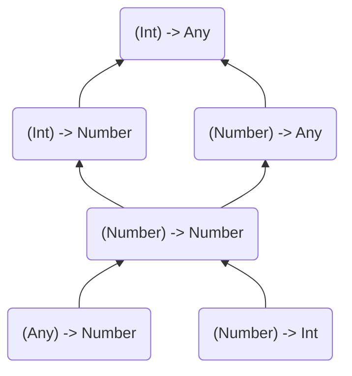

# Item 24 : 제네릭 타입의 공변성과 반공변성 고려

```kotlin
class Cup<T>
```

타입 파라미터 `T`는 아무런 변위 수식어(`out` or `in`)가 없으로므로 기본적으로 불변입니다.  
이는 해당 제네릭 클래스로 생성된 타입 사이에는 어떤 관계도 없음을 의미 합니다.  
예를 들어, `Cup<Int>`, `Cup<Number>`, `Cup<Any>`, `Cup<Nothing>` 사이에는 어떠한 관계도 없습니다.

```kotlin
fun main() {
    val anys: Cup<Any> = Cup<Int>() // Error Type mismatch
    val nothings: Cup<Nothing> = Cup<Int>() // Error Type mismatch
}
```

## 변위 수식어(variance modifier) out과 in
위와 같은 관계가 필요한 경우, 변위 수식어 `out` 또는 `in`을 사용해야 합니다.

### out
`out` 수식어는 타입 파라미터를 공변(covariant)으로 만들어 줍니다.  
`Cup`이 `out` 수식어를 사용하여 공변이 되고, A가 B의 하위 타입일 경우 타입 `Cup<A>`는 `Cup<B>`의 하위 타입이 됩니다.

```kotlin
class Cup<out T>
open class Dog
class Puppy: Dog()

fun main(args: Array<String>) {
    val dogs: Cup<Dog> = Cup<Puppy>() // OK
    val puppies: Cup<Puppy> = Cup<Dog>() // Error Type mismatch
    
    val anys: Cup<Any> = Cup<Int>() // OK
    val nothings: Cup<Nothing> = Cup<Int>() // Error Type mismatch
}
```

### in

`out`의 반대 효과는 `in` 수식어를 사용하여 얻을 수 있으며, 이는 타입 파라미터를 반공변(contravariant)으로 만듭니다.  
즉, A가 B의 하위 타입이고, `in`을 사용하여 `Cup`이 반공변이면 `Cup<A>`는 `Cup<B>`의 상위 타입이 됩니다.


```kotlin
class Cup<in T>
open class Dog
class Puppy: Dog()

fun main(args: Array<String>) {
    val dogs: Cup<Dog> = Cup<Puppy>() // Error Type mismatch
    val puppies: Cup<Puppy> = Cup<Dog>() // OK
    
    val anys: Cup<Any> = Cup<Int>() // Error Type mismatch
    val nothings: Cup<Nothing> = Cup<Int>() // OK
}
```

## Function Type

함수 타입 사이에는 예상되는 타입이나 파라미터, 반환 타입이 다른 경우에도 연관성이 있습니다.

```kotlin
fun printProcessedNumber(transition: (Int) -> Any) { 
    print(transition(42))
}
```

위 `printProcessedNumber`함수는 `transition` 함수를 인수(Argument)로 받고 있습니다.  
`transition`은 `Int`를 인수로 받고 `Any`를 반환하는 함수입니다.

하지만 `transition`함수는 `(Int)->Number`, `(Number)->Any`, `(Number)->Number`, `(Any)->Number`, `(Number)->Int` 등과 같이 사용될 수 있습니다.

```kotlin
val intToDouble: (Int) -> Number = { it.toDouble() }
val numberAsText: (Number) -> Any = { it.toShort()() }
val identity: (Number) -> Number = { it }
val numberToInt: (Number) -> Int = { it.toInt() }
val numberHash: (Any) -> Number = { it.hashCode() }

printProcessedNumber(intToDouble)
printProcessedNumber(numberAsText)
printProcessedNumber(identity)
printProcessedNumber(numberToInt)
printProcessedNumber(numberHash)
```

그 이유는 위 모든 타입들 사이에 아래와 같은 관계가 있기 때문입니다.



위 계층에서는 위에서 아래로 내려갈수록 다음과 같은 특징을 가지는 것을 알 수 있습니다.
- 파라미터 타입은 더 상위 타입으로 이동
- 반환 타입은 더 하위 타입으로 이동

이러한 사실로 우리는 다음과 같은 사실을 알 수 있습니다.

- 함수 타입의 파라미터 타입은 `in` 수식어가 나타내는 것처럼 반공변(contravariant)
- 함수 타입의 반환 타입은 `out` 수식어가 나태는 것처럼 공변(covariant)

> ( T<sub>1</sub> , T<sub>2</sub> ) → Q  
> `in` → T<sub>1</sub>  
> `in` → T<sub>2</sub>  
> `out` → Q

위와 같은 함수 타입 말고도 변위 수식어를 가진 유명한 타입들은 다음과 같이 있습니다.
- `List`는 `out` 수식어를 가진 공변(covariant) 타입
- `MutableList`는 `in` 수식어를 가진 반공변(contravariant) 타입