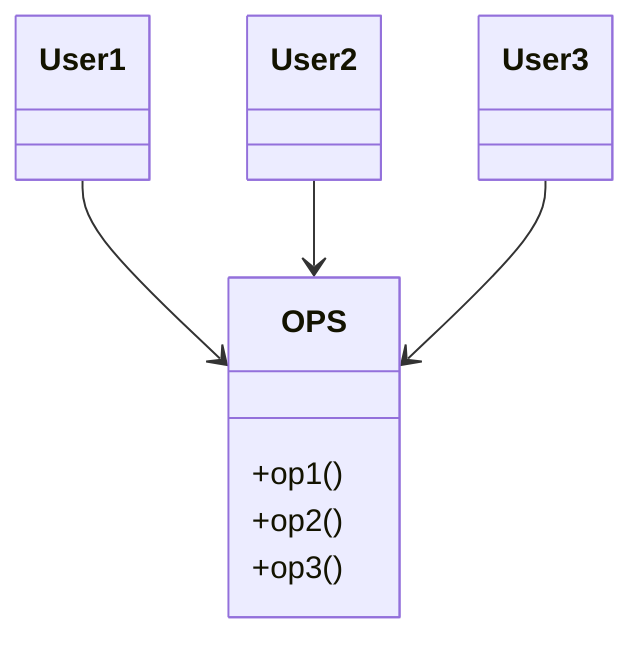
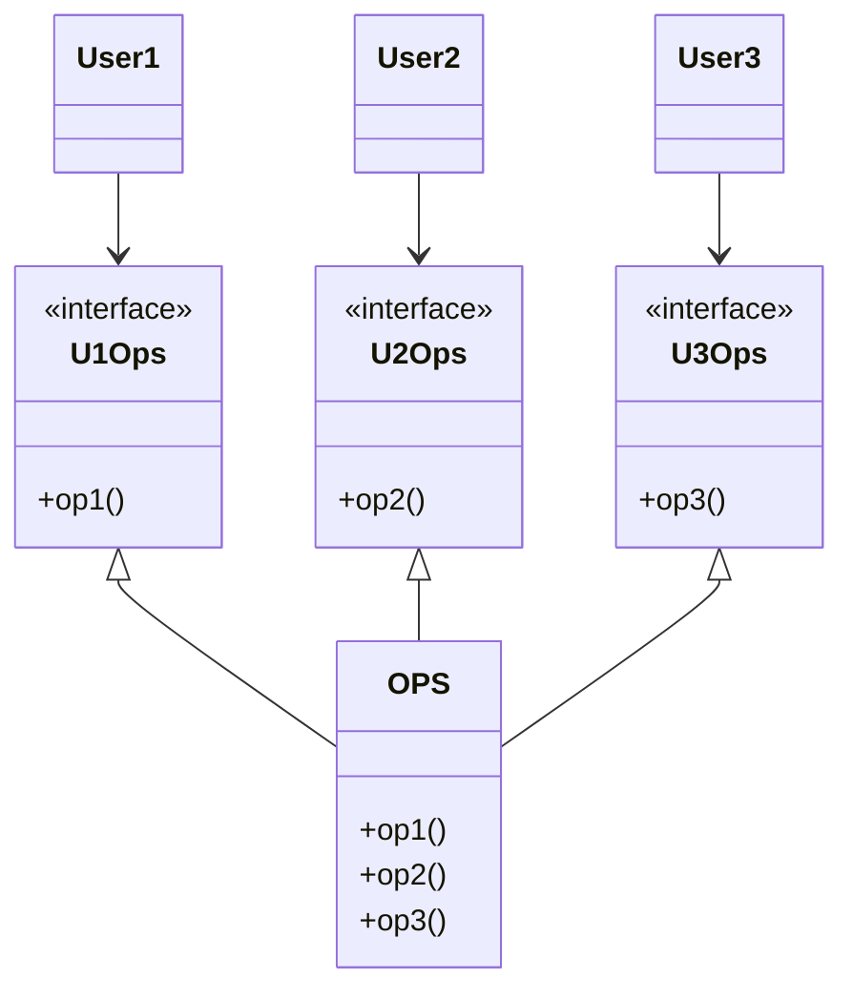
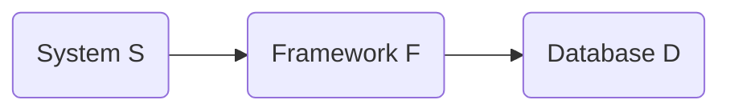

'인터페이스 분리 원칙'은 아래 다이어그램에서 유래되었음.

위 설계를 보면 다수의 사용자가 `OPS`의 오퍼레이션을 사용하며, `User1`은 오직 `op1`만, `User2`는 `op2`만, `User3`은 `op3`만 사용한다고 가정하고,  
정적 타입 언어로 `OPS`를 작성했을 때, `User1`에서는 `op2`와 `op3`을 전혀 사용하지 않음에도 `User1`의 소스 코드는 위 2가지 메서드를 의존하게 됨.  
이런 의존성으로 인해 `OPS`의 `op2` 소스 코드가 변경되면, `User1`은 관련 코드가 없음에도 재컴파일 후 재배포해야 함.

이러한 의존성 문제를 다음과 같이 인터페이스 단위로 분리하여 해결할 수 있음.

이렇게 변경함으로써, `User1` 소스 코드는 `U1Ops`와 `op1`에는 의존하지만 `OPS`에 의존하지 않게됨.  
따라서 `OPS`에서 발생한 변경이 `User1`에 영향을 미치지 않게 됨.

## ISP와 언어 

위 예제의 사례는 언어 타입에 따라 달라질 수 있음.  
정적 타입 언어는 사용자가 `import`, `use`, `include`와 같은 '타입 선언문'을 사용하도록 강제함.  
이처럼 소스 코드에 '포함된(included)' 선언문으로 인해 소스 코드 의존성이 발생하고, 이로 인해 재컴파일 또는 재배포가 강제되는 상황이 무조건 초래됨.

루비나 파이썬과 같은 동적 타입 언어에서는 소스 코드에 위와 같은 선언문이 존재하지 않지만, 런타임에 추론이 발생하게 됨.  
따라서 소스 코드 의존성이 아예 없으며, 결국 재컴파일과 재배포가 필요가 없음.

동적 타입 언어를 사용하면 정적 타입 언어를 사용할 때보다 유연하며 결합도가 낮은 시스템을 만들 수 있는 이유가 이 떄문임.  
이로 인해 '인터페이스 분리 원칙'은 아키텍처가 아니라, **언어와 관련된 문제**로 결론 내릴 여지가 있음.

## ISP와 아키텍처

멀리서 보면 '인터페이스 분리 원칙'을 사용하는 근본적인 동기는 잠재된 우려사항으로 볼 수 있음.  
일반적으로, 소스 코드 의존성이 있는 경우에 필요 이상으로 많은 걸 포함하는 모듈에 의존하는 것은 불필요한 재컴파일과 재배포를 강제하기에 좋지 않음.  
이는 더 고수준인 아키텍처 수준에서도 이러한 문제가 발생할 수 있음.

예를 들어, S시스템을 설계하고 있는 아키텍트가 F라는 프레임워크를 시스템에 도입하고 싶어함.  
그리고 F 프레임워크 개발자는 특정 D 데이터베이스를 반드시 사용하도록 만들었다고 가정해보면 S는 F에 의존하고 F는 D에 의존함.

S와는 전혀 관계 없는 기능이 D에 포함되어 있고, 그 기능 때문에 D 내부가 변경되면, F를 재배포해야 할 수 있고, 따라서 S까지 재배포해야 할 수도 있음.  
더 심각한 문제는 D 내부 기능 중 F와 S에서 사용하지 않는 기능에 문제가 발생해도 F와 S가 영향을 받을 수 있다는 것임.

## 결론

불필요한 짐을 실은 무언가에 의존하면 예상치 못한 문제에 빠질 수 있음.