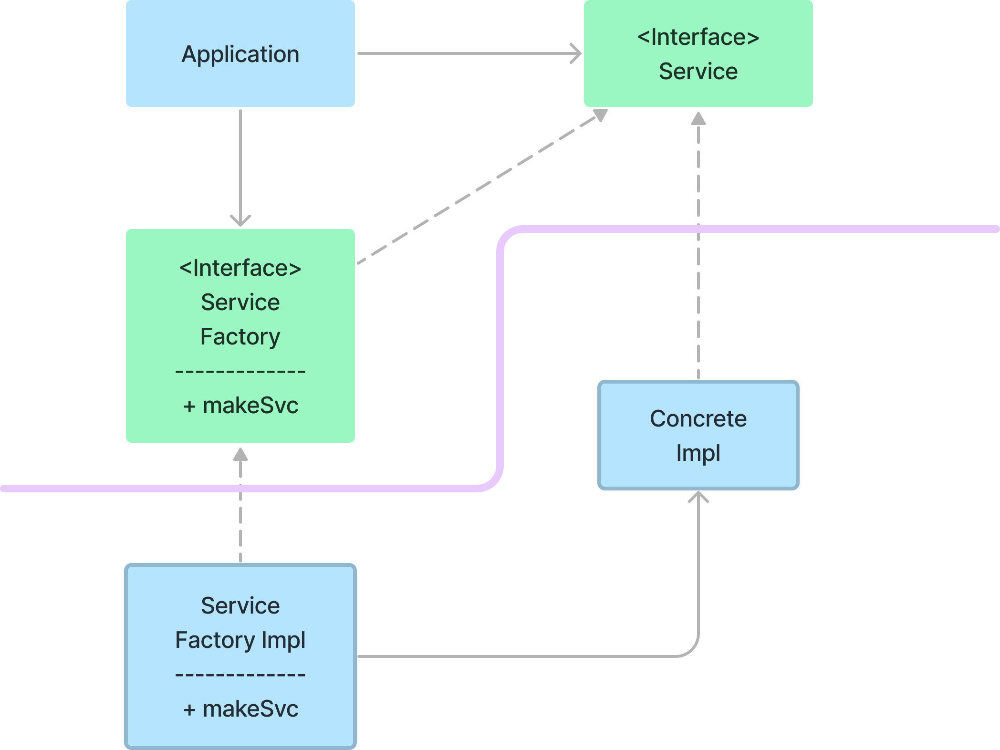

'의존성 역전 원칙'에서 소스 코드 의존성이 구체(concretion)에 의존하지 않고, 추상(abstraction)에 의존하는 시스템을 '유연성이 극대화된 시스템'이라고 한다.

Java와 같은 정적 타입 언어에서 'use', 'import', 'include' 구문은 구체적인 대상에 의존하는 것이 아닌, 인터페이스나 추상 클래스와 같은 추상적인 선언만을 참조해야 한다.  
루비나 파이썬같은 동적 타입 언어에도 동일한 규칙이 적용되며 소스 코드 의존 관계에서 구체 모듈을 참조해서는 안된다.  
하지만, 동적 타입 언어의 경우 구체 모듈이 무엇인지를 정의하기가 다소 어렵다. 특히 호출 할 함수가 구현된 모듈이라면 참조하지 않기가 어렵다.

소프트웨어 시스템이라면 구체적인 많은 장치에 반드시 의존하기에 위와 같은 아이디어를 규칙으로 보기에는 현실적으로 어렵다.  
예를 들어, Java의 `String`은 구체 클래스이며, 이를 추상 클래스로 만드는 시도는 현실성이 없다. 또한 이를 소스 코드 의존성에서 제외하는 것도 불가능하다.  
이런 특성에도 불구하고 `String`은 안정적인 클래스로, 변경되는 일이 거의 없으며 있더라도 엄격하게 통제된다.  
프로그래머와 아키텍트는 이런 전제를 기반으로 `String` 클래스가 변경되지 않을 것이라는 확신을 가질 수 있다.

위와 같은 이유로 '의존성 역전 원칙'을 논할 때 운영체제나 플랫폼 같이 안정성이 보장된 환경에서는 무시하는 편이다.  
즉, 변경되지 않는다면 의존할 수 있다는 사실을 이미 알고 있기 때문에 안정성이 보장된 환경에 대한 의존성은 허용된다.

그렇다면 의존하지 않도록 피하고자 하는 것은 무엇일까? 바로 '변동성이 큰(volatile) 구체적인 요소'다.  
그리고 이 구체적인 요소는 개발자들이 만드는 자주 변경될 수 있는 모듈들을 의미한다.

## 안정된 추상화

추상 인터페이스에 변경이 발생하면 이를 구체화한 구현체도 이에 맞춰 수정해야 한다.  
반대로 구체화한 구현체에 변경이 생기면 그 구현체를 구현하는 추상 인터페이스는 대다수의 경우 변경될 필요가 없다.

이는 곧 인터페이스가 구현체보다 변동성이 낮음을 의미한다.

실제로 뛰어난 소프트웨어 설계자와 아키텍트라면 인터페이스의 변동성을 더욱 낮추기 위해 최선을 다한다.  
인터페이스를 변경하지 않고도 구현체에 기능을 추가할 수 있는 방법을 찾기 위해 노력하며, 이는 **소프트웨어 설계의 기본**이 된다.

즉, '안정된 소프트웨어 아키텍처'란 **변동성이 큰 구현체에 의존하는 일을 지향하고, 안정된 추상 인터페이스를 선호하는 아키텍처**라는 의미이다.  
이 원칙에서 전달하려는 내용은 다음과 같이 매우 구체적인 실천법으로 요약할 수 있다.

- 변동성이 큰 구체 클래스를 참조하지 말고 추상 인터페이스를 참조하라. 
  - 이 규칙은 언어가 정적 타입이든 동적 타입이든 관계 없이 모두 적용된다. 
  - 또한 이 규칙은 객체 생성 방식을 강하게 제약하며, 일반적인 추상 팩토리(abstract factory)를 사용하도록 강제한다.
- 변동성이 큰 구체 클래스를 기반으로 파생하지 말 것.
  - 정적 타입 언어에서 상속은 소스 코드에 존재하는 모든 관계 중 가장 강력한 동시에 뻣뻣해서 변경하기 까다롭다. 따라서 상속은 아주 신중하게 사용해야 한다.
  - 동적 타입 언어라면 문제가 덜 되지만, 의존성을 가진다는 사실에 변함이 없다. 따라서 신중하게 사용하는 것이 좋다.
- 구체 함수를 '오버라이드' 하지 말 것.
  - 대체로 구체 함수는 소스 코드 의존성을 필요로 한다. 따라서 구체 함수를 오버라이드 하게되면 소스 코드 의존성을 제거할 수 없게되며, 실제로도 의존성을 상속하게 된다.
  - 이런 의존성을 제거하려면, 추상 함수로 선언하고 구현체에서 각 용도에 맞게 구현하는게 좋다.
- 구현체이며 변동성이 크다면 절대로 노출하지 말 것.
  - 정적 타입 언어에서는 `private`나 `internal` 같은 접근 제어자를 사용하라.
  - 동적 타입 언어에서는 모듈을 분리하고, 구현체를 모듈 내부로 숨기는 방법을 사용하라.

## 팩토리

위와 같은 규칙들을 준수하려면 '변동성'이 큰 구체적인 객체는 각별하게 주의하여 생성해야 한다.  
사실상 모든 언어에서 객체를 생성하려면 해당 객체를 구체적으로 정의한 코드에 대해 소스 코드 의존성이 발생하기 때문이다.  
Java 등 대다수의 객체 지향 언어에서 이처럼 바람직하지 못한 의존성을 처리할 때 아래와 같이 '추상 팩토리'를 사용하곤 한다.

'Application'은 'Service' 인터페이스를 통해 'ConcreteImpl'을 사용하지만, 'Application'에서는 어떤식으로든 'ConcreteImpl'의 인스턴스를 생성해야 한다.  

'ConcreteImpl'에 대한 소스 코드 의존성을 만들지 않으면서, 이 목적을 이루기 위해 'Application'은 'ServiceFactory' 인터페이스의 'makeSvc' 메서드를 호출한다.  
'makeSvc' 메서드는 'ServiceFactoryImpl'에서 구현되며, 이 구현체에서 'ConcreteImpl'의 인스턴스를 생성하고 'Service' 타입으로 반환한다.   

위에서 보라색 곡선은 아키텍처의 경계를 의미하며, 구체적인 것들로부터 추상적인 것들을 분리함을 의미한다.  
또한 소스 코드 의존성은 이 곡선과 교차할 때, 모두 추상적인 것들에게 단방향으로 향한다. 

보라색 곡선은 시스템을 '추상 컴포넌트'와 '구체 컴포넌트'로 분리한다.  
추상 컴포넌트는 앱의 모든 고수준 업무 규칙을 포함하며, 구체 컴포넌트는 업무 규칙을 다루기 위해 필요한 모든 구체적인 세부사항을 포함한다.

제어흐름은 소스 코드 의존성과 반대 방향으로 곡선을 가로지른다는 점을 주목하자.  
즉, 소스 코드 의존성은 제어흐름과 반대 방향으로 역전된다. 이러한 이유로 이 원칙을 '의존성 역전 원칙'이라고 부른다.

## 구체 컴포넌트

구체 컴포넌트에는 구체적인 의존성이 하나 있고('ServiceFactoryImpl' --> 'ConcreteImpl'), 따라서 '의존성 역전 원칙'에 위배된다.  
이는 '의존성 역전 원칙'을 모두 없앨 수 없기에 이는 일반적인 경우다. 
하지만, '의존성 역전 원칙'을 위배하는 클래스들은 적은 수의 구체 컴포넌트 내부로 모을 수 있다.
이를 통해 시스템의 나머지 부분과 분리할 수 있다.

대다수의 시스템은 이런 구체 컴포넌트를 최소한 하나는 포함하며, 흔히 main 함수를 포함하기 때문에 이를 **main**이라고 부른다.  
위 그림의 경우 main 함수는 'ServiceFactoryImpl' 인스턴스를 생성한 후 이 인스턴스를 ServiceFactory 타입으로 전역 변수에 저장할 것이다.  
그 다음 'Application'은 이 전역 변수를 이용하여 'ServiceFactoryImpl'의 인스턴스에 접근할 것이다.

## 결론

고수준 아키텍처 원칙을 다루게되면 '의존성 역전 원칙'는 몇번이고 계속 등장하게 된다.
그리고 '의존성 역전 원칙'은 아키텍처 다이어그램에서 가장 눈에 드러나는 원칙이 될 것이다.  
그리고 위 그림의 보라색 곡선은 이후에는 '아키텍처 경계'가 될것이며, 
의존성은 아키텍처 경계를 기준으로 더 추상적인 엔티티가 있는 쪽으로만 향한다.