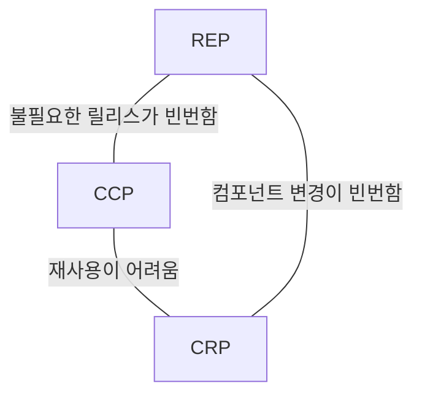

"어떤 클래스를 어느 컴포넌트에 포함시켜야 할까?" 이는 중요한 결정이므로 제대로 된 소프트웨어 엔지니어링 원칙의 도움을 받아야 한다.

- REP : 재사용 / 릴리즈 등가 원칙 (Reuse / Release Equivalence Principle)
- CCP : 공통 폐쇄 원칙 (Common Closure Principle)
- CRP : 공통 재사용 원칙 (Common Reuse Principle)

## REP : 재사용 / 릴리즈 등가 원칙

소프트웨어 컴포넌트가 릴리스 절차를 통해 추적 관리되지 않거나 릴리스 번호가 부여되지 않는다면 다음의 문제점이 있다.

- 재사용 컴포넌트들이 서로 호환되는지 보증할 방법이 없다.
- 새로운 버전이 언제 출시되고 무엇이 변했는지를 알 수 없게 된다.

새로운 릴리즈가 나오면, 개발자는 새 릴리스의 변경 사항을 살펴보고 기존 버전을 계속 쓸지 새 버전으로 업그레이드할지 결정한다.  
따라서 릴리스 절차에는 '적절한 공지 + 릴리스 문서 작성'이 포함되어야, 개발자가 충분한 정보를 바탕으로 결정을 내릴 수 있다.

소프트웨어 설계와 아키텍처 관점에서 'REP'를 보면 **단일 컴포넌트 = 응집성 높은 클래스 + 모듈들로 구성**되어야 한다.  
뒤죽박죽 임의로 선택된 클래스와 모듈로 구성되어선 안되고, 컴포넌트를 구성하는 모듈은 서로 공유하는 중요한 테마나 목적이 있어야 한다.  
단일 컴포넌트로 묶인 클래스와 모듈은 동일한 버전 번호로 추적 관리되고, 동일한 릴리스 문서에 포함시켜, 함께 릴리스 할 수 있어야 한다.

## CCP : 공통 폐쇄 원칙

'SRP'를 컴포넌트 관점에서 말하면 다음과 같이 이야기 할 수 있다.

- 동일한 이유로 동일 시점에 변경되는 클래스를 같은 컴포넌트로 묶어야 한다.  
- 서로 다른 시점에 다른 이유로 변경되는 클래스는 다른 컴포넌트로 분리 해야한다.

대다수 앱에서 재사용성보다 유지보수성을 중요하게 생각한다.
만약 앱에서 코드 변경 시, 다수의 컴포넌트에서 분산되어 변경하는 것보단, 단일 컴포넌트에서 변경 후 단일 컴포넌트만 재배포하는 것이 훨씬 더 효율적이다.
이 때, 변경된 컴포넌트에 의존하지 않는 다른 컴포넌트는 재검증•재배포 할 필요가 없다.  
'CCP'는 이와 같은 이유로, 물리적•개념적으로 강하게 결합되어 항상 함께 변경되는 클래스를 동일한 컴포넌트로 묶는 것을 권장한다.  
이를 통해 소프트웨어를 릴리스, 재검증, 배포하는 일과 관련된 작업량을 최소화 할 수 있다.

'CCP'는 'OCP'와도 관련이 있는데, 100% 완전한 폐쇄란 불가능하므로 전략적으로 폐쇄해야 한다.  
보통은 변경이 발생할 가능성이 있거나, 과거에 발생했던 대다수의 공통적인 변경에 대해 클래스가 닫혀 있도록 설계한다.  
'CCP'에서는 동일한 유형의 변경에 대해 닫혀 있는 클래스들을 단일 컴포넌트로 묶음으로써 'OCP'의 목표를 확대 적용한다.  
따라서 변경이 필요한 요구사항이 발생했을 때, 그 변경에 영향을 받는 컴포넌트가 최소한으로 한정될 가능성이 확실히 높아질 수 있다.

'SRP'는 서로 다른 이유로 변경되는 '메서드'를 서로 다른 '클래스'로 분리하라고 말한다.  
'CCP'는 서로 다른 이유로 변경되는 '클래스'를 서로 다른 '컴포넌트'로 분리하라고 말한다.  
즉, **동일한 시점에 동일한 이유로 변경되는 것들을 한 곳으로 묶고, 서로 다른 시점에 다른 이유로 변경되는 것은 서로 분리하라는 것이다.**

## CRP : 공통 재사용 원칙

**컴포넌트 사용자들에게 필요하지 않는 의존성을 강요하지 않는 것이 중요하다.**

'CRP'는 같이 재사용되는 경향이 있는 클래스와 모듈들을 같은 컴포넌트에 포함시켜야 한다고 말한다.

개별 클래스는 대부분 재사용 모듈의 일부로 활용되어, 해당 모듈이 다른 클래스와 상호작용 할 때 사용되는 경우가 많다.  
'CRP'에서는 서로 상호작용하는 클래스들을 동일한 컴포넌트에 포함시켜야 한다고 말하며, 컴포넌트 내부에서는 클래스들 사이에 수많은 의존성이 있으리라 예상할 수 있다.  
컨테이너-이터레이터 클래스를 예시로 들 수 있다. 이들은 서로 강하게 연결되어 있고 함께 재사용되기에, 동일한 컴포넌트에 포함시켜야 한다.

'CRP'는 동일한 컴포넌트로 묶여서는 안되는 클래스들에 대해서도 명확한 가이드라인을 제공한다.  
A 컴포넌트가 B 컴포넌트를 사용하면, 두 컴포넌트 사이에 의존성이 발생한다. 이 같은 의존성으로 B 컴포넌트가 변경되면, A 컴포넌트도 변경될 가능성이 높아진다.  
또한, B 컴포넌트의 변경이 A 컴포넌트와 관련이 없다하여도, 재컴파일, 재검증, 재배포 등의 과정을 거쳐야 하는 가능성이 발생한다.  
따라서 의존하는 컴포넌트가 있다면 해당 컴포넌트의 모든 클래스에 대해 의존함을 확실하게 인지해야 한다.

따라서 'CRP'는 어떤 클래스를 한 곳으로 묶어야 하는지 보다는, 어떤 클래스를 한 곳으로 묶어서는 안되는지에 대해서 훨씬 더 많은 이야기를 한다.  
'CRP'는 강하게 결합되지 않은 클래스들을 동일한 컴포넌트에 포함시키지 않도록 경고한다.

'ISP'는 사용하지 않은 '메서드가 있는 클래스'에 의존하지 말아야 한다.  
'CRP'는 사용하지 않는 '클래스를 가진 컴포넌트'에 의존하지 말아야 한다.

## 컴포넌트 응집도에 대한 균형 다이어그램

'REP'와 'CCP'는 'inclusive 원칙'으로, 두 원칙은 컴포넌트를 더욱 크게 만든다.  
반대로 'CRP'는 'exclusive 원칙'으로, 컴포넌트를 더욱 작게 만든다.

다음 균형 다이어그램은 세 원칙이 서로 어떻게 상호작용하는지 보여준다.

다이어그램의 각 변은 반대쪽 꼭지점에 있는 원칙을 포기했을 때 감수해야 할 비용을 보여준다.  
오로지 'CRP'와 'REP'에만 중점을 두면, 사소한 변경이 생겼을 때 너무 많은 컴포넌트에 영향을 미칠 수 있다.  
반대로 'CCP'와 'REP'에만 중점을 두면, 불필요한 릴리스가 빈번하게 발생할 수 있다.

프로젝트 초기에는 'CCP'가 'REP' 보다 훨씬 더 중요하게 여겨지는데, 개발 가능성이 재사용성보다 더욱 중요하기 때문이다.  
일반적인 프로젝트는 'CCP+CRP'로 진행되어 재사용성을 희생하다가, 프로젝트가 커짐에 따라 재사용성이 중요해지면서 'REP+CRP'로 진행된다.  
즉, 프로젝트 컴포넌트 구조는 시간과 성숙도에 따라 변함을 의미한다. 

## 결론

과거에는 응집도를 '모듈은 단 하나의 기능만 수행해야 한다.'는 정도로 단순하게 이해했지만, 
컴포넌트 응집도에 관한 세 원칙은 응집도가 가질 수 있는 훨씬 복잡한 다양성을 설명한다.

어느 클래스들을 묶어서 컴포넌트를 만들 것인지를 결정할 떄, '재사용성'과 '개발 가능성'이라는 상충하는 요구사항을 고려해야 한다.  
이들 사이에서 앱의 요구에 맞게 균형을 잡는 일은 중요하다. 심지어 이 균형점은 거의 유동적이다.  
즉, 두 가지 요구사항을 현재 상황에 맞게 잘 분배했더라도, 시간이 지남에 따라 상황이 변하면 균형점도 변할 수 있다.  
결과적으로 프로젝트의 초점이 '개발 가능성'에서 '재사용성'으로 바뀌고, 그에 따라 컴포넌트를 구성하는 방식도 조금씩 변할 수 있다.