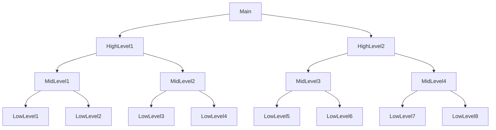
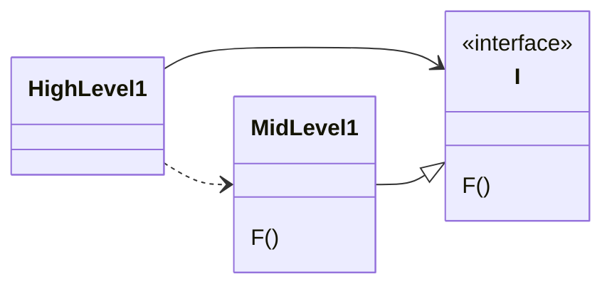

'좋은 아키텍처'를 만드는 일은 '객체 지향 설계 원칙'을 이해하고 응용하는 데서 출발함.

"객체 지향은 무엇인가?" 라는 질문에 누군가는 "데이터와 함수의 조합" 이라고 답할 수 있음.  
그렇지만, `o.f()`가 왠지 `f(o)`와 다르다는 의미를 내포하기에 옳지 못한 답일 수 있음.  
'함수 호출 스택 프레임'을 '힙'으로 옮기고 '객체 지향'을 발명하기 훨씬 이전부터 프로그래머는 '데이터 구조를 함수에 전달'해왔음.

'객체 지향'은 '캡슐화, 상속, 다형성' 이 세 가지 개념을 적절하게 조합한 것이거나, '객체 지향 언어'는 최소한 이 세 가지 개념을 반드시 지원해야 한다고 말함.

## 캡슐화 (Encapsulation)

'객체 지향'을 정의하는 요소 중 하나로 '캡슐화'를 언급하는 이유는, '데이터와 함수'를 쉽고 효과적으로 캡슐화하는 방법을 '객체 지향 언어가 제공'하기 때문임.  

이를 통해 **데이터와 함수가 응집력 있는 집단을 구성하고, 서로 구분 짓는 선**을 그을 수 있게 됨.  
이 '구분선 바깥'에서 **데이터는 은닉**되고, **일부 함수만이 외부에 노출**됨.  
이 개념들이 실제 객체 지향 언어에서는 각각 클래스의 '`private` 멤버 데이터'와 '`public` 멤버 함수'로 구현되어 '캡슐화를 구현'함.

객체 지향 프로그래밍은 프로그래머가 캡슐화된 데이터를 우회해서 사용하지 않을 거라는 '**믿음을 기반**'으로 함.

## 상속

객체 지향 언어가 더 나은 캡슐화를 제공하지는 못하지만, 상속만큼은 객체 지향 언어가 제공하는 가장 강력한 기능임.

상속이란 단순히 어떤 변수와 함수를 하나의 유효 범위로 묶어서 재정의하는 일에 불과함.  
사실상 객체 지향 언어가 있기 훨씬 이전에도 'C 프로그래머'는 언어의 도움 없이 손수 이런 방식으로 구현하였음.

객체 지향 언어가 완전히 새로운 개념을 만들지는 못했지만, 데이터 구조에 가면을 씌우는 일을 상당히 편리한 방식으로 제공했다고 볼 수 있음.

## 다형성

'함수를 가리키는 포인터'를 응용한 것이 다형성 개념의 시작임.

객체 지향 언어는 다형성을 좀 더 안전하고 편리하게 사용할 수 있는 방법을 제공함.

'함수에 대한 포인터'를 직접 사용하여 다형적 행위를 만드는 방식은 프로그래머가 특정 관례를 '수동'으로 따라야 하기에, **리스크가 존재함**  
즉, 포인터를 초기화하는 관례를 준수하고, 포인터를 통해 모든 함수를 호출하는 관례를 지켜야 함.  
만약 이러한 관례를 망각하게 된다면 버그가 발생하고, 이를 디버깅하기 매우 어려움.

객체 지향 언어는 이러한 '관례를 없애주며', 실수할 리스크를 없애줌.  
객체 지향 언어를 사용하면 다형성은 대수롭지 않은 일이 되며, 과거 C 프로그래머가 꿈꿨던 강력한 능력을 제공함.  
이러한 이유로 **객체 지향은 제어흐름을 간접적으로 전환하는 규칙을 부과**한다고 결론 지을 수 있음.

### 의존성 역전

다형성을 안전하고 편리하게 적용할 수 있는 메커니즘이 등장하기 전,  
소프트웨어의 전형적인 호출 트리의 모습은 `main` 함수가 고수준 함수를 호출하고, 고수준 함수는 다시 중간 수준 함수를 호출하며, 중간 수준 함수는 저수준 함수를 호출하는 식으로 구성됨.  

이런 호출 트리에서 '소스 코드 의존성'의 방향은 반드시 '제어흐름(flow of control)'을 **따르게 됨**.  
:: 고수준 함수에서 저수준 함수를 호출하려면 `import`하여 참조, 의존성의 방향과 제어 흐름의 방향이 같아짐.

`main` 함수가 고수준 함수를 호출하려면 고수준 함수가 포함된 모듈을 참조해야만 함.  
실제로 모든 호출 함수는 피호출 함수가 포함된 모듈의 이름을 명시적으로 참조하고 있음.

이런 제약 조건으로 인해 소프트웨어 아키텍트에게 남은 선택지는 별로 없었음.  
즉, **제어흐름은 시스템의 행위에 따라 결정되며, 소스 코드 의존성은 제어흐름에 따라 결정됨.**

---

여기에 **다형성이 끼어들면서 상황이 바뀌게 됨**.

'HighLevel1' 모듈은 'MidLevel1' 모듈의 `F()`를 호출함.  
소스 코드에서는 'HighLevel1' 모듈은 'I' 인터페이스를 통해 `F()`를 호출함.  
이 인터페이스는 런타임에는 존재하지 않음. 'HighLevel1' 모듈은 단순히 'MidLevel1' 모듈의 `F()`를 호출할 뿐임.  
하지만, 'MidLevel1'과 'I' 인터페이스 사이의 소스 코드 의존성이 제어흐름과는 반대이며, 이를 **의존성 역전**이라고 부름. 

즉, 'HighLevel1'은 'I' 인터페이스에 의존하고, 'MidLevel1'도 'I' 인터페이스에 맞게 구현되어야 함.  
이러한 방식으로 'HighLevel1'은 'MidLevel1'의 구체적인 구현이 아닌, 추상화된 인터페이스에 의존하게 됨.

객체 지향 언어가 다형성을 안전하고 편리하게 제공한다는 사실은 **소스 코드의 의존성을 어디에서든 역전시킬 수 있다는 뜻**이기도 함.  
이런 접근법을 사용한다면, 객체 지향 언어로 개발된 시스템을 다루는 소프트웨어 아키텍트는 시스템의 **소스 코드 의존성의 방향에 대한 절대적인 결정 권한**을 갖게 됨.  
즉, 호출하는 모듈이든, 호출 받는 모듈이든 관계 없이 아키텍트는 소스 코드 의존성의 방향을 결정할 수 있음.

---

예를 들어 BusinessRule이 DB와 UI에 의존하는 대신, 시스템의 소스 코드 의존성을 역전시켜 DB와 UI가 BusinessRule에 의존하도록 만들 수 있음.
즉, UI와 DB가 BusinessRule의 플러그인이 된다는 뜻임. (BusinessRule의 소스 코드에서는 DB와 UI를 직접 참조하지 않음)

결과적으로 BusinessRule, DB, UI는 세 가지로 분리된 컴포넌트 또는 배포 가능한 단위로 컴파일 할 수 있고, 이 배포 단위들의 의존성 역시 소스 코드 사이의 의존성과 같음.
따라서 BusinessRule을 포함하는 컴포넌트는 DB와 UI를 포함하는 컴포넌트에 의존하지 않음.
또한 DB와 UI에서 발생한 변경사항은 BusinessRule에 일절 영향을 미치치 않아 독립적임을 알 수 있음.

이와 같이 특정 컴포넌트의 소스 코드가 변경되면, 해당 코드가 포함된 컴포넌트만 다시 배포할 수 있어 **배포 독립성**을 가지게 됨.  
여기서 시스템 모듈이 배포 독립성을 가지게 되면, 서로 다른 팀에서 각 모듈을 독립적으로 개발할 수 있어 **개발 독립성**을 가지게 됨.

> 객체 지향이란 다형성을 이용하여 전체 시스템의 모든 소스 코드 의존성에 대한 절대적인 제어 권한을 획득하는 능력이며,  
> 객체 지향을 사용하면 아키텍트는 '플러그인 아키텍처'를 구성할 수 있고,  
> 이를 통해 고수준 정책을 포함하는 모듈은 저수준 세부사항을 포함하는 모듈에 대한 독립성을 보장 받을 수 있음.  
> 
> 여기에, 저수준 세부사항은 중요도가 낮은 플러그인 모듈로 만들 수 있고, 
> 고수준 정책을 포함하는 모듈과 독립적으로 개발하고 배포할 수 있음. 