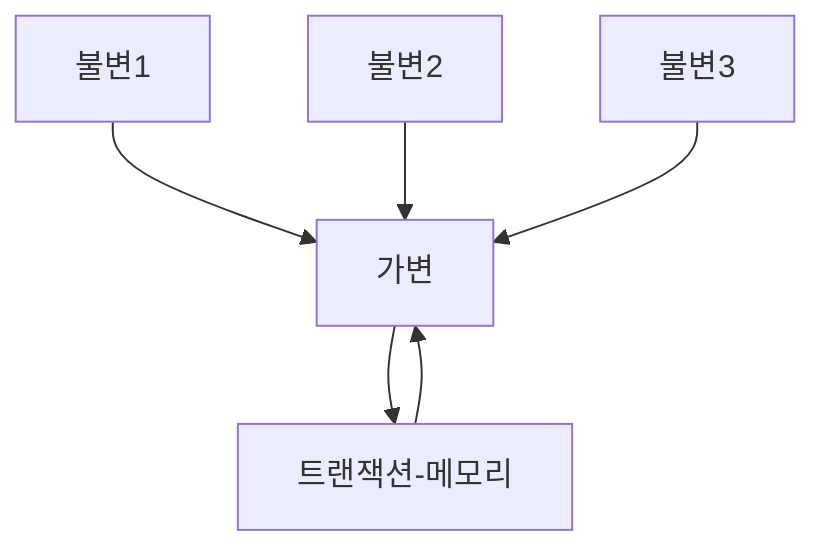

## 정수를 제곱

25까지의 정수 제곱을 출력하는 간단한 문제를 보면 다음과 같음.

```java
public static void main(String args[]) {
    for (int i = 0; i < 25; i++) {
        System.out.println(i + " squared is " + (i * i));
    }
}
```

이를 함수형 프로그래밍으로 풀어보면 다음과 같음.

```kotlin
fun squint() {
    (1..25)
        .map { i -> i * i }
        .forEach { i -> println("$i squared is $i") }
}
```

여기서 Java 프로그램은 '가변' 변수를 사용하는데, '가변' 변수는 프로그램 실행 중 '상태가 변할 수 있음'.  
그러나, 함수형 언어에서는 가변 변수를 사용하지 않음. 즉, 변수의 값이 한 번 설정되면 절대로 '바뀌지 않음'.

## 불변성과 아키텍처

- "아키텍처를 고려할 때 이러한 내용이 왜 중요한지?" 
- "아키텍트는 왜 변수의 가변성을 염려하는 지?"

이는 경합 조건, 교착 상태 조건, 동시 업데이트 문제 등 모두 가변 변수로 인해 발생하기 때문임.  
만약 어떤 변수도 갱신되지 않는다면 경합 조건이나 동시 업데이트 문제가 발생하지 않음.  
다시 말해 다수의 스레드와 프로세스를 사용하는 앱에서 마주치는 '위 모든 문제'는 가변 변수가 없다면 절대로 발생하지 않음을 뜻함.

아키텍트라면 동시성 문제에 대해서 관심을 가져야 함.  
아키텍트는 스레드와 프로세스가 여러 개인 상황에서도 설계한 시스템이 문제 없이 돌아가길 원하기에 불변성이 정말로 실현 가능한지를 스스로 물어봐야 함.  
저장 공간이 무한하고 프로세서의 속도가 무한히 빠르다고 가정하면 대부분 문제가 없다고 판단할 것이지만, 이는 현실적으로 불가능함.

## 가변성의 분리

불변성과 관련하여 가장 주요한 타협 중 하나는 앱 또는 앱 내부의 서비스를 '가변 컴포넌트'와 '불변 컴포넌트'로 '분리'하는 일임.  
불변 컴포넌트에서는 순수한 함수형 방식으로만 작업이 처리되며, 어떤 가변 변수도 사용되지 않음.  
또한 변수의 상태를 변경할 수 있는, 즉 순수 함수형 컴포넌트가 아닌 하나 이상의 다른 컴포넌트와 서로 통신함.



상태 변경은 컴포넌트를 갖가지 동시성 문제에 노출하는 가장 큰 원인 중 하나임을 계속해서 말하고 있음.  
그렇기에 트랜잭션 메모리와 같은 방법을 사용하여 동시 업데이트와 경합 조건 문제로부터 가변 변수를 보호해야 함.

트랜잭션 메모리는 데이터베이스가 디스크의 레코드를 다루는 방식과 동일한 방식으로 메모리 변수를 처리함.  
즉, 트랜잭션을 사용하거나 또는 재시도 기법을 통해 변수를 보호함. (이러한 접근법의 간단한 예로 [Java의 atomic](../CoroutineDeepDive/Part2/SharedState%20문제점.md#atomics)이 있음)

그럼에도 불구하고 여러 변수가 상호 의존하는 상황에서는 동시 업데이트와 교착 상태 문제로부터 **안전하지 않기에 더 정교한 장치를 사용**해야 함.  
즉, 앱을 제대로 구조화하려면 변수를 변경하는 컴포넌트와 변경하지 않는 컴포넌트를 분리 해야 함.  
그리고 이렇게 분리하려면 가변 변수들을 보호하는 적절한 수단을 동원해 뒷받침 해야 함.

## 이벤트 소싱

이벤트 소싱은 **상태가 아닌 트랜잭션을 저장하는 전략**으로, 상태가 필요해지면 단순히 상태의 시작점부터 모든 트랜잭션을 처리함.  
예를 들어, 매일 자정에 상태를 계산하고 저장한 뒤, 상태 정보가 필요해지면 자정 이후의 트랜잭션만을 처리하면 됨.

그렇다면 이 전략에 필요한 데이터 저장소에 대해 생각해보면, 저장 공간이 정말 많이 필요할 것이라는 생각이 들 수 있음.  
하지만, 이러한 저장 공간은 충분히 확보할 수 있음. 실제로 오프라인 데이터 저장소는 급격하게 증가하는 추세이며, 수 테라바이트도 작다고 여기는 시대임.

여기서 중요한 점은 데이터 저장소에서 데이터의 삭제나 변경이 하나도 없음.  
결과적으로 앱은 CRUD가 아닌, 그저 CR만 수행하게 되며, 데이터 저장소에서 변경과 삭제가 전혀 발생하지 않으므로 동시 업데이트 문제가 발생하지 않음.

저장 공간과 처리 능력이 충분하면 앱이 완전한 불변성을 갖도록 만들 수 있꼬, 따라서 완전한 함수형으로 만들 수 있음.  
이는 실제로도 소스 코드 버전 관리 시스템(Git)이 정확히 이 방식으로 동작함.