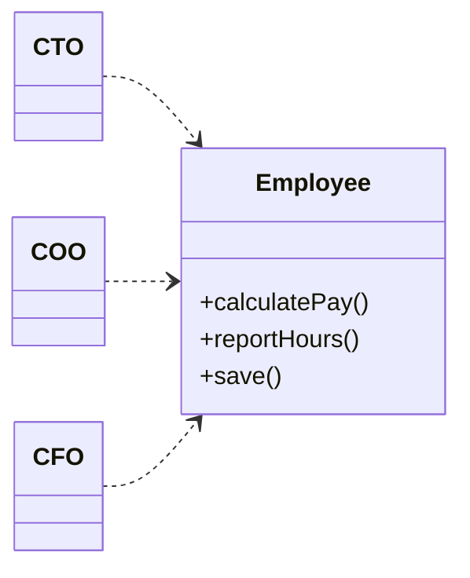
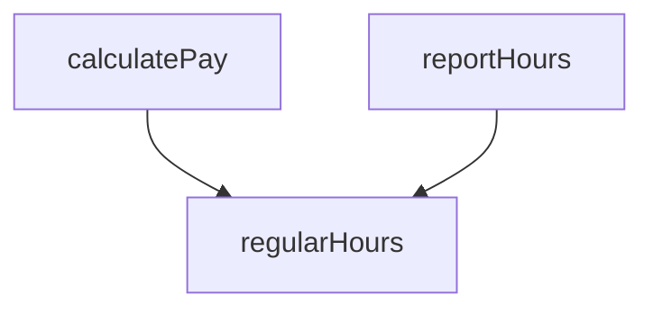
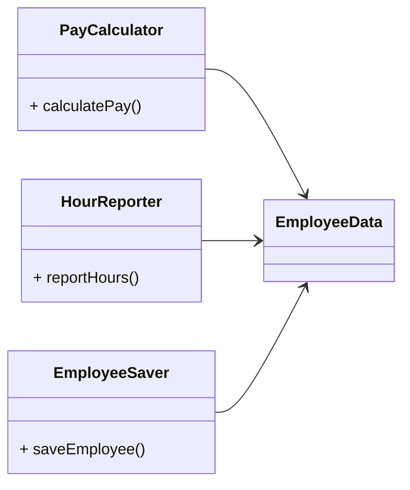
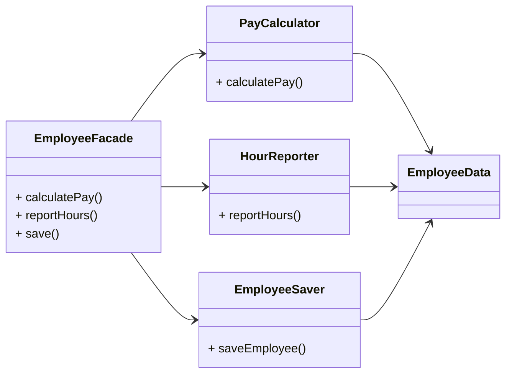
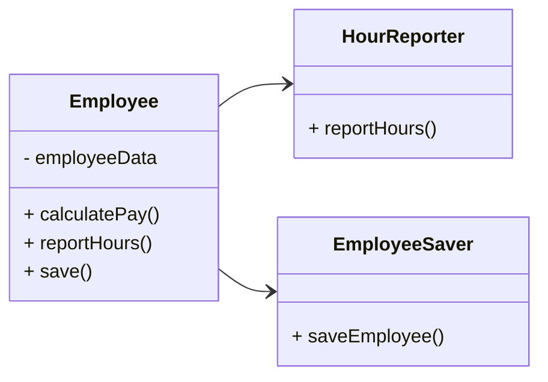

SOLID 원칙 중 그 의미가 가장 잘 전달되지 못한 원칙 중 하나로, 부적절한 이름 때문일 지도 모름.  
프로그래머가 이 원칙의 이름을 들으면 '모듈은 단 하나의 일만 해야 한다'라고 생각할 수 있지만, 헷갈리면 안됨.  
단 하나의 일만 해야 하는 원칙은 바로 '함수'로, 이 원칙은 커다란 함수를 작은 함수들로 리팩토링하는 더 저수준에서 사용됨.

소프트웨어 시스템은 '사용자와 이해관계자'를 만족시키기 위해 변경됨.   
'단일 책임 원칙'에서 말하는 '변경의 이유'란 바로 '사용자와 이해관계자'임.  
실제로 '단일 책임 원칙'은 다음과 같이 바꿔서 말할 수 있음.

    단일 모듈은 '변경의 이유'가 오직 하나뿐이어야 함.
    -> 하나의 모듈은 오직 하나의 사용자 또는 이해관계자에 대해서만 책임져야 함.

그럼에도 실제론, 시스템이 동일한 방식으로 변경되길 원하는 사용자나 이해관계자는 여러 명 일 수 있음.  
이러한 이유로 해당 변경을 요청하는 1명 이상의 사용자나 이해관계자를 '액터'라고 명명하자.  
최종적으로 '단일 책임 원칙'은 다음과 같이 바꿔서 말할 수 있음.

    하나의 모듈은 오직 하나의 사용자 또는 이해관계자에 대해서만 책임져야 함.
    -> 하나의 모듈은 오직 하나의 액터에 대해서만 책임져야 함.

---

'모듈'의 가장  단순한 정의는 바로 '소스 파일'이며, 대부분의 경우 이런 정의는 잘 들어맞음.  
하지만 일부 언어와 개발 환경에서는 코드를 소스 파일에 저장하지 않음. 이런 경우, 모듈은 단순히 함수와 데이터 구조로 구성된 응집된 집합체임.

'응집된'이라는 단어가 '단일 책임 원칙'을 암시하며, 단일 액터를 책임지는 코드를 묶어주는 힘이 바로 '응집성'임.

'단일 책임 원칙'을 위반하는 징후들을 살펴보면 이해하기 쉬울 것임.

## 우발적 중복

다음의 `Employee` 클래스는 3가지 메서드를 가짐.

위 `Employee` 클래스는 '단일 책임 원칙'을 위반하는데, 3가지 메서드가 서로 다른 3명의 액터를 책임지기 때문임.

- `calculatePay()`는 회계팀에서 기능을 정의하며, CFO 보고를 위해 사용.
- `reportHours()`는 인사팀에서 기능을 정의하며, COO 보고를 위해 사용.
- `save()`는 데이터베이스 관리자가 기능을 정의하며, CTO 보고를 위해 사용.

개발자가 이 3가지 메서드를 `Employee`라는 단일 클래스에 배치하여 3명의 액터가 서로 결합되어 버림.  
이 결합으로 인해, CFO 팀에서 결정한 조치가 COO 팀이 의존하는 무언가에 영향을 줄 수 있음.

예를 들어, `calculatePay()`와 `reportHours()`가 초과 근무를 제외한 업무 시간을 계산하는 '알고리즘을 공유'한다고 가정해보고,  
개발자는 코드 중복을 피하기 위해 '공유되는 알고리즘'을 `regularHours()`에 구현했다고 가정하면 다음의 의존성을 가질 것임.

그 다음, CFO 팀에서 '공유 알고리즘'을 약간 수정하기로 결정함.  
반면, COO 팀에서는 '공유 알고리즘'을 다른 목적으로 사용하기에, CFO 팀 변경사항을 원하지 않는다고 다시 가정해보자.

이 '변경 사항'을 적용하는 CFO 팀 개발자는 `calculatePay()`가 `regularHours()`를 호출함을 발견하지만,  
`reportHours()`가 `regularHours()`를 호출하는 것을 발견하지 못할 것임.  
CFO 팀 개발자는 이를 모르고 계속해서 요청된 변경 사항을 적용하고 신중하게 테스트 할 것임.  
물론 COO 팀에서는 이런 일이 벌어지는 지 모르고 `reportHours()`를 사용하여 생성된 보고서를 계속 이용하고 있음.  
이제 여기서 문제가 발생하게됨. COO 팀에서 생성되는 보고서들의 수치들은 잘못되어 있고, 이러한 잘못된 데이터로 인해 엄청난 예산이 지출되었음.  

위 문제는 서로 다른 액터가 의존하는 코드가 결합되어 있다는 것이 문제라는 것을 보여주며, **'단일 책임 원칙'은 서로 다른 액터가 의존하는 코드를 서로 분리할 것을 강조**함.

## 병합

개발자들은 소스 파일에 다양하고 많은 메서드를 포함하면 병합이 자주 발생할 것이라고 짐작하기 쉬움.  
특히, 이들 메서드가 서로 다른 액터를 책임진다면 병합이 발생할 가능성은 더욱 높아짐.

예를 들어, CTO 팀에서 데이터베이스의 `Employee` 테이블 스키마를 약간 수정하기로 결정함과 동시에,  
COO 팀에서 `reportHours()` 메서드의 보고서 포맷을 변경하기로 결정했다고 가정해보자.  

서로 다른 팀의 2명의 개발자가 `Employee` 클래스를 체크아웃 받은 후, 변경사항을 적용하기 시작했을 것임.  
수정 후 이들이 병합을 시도할 때, 반드시 서로 충돌이 발생하게 될 것임. 이러한 상황은 어떤 도구도 병합이 발생하는 모든 경우를 해결할 수 없기에 항상 리스크가 따름.  
위 예시와 같은 병합은 CTO와 COO 모두를 곤경에 빠뜨리고, CFO도 영향을 받게될 수 있음.

이러한 상황은 많은 사람들이 서로 다른 목적으로 동일한 소스 파일을 변경하는 경우에 해당되며, 이 문제의 해결책은 **서로 다른 액터를 뒷받침하는 코드를 분리**하는 것임.

## 해결책

위 2가지 문제의 해결책은 다양하지만, 모두가 '메서드를 각기 다른 클래스로 이동'시켜서 해결하는 방식이 일반적임.  
가장 확실한 해결책은 '데이터와 메서드를 분리'하여, 아무런 메서드가 없는 간단한 데이터 구조를 만들어 3개의 클래스가 '공유'하도록 하는 것이 좋음.  
또한 각 클래스는 자신의 메서드에 반드시 필요한 소스 코드만을 포함하고, 서로의 존재를 몰라야 함. (이를 통해 '우연한 중복'을 피할 수 있음)

이러한 해결책은 개발자가 3가지 클래스를 인스턴스화하고 추적해야 한다는 단점이 있으며, 이를 해결하기 위해 흔히 'Facade 패턴'을 사용함.

`EmployeeFacade`에 소스 코드는 거의 없으며, 이 클래스는 3가지 클래스의 객체를 생성하고, 요청된 메서드를 갖는 객체로 위임하는 일을 책임짐.

어떤 개발자는 가장 중요한 BusinessRule을 데이터와 가깝게 배치하는 방식을 선호할 수 있음.  
이 경우엔 기존 `Employee`에 가장 중요한 메서드를 유지하되, `Employee`를 덜 중요한 나머지 메서드들에 대한 'Facade'로 사용하면 됨.

모든 클래스는 반드시 단 하나의 메서드를 가져야 한다는 주장에 근거하여 위 해결책을 반대할 수 있음.  
그러나 현실적으로 각 클래스를 구현하는데 필요한 지불, 보고서 생성, 데이터 저장 등 메서드의 개수는 훨씬 더 많을 것이며, 이들 클래스는 모두 다수의 `private` 메서드를 포함할 것임.
이처럼 다수의 메서드가 하나의 그룹을 이루고, 이 그룹을 포함하는 각 클래스는 하나의 유효범위가 되며, 해당 유효범위 밖에서는 이 그룹에 감춰진 `private` 멤버가 있는지를 전혀 알 수 없음.

## 결론

**'단일 책임 원칙'은 메서드와 클래스 수준의 원칙**임. 하지만 이보다 상위 수준에서도 '다른 형태로 다시 등장'함.  

- 컴포넌트 수준에서는 '공통 폐쇄 원칙'
- 아키텍처 수준에서는 '아키텍처 경계의 생성을 책임지는 변경의 축'