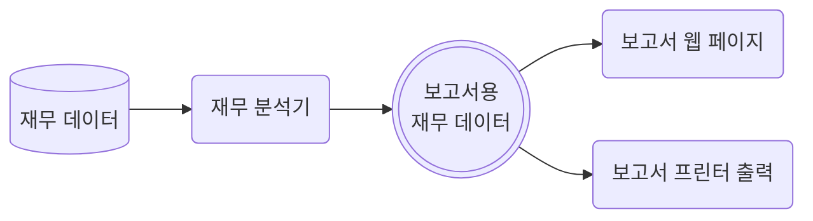
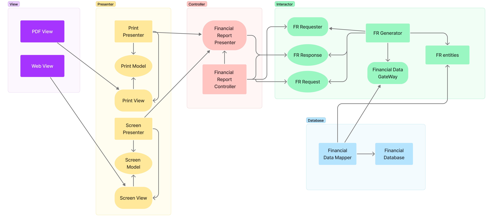
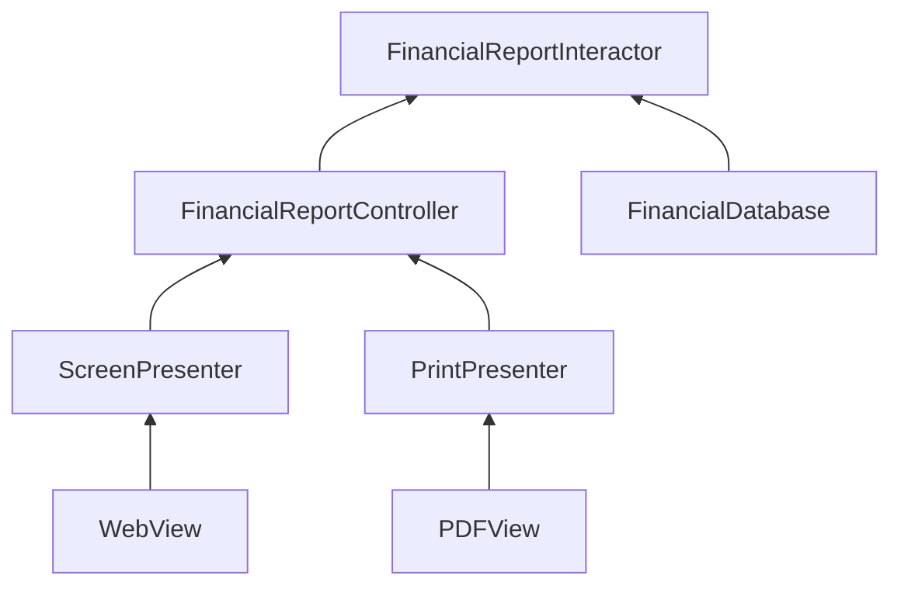

    소프트웨어 개체는 확장에 열려 있어야 하고, 변경에는 닫혀 있어야 함.

소프트웨어 개체의 행위는 확장할 수 있어야 하지만, 개체를 변경해서는 안됨.

소프트웨어 아키텍처를 공부하는 가장 근본적인 이유가 바로 이 때문임.  
만약 요구사항을 살짝 확장하는데 소프트웨어를 엄청나게 수정해야 한다면, 해당 소프트웨어 아키텍트는 엄청난 실패를 한 것임.

'개방-폐쇄 원칙'은 아키텍처 컴포넌트 수준에서 고려할 때 훨씬 더 중요한 의미를 가짐. 아래 글을 보자.

## 사고 실험

제무제표를 웹으로 보여주는 시스템이 있고, 웹 페이지 데이터는 스크롤되며 음수는 빨간색으로 출력되고 있음.  
이제 이해관계자가 '동일한 정보'를 '보고서 형태'로 변환해서 흑백 프린터로 출력 해달라는 요청을 했음.  
당연하게도 보고서 형태는 기존 웹 페이지의 형태와 '다르기에', 새로운 코드를 작성해야 한다.

그렇다면? 원래 코드에서 얼마나 많이 수정되어야 하나...  
만약 소프트웨어 아키텍처가 훌륭하다면 변경되는 코드의 양은 가능한 최소화될 것이고, 이상적이라면 변경되는 코드는 '0'에 수렴할 것임.  
즉, **다른 목적으로 변경되는 각 요소를 분리('단일 책임 원칙')하고, 각 요소 사이의 의존성을 체계화('의존성 역전 원칙')함으로써 코드 변경을 최소화** 할 수 있을 것임.

'단일 책임 원칙'을 적용하면 다음과 같은 형태로 데이터 흐름을 만들 수 있음.

여기서 가장 중요한 점은 보고서 생성이 '2개의 책임으로 **분리**'된다는 사실임.

- 보고서용 재무 데이터를 계산하는 책임
- 계산된 데이터를 웹 or 프린터 형태로 표현하는 책임

이처럼 '책임을 분리'했다면, 두 책임 중 하나에서 변경이 발생하더라도 다른 하나는 변경되지 않도록 '소스 코드 의존성'도 확실하게 '조직화' 해야함.  
또한, 새롭게 조직화된 구조에서 '행위를 확장'할 때 기존 '코드의 변경이 없도록 보장'되어야 함.

위와 같은 목적을 달성하려면 처리 과정을 '클래스 단위로 분할'하고, 이 클래스들을 '컴포넌트 단위로 구분'해야 함.

> - 화살표 끝이 굵고 직선, 구현 or 상속 관계
> - 화살표 끝이 얇음, 사용 관계
> - 동그란 타원형 : 데이터 구조
> - Radius 타원형 : 인터페이스

주목할 점은 **모든 의존성은 소스 코드 의존성을 나타냄**.

예를 들어, 화살표가 'A -> B'로 향한다면, A 클래스는 B 클래스를 참조하지만 B 클래스는 A 클래스를 참조하지 않음을 의미함.  
따라서, 'Financial DataMapper'는 구현 관계를 통해 'Financial DataGateWay'를 알고 있지만, 'Financial DataGateWay'는 'Financial DataMapper'를
알지 못함.

또 다른 주목할 점은 **모든 컴포넌트 관계는 단방향으로 이루어 짐.**

'A 컴포넌트'에서 발생한 변경으로부터 'B 컴포넌트'를 보호하려면 반드시 'A 컴포넌트'가 'B 컴포넌트'에 의존해야 함.  
위 예제의 경우 'Presenter'의 변경으로부터 'Controller'를 보호하고, 'View'의 변경으로부터 'Presenter'를 보호하고 있음.

'Interactor'는 'Database', 'Presenter', 'Controller', 'View' 등의 변경으로부터 보호되어야 함.  
즉, '개방-폐쇄 원칙'을 가장 높은 수준으로 준수 해야 할 위치에 있어야 함.  
왜냐하면, 'Interactor'는 앱에서 '가장 높은 수준의 정책인 BusinessRule을 포함하고 있기 때문임.

가장 중요한 문제는 'Interactor'가 담당하고 그 외 문제들은 주변의 컴포넌트들이 처리함.  
'Interactor' 입장에서는 'Controller'가 부수적이지만, 'Controller'는 'Presenter'와 'View'와 비교했을 때 더 중요한 문제를 담당함.  
마찬가지로, 'Presenter'는 'Controller' 입장에서 부수적이지만, 'View' 보다 더 중요한 문제를 담당함.

위 내용을 기반으로, '수준'이라는 개념으로 '보호 계층구조'가 어떻게 생성되는지 살펴보면,  
'Interactor'는 '가장 높은 수준'의 개념이며, 최고의 보호를 받아야 하고, 반대로 'View'는 '가장 낮은 수준'의 개념이며 거의 보호를 받지 못함.

    Interactor > Controller > Presneter > View

위 공식이 아키텍처 수준에서 '개방-폐쇄 원칙'이 동작하는 방식임.  
아키텍트는 기능이 어떻게, 언제, 왜 발생하는지에 따라 기능을 분리하고, 분리한 기능을 컴포넌트의 계층구조로 조직화 해야함.  
이와 같이 컴포넌트 계층구조를 '조직화'하면 저수준 컴포넌트에서 발생한 변경으로부터 고수준 컴포넌트를 '보호'할 수 있음.

## 방향성 제어

'Financial DataGateway' 인터페이스는 의존성을 역전시키기 위해 'FR Generator'와 'Financial DataMapper' 사이에 위치하고 있음.  
만약 해당 인터페이스가 없었다면, 'Interactor' 컴포넌트에서 'Database' 컴포넌트로 바로 의존성이 향하게 되버림.  
이는 'Financial Report Presenter' 인터페이스와 '2개의 View 인터페이스'도 같은 목적을 가지고 있음.

## 정보 은닉

'FR Requester' 인터페이스는 방향성 제어와 다른 목적을 가지고 있음.  
'FR Requester' 인터페이스는 'Financial Report Controller'가 'Interactor' 컴포넌트 내부 정보를 은닉하기 위해 사용됨.  
만약 해당 인터페이스가 없었다면, 'Controller' 컴포넌트는 'FR entities'에 대해 ['추이 종속성'](#추이-종속성-transitive-dependency)을 가지게 됨.

만약 추이 종속성을 가지게 되면, '소프트웨어 엔티티'는 "자신이 직접 사용하지 않는 요소에는 절대로 의존해서는 안된다."는 소프트웨어 원칙을 '위반'하게 됨.  
(이 원칙은 '인터페이스 분리 원칙'과 '공통 재사용 원칙'에서 다시 나옴.)

결과적으론, 'Controller' 컴포넌트에서 발생한 변경으로부터 'Interactor' 컴포넌트를 보호하는 것이 가장 우선순위가 높지만,   
반대로 'Interactor' 컴포넌트에서 발생한 변경으로부터 'Controller' 컴포넌트도 보호되기를 원하기에 'Interactor' 컴포넌트 내부를 은닉 해야함으로써 이를 달성함.

## 결론

'개방-폐쇄 원칙'은 시스템 아키텍처를 떠받치는 원동력 중 하나로,   
목표는 **시스템의 쉬운 확장성과 동시에 변경으로 인해 시스템이 너무 많은 영향을 받지 않도록 하는데 있음**.

이런 목표를 위해 시스템을 컴포넌트 단위로 분리하고, 
저수준 컴포넌트에서 발생한 변경으로부터 고수준 컴포넌트를 보호하는 형태의 '의존성 계층구조'가 만들어지도록 해야함.

---

### 추이 종속성 (transitive dependency)

A 클래스가 B 클래스를 의존하고, B 클래스가 C 클래스에 의존한다면, A 클래스는 C 클래스에 의존하게 됨.  
이를 추이 종속성이라 하며, 클래스 이외의 소프트웨어의 '모든 Entity'에도 동일하게 적용됨.

만약 클래스 의존성이 순환적이라면, 모드 클래스가 서로 의존하게 되버리는 문제가 발생함.