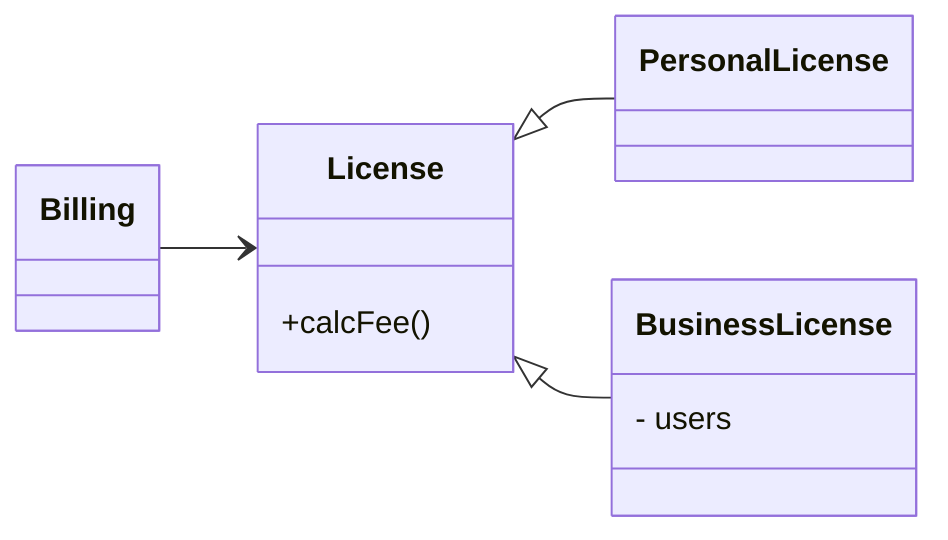
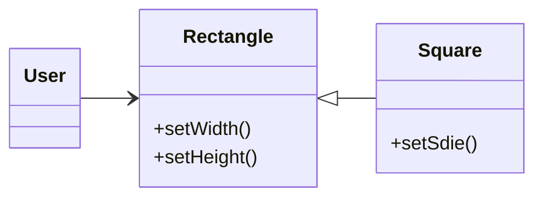

리스코프는 하위 타입을 다음과 같은 '치환 원칙'을 정의 했음.

`o1`는 `S`타입의 객체, `o2`는 `T`타입의 객체로, `T`타입을 이용한 프로그램에서 `o2`의 자리에 `o1`을 치환하더라도 프로그램의 행위가 변하지 않는다면, `S`는 `T`의 '하위 타입'이다.

이와 같은 원칙을 '리스코프 치환 원칙'이라고 부르며, 아래 몇 가지 예제를 통해 이 원칙을 이해해보자.

## 상속을 사용하도록 가이드

`calcFee()`라는 메서드를 갖는 `License`가 있고, `Billing` 앱에서 `calcFee()`를 호출 하고 있음.  
`License`에는 `PersonalLicense`와 `BusinessLicense`라는 두 가지 하위 타입이 '존재'하며, 서로 다른 알고리즘을 통해 라이선스 비용을 계산함.



위 설계에서 `Billing`의 '행위'가 `License` 하위 타입 중 무엇을 사용하는지 전혀 의존하지 않기 때문에,   
'리스코프 치환 원칙'을 준수하고 있다고 볼 수 있음. (각 하위 타입은 모두 `License`를 치환할 수 있음.)

## 정사각형/직사각형 문제

'리스코프 치환 원칙'을 위반하는 전형적인 문제로 '정사각형/직사각형' 문제가 있음.



`Rectangle`의 높이와 너비는 서로 독립적으로 변경될 수 있는 반면,   
`Square`의 높이와 너비는 함께 변경되기 때문에 `Square`는 `Rectangle` 하위 타입으로 적합하지 않음.

`User`는 참조하고 있는 상대가 `Rectangle`으로 생각하기에 혼동이 생길 수 있음.

```kotlin
val r: Rectangle = ...
r.setWidth(5)
r.setHeight(2)

assert(r.area() == 10)
```

만약 `Rectangle` 대신 `Square`를 생성한다면 `assert` 문은 실패할 것임.

이런 형태의 '리스코프 치환 원칙'을 위반하는 행동을 막기 위해서는 `Rectangle`이 실제로 `Square`인지 검사하는 메커니즘을 `User`에 추가하는 방법으로 해결할 수 있음.  
하지만, 이렇게 하면 `User`의 행위가 사용하는 타입에 의존하게 되므로, 결국 타입을 서로 치환할 수 없게 됨.

## LSP와 아키텍처

객체 지향이 혁명처럼 등장한 초창기에는 '리스코프 치환 원칙'은 상속을 사용하도록 가이드하는 방법 정도로 간주 되었음.  
하지만 시간이 흐르면서 '리스코프 치환 원칙'은 인터페이스와 구현체에도 적용되는 더 광범위한 소프트웨어 설계 원칙으로 변해갔음.

여기서 인터페이스는 다양한 형태로 나타남.   
자바스러운 언어라면 인터페이스 하나와 이를 구현하는 여러 개의 클래스로 구성될 것이며,  
루비라면 동일한 메서드 시그니처를 공유하는 여러 개의 클래스로 구성되거나, 동일한 REST 인터페이스에 응답하는 서비스 집단일 수 있음.

이처럼 잘 정의된 인터페이스와 해당 인터페이스의 구현체끼리의 '상호 치환 가능성'을 기대하기에 더 많은 상황에서도 '리스코프 치환 원칙'을 적용할 수 있음.  
아키텍처 관점에서 '리스코프 치환 원칙'을 이해하는 최선의 방법은, 이 원칙을 위반했을 때 시스템 아키텍처에서 무슨 일이 일어나는지 관찰하는 것임.

## LSP 위반 사례

콜 택시 서비스 앱을 생각해보자. 고객은 어느 택시 업체인지 신경쓰지 않고 자신의 상황에 가장 적합한 택시를 찾을 것임.  
고객이 이용할 택시를 결정하면, 시스템은 REST 서비스를 통해 택시를 고객의 위치로 보낼 것임.

콜 택시 REST 서비스의 URI가 운전기사 데이터베이스에 저장되어 있다고 가정해보면.  
시스템이 고객에게 알맞은 기사를 선택하고, 해당 기사의 레코드로부터 URI 정보를 얻은 다음, 해당 정보를 통해 기사를 고객 위치로 보낼 수 있음.

예를 들어 택시기사 '용석'의 URI는 다음과 같을 것임 : `callTaxi.com/driver/yongsuk`  
시스템은 위 URI에 필요한 정보를 덧붙인 후, 아래와 같이 PUT 방식으로 호출할 것임.

```text
callTaxi.com/driver/yongsuk
    / pickupAddress/30 Rockefeller Plaza
    / pickupTime/2018-10-10T10:00:00
    / destinationAddress/1 Broadway
```

이 예제에서 중요한 점은 콜 서비스를 만들 때 다양한 택시업체에서 **동일한 REST 인터페이스를 반드시 준수**해야 한다는 사실임.  
즉, 서로 다른 택시업체가 pickupAddress, pickupTime, destinationAddress 필드를 모두 동일한 방식으로 처리해야 한다는 의미임.

만약 '용석테크'라는 해당 지역에서 가장 큰 택시업체에서, 안내한 REST를 준수하지 않고, destinationAddress 필드를 dest로 축약해서 사용한다고 가정해보자.  
그렇다면 우리 회사의 시스템 아키텍처는 이러한 예외 사항을 처리하는 로직을 반드시 추가해야 할 것임.  
즉, '용석테크' 소속 기사를 부르는 요청은 나머지 업체의 기사를 부르는 요청과 다른 규칙을 이용하여 구성해야만 함.

이를 위해 파견 명령어를 구성하는 모듈에 `if` 문을 추가하여 처리하는게 가장 간단한 방법일 것임.

`if(driver.getDispatcheUri().startsWith("yongsuktech.com")...`

하지만 위와 같이 하드코딩하게 되면, 이해할 수 없는 다양한 종류의 에러와 보안에 취약해질 수 있기에, 실력 이는 아키텍트는 이렇게 구성하도록 하지 않을 것임.  
추가로 '용석테크'가 다른 택시 업체 '성민테크'의 브랜드와 웹 사이트를 독립적으로 유지하며 회사 시스템을 통합한 상태로 인수하게 되면 어떻게 될까?

아키텍트는 이와 같은 문제로부터 시스템을 격리해야 함.  
아키텍트는 URI를 'Key'로 사용하는 'Configuration DataBase'를 이용하는 명령 생성 모듈을 만들어 해결할 수 있을 것이며,  
설정 정보는 대체로 아래와 같은 형태일 것임.

| URI             | Dispatch Format                                       |
|-----------------|-------------------------------------------------------|
| yongsuktech.com | /pickupAddress/%s/pickupTime/%s/dest/%s               |
| *.*             | /pickupAddress/%s/pickupTime/%s/destinationAddress/%s |

또한 아키텍트는 REST 서비스의 인터페이스가 서로 치환 가능하지 않음을 처리하는 중요하고 복잡한 메커니즘을 추가해야 함.

## 결론

치환 가능성을 조금이라도 위배하면 시스템 아키텍처가 오염되어 상당량의 별도 메커니즘을 추가해야 할 수 있기에,  
'리스코프 치환 원칙'은 아키텍처 수준까지 반드시 확장해야만 함.  
