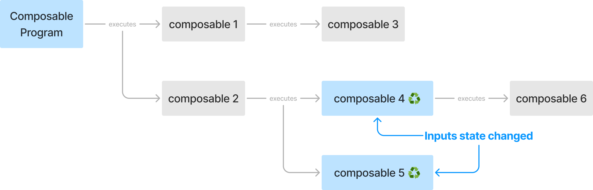

## The meaning of Composable functions

컴포저블 함수는 Compose의 가장 기본적인 빌딩 블록(atomic building block)이며, 작성할 컴포저블 트리의 기본 구조 입니다.  
여기서 "트리"라는 표현을 사용한 이유는, 컴포저블 함수가 더 큰 트리 구조에서 노드 역할을 하기 떄문입니다.   
이 트리는 Compose 런타임에서 메모리로 표현되며, 이 개념은 차차 자세히 설명하겠습니다. 

문법적으로 보면, 표준 Kotlin 함수는 `@Composable` 어노테이션을 붙이는 것만으로 컴포저블 함수로 변환될 수 있습니다:

```kotlin
@Composable
fun NamePlate(name: String) { ... }
```

이렇게 하면 컴파일러에게 `NamePlate`의 데이터를 노드로 변환하여 컴포저블 트리에 등록할 의도가 있음을 알리는 것입니다.  
즉, 컴포저블 함수를 `@Composable (Input) -> Unit`으로 읽는다면, 입력은 데이터가 되고, 출력은 함수에서 반환되는 값이 아닌 요소를 트리에 삽입하는 작업으로 등록됩니다.
이는 함수 실행의 '사이드 이펙트'로 발생한다고 볼 수 있습니다.

> 입력을 받는 함수에서 `Unit`을 반환한다는 것은, 함수 본문에서 해당 입력을 어떤 방식으로돈 소비하고 있음을 의미합니다.

이와 같은 작업을 Compose 용어로 "발행(emitting)"이라고 부릅니다. 컴포저블 함수는 실행될 때 발행되며, 이 과정은 컴포지션 중에 일어납니다.  
이 과정에 대한 자세한 내용은 이후 챕터에서 다룰 예정이며, 당분간은 컴포저블 함수를 "컴포징(composing)"한다는 표현을 보면, 이를 "실행한다(executing)"와 동일하게 생각하면 됩니다. 

컴포저블 함수를 실행하는 목적은 메모리 내 트리 구조를 생성하거나 업데이트하는 것입니다.  
컴포저블 함수는 읽은 데이터가 변경될 때마다 다시 실행되어, 트리 구조를 최신 상태로 유지합니다.  
이를 위해 노드를 삽입하는 작업뿐만 아니라, 노드를 제거하거나, 교체하거나, 이동하는 작업도 가능합니다.  
또한, 컴포저블 함수는 트리에서 상태를 읽고 쓰는 기능도 제공합니다.

## Properties of Composable functions

`@Composable` 어노테이션을 사용하면 **함수의 타입이 변경**되며, 이는 다른 타입처럼 몇 가지 제약이나 속성을 부여합니다.  
이러한 속성은 Compose의 라이브러리 기능을 활용하는데 매우 중요합니다.

Compose 런타임은 컴포저블이 부여된 속성들을 준수할 것으로 기대합니다.  
이를 통해 특정 동작을 예측하고, 다음과 같은 다양한 런타임 최적화를 적용할 수 있습니다.

- 병렬 컴포지션 (Parallel composition)
- 우선순위 기반 임의의 컴포지션 (Arbitrary order of composition based on priorities)
- 스마트 리컴포지션 (Smart recomposition)
- 위치 기반 메모이제이션 (Positional memoization)

이 새로운 개념들은 모두 이후 챕터에서 자세히 다룰 것입니다.

> 일반적으로 런타임 최적화는 런타임이 실행해야 할 코드에 대해 몇 가지 확신을 가질 수 있을 때 가능합니다.  
> 이를 통해 특정한 조건이나 동작을 가정하고, 이를 바탕으로 다양한 실행 전략이나 평가 기법을 활용하여 코드를 "소비(consume)"할 기회를 얻게됩니다.
> 
> 이러한 확신의 예로는 코드 내 서로 다른 요소 간의 관계를 들 수 있습니다.  
> 이 요소들이 서로 의존적인가? 혹은 병렬로 실행하거나 다룬 순서로 실행해도 프로그램 결과에 영향을 주지 않는가?  
> 각 논리적인 단위를 완전히 독립적인 요소로 해석할 수 있는가?

## Calling context

컴포저블의 대부분 속성은 Compose 컴파일러에 의해 활성화됩니다.  
Compose 컴파일러는 Kotlin 컴파일러 플러그인으로서, 일반적인 컴파일 과정에서 실행되며, Kotlin 컴파일러가 접근할 수 있는 모든 정보에 접근할 수 있습니다.  
이를 통해 컴포저블의 중간 표현(IR, Intermediate Representation)을 가로채고 변환하여, 함수에 추가적인 정보를 삽입할 수 있습니다.

각 컴포저블에 추가되는 중요한 요소 중 하나는 파라미터 목록의 끝에 추가되는 `Composer`라는 새로운 파라미터입니다.  
`Composer` 파라미터는 개발자가 직접 다루지 않는 **암묵적인** 파라미터로, 인스턴스는 런타임에 주입되며, 모든 자식 컴포저블 호출로 전달되어 트리의 모든 레벨에서 접근할 수 있게 됩니다. 

예를 들어, 다음 컴포저블이 있다고 가정해봅시다:

```kotlin
@Composable
fun NamePlate(
    name: String,
    lastname: String
) {
    Column(
        modifier = Modifier.padding(16.dp)
    ) {
        Text(text = name)
        Text(
          text = lastname,
          style = MaterialTheme.typography.body2
        )
    }
}
```

컴파일러는 이를 다음과 같이 변환합니다:

```kotlin
fun NamePlate(
    name: String,
    lastname: String,
    $composer: Composer
) {
    ...
    Column(
        modifier = Modifier.padding(16.dp),
        $composer
    ) {
        Text(
          text = name,
          $composer
        )
        Text(
          text = lastname,
          style = MaterialTheme.typography.body2,
          $composer
        )
    }
    ...
}
```

보다시피, `Composer`는 컴포저블의 본문 내에서 모든 컴포저블에 전달됩니다.  
이와 더불어, Compose 컴파일러는 컴포저블에 대한 엄격한 규칙을 부여합니다: **컴포저블은 다른 컴포저블에서만 호출될 수 있습니다.**  
이것이 컴포저블의 호출 콘텍스트(calling context)이며, 이를 통해 컴포지션 트리가 오직 컴포저블로만 구성되도록 보장하며, `Composer`가 계속 하위로 전달될 수 있도록 합니다.

`Composer`는 개발자가 작성한 컴포저블 코드와 Compose 런타임을 연결하는 역할을 합니다.  
컴포저블은 `Composer`를 사용해 트리의 변경 사항을 발행하고, 트리 구조를 Compose 런타임에 알려, 메모리 내의 트리 구조를 생성하거나 업데이트합니다.

## Idempotent

컴포저블은 생성하는 노드 트리에 대한 멱등성(idempotent)을 가져야 합니다.  
동일한 입력 파라미터를 사용하여 컴포저블을 여러 번 실행해도 동일한 트리가 생성되어야 하며, Compose 런타임은 이를 기반으로 리컴포지션을 수행합니다.

**리컴포지션**이란, 입력값이 변경될 때 컴포저블을 다시 실행하여, 업데이트된 정보를 발행하고 트리를 업데이트하는 작업입니다.  
Compose 런타임은 언제든지 컴포저블을 리컴포지션할 수 있어야 하며, 이 과정에서 트리의 노드를 순차적으로 확인하여 입력값이 변경된 노드만 다시 실행합니다.  
입력값이 변경되지 않은 나머지 노드들은 **스킵**되므로 불필요한 리컴포지션을 피할 수 있습니다.

이처럼 노드를 스킵하는 것은 해당 컴포저블이 멱등성을 가질 때만 가능합니다.  
왜냐하면, Compose 런타임은 동일한 입력값에 대해 항상 동일한 결과를 반환할 것이라는 가정이 가능하기 떄문입니다.  
이로 인해 Compose는 메모리 내 트리 구조에 이미 저장된 결과가 있다면, 해당 컴포저블을 다시 실행할 필요가 없습니다.

## Free of uncontrolled side effects

사이드 이펙트는 함수의 제어를 벗어나 예상치 못한 작업을 수행하는 모든 동작을 의미합니다.  
로컬 캐시에서 데이터를 읽거나, 네트워크 호출을 수행하거나, 전역 변수를 설정하는 것 등이 대표적인 사이드 이펙트에 해당합니다.  
이러한 사이드 이펙트는 함수가 외부 요인에 의존하게 만들어 함수의 동작에 영향을 줄 수 있습니다.  
예를 들어, 다른 스레드에서 쓰일 수 있는 외부 상태나, 오류를 발생시킬 수 있는 서드파티 API 등이 있습니다.  
즉, 함수가 입력값만으로 결과를 생성하지 않는다는 것을 의미합니다.

사이드 이펙트는 **모호성의 원인**입니다.  
이러한 모호성은 Compose에서 적합하지 않은데, Compose 런타임은 컴포저블이 예측 가능하고(결정론적), 안전하게 여러 번 재실행될 수 있기를 기대하기 때문입니다.  
만약 컴포저블이 사이드 이펙트를 포함하면, 매 실행마다 다른 상태를 초래할 수 있어 함수가 멱등성을 잃게 됩니다.

다음과 같이 컴포저블 본문에서 직접 네트워크 요청을 실행한다고 가정해봅시다:

```kotlin
@Composable
fun EventsFeed(
    networkService: EventsNetworkService
) {
    val events = networkService.loadEvents()
    
    LazyColumn {
        items(events) { event ->
            Text(event.name)
        }
    }
}
```

위 상황은 매우 큰 리스크를 지닙니다. 
Compose 런타임은 짧은 시간 안에 해당 함수를 여러 번 재실행할 수 있기 때문에, 네트워크 요청이 반복적으로 발생하여 통제 불가능한 상태로 빠질 수 있습니다.
게다가, 이러한 실행은 서로 다른 스레드에서 조율되지 않은 상태로 발생할 수 있기 때문에 더 큰 문제가 발생할 수 있습니다.

> Compose 런타임은 컴포저블의 실행 전략을 자유롭게 선택할 수 있습니다.  
> 예를 들어, 리컴포지션을 여러 스레드로 분산시켜 멀티코어 환경에서 성능을 최적화하거나, 필요에 따라 임의의 우선순위로 실행할 수 있습니다.  
> (e.g : 화면에 표시되지 않는 컴포저블은 우선순위가 낮게 할당될 수 있습니다.)

사이드 이펙트의 또 다른 문제 중 하나는 한 컴포저블이 다른 컴포저블의 결과에 의존하여 실행 순서에 제약을 가할 수 있다는 것입니다.  
이는 반드시 피해야 할 상황이며 다음과 같은 예시를 들 수 있습니다:

```kotlin
@Composable
fun MainScreen() {
    Header()
    ProfileDetail()
    EventList()
}
```

위 예시에서 `Header`, `ProfileDetail`, `EventList`는 임의의 순서로 실행되거나, 병렬로 실행될 수 있습니다.  
때문에 `Header`에서 작성된 외부 변수를 `ProfileDetail`에서 읽는 것과 같은, 특정 실행 순서를 가정하는 로직을 작성해서는 안 됩니다.

일반적으로 컴포저블 내에서 사이드 이펙트는 바람직하지 않습니다.  
가장 이상적인 방식은 컴포저블을 Stateless로 설계하여, 모든 입력을 파라미터로 받아 결과를 생성하는 방식입니다.  
이렇게 하면 컴포저블이 더 단순해지고 재사용성이 높아집니다.   

그러나 상태를 관리하는 프로그램에서는 어느 정도의 사이드 이펙트가 필요하며, 주로 컴포저블 트리의 루트에서 이러한 작업이 수행됩니다.  
예를 들어, 네트워크 요청을 처리하거나, 데이터를 데이터베이스에 저장하고, 메모리 캐시를 사용하는 등의 작업이 필요합니다.  
이 때문에 Compose는 컴포저블에서 사이드 이펙트를 안전하게 처리할 수 있도록 **이펙트 핸들러**(effect handler)라는 메커니즘을 제공합니다.

이펙트 핸들러는 사이드 이펙트를 컴포저블의 라이프사이클과 연동하여 제약을 가하거나 제어할 수 있도록 돕습니다.  
이를 통해 컴포저블이 트리에서 제거될 때 이펙트가 자동으로 폐기되거나 취소되고, 이펙트의 입력이 변경되면 다시 트리거될 수 있습니다.  
또한, 동일한 이펙트가 여러 번 실행되더라도(리컴포지션) 단 한번만 호출되도록 처리할 수 있습니다.  
이후 챕터에서 이펙트 핸들러에 대해 깊이 다룰 것이며, 이를 통해 컴포저블 본문에서 아무런 제어 없이 이펙트를 직접 호출하는 일을 방지할 수 있습니다.

## Restartable

몇 차례 언급했듯이, 컴포저블은 재구성될 수 있기 때문에 스탠다드 함수와는 다릅니다.  
스탠다드 함수는 호출 스택의 일부로서 한 번만 호출되지만, 컴포저블은 여러 번 호출될 수 있습니다.  
일반적인 호출 스택에서는 각 함수가 한 번 호출되며, 다른 함수들을 호출할 수 있습니다.

반면, 컴포저블은 여러 번 재시작(재실행, 재구성)될 수 있으므로, Compose 런타임은 이들을 재시작하기 위해 함수에 대한 참조를 유지합니다.  
아래는 컴포저블 호출 트리의 예시입니다:



컴포저블 4와 5는 입력값이 변경된 후 다시 실행됩니다.

Compose는 메모리 내 트리 구조를 항상 최신 상태로 유지하기 위해, 트리에서 어떤 노드를 다시 실행할지 선택적으로 결정합니다.  
컴포저블은 관찰하는 상태의 변화에 반응하여 다시 실행되도록 설계되었습니다.

Compose 컴파일러는 상태를 읽는 모든 컴포저블을 찾아, Compose 런타임에 해당 컴포저블을 다시 실행하는 방법을 가르치기 위한 코드를 생성합니다.  
상태를 읽지 않는 컴포저블은 다시 실행될 필요가 없으므로, 런타임은 이를 재시작하는 방법을 배울 필요가 없습니다. 

## Fast execution

컴포저블과 컴포저블 트리를 빠르고, 선언적이며, 가벼운 방식으로 프로그램의 설명을 구축하여 메모리에 유지되고 이후 단계에서 해석/실체화 시키는 효율적인 방법이라고 생각할 수 있습니다.

컴포저블은 UI를 직접적으로 생성하거나 반환하지 않고, 메모리 구조를 구축하거나 업데이트하기 위한 데이터를 발행할 뿐입니다.  
이러한 방식 덕분에 컴포저블은 매우 빠르게 실행되며, 런타임에서 여러 번 실행해도 성능 저하에 대한 걱정이 없습니다.  
때로는 애니메이션처럼 매 프레임마다 매우 빈번하게 실행될 수 있습니다.

개발자는 이러한 특성을 염두에 두고 코드를 작성해야 하며, 무거운 연산은 코루틴으로 처리하고, 반드시 라이프사이클을 인식하는 이펙트 핸들러로 래핑해야 합니다.

## Positional memoization

위치 기반 메모이제이션(Positional memoization)을 이해하기 전, "함수 메모이제이션"에 대해서 먼저 알아야 합니다.  
함수 메모이제이션은 함수가 입력값에 따라 결과를 캐시하여, 동일한 입력에 대해 다시 계산할 필요가 없게 하는 기능입니다.
위에서 설명한 것처럼, 이는 순수(deterministic) 함수에 대해서만 가능합니다.   
순수 함수는 동일한 입력에 대해 항상 동일한 결과 반환이 확실하므로, 결과를 저장하고 재사용할 수 있습니다.

> 함수 메모이제이션은 함수형 프로그래밍 세계에서 널리 알려진 기법입니다. 
> 함수형 프로그래밍에서는 프로그램이 순수 함수의 조합으로 정의되므로, 함수의 결과를 메모이제이션하여 성능을 크게 향상시킬 수 있습니다.

위치 기반 메모이제이션(Positional Memoization)은 이 아이디어를 기반으로 하지만, 중요한 차이점이 있습니다.
런타임은 동일한 컴포저블에 대한 호출을 구분하기 위해 부모 내에서 컴포저블 호출의 위치를 기반으로 생성된 고유한 아이덴티티를 제공합니다.
즉, 컴포저블은 트리에서 자신의 위치에 대한 고유한 정보를 가지고 있습니다.  

런타임은 고유한 아이덴티티를 통해, 아래 예시와 같이 `Text()`에 대한 호출을 구분할 수 있습니다:

```kotlin
@Composable
fun MyComposable(txt: String) {
    Text(txt)
    Text(txt)
    Text(txt)
}
```

위 세 가지 `Text`는 동일한 입력을 가지고 있지만, 부모 내에서 서로 다른 위치에서 호출되기에, 컴포지션은 각기 다른 아이덴티티를 가진 세 개의 서로 다른 인스턴스로 처리합니다.
이 아이덴티티는 재구성 중에도 유지되므로, 런타임은 컴포지션을 통해 특정 컴포저블이 이전에 호출되었는지, 또는 변경되었는지를 확인할 수 있습니다.

때로는 아이덴티티의 생성이 호출 위치에 의존하기에 런타임은 아이덴티티 생성에 어려움을 겪을 수 있습니다.  
예를 들어, 동일한 컴포저블에 대한 여러 호출이 동일한 위치를 가지면서 다른 노드를 나타내는 경우입니다:

```kotlin
@Composable
fun TalksScreen(talks: List<Talk>) {
    Column {
        for (talk in talks) {
            Talk(talk)
        }
    }
}
```

여기서 `Talk(talk)`는 매번 동일한 위치에서 호출되지만, 각 `Talk`는 서로 다른 컴포저블로 취급되길 원합니다.  
이런 경우에 런타임은 '호출 순서에 의존'하여 아이덴티티를 생성하고 구분할 수 있습니다.

이 방식은 리스트의 끝에 새 요소를 추가할 때에는 나머지 컴포저블이 이전과 동일한 위치에 남아 있어 잘 동작하지만,
리스트의 상단이나 중간에 요소를 추가하게되면, 이전에 호출된 모든 컴포저블(`Talk`)들의 위치가 변경되기에 입력이 변경되지 않았더라도 재구성됩니다.
이러한 경우에는 비효율적이며 예기치 못한 문제를 초래할 수 있습니다.

이 경우에 런타임은 `key`를 사용하여 호출에 대한 아이덴티티를 수동으로 지정할 수 있습니다.

```kotlin
@Composable
fun TalksScreen(talks: List<Talk>) {
    Column {
        for (talk in talks) {
            key(talk.id) { // Unique Key
                Talk(talk)
            }
        }
    }
}
```

이렇게 하면 각 `Talk` 호출을 유니크할 가능성이 높은 `talk.id`와 연관 시킬 수 있으며, 
이를 통해 각 항목의 위치가 변경되더라도 컴포지션이 모든 항목의 아이덴티티를 유지할 수 있습니다.

"컴포저블이 컴포지션에 노드를 발행한다."는 것은, 컴포저블 호출에 관한 모든 정보가 컴포지션에 저장됨을 의미합니다.  
모든 정보에는 파라미터, 내부 컴포저블 호출, `remember` 호출의 결과 및 기타 관련 정보가 포함됩니다.  
이처럼 컴포지션에 정보를 저장하는 과정은 암묵적으로 주입된 Composer 인스턴스를 통해 이루어집니다.

컴포저블 함수는 자신의 위치를 알고 있으므로, 해당 위치에 대한 정보로 캐시된 값은 해당 위치의 컨텍스트 내에서만 저장됩니다.
보다 명확한 이해를 위해 다음 예시를 보겠습니다:

```kotlin
@Composable
fun FilteredImage(path: String) {
    val filters = remember { computeFilters(path) }
    ImageWithFiltersApplied(filters)
}

@Composable
fun ImageWithFiltersApplied(filters: Filters) {
    // Apply filters to the image
}
```

여기서는 이미지 경로를 기반으로 필터 계산(무거운 연산)의 결과를 `remember`로 캐시합니다.  
필터 계산 후, 이미 계산된 필터를 사용하여 이미지를 렌더링할 수 있습니다. 
이처럼 미리 계산된 결과를 캐싱하는 것은 성능 향상을 가져옵니다. 
**캐시된 값을 인덱싱하는 키는 "호출 위치 + 함수 입력(`path`)"을 기반으로 합니다.**

> `remember`는 슬롯 테이블에서 결과를 읽는 방법을 아는 컴포저블 입니다.  
> `remember`가 호출되면 테이블에서 해당 함수 호출을 찾아 캐시된 결과를 반환합니다.  
> 만약, 결과가 없다면 연산을 수행하고, 결과를 저장한 후 반환하여 나중에 재사용할 수 있도록 합니다.

`remember`는 위치 기반 메모이제이션을 활용하여, 이를 호출하는 컴포저블인 `FilterImage`에 의해 호출된 경우에만 캐시된 값을 가져옵니다.
이는 테이블로 가서 해당 컴포저블의 정보가 저장될 것으로 예상되는 슬롯 범위 내에서 값을 찾는다는 것을 의미합니다.

따라서, `remember`는 해당 범위 내에서만 단일 인스턴스처럼 작동합니다.  
즉, 초기 컴포지션 동안에만 값을 계산하고, 이후의 재구성에서는 캐시된 값을 가져옵니다. 
그러나, 동일한 컴포저블이 다른 컴포지션에서 사용되거나, 동일한 함수 호출이 다른 컴포저블에서 기억된(remembered) 경우, 기억된 값은 다른 인스턴스가 됩니다.

Compose는 위치 기반 메모이제이션 개념을 기반으로 구축되었으며, 이는 스마트 재구성의 기반이 됩니다.  
`remember`는 이를 명시적으로 사용하여 더 세밀한 제어를 가능하게 합니다.

## Similarities with suspend functions

위에서 컴포저블에 대한 [호출 컨텍스트](#calling-context) 요구 사항을 설명할 때, 일부 사람들은 Kotlin의 suspend 함수와 유사하다고 생각할 것입니다.
Kotlin에 익숙하다면 suspend 함수 또한, 호출 컨텍스트 요구 사항이 있다는 것을 알고 있을 것입니다.  

Kotlin 컴파일러는 'suspend 함수는 다른 suspend 함수에서만 호출될 수 있다.'는 규칙을 이용하여
체인에 있는 모든 suspend 함수에 대해서 암묵적인 파라미터 `Continuation`을 각 레벨에 전달하는 새로운 복사본으로 대체할 수 있습니다. 

다음은 이에 대한 예시입니다:

```kotlin
suspend fun publishTweet(tweet: Tweet): Post = ...
```

Kotlin 컴파일러는 위 코드를 다음과 같이 변환합니다:

```kotlin
fun publishTweet(tweet: Tweet, continuation: Continuation<Post>): Unit
```

이처럼, Kotlin 컴파일러에 의해 모든 suspend 호출 지점에 `Continuation`을 전달합니다.   
`Continuation`은 Kotlin 런타임이 다양한 suspend 호출 지점에서 실행을 일시 중지하고 재개하는데 필요한 모든 정보를 포함하고 있습니다.  

이와 같이 suspend는 호출 컨텍스트를 강제하여 실행 트리 전체에 암묵적인 정보를 전달하는 수단으로 사용되는 좋은 예시입니다.
이 암묵적인 정보는 나중에 Kotlin 런타임에서 더 고급 언어 기능을 활용하는데 사용될 수 있습니다.

이런 의미에서, `@Composable`을 언어 기능의 한 예로 이해할 수 있습니다.

> 이 시점에서 생기는 타당한 질문은 "Compose 팀은 원하는 동작을 구현하기 위해, 왜 suspend를 사용하지 않았는가?" 입니다.
> 두 기능이 구현하는 패턴은 매우 유사하지만, 두 기능이 해결하려는 문제는 완전히 다릅니다.
> 
> `Continuation` 인터페이스는 실행을 중단하고 재개하는 특정 사용 사례를 해결하기 위해 설계되었습니다. 
> 이는 콜백 인터페이스로 모델링되어 있으며, 이를 위해 Kotlin은 필요한 모든 메커니즘을 갖춘 기본 구현을 생성합니다.
> 이 메커니즘에는 점프를 수행하고, 다양한 중단 지점을 조정하고, 데이터를 공유하는 기능 등이 포함됩니다.  
> **Compose의 목표는 런타임에서 다양한 방식으로 최적화할 수 있는 큰 호출 그래프의 인메모리 표현을 만드는 것이기에 `Continuation`과의 사용 사례 자체가 다릅니다.**
> Compose는 호출 컨텍스트를 강제하는 것만 필요로 합니다. 

## Composable functions are colored

컴포저블은 일반 함수와 다른 기능과 속성을 가지고 있으며, 특정한 목적을 위해 설계되었습니다.   
이러한 차이는 컴포저블이 별도의 함수 범주를 나타내기에, "함수 컬러링"이라는 개념으로 이해될 수 있습니다.

"함수 컬러링"은 2015년에 구글의 Dart 팀의 블로그 포스트((What color is your function?))에서 설명한 개념입니다.  
이 포스트에서는 비동기 함수와 동기 함수가 함께 잘 조합되지 않는 이유를 설명합니다.  
동기 함수에서 비동기 함수를 호출하려면, 동기 함수도 비동기로 만들어야 하거나, 비동기 함수를 투명하게 호출하고 그 결과를 기다릴 수 있는 메커니즘을 제공해야 합니다.
그래서 일부 라이브러리와 언어에서는 이 조합의 문제를 해결하기 위해 'Promise'와 'async/await'을 도입하는 시도를 했습니다.

Kotlin에서는 위와 같은 함수 조합 문제를 어느 정도 해결해주는 suspend 함수가 있지만, suspend 함수는 채색(colored)되어 있습니다. 
즉, suspend 함수는 특정한 실행 컨텍스트(`Continuation`)가 필요하기에 오직 suspend 함수에서만 호출할 수 있다는 별도의 함수 범주를 나타냅니다. (함수가 이미 컬러링 되어 있음.)

위와 같은 접근 방식을 통한 문제 해결 여부와 별개로, 동기 함수와 비동기 함수는 서로 다른 카테고리의 함수입니다.  
이는 마치 두 개의 다른 언어를 사용하는 것과 같기에, 대부분의 경우 이들을 결합하는 것은 좋지 않은 결과를 초래합니다.

- 즉각적인 결과를 계산하는 작업(동기 함수)
- 시간이 지나야 결과를 제공하는 작업(비동기 함수) 

다시 컴포저블 함수로 돌아와서, 컴포저블 함수들은 재시작과 메모이제이션이 가능한 함수로, 트리의 노드에 불변 데이터를 매핑합니다.
그리고 Compose 런타임은 이 사실에 의존합니다. 이 점이 Compose 컴파일러가 컴포저블 함수를 다른 컴포저블 함수에서만 호출되도록 강제하는 이유입니다.
이러한 제약은 컴포지션을 활성화하고 호출 컨텍스트(Composer)를 보장하기 위해 필요합니다. 

위 내용을 토대로 "함수 컬러링"의 근본적인 문제는 서로 다른 색상의 함수를 투명하게 조합할 수 없다는 점에서 비롯됨을 이해할 수 있습니다.
Compose의 사용방식은 오직 컴포저블 함수들로만 호출 그래프를 구성하는 것이기에 위와 같은 문제를 걱정하지 않아도 됩니다.
컴포저블 함수는 트리를 구성하기 위해 사용되는 DSL의 원자(atomic) 단위이며, 프로그램 로직을 작성하거나 일반 함수와 조합하는데 사용되지 않습니다.

여기서 약간의 트릭이 있습니다. 컴포저블의 장점 중 하나는 로직을 통해 UI 선언이 가능하다는 것입니다.  
이는 때때로 Kotlin의 일반 함수에서 컴포저블 함수를 호출해야 할 필요가 있음을 의미합니다.

예를 들어:

```kotlin
@Composable
fun SpeakerList(speakers: List<Speaker>) {
    Column {
        speakers.forEach {
            Speaker(it)
        }
    }
}

@Composable
fun Speaker(speaker: Speaker) {
    Text(speaker.name)
}
```

위 예제에서 `forEach` 람다에서 `Speaker`를 호출하고 있지만, 컴파일러는 이에 대한 오류를 제기하지 않습니다.  
여기서 드는 의문점은 "서로 다른 색상의 함수를 어떻게 조합할 수 있는 것인가?" 입니다.

이에 대한 답은 `inline`에 있습니다. 
컬렉션 연산은 `inline`으로 처리되어, 람다를 호출자 내에 인라인 처리하여 실제로는 간접 호출이 없는 것처럼 만듭니다. 
즉, `Speaker` 호출은 `SpeakerList` 본문 내에 인라인되며, 이는 두 함수 모두 컴포저블이기에 허용됩니다.

이치럼 `inline`을 활용하여 함수 색상 문제를 피하면서 '컴포저블 로직'을 작성할 수 있습니다.  
일반적으로 컴포저블에서 기대하는 로직은 특정 조건(보통 상태 또는 입력의 변경)에 따라 컴포저블을 교체하는 '조건부 로직(conditional logic)'입니다.
조건부 로직은 대부분 간단하기에, 인라인으로 작성하거나 필요한 경우 인라인 함수로 분리할 수 있습니다.

컴포저블에 색상이 존재함을 이해하면, 이들이 왜 다른 범주의 함수가 되어야함을 이해할 수 있습니다.  

이 섹션을 요약하자면, 일반적으로 제약을 가하는 것은 타입 시스템의 본질적인 역할입니다.  
이러한 제약은 궁극적으로 컴파일러와 런타임이 더 효율적으로 동작할 수 있도록 돕기 위해 존재합니다.

## Composable function types

`@Composable`은 컴파일 시 함수의 타입을 변경합니다.  
더 구체적으로 설명하면, 컴포저블은 `@Composable (T) -> Unit` 함수 타입을 따릅니다.  

- `T`는 **입력 데이터**를 나타냄
- `Unit`은 **입력을 소비하고, 트리에 변화를 발행해야 함을 나타냄**

개발자는 위 함수 타입을 사용하여 컴포저블 람다를 Kotlin의 일반 람다를 선언하듯이 선언할 수 있습니다.

```kotlin
// This can be reused from any Composable tree
val textComposable: @Composable (String) -> Unit = { 
    Text(
        text = it,
        style = MaterialTheme.typography.body1
    )
}

@Composable
fun NamePlate(name: String, lastName: String) {
    Column(
        modifier = Modifier.padding(16.dp)
    ) {
        Text(
            text = name,
            style = MaterialTheme.typography.h6
        )
        textComposable(lastName)
    }
}
```

리시버가 있는 람다가 필요한 경우 `@Composable Scope.() -> Unit` 타입을 따를 수 있습니다.  
이 타입은 DSL을 활용하여 중첩된 컴포저블을 작성할 때 자주 사용되는 스타일 입니다.  

이 경우, 스코프는 보통 Modifier 혹은 컴포저블과 관련된 변수를 포함하여 블록 내에서 읽을 수 있도록 합니다:

```kotlin
inline fun Box(
    ...,
    content: @Composable BoxScope.() -> Unit
) {
    // ...
    Layout(
        content = { BoxScopeInstance.content() },
        measurePolicy = measurePolicy,
        modifier = modifier
    )
}
```

컴파일러가 컴포저블에 부과하는 제한과 속성은 타입 정의의 일부로 이해될 수 있습니다.  
왜냐하면 결국 타입은 데이터를 정제하고 속성과 제한을 부여하여 컴파일러가 정적으로 검사할 수 있게 하기 때문입니다.  
타입 시스템과 유사한 방식으로 동작할 수 있도록 하는 것이 바로 `@Composable` 어노테이션이 하는 일입니다. 

### Composable requirements

컴파일러는 호출 타입, 선언 검사기를 통해 코드 작성 중에도 컴포저블의 요구 사항을 검사하며, 다음을 수행합니다:

- 필요한 호출 컨텍스트 보장
- 멱등성 보장
- 제어되지 않은 부수 효과 금지

이러한 검사기(checker)들은 Kotlin 컴파일러의 프론트엔드 단계에서 실행되며, 전통적으로 정적 분석에 사용되는 가장 빠른 피드백 루프를 가집니다.
라이브러리는 의도적으로 설계된 API와 정적 검사를 통해 개발자에게 올바른 경험을 제공하는 것을 목표로 합니다.