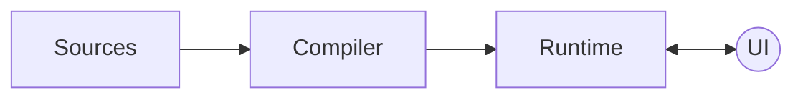
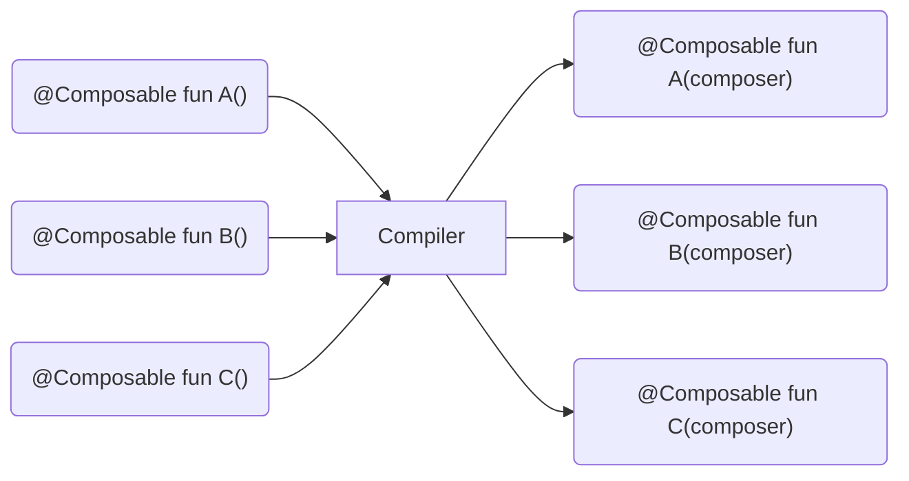

Compose는 여러 라이브러리로 이루어져 있지만, 이 책에서는 Compose 컴파일러, Compose 런타임, 그리고 Compose UI 세 가지에 중점을 두고 설명하겠습니다.

컴파일러와 런타임은 Compose의 핵심을 이루며, Compose UI는 Compose 아키텍쳐의 일부로 설계된 것은 아닙니다.  
컴파일러와 런타임은 특정 요구 사항을 준수하는 모든 클라이언트 라이브러리에서 사용될 수 있도록 설계되었습니다.  
여기서 Compose UI는 사용 될 수 있는 클라이언트 라이브러리 중 하나일 뿐이며, JetBrains는 데스크톱 및 웹을 위한 다른 클라이언트 라이브러리도 개발 중입니다.
그럼에도 Compose UI를 이해하는 것은 컴포저블 트리의 메모리 내 표현이 어떻게 런타임으로 전달되며, 나중에 어떻게 실제 UI 요소로 구현되는지 파악하는데 도움이 됩니다.



처음 Compose를 사용하면, 요소들이 어떤 순서로 작동하는지에 대해 다소 혼란스얼 수 있습니다.  
지금까지는 컴파일러와 런타임이 협력하여 라이브러리의 모든 기능을 구현한다고 설명했지만, 이 개념이 익숙하지 않다면 다소 추상적으로 느껴질 수 있습니다.  
이 때문에 챕터 2에서는 다음을 설명 할 예정입니다.

- Compose 컴파일러가 소스 코드를 어떻게 런타임 요구 사항에 맞추는지
- 런타임이 어떻게 작동하는지
- 초기 컴포지션과 리컴포지션이 언제 발생하는지
- 메모리 내 트리 표현이 어떻게 전달되고 사용되는지

위 개념을 이해하게 되면 라이브러리가 어떻게 작동하는지에 대한 전반적인 흐름을 파악하고, 코딩 중에 무엇을 기대할 수 있을지에 대한 통찰을 얻을 수 있습니다.

## A Kotlin compiler plugin

Compose는 코드 생성에 약간 의존합니다.   
보통 Kotlin과 JVM 환경에서는 **kapt**를 통한 어노테이션 프로세서를 사용하는데, Compose는 이와 다릅니다.  
실제로 Compose 컴파일러는 Kotlin 컴파일러 플러그인으로 작동하며, 이를 통해 컴파일 단계에서 코드를 직접 처리할 수 있는 기능을 제공합니다.  
이 방식은 코드 구조에 대한 더 많은 정보를 활용할 수 있으며, 컴파일 속도를 높이는데 도움이 됩니다.  
**kapt**가 컴파일 이전에 실행되는 것과 달리, 컴파일러 플러그인은 **컴파일 프로세스 내에서 직접 인라인 처리**됩니다.

Kotlin 컴파일러 플러그인으로서 Compose는 컴파일러의 프론트엔드 단계에서 진단을 보고할 수 있어, 빠른 피드백 루프를 제공합니다.  
다만, 이러한 진단은 IDE에서는 바로 확인할 수 없습니다. 이는 IDEA가 Compose 컴파일러 플러그인과 직접 통합되지 않았기 때문입니다.  
현재 Compose에서 사용 가능한 IDEA 검사 기능은 별도의 IDEA 플러그인을 통해 추가된 것이며, Compose 컴파일러 플러그인과는 별도의 코드로 운영됩니다.  
그럼에도 불구하고, 프론트엔드 진단은 컴파일 버튼을 누르면 즉시 보고됩니다.   
프론트엔드 단계에서의 정적 분석은 피드백 루프를 개선하는데 중요한 역할을 하며, Compose 컴파일러는 이를 적극적으로 활용합니다.

Kotlin 컴파일러 플러그인의 또 다른 큰 장점은 기존 소스를 자유롭게 수정할 수 있다는 점입니다. (어노테이션 프로세서가 새로운 코드를 추가하는 것과는 다름)    
컴파일러 플러그인은 소스 코드의 출력 IR을 수정할 수 있으며, 그 후 이를 플랫폼에서 지원하는 기본 요소로 변환할 수 있습니다.  
여기서 중요한 점은 Koltin이 멀티플랫폼을 지원한다는 점입니다. 이러한 특징 덕분에 Compose 컴파일러는 런타임 요구사항에 맞춰 **컴포저블을 변형**할 수 있게 됩니다.

Kotlin에서 컴파일러 플러그인은 앞으로도 많은 발전 가능성이 있습니다.  
현재 사용되고 있는 여러 어노테이션 프로세서들이 점차 컴파일러 플러그인이나 KSP를 사용한 "경량" 컴파일러 플러그인으로 전환될 가능성이 높습니다.

> Kotlin 컴파일러 플러그인에 관심이 있다면 kapt 대안으로 제안된 ksp 라이브러리를 확인하는 것을 추천합니다.  
> ksp는 "경량 컴파일러 플러그인"을 작성할 수 있는 표준화된 DSL을 제공하며, 이를 통해 메타프로그래밍에 의존하는 라이브러리를 쉽게 작성할 수 있습니다.
> 
> 또 하나 기억할 점은, Compose 컴파일러가 IR 변환에 크게 의존한다는 점입니다.  
> 만약 메타프로그래밍에서 IR 변환이 지나치게 널리 사용된다면, 너무 많은 IR 변환이 발생하여 언어를 불안정하게 만들 수 있습니다.  
> 언어를 변경하거나 확장하는 것은 항상 리스크를 동반하며, 이러한 이유로 KSP가 전반적으로 더 나은 선택일 수 있습니다.

## Compose annotations

순서로 돌아가서, 먼저 코드를 어떻게 어노테이트해야 컴파일러가 필요한 요소를 스캔하고 처리할 수 있는지 살펴봐야 합니다.  
이를 위해 Compose에서 제공하는 어노테이션을 알아보겠습니다.

컴파일러 플러그인은 어노테이션 프로세서보다 훨씬 더 많은 작업을 수행할 수 있지만, 두 방식 모두 프론트엔드 단계에서 정적 분석과 유효성 검사를 수행하는 공통점이 있습니다. 

Compose 컴파일러는 Kotlin 컴파일러의 프론트엔드에서 훅과 확장 포인트를 사용하여, 원하는 제약 조건들이 충족되었는지 확인하고, 
타입 시스템이 `@Composable` 함수, 선언, 또는 표현식을 비-컴포저블과 구분하여 올바르게 처리하는지 검증합니다.

또한, Compose는 추가적인 검사를 실행하고 런타임 최적화 또는 "단축키"를 제공하기 위한 보조 어노테이션도 제공합니다.  
모든 어노테이션은 Compose 런타임 라이브러리에서 제공됩니다.

> 컴파일러와 런타임 모듈 모두가 Compose 어노테이션을 잘 활용하기 때문에 모든 어노테이션은 Compose 런타임에서 제공됩니다.

### @Composable

이 어노테이션은 챕터 1에서 자세히 다루었지만, 가장 중요한 어노테이션이기에 독립적인 섹션으로 다루어야 합니다.

Compose 컴파일러와 일반 어노테이션 프로세서의 가장 큰 차이는 Compose가 어노테이션이 적용된 선언이나 표현식을 **변경**할 수 있다는 점입니다.  
대부분의 어노테이션 프로세서는 이를 수행할 수 없고, 대신 별도의 선언을 생성하거나 기존 선언 옆에 추가해야 합니다.  
그렇기 때문에 Compose 컴파일러는 IR 변환을 사용합니다. 
실제로 `@Composable` 어노테이션은 함수의 **타입을 변경**하며, 컴파일러 플러그인은 프론트엔드에서 다양한 규칙을 적용하여 컴포저블과 비-컴포저블이 동일하게 처리되지 않도록 보장합니다.

`@Composable` 어노테이션은 선언이나 표현식의 타입을 변경하여, 해당 요소에 "메모리" 기능을 부여합니다.  
이를 통해 `remember`를 호출하고 Composer와 슬롯 테이블을 활용할 수 있습니다.  
또한, 컴포저블 내에서 실행되는 이펙트는 라이프사이클을 가지며, 여러 번의 리컴포지션 동안 작업을 지속할 수 있습니다.
컴포저블은 고유한 아이덴티티를 부여받아 트리에서 특정 위치를 차지하며, 이를 통해 컴포지션에 노드를 발행하거나 `CompositionLocals`에 접근할 수 있습니다.

> 컴포저블은 데이터를 트리의 노드로 매핑하며, 실행 시 이 노드를 트리에 발행합니다.  
> 이 노드는 UI 노드일 수도 있고, Compose 런타임을 소비하는 라이브러리에 따라 다른 성격의 노드일 수도 있습니다.  
> Compose 런타임은 특정한 사용 사레나 시맨틱에 얽매이지 않는 **제네릭 노드 타입**을 사용하여 작동합니다.

### @ComposeCompilerApi

이 어노테이션은 Compose에서 컴파일러 전용으로 사용되는 부분을 표시하는데 사용됩니다.  
이는 사용자들에게 해당 요소가 주로 컴파일러에서 사용되며, 신중하게 사용해야 한다는 점을 알려줍니다. 

### @InternalComposeApi

Compose에서 내부적으로 사용되는 API를 표시하는 어노테이션으로, 이 API는 내부적으로 변경될 수 있는 가능성이 있습니다.   
이러한 API는 공개 API와는 다르게 관리되며, 공개 API는 안정적인 릴리스 동안 변경되지 않지만, 내부 API는 계속 변화할 수 있음을 의미합니다.

이 어노테이션은 Kotlin의 `internal` 키워드보다 넓은 스코프를 가지며, 모듈 간 사용을 허용합니다.  
Kotlin 자체는 모듈 간 `internal` 사용을 지원하지 않으므로, 이 부분에서 차이가 있습니다.

### @DisallowComposableCalls

이 어노테이션은 함수 내부에서 컴포저블 호출을 방지하는데 사용됩니다.  
특히, `inline` 람다 파라미터에서 컴포저블 호출이 안전하지 않는 경우에 유용합니다.  
또한, 리컴포지션마다 호출되지 않는 람다에 적용하는 것이 적합합니다.

예를 들어, `remember` 함수에서 이 원칙을 확인할 수 있습니다.  
`remember`는 `calculation` 블록에서 생성된 값을 초기 컴포지션에서만 평가하고, 이후 리컴포지션에서는 이전에 생성된 값을 그대로 반환합니다. 

```kotlin
// Composables.kt
@Composable
inline fun <T> remember(
  calculation: @DisallowComposableCalls () -> T
): T =
    currentComposer.cache(false, calculation)
```

`calculation` 람다 내부에서는 이 어노테이션 덕분에 컴포저블 호출이 금지됩니다.  
만약 호출이 허용된다면, 호출 시 슬롯 테이블에 불필요한 공간을 차지하게 되며, 첫 번재 컴포지션 이후에는 이 람다가 더 이상 호출되지 않기 때문에 슬롯이 폐기될 것입니다.

이 어노테이션은 주로 조건부로 호출되는 인라인 람다에 사용되며, 이 람다는 컴포저블처럼 "alive" 하지 않아야 합니다.  
인라인 람다는 부모 호출 컨텍스트의 컴포저블 능력을 자동으로 상속받기 때문에, 경우에 따라서는 이를 제한할 필요가 있습니다.  
예를 들어, `forEach`의 람다는 `@Composable`로 선언되지 않지만, 컴포저블 함수 내부에서 `forEach`가 호출될 때는 컴포저블 함수를 사용할 수 있습니다.  
이는 `forEach` 같은 `inline` API에서는 유용하지만, `remember` 같은 경우에는 부적합하기 때문에 이 어노테이션이 필요합니다.

이 어노테이션은 "전염성"이 있어, `@DisallowComposableCalls`로 표시된 인라인 람다 내부에서 다른 인라인 람다를 호출하는 경우, 
컴파일러는 해당 람다에도 `@DisallowComposableCalls`를 표시해야 한다고 요구합니다.

짐작했겠지만, 이 어노테이션은 일반적인 클라이언트 프로젝트에서는 거의 사용할 일이 없습니다.  
하지만, Compose UI 이외의 목적으로 Compose를 사용하는 경우라면 이 어노테이션이 중요한 역할을 할 수 있습니다.  
이 경우, Compose 런타임에 맞춘 독자적인 클라이언트 라이브러리를 작성해야 하며, 이 과정에서 런타임 제약을 충족시켜야 할 수도 있습니다.

### @ReadOnlyComposable

`@ReadOnlyComposable`은 해당 컴포저블이 컴포지션에 쓰기 작업을 수행하지 않고, 오직 읽기만 한다는 사실을 명시합니다.  
이 규칙은 컴포저블 본문 내 중첩된 모든 컴포저블 호출에서도 동일한 제약이 적용되어야 합니다.  
이 제약 조건이 지켜진다면, 런타임은 불필요한 코드 생성을 피하고 최적화할 수 있습니다. 

컴포지션에 쓰기 작업을 수행하는 컴포저블의 경우, 컴파일러는 해당 컴포저블의 본문을 래핑하는 "그룹"을 생성합니다.  
이 그룹은 런타임에 발행되어 컴포지션이 리컴포지션 시, 데이터를 대체하거나 이동할 때 컴포저블의 아이덴티티를 유지하면서 적절하게 처리할 수 있도록 정보를 제공합니다.  
생성 가능한 그룹의 종류에는 restartable 그룹, movable 그룹 등이 있습니다.

"그룹"이 무엇인지 더 잘 이해하기 위해, 특정 텍스트 범위의 시작과 끝을 가리키는 포인터를 떠올려 보겠습니다.  
모든 그룹은 소스 위치에 대한 키를 가지고 있으며, 이 키는 그룹을 저장하고, 위치 기반 메모이제이션을 가능하게 합니다.  
이를 통해 컴포지션은 조건문에서 서로 다른 컴포저블 간의 아이덴티티를 구분할 수 있습니다:

```kotlin
if (condition) Text("Hello") 
else Text("World")
```

이 둘은 모두 `Text`이지만, 호출자에게는 서로 다른 의미를 나타내므로, 서로 다른 아이덴티티를 가집니다.  
movable 그룹은 시맨틱 아이덴티티 키를 가지고 있어, 부모 그룹 내에서 재배열할 수 있습니다.

컴포저블이 컴포지션에 쓰기 작업을 수행하지 않으면, 데이터가 교체되거나 이동될 필요가 없기에 "그룹"을 생성할 필요가 없습니다.  
이와 같은 상황에서 `@ReadOnlyComposable`은 불필요한 그룹 생성을 방지하는데 도움이 됩니다.

Compose 라이브러리 내에서 읽기 전용 컴포저블의 예시로는 `CompositionLocal`의 기본값이나 이를 위임하는 유틸리티가 포함될 수 있습니다:

- Material의 `Colors`, `Typography`
- `isSystemInDarkTheme()`, `LocalContext`, `LocalConfiguration`
- 애플리케이션의 다양한 `resources` 호출 (모두 `LocalContext`에 의존)

일반적으로 이들은 프로그램 실행 중 한 번만 설정되고, 동일하게 유지되며 트리의 컴포저블에서 읽을 수 있어야 하는 것들입니다.

### @NonRestartableComposable

`@NonRestartableComposable`을 사용하면 함수나 프로퍼티 `getter`를 재시작할 수 없는 컴포저블로 만듭니다.    
(참고로, 모든 컴포저블이 기본적으로 재시작 가능한 것은 아니며, `inline` 컴포저블이나 반환 타입이 `Unit`이 아닌 컴포저블은 재시작되지 않습니다.)

이 어노테이션이 추가되면, 컴파일러는 해당 함수가 리컴포지션 중 재실행되거나 스킵될 수 있도록 하는 보일러플레이트 코드를 생성하지 않습니다.   
이 어노테이션은 재시작되지 않더라도 큰 영향이 없는 매우 작은 함수에만 드물게 사용되어야 하며, 
이러한 함수는 부모 컴포저블의 리컴포지션에 의해 자연스럽게 갱신될 가능성이 높기 때문에 스스로 무효화될 필요가 없습니다.   

"정확성"을 위해 이 어노테이션을 사용할 필요는 거의 없으며, 오히려 특정 상황에서 성능을 약간이라도 최적화하려는 경우에 사용할 수 있습니다.

### @StableMarker

Compose 런타임은 타입의 안정성을 나타내기 위해 `@StableMarker` 메타-어노테이션, `@Immutable`, `@Stable` 어노테이션을 제공합니다.  

`@StableMarker`은 다른 어노테이션(`@Immutable`, `@Stable`)을 표시하는 메타-어노테이션입니다.  
이 어노테이션은 재사용성을 염두하여 설계된 것으로, `@StableMarker`가 적용된 모든 어노테이션은 동일한 의미와 특성을 가지게 됩니다.

```kotlin
@StableMarker
annotation class Immutable

@StableMarker
annotation class Stable
```

`@StableMarker`이 적용된 타입은 다음과 같은 데이터 안정성 조건을 요구합니다:

- 동일한 두 인스턴스에 대해 `equals` 호출의 결과는 항상 동일해야 합니다.
- 해당 타입의 public 프로퍼티가 변경될 때마다 컴포지션이 항상 알림을 받습니다. 
- 해당 타입의 모든 public 프로퍼티도 안정적이어야 합니다.

`@Immutable` 또는 `@Stable`로 표시된 모든 타입은 `@StableMarker`로 인한 안정성 요구사항을 준수해야 합니다.  
즉, 이 어노테이션들은 타입의 안정성을 보장하기 위한 마커 역할을 합니다.

이 조건들은 컴파일러에게 제공하는 약속이라는 점을 주목해야 합니다.  
컴파일러가 소스를 처리할 때 이러한 가정을 바탕으로 최적화를 수행할 수 있지만, **컴파일 시점에서 이 조건들이 검증되지는 않습니다.**  
따라서 위 요구사항을 충족하는 여부는 개발자가 직접 책임지고 관리해야 합니다.

그렇다고는 해도, Compose 컴파일러는 특정 타입이 안정성 요구사항을 만족하는지 스스로 추론하고, 별도의 어노테이션 없이도 해당 타입을 안정적인 것으로 처리하려고 합니다.
이러한 방식이 더 정확할 때가 많지만, 아래 두 가지 상황에서는 직접 어노테이션을 사용하는 것이 중요합니다:

- 인터페이스나 추상 클래스에서 요구하는 계약/기대사항을 나타내는 경우.
  - 이 경우, 어노테이션을 사용하면 해당 인터페이스나 추상 클래스를 구현하는 모든 클래스에 대해 안정성 조건을 준수해야 한다는 명시적인 요구 사항을 전달할 수 있습니다.
  - 어노테이션이 없는 경우, 구현 클래스의 안정성 조건을 컴파일러가 검증하지 못할 수 있습니다. 이 때, 직접 어노테이션을 사용하면 이러한 구현 오류를 방지할 수 있습니다.
- 구현체가 가변적이지만, 안정성의 전제 하에 안전하게 사용될 수 있는 경우.
  - 예를 들어, 내부적으로 캐시를 유지하기 위해 가변 상태를 가지는 타입이 있을 경우, 이 타입의 public API가 캐시 상태와 독립적일 때, 직접 어노테이션을 사용하면 컴파일러가 이 타입을 안정적으로 처리하도록 보장할 수 있습니다.

### @Immutable

```kotlin
@Target(AnnotationTarget.CLASS)
@Retention(AnnotationRetention.BINARY)
@StableMarker
annotation class Immutable
```

이 어노테이션은 클래스에 적용되어, 생성된 이후에는 모든 public 프로퍼티와 필드가 변경되지 않을 것이라는 엄격한 약속을 컴파일러에게 전달합니다.  
이 약속은 Kotlin의 `val` 키워드보다 더 강력한 약속입니다.   
`val`은 setter를 통한 프로퍼티의 재할당을 방지하지만, 가변 데이터를 참조할 수 있어, 결과적으로 프로퍼티 자체는 변경되지 않지만 데이터는 변경될 수 있습니다.  
이는 Compose 런타임의 기대와는 맞지 않습니다. 따라서 Kotlin에서 불변성을 보장하는 메커니즘을 제공하지 않기에, Compose에서는 이 어노테이션을 통해 이를 보완합니다.

초기화 이후 값이 절대 변경되지 않는다는 가정하에, 런타임은 '스마트 리컴포지션'과 '리컴포지션 스킵' 기능을 최적화할 수 있습니다.

`@Immutable`로 안전하게 표시될 수 있는 좋은 예시는 모든 프로퍼티가 `val`로 선언된 `data class` 입니다.  
이 경우, 프로퍼티 중 어느 것도 커스텀 getter를 사용하지 않아야 합니다. 그렇지 않으면 매 호출마다 다른 값을 반환할 가능성이 있어 안정적이지 않은 API가 될 수 있습니다.  
또한, 모든 프로퍼티가 원시 타입(primitive)이거나, `@Immutable`로 표시된 타입이어야 합니다.

`@Immutable`은 `@StableMarker`로도 표시되기 때문에, 이와 관련된 모든 의미를 동일하게 상속받습니다.   
불변으로 간주되는 타입은 항상 `@StableMarker`의 조건을 준수하므로, 해당 타입의 public 값은 절대 변경되지 않습니다.  
`@Immutable`은 불변 타입을 안정적(stable)로 표시하기 위해 사용됩니다.

> 추가적으로, 불변 타입은 값이 변경되더라도 컴포지션에 알림을 보내지 않는다는 점을 유의할 필요가 있습니다.  
> 이는 `@StableMarker`에 나열된 요구 사항 중 하나지만, 불변 타입은 값이 바뀌지 않기 때문에 이를 알릴 필요가 없으며, 결과적으로 제약 조건을 충족합니다.

### @Stable

```kotlin
@Target(
    AnnotationTarget.CLASS,
    AnnotationTarget.FUNCTION,
    AnnotationTarget.PROPERTY_GETTER,
    AnnotationTarget.PROPERTY
)
@Retention(AnnotationRetention.BINARY)
@StableMarker
annotation class Stable
```

`@Stable`은 `@Immutable`보다 가벼운 약속으로, 적용되는 언어 요소에 따라 의미가 달라집니다.

이 어노테이션이 타입에 적용될 경우, 해당 타입은 **가변적**이라는 의미입니다. (가변적이지 않다면 `@Immutable`을 사용할 것입니다.)  
이 경우, `@StableMarker`의 의미만 상속받게 됩니다.

하지만 함수나 프로퍼티에 적용될 때는 동일한 입력에 대해 항상 동일한 결과를 반환하는 순수 함수임을 컴파일러에게 알립니다.  
이는 함수의 파라미터들이 `@Stable`, `@Immutable`, 또는 원시 타입(primitive type)일 때만 가능합니다. 이러한 타입들은 안정적으로 간주됩니다.

문서에서 이 어노테이션이 얼마나 중요한 역할을 하는지 잘 설명된 예시가 있습니다:  
컴포저블에 전달되는 모든 파라미터 타입이 안정적인 경우, 위치 기반 메모이제이션을 통해 동등성을 비교하며, 모든 값이 이전 호출과 값이 동일하다면 호출이 스킵됩니다.

`@Stable`로 표시될 수 있는 타입의 좋은 예는, public 프로퍼티가 변경되진 않지만 완전히 불변으로 볼 수 없는 객체입니다.  
예를 들어, private 가변 상태를 가지거나, `MutableState` 객체에 프로퍼티 위임을 사용하지만, 외부에서 사용될 때는 불변적인 경우입니다. 

다시 강조하자면, 이 어노테이션의 효과는 Compose 컴파일러와 런타임이 데이터를 어떻게 다룰지를 예측하고, 필요한 경우 최적화를 적용하는데 중요한 역할을 합니다.  
따라서, 이 어노테이션을 사용할 때는 그 의미와 조건을 완전히 이해하고 있을 때만 사용해야 합니다.   
그렇지 않다면 컴파일러에게 잘못된 정보를 제공하게 되고, 이는 쉽게 런타임 오류로 이어질 수 있습니다.  
이러한 이유로, 이 어노테이션들은 필요할 때만 신중하게 사용하는 것을 권장합니다.

> 흥미로운 점은 `@Immutable`과 `@Stable`이 서로 다른 의미와 약속을 가지고 있지만,  
> Compose 컴파일러는 두 어노테이션을 동일하게 취급하여 스마트 리컴포지션 및 리컴포지션 스킵을 활성화하고 최적화합니다.  
> 그러나 두 어노테이션이 존재하는 이유는 가까운 미래에 컴파일러와 런타임이 구분해서 활용할 수 있는 가능성을 열어두기 위함입니다.

## Registering Compiler extensions

런타임에서 제공하는 중요한 어노테이션들을 살펴본 후, 이제는 Compose 컴파일러 플러그인의 동작 방식과 이 어노테이션들을 어떻게 사용하는지 이해할 차례입니다.

Compose 컴파일러 플러그인은 가장 먼저 `ComponentRegistrar`라는 메커니즘을 통해 Kotlin 컴파일러 파이프라인에 자신을 등록합니다.  
`ComposeComponentRegistrar`는 다양한 목적을 가진 컴파일러 확장(extension)을 등록하며, 이 확장들은 라이브러리 사용을 돕고 런타임에 필요한 코드를 생성하는 역할을 합니다. 
이렇게 등록된 모든 확장들은 Kotlin 컴파일러와 함께 실행됩니다.

Compose 컴파일러는 활성화된 컴파일러 플래그에 따라 몇 가지 확장 기능을 추가로 등록합니다.  
Compose를 사용하는 개발자들은 몇 가지 컴파일러 플래그를 활성화하여 다음과 같은 기능을 사용할 수 있습니다.

- 라이브 리터럴(live literals)
- 생성된 코드에 소스 정보를 포함하여 IDE 및 다른 도구들이 컴포지션을 검사하는 기능
- `remember`에 대한 최적화
- Kotlin 버전 호환성 검사 억제
- IR 변환 과정에서 디코이 메서드 생성

## Static analysis

Compose 컴파일러는 일반적인 컴파일러 플러그인처럼, 가장 먼저 린트(linting) 작업을 수행합니다.  
정적 분석은 소스 코드를 스캔하여 라이브러리 어노테이션을 찾고, 이들이 런타임이 기대하는 방식대로 올바르게 사용되었는지 확인하는 검사를 수행합니다.  
이 과정에서 발생하는 경고나 오류는 컨텍스트 트레이스(context trace)를 통해 보고됩니다.  

컨텍스트 트레이스는 IDEA와 잘 통합되어 있어, 개발자가 코드를 작성할 때 경고나 오류를 인라인으로 표시할 수 있습니다.  
앞서 언급했듯, 이러한 모든 검증은 컴파일러의 프론트엔드 단계에서 이루어지며, Compose가 개발자에게 신속한 피드백 루프를 제공할 수 있도록 돕습니다.

이제 수행되는 가장 중요한 몇 가지 정적 검사를 살펴보겠습니다.

## Static Checkers

컴파일러에 등록된 확장 기능 중 일부는 정적 검사기 형태로 제공되어, 개발자가 코드를 작성할 떄 도움을 줍니다.  
Compose는 호출, 타입, 선언에 대한 검사를 수행하는 정적 검사기를 확장 기능으로 등록하며, 이를 통해 라이브러리의 올바른 사용을 보장합니다.   
예를 들어, [Chapter1에서 배운 컴포저블의 요구 사항](Chapter%201%20%3A%20Composable%20functions.md#composable-requirements)을 이 단계에서 검증하고, 위반 시 오류를 보고하는 기능을 제공합니다.

Kotlin 컴파일러에는 클래스 인스턴스화, 타입, 함수 호출, deprecated 호출, contracts, 클로저 내 캡처, infix 호출, coroutine 호출, operator 호출 등 다양한 요소를 검사할 수 있는 여러 타입의 분석기가 존재합니다. 
이 분석기는 컴파일러 플러그인이 소스 코드를 분석하고 필요한 정보나 경고, 오류를 보고할 수 있도록 합니다.

모든 정적 검사기는 Kotlin 컴파일러의 프론트엔드 단계에서 실행되므로, 매우 빠르고 CPU 사용량이 낮아야 합니다.  
이러한 검사기는 개발자가 코드를 입력하는 동안 실행되기에, 원활한 사용자 경험을 제공하기 위해 가벼운 검사기를 구현하는 것이 중요합니다.

## Call checks

Compose에서 등록된 다양한 검사기 중 하나는 호출을 검증하는데 사용됩니다.  
Compose 컴파일러는 다양한 상황에서 컴포저블 호출을 검증하기 위해 정적 호출 검사를 수행합니다.  
예를 들어, `@DisallowComposableCalls` 또는 `@ReadOnlyComposable` 범위 내에서 컴포저블이 호출되는 것을 검증합니다.

호출 검사기는 코드베이스 전반의 모든 호출을 정적 분석하기 위해 사용되는 컴파일러 확장 기능입니다.  
이 확장은 호출로 간주되는 모든 PSI 요소를 방문하기 위해 재귀적으로 호출되는 `check` 함수를 제공하며, 이는 PSI 트리의 모든 노드를 방문하는 방식으로 동작합니다.    
이는 방문자 패턴(visitor pattern)의 구현이라고 할 수 있습니다.

이러한 검사 중 일부는 현재 탐색 중인 언어 요소 외에도 더 넓은 컨텍스트를 필요로 할 수 있습니다.  
예를 들어, 컴포저블 호출 지점과 같은 정보를 파악해야 할 때가 있습니다. 이를 위해선 단순히 하나의 PSI 노드를 분석하는 것만으로는 부족할 수 있습니다.   
이때 컴파일러는 다양한 요소를 방문하면서 작은 정보의 조각들을 모아 전체적인 흐름을 이해하고, 이후의 검증에 활용할 수 있도록 정보를 컨텍스트 트레이스에 기록합니다.   
이 방법은 검사의 범위를 넓혀 람다 표현식, try/catch 블록 등 관련 요소를 더 쉽게 찾을 수 있게 됩니다.

다음은 컴파일러 호출이 컨텍스트 트레이스에 관련 정보를 기록하고, `@DisallowComposableCalls`로 표시된 컨텍스트 내에서 컴포저블 호출이 발생할 때 오류를 보고하는 예시입니다:

```kotlin
if (arg?.type?.hasDisallowComposableCallsAnnotation() == true) {
    context.trace.record(
        ComposeWritableSlices.LAMBDA_CAPABLE_OF_COMPOSER_CAPTURE, 
        descriptor, // reference to the function literal
        false
    )

    context.trace.report(
        ComposeErrors.CAPTURED_COMPOSABLE_INVOCATION.on(
            reportOn,
            arg,
            arg.containingDeclaration
        )
    )
    return
}
```

> 컨텍스트와 컨텍스트 트레이스는 `check` 호출 시 언제나 사용할 수 있으며, 이 트레이스를 통해 오류, 경고, 정보 메시지를 보고할 수 있습니다.  
> 트레이스는 전체 분석 과정에서 중요한 정보를 기록하고 전달할 수 있는 가변적인 구조로 이해할 수 있습니다. 

다른 검사들은 더 단순하게 동작하며, 현재 방문 중인 요소에서 얻을 수 있는 정보만으로 충분합니다. 이러한 검사들은 요소를 분석한 후 필요한 작업을 수행하고 반환합니다.  
각 `check` 호출에서, 플러그인은 현재 노드의 타입을 확인한 다음, 그에 맞게 검사를 수행하고 결과를 반환하거나, 
필요한 경우 오류를 보고하고, 관련 정보를 컨텍스트 트레이스에 기록하거나, 부모 노드로 이동해 추가적인 노드를 방문하면서 더 많은 정보를 수집합니다.
이 과정에서 다양한 어노테이션에 대한 여러 가지 검사들이 이루어집니다.

Compose 컴파일러는 컴포저블이 지원되지 않는 위치에서 호출되지 않았는지 검사합니다.  
예를 들어, try/catch 블록 내부나, 컴포저블로 어노테이션되지 않은 함수, `@DisallowComposableCalls`로 표시된 람다에서 호출되지 않도록 합니다.

컴파일러는 각 컴포저블 호출에 대해 PSI 트리를 따라 호출자의 호출자까지 거슬러 올라가며, 모든 호출 조건이 충족되는지 확인합니다.   
부모 요소는 람다 표현식, 함수, 프로퍼티, 프로퍼티 접근자, try/catch 블록, 클래스, 파일 등 다양한 구조일 수 있으므로, 모든 가능성을 고려하여 검증합니다.

> PSI(Program Structure Interface)는 컴파일러의 프론트엔드 단계에서 언어의 구조를 모델링합니다.  
> 따라서, PSI가 코드를 이해하는 방식은 완전히 문법적이고 정적이라는 점을 명심해야 합니다.

이러한 검사에서는 `inline` 함수도 고려해야 합니다. 컴포저블이 `inline` 람다 내에서 호출될 때, 해당 람다의 호출자도 컴포저블인 경우에만 허용됩니다.  
컴파일러는 컴포저블을 호출하는 모든 `inline` 람다가 호출 스택 상위에서 컴포저블로 감싸져 있는지 확인합니다.

또한, 컴파일러는 필요한 위치에 누락된 `@Composable`을 감지하여 개발자에게 이를 추가하도록 제안할 수 있습니다.  
예를 들어, 컴포저블이 람다 내에서 호출될 때, 컴파일러는 해당 람다에도 `@Composable`을 추가하라는 제안을 할 수 있습니다.    
이러한 정적 분석 검사는 단순히 오류를 제한하는 것이 아닌, 개발자가 코드 작성 시 더 나은 결정을 내릴 수 있도록 유도하는 역할도 합니다.

`@ReadOnlyComposable`로 표시된 컴포저블은 다른 읽기 전용 컴포저블만 호출할 수 있습니다.  
그렇지 않으면 최적화 계약을 위반하게 되는데, 이 규칙은 읽기 전용 컴포저블이 컴포지션에서 읽기만 하고 절대 쓰지 않는다는 계약을 위반하게 됩니다.  
이러한 조건은 컴포저블의 모든 레벨에서 충족되어야 하므로, 방문자 패턴이 유용하게 사용됩니다.

또한, 컴포저블 참조 사용을 금지하는 검사도 있으며, 이는 현재 Compose에서는 지원되지 않습니다.

## Type checks

때로는 함수뿐만 아니라 타입에도 `@Composable` 어노테이션을 사용합니다.  
이를 위해 Compose 컴파일러는 타입 추론과 관련된 검사를 통해, `@Composable`로 어노테이션된 타입이 필요할 떄 그렇지 않은 타입이 사용된 경우 오류를 보고합니다.  
이는 앞서 언급한 함수 호출 검사와 유사한 방식입니다.  
오류 메시지에는 추론된 타입과 기대되는 타입이 각각의 어노테이션과 함께 표시되어, 차이를 명확하게 보여줍니다.

## Declaration checks

호출 지점과 타입에 대한 검사 외에도 Compose 컴파일러는 선언(declaration)에 대한 검사도 수행합니다.  
이 검사는 Compose 코드베이스의 일부인 프로퍼티, 프로퍼티 접근자, 함수 선언, 함수 파라미터 등을 분석합니다.

프로퍼티, 프로퍼티 getter, 함수는 `@Composable`로 어노테이트 되어 있어도, 재정의(override)될 수 있습니다.  
이 요소들이 재정의될 때도, Compose 컴파일러는 일관성을 유지하기 위해서 재정의된 요소에도 `@Composable`로 어노테이트 되어 있는지 확인하는 검사를 수행합니다.

또 다른 선언 검사는 컴포저블이 suspend로 선언되지 않도록 하는 것이며, 이는 현재 지원되지 않기에 금지됩니다.  
Chapter1에서 설명한 것처럼, suspend는 `@Composable`과 다른 의미를 가지며, 두 개념 모두 언어의 기본 요소로 이해될 수 있지만, 완전히 다른 용도로 설계되었습니다.
현재로서는 두 개념을 함께 사용하는 것이 지원되지 않습니다.

또한, `@Composable`로 어노테이트된 `main` 함수, 프로퍼티의 백킹 필드(backing field)에 `@Composable`을 어노테이트하는 행동들은 선언 검사를 통해 금지됩니다.

## Diagnostic suppression

컴파일러 플러그인은 확장 기능으로 진단 억제기(diagnostic suppressor)를 등록하여 특정 상황에서 진단 메시지(e.g : 정적 검사에 의해 보고된 오류 등)를 무시할 수 있습니다.  
이는 일반적으로 Kotlin 컴파일러가 허용하지 않는 코드를 컴파일러 플러그인이 생성하거나 지원하려 할 때, 해당 검사를 우회하여 코드를 작동시키기 위해 사용됩니다.

Compose는 Kotlin 언어 제한을 우회하기 위해 `ComposeDiagnosticSuppressor`를 등록하여 컴파일 오류를 피하고, 특정 사용 사례를 실행할 수 있습니다.

Kotlin 언어 제한 중 하나는 호출 지점에서 "non-source annotations"로 어노테이트된 인라인 람다에 대한 것입니다.  
`BINARY` 또는 `RUNTIME` 유지 정책(retention)을 가진 어노테이션들은 컴파일 후에도 바이너리에 남아있습니다.  
반면, `SOURCE` 어노테이션은 컴파일 시점에서만 존재하고 이후에는 사라집니다.

인라인 람다는 컴파일할 때 호출한 함수에 실제 코드로 삽입되므로, 어디에도 저장되지 않아서 어노테이션을 달 수 있는 대상이 없어집니다.
그래서 Kotlin 컴파일러는 인라인 람다에 `BINARY` 또는 `RUNTIME` 어노테이션을 달 수 없게하고, 다음과 같은 오류를 보고 합니다:   
"The lambda expression here is an inlined argument so this annotation cannot be stored anywhere."

위 오류를 트리거하는 예시 코드 입니다:

```kotlin
@Target(AnnotationTarget.FUNCTION)
annotation class FunAnn

inline fun myFun(a: Int, f: (Int) -> String): String = f(a)

fun main() {
    myFun(1) @FunAnn { it.toString() } // Call site annotation
}
```

Compose 컴파일러는 `@Composable`로 어노테이된 경우에만, 위와 같은 오류를 우회할 수 있게하여 다음과 같이 코드를 작성할 수 있습니다:

```kotlin
@Composable
inline fun MyComposable(@StringRes nameResID: Int, resolver: (Int) -> String) {
    val name = resolver(nameResID)
    Text(name)
}

@Composable
fun Screen() {
    MyComposable(R.string.app_name) @Composable { 
        LocalContext.current.resources.getString(it)
    }
}
```

위와 같이 람다 파라미터가 아닌 호출 지점에서 `@Composable` 어노테이트가 가능하기에, 함수를 선언할 때 반드시 `@Composable`을 어노테이트 할 필요가 없습니다.
이와 같은 방식으로 함수는 더 유연한 계약(contract)를 가질 수 있습니다.

또 다른 Kotlin 언어 제한은 억제기(suppressor)를 통해 우회되며, 
함수가 `@Composable`로 어노테이트된 경우에 Kotlin 컴파일러가 지원하지 않는 위치에서 명명된 인자(named argument)를 사용할 수 있는 것입니다.

```kotlin
interface FileReaderScope {
    fun onFileOpen(): Unit
    fun onFileClose(): Unit
    fun onLineRead(line: String): Unit
}

object Scope: FileReaderScope {
    override fun onFileOpen() = TODO()
    override fun onFileClose() = TODO()
    override fun onLineRead(line: String) = TODO()
}

@Composable
fun FileReader(
    path: String,
    content: @Composable FileReaderScope.(path: String) -> Unit
) {
    Column {
        // ...
        Scope.content(path)
    }
}
```

위 예시에서 `@Composable`를 제거하면, "Named arguments are not allowed for function types."와 같은 오류가 발생합니다.

이와 같은 요구 사항은 expected 클래스의 멤버와 같은 경우에도 억제됩니다.  
Compose는 멀티 플랫폼을 목표로 하므로, 런타임에서 컴포저블로 처리된 expect 함수와 프로퍼티를 반드시 지원해야 합니다.

## Runtime version check

정적 검사기(static checkers)와 진단 억제기(diagnostic suppressor)를 통해 코드를 검사하고, 오류를 보고하고, 오류를 우회할 수 있음을 확인했습니다.
그 다음은 코드 생성 직전에 가장 먼저 일어나는 작업인 Compose 런타임 버전을 확인하는 것입니다.
Compose 컴파일러는 최소한의 런타임 버전을 요구하기에, 사용 중인 런타임이 최신인지 확인하는 검사를 수행합니다. 
이 검사는 런타임이 누락되었거나 오랜된 경우를 감지할 수 있습니다.

단일 Compose 컴파일러 버전은 최소 지원 버전보다 높은 여러 런타임 버전을 지원할 수 있습니다.

앞서 [Kotlin 컴파일러 버전](#kotlin-compiler-version)을 검사하고, 또 다른 버전을 검사하는 것은 Compose 런타임 버전입니다.

## Code generation

마침내, 컴파일러가 코드 생성 단계로 넘어갑니다.  
이는 AP(annotation processor)와 컴파일러 플러그인이 공통으로 가지는 또 하나의 특징입니다.  
둘 모두 런타임 라이브러리가 사용할 편리한 코드를 생성하는데 자주 사용됩니다.

## The Kotlin IR

컴파일러 플러그인은 새로운 코드를 생성하는 것뿐만이 아니라, 소스 코드를 수정할 수 있습니다.  
소스 코드 수정이 가능한 이유는 컴파일러 플러그인이 최종 코드를 타겟팅하는 플랫폼용으로 생성하기 전에 언어의 IR(Intemediate Representation)에 접근할 수 있기 때문입니다. 

즉, 컴파일러 플러그인은 IR 단계에서 다음 작업을 할 수 있습니다.

- 파라미터 교체
- 새로운 파라미터 추가
- 코드를 "커밋"하기 전, 코드의 구조를 재구성

보통 이러한 작업은 Kotlin 컴파일러의 백엔드 단계에서 이루어집니다. 
그리고 예상할 수 있듯이, Compose는 각 컴포저블 호출에 암시적인 파라미터 Composer를 "주입"하기 위해 이러한 작업을 수행합니다. 

컴파일러 플러그인은 다양한 형식으로 코드를 생성할 수 있습니다.  
만약, JVM만을 대상으로 한다면 Java 바이트코드를 생성하는 것으로 생각할 수 있습니다.   
하지만, Kotlin 팀이 모든 IR 백엔드를 안정화하고 모든 플랫폼에 대해 단일 IR을 사용하도록 계획하고 리팩토링하고 있기 때문에 IR을 생성하는 것이 더 합리적입니다.
IR은 플랫폼에 구애받지 않는 언어 요소들의 표현으로 존재합니다.   
즉, IR을 생성하면 Compose에서 생성된 코드가 멀티플랫폼에서 동작할 가능성이 높아집니다.

Compose 컴파일러 플러그인은 Kotlin 컴파일러의 공통 IR 백엔드에서 제공하는 확장 기능인
`IrGenerationExtension`의 구현을 등록하여 IR을 생성합니다.

## Lowering

> "로우어링"은 컴파일러가 고수준 또는 고급 프로그래밍 개념을 더 낮은 수준의 원자적 개념으로 변환하는 것을 의미합니다. 
>
> 이는 Kotlin에서 일반적인 과정입니다. 
> Kotlin은 언어의 IR을 사용하여 고급 개념을 표현할 수 있으며, 이 개념들은 JVM 바이트코드, Javascript, LLVM의 IR, 또는 개발자들이 목표로하는 플랫폼으로 변환되기 전에 더 낮은 수준의 원자적 개념으로 변환되어야 합니다. 
> 
> Kotlin 컴파일러에는 이를 위한 로우어링 단계가 있으며, 이 단계는 일종의 정규화(normalization) 과정으로 이해될 수 있습니다.

Compose 컴파일러는 라이브러리에서 지원하는 일부 개념을 낮춰서 런타임이 이해할 수 있는 표현으로 정규화합니다.  
이러한 로우어링 과정이 컴파일러 플러그인의 실제 코드 생성 단계를 의미합니다.  
이 단계에서 컴파일러는 IR 트리의 모든 요소를 방문하고, 런타임 요구 사항에 따라 필요한 경우 IR을 조정합니다.

다음은 로우어링 단계 동안 발생하는 몇 가지 중요한 예시의 간략한 요약입니다:

- 클래스의 안정성을 추론하고, 이를 런타임에서 이해할 수 있도록 필요한 메타데이터를 추가합니다.
- 라이브 리터럴 표현식을 변환하여 가변 상태의 인스턴스에 접근하도록 함으로써, 소스 코드를 다시 컴파일하지 않고도 런타임에서 변경 사항을 반영할 수 있도록 합니다. (라이브 리터럴 기능)
- 모든 컴포저블에 Composer 파라미터를 주입하고, 이를 모든 컴포저블 호출에 전달합니다.
- 아래 작업을 위해 컴포저블 본문을 래핑합니다.
  - 제어-흐름(control-flow)을 위한 다양한 타입의 그룹 생성 (replaceable 그룹, movable 그룹 등)
  - 기본 인수(default argument) 지원을 구현하여, 생성된 그룹 내에서 실행될 수 있도록 합니다. (Kotlin의 기본 파라미터 지원에 의존하지 않음.)
  - 함수가 재구성을 건너뛸 수 있도록 가르칩니다.
  - 상태 변경 관련 정보를 트리 아래로 전달하여, 상태 변경 시 자동으로 재구성될 수 있도록 합니다.

이제 Compose 컴파일러 플러그인이 적용하는 모든 종류의 로우어링에 대해 알아보겠습니다.

## Inferring class stability

스마트 재구성(Smart recomposition)은 컴포저블의 입력이 변경되지 않고 안정적이라고 간주될 때 재구성을 건너뛰는 것을 의미합니다.
여기서 '안정성'은 매우 중요한 개념입니다. 이는 Compose 런타임이 안전하게 입력을 읽고, 비교하여, 필요할 때 재구성을 건너뛸 수 있다는 것을 의미합니다. 
이처럼 안정성의 궁극적인 목표는 런타임을 도와주는 것입니다.

이와 같은 생각의 흐름을 따라, 안정적인 타입(stable type)이 충족해야 하는 속성을 요약하면 다음과 같습니다:

- 동일한 두 인스턴스에 대한 `equals` 호출은 항상 동일한 결과를 반환해야 합니다.  
  - 이러한 비교로 일관성을 가질 수 있고, 이는 런타임이 신뢰할 수 있음을 의미합니다.
- 공개 프로퍼티가 변경될 때마다 항상 컴포지션에 알려야 합니다.  
  - 그렇지 않으면, 컴포저블의 입력과 실제 반영되는 최신 상태 간의 비동기화(desynchronization)가 발생할 수 있습니다.
  - 이처럼 상태 간 비동기화가 발생하면, 항상 재구성을 트리거하여 방지해야 합니다. 
  - 또한, 항상 재구성이 트리거되면 스마트 재구성은 해당 프로퍼티에 의존할 수 없습니다.
- 모든 공개 프로퍼티는 원시(primitive) 타입이거나 안정적인 타입으로 간주되는 타입이어야 합니다.

모든 원시 타입 및 함수 타입, String은 정의상 불변이기 때문에 안정적인 타입으로 간주됩니다.  
불변 타입은 변경되지 않기에 컴포지션에 변경 사항을 알릴 필요가 없습니다.

또한, 불변은 아니지만 Compose에서 안정적이라고 간주되는 타입들이 있습니다.  
대표적으로 `MutableState`가 있으며, 이는 상태가 변경될 때마다 컴포지션에 알리기에 스마트 재구성이 안전하게 의존할 수 있습니다.

코드에서 생성하는 사용자 정의 타입의 경우, 위에서 언급한 3가지 속성을 준수하는지 확인하여 `@Immutable` 또는 `@Stable`로 어노테이트하여 안정적인 타입으로 표시할 수 있습니다.  
그러나, 개발자가 이 계약을 항상 준수하는 것은 매우 위험하고 시간이 지남에 따라 유지하기 어려울 수 있습니다.  
이를 대신하여 클래스 안정성을 자동으로 추론하는 것이 바람직합니다.

Compose는 클래스 안정성을 자동으로 추론하는 것을 수행합니다.  
안정성을 추론하는 알고리즘은 계속 발전하고 있지만, 기본 개념은 모든 클래스를 방문하여 `@StabilityInferred` 어노테이션을 생성하는 것입니다.  
또한, 클래스의 안정성 정보를 인코딩하는 'synthetic static final int $stable' 값을 추가합니다.  
이 값은 컴파일러가 런타임에 클래스의 안정성을 결정하는데 필요한 추가 메커니즘을 생성하는데 도움이 됩니다.  
이를 통해 Compose는 이러한 클래스에 의존하는 컴포저블들의 재구성 필요 여부를 결정할 수 있습니다.

> 실제로는 모든 클래스를 방문하는 것이 아닌, 특정 조건을 충족하는 클래스만을 대상으로 방문합니다.  
> 다음과 같은 클래스들은 방문에서 제외됩니다: enum, enum entry, interface, annotation, anonymous object, expect element, inner class, companion object, inline class   
> 또한, 이미 언급한 어노테이션(`@Stable`, `@Immutable`)으로 안정성이 표시된 클래스도 제외됩니다.
> 
> 따라서 전체적으로 보면, 안정성으로 처리되지 않은 클래스, 데이터 클래스 등이 방문 대상이 됩니다.  
> 이는 컴포저블의 입력을 모델링할 때 사용할 것이기 때문에 의미가 있습니다.

Compose는 클래스의 안정성을 추론하기 위해 여러 요소들을 고려합니다.  
생성자 파라미터 모두 안정적인 경우에는 해당 클래스를 안정적으로 간주합니다.  
예를 들어, `class Foo`, `class Foo(val value: Int)`와 같은 클래스는 파라미터가 없거나 안정적인 파라미터만 있으므로 안정적으로 추론됩니다.  
반면, `class Foo(var value: Int)`와 같은 경우는 즉시 불안정한 것으로 추론됩니다.

추가로, 클래스의 제네릭 타입 파라미터도 클래스의 안정성에 영향을 미칠 수 있습니다:

```kotlin
class Foo<T>(val value: T)
```

위와 같은 경우, `T`는 클래스의 생성자 파라미터 중 하나로 사용되기에 `Foo`의 안정성은 `T`에 전달된 타입의 안정성에 의존합니다.  
추가로, `T`가 실체화된(`reified`) 타입이 아니므로 런타임까지는 `T`의 타입이 무엇인지 알 수 없습니다.  
그렇기에 `T`에 전달된 타입이 알려진 후에 클래스의 안정성을 결정하는 메커니즘이 필요합니다.  

이를 위해 Compose 컴파일러는 `@StabilityInferred`에 비트마스크(bitmask)를 계산하여 추가합니다.  
이 비트마스크는 런타임에 해당 클래스의 안정성을 결정할 때, 해당 타입 파라미터의 안정성에 의존해야 함을 나타냅니다.

제네릭 타입을 사용한다고 해서 반드시 불안정한 타입이라는 것은 아닙니다.  
예를 들어, 다음 코드는 컴파일러가 안정적인 타입으로 추론합니다:

```kotlin
class Foo<T>(val a: Int, b: T) { 
    val c: Int = b.hashCode() 
}
```

위 경우 `hashCode()` 계약(contract)에 따르면, 동일한 인스턴스에 대해 항상 동일한 `hashCode` 값을 반환하는 것이 보장되므로, 안정성의 한 요소로 간주됩니다.    
따라서, 제네릭 타입 `T`를 사용하더라도, `T`가 `hashCode()`의 계약을 준수하다면, `class Foo`는 안정적으로 간주됩니다.

`class Foo(val bar: Bar, val bazz: Bazz)`와 같이 다른 클래스로 구성된 클래스의 경우, 안정성은 모든 파라미터의 안정성을 조합하여 추론되며, 이는 재귀적으로 해결됩니다.

내부 가변 상태와 같은 요소들도 클래스를 불안정하게 만듭니다.   
다음은 이에 해당하는 예시입니다:

```kotlin
class Counter {
    private var count: Int = 0
    
    fun getCount(): Int = count
    fun increment() { count++ }
}
```

이 상태는 클래스 내부적으로 변하더라도, 시간이 지남에 따라 변합니다.  
이는 런타임이 해당 상태가 일관되게 유지될 것이라고 신뢰할 수 없음을 의미합니다.

전체적으로 Compose 컴파일러는 안정성을 증명할 수 있을 때만 타입을 안정적으로 간주합니다.  
예를 들어, 인터페이스는 어떻게 구현될지 알 수 없기에 불안정한 것으로 간주됩니다.

```kotlin
@Composable
fun <T> MyListOfItems(items: List<T>) {
    // ...
}
```

위 예시에서는 `List`를 인수로 받는데, 이는 `ArrayList`와 같이 가변적으로 구현될 수 있습니다.  
컴파일러는 불변적인 구현만 사용할 것이라고 추론할 수 없기에, 불안정한 타입으로 간주합니다.

또 다른 예로, 구현이 불변일 수 있는 공개(public) 가변 프로퍼티 타입이 있습니다.   
컴파일러는 이를 추론할 수 없기에, 기본적으로 이 타입도 불안정하다고 간주합니다.

구현이 불변일 수 있는 공개 가변 프로퍼티 타입의 경우, 많은 상황에서 불변으로 구현될 수 있고, Compose 런타임에서는 안정적으로 동작시킬 수 있습니다.  
그래서 컴포저블의 입력으로 사용하는 모델이 Compose에서 불안정하다고 판단되더라도, 개발자들이 더 많은 정보를 가지고 있고 제어할 수 있다면 명시적으로 `@Stable`로 표시할 수 있습니다.

공식 문서에서는 다음과 같은 예시를 제공합니다:

```kotlin
// Marking the type as stable to favor skipping and smart recomposition
@Stable
interface UiState<T : Result<T>> {
    val value: T?
    val exception: Throwable?
    
    val hasError: Boolean
        get() = exception != null
}
```

> 컴파일러가 안정성을 추론하는 내부 동작은 시간이 지나면서 변경되고 개선될 수 있습니다.  
> 장점으로는 이러한 변경점들이 항상 라이브러리 사용자에게 투명하게 유지된다는 것입니다.

## Enabling live literals

컴파일러에 전달할 수 있는 플래그 중 하나는 라이브 리터럴(live literals)입니다.  
라이브 리터럴은 두 가지 구현이 있으며, `liveLiterals(v1)` 또는 `liveLiteralsEnabled(v2)` 플래그를 사용하여 둘 중 하나를 활성화할 수 있습니다. 

라이브 리터럴은 컴파일 없이 Compose 도구가 프리뷰에서 변경 사항을 실시간으로 반영할 수 있게 해주는 기능입니다.  
컴파일러는 상수(e.g: 문자열, 숫자, boolean 등) 표현식을 `MutableState`에서 읽어오는 코드로 바꿉니다.  
이를 통해 프로젝트를 다시 컴파일하지 않아도 런타임에서 변경 사항을 즉시 알릴 수 있습니다.  
Kdocs에서는 이를 다음과 같이 설명합니다:
이러한 변환은 DX(developer experience)를 향상시키기 위한 것이며, 성능에 민감한 코드에서는 성능이 크게 저하되므로 릴리즈 빌드에서는 절대로 활성화해서는 안됩니다.

Compose 컴파일러는 코드베이스의 각 상수 표현식에 대해 유니크 ID를 생성한 후, 
파일당 생성되는 싱글톤 클래스의 `MutableState`에서 모든 상수 표현식을 프로퍼티 getter로 변환합니다.  
런타임에서는 생성된 키를 사용하여 해당 상수의 값을 얻기 위한 API가 제공됩니다.

Kdocs 라이브러리에서 가져온 예시로, 다음과 같은 컴포저블이 있다고 가정하겠습니다:

```kotlin
@Composable
fun Foo() {
    print("Hello World")
}
```

이는 다음과 같이 변환됩니다:

```kotlin
// file: Foo.kt
@Composable
fun Foo() {
    print(
        LiveLiterals$FooKt.`getString$arg-0$call-print$fun-Foo`()
    )
}

object LiveLiterals$FooKt {
    var `String$arg-0$call-print$fun-Foo`: String = "Hello World"
    var `State$String$arg-0$call-print$fun-Foo`: MutableState<String>? = null

    fun `getString$arg-0$call-print$fun-Foo`(): String {
        val state = this.`State$String$arg-0$call-print$fun-Foo`
        if (state == null) {
            val tmpState = mutableStateOf(this.`String$arg-0$call-print$fun-Foo`)
            this.`State$String$arg-0$call-print$fun-Foo` = tmpState
            return tmpState.value
        }
        return state.value
    }
}
```

위 예제를 통해 상수가 `MutableState`에 저장되고, 런타임에서 해당 상수를 읽는 방법을 알 수 있습니다.

## Compose lambda memoization

컴파일러는 컴포저블에 전달된 람다의 실행을 최적화하는 방법을 런타임이 쉽게 학습하도록 IR을 생성하며, 다음 두 가지 방법을 사용합니다:

- Non-composable lambdas
  - 컴파일러는 각 람다를 `remember`로 래핑하여 메모이제이션을 위한 IR을 생성합니다.
  - 예를 들어, 컴포저블에 전달하는 콜백 람다를 생각할 수 잇습니다.
- Composable lambdas
  - 컴파일러는 람다를 래핑하고, 이를 런타임이 컴포지션에서 저장하고 읽는 방법을 학습할 수 있도록 관련 정보를 추가하는 IR을 생성합니다.
  - 예를 들어, Compose UI 노드에 전달되는 `content` 컴포저블 람다를 생각할 수 있습니다.
 
### Non-composable lambdas

이 작업은 컴포저블에 전달되는 람다 호출을 최적화하여 재사용할 수 있게 합니다.  
이미 Kotlin은 값을 캡처하지 않는 람다를 싱글톤으로 모델링하여 최적화합니다. 즉, 프로그램 전체에서 싱글 인스턴스로 재사용합니다.  
하지만 람다가 값을 캡처하면, 호출마다 해당 값이 다를수 있어 각 람다마다 다른 인스턴스가 필요합니다.  
Compose는 이러한 특정 상황에 대해 더 스마트하게 동작합니다. 예를 들어:

```kotlin
@Composable
fun NamePlate(
    name: String,
    onClick: () -> Unit
) {
    // onClick()
}
```

위 예시에서, `onClick`은 컴포저블에 전달된 일반적인 Kotlin 람다입니다.  
만약, 호출 시점에서 람다가 어떤 값을 캡처하면, Compose는 생성된 IR을 통해 런타임이 이를 메모이제이션하도록 `remember`로 래핑합니다.

이 호출은 람다에 캡처된 값이 안정적인 한, 람다 표현식을 기억합니다.  
즉, 캡처된 값이 동일한 경우 새로운 람다를 생성하는 대신 기존의 람다를 재사용할 수 있습니다.

> 람다로 캡처된 값은 `remember` 호출의 조건 인자로 사용되기에, 메모이제이션의 효과를 얻으려면 캡처된 값이 안정적이어야 합니다.
> 
> 메모이제이션된 람다는 인라인될 수 없다는 점을 주의해야 합니다.  
> 인라인되면 컴파일 시 호출자에게 삽입되므로 메모이제이션할 값이 없게 됩니다.  
>
> 또 다른 요구 사항은 람다를 포함하는 컴포저블이 값을 반환해서는 안된다는 것입니다.  
> 왜냐하면, `remember`는 함수 내에서만 사용할 수 있기 때문입니다.

위와 같은 최적화는 값을 캡처하는 람다에서만 의미가 있습니다.  
값을 캡처하지 않는 경우, Kotlin의 기본 최적화(이 람다를 싱글톤으로 사용)만으로 충분합니다.

앞서 설명한 것처럼, 메모이제이션은 람다가 캡처한 값을 기반으로 수행됩니다.  
컴파일러는 람다 메모이제이션을 위한 IR 생성을 다음 단계로 수행합니다:

1. 메모이제이션된 표현식의 반환 타입과 일치하는 `remember` 호출을 추가합니다.
2. 제네릭 타입 인자를 추가하여 표현식의 반환 타입과 일치시킵니다 : `remember<T>`
3. 람다가 캡처한 모든 값을 조건 인수로 추가합니다 : `remember<T>(arg1, arg2....)`
4. 표현식을 위한 트레일링 람다를 추가합니다 : `remember<T>(arg1, arg2..., expression)`

캡처된 값을 조건 인수로 사용하면, 이 값들이 람다 표현식 결과를 기억하는 키로 사용됩니다.  
따라서 캡처된 값이 변경되면 메모이제이션된 결과가 무효화됩니다.

컴포저블에 전달된 람다를 자동으로 메모이제이션하면, 재구성이 발생할 때 람다의 재사용이 가능해집니다.

### Composable lambdas

Compose 컴파일러는 모든 '컴포저블 람다'를 래핑하여, 컴포지션에서 저장하고 검색하는 방법을 런타임에 알려줄 수 있습니다.  
이는 또 다른 형태의 람다 메모이제이션 입니다.

다음은 컴포저블 람다를 래핑하는 간단한 예시입니다:

```kotlin
@Composable
fun Container(
    content: @Composable () -> Unit
) {
    // content()
}
```

컴파일러는 람다 표현식을 래핑하기 위해, 해당 표현식의 IR을 수정하여 특정 파라미터를 포함한 `composableLambda(...)`를 먼저 호출하도록 만듭니다.

첫 번째로 추가되는 파라미터는 현재의 '$composer'입니다. 이는 다음과 같이 전달됩니다:  
`composableLambda($composer, ...)`

그 다음으로 추가되는 파라미터는 키입니다.  
이 키는 컴포저블 람다의 정규화된 이름(fully qualified name)에서 얻은 해시코드와 람다 표현식의 시작 오프셋(파일에서 본질적으로 위치하는 곳)을 조합하여 얻어집니다.
이를 통해 키의 고유성을 보장합니다. (positional memoization) :   
`composableLambda($composer, $key, ...)`

그 다음에는 `shouldBeTracked`라는 boolean 파라미터가 추가됩니다. 이는 해당 컴포저블 람다 호출의 추적 여부를 결정합니다.  
람다가 값을 캡처하지 않으면, Kotlin은 이를 싱글 인스턴스로 변환합니다.   
싱글 인스턴스는 변경되지 않는다는 의미이며, Compose에서 추적할 필요가 없습니다. :   
`composableLambda($composer, $key, $shouldBeTracked, ...)`

선택적으로 표현식의 파라미터 수(22개 이상의 경우에만 필요)에 대한 파라미터가 추가될 수 있습니다. :   
`composableLambda($composer, $key, $shouldBeTracked, $arity, ...)`

마지막으로, 람다 표현식 자체가 래퍼의 마지막 파라미터로 추가됩니다.(블록, 트레일링 람다) :   
`composableLambda($composer, $key, $shouldBeTracked, $arity, expression)`

래핑된 본문에서 호출되는 컴포저블 함수 팩토리(`composableLambda`)의 목적은 간단합니다:  
생성된 키로 'replaceable 그룹'을 컴포지션에 추가하여, 람다 표현식을 저장합니다. 이는 나중에 키를 사용하여 컴포저블 람다를 찾는데 사용됩니다.   
이런 과정을 통해 런타임이 나중에 컴포저블 람다를 저장하고 검색하는 방법을 학습하게 됩니다.

위 래핑 작업 외에도, Compose는 값을 캡처하지 않는 컴포저블 람다를 최적화할 수 있습니다.  
이는 Kotlin이 값을 캡처하지 않는 람다를 최적화(싱글 인스턴스로 표현)하는 것과 같은 방식으로 동작합니다.  
각 파일에서 컴포저블 람다가 발견된 곳마다 내부적으로 `ComposableSingletons`라는 `internal object`를 생성합니다.  
이 객체는 컴포저블 람다에 대한 정적 참조(static references)를 유지(memoization)하며, 나중에 이를 검색할 수 있도록 getter를 포함합니다.

## Injecting the Composer

Compose 컴파일러는 모든 컴포저블에 Composer 합성(synthetic) 파라미터를 추가한 새로운 버전으로 대체합니다.  
Composer 파라미터는 모든 컴포저블 호출에 전달되어 트리의 어느 지점에서나 항상 사용 가능하도록 합니다.  
여기에는 컴포저블 람다 호출도 포함됩니다.

컴파일러 플러그인이 컴포저블에 파라미터를 추가할 때는 함수 시그니처가 변경되어, 함수 타입이 변경됩니다.  
이러한 함수 타입 변경으 처리하기 위해 '타입 리매핑 작업'이 필요합니다.



이 작업은 실질적으로 Composer를 모든 서브트리에서 사용할 수 있게 하며,   
Composer를 통해 컴포저블 트리를 구성하고 업데이트하는데 필요한 모든 정보를 제공합니다.

아래는 예시입니다:

```kotlin
fun NamePlate(name: String, lastname: String, $composer: Composer) {
    $composer.start(123)
    Column(
        modifier = Modifier.padding(16.dp), 
        $composer
    ) {
        Text(
          text = name,
          $composer
        )
        Text(
          text = lastname,
          style = MaterialTheme.typography.body2,
          $composer
        )
    }
    $composer.end()
}
```

'컴포저블이 아닌 인라인 람다'는 컴파일 시 호출자에게 인라인되어 사라지므로, 의도적으로 변환되지 않습니다.  
또한, `expect` 함수도 타입 해석 시 실제 함수로 해석되므로, 변환되지 않습니다.

## Comparison propagation

컴파일러가 컴포저블에 $composer 파라미터를 주입하고, 이를 모든 컴포저블에 전달하는 방법에 대해 알아보았습니다.  
여기에 더해, 모든 컴포저블에 추가되는 몇 가지 메타데이터 조각이 있으며, 그 중 하나가 $changed 파라미터입니다.  
$changed 파라미터는 현재 컴포저블의 입력이 이전 컴포지션 이후로 변경되었는지에 대한 단서를 제공하여 재구성을 건너뛸 수 있게 합니다.

```kotlin
@Composable
fun Header(
    text: String,
    $composer: Composer,
    $changed: Int
)
```

$changed 파라미터는 각 함수의 파라미터의 변경 여부를 나타내는 비트들의 조합으로 생성됩니다.  
하나의 $changed 파라미터는 최대 10개의 입력 파라미터의 변경 여부를 인코딩 합니다.  
만약, 컴포저블에 더 많은 파라미터가 있다면, 2개 이상의 플래그가 추가될 수 있습니다.  
비트를 사용하는 이유는 프로세서가 비트 처리에 매우 능숙하기 때문입니다.

이처럼 런타임은 $changed 파라미터에 대한 정보를 통해, 아래와 같은 특정 최적화를 수행할 수 있습니다:

1. 컴파일 후 입력 파라미터가 정적으로 알려진 경우, 이전 컴포지션에서 저장된 값이 변경되었는지 확인하기 위한 `equals` 비교를 건너뛸 수 있습니다.  
예를 들어, 입력 파라미터가 문자열 리터럴, 상수처럼 고정된 값은 컴파일 시점에서는 변경되지 않음을 런타임에 알려 비교하지 않아도 됨을 알려줍니다.
이 정보들은 $changed 비트마스크를 통해 제공됩니다.

2. 입력 파라미터가 이전 컴포지션 이후로 변경되었다는 것을 런타임에서 이미 알고 있다면, `equals` 비교를 수행하지 않아도 됩니다.  
이 경우 재구성이 반드시 발생하므로, 값을 슬롯 테이블에 저장할 필요 없이 간단히 무시할 수 있습니다.

3. 입력 파라미터가 변경되었는지 알 수 없는 경우, 상태가 불안정하다고 간주되므로, 
런타임에서 값을 `equals`로 비교하고 슬롯 테이블에 저장하여 나중에 최신 값을 쉽게 찾을 수 있도록 합니다.
이 경우 $changed 파라미터의 비트 값은 기본 값인 '0'입니다. 
$changed 파라미터에 0이 전달되면, 런타임에 모든 비교 작업을 수행하라는 의미입니다.

다음은 $changed 파라미터와 이를 처리하기 위한 로직이 주입된 후의 컴포저블 본문 예시입니다:

```kotlin
@Composable
fun Header(
    text: String,
    $composer: Composer,
    $changed: Int
) {
    var $dirty = $changed
    if ($changed and 0b0110 === 0) {
        $dirty = $dirty or if ($composer.changed(text)) 0b0010 else 0b0100
    }
    if (%dirty and 0b1011 xor 0b1010 !== 0 || !$composer.skipping) { 
        f(text) // executes body
    } else { 
        $composer.skipToGroupEnd()
    }
}
```

위 예시에는 약간의 비트 조작이 있지만, 저수준의 세부 사항을 배제하고 보면 $dirty 로컬 변수가 사용됨을 알 수 있습니다.  
이 변수는 $changed 파라미터의 비트마스크와 슬롯 테이블에 이전에 저장된 값에 따라 파라미터의 변경 여부를 저장합니다.  
이 값이 "dirty" (변경된) 것으로 간주되면, 함수 본문이 호출되어 재구성됩니다. 그렇지 않으면 컴포저블은 재구성을 건너뜁니다.

재구성은 여러번 발생할 수 있으므로, 입력 상태가 어떻게 변하는지에 대한 정보를 유지하면 계산 시간을 상당히 절약할 수 있습니다.

컴포저블이 호출자로부터 $changed 파라미터를 받는 것과 같은 방식으로, 해당 컴포저블도 전달받은 파라미터에 대한 정보를 트리 아래로 전달할 책임이 있습니다. 
이를 "비교 전파(comparison propagation)"라고 합니다.
컴포지션 중 입력이 변경되었는지, 고정된 값인지 등의 전달되는 파라미터 정보를 알고 있다면,
이를 자식 컴포저블의 $changed 파라미터에 전달할 수 있습니다.

## Default parameters

컴파일 시 각 컴포저블에 추가되는 또 다른 메타데이터는 $default 파라미터입니다.

Kotlin에서 제공하는 기본 인자 지원(default argument support)은 컴포저블의 인수에 사용할 수 없습니다.  
왜냐하면 컴포저블은 인수의 기본 표현식을, 컴포저블 범위(생성된 그룹) 내에서 실행되어야 하기 때문입니다.  
이를 위해 Compose는 Kotlin에서 제공하는 기본 인자 지원을 대체할 수 있는 구현을 제공합니다.

Compose는 기본 인수를 $default 비트마스크 파라미터를 사용하여 표현합니다.  
이 비트마스크는 각 파라미터 인덱스를 비트에 매핑합니다. 이는 $changed 파라미터와 유사한 방식으로 수행됩니다.  
기본 값이 있는 모든 입력 파라미터에 대해 하나의 $default 파라미터가 존재합니다.  
이 비트마스크는 호출 시점에서 파라미터에 값의 제공 여부를 나타내어 기본 표현식을 사용해야 하는지를 결정합니다.

다음 예시는 $default 비트마스크가 주입되기 전과 후의 컴포저블이 어떻게 보이는지, 그리고 필요한 경우 기본 인수 값을 읽고 사용하는 코드를 명확하게 보여줍니다:

```kotlin
// Before compiler (source)
@Composable 
fun A(x: Int = 0) { 
    f(x)
}

// After compiler
@Composable 
fun A(
    x: Int,
    $changed: Int,
    $default: Int
) {
    // ...
    val x = if ($default and 0b1 != 0) 0 else x
    f(x)
}
```

약간의 비트 조작이 있지만, 단순하게 $default 비트마스크를 확인하여 기본 값을 0 또는 전달된 값으로 설정합니다.

## Control flow group generation

Compose 컴파일러는 각 컴포저블 본문 내에서 발견되는 제어 흐름 구조에 따라, 컴포저블 본문에 다양한 유형의 그룹을 삽입합니다.  
삽입된 그룹은 런타임에 발행하며, 현재 컴포저블의 현재 실행 상태와 관련된 모든 정보를 래핑합니다.  
이를 통해 컴포지션은 그룹이 교체될 때 다음을 알 수 있습니다:

- Replaceable groups - 데이터를 정리하는 방법
- Movable groups - 컴포저블의 아이덴티티를 유지하면서 데이터를 이동하는 방법
- Restartable groups - 재구성 중 컴포저블을 재시작하는 방법

결국에 런타임은, 컴포지션이 메모리에 저장한 정보를 기반으로, 제어 흐름을 처리하는 방법을 알아야 합니다.

그룹은 소스 코드 내에서 호출 지점에 대한 정보를 포함하며, 텍스트 범위를 래핑합니다.   
또한, 호출 지점을 요소로 사용하여 키를 생성하고, 이를 통해 그룹을 저장하여 위치 기반 메모이제이션을 가능하게 합니다.

### Replaceable groups

컴포저블 람다의 본문은 자동으로 래핑됩니다.  
이를 위해 $composer, $key, 실제 컴포저블 람다 표현식 등과 같은 정보를 전달받는 컴포저블 함수 팩토리가 호출됩니다.

이 팩토리 함수는 다음과 같습니다:

````kotlin
fun composableLambda(
    composer: Composer,
    key: Int,
    tracked: Boolean,
    block: Any
): ComposableLambda {
    
    composer.startReplaceableGroup(key)
    val slot = composer.rememberedValue()
    
    val result = 
        if (slot === Composer.Empty) {
            val value = ComposableLambdaImpl(key, tracked)
            composer.updateRememberedValue(value)
            value
        } else {
            slot as ComposableLambdaImpl
        }
    
    result.update(block)
    composer.endReplaceableGroup()
    
    return result
}
````

이 팩토리 함수는 컴포저블의 내용(content)으로 사용되는 람다 표현식을 처리합니다.   
자세히 살펴보면, 이 함수는 ‘key’로 Replacable 그룹을 시작하고, 중간의 텍스트 범위를 래핑한 후, 마지막에 그룹을 닫습니다.  
시작과 끝 호출 사이에서는 관련 정보를 사용하여 컴포지션을 업데이트하며, 이 경우에는 래핑하는 람다 표현식('block')이 업데이트됩니다.

컴포저블 람다뿐만 아니라 다른 컴포저블 호출에서도 동일하게 작동합니다.  
일반적인 컴포저블이 'non-restartable'로 처리된 경우, 코드가 어떻게 변환되는지 살펴보겠습니다:

```kotlin
// Before compiler (source)
@NonRestartableComposable
@Composable
fun Foo(x: Int) { 
    Wat()
}

// After compiler
@NonRestartableComposable
@Composable
fun Foo(
    x: Int,
    %composer: Composer?,
    %changed: Int
) {
    %composer.startReplaceableGroup(<>)
    Wat(%composer, 0)
    %composer.endReplaceableGroup()
}
```

컴포저블 호출은 컴포지션에 저장될 Replaceable 그룹을 발행합니다.  

그룹은 트리 구조와 같아서, 각 그룹은 여러 자식 그룹을 포함할 수 있습니다.  
만약, `Wat` 호출이 컴포저블이라면, 컴파일러는 이를 위한 그룹을 삽입할 것입니다. 

아래 예제와 같이 컴포저블의 호출 지점을 기반으로 아이덴티티를 유지하여, 런타임이 다음 두 `Text`를 서로 다른 컴포저블로 인식할 수 있었습니다.

```kotlin
if (condition) Text("Hello") 
else Text("World")
```

이처럼, 조건부 로직을 수행하는 컴포저블은 Replaceable 그룹으로 발행되어, 조건이 변경될 때 나중에 그룹을 교쳏라 수 있도록 합니다.

### Movable groups

Movable 그룹은 순서를 재정렬해도 아이덴티티를 잃지 않는 그룹입니다.  
현재 시점에서는 `key` 호출의 본문에 대해서만 Movable 그룹이 필요하며, 이전 장에서 사용했던 예시를 다시 살펴보겠습니다:

````kotlin
@Composable
fun TalkScreen(talks: List<Talk>) {
    Column {
        for (talk in talks) {
            key(talk.id) { // Unique key
                Talk(talk)
            }
        }
    }
}
````

`key` 컴포저블로 `Talk`를 래핑하면, 예외 없이 고유한 아이덴티티가 부여되는 것을 보장합니다.  
이처럼 컴포저블을 `key`로 래핑하면 Movable 그룹이 생성되어, 호출 순서를 재정렬 하더라도 아이템의 아이덴티티를 잃지 않도록 도와줍니다.

`key`를 통해 컴포저블을 래핑하면 다음과 같이 변환됩니다:

```kotlin
// Before compiler (source)
@Composable
fun Test(value: Int) {
    key(value) {
        Wrapper {
            Leaf("Value ${'$'}value")
        }
    }
}

// After
@Composable
fun Test(
    value: Int,
    %composer: Composer?,
    %changed: Int
) {
    // ...
    %composer.startMovableGroup(<>, value)
    Wrapper(
        composableLambda(%composer, <>, true) { %composer: Composer?, %changed: Int ->
          Leaf"Value ${'$'}value", %composer, 0)
        }, %composer, 0b0110
    )
    %composer.endMovableGroup()
}
```

### Restartable groups

Restartable 그룹은 흥미로운 그룹일 것입니다.   
Restartable 그룹은 재시작 가능한 컴포저블에만 삽입되며, 해당 컴포저블 호출을 래핑하고, `end` 호출을 약간 확장하여 nullable 값을 반환합니다.  

이 nullable 값은 컴포저블 호출의 본문이 달라질 수 있는 상태를 읽지 않는 경우에만 null이 됩니다.  
따라서, 재구성이 필요하지 않을 떄는 이 값이 null이 되어 런타임이 해당 컴포저블을 재구성하는 방법을 학습할 필요가 없습니다.  
반대로 non-null 값을 반환하면, 컴파일러는 런타임에 해당 컴포저블을 "restart"(재실행)하고 컴포지션을 업데이트하는 방법을 가리치는 람다를 생성합니다. 

코드로 보면 다음과 같습니다:

```kotlin
// Before compiler (source)
@composable 
fun A(x :Int) {
    f(x)
}

// After compiler
@Composable
fun A(
    x: Int,
    $composer: Composer<*>,
    $changed: Int
) {
    $composer.startRestartGroup()
    // ...
    f(x)
    $composer.endRestartGroup()?.updateScope { next -> 
        A(x, next, $changed or 0b1)
  }
}
```

`updateScope`를 보면 동일한 컴포저블을 새롭게 호출하는 것을 볼 수 있는데, 이는 재구성을 위한 것입니다. 

이처럼 상태를 읽는 모든 컴포저블은 Restartable 그룹이 생성됩니다.

이 섹션을 마무리하기 전에, 컴파일러가 서로 다른 유형의 그룹을 생성하기 위해, 실행 가능한 블록에 적용한 추가적인 논리를 설명하겠습니다:

- 블록이 항상 한 번만 실행되는 경우, 그룹이 필요하지 않습니다.
- 여러 블록 중 정확히 하나만 실행되는 경우(e.g : `if`, `when` 절의 결과 블록), 각 블록 주위에 Replaceable 그룹을 삽입합니다.  
이는 조건부 로직이 있는 경우에 해당됩니다.
- `key` 호출의 내용(content) 람다에만 Movable 그룹이 필요합니다.