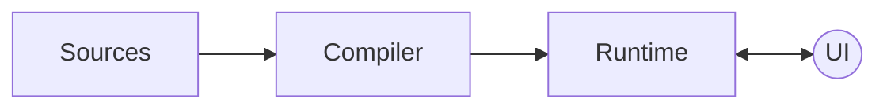

Compose는 여러 라이브러리 구성되어 있지만, 이 장에서는 컴파일러, 런타임 및 UI 라이브러리를 중점적으로 볼 것입니다.

Compose 컴파일러와 런타임은 Compose의 기둥입니다. UI는 기술적으로 Compose 아키텍처의 일부가 아닙니다. 
왜냐하면 런타임과 컴파일러는 제네릭으로 설계되어 있어, 요구 사항을 준수하는 모든 클라이언트 라이브러리에서 사용할 수 있기 때문입니다.
그렇긴 해도, UI 라이브러릴 살펴보는 것은 Compose가 어떻게 Composable 트리의 메모리 표현을 런타임에 전달하고, 어떻게 실제 요소를 생성하는지 이해하는 데 도움이 될 것입니다.



Compose를 처음 접하면 정확한 순서가 무엇인지 혼란스러울 수 있습니다.
지금까지 책에서는 컴파일러와 런타임이 함께 작동하여 모든 라이브러리 기능을 제공한다고 설명했지만, 이에 익숙하지 않다면 여전히 추상적으로 느껴질 수 있습니다.
Compose 컴파일러가 런타임 요구 사항을 준수하도록 코드를 어떻게 처리하는지, 런타임이 작동하는 방식, 초기 컴포지션 및 추가 재구성이 언제 트리거되는지, 트리의 메모리 내 표현이 어떻게 전달되는지, 그 정보가 추가 재구성에 어떻게 사용되는지 등을 이해하는 데 도움이 될 것입니다.

컴파일러를 이해하는 것부터 시작해 보겠습니다.

## A Kotlin compiler plugin

Compose는 메타 프로그래밍에 약간 의존합니다. Kotlin과 JVM에서는 보통 kapt를 통해 어노테이션 프로세서를 사용합니다.
하지만 Compose는 다릅니다. 실제로 Compose 컴파일러는 Kotlin 컴파일러 플러그인입니다. 
이는 라이브러리가 Kotlin 컴파일 단계 내에서 컴파일 시간 작업을 포함할 수 있어, 코드 형태에 대한 더 많은 관련 정보를 얻고 전체 프로세스를 가속화할 수 있게합니다.
kapt는 컴파일 전에 실행되어야 하지만, 컴파일러 플러그인은 컴파일 프로세스 내에서 완전히 인라인됩니다.

컴파일러 플러그인은 언어의 메타프로그래밍에 대한 큰 발전입니다. 많이 알려진 어노테이션 프로세서들은 점진적으로 컴파일러 플러그인으로 전환될 것입니다.

Kotlin 컴파일러 플러그인이 되면 Compose 체크를 IDEA inspection과 직접 통합할 수 있는 기회를 제공합니다.
따라서 개발자는 실제로 프로젝트를 빌드하지 않고도 코드를 작성하는 동안 실시간 피드백을 받을 수 있습니다.
이는 컴파일러 플러그인이 컴파일러의 ㅍ프론트엔드 단계에서 경고와 오류를 보고할 수 있는 능력이 있기 때문이며, 이러한 기능은 이미 IDEA와 통합되어 있습니다.
피드백 루프를 개선하는 것은 Kotlin 컴파일러의 프론트엔드 단계에서 정적 분석을 수행하는 궁극적인 이점입니다.

또한, Kotlin 컴파일러 플러그인의 또 다른 장점은 소스 코드를 자유롭게 조정할 수 있다는 것입니다. (새 코드만 추가하는 것이 아니라)
이는 해당 요소들의 출력 IR을 보다 더 원자적인 용어로 낮추기 전에 조정하여, 타겟이 되는 플랫폼의 원시 코드로 번역될 수 있도록 합니다.
Compose 컴파일러가 Composable 함수를 런타임에서 지원되도록 변환할 수 있도록 하는 이러한 기능은 이 장에서 좀 더 자세히 살펴볼 것입니다.

## Compose annotations

첫 번째로 살펴볼 것은 코드에 어떻게 어노테이트하여 컴파일러가 필요한 요소를 검색하고 작업을 수행할 수 있는지 알아보는 것입니다.
사용 가능한 Compose 어노테이션에 대해 알아보겠습니다.

컴파일러 플러그인이 어노테이션 프로세서보다 더 많은 작업을 할 수 있지만, 두 가지 모두 공통적으로 사용하는 것이 있스빈다.
그 중 하나가 정적 분석과 유효성 검사를 위해 사용되는 프론트엔드 단계입니다. Compose는 이를 잘 활용합니다.

Compose를 사용하는 프로그램을 실행할 때 처음으로 발생하는 일은 라이브러리에 의해 프로그램 코드가 처리되어야 한다는 것입니다.
Compose 컴파일러는 프로그램 코드를 가져와 `@Composable` 어노테이션이 있는 모든 항목을 검색합니다. 
또한 Compose는 특정 상황에서 추가적인 검사 및 다양한 런타임 최적화 또는 "단축키"를 활성화하기 위해 다른 보조 어노테이션도 제공합니다. 
이처럼 사용 가능한 모든 어노테이션은 Compose 런타임 라이브러리에서 제공됩니다. 

> 모든 Compose 어노테이션은 Compose 런타임에서 제공됩니다.
> 이는 컴파일러와 런타임 모듈 모두가 Compose 어노테이션을 잘 활용하기 때문입니다.

### @Composable

`@Composable` 어노테이션은 해당 함수의 타입을 변경하여 재시작이 가능하도록 만듭니다.
즉, 여러 번 실행될 수 있으며 데이터에서 노드로 매핑되어 실행 시 트리에 추가됩니다.
이 노드는 UI 노드일 수도 있고, Compose 런타임을 사용하여 소비하는 노드의 성격에 따라 다를 수 있습니다.

Compose 런타임은 특정 사용 사례나 의미에 묶이지 않은 제네릭 타입의 노드와 함께 작동합니다.

### @ExperimentalComposeApi

안정화되기 전에 변경될 수 있는 Compose api를 플래그 처리하는 어노테이션입니다. 
코드베이스에서 해당 api를 사용할 때 경고를 받게 되며, 명시적으로 해당 api를 사용하도록 선택(opt-in)해야 합니다. 
컴파일러의 프론트엔드 체크는 가능한 빨리 이러한 경고를 트리거하도록 합니다.

### @ComposeCompilerApi

Compose 자체에서 컴파일러만 접근할 수 있도록 플래그 처리하는 어노테이션입니다.
이 어노테이션은 컴파일러 외부에서 사용하려고 시도하면 즉시 인라인 오류가 발생합니다.

### @InternalComposeApi

Compose에서 일부 API를 내부적으로 변화할 수 있도록 `@InternalComposeApi` 어노테이션으로 표시합니다.  
이렇게 하면 Public API는 안정된 릴리스를 위해 변경되지 않고 유지되지만, 내부 구현은 유연하게 변경할 수 있습니다.
이 어노테이션은 Kotlin의 `internal` 키워드보다 넓은 범위를 가지며, 모듈 간에도 사용이 가능합니다.
Kotlin에서는 모듈 간 `internal` 사용을 지원하지 않지만, 이 어노테이션을 통해 Compose 라이브러리 내부 구현이 다른 모듈에서도 공유될 수 있게 됩니다.

### @DisallowComposableCalls

`@DisableComposableCalls`는 함수 내부에서 Composable 호출이 발생하지 않도록 막는데 사용됩니다.  
이는 Composable 함수의 인라인 람다 파라미터에 Composable 호출이 안전하지 않을 때 유용합니다.

예를 들어, Compose UI 일부인 `ComposeNode`에서 사용 예시를 찾을 수 있습니다.  
`ComposeNode`는 컴포지션에 UI 노드를 발행합니다. 
호출할 때, 호출자는 Composable이 생성된 후 초기화하거나, 업데이트하는 람다를 전달해야 합니다.

```kotlin
@Composable inline fun <T : Any, reified E : Applier<*>> ComposeNode(
    noinline factory :() -> T,
    update: @DisallowComposableCalls Updater<T>.() -> Unit
) {
    // ...
}
```

위 예제에서 `update` 람다는 인라인이며, `@DisablComposableCalls`로 처리되어 있습니다.  
이는 런타임이 모든 재구성 시점에 `update` 람다를 인라인으로 호출하는데, 
이 시점에 새로운 Composable 함수를 호출하면 예상치 않은 결과가 발생할 수 있기 때문에 런타임이 이를 방지하기 위해 `@DisallowComposableCalls`로 처리합니다.

### @ReadOnlyComposable

`@ReadOnlyComposable` 어노테이션은 해당 함수의 본문이 항상 컴포지션을 읽기만 하고 쓰기 작업을 하지 않음을 의미합니다.
이는 본문 내의 모든 중첩된 Composable 호출에도 동일하게 적용되어야 합니다. 이렇게 하면 런타임에서 필요하지 않은 코드를 생성하지 않을 수 있습니다.

컴포지션에 쓰기 작업을 수행하는 Composable의 경우, 컴파일러는 해당 본문을 래핑하는 "그룹"을 생성합니다.
이 그룹은 런타임에 대신 내보내져, 나중에 재구성이 필요할 때 데이터를 다른 Composable의 데이터로 덮어쓰거나, Composable의 정체성을 보존하면서 데이터를 이동하는데 필요한 정보를 제공합니다.
생성될 수 있는 그룹의 유형은 여러 가지가 있습니다. 예를 들어, 재시작 가능(restartable) 그룹, 이동 가능(movable) 그룹 등이 있습니다.

"그룹"의 개념을 이해하기 위해, 선택한 텍스트의 시작과 끝에 몇 개의 포인터가 있다고 상상해보세요.
모든 그룹은 코드 위치 키(source position key)를 가지며, 이는 그룹을 저장하고 위치 메모이제이션을 활성화하는데 사용됩니다.
이 키는 조건부 로직의 if 또는 else 분기 사이의 차이를 알 수 있도록 하는 방법이기도 합니다.

```kotlin
if (condition) Text("Hello") 
else Text("World")
```

이들은 모두 `Text`이지만, 호출자에게 다른 개념을 나타내기 때문에 서로 다른 정체성을 가집니다.
이동 가능한 그룹은 부모 그룹 내에서 재배치될 수 있도록 의미를 갖는 아이덴티티 키(semantic identity key)를 가집니다.

Composable이 컴포지션에 쓰기 작업을 수행하지 않을 때, 그룹을 생성하는 것은 어떤 가치도 제공하지 않습니다. 
`@ReadOnlyComposable` 어노테이션은 이를 피하기 위해 도와줍니다.

Compose 라이브러리 내의 읽기 전용 Composable 예시로는 여러 CompositionLocal 기본값, Material Colors, Typography, isSystemInDarkTheme(), LocalContext, 애플리케이션 리소스를 얻기 위한 호출(이들은 LocalContext에 의존함), LocalConfiguration 등이 있습니다.
전반적으로, 이는 프로그램 실행 시 한 번 설정되고 변경되지 않을 것으로 예상되며, Composable 트리에서 읽을 수 있어야 하는 것들입니다.

### @NonRestartableComposable

`@NonRestartableComposable` 어노테이션은 함수나 프로퍼티 getter에 적용되면 해당 함수를 재시작할 수 없는 Composable으로 만듭니다.
기본적으로 모든 Composable 함수는 재시작 가능한 속성을 가지고 있습니다.

이 어노테이션이 추가되면, 컴파일러는 함수가 재구성되거나 재구성 중 건너뛰어질 수 있도록 하는데 필요한 보일러플레이트 코드를 생성하지 않습니다.
이 어노테이션은 다른 Composable 함수에 의해 재시작될 가능성이 높은 매우 작은 함수에만 의미가 있기 때문에 매우 신중하게 사용되어야 합니다.
이러한 작은 함수들은 자체적으로 무효화/제구성은 부모/포함하는 Composable에 의해 주도되기에 재구성 로직이 필요하지 않을 수 있습니다.
이럴 때 이 어노테이션을 사용하면 성능 향상을 기대할 수 있습니다. (그러나, 잘못 사용하면 예상치 못한 결과를 초래할 수 있습니다.)

### @StableMarker

The Compose runtime also provides some annotations to denote the stability of a type. Those are the @StableMarker meta-annotation, and the @Immutable and @Stable annotations. Let’s start with the @StableMarker one.

Compose 런타임은 타입의 안정성을 나타내기 위해 몇 가지 어노테이션을 제공합니다. 
그 중 `@StableMarker` 메타 어노테이션과 `@Immutable` 및 `@Stable` 어노테이션이 있습니다.

`@StableMarker`는 `@Immutable` 및 `@Stable`과 다른 메타 어노테이션입니다.
이는 약간 중복처럼 들릴 수 있지만, 재사용성을 위해 설계되었습니다. 따라서 이 어노테이션이 가지는 의미는 이를 어노테이트한 모든 어노테이션에 적용됩니다.

`@StableMarker`는 최종적으로 어노테이트된 타입에 대해 다음과 같은 데이터 안정성 요구 사항을 암시합니다.

- 동일한 두 인스턴스에 대해 `equals` 호출의 결과는 항상 동일해야 합니다.
- 어노테이트된 타입의 공개 프로퍼티가 변경될 때마다 컴포지션에 이 변경을 항상 알립니다.
- 어노테이트된 타입의 모든 공개 프로퍼티도 안정적(Stable)이어야 합니다.

`@Immutable` 또는 `@Stable`로 어노테이트된 모든 타입은 이러한 요구 사항을 암시해야 합니다.
두 어노테이션 모두 `@StableMarker`로 플래그 처리되어 있기 때문입니다.

이러한 어노테이션들은 컴파일러에게 개발자들이 제공하는 약속으로, 컴파일러가 소스를 처리할 때 어떠한 가정을 할 수 있지만, 컴파일 시간에 유효성 검사는 수행되지 않습니다.
즉, 이 어노테이션과 아래 설명할 어노테이션들은 개발자가 이러한 요구 사항이 충족되었을 때만 사용해야 하며, 요구 사항이 충족되지 않은 상태에서 사용하면 개발자의 책임이 됩니다.

### @Immutable

`@Immutable` 어노테이션은 클래스에 적용되어, 해당 클래스의 모든 공용 프로퍼티와 필드가 생성 후 변경되지 않음을 컴파일러에게 엄격히 약속합니다.
이는 Kotlin의 `val` 키워드보다 더 강력한 약속입니다. `val`은 속성이 setter를 통해 재할당 될 수 없음을 보장하지만, 속성이 가변 데이터 구조를 가리킬 수 있기 때문에 데이터가 불변이라는 것을 보장하지 않습니다.
이는 Compose 런타임의 기대를 깨뜨릴 수 있습니다. 다시 말해, 이 어노테이션은 Kotlin 언어가 데이터 구조의 불변성을 보장하는 메커니즘을 제공하지 않기에 Compose에 필요합니다.

초기화 후 값이 절대 변경되지 않는다는 가정에 기반하여, 런타임은 스마트 재구성 및 재구성 건너뛰기 기능에 최적화를 적용할 수 있습니다.

`@Immutable`로 안전하게 표시될 수 있는 클래스의 좋은 예는 `val` 프로퍼티만 있는 데이터 클래스입니다.
이 클래스의 모든 속성은 사용자 정의 getter를 가지지 않으며, 모든 프로퍼티는 기본 타입이거나 `@Immutable`로 표시된 타입이어야 합니다.
사용자 정의 getter가 있으면 호출할 때마다 다른 결과를 반환하여 읽기 불안정한 API가 될 수 있습니다.

`@Immutable`은 `@StableMarker`로 플래그 처리되어 있기 때문에, 안정성을 나타내는 모든 어노테이션의 의미를 상속합니다.
불변으로 간주되는 타입은 항상 `@StableMarker`의 의미를 따릅니다. `@Immutable` 어노테이션은 불변 타입을 안정적(stable)으로 표시하는데 사용됩니다.

### @Stable

`@Stable` 어노테이션은 `@Immutable`보다 더 가벼운 약속으로, 적용된 언어 요소에 따라 다른 의미를 가집니다.

타입에 적용되면, 해당 타입이 가변적임을 의미합니다. 
즉, 해당 타입의 인스턴스는 생성 후에 변경될 수 있지만, 여전히 `@StableMarker`의 조건을 충족합니다.
`@StableMarker`에서 요구되는 데이터 안정성을 충족하지만, 불변성은 보장하지 않습니다.

함수나 프로퍼티에 적용되면, 컴파일러에게 해당 함수가 동일한 입력에 대해 항상 동일한 결과를 반환함을 의미합니다.(순수 함수)
이는 함수의 파라미터도 `@Stable`, `@Immutable` 또는 기본 타입(primitive types)이어야만 가능합니다. (이들은 안정적으로 간주됩니다.)

이 어노테이션이 런타임에 얼마나 중요한지에 대한 좋은 예는 문서에 있습니다.
모든 타입이 안정적인 것으로 표시된 Composable에 파라미터로 전달되면, 파라미터 값은 위치 메모이제이션에 기반하여 비교되며, 모든 값이 이전 호출과 동일하면 호출이 건너뛰어집니다.

`@Stable`로 표시될 수 있는 타입의 예는 공용 프로퍼티가 변경되지 않지만 불변으로 간주될 수 없는 객체입니다.
예를 들어, 내부적으로 가변 상태를 가지고 있거나 `MutableState` 객체로 프로퍼티 위임을 하지만, 외부에서는 불변으로 사용되는 객체입니다.

이 어노테이션의 의미는 컴파일러와 런타임에서 데이터가 어떻게 변할지(또는 변하지 않을지)에 대한 가정을 만들고, 필요한 경우 최적화를 적용하는데 사용됩니다.
이 어노테이션을 사용할 때는 해당 의미가 충족되는지 확실히 확신할 때만 사용해야 합니다. 그렇지 않으면 컴파일러에 잘못된 정보를 제공하게 되어 런타임 오류가 발생할 수 있습니다.
따라서 `@Stable` 어노테이션은 신중하게 사용해야 합니다.

> 흥미로운 점은 `@Immutable`과 `@Stable` 어노테이션이 서로 다른 의미와 약속을 가지고 있지만, 현재 Compose 컴파일러는 두 어노테이션을 동일하게 처리하여 스마트 재구성 및 재구성 건너뛰기를 활성화하고 최적화합니다.
하지만 두 어노테이션은 미래에 컴파일러와 런타임이 활용할 수 있는 다른 의미를 부여하기 위해 존재합니다.

## Registering Compiler extensions

Compose 컴파일러 플러그인이 하는 첫 번째 일은 ComponentRegistrar를 사용하여 Kotlin 컴파일러 파이프라인에 자신을 등록하는 것입니다.
ComponentRegistrar는 Kotlin 컴파일러가 제공하는 메커니즘으로, 다양한 목적을 위한 "컴파일러 확장"을 등록합니다.
이 확장들은 라이브러리 사용을 용이하게 하고 런타임에 필요한 코드를 생성하는 역할을 합니다.
등록된 모든 확장은 Kotlin 컴파일러와 함께 실행됩니다.

또한, Compose 컴파일러는 활성화된 컴파일러 플래그에 따라 몇 가지 확장을 등록합니다.
Compoes를 사용하는 개발자는 라이브 리터럴, 생성된 코드에 소스 정보 포함하는 기능, `remember` 함수에 대한 최적화, Kotlin 버전 호환성 검사를 억제하는 기능, IR 변환에서 속임수 메서드 생성 등과 같은 기능을 활성화할 수 있는 몇 가지 특정 컴파일러 플래그를 활성화할 수 있습니다.

## Static analysis

평균적인 컴파일러 플러그인의 표준 동작을 따르면, 린팅(linting)이 먼저 발생합니다.
정적 분석은 라이브러리 어노테이션을 검색하고, 그런 다음 런타임이 예상하는 방식으로 사용되는지 확인하기 위해 중요한 검사를 수행합니다.
이 과정에서 관련된 경고 또는 오류는 컴파일러 플러그인이 액세스할 수 있는 컨텍스트 트레이스(trace)를 통해 보고됩니다.
이미 이들을 인라인으로 표시할 수 있는 IDEA와 잘 통합되어 있습니다. 
이러한 모든 검증은 프론트엔드 단계에서 수행되며, 개발자에게 코드를 작성하는 동안 실시간 피드백을 제공합니다.

## Static Checkers

등록된 확장 중 일부는 개발자가 코딩하는 동안 안내하는 정적 검사기의 형태로 제공됩니다.
Compose에서는 호출, 타입 및 선언에 대한 검사기를 확장으로 등록합니다.
이들은 라이브러리의 올바른 사용을 보장하며, 물론 라이브러리가 해결하려는 문제에 대해 명확한 의견을 가지고 있습니다.
Chapter 1에서 배운 Composable 함수에 대한 요구 사항과 같은 것들이 여기에서 검증되며, 위반될 때 보고됩니다.

Kotlin 컴파일러 세계에는 확인하려는 요소에 따라 다양한 분석기가 있습니다. 
클래스 인스턴스화, 타입, 함수 호출, deprecated 호출, contracts , 클로저 캡처, infix 호출, coroutine 호출, operator 호출 등 여러 종류의 검사기가 있습니다.
이러한 검사기는 컴파일러 플러그인이 입력 소스의 모든 해당 요소를 분석하고 필요한 곳에서 정보, 경고 또는 오류를 보고할 수 있도록 합니다.

등록된 모든 검사기는 Kotlin 컴파일러의 프론트엔드 단계에서 실행되므로, 매우 빠르고 CPU 소모가 적은 작업이어야 합니다.
이는 개발자의 책임이며, 이러한 검사가 개발자가 타이핑하는 동안 실행되며, 사용자 경험을 방해하지 않도록 해야 한다는 것을 항상 염두에 두어야 합니다.

## Call checks

Compose가 등록한 다양한 검사기 중 하나는 호출을 검증하는 것입니다. 
Compose 컴파일러에는 Composable 함수 호출을 여러 다른 컨텍스트에서 검증하기 위한 정적 호출 검사가 있습니다. 
예를 들어, `@DisallowComposableCalls` 또는 `@ReadOnlyComposable`의 범위 내에서 호출될 때와 같은 경우입니다.

호출 검사기는 코드베이스 전체에서 모든 호출에 대한 정적 분석을 수행하기 위해 사용되는 컴파일러 확장입니다.
따라서 모든 PSI 요소를 방문하는 재귀적 호출을 수행하는 체크 함수를 제공합니다. 즉, PSI 트리의 모든 노드를 방문합니다.

이런 검사 중 일부는 현재 방문 중인 언어 요소보다 넓은 컨텍스트가 필요합니다.
예를 들어, Composable이 호출되는 위치와 같은 정보가 필요할 수 있습니다.
이는 단일 PSI 노드를 분석하는 것만으로 충분하지 않다는 것을 의미합니다.
이러한 정보를 수집하려면 다양한 요소에서 작은 정보를 기록하여 전체적인 분석을 수행하고, 후속 검증에서 더 복잡한 검사를 수행해야 합니다.
이를 위해 컴파일러는 이러한 정보를 컨텍스트 트레이스에 편리하게 기록할 수 있습니다.
이를 통해 현재 검사의 범위를 확장하고, 람다 표현식, try/catch 블록 또는 유사한 중요한 요소를 찾을 수 있습니다.

다음은 Composable 호출이 `@DisallowComposableCalls`로 플래그 처리된 컨텍스트 내에서 수행되는 경우, 오류를 보고하기 위해 관련 정보를 트레이스에 기록하고 사용하는 컴파일러 호출의 예입니다.

```kotlin
if (arg?.type?.hasDisallowComposableCallsAnnotation() == true) {
    context.trace.report(
        ComposeWritableSlices.LAMBDA_CAPABLE_OF_COMPOSER_CAPTURE, 
        descriptor, // reference to the function literal
        false
    )

    context.trace.report(
        ComposeErrors.CAPTURED_COMPOSABLE_INVOCATION.on(
            reportOn,
            arg,
            arg.containingDeclaration
        )
    )
    return
}
```

> 컨텍스트 트레이스는 검사 함수 호출마다 사용할 수 있으며, 오류, 경고 또는 정보 메시지를 보고하는 데 사용할 수 있습니다.
> 트레이스는 전체적인 분석을 수행하는 데 필요한 관련 정보를 기록할 수 있는 가변 구조로 이해할 수 있습니다.

다른 검사들은 더 간단하며 현재 방문 중인 요소에서 사용 가능한 정보만 필요로 하기 때문에 작업을 수행하고 반환합니다.
각 검사 호출에서 플러그인은 현재 노드의 요소 유형을 일치시키고, 이에 따라 검사를 수행하고 반환하며, 필요 시 오류를 보고하거나, 컨텍스트 트레이스에 관련 정보를 기록하거나, 다시 이 노드의 부모로 재귀하여 더 많은 노드를 방문하고 더 많은 정보를 수집합니다. 
다양한 어노테이션에 대한 다양한 검사가 수행됩니다.

Compose 컴파일러는 Composable 함수가 불가능한 곳에서 호출되지 않도록 확인합니다. 
예를 들어, try/catch 블록(지원되지 않음), Composable로 표시되지 않은 함수 또는 `@DisallowComposableCalls`로 플래그 처리된 람다에서 호출되는 경우입니다.

각 Composable 호출에 대해 컴파일러는 PSI 트리를 위로 올라가며 호출자, 호출자의 호출자 등을 확인하여 이 호출에 필요한 모든 요구 사항이 충족되었는지 확인합니다.
모든 시나리오가 고려되며, 부모는 람다 표현식, 함수, 프로퍼티, 프로퍼티 액세서, try/catch 블록, 클래스, 파일 등이 될 수 있습니다.

> PSI는 프론트엔드 컴파일러 단계에서 언어의 구조를 모델링하므로, 코드를 이해하는 방식이 완전히 구문적이고 정적이라는 것을 염두에 두어야 합니다.

이러한 검사들이 인라인 함수를 고려하는 것도 중요합니다. 인라인 람다에서 Composable 함수를 호출할 수 있어야 하며, 인라인 람다의 호출자도 Composable이어야 합니다. 
Compose 컴파일러는 Composable 함수를 호출하는 모든 인라인 람다가 호출 스택 상단에서 Composable 함수에 의해 감싸여 있는지 확인합니다.

또 다른 호출 검사는 필요한 곳에 누락된 Composable 어노테이션을 감지하는 것입니다.
따라서 개발자가 해당 어노테이션을 추가하도록 편리하게 요청할 수 있습니다.
예를 들어, 람다 내에서 Composable 함수가 호출되는 경우, 컴파일러는 해당 람다에도 Composable 어노테이션을 추가하라고 제안합니다.
정적 분석 검사는 코드를 작성하는 동안 개발자를 안내하기 위해 존재하며, 금지하는 것만이 아니라 필요한 것을 추론하거나 코드를 개선하는 방법을 알려줄 수도 있습니다.

또한 `@ReadOnlyComposable`로 플래그 처리된 Composable 함수에 대한 정적 호출 검사도 있습니다.
이들은 다른 읽기 전용 Composable만 호출할 수 있습니다. 그렇지 않으면 최적화를 위한 계약을 위반하게 됩니다.
이러한 요구 사항은 Composable 내의 모든 깊이 레벨에서 충족되어야 하므로, 방문자(visitor) 패턴이 유용합니다.

또한, Composable 함수 참조의 사용을 금지하는 검사도 있습니다.

## Type checks

때로는 함수뿐만 아니라 타입도 Composable로 어노테이트합니다. 
이를 위해 Compose 컴파일러에는 타입 추론과 관련된 검사가 있어, @Composable로 어노테이트된 타입이 예상되지만 어노테이트되지 않은 타입이 대신 발견된 경우 보고할 수 있습니다. 
위에서 언급한 함수 호출 검사와 유사합니다. 오류 메세지에는 추론된 타입과 예상 타입을 어노테이션과 함께 출력하여 차이를 더 명확하게 보여줍니다.

## Declaration checks

호출 지점과 타입에 대한 검사가 필요하지만, 충분하지 않습니다. 
선언 지점도 Compose 코드베이스의 일부입니다. 
프로퍼티, 프로퍼티 액세서, 함수 선언 또는 함수 파라미터와 같은 요소들을 분석해야 합니다.

프로퍼티, 프로퍼티 getter 및 함수는 Composable로 어노테이트되어 있더라도 오버라이드될 수 있습니다.
Compose 컴파일러는 이러한 KtElements의 모든 오버라이드가 일관성을 유지하기 위해 Composable로 어노테이트되어 있는지 확인하기 위한 검사를 수행합니다.

또 다른 선언 검사는 Composable 함수가 suspend되지 않도록 하는 것입니다. 이는 지원되지 않습니다.
1장에서 설명한 것처럼, `suspend`는 `@Composable`과 다른 의미를 가지며, 두 개념은 완전히 다른 것을 나타내도록 설계되었습니다.
현재로서는 두 개념은 함께 지원되지 않습니다.

또한, Composable main 함수나 Composable 프로퍼티의 백킹 필드와 같은 것들도 선언 검사를 통해 금지됩니다.

## Diagnostic suppression

컴파일러 플러그인은 진단 억제기를 확장으로 등록할 수 있으므로, 특정 상황에서 진단을 무시할 수 있습니다.
이는 컴파일러 플러그인이 일반적으로 Kotlin 컴파일러가 수용하지 않을 코드를 생성하거나 지원하는 경우에 일반적입니다. 
따라서 해당 검사를 우회하고 작동할 수 있도록 합니다.

Compose는 "ComposeDiagnosticSuppressor"를 등록하여 컴파일이 실패할 수 있는 몇 가지 언어 제한을 우회하므로 특정 사용 사례를 실행할 수 있습니다.

이런 제한 중 하나는 호출 지점에서 "non-source annotations"로 어노테이트된 인라인 람다에 대한 것입니다. 
이는 retention BINARY 또는 RUNTIME인 어노테이션을 의미합니다. 
이러한 어노테이션은 소스 어노테이션과 달리 출력 바이너리 파일까지 살아남습니다.   
인라인 람다는 컴파일 시간에 호출자에게 효과적으로 인라인되기 때문에, 이들은 더 이상 어노테이트할 것이 없으므로 어디에도 저장되지 않을 것입니다.
이 때문에 Kotlin이 이를 금지하고 다음과 같은 오류를 보고하는 이유입니다:
“The lambda expression here is an inlined argument so this annotation cannot be stored anywhere.”.

다음은 일반 Kotlin을 사용하여 오류를 발생시키는 코드 입니다:

```kotlin
@Target(AnnotationTarget.FUNCTION)
annotation class FunAnn

inline fun myFun(a: Int, f: (Int) -> String): String = f(a)

fun main() {
    myFun(1) @FunAnn { it.toString() } // Call site annotation
}
```

Compose 컴파일러는 이러한 검사를 `@Composable`로 어노테이트된 경우에만 억제하므로, 다음과 같이 코드를 작성할 수 있습니다:

```kotlin
@Composable
inline fun MyComposable(@StringRes nameResID: Int, resolver: (Int) -> String) {
    val name = resolver(nameResID)
    Text(name)
}

@Composable
fun Screen() {
    MyComposable(R.string.app_name) @Composable { 
        LocalContext.current.resources.getString(it)
    }
}
```

이렇게 하면 호출 지점에서 람다 파라미터를 `@Composable`로 어노테이트할 수 있으므로, 함수 선언에서 반드시 어노테이션을 처리할 필요가 없습니다. 
이를 통해 함수가 더 유연한 contract(계약)를 가질 수 있습니다.

또 다른 언어 제한은 Kotlin 컴파일러가 지원하지 않는 곳에서 명명된 인자(named argument)를 허용하는 것과 관련이 있으며, 이는 함수가 `@Composable`로 어노테이트된 경우에만 가능합니다.
예를 들어, 함수 타입에서 Kotlin은 명명된 인자를 허용하지 않지만, Compose는 함수가 `@Composable`로 어노테이트된 경우 가능하게 합니다:

```kotlin
interface FileReaderScope {
    fun onFileOpen(): Unit
    fun onFileClose(): Unit
    fun onLineRead(line: String): Unit
}

object Scope: FileReaderScope {
    override fun onFileOpen() { /* ... */ }
    override fun onFileClose() { /* ... */ }
    override fun onLineRead(line: String) { /* ... */ }
}

@Composable

fun FileReader(
    path: String,
    content: @Composable FileReaderScope.(path: String) -> Unit
) {
    Column {
        // ...
        Scope.content(path)
    }
}
```

`@Composable` 어노테이션을 제거하면 "Named arguments are not allowed for function types."와 같은 오류가 발생합니다.

동일한 요구 사항은 예상(expected) 클래스의 멤버와 같은 다른 경우에도 억제됩니다. Compose는 멀티플랫폼을 지향하므로, 런타임은 확실히 Composable로 플래그 처리된 예상 함수와 프로퍼티를 수용해야 합니다.

## Runtime version check

코드 생성 바로 직전에 발생하는 첫 번째 일은 사용된 Compose 런타임 버전을 확인하는 것입니다. 
Compose 컴파일러는 런타임의 최소 버전을 요구하므로, 런타임이 오래되지 않았는지 확인하기 위한 체크가 있습니다. 
이는 런타임이 없는 경우와 오래된 경우 모두 감지할 수 있습니다.

단일 Compose 컴파일러 버전은 최소 지원되는 런타임 버전보다 높은 여러 런타임 버전을 지원할 수 있습니다.

이는 두 번째 버전 체크입니다. Kotlin 컴파일러 버전에 대한 체크와 더불어, Compose 런타임에 대한 또 다른 체크입니다.

## Code generation

어노테이션 프로세서와 컴파일러 플러그인은 런타임 라이브러리가 사용할 수 있는 편리한 코드를 합성하는 데 자주 사용되므로, 
코드 생성 단계는 둘이 공통적으로 가지고 있는 또 다른 것입니다.


## The Kotlin IR

앞서 설명한 것처럼, 컴파일러 플러그인은 새로운 코드를 생성하는 것뿐만 아니라 소스를 수정할 수 있으므로, 언어의 중간 표현(IR : Intermediate Representation)에 접근하여 최종 타겟 플랫폼용 코드를 생성하기 전에 코드 구조를 수정할 수 있습니다.
즉, 컴파일러 플러그인은 코드를 “커밋”하기 전에 파라미터를 교체하거나 새로 추가하거나, 코드 구조를 재구성할 수 있습니다. 
이는 코틀린 컴파일러의 백엔드 단계에서 발생합니다. 그리고 예상했겠지만, 이것이 Compose가 각 Composable 호출에 암시적 추가 파라미터인 Composer를 “주입”하는 데 사용하는 방법입니다.

컴파일러 플러그인은 다양한 형식의 코드를 생성할 수 있습니다. 
JVM만 타겟팅한다면 Java 호환 바이트코드를 생성하는 것을 생각할 수 있지만, Kotlin 팀의 최신 계획과 리팩토링 방향은 모든 IR 백엔드를 안정화하고 모든 플랫폼을 위한 단일 IR로 통합하는 것이므로, IR을 생성하는 것이 더 많은 의미를 갖습니다.
IR은 타겟 플랫폼에 대해 알지 못하는 언어 요소의 표현으로 존재하므로, IR을 생성하면 Compose가 생성하는 코드가 멀티플랫폼이 될 수 있습니다.

Compose 컴파일러 플러그인은 "IrGenerationExtension"의 구현을 등록하여 IR을 생성합니다. 
IrGenerationExtension은 Kotlin 컴파일러 공통 IR 백엔드에서 제공하는 확장입니다.

## Lowering

> "로우어링"이라는 용어는 컴파일러가 더 높은 수준 또는 더 고급 프로그래밍 개념에서 더 낮은 수준 또는 더 원자적인 것들의 조합으로의 번역을 할 수 있는 것을 의미합니다. 
> 이것은 Kotlin에서 매우 일반적입니다. Kotlin은 언어의 IR을 가지고 있어 고급 개념을 표현할 수 있으며, 이를 더 낮은 수준의 원자적 개념으로 번역한 후 JVM 바이트 코드, Javascript, LLVM의 IR 또는 우리가 타겟팅하는 플랫폼의 코드로 변환합니다.
> Kotlin 컴파일러에는 이러한 목적을 위한 로우어링 단계가 있습니다. 로우어링은 또한 일종의 정규화(normalization)로 이해할 수 있습니다.

Compose 컴파일러는 라이브러리가 지원하는 일부 개념을 로우어링하여 런타임이 이해할 수 있는 표현으로 정규화합니다.
이 과정은 Compose 컴파일러 플러그인의 실제 코드 생성 단계입니다. 여기서 IR 트리의 모든 요소를 방문하고, 런타임 요구 사항에 따라 IR을 조작합니다.

아래는 이 섹션에서 다루는 로우어링 단계에서 발생하는 몇 가지 중요한 예시의 간략한 요약입니다:

- 클래스 안정성을 추론하고 런타임에서 이를 이해할 수 있도록 필요한 메타데이터를 추가합니다.
- 재컴파일 없이 소스 코드의 변경 사항을 반영할 수 있도록 라이브 리터럴 표현식을 변환하여 가변 상태 인스턴스에 액세스하도록 합니다(라이브 리터럴 기능).
- 모든 Composable 함수에 암시적 Composer 파라미터를 주입하고, 이를 모든 Composable 호출에 전달합니다.
- Composable 함수의 바디를 래핑하여 다음과 같은 작업을 수행합니다:
    - 제어 흐름을 위한 다양한 유형의 그룹 생성 (replaceable 그룹, movable 그룹 등)
    - 기본 인수(default argument) 지원을 구현하여 생성된 함수 그룹의 내에서 실행될 수 있도록 합니다. (Kotlin 기본 파라미터 지원에 의존하지 않고)
    - 함수가 재구성을 건너뛰도록 합니다.
    - 상태 변경과 관련된 정보를 트리 아래로 전파하여 상태가 변경될 때 자동으로 재구성할 수 있도록 합니다.

## Inferring class stability

스마트 재구성이란 입력이 변경되지 않았거나 입력이 안정적으로 간주될 때 Composable의 재구성을 건너뛰는 것을 의미합니다. 
안정성은 이런 의미에서 매우 중요한 개념이며, 안정성은 런타임이 안전하게 입력을 읽고 비교하여 필요할 때 재구성을 건너뛸 수 있음을 의미합니다. 
안정성의 궁극적인 목표는 런타임을 돕는 것입니다.

이와 관련하여 안정적인 타입이 충족해야 할 속성을 요약하면 다음과 같습니다:

- 두 인스턴스에 대한 equals 호출은 항상 동일한 결과를 반환합니다. 즉, 비교가 일관적이므로 런타임이 이를 신뢰할 수 있습니다.
- 공개 프로퍼티가 변경될 때마다 항상 컴포지션에 알립니다. 그렇지 않으면 Composable의 입력과 최신 상태가 일치하지 않을 수 있으며, 이를 방지하기 위해 재구성이 항상 트리거됩니다. 스마트 재구성은 이러한 입력에 의존할 수 없습니다.
- 모든 공개 프로퍼티에는 원시 타입 또는 안정적인 타입으로 간주되는 타입이어야 합니다.

모든 원시 타입은 기본적으로 안정적으로 간주됩니다. 또한 String 및 모든 함수 타입도 안정적으로 간주됩니다. 
이는 그들이 불변성을 가지고 있기 때문입니다. 불변 타입은 변경되지 않으므로 컴포지션에 알릴 필요가 없습니다.

또한, Compose에서 안정적인 것으로 간주할 수 있는 불변 타입도 있습니다. (`@Stable`로 플래그 처리할 수 있음)
이의 한 예시는 MutableState이 있으며, Compose는 변경될 때마다 알림을 받으므로 스마트 재구성 시 신뢰할 수 있습니다.

코드에서 생성하는 사용자 정의 타입의 경우, 위에 나열된 속성을 준수하는지 확인하고, 편리하게 `@Immutable` 또는 `@Stable` 어노테이션을 사용하여 수동으로 안정적인 것으로 표시할 수 있습니다.
그러나 개발자가 이 계약을 유지하도록 요구하는 것은 위험하고 시간이 지남에 따라 유지하기 어려울 수 있습니다.
대신 클래스 안정성을 자동으로 추론하는 것이 바람직합니다.

Compose는 이를 수행합니다. 안정성을 추론하는 알고리즘은 지속적으로 발전하고 있지만, 모든 클래스를 방문하고 이를 위해 `@StabilityInferred`라는 어노테이션을 합성하는 방식으로 동작합니다.
또한 클래스의 안정성에 대한 관련 정보를 인코딩하는 synthetic static final int `$stable` 값을 추가합니다.
이 값은 컴파일러가 런타임에 클래스의 안정성을 결정하기 위해 필요한 추가 메커니즘을 생성하는데 도움이 되므로, Compose는 이 클래스에 의존하는 Composable 함수가 재구성해야 하는지 여부를 결정할 수 있습니다.

> 사실, 모든 클래스가 아니라 유효한 클래스만 방문합니다. 즉, enum, enum entry, interface, annotation, anonymous object, expect element, inner class, companion, inline이 아닌 모든 public 클래스입니다. 
> 위에서 언급한 어노테이션으로 이미 안정적으로 플래그 처리된 경우에도 해당하지 않습니다. 따라서 주로 클래스, 데이터 클래스 등 이미 안정적으로 어노테이트되지 않은 경우에 해당합니다.
> 이는 개발자가 Composable 함수의 입력을 모델링하는 데 사용할 것이기 때문에 합리적입니다.

클래스의 안정성을 추론하기 위해 Compose는 여러 요소를 고려합니다. 모든 생성자 파라미터가 안정적인 경우 클래스는 안정적으로 간주됩니다.
`class Foo` 또는 `class Foo(val value: Int)`와 같이 파라미터가 없거나 안정적인 파라미터만 있는 경우 안정적으로 추론됩니다.
`class Foo(var value: Int)`와 같은 경우는 즉시 불안정하게 추론됩니다.

클래스의 제네릭 타입 파라미터와 같은 것들도 클래스 안정성에 영향을 줄 수 있습니다. 예를 들어:

```kotlin
class Foo<T>(val value: T)
```

이 경우, `T`는 클래스 파라미터 중 하나로 사용되므로 `Foo`의 안정성은 `T`에 전달된 타입의 안정성에 따라 달라집니다.
그러나 `T`는 리플렉션 타입이 아니므로 런타임까지 알 수 없습니다. 따라서 `T`에 전달된 타입이 알려진 후 런타임에 클래스의 안정성을 결정할 수 있는 메커니즘이 있어야 합니다.
이를 해결하기 위해 Compose 컴파일러는 `@StabilityInferred` 어노테이션에 비트마스크(bitmask)를 계산하여 런타임에 이 클래스의 안정성을 결정할 때 해당 타입 파라미터의 안정성에 의존해야 함을 나타냅니다.

그러나 제네릭 타입이 있다고 해서 반드시 불안정한 것은 아닙니다.  
예를 들어, `class Foo<T>(val a: Int, b: T) { val c: Int = b.hashCode() }`와 같은 코드는 안정적인 것으로 간주됩니다.
이는 `hashCode`가 동일한 인스턴스에 대해 항상 동일한 결과를 반환할 것으로 예상되기 때문입니다. 이것은 계약(contract)의 일부입니다.

`class Foo(val bar: Bar, val bazz: Bazz)`와 같이 다른 클래스로 구성된 클래스의 경우, 안정성은 모든 인수의 안정성의 조합으로 추론됩니다. 이는 재귀적으로 해결됩니다.

내부 가변 상태와 같은 것들도 클래스를 불안정하게 만듭니다. 다음은 이에 해당하는 예시입니다:

```kotlin
class Counter {
    private var count: Int = 0
    
    fun getCount(): Int = count
    fun increment() { count++ }
}
```

이 상태는 시간이 지남에 따라 변화하며, 클래스 자체에서 내부적으로 변조됩니다. 즉, 런타임은 일관성을 기대할 수 없습니다.

전반적으로 Compose 컴파일러는 타입을 안정적인 것으로 증명할 수 있을 때만 안정적으로 간주합니다.
예를 들어, 인터페이스는 Compose가 어떻게 구현될지 모르기 때문에 불안정하다고 가정합니다.

```kotlin
@Composable
fun <T> MyListOfItems(items: List<T>) {
    // ...
}
```

이 예시에서는 `List`를 인수로 받으며, `ArrayList`와 같은 가변 방식으로 구현될 수 있습니다.  
컴파일러가 불변 구현만 사용할 것이라고 가정하는 것은 안전하지 않으며, 이를 추론하는 것도 쉽지 않으므로, 불안정하다고 간주합니다.

또 다른 예는 구현이 불변일 수 있는 가변 공개 프로퍼티를 가진 타입입니다.  
이러한 것들도 컴파일러는 추론할 수 없으므로 기본적으로 불안정하다고 간주됩니다.

이는 약간 단점이 될 수 있습니다. 많은 경우 이러한 것들은 불변으로 구현될 수 있으며, Compose 런타임에는 충분할 수 있습니다.  
따라서 사용하는 모델이 Compose에 의해 불안정한 것으로 간주되지만 더 많은 정보를 가지고 있고 개발자가 제어할 수 있는 경우, 명시적으로 `@Stable`로 플래그를 지정할 수 있습니다. 

```kotlin
// Marking the type as stable to favor skipping and smart recomposition
@Stable
interface UiState<T : Result<T>> {
    val value: T?
    val exception: Throwable?
    
    val hasError: Boolean
        get() = exception != null
}
```

> 컴파일러가 안정성을 추론하는 방식의 내부 구조는 시간이 지나면서 변경되고 개선될 수 있습니다.
> 좋은 점은 항상 라이브러리 사용자에게 투명하게 유지될 것이라는 점입니다.

## Enabling live literals

컴파일러에 전달할 수 있는 플래그 중 하나는 라이브 리터럴(live literals)입니다. 
시간이 지남에 따라 이 기능의 두 가지 존재하게 되었으며, liveLiterals(v1) 또는 liveLiteralsEnabled(v2) 플래그를 사용하여 둘 중 하나를 활성화할 수 있습니다.

라이브 리터럴은 컴파일 없이 미리보기(preview)에서 변경 사항을 실시간으로 반영할 수 있는 기능입니다. 
Compose 컴파일러가 하는 일은 이러한 표현식을 MutableState에서 값을 읽는 새 버전으로 대체하는 것입니다. 
이를 통해 런타임은 프로젝트를 다시 컴파일할 필요 없이 즉시 변경 사항을 알릴 수 있습니다. 

라이브러리의 kdocs에서는 다음과 같이 설명하고 있습니다: 
“This transformation is intended to improve developer experience and should never be enabled in a release build as it will significantly slow down performance-conscious code”

Compose 컴파일러는 코드베이스의 각 상수 표현식에 대해 고유한 ID를 생성한 다음, 모든 상수를 MutableState에서 값을 읽는 프로퍼티 getter로 변환합니다.
이는 각 파일에 대해 생성된 싱글톤 클래스에 보관됩니다. 런타임에는 생성된 키를 사용하여 이러한 상수의 값을 얻을 수 있는 API가 제공됩니다.

다음은 라이브러리 kdocs에서 추출한 예시입니다. 다음과 같은 Composable이 있다고 가정해봅시다:

```kotlin
@Composable
fun Foo() {
    print("Hello")
}
```

이는 다음과 같이 변환됩니다:

```kotlin
// file: Foo.kt
@Composable
fun Foo() {
    print(LiveLiterals$FooKt.`getString$arg-0$call-print$fun-Foo`())
}

object LiveLiterals$FooKt {
    var `String$arg-0$call-print$fun-Foo`: String = "Hello"
    var `State$String$arg-0$call-print$fun-Foo`: MutableState<String>? = null
    
    fun `getString$arg-0$call-print$fun-Foo`(): String {
        val field = this.`State$String$arg-0$call-print$fun-Foo`
        
        val state = if (field == null) {
            val tmp = liveLiteral(
                key = "String$arg-0$call-print$fun-Foo",
                defaultValue = this.`String$arg-0$call-print$fun-Foo`
            )
            this.`State$String$arg-0$call-print$fun-Foo` = tmp
            tmp
        } else {
            field
        }
        
        return field.value
    }
}
```

상수가 해당 파일에 대한 생성된 싱글톤에 보관된 MutableState에서 값을 읽는 getter로 변환되는 것을 볼 수 있습니다.

## Compose lambda memoization

Composable 함수에 전달되는 람다의 실행을 최적화하는 방법을 런타임에 알려주기 위한 IR을 생성합니다.

- Non-composable lambdas : 컴파일러는 이 람다들을 `remember` 호출로 래핑하여 메모이제이션하도록 IR을 생성합니다. 
- Composable lambdas : 컴파일러는 이 람다들을 래핑하고 런타임에 컴포지션에 저장하고 읽는 방법을 알려주는 IR을 생성합니다.
 
### Non-composable lambdas

이 작업은 Composable 함수에 전달되는 람다 호출을 최적화하여 재사용할 수 있도록 합니다. 
Kotlin은 값을 캡처하지 않는 람다를 싱글톤 인스턴스로 모델링하여 최적화합니다.
그러나 람다가 값을 캡처하면 호출마다 값이 달라질 수 있어 각각의 람다에 대해 다른 인스턴스가 필요합니다.
Compose는 이 특정 경우에 대해 더 스마트한 최적화를 제공합니다. 예를 들어:

```kotlin
@Composable
fun NamePlate(name: String, onClick: () -> Unit) {
    // onClick()
}
```

여기서, `onClick`은 Composable 함수에 전달된 일반 Kotlin 람다입니다.
호출 지점에서 전달된 람다가 값을 캡처하면 Compose는 런타임에 이를 메모이제이션하는 방법을 알려주기 위해 IR을 생성할 수 있습니다.
이는 람다 표현식을 `remember` 호출로 래핑하는 것을 의미합니다. 이 호출은 캡처된 값이 안정적인 경우 람다 표현식을 기억합니다.
이를 통해 캡처된 값이 일치하면 새로운 람다를 생성하는 대신 기존 람다를 재사용할 수 있습니다.

> 캡처된 값이 안정적인 것으로 요구되는 이유는 이 값들이 `remember` 호출의 조건 인자로 사용되기 때문에 비교를 위해 신뢰할 수 있어야 합니다. 
> 메모이제이션된 람다는 인라인될 수 없습니다. 그렇지 않으면 컴파일 시간에 호출자에서 인라인되고 나면 기억할 것이 없기 때문입니다.  
> 또 다른 요구 사항은 래핑된 Composable 함수는 값을 반환할 수 없다는 것입니다. 설계 상 `remember`는 값을 반환하지 않는 함수에서만 사용될 수 있기 때문입니다.

이 최적화는 값을 캡처하는 람다에만 의미가 있습니다. 값이 캡처되지 않는 경우, Kotlin의 기본 최적화(이를 싱글톤으로 표현)가 충분합니다.

위에서 설명한 것처럼, 메모이제이션은 람다가 캡처한 값을 기반으로 이루어집니다.
표현식에 대한 IR을 생성할 때, 컴파일러는 반환 타입이 메모이제이션된 표현식의 타입과 일치하도록 `remember` 호출을 미리 추가합니다.
그런 다음, 호출에 제네릭 타입 인자를 추가하여 표현식의 반환 타입과 일치하도록 합니다. 
바로 다음으로, 람다가 캡처한 모든 값을 조건 인자로 추가하여 비교에 사용할 수 있도록 합니다.
마지막으로 표현식을 위한 람다를 추가합니다. 이는 트레일링 람다(trailing lambda)로 작동하도록 합니다.

캡처된 값을 조건 인자로 사용하면 표현식의 결과를 기억할 때 키로 사용되므로, 그 값이 변할 때마다 무효화됩니다.

Composable 함수에 전달된 람다를 자동으로 기억하면 재구성이 발생할 때 재사용성을 활성화할 수 있습니다.

### Composable lambdas

Compose 컴파일러는 모든 Composable 람다를 래핑하여, 런타임에 컴포지션에 저장하고 읽는 방법을 알려주는 IR을 생성할 수 있습니다.
이는 또 다른 형태의 람다 메모이제이션입니다.

다음은 Composable 람다를 래핑하는 방법을 보여주는 간단한 예시입니다:

```kotlin
@Composable
fun Container(content: @Composable () -> Unit) {
    // content()
}
```

1. 래핑을 수행하기 위해, 람다 표현식의 IR을 조정하여 특정 파라미터를 가진 composable 팩토리 함수를 먼저 호출하도록 합니다: `composableLambda(...)`
2. 추가되는 첫 번째 파라미터는 현재 `composer`이며, 예상대로 전달됩니다. `composableLambda($composer, ...)`
3. 그런 다음 키 파라미터가 추가됩니다. 이는 Composable 람다의 완전한 이름의 해시코드와 표현식 시작 오프셋의 조합에서 얻은 것으로, 고유한 키를 만들기 위해 사용됩니다. (위치 메모이제이션): `composableLambda($composer, $key, ...)`
4. 그 후, `boolean` 파라미터 `shouldBeTracked`이 추가됩니다. 
이 파라미터는 이 Composable 람다 호출이 추적되어야 하는지 여부를 결정합니다. 
람다가 캡처하지 않는 경우 Kotlin은 이를 싱글톤 인스턴스로 변환하므로 Compose에서 추적할 필요가 없습니다. `composableLambda($composer, $key, $shouldBeTracked, ...)`
5. 표현식의 파라미터가 22개 이상인 경우에만 필요한 표현식의 arity에 대한 선택적 파라미터도 추가될 수 있습니다. `composableLambda($composer, $key, $shouldBeTracked, $arity, ...)`
6. 마지막으로, 람다 표현식 자체가 래핑의 마지막 파라미터로 추가됩니다. `composableLambda($composer, $key, $shouldBeTracked, $arity, expression)`

래핑된 본문에서 호출되는 Composable 함수 팩토리의 목적은 간단합니다:
생성된 키를 사용하여 컴포지션에 람다 표현식을 저장하는 대체 그룹을 추가합니다. 이는 나중에 Composable 람다를 찾을 때 사용됩니다.
이를 통해 런타임에 Composable 표현식을 저장하고 검색하는 방법을 가르치는 것입니다.

이 래핑 외에도 Compose는 Kotlin이 하는 것과 동일한 방식으로 값을 캡처하지 않는 Composable 람다를 최적화할 수 있습니다.
이를 위해 파일당 하나의 synthetic "ComposableSingletons" 내부 객체를 생성합니다.
이 객체는 이러한 Composable 람다에 대한 정적 참조를 유지(메모이제이션)하고, 나중에 이를 검색할 수 있도록 getter를 포함합니다.