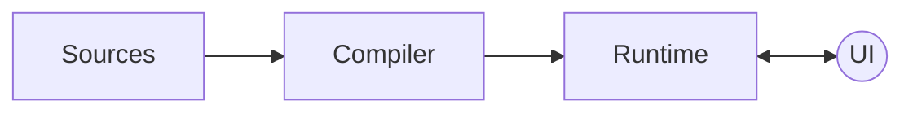
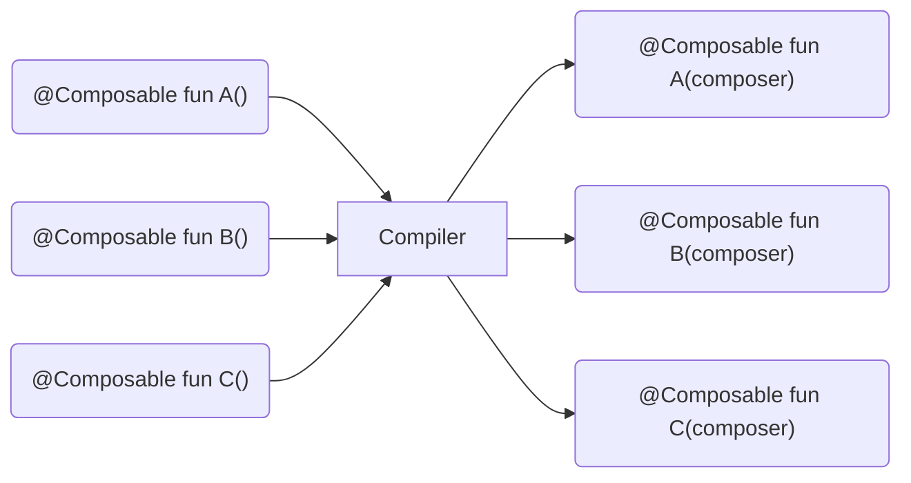

Compose는 여러 라이브러리로 구성되지만, Chapter2에서는 다음 세 가지 라이브러리를 중심으로 살펴볼 것입니다.

- 컴파일러
- 런타임
- UI

컴파일러와 런타임은 Compose의 핵심으로, 제네릭으로 설계되어 이들의 요구 사항을 충족하는 모든 클라이언트 라이브러리에서 사용될 수 있습니다.
반면, UI는 기술적으로 Compose 구조의 일부가 아닙니다. 
그럼에도 불구하고, UI 라이브러리를 살펴보는 것은 런타임이 어떻게 인메모리 표현을 처리하고, 최종적으로 실제 요소를 구체화하는지 이해하는데 도움이 되기 때문입니다.



Chapter1에서는 컴파일러와 런타임이 함께 동작하여 라이브러리 기능을 활성화한다고 설명했지만, 이에 익숙하지 않다면 추상적으로 느껴질 수 있습니다.
때문에 Chapter2에서는 다음에 대한 설명을 할 예정입니다.

- 컴파일러가 소스 코드를 런타임 요구 사항에 준수하도록 어떤 작업을 수행하는지
- 런타임이 어떻게 작동하는지
- 초기 컴포지션과 추가적인 재구성이 언제 트리거 되는지
- 트리의 인메모리 표현이 어떻게 제공되는지
- 인메모리 표현이 추가적인 재구성에 어떻게 사용되는지 

위 개념을 이해하게 되면 라이브러리가 어떻게 동작하는지, 그리고 개발자가 코드를 작성할 때 무엇을 기대할 수 있는지에 대한 전체적인 감을 잡을 수 있습니다.

## A Kotlin compiler plugin

메타 프로그래밍을 위해 Kotlin과 JVM에서는 일반적으로 kpat를 통한 어노테이션 프로세서를 사용하여 컴파일 전에 실행됩니다.
반면, Compose 컴파일러는 컴파일러 플러그인으로, 컴파일 과정에 완전히 통합됩니다. 
이는 Compose 라이브러리가 Kotlin 컴파일 단계 내에서 별도의 컴파일 작업을 수행할 수 있어, 
코드 형태에 대한 더 많은 정보를 얻고 전체 프로세스를 가속화할 수 있습니다.

이처럼, Kotlin 컴파일러 플러그인이 되면 다음 두 가지 장점을 얻을 수 있습니다.

1. Compose 컴파일러 검사를 IDEA 인스펙션과 통합하여 피드백 루프를 개선합니다.
   - 실제로 프로젝트를 빌드하지 않아도 코드 작성 중에 실시간으로 피드백을 받을 수 있습니다.
   - 컴파일러 플러그인은 컴파일러의 프론트엔드 단계에서 정적 분석을 수행하여, IDEA를 통해 경고와 오류를 보고할 수 있습니다.  
2. 새로운 코드 및 기존 코드를 자유롭게 조정할 수 있습니다.
   - 컴파일러 플러그인은 요소의 출력 IR(Intermediate Representation)을 대상 플랫폼이 지원하는 더 작은 단위로 낮추기 전에 조정할 수 있습니다.
   - Compose 컴파일러는 컴포저블 함수를 런타임이 지원하는 형태로 변환할 수 있습니다.

## Compose annotations

컴파일러 플러그인과 어노테이션 프로세서, 둘 모두 정적 분석과 유효성 검사를 위한 프론트엔드 단계를 공통적으로 갖고 있습니다.  
Compose 컴파일러는 이 프론트엔드 단계를 잘 활용하여 코드를 검사하고, 런타임이 예상하는 방식으로 동작하도록 보장합니다.

이후 프로그램을 Compose로 실행할 때, 처음으로 발생하는 일은 소스 코드가 라이브러리에 의해 처리되는 것입니다.  
Compose 컴파일러는 프로그램 코드를 스캔하여 `@Composable` 어노테이션이 있는 모든 부분을 검색합니다.  
또한, Compose는 추가적인 검사와 다양한 런타임 최적화, 특정 상황에서의 "단축키"를 제공하는 보조 어노테이션도 제공합니다.

> 모든 Compose 어노테이션은 Compose 런타임에서 제공됩니다.  
> 이는 컴파일러와 런타임 모듈 모두가 Compose 어노테이션을 잘 활용하기 때문입니다.

### @Composable

`@Composable`은 함수의 타입을 변경하여 여러 번 실행(재실행)될 수 있도록 만듭니다.  
또한, 실행 시 데이터를 노드로 매핑하여 트리에 추가하는 기능을 합니다.  
이 노드는 UI 노드일 수 있고, 사용하는 Compose 런타임 라이브러리에 따라 다른 성격의 노드일 수 있습니다.

Compose 런타임은 특정 사용 사례나 의미에 얽매이지 않는 제네릭 타입의 노드와 함께 작동한다는 점을 기억해야 합니다.

### @ExperimentalComposeApi

`@ExperimentalComposeApi`은 Compose API 중 안정화 전에 변경될 가능성이 있는 API를 표시할 때 사용됩니다.  
이러한 API를 코드베이스에서 사용할 때 경고가 발생하며, 명시적으로 'opt-in' 처리해야 합니다.  
Compose 컴파일러의 프론트엔드에서는 이 경고가 가능한 빨리 트리거되도록 합니다.

### @ComposeCompilerApi

Compose에서 컴파일러만 접근이 가능한 일부분을 표시할 때 사용됩니다.  
따라서, `@ComposeCompilerApi`으로 처리된 API를 외부에서 사용하려고 시도하면 즉시 인라인 오류가 발생합니다.

### @InternalComposeApi

`@InternalComposeApi`는 안정적인 릴리스를 위해 외부에서는 변경되지 않지만, 내부적으로는 변경될 수 있는 내부 API를 위해 사용됩니다.  
이 어노테이션은 Kotlin의 `internal` 키워드보다 더 넓은 범위를 가지며, 모듈 간에도 사용이 가능합니다. (Kotlin에서는 모듈 간 `internal` 사용을 지원하지 않습니다.)

### @DisallowComposableCalls

`@DisableComposableCalls`은 함수 내부에서 컴포저블 호출이 발생하지 않도록 방지하는데 사용됩니다.  
이는 컴포저블 함수의 `inline` 람다 파라미터에서 컴포저블 호출을 안전하게 사용할 수 없을 때 유용합니다. 

예를 들어, Compose UI의 일부인 `ComposeNode`에서 이 기능을 볼 수 있습니다.  
`ComposeNode`는 UI 노드를 컴포지션에 발행하며, `ComposeNode`의 호출자는 컴포저블이 생성된 후 초기화하거나, 업데이트하기 위한 람다를 전달해야 합니다.

```kotlin
@Composable inline fun <T : Any, reified E : Applier<*>> ComposeNode(
    noinline factory :() -> T,
    update: @DisallowComposableCalls Updater<T>.() -> Unit
) {
    // ...
}
```

`update` 람다는 인라인으로 동작하며, `@DisablComposableCalls`로 어노테이트되어 있습니다.  
이는 Compose 런타임이 모든 재구성 시점(every recomposition)에 `update` 람다를 인라인으로 호출하기 때문인데,   
이 시점에 새로운 컴포저블의 호출을 지원하지 않아서, 사전에 방지하기 위해 이 어노테이션을 사용합니다.

짐작할 수 있지만, 이 어노테이션은 클라이언트 프로젝트에서는 거의 사용되지 않습니다.  
그러나, Compose UI와는 다른 용도로 컴포즈를 사용하는 경우에는 중요한 역할을 할 수 있습니다.  
이런 경우에는 런타임을 위한 자체 클라이언트 라이브러리르 작성해야 할 수 있기에 런타임 제약을 준수해야 합니다. 

### @ReadOnlyComposable

`@ReadOnlyComposable`은 해당 컴포저블 본문이 컴포지션에 쓰기 작업을 수행하지 않고, 오직 읽기만 하는 함수임을 나타냅니다.  
이러한 경우에는 컴포저블 본문 내 중첩된 모든 컴포저블 호출에서도 동일한 제약이 적용되어야 합니다.  
위와 같은 가정이 만족되면, 런타임은 불필요한 코드를 생성하지 않을 수 있습니다.

컴포지션에 쓰기 작업을 수행하는 컴포저블의 경우, 컴파일러는 해당 컴포저블의 본문을 래핑하는 "그룹"을 생성하고, 런타임에 발행합니다.  
이렇게 발행된 그룹은 컴포저블의 정보를 컴포지션에 제공하여 다음과 같은 판단을 내릴 수 있도록 도와줍니다.

- 재구성 발생 시, 새로운 컴포저블의 데이터로 덮어써야 하는 경우, 기존 데이터를 어떻게 정리해야 하는지
- 컴포저블의 아이덴티티를 유지하면서 데이터를 이동해야 할 때, 데이터를 어떻게 처리해야 하는지

이처럼 컴파일러는 여러 타입의 그룹을 생성할 수 있습니다. (restartable 그룹, movable 그룹 등)  
더 많은 맥락을 이해하기 위해 "그룹"에 대한 설명이 필요합니다.  

그룹은 선택된 텍스트의 시작과 끝을 가리키는 몇 개의 포인터와 같은 개념입니다.  
모든 그룹은 소스 위치 키(source position key)가 있으며, 이를 통해 그룹을 유일하게 식별하고 저장할 수 있습니다. (위치 기반 메모이제이션 가능)  
또한, 이 키는 조건 논리(if-else 분기)에서 다른 아이덴티티를 인식하는 유용한 방법이기도 합니다.

```kotlin
if (condition) Text("Hello") 
else Text("World")
```

이 둘은 모두 `Text`이지만, 호출자에게는 서로 다른 의미를 나타내므로, 서로 다른 아이덴티티를 가집니다.  
위 상황에서 "movable 그룹"은 부모 그룹 내에서 재정렬이 가능하도록 의미를 갖는 아이덴티티 키(semantic identity key)를 가집니다.

컴포저블이 컴포지션에 쓰기 작업을 수행하지 않으면, 데이터가 교체되거나 이동되지 않기에 "그룹"을 생성할 필요가 없습니다.  
이와 같은 상황을 방지하기 위해 `@ReadOnlyComposable` 어노테이션이 사용됩니다.

Compose 라이브러리 내에서 "읽기 전용 컴포저블"의 예시로는 많은 `CompositionLocal` 기본값과 이를 위임하는 유틸리티가 있습니다.  

- Material의 `Colors`, `Typography`, `Shapes`
- `isSystemInDarkTheme()`, `LocalContext`, `LocalConfiguration`
- 애플리케이션 리소스를 얻기 위한 호출(이들은 `LocalContext`에 의존함)

전반적으로, 읽기 전용 컴포저블은 프로그램 실행 시 1번 설정되고 동일하게 유지되며, 트리의 컴포저블에서 읽을 수 있는 상태들을 나타냅니다.

### @NonRestartableComposable

`@NonRestartableComposable`은 함수나 프로퍼티 getter에 적용되었을 때, 재시작할 수 없는 컴포저블로 만듭니다.  
기본적으로 모든 컴포저블은 재시작할 수 있는 속성을 가집니다.

이 어노테이션이 추가되면, 컴파일러는 해당 컴포저블이 재구성되거나 건너뛰기 위해 필요한 보일러플레이트 코드를 생성하지 않습니다.   
이 어노테이션은 다른 컴포저블에 의해 재시작될 가능성이 높은 아주 작은 컴포저블에만 의미가 있을 수 있기 때문에 신중하게 사용해야 합니다.   

즉, 아주 작은 컴포저블들의 무효화・재구성은 부모・호출 컴포저블에 의해 관리되기에 자체 무효화(self invalidate) 할 필요가 없습니다.  
이와 같은 경우에 이 어노테이션을 사용하면 성능 향상을 기대할 수 있습니다. (그러나, 잘못 사용하면 예상치 못한 결과를 초래할 수 있습니다.)

### @StableMarker

Compose 런타임은 `@StableMarker`(meta-annotation), `@Immutable`, `@Stable` 어노테이션을 제공하여 타입의 안정성을 나타냅니다.  
그 중 `@StableMarker`은 `@Immutable`과 `@Stable`을 어노테이트하는 메타 어노테이션입니다.  

이는 중복적으로 보이겠지만, 재사용성을 위해 설계되었습니다.   
따라서, `@StableMarker`가 붙은 어노테이션(`@Immutable`과 `@Stable`)은 모두 `@StableMarker`의 의미를 함께 가지게 됩니다. 

```kotlin
// ...
@StableMarker
annotation class Immutable

// ...
@StableMarker
annotation class Stable
```

최종적으로 `@StableMarker`이 어노테이트된 타입에 대해서 아래와 같은 데이터 안정성 관련 요구사항을 암시합니다.

- 동일한 두 인스턴스에 대해 `equals` 호출의 결과는 항상 동일해야 합니다.
- 어노테이트된 타입의 공개 프로퍼티가 변경될 때마다 컴포지션에 이 변경을 항상 알립니다.
- 어노테이트된 타입의 모든 공개 프로퍼티도 안정적(Stable)이어야 합니다.

`@Immutable`과 `@Stable`로 어노테이트된 모든 타입도 `@StableMarker`로 어노테이트된 것과 동일한 의미를 가지기에, 위 요구사항을 충족해야 합니다.

위 요구 사항들은 컴파일러에게 개발자가 제공하는 약속이라는 점을 주목해야 합니다.  
컴파일러는 소스를 처리할 때 타입이 안정적이라는 것을 '가정'할 수 있지만, 컴파일 시간에 유효성 검사를 수행하지 않습니다.  
따라서 이 어노테이션들은 위 요구 사항들이 충족된다는 확신이 있을 때만 사용해야 합니다.

### @Immutable

```kotlin
@Target(AnnotationTarget.CLASS)
@Retention(AnnotationRetention.BINARY)
@StableMarker
annotation class Immutable
```

이 어노테이션은 클래스에 적용되어, 해당 클래스의 모든 공용 프로퍼티와 필드가 생성 후 변경되지 않는다는 것을 컴파일러에게 엄격히 약속합니다.  
이 약속은 `val` 키워드보다 더 강력한 약속이라는 점을 기억해야 합니다. 
`val`은 setter를 통한 프로퍼티의 재할당을 방지하지만, 가변 데이터 구조(`MutableList`)를 가리킬 수 있어 데이터가 불변임을 보장하지는 않습니다.
즉, Kotlin에서는 불변 데이터임을 보장하는 메커니즘이 제공되지 않기에, Compose에서는 이 어노테이션이 필요합니다.

"값이 초기화된 후에는 절대 변경되지 않는다."는 가정하에, 런타임은 스마트 재구성 및 재구성 건너뛰기 기능을 최적화할 수 있습니다.

`@Immutable`로 안전하게 플래그할 수 있는 좋은 예시는 다음을 만족하는 데이터 클래스(`data class`) 입니다.  

- 모든 프로퍼티가 `val`로 선언되어 있어, 생성 후 변경되지 않아야 합니다. 
- 모든 프로퍼티가 원시 타입(primitive types)이거나, `@Immutable`로 플래그된 타입이어야 합니다.
- 모든 프로퍼티가 커스텀 getter를 가지지 않아야 합니다.
  - 커스텀 getter는 호출될 때마다 매번 다른 결과를 반환할 가능성이 있어, 이 자체로 불안정한 API가 되기에 허용되지 않습니다.
 
`@Immutable`은 `@StableMarker`의 모든 특성을 상속받기에, `@StableMarker`에 명시된 조건을 충족해야 합니다.   
조건 중 하나로, `@Immutable`로 플래그된 클래스는 공개 프로퍼티들이 절대 변경되어선 안됩니다.  

결과적으로 `@Immutable`은 불변 타입을 안정적인(stable) 타입으로 플래그하기 위해 존재합니다.

### @Stable

```kotlin
@Target(
    AnnotationTarget.CLASS,
    AnnotationTarget.FUNCTION,
    AnnotationTarget.PROPERTY_GETTER,
    AnnotationTarget.PROPERTY
)
@Retention(AnnotationRetention.BINARY)
@StableMarker
annotation class Stable
```

`@Stable`은 `@Immutable`보다 가벼운 약속으로, 적용되는 요소에 따라 다른 의미를 가집니다.

- 타입에 적용되면, 해당 타입은 가변적임을 의미합니다. (`@Immutable`을 사용하는 경우는 제외)  
  또한, `@StableMarker`의 데이터 안정성 요구 사항을 충족하지만, 불변성을 보장하지 않습니다. 
- 함수나 프로퍼티에 적용되면, 동일한 입력에 대해 항상 동일한 결과를 반환함을 의미합니다. (순수 함수)  
  이는 함수 파라미터가 `@Stable`, `@Immutable`, 원시 타입(primitive type)일 때만 가능합니다. (stable로 간주됨)

런타임에서 위 내용이 얼마나 중요한지 잘 설명하는 좋은 예시가 있습니다:  
_컴포저블에 전달된 파라미터 타입이 모두 안정적(stable)인 경우, 위치 기반 메모이제이션을 통해 동등성을 비교하고, 모든 값이 이전 호출과 동일하다면 호출을 건너뛸 수 있습니다._

`@Stable`로 플래그 가능한 타입의 예시는, 공개 프로퍼티가 변경되진 않지만 불변으로 간주될 수 없는 객체입니다. 

- 내부적으로 `private` 가변 상태를 가지는 객체 
- `MutableState`로 프로퍼티 위임을 사용하지만, 외부에서는 불변으로 사용되는 객체

이처럼 `@Stable`은 컴파일러와 런타임에서 데이터가 어떻게 변하는지(또는 변하지 않는지)에 대한 가설을 세우고, 필요한 경우 최적화를 수행하는데 사용됩니다.  

`@Stable`은 이 어노테이션의 의미를 완전히 이해하고, 요구 사항이 충족 할 때만 사용해야 합니다.   
그렇지 않으면 컴파일러에 잘못된 정보를 제공하게 되어 런타임 오류로 이어질 수 있습니다.  
이러한 이유로 `@Stable`은 신중하게 사용해야 합니다.

> 흥미로운 점은 `@Immutable`과 `@Stable`이 서로 다른 의미와 약속을 가지고 있지만,
> Compose 컴파일러는 두 어노테이션을 동일하게 취급하여 스마트 재구성 및 재구성 건너뛰기를 활성화하고 최적화합니다.
> 하지만 두 어노테이션은 미래에 컴파일러와 런타임이 활용할 수 있는 다른 의미를 부여하기 위해 존재합니다.

## Registering Compiler extensions

지금까지는 런타임에서 제공하는 가장 관련성 높은 어노테이션들을 살펴봤다면,   
이제는 Compose 컴파일러 플러그인의 동작 방식과 이 어노테이션들을 어떻게 사용하는지 이해할 차례입니다.

Compose 컴파일러 플러그인이 가장 먼저 하는 일은 Kotlin 컴파일러 파이프라인에 자신을 등록하는 것입니다.  
이를 위해 Kotlin 컴파일러가 제공하는 `ComponentRegistrar` 메커니즘을 사용합니다.

`ComposeComponentRegistrar`는 다양한 목적을 위한 컴파일러 확장 기능들을 등록합니다.  
이 확장 기능들은 라이브러리 사용을 용이하게 하고 런타임에 필요한 코드를 생성하는 역할을 합니다.  
이렇게 등록된 모든 확장 기능들은 Kotlin 컴파일러와 함께 실행됩니다.

Compose 컴파일러는 활성화된 컴파일러 플래그에 따라 몇 가지 확장 기능을 추가로 등록합니다.  
Compose를 사용하는 개발자들은 몇 가지 컴파일러 플래그를 활성화하여 다음과 같은 기능을 사용할 수 있습니다.

- 라이브 리터럴 기능
- 생성된 코드에 소스 정보를 포함하여 IDE 및 다른 도구들이 컴포지션을 검사하는 기능
- `remember`에 대한 최적화
- Kotlin 버전 호환성 검사 억제
- IR 변환 과정에서 디코이 메서드 생성 기능

## Static analysis

Compose 컴파일러는 일반적인 컴파일러 플러그인처럼, 가장 먼저 린팅(linting)을 수행합니다.  
정적 분석은 소스 코드를 스캔하여 라이브러리 어노테이션을 찾고, 이들이 올바르게 사용되었는지 확인하는 중요한 검사를 수행합니다.
여기서 '올바르게'란, 런타임이 기대하는 방식으로 사용되었는지를 의미합니다.  

이 과정에서 발생하는 경고나 오류는 컴파일러 플러그인이 접근할 수 있는 컨텍스트 트레이스(context trace)를 통해 보고됩니다.
이는 개발자가 코드를 작성하는 동안 경고나 오류를 인라인으로 표시할 수 있는 IDEA와 통합됩니다.  

이러한 모든 검증은 컴파일러의 프론트엔드 단계에서 수행되어, 
Compose가 개발자에게 가능한 빠르게 피드백을 제공할 수 있도록 돕습니다.

가장 중요한 몇 가지 정적 검사를 살펴보겠습니다.

## Kotlin Compiler version

Compose 컴파일러는 특정 Kotlin 버전을 요구하므로, 사용 중인 Kotlin 컴파일러 버전이 Compose와 호환되는지 확인해야 합니다.
이 검사는 필수 조건을 충족하지 않으면 큰 문제가 되기에, 가장 먼저 수행됩니다.

`suppressKotlinVersionCompatibilityCheck` 컴파일러 인수를 사용하여 이 검사를 우회할 수 있지만, 이는 리스크를 감수해야 합니다.
이 방식은 어떤 버전의 Kotlin에서도 Compose를 실행할 수 있게 되지만, 버전 불일치로 인해 문제가 발생할 수 있기에 권장되지 않습니다.

## Static Checkers

컴파일러에 등록된 확장 기능 중 일부는 개발자가 코드를 작성하는 동안 정적 검사기 형태로 제공됩니다.  
"호출, 타입, 선언에 대한 검사기"들이 Compose에서 확장 기능으로 등록됩니다.  
이 검사기들은 Compose 라이브러리를 올바르게 사용하도록 보장하며, 라이브러리의 목적에 맞게 설계되어 있습니다.   
예를 들어, [Chapter1에서 배운 컴포저블의 요구 사항](Chapter%201%20%3A%20Composable%20functions.md#composable-requirements)이 여기에서 검증되고, 위반될 때 보고됩니다.

Kotlin 컴파일러에는 검사하려는 요소에 따라 다양한 종류의 검사기가 있습니다. (클래스 인스턴스화, 타입, 함수 호출, deprecated 호출, contracts, 클로저 캡처, infix 호출, coroutine 호출, operator 호출 등)  
이 검사기들은 컴파일러 플러그인이 소스 코드의 해당 요소들을 분석하고 필요할 때 정보, 경고, 오류 등을 개발자에게 알려줄 수 있도록 합니다.

등록된 모든 검사기들은 Kotlin 컴파일러의 프론트엔드 단계에서 실행되므로, 매우 빠르고 CPU 사용량이 낮아야 합니다.
이러한 검사기들은 개발자가 코드를 입력하는 동안 실행되기에 사용자 경험을 방해하지 않도록 가볍게 만들어야 하므로 빠르고 효율적이어야 합니다.

## Call checks

Compose에서 등록된 다양한 검사기 중 하나는 함수 호출을 검증하는 것입니다.  
Compose 컴파일러는 여러 상황에서 컴포저블 호출을 검증하기 위해 '정적 호출 검사'(static call check)를 수행합니다.  
예를 들어, `@DisallowComposableCalls` or `@ReadOnlyComposable` 범위에서 컴포저블이 호출되는 경우, 이를 검증합니다.

호출 검사기(call checker)는 코드 전반의 모든 함수 호출을 정적 분석하는 컴파일러 확장 기능입니다.  
이 기능은 소스 코드에서 함수 호출로 간주되는 모든 PSI 요소들을 검사하기 위해 재귀적으로 호출되는 '검사 함수'를 제공합니다.  
즉, 방문자 패턴(visitor pattern)을 구현하여 PSI 트리의 모든 노드를 검사하는 것입니다.

검사 중 일부는 현재 살펴보고 있는 코드 요소 외에도 더 넓은 컨텍스트를 필요로 합니다.  
이는 하나의 PSI 노드를 분석하는 것만으로는 충분하지 않고, "컴포저블의 호출 지점"과 같은 정보가 필요함을 의미합니다.  
이런 정보를 수집하기 위해선 여러 코드 요소에서 작은 정보들을 기록하고, 이 정보를 모아 전체적인 맥락을 파악한 후 더 복잡한 검증을 수행해야 합니다.  
이를 위해 컴파일러는 이 정보를 컨텍스트 트레이스(context trace)에 기록하여, 검사의 범위를 넓혀서 람다 표현식, try/catch 블록 등 관련된 요소들을 찾을 수 있습니다.

예를 들어, `@DisallowComposableCalls`로 플래그된 컨텍스트 내에서 컴포저블 호출이 이루어질 때, 컴파일러는 이와 관련된 정보를 기록하고 오류를 보고합니다.

```kotlin
if (arg?.type?.hasDisallowComposableCallsAnnotation() == true) {
    context.trace.report(
        ComposeWritableSlices.LAMBDA_CAPABLE_OF_COMPOSER_CAPTURE, 
        descriptor, // reference to the function literal
        false
    )

    context.trace.report(
        ComposeErrors.CAPTURED_COMPOSABLE_INVOCATION.on(
            reportOn,
            arg,
            arg.containingDeclaration
        )
    )
    return
}
```

> 컨텍스트와 컨텍스트 트레이스는 '검사 함수'를 호출할 때 마다 사용할 수 있으며, 실제로 이 트레이스는 오류, 경고, 정보 메시지를 보고하는데 사용됩니다.  
> 트레이스는 전체 분석 과정에서 필요한 정보를 기록해 두는 가변적인 구조로 이해할 수 있습니다. 

다른 검사들은 더 간단해서 현재 방문 중인 요소의 정보만 필요하며, 이 검사들은 필요한 작업을 수행한 후 바로 반환합니다.  
각 검사 호출 시, 플러그인은 현재 노드의 요소 타입을 확인한 뒤, 모든 것이 올바르면 검사를 마치고 반환합니다.  
필요한 경우 오류를 보고하거나, 관련 정보를 컨텍스트 트레이스에 기록하거나, 이 노드의 부모 노드로 올라가서 더 많은 노드를 방문하고 정보를 수집합니다.  
이와 같은 방식으로 다양한 어노테이션에 대한 검사가 수행됩니다.

Compose 컴파일러가 확인하는 것 중 하나는 컴포저블이 허용되지 않은 위치에서 호출되지 않도록 하는 것입니다.  
예를 들어, try/catch 블록 내에서 호출되거나, 컴포저블로 어노테이트되지 않은 함수에서 호출되거나, `@DisallowComposableCalls`로 플래그 처리된 람다에서 호출되지 않도록 합니다.

각 컴포저블 호출에 대해, 컴파일러는 PSI 트리를 따라 올라가며 호출자, 호출자의 호출자 등을 확인하여, 이 호출에 대한 모든 요구 사항이 충족되는지 확인합니다. 
부모 요소는 람다 표현식, 함수, 프로퍼티, 프로퍼티 액세서, try/catch 블록, 클래스, 파일 등이 될 수 있으므로 모든 시나리오를 고려합니다.

> PSI(Program Structure Interface)는 컴파일러의 프론트엔드 단계에서 언어의 구조를 모델링합니다.  
> 따라서, PSI가 코드를 이해하는 방식은 완전히 구문적(syntactical)이고 정적(static)이라는 점을 명심해야 합니다.

검사에서 인라인 함수를 고려하는 것도 중요합니다. 컴포저블에서 인라인 람다를 호출하는 경우, 인라인 람다에서는 컴포저블을 호출할 수 있어야 합니다.  
컴파일러는 컴포저블을 호출하는 모든 인라인 람다들이 호출 스택 상위에서 컴포저블에 의해 감싸져(enclosed) 있는지 확인합니다.

또 다른 검사로는 필요한 곳에 `@Composable`의 누락을 검사하는 것입니다. 이를 통해 개발자에게 필요한 어노테이션을 추가하도록 요청할 수 있습니다.  
예를 들어, 람다 안에서 컴포저블을 호출하는 경우, 컴파일러는 해당 람다에도 `@Composable`을 어노테이트하라고 제안할 것입니다.  
정적 분석 검사는 코드를 작성하는 동안 개발자를 안내하기 위해 존재하며, 항상 금지하는 것이 아니라 때로는 필요한 것을 추론하고 제안하거나 코드를 개선하는 방법을 알려줍니다.

`@ReadOnlyComposable`로 어노테이트된 컴포저블 함수에 대해서도 정적 호출 검사가 있습니다.  
이러한 함수는 다른 읽기 전용 컴포저블만 호출할 수 있습니다. 만약, 이를 위반하면 최적화를 위한 계약(contract for the optimization)을 위반하게 됩니다.  
("읽기 전용 컴포저블이 컴포지션에서 읽기만 하고 절대 쓰지 않는다."는 계약을 위반)  
이 규칙은 컴포저블의 모든 레벨에서 충족되어야 하므로, 방문자 패턴이 유용하게 사용됩니다.

또 다른 검사는 컴포저블 함수 참조의 사용을 금지하는 것입니다. 이는 현재 Compose에서 지원되지 않는 기능입니다.

## Type checks

때로는 함수뿐만 아니라 타입도 `@Composable`로 어노테이트됩니다.  
이를 위해 Compose 컴파일러는 타입 추론과 관련된 검사를 수행하여 `@Composable`로 어노테이트 되지않은 타입이 발견되었을 때 보고할 수 있습니다.  
이는 앞서 언급한 함수 호출에 대한 검사와 유사합니다.  
오류 메시지에는 추론된 타입과 예상된 타입, 그리고 각 어노테이션을 함께 출력하여 차이를 더 명확하게 보여줍니다.

## Declaration checks

호출 지점과 타입에 대한 검사 외에도 Compose 컴파일러는 선언(declaration)에 대한 검사도 수행합니다.  
이 검사는 Compose 코드베이스의 일부인 프로퍼티, 프로퍼티 접근자, 함수 선언, 함수 파라미터 등을 분석합니다.

프로퍼티, 프로퍼티 getter, 함수는 `@Composable`로 어노테이트 되어 있어도, 재정의(override)될 수 있습니다.  
이 요소들이 재정의될 때도, Compose 컴파일러는 일관성을 유지하기 위해서 재정의된 요소에도 `@Composable`로 어노테이트 되어 있는지 확인하는 검사를 수행합니다.

또 다른 선언 검사는 컴포저블이 suspend로 선언되지 않도록 하는 것이며, 이는 현재 지원되지 않기에 금지됩니다.  
Chapter1에서 설명한 것처럼, suspend는 `@Composable`과 다른 의미를 가지며, 두 개념 모두 언어의 기본 요소로 이해될 수 있지만, 완전히 다른 용도로 설계되었습니다.
현재로서는 두 개념을 함께 사용하는 것이 지원되지 않습니다.

또한, `@Composable`로 어노테이트된 `main` 함수, 프로퍼티의 백킹 필드(backing field)에 `@Composable`을 어노테이트하는 행동들은 선언 검사를 통해 금지됩니다.

## Diagnostic suppression

컴파일러 플러그인은 확장 기능으로 진단 억제기(diagnostic suppressor)를 등록하여 특정 상황에서 진단 메시지(e.g : 정적 검사에 의해 보고된 오류 등)를 무시할 수 있습니다.  
이는 일반적으로 Kotlin 컴파일러가 허용하지 않는 코드를 컴파일러 플러그인이 생성하거나 지원하려 할 때, 해당 검사를 우회하여 코드를 작동시키기 위해 사용됩니다.

Compose는 Kotlin 언어 제한을 우회하기 위해 `ComposeDiagnosticSuppressor`를 등록하여 컴파일 오류를 피하고, 특정 사용 사례를 실행할 수 있습니다.

Kotlin 언어 제한 중 하나는 호출 지점에서 "non-source annotations"로 어노테이트된 인라인 람다에 대한 것입니다.  
`BINARY` 또는 `RUNTIME` 유지 정책(retention)을 가진 어노테이션들은 컴파일 후에도 바이너리에 남아있습니다.  
반면, `SOURCE` 어노테이션은 컴파일 시점에서만 존재하고 이후에는 사라집니다.

인라인 람다는 컴파일할 때 호출한 함수에 실제 코드로 삽입되므로, 어디에도 저장되지 않아서 어노테이션을 달 수 있는 대상이 없어집니다.
그래서 Kotlin 컴파일러는 인라인 람다에 `BINARY` 또는 `RUNTIME` 어노테이션을 달 수 없게하고, 다음과 같은 오류를 보고 합니다:   
"The lambda expression here is an inlined argument so this annotation cannot be stored anywhere."

위 오류를 트리거하는 예시 코드 입니다:

```kotlin
@Target(AnnotationTarget.FUNCTION)
annotation class FunAnn

inline fun myFun(a: Int, f: (Int) -> String): String = f(a)

fun main() {
    myFun(1) @FunAnn { it.toString() } // Call site annotation
}
```

Compose 컴파일러는 `@Composable`로 어노테이된 경우에만, 위와 같은 오류를 우회할 수 있게하여 다음과 같이 코드를 작성할 수 있습니다:

```kotlin
@Composable
inline fun MyComposable(@StringRes nameResID: Int, resolver: (Int) -> String) {
    val name = resolver(nameResID)
    Text(name)
}

@Composable
fun Screen() {
    MyComposable(R.string.app_name) @Composable { 
        LocalContext.current.resources.getString(it)
    }
}
```

위와 같이 람다 파라미터가 아닌 호출 지점에서 `@Composable` 어노테이트가 가능하기에, 함수를 선언할 때 반드시 `@Composable`을 어노테이트 할 필요가 없습니다.
이와 같은 방식으로 함수는 더 유연한 계약(contract)를 가질 수 있습니다.

또 다른 Kotlin 언어 제한은 억제기(suppressor)를 통해 우회되며, 
함수가 `@Composable`로 어노테이트된 경우에 Kotlin 컴파일러가 지원하지 않는 위치에서 명명된 인자(named argument)를 사용할 수 있는 것입니다.

```kotlin
interface FileReaderScope {
    fun onFileOpen(): Unit
    fun onFileClose(): Unit
    fun onLineRead(line: String): Unit
}

object Scope: FileReaderScope {
    override fun onFileOpen() = TODO()
    override fun onFileClose() = TODO()
    override fun onLineRead(line: String) = TODO()
}

@Composable
fun FileReader(
    path: String,
    content: @Composable FileReaderScope.(path: String) -> Unit
) {
    Column {
        // ...
        Scope.content(path)
    }
}
```

위 예시에서 `@Composable`를 제거하면, "Named arguments are not allowed for function types."와 같은 오류가 발생합니다.

이와 같은 요구 사항은 expected 클래스의 멤버와 같은 경우에도 억제됩니다.  
Compose는 멀티 플랫폼을 목표로 하므로, 런타임에서 컴포저블로 처리된 expect 함수와 프로퍼티를 반드시 지원해야 합니다.

## Runtime version check

정적 검사기(static checkers)와 진단 억제기(diagnostic suppressor)를 통해 코드를 검사하고, 오류를 보고하고, 오류를 우회할 수 있음을 확인했습니다.
그 다음은 코드 생성 직전에 가장 먼저 일어나는 작업인 Compose 런타임 버전을 확인하는 것입니다.
Compose 컴파일러는 최소한의 런타임 버전을 요구하기에, 사용 중인 런타임이 최신인지 확인하는 검사를 수행합니다. 
이 검사는 런타임이 누락되었거나 오랜된 경우를 감지할 수 있습니다.

단일 Compose 컴파일러 버전은 최소 지원 버전보다 높은 여러 런타임 버전을 지원할 수 있습니다.

앞서 [Kotlin 컴파일러 버전](#kotlin-compiler-version)을 검사하고, 또 다른 버전을 검사하는 것은 Compose 런타임 버전입니다.

## Code generation

마침내, 컴파일러가 코드 생성 단계로 넘어갑니다.  
이는 AP(annotation processor)와 컴파일러 플러그인이 공통으로 가지는 또 하나의 특징입니다.  
둘 모두 런타임 라이브러리가 사용할 편리한 코드를 생성하는데 자주 사용됩니다.

## The Kotlin IR

컴파일러 플러그인은 새로운 코드를 생성하는 것뿐만이 아니라, 소스 코드를 수정할 수 있습니다.  
소스 코드 수정이 가능한 이유는 컴파일러 플러그인이 최종 코드를 타겟팅하는 플랫폼용으로 생성하기 전에 언어의 IR(Intemediate Representation)에 접근할 수 있기 때문입니다. 

즉, 컴파일러 플러그인은 IR 단계에서 다음 작업을 할 수 있습니다.

- 파라미터 교체
- 새로운 파라미터 추가
- 코드를 "커밋"하기 전, 코드의 구조를 재구성

보통 이러한 작업은 Kotlin 컴파일러의 백엔드 단계에서 이루어집니다. 
그리고 예상할 수 있듯이, Compose는 각 컴포저블 호출에 암시적인 파라미터 Composer를 "주입"하기 위해 이러한 작업을 수행합니다. 

컴파일러 플러그인은 다양한 형식으로 코드를 생성할 수 있습니다.  
만약, JVM만을 대상으로 한다면 Java 바이트코드를 생성하는 것으로 생각할 수 있습니다.   
하지만, Kotlin 팀이 모든 IR 백엔드를 안정화하고 모든 플랫폼에 대해 단일 IR을 사용하도록 계획하고 리팩토링하고 있기 때문에 IR을 생성하는 것이 더 합리적입니다.
IR은 플랫폼에 구애받지 않는 언어 요소들의 표현으로 존재합니다.   
즉, IR을 생성하면 Compose에서 생성된 코드가 멀티플랫폼에서 동작할 가능성이 높아집니다.

Compose 컴파일러 플러그인은 Kotlin 컴파일러의 공통 IR 백엔드에서 제공하는 확장 기능인
`IrGenerationExtension`의 구현을 등록하여 IR을 생성합니다.

## Lowering

> "로우어링"은 컴파일러가 고수준 또는 고급 프로그래밍 개념을 더 낮은 수준의 원자적 개념으로 변환하는 것을 의미합니다. 
>
> 이는 Kotlin에서 일반적인 과정입니다. 
> Kotlin은 언어의 IR을 사용하여 고급 개념을 표현할 수 있으며, 이 개념들은 JVM 바이트코드, Javascript, LLVM의 IR, 또는 개발자들이 목표로하는 플랫폼으로 변환되기 전에 더 낮은 수준의 원자적 개념으로 변환되어야 합니다. 
> 
> Kotlin 컴파일러에는 이를 위한 로우어링 단계가 있으며, 이 단계는 일종의 정규화(normalization) 과정으로 이해될 수 있습니다.

Compose 컴파일러는 라이브러리에서 지원하는 일부 개념을 낮춰서 런타임이 이해할 수 있는 표현으로 정규화합니다.  
이러한 로우어링 과정이 컴파일러 플러그인의 실제 코드 생성 단계를 의미합니다.  
이 단계에서 컴파일러는 IR 트리의 모든 요소를 방문하고, 런타임 요구 사항에 따라 필요한 경우 IR을 조정합니다.

다음은 로우어링 단계 동안 발생하는 몇 가지 중요한 예시의 간략한 요약입니다:

- 클래스의 안정성을 추론하고, 이를 런타임에서 이해할 수 있도록 필요한 메타데이터를 추가합니다.
- 라이브 리터럴 표현식을 변환하여 가변 상태의 인스턴스에 접근하도록 함으로써, 소스 코드를 다시 컴파일하지 않고도 런타임에서 변경 사항을 반영할 수 있도록 합니다. (라이브 리터럴 기능)
- 모든 컴포저블에 Composer 파라미터를 주입하고, 이를 모든 컴포저블 호출에 전달합니다.
- 아래 작업을 위해 컴포저블 본문을 래핑합니다.
  - 제어-흐름(control-flow)을 위한 다양한 타입의 그룹 생성 (replaceable 그룹, movable 그룹 등)
  - 기본 인수(default argument) 지원을 구현하여, 생성된 그룹 내에서 실행될 수 있도록 합니다. (Kotlin의 기본 파라미터 지원에 의존하지 않음.)
  - 함수가 재구성을 건너뛸 수 있도록 가르칩니다.
  - 상태 변경 관련 정보를 트리 아래로 전달하여, 상태 변경 시 자동으로 재구성될 수 있도록 합니다.

이제 Compose 컴파일러 플러그인이 적용하는 모든 종류의 로우어링에 대해 알아보겠습니다.

## Inferring class stability

스마트 재구성(Smart recomposition)은 컴포저블의 입력이 변경되지 않고 안정적이라고 간주될 때 재구성을 건너뛰는 것을 의미합니다.
여기서 '안정성'은 매우 중요한 개념입니다. 이는 Compose 런타임이 안전하게 입력을 읽고, 비교하여, 필요할 때 재구성을 건너뛸 수 있다는 것을 의미합니다. 
이처럼 안정성의 궁극적인 목표는 런타임을 도와주는 것입니다.

이와 같은 생각의 흐름을 따라, 안정적인 타입(stable type)이 충족해야 하는 속성을 요약하면 다음과 같습니다:

- 동일한 두 인스턴스에 대한 `equals` 호출은 항상 동일한 결과를 반환해야 합니다.  
  - 이러한 비교로 일관성을 가질 수 있고, 이는 런타임이 신뢰할 수 있음을 의미합니다.
- 공개 프로퍼티가 변경될 때마다 항상 컴포지션에 알려야 합니다.  
  - 그렇지 않으면, 컴포저블의 입력과 실제 반영되는 최신 상태 간의 비동기화(desynchronization)가 발생할 수 있습니다.
  - 이 경우에는 항상 재구성을 트리거하여 방지해야 합니다. 
  - 이처럼 항상 재구성이 트리거되면 스마트 재구성은 해당 프로퍼티에 의존할 수 없습니다.
- 모든 공개 프로퍼티는 원시(primitive) 타입이거나 안정적인 타입으로 간주되는 타입이어야 합니다.

모든 원시 타입 및 함수 타입, String은 정의상 불변이기 때문에 안정적인 타입으로 간주됩니다.  
불변 타입은 변경되지 않기에 컴포지션에 변경 사항을 알릴 필요가 없습니다.

또한, 불변은 아니지만 Compose에서 안정적이라고 간주되는 타입들이 있습니다.  
이 예시로 `MutableState`가 있으며, 이는 상태가 변경될 때마다 컴포지션에 알리기에 스마트 재구성이 안전하게 의존할 수 있습니다.

코드에서 생성하는 사용자 정의 타입의 경우, 위에서 언급한 속성을 준수하는지 확인하여 `@Immutable` 또는 `@Stable`로 어노테이트하여 안정적인 타입으로 표시할 수 있습니다.  
그러나, 개발자가 이 계약을 항상 준수하는 것은 매우 위험하고 시간이 지남에 따라 유지하기 어려울 수 있습니다.
이를 대신하여 클래스 안정성을 자동으로 추론하는 것이 바람직합니다.

Compose는 자동으로 클래스 안정성을 추론하는 것을 수행합니다.  
안정성을 추론하는 알고리즘은 계속 발전하고 있지만, 기본적인 개념은 모든 클래스를 방문하여 `@StabilityInferred` 어노테이션을 생성하는 것입니다.  
또한, 클래스의 안정성 정보를 인코딩하는 'synthetic static final int $stable' 값을 추가합니다.  
이 값은 컴파일러가 런타임에 클래스의 안정성을 결정하는데 필요한 추가 메커니즘을 생성하는데 도움이 됩니다.  
이를 통해 Compose는 이 클래스에 의존하는 컴포저블들의 재구성 필요 여부를 결정할 수 있습니다.

> 실제로는 모든 클래스를 방문하는 것이 아닌, 특정 조건을 충족하는 클래스만을 대상으로 방문합니다.  
> 다음과 같은 클래스들은 방문에서 제외됩니다: enum, enum entry, interface, annotation, anonymous object, expect element, inner class, companion object, inline class   
> 또한, 이미 언급한 어노테이션(`@Stable`, `@Immutable`)으로 안정성이 표시된 클래스도 제외됩니다.
> 
> 따라서 전체적으로 보면, 안정성으로 처리되지 않은 클래스, 데이터 클래스 등이 방문 대상이 됩니다.  
> 이는 컴포저블의 입력을 모델링할 때 사용할 것이기 때문에 의미가 있습니다.

Compose는 클래스의 안정성을 추론하기 위해 여러 요소들을 고려합니다.  
모든 생성자 파라미터가 안정적인 경우에는 해당 클래스를 안정적으로 간주합니다.  
예를 들어, `class Foo`, `class Foo(val value: Int)`와 같은 클래스는 파라미터가 없거나 안정적인 파라미터만 있으므로 안정적으로 추론됩니다.  
반면, `class Foo(var value: Int)`와 같은 경우는 즉시 불안정한 것으로 추론됩니다.

추가로, 클래스의 제네릭 타입 파라미터도 클래스의 안정성에 영향을 미칠 수 있습니다:

```kotlin
class Foo<T>(val value: T)
```

위와 같은 경우, `T`는 클래스의 생성자 파라미터 중 하나로 사용되기에 `Foo`의 안정성은 `T`에 전달된 타입의 안정성에 의존합니다.  
추가로, `T`가 실체화된(`reified`) 타입이 아니므로 런타임까지는 `T`의 타입이 무엇인지 알 수 없습니다.  
그렇기에 `T`에 전달된 타입이 알려진 후에 클래스의 안정성을 결정하는 메커니즘이 필요합니다.  
이를 해결하기 위해 Compose 컴파일러는 `@StabilityInferred`에 비트마스크(bitmask)를 계산하여 추가합니다.  
이 비트마스크는 런타임에 해당 클래스의 안정성을 계산할 때, 해당 타입 파라미터의 안정성에 의존해야 함을 나타냅니다.

제네릭 타입을 사용한다고 해서 반드시 불안정한 타입이라는 것은 아닙니다.  
예를 들어, 다음 코드는 컴파일러가 안정적인 타입으로 추론합니다:

```kotlin
class Foo<T>(val a: Int, b: T) { 
    val c: Int = b.hashCode() 
}
```

위 경우 `hashCode()` 계약(contract)에 따르면, 동일한 인스턴스에 대해 항상 동일한 `hashCode` 값을 반환하는 것이 보장되므로, 안정성의 한 요소로 간주됩니다.    
따라서, 제네릭 타입 `T`를 사용하더라도, `T`가 `hashCode()`의 계약을 준수하다면, `class Foo`는 안정적으로 간주됩니다.

`class Foo(val bar: Bar, val bazz: Bazz)`와 같이 다른 클래스로 구성된 클래스의 경우, 안정성은 모든 파라미터의 안정성을 조합하여 추론되며, 이는 재귀적으로 해결됩니다.

내부 가변 상태와 같은 요소들도 클래스를 불안정하게 만듭니다.   
다음은 이에 해당하는 예시입니다:

```kotlin
class Counter {
    private var count: Int = 0
    
    fun getCount(): Int = count
    fun increment() { count++ }
}
```

이 상태는 클래스 내부적으로 변하더라도, 시간이 지남에 따라 변합니다.  
이는 런타임이 해당 상태가 일관되게 유지될 것이라고 신뢰할 수 없음을 의미합니다.

전체적으로 Compose 컴파일러는 안정성을 증명할 수 있을 때만 타입을 안정적으로 간주합니다.  
예를 들어, 인터페이스는 어떻게 구현될지 알 수 없기에 불안정한 것으로 간주됩니다.

```kotlin
@Composable
fun <T> MyListOfItems(items: List<T>) {
    // ...
}
```

위 예시에서는 `List`를 인수로 받는데, 이는 `ArrayList`와 같이 가변적으로 구현될 수 있습니다.  
컴파일러는 불변적인 구현만 사용할 것이라고 추론할 수 없기에, 이는 불안정한 것으로 간주됩니다.

또 다른 예로, 구현이 불변일 수 있는 가변성을 가진 공개 프로퍼티 타입이 있습니다.   
컴파일러는 이를 추론할 수 없기에, 기본적으로 이 타입도 불안정하다고 간주합니다.

구현이 불변일 수 있는 가변 공개 프로퍼티 타입의 경우, 많은 상황에서 불변으로 구현될 수 있고, Compose 런타임에서는 충분히 안정적으로 동작시킬 수 있습니다.  
그래서 컴포저블의 입력으로 사용하는 모델이 Compose에서 불안정하다고 판단되더라도, 개발자들이 더 많은 정보를 가지고 있고 제어할 수 있다면 명시적으로 `@Stable`로 표시할 수 있습니다.

공식 문서에서는 다음과 같은 예시를 제공합니다:

```kotlin
// Marking the type as stable to favor skipping and smart recomposition
@Stable
interface UiState<T : Result<T>> {
    val value: T?
    val exception: Throwable?
    
    val hasError: Boolean
        get() = exception != null
}
```

> 컴파일러가 안정성을 추론하는 내부 동작은 시간이 지나면서 변경되고 개선될 수 있습니다.  
> 장점으로는 이러한 변경점들이 항상 라이브러리 사용자에게 투명하게 유지된다는 것입니다.

## Enabling live literals

컴파일러에 전달할 수 있는 플래그 중 하나는 라이브 리터럴(live literals)입니다. 
시간이 지남에 따라 이 기능의 두 가지 존재하게 되었으며, liveLiterals(v1) 또는 liveLiteralsEnabled(v2) 플래그를 사용하여 둘 중 하나를 활성화할 수 있습니다.

라이브 리터럴은 컴파일 없이 미리보기(preview)에서 변경 사항을 실시간으로 반영할 수 있는 기능입니다. 
Compose 컴파일러가 하는 일은 이러한 표현식을 MutableState에서 값을 읽는 새 버전으로 대체하는 것입니다. 
이를 통해 런타임은 프로젝트를 다시 컴파일할 필요 없이 즉시 변경 사항을 알릴 수 있습니다. 

라이브러리의 kdocs에서는 다음과 같이 설명하고 있습니다: 
“This transformation is intended to improve developer experience and should never be enabled in a release build as it will significantly slow down performance-conscious code”

Compose 컴파일러는 코드베이스의 각 상수 표현식에 대해 고유한 ID를 생성한 다음, 모든 상수를 MutableState에서 값을 읽는 프로퍼티 getter로 변환합니다.
이는 각 파일에 대해 생성된 싱글톤 클래스에 보관됩니다. 런타임에는 생성된 키를 사용하여 이러한 상수의 값을 얻을 수 있는 API가 제공됩니다.

다음은 라이브러리 kdocs에서 추출한 예시입니다. 다음과 같은 Composable이 있다고 가정해봅시다:

```kotlin
@Composable
fun Foo() {
    print("Hello")
}
```

이는 다음과 같이 변환됩니다:

```kotlin
// file: Foo.kt
@Composable
fun Foo() {
    print(LiveLiterals$FooKt.`getString$arg-0$call-print$fun-Foo`())
}

object LiveLiterals$FooKt {
    var `String$arg-0$call-print$fun-Foo`: String = "Hello"
    var `State$String$arg-0$call-print$fun-Foo`: MutableState<String>? = null
    
    fun `getString$arg-0$call-print$fun-Foo`(): String {
        val field = this.`State$String$arg-0$call-print$fun-Foo`
        
        val state = if (field == null) {
            val tmp = liveLiteral(
                key = "String$arg-0$call-print$fun-Foo",
                defaultValue = this.`String$arg-0$call-print$fun-Foo`
            )
            this.`State$String$arg-0$call-print$fun-Foo` = tmp
            tmp
        } else {
            field
        }
        
        return field.value
    }
}
```

상수가 해당 파일에 대한 생성된 싱글톤에 보관된 MutableState에서 값을 읽는 getter로 변환되는 것을 볼 수 있습니다.

## Compose lambda memoization

Composable 함수에 전달되는 람다의 실행을 최적화하는 방법을 런타임에 알려주기 위한 IR을 생성합니다.

- Non-composable lambdas : 컴파일러는 이 람다들을 `remember` 호출로 래핑하여 메모이제이션하도록 IR을 생성합니다. 
- Composable lambdas : 컴파일러는 이 람다들을 래핑하고 런타임에 컴포지션에 저장하고 읽는 방법을 알려주는 IR을 생성합니다.
 
### Non-composable lambdas

이 작업은 Composable 함수에 전달되는 람다 호출을 최적화하여 재사용할 수 있도록 합니다. 
Kotlin은 값을 캡처하지 않는 람다를 싱글톤 인스턴스로 모델링하여 최적화합니다.
그러나 람다가 값을 캡처하면 호출마다 값이 달라질 수 있어 각각의 람다에 대해 다른 인스턴스가 필요합니다.
Compose는 이 특정 경우에 대해 더 스마트한 최적화를 제공합니다. 예를 들어:

```kotlin
@Composable
fun NamePlate(name: String, onClick: () -> Unit) {
    // onClick()
}
```

여기서, `onClick`은 Composable 함수에 전달된 일반 Kotlin 람다입니다.
호출 지점에서 전달된 람다가 값을 캡처하면 Compose는 런타임에 이를 메모이제이션하는 방법을 알려주기 위해 IR을 생성할 수 있습니다.
이는 람다 표현식을 `remember` 호출로 래핑하는 것을 의미합니다. 이 호출은 캡처된 값이 안정적인 경우 람다 표현식을 기억합니다.
이를 통해 캡처된 값이 일치하면 새로운 람다를 생성하는 대신 기존 람다를 재사용할 수 있습니다.

> 캡처된 값이 안정적인 것으로 요구되는 이유는 이 값들이 `remember` 호출의 조건 인자로 사용되기 때문에 비교를 위해 신뢰할 수 있어야 합니다. 
> 메모이제이션된 람다는 인라인될 수 없습니다. 그렇지 않으면 컴파일 시간에 호출자에서 인라인되고 나면 기억할 것이 없기 때문입니다.  
> 또 다른 요구 사항은 래핑된 Composable 함수는 값을 반환할 수 없다는 것입니다. 설계 상 `remember`는 값을 반환하지 않는 함수에서만 사용될 수 있기 때문입니다.

이 최적화는 값을 캡처하는 람다에만 의미가 있습니다. 값이 캡처되지 않는 경우, Kotlin의 기본 최적화(이를 싱글톤으로 표현)가 충분합니다.

위에서 설명한 것처럼, 메모이제이션은 람다가 캡처한 값을 기반으로 이루어집니다.
표현식에 대한 IR을 생성할 때, 컴파일러는 반환 타입이 메모이제이션된 표현식의 타입과 일치하도록 `remember` 호출을 미리 추가합니다.
그런 다음, 호출에 제네릭 타입 인자를 추가하여 표현식의 반환 타입과 일치하도록 합니다. 
바로 다음으로, 람다가 캡처한 모든 값을 조건 인자로 추가하여 비교에 사용할 수 있도록 합니다.
마지막으로 표현식을 위한 람다를 추가합니다. 이는 트레일링 람다(trailing lambda)로 작동하도록 합니다.

캡처된 값을 조건 인자로 사용하면 표현식의 결과를 기억할 때 키로 사용되므로, 그 값이 변할 때마다 무효화됩니다.

Composable 함수에 전달된 람다를 자동으로 기억하면 재구성이 발생할 때 재사용성을 활성화할 수 있습니다.

### Composable lambdas

Compose 컴파일러는 모든 Composable 람다를 래핑하여, 런타임에 컴포지션에 저장하고 읽는 방법을 알려주는 IR을 생성할 수 있습니다.
이는 또 다른 형태의 람다 메모이제이션입니다.

다음은 Composable 람다를 래핑하는 방법을 보여주는 간단한 예시입니다:

```kotlin
@Composable
fun Container(content: @Composable () -> Unit) {
    // content()
}
```

1. 래핑을 수행하기 위해, 람다 표현식의 IR을 조정하여 특정 파라미터를 가진 composable 팩토리 함수를 먼저 호출하도록 합니다: `composableLambda(...)`
2. 추가되는 첫 번째 파라미터는 현재 `composer`이며, 예상대로 전달됩니다. `composableLambda($composer, ...)`
3. 그런 다음 키 파라미터가 추가됩니다. 이는 Composable 람다의 완전한 이름의 해시코드와 표현식 시작 오프셋의 조합에서 얻은 것으로, 고유한 키를 만들기 위해 사용됩니다. (위치 메모이제이션): `composableLambda($composer, $key, ...)`
4. 그 후, `boolean` 파라미터 `shouldBeTracked`이 추가됩니다. 
이 파라미터는 이 Composable 람다 호출이 추적되어야 하는지 여부를 결정합니다. 
람다가 캡처하지 않는 경우 Kotlin은 이를 싱글톤 인스턴스로 변환하므로 Compose에서 추적할 필요가 없습니다. `composableLambda($composer, $key, $shouldBeTracked, ...)`
5. 표현식의 파라미터가 22개 이상인 경우에만 필요한 표현식의 arity에 대한 선택적 파라미터도 추가될 수 있습니다. `composableLambda($composer, $key, $shouldBeTracked, $arity, ...)`
6. 마지막으로, 람다 표현식 자체가 래핑의 마지막 파라미터로 추가됩니다. `composableLambda($composer, $key, $shouldBeTracked, $arity, expression)`

래핑된 본문에서 호출되는 Composable 함수 팩토리의 목적은 간단합니다:
생성된 키를 사용하여 컴포지션에 람다 표현식을 저장하는 대체 그룹을 추가합니다. 이는 나중에 Composable 람다를 찾을 때 사용됩니다.
이를 통해 런타임에 Composable 표현식을 저장하고 검색하는 방법을 가르치는 것입니다.

이 래핑 외에도 Compose는 Kotlin이 하는 것과 동일한 방식으로 값을 캡처하지 않는 Composable 람다를 최적화할 수 있습니다.
이를 위해 파일당 하나의 synthetic "ComposableSingletons" 내부 객체를 생성합니다.
이 객체는 이러한 Composable 람다에 대한 정적 참조를 유지(메모이제이션)하고, 나중에 이를 검색할 수 있도록 getter를 포함합니다.

## Injecting the Composer

Compose 컴파일러는 모든 Composable 함수를 새로운 버전으로 대체하고 추가적인 Composer 합성 파라미터를 추가합니다. 
Composer 파라미터는 코드의 모든 Composable 호출에 전달되어 트리의 어느 지점에서나 항상 사용할 수 있도록 합니다. 
여기에는 Composable 람다에 대한 호출도 포함됩니다.

컴파일러 플러그인이 Composer 파라미터를 추가하면 함수 타입이 변경되므로, 이를 위해 타입 리매핑 작업이 필요합니다.



이로 인해 Composer는 모든 서브트리에서 사용할 수 있게 되어 Composable 트리를 생성하고 최신 상태로 유지하는데 필요한 모든 정보를 제공합니다.

아래는 예시입니다:

```kotlin
fun NamePlate(name: String, lastname: String, $composer: Composer) {
    $composer.start(123)
    Column(
        modifier = Modifier.padding(16.dp), 
        $composer
    ) {
        Text(
          text = name,
          $composer
        )
        Text(
          text = lastname,
          style = MaterialTheme.typography.body2,
          $composer
        )
    }
    $composer.end()
}
```

Composable이 아닌 인라인 람다는 의도적으로 변환되지 않습니다. 왜냐하면 컴파일 시 호출자에 인라인되면서 사라지기 때문입니다. 
또한, expect 함수도 변환되지 않는데, 이 함수들은 타입 해석 시 실제 함수로 해결되기 때문입니다.

## Comparison propagation

컴파일러가 $composer 추가 파라미터를 주입하고 모든 Composable 호출에 전달하는 방법에 대해 배웠습니다. 
여기에는 모든 Composable에 추가되는 몇 가지 추가 메타데이터가 있습니다. 그 중 하나는 $changed 파라미터입니다. 
$changed 파라미터는 현재 Composable의 입력 파라미터가 이전 구성 이후 변경되었을 수 있는지에 대한 단서를 제공합니다. 이를 통해 재구성을 건너뛸 수 있습니다.

```kotlin
@Composable
fun Header(text: String, $composer: Composer, $changed: Int)
```

$changed 파라미터는 각 함수 입력 파라미터에 대한 조건을 나타내는 비트의 조합으로 합성됩니다.
모든 n개의 입력 파라미터(약 10개)의 조건을 인코딩하는 단일 $changed 파라미터가 있습니다.
사용하는 비트의 수에 따라 2개 이상의 플래그가 추가될 수 있습니다. 비트를 사용하는 이유는 프로세서가 비트 처리에 매우 능숙하기 때문입니다.

이 정보를 가지고 있으면 런타임에서 특정 최적화를 수행할 수 있습니다:

- 입력 파라미터가 이전 컴포지션 이후 변경되었는지 확인하기 위해 equals 비교를 건너뛸 수 있습니다. 
이는 입력 파라미터가 컴파일 시 알려진 상태일 때 발생합니다. $changed 비트마스크는 이 정보를 제공합니다. 
위의 스니펫에서와 같이 String 리터럴, 상수 또는 유사한 것일 수 있습니다. 
비트는 런타임이 이 값이 컴파일 시 알려진 상태이므로 이 값이 변경되지 않을 것이라고 알 수 있으므로 이를 비교하지 않아도 된다는 것을 알려줍니다.

- 이전 컴포지션 이후 입력이 변경되었음을 이미 알고 있는 경우도 있습니다. 런타임이 이미 알고 있다면 이를 비교할 필요가 없습니다. 
이 경우 재구성이 확실하게 트리거되므로, 슬롯 테이블에 값을 저장할 필요 없이 단순히 폐기할 수 있습니다.

- 다른 경우에는 상태가 "불확실"하다고 간주되므로, 런타임은 `equals`를 사용하여 값을 비교하고 슬롯 테이블에 저장할 수 있습니다.
이 경우 $changed 파라미터의 비트 값은 0이며, 이는 기본적인 경우입니다. 0이 $changed 파라미터로 전달되면 런타임에 모든 작업을 수행하도록 지시합니다.

다음은 $changed 파라미터를 주입하고 이를 처리하기 위한 필수 논리를 추가한 Composable 함수 본문의 예시입니다:

```kotlin
@Composable
fun Header(text: String, $composer: Composer, $changed: Int) {
    var $dirty = $changed
    if ($changed and 0b0110 === 0) {
        $dirty = $dirty or if ($composer.changed(text)) 0b0010 else 0b0100
    }
    if (%dirty and 0b1011 xor 0b1010 !== 0 || !$composer.skipping) { 
        f(text) // executes body
    } else { 
        $composer.skipToGroupEnd()
    }
}
```

여기에는 몇 가지 비트 처리가 있지만, 저수준의 세부 사항을 무시하고 보면, $dirty라는 로컬 변수가 사용되는 것을 볼 수 있습니다.
이 변수는 파라미터가 변경되었는지 여부를 저장하며, 이는 $changed 파라미터 비트마스크와 필요한 경우 슬롯 테이블에 이전에 저장된 값에 의해 결정됩니다.
**값이 "dirty"로 간주되면 (변경되었으면), 함수 본문이 호출됩니다 (재구성됩니다). 그렇지 않으면 Composable은 재구성을 건너뜁니다.**

재구성이 여러 번 발생할 수 있으므로, 입력 상태가 어떻게 변화하는지에 대한 정보를 전달하는 것은 계산 시간을 상당히 절약할 수 있습니다.

Composable이 호출자에 의해 전달된 $changed 파라미터를 받는 것과 같은 방식으로, 이 Composable은 트리 아래로 전달된 모든 파라미터에 대한 정보를 전달할 책임이 있습니다.
이를 "비교 전파"라고 합니다. 이는 컴포지션 중에 사용할 수 있는 정보이므로, 입력이 변경되었는지, 정적 여부를 알고 있다면, 해당 파라미터를 재사용하는 하위 Composable의 $changed 파라미터로 해당 정보를 전달할 수 있습니다.

## Default parameters

컴파일 시간에 각 Composable 함수에 추가되는 또 다른 메타데이터는 $default 파라미터입니다.

Kotlin의 기본 인자 지원은 Composable 함수의 인수에 사용할 수 없습니다. Composable 함수는 함수는 기본 인자의 표현식을 함수의 범위(생성된 그룹) 내에서 실행해야 하기 때문입니다.
이를 위해 Compose는 기본 인자 해결 메커니즘의 대체 구현을 제공합니다.

Compose는 $default 비트마스크 파라미터를 사용하여 기본 인자를 나타내며, 각 파라미터 인덱스를 마스크의 비트에 매핑합니다.
이는 $changed 파라미터와 비슷한 방식으로 작동합니다. 기본 값을 가진 입력 파라미터마다 하나의 $default 파라미터가 있습니다.
이 비트마스크는 호출 지점에서 값이 제공되었는지 여부를 결정하여 기본 표현식을 사용해야 하는지 여부를 결정합니다.

다음은 라이브러리 문서에서 추출한 예시로, $default 비트마스크가 주입되기 전과 후의 Composable 함수가 어떻게 보이는지, 그리고 이를 읽고 필요한 경우 기본 인자 값을 사용하는 코드를 보여줍니다.

```kotlin
// Before compiler (source)
@Composable fun A(x: Int = 0) { f(x) }

// After compiler
@Composable fun A(x: Int, $changed: Int, $default: Int) {
    // ...
    val x = if ($default and 0b1 != 0) 0 else x
    f(x)
}
```

다시 말해, 여기에는 일부 비트 처리가 있지만, 비교는 단순히 $default 비트마스크를 확인하여 0으로 기본 인자를 설정할지 아니면 전달된 값을 사용할지 결정합니다.

## Control flow group generation

Compose 컴파일러는 각 Composable 함수의 본문에 "그룹"을 삽입합니다.   
본문 내에서 발견되는 제어 흐름 구조에 따라 생성되는 다양한 유형의 그룹이 있습니다:

- Replaceable groups. 
- Movable groups.
- Restartable groups.

Composable 함수는 런타임에 그룹을 발행하며, 이 그룹은 Composable 호출의 현재 상태에 대한 모든 관련 정보를 래핑합니다.
이를 통해 컴포지션은 그룹을 교체할 때 데이터를 정리(Replace group)하거나, 항상 Composable의 아이덴티티를 유지하면서 데이터를 이동(movable group)하거나, 재구성 중에 함수를 다시 시작(restartable group)할 수 있습니다.

결국 런타임은 메모리에 저장된 컴포지션 정보를 기반으로 제어 흐름을 처리하는 방법을 알아야 합니다.

그룹은 호출 지점에 대한 정보를 포함합니다. 이는 텍스트의 범위를 래핑하고 호출의 위치를 사용하여 생성된 키를 가지며, 이를 통해 그룹을 저장하고 위치 메모이제이션을 활성화할 수 있습니다.

### Replaceable groups

Composable 람다의 본문은 자동으로 Composable 팩토리 함수를 호출하여 $composer, 생성된 $key, 실제 Composable 람다 표현식 등의 정보를 전달받아 래핑됩니다.

이 팩토리 함수는 다음과 같습니다:

````kotlin
fun composableLambda(
    composer: Composer,
    key: Int,
    tracked: Boolean,
    block: Any
): ComposableLambda {
    composer.startReplaceableGroup(key)
    val slot = composer.rememberedValue()
    val result = if (slot === Composer.Empty) {
        val value = ComposableLambdaImpl(key, tracked)
        composer.updateRememberedValue(value)
        value
    } else {
        slot as ComposableLambdaImpl
    }
    result.update(block)
    composer.endReplaceableGroup()
    return result
}
````

이 팩토리 함수는 Composable 람다에 대해 호출되며, Composable 함수의 본문을 래핑합니다.   
이 함수는 먼저 키로 대체 가능한 그룹을 시작하고, 중간의 모든 텍스트 범위를 래핑한 후 그룹을 닫습니다.    
시작과 끝 호출 사이에서 관련 정보를 사용하여 컴포지션을 업데이트합니다. 이 경우에는 래핑하는 람다 표현식(block)입니다.

이는 Composable 람다에 대한 것이지만, 다른 Composable 호출에 대해서도 동일하게 작동합니다.   
다음은 non-restartable으로 플래그가 지정된 평균 Composable 함수가 변환되는 방법에 대한 예시입니다:

```kotlin
// Before compiler (source)
@NonRestartableComposable
@Composable
fun Foo(x: Int) { 
    Wat()
}

// After compiler
@NonRestartableComposable
@Composable
fun Foo(x: Int, %composer: Composer?, %changed: Int) {
    %composer.startReplaceableGroup(<>)
    Wat(%composer, 0)
    %composer.endReplaceableGroup()
}
```

Composable 호출은 컴포지션에 저장될 replaceable 그룹을 발행합니다.

그룹은 트리처럼 동작합니다. 각 그룹은 자식 그룹을 임의의 수만큼 포함할 수 있습니다.  
만약, `Wat` 호출도 Composable이라면, 컴파일러는 이를 위한 그룹을 삽입할 것입니다.

다음 예제는 Composable 호출의 위치에 따라 아이덴티티를 유지할 수 있도록 하는 방법을 보여주기 위해 사용된 예제입니다:

```kotlin
if (condition) Text("Hello") 
else Text("World")
```

이와 같이 조건부 논리를 수행하는 Composable 함수도 replaceable 그룹을 발행하므로, 조건이 변경될 때 나중에 그룹을 교체할 수 있습니다.

### Movable groups

movable 그룹은 아이덴티티를 잃지 않고 재정렬될 수 있는 그룹입니다. 현재는 `key` 호출의 본문에만 필요합니다. 
이전 장에서 사용한 예시를 다시 살펴보겠습니다:

````kotlin
@Composable
fun TalkScreen(talks: List<Talk>) {
    Column {
        for (talk in talks) {
            key(talk.id) { // Unique key
                Talk(talk)
            }
        }
    }
}
````

`Talk`를 `key` Composable로 래핑하면 예외 없이 고유한 아이덴티티가 부여됩니다.  
`key`로 Composable을 래핑하면 movable 그룹이 생성됩니다. 이는 아이템의 아이덴티티를 잃지 않고 호출을 재정렬하는 데 도움이 됩니다.

`key`를 사용하는 Composable 함수는 다음과 같이 변환됩니다:

```kotlin
// Before compiler (source)
@Composable
fun Test(value: Int) {
    key(value) {
        Wrapper {
            Leaf("Value ${'$'}value")
        }
    }
}

// After
@Composable
fun Test(value: Int, %composer: Composer?, %changed: Int) {
    // ...
    %composer.startMovableGroup(<>, value)
    Wrapper(
        composableLambda(%composer, <>, true) { %composer: Composer?, %changed: Int ->
          Leaf"Value ${'$'}value", %composer, 0)
        }, 
        %composer,
        0b0110
    )
    %composer.endMovableGroup()
}
```

### Restartable groups

restartable 그룹은 가장 흥미로운 그룹 중 하나입니다. 이는 restartable Composable 함수에만 삽입됩니다.  
해당 Composable 호출을 래핑하지만, 끝 호출을 약간 확장하여 nullable 값을 반환합니다.  
이 값은 Composable 호출의 본문이 변할 수 있는 상태를 읽지 않을 때만 null이 됩니다. 
이 경우 재구성이 필요하지 않으므로, 런타임에 이 Composable을 재구성하는 방법을 가르칠 필요가 없습니다.
그렇지 않으면 non-null 값을 반환하며, 컴파일러는 런타임이 Composable을 "재시작"(다시 실행)하여 컴포지션을 업데이트하는 방법을 가르치는 람다를 생성합니다.

코드로 보면 다음과 같습니다:

```kotlin
// Before compiler (source)
@composable fun A(x :Int) {
    f(x)
}

// After compiler
@Composable
fun A(x: Int, $composer: Composer<*>, $changed: Int) {
    $composer.startRestartGroup()
    // ...
    f(x)
    $composer.endRestartGroup()?.updateScope { next -> 
        A(x, next, $changed or 0b1)
  }
}
```

재구성을 위한 업데이트 범위가 동일한 Composable에 대한 새로운 호출을 포함하는 것을 볼 수 있습니다.

이 그릅은 상태를 읽는 모든 Composable 함수에 대해 생성됩니다.

Before wrapping this section I want to add some extra reasoning applied by the Compiler to executable blocks found in order to generate the different types of groups. This was extracted from the official docs:

이 섹션을 마치기 전에 컴파일러가 다른 타입의 그룹을 생성하기 위해 executable 블록에서 적용하는 추가적인 추론에 대해 설명하겠습니다. 
이는 공식 문서에서 추출한 것입니다:

- 블록이 항상 한 번만 실행되면 그룹이 필요하지 않습니다.
- 블록 집합이 항상 한 번에 하나씩 실행되는 경우(예: if 문의 결과 블록 또는 when 절), 각 블록 주위에 replaceable 그룹을 삽입합니다. 이는 조건부 로직을 가지고 있습니다.
- movable 그룹은 `key` 호출의 content 람다에만 필요합니다.