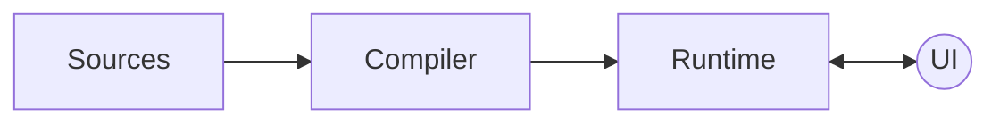

Compose는 여러 라이브러리 구성되어 있지만, 이 장에서는 컴파일러, 런타임 및 UI 라이브러리를 중점적으로 볼 것입니다.

Compose 컴파일러와 런타임은 Compose의 기둥입니다. UI는 기술적으로 Compose 아키텍처의 일부가 아닙니다. 
왜냐하면 런타임과 컴파일러는 제네릭으로 설계되어 있어, 요구 사항을 준수하는 모든 클라이언트 라이브러리에서 사용할 수 있기 때문입니다.
그렇긴 해도, UI 라이브러릴 살펴보는 것은 Compose가 어떻게 Composable 트리의 메모리 표현을 런타임에 전달하고, 어떻게 실제 요소를 생성하는지 이해하는 데 도움이 될 것입니다.



Compose를 처음 접하면 정확한 순서가 무엇인지 혼란스러울 수 있습니다.
지금까지 책에서는 컴파일러와 런타임이 함께 작동하여 모든 라이브러리 기능을 제공한다고 설명했지만, 이에 익숙하지 않다면 여전히 추상적으로 느껴질 수 있습니다.
Compose 컴파일러가 런타임 요구 사항을 준수하도록 코드를 어떻게 처리하는지, 런타임이 작동하는 방식, 초기 컴포지션 및 추가 재구성이 언제 트리거되는지, 트리의 메모리 내 표현이 어떻게 전달되는지, 그 정보가 추가 재구성에 어떻게 사용되는지 등을 이해하는 데 도움이 될 것입니다.

컴파일러를 이해하는 것부터 시작해 보겠습니다.

## A Kotlin compiler plugin

Compose는 메타 프로그래밍에 약간 의존합니다. Kotlin과 JVM에서는 보통 kapt를 통해 어노테이션 프로세서를 사용합니다.
하지만 Compose는 다릅니다. 실제로 Compose 컴파일러는 Kotlin 컴파일러 플러그인입니다. 
이는 라이브러리가 Kotlin 컴파일 단계 내에서 컴파일 시간 작업을 포함할 수 있어, 코드 형태에 대한 더 많은 관련 정보를 얻고 전체 프로세스를 가속화할 수 있게합니다.
kapt는 컴파일 전에 실행되어야 하지만, 컴파일러 플러그인은 컴파일 프로세스 내에서 완전히 인라인됩니다.

컴파일러 플러그인은 언어의 메타프로그래밍에 대한 큰 발전입니다. 많이 알려진 어노테이션 프로세서들은 점진적으로 컴파일러 플러그인으로 전환될 것입니다.

Kotlin 컴파일러 플러그인이 되면 Compose 체크를 IDEA inspection과 직접 통합할 수 있는 기회를 제공합니다.
따라서 개발자는 실제로 프로젝트를 빌드하지 않고도 코드를 작성하는 동안 실시간 피드백을 받을 수 있습니다.
이는 컴파일러 플러그인이 컴파일러의 ㅍ프론트엔드 단계에서 경고와 오류를 보고할 수 있는 능력이 있기 때문이며, 이러한 기능은 이미 IDEA와 통합되어 있습니다.
피드백 루프를 개선하는 것은 Kotlin 컴파일러의 프론트엔드 단계에서 정적 분석을 수행하는 궁극적인 이점입니다.

또한, Kotlin 컴파일러 플러그인의 또 다른 장점은 소스 코드를 자유롭게 조정할 수 있다는 것입니다. (새 코드만 추가하는 것이 아니라)
이는 해당 요소들의 출력 IR을 보다 더 원자적인 용어로 낮추기 전에 조정하여, 타겟이 되는 플랫폼의 원시 코드로 번역될 수 있도록 합니다.
Compose 컴파일러가 Composable 함수를 런타임에서 지원되도록 변환할 수 있도록 하는 이러한 기능은 이 장에서 좀 더 자세히 살펴볼 것입니다.

## Compose annotations

첫 번째로 살펴볼 것은 코드에 어떻게 어노테이트하여 컴파일러가 필요한 요소를 검색하고 작업을 수행할 수 있는지 알아보는 것입니다.
사용 가능한 Compose 어노테이션에 대해 알아보겠습니다.

컴파일러 플러그인이 어노테이션 프로세서보다 더 많은 작업을 할 수 있지만, 두 가지 모두 공통적으로 사용하는 것이 있스빈다.
그 중 하나가 정적 분석과 유효성 검사를 위해 사용되는 프론트엔드 단계입니다. Compose는 이를 잘 활용합니다.

Compose를 사용하는 프로그램을 실행할 때 처음으로 발생하는 일은 라이브러리에 의해 프로그램 코드가 처리되어야 한다는 것입니다.
Compose 컴파일러는 프로그램 코드를 가져와 `@Composable` 어노테이션이 있는 모든 항목을 검색합니다. 
또한 Compose는 특정 상황에서 추가적인 검사 및 다양한 런타임 최적화 또는 "단축키"를 활성화하기 위해 다른 보조 어노테이션도 제공합니다. 
이처럼 사용 가능한 모든 어노테이션은 Compose 런타임 라이브러리에서 제공됩니다. 

> 모든 Compose 어노테이션은 Compose 런타임에서 제공됩니다.
> 이는 컴파일러와 런타임 모듈 모두가 Compose 어노테이션을 잘 활용하기 때문입니다.

### @Composable

`@Composable` 어노테이션은 해당 함수의 타입을 변경하여 재시작이 가능하도록 만듭니다.
즉, 여러 번 실행될 수 있으며 데이터에서 노드로 매핑되어 실행 시 트리에 추가됩니다.
이 노드는 UI 노드일 수도 있고, Compose 런타임을 사용하여 소비하는 노드의 성격에 따라 다를 수 있습니다.

Compose 런타임은 특정 사용 사례나 의미에 묶이지 않은 제네릭 타입의 노드와 함께 작동합니다.

### @ExperimentalComposeApi

안정화되기 전에 변경될 수 있는 Compose api를 플래그 처리하는 어노테이션입니다. 
코드베이스에서 해당 api를 사용할 때 경고를 받게 되며, 명시적으로 해당 api를 사용하도록 선택(opt-in)해야 합니다. 
컴파일러의 프론트엔드 체크는 가능한 빨리 이러한 경고를 트리거하도록 합니다.

### @ComposeCompilerApi

Compose 자체에서 컴파일러만 접근할 수 있도록 플래그 처리하는 어노테이션입니다.
이 어노테이션은 컴파일러 외부에서 사용하려고 시도하면 즉시 인라인 오류가 발생합니다.

### @InternalComposeApi

Compose에서 일부 API를 내부적으로 변화할 수 있도록 `@InternalComposeApi` 어노테이션으로 표시합니다.  
이렇게 하면 Public API는 안정된 릴리스를 위해 변경되지 않고 유지되지만, 내부 구현은 유연하게 변경할 수 있습니다.
이 어노테이션은 Kotlin의 `internal` 키워드보다 넓은 범위를 가지며, 모듈 간에도 사용이 가능합니다.
Kotlin에서는 모듈 간 `internal` 사용을 지원하지 않지만, 이 어노테이션을 통해 Compose 라이브러리 내부 구현이 다른 모듈에서도 공유될 수 있게 됩니다.

### @DisallowComposableCalls

`@DisableComposableCalls`는 함수 내부에서 Composable 호출이 발생하지 않도록 막는데 사용됩니다.  
이는 Composable 함수의 인라인 람다 파라미터에 Composable 호출이 안전하지 않을 때 유용합니다.

예를 들어, Compose UI 일부인 `ComposeNode`에서 사용 예시를 찾을 수 있습니다.  
`ComposeNode`는 컴포지션에 UI 노드를 발행합니다. 
호출할 때, 호출자는 Composable이 생성된 후 초기화하거나, 업데이트하는 람다를 전달해야 합니다.

```kotlin
@Composable inline fun <T : Any, reified E : Applier<*>> ComposeNode(
    noinline factory :() -> T,
    update: @DisallowComposableCalls Updater<T>.() -> Unit
) {
    // ...
}
```

위 예제에서 `update` 람다는 인라인이며, `@DisablComposableCalls`로 처리되어 있습니다.  
이는 런타임이 모든 재구성 시점에 `update` 람다를 인라인으로 호출하는데, 
이 시점에 새로운 Composable 함수를 호출하면 예상치 않은 결과가 발생할 수 있기 때문에 런타임이 이를 방지하기 위해 `@DisallowComposableCalls`로 처리합니다.

### @ReadOnlyComposable

`@ReadOnlyComposable` 어노테이션은 해당 함수의 본문이 항상 컴포지션을 읽기만 하고 쓰기 작업을 하지 않음을 의미합니다.
이는 본문 내의 모든 중첩된 Composable 호출에도 동일하게 적용되어야 합니다. 이렇게 하면 런타임에서 필요하지 않은 코드를 생성하지 않을 수 있습니다.

컴포지션에 쓰기 작업을 수행하는 Composable의 경우, 컴파일러는 해당 본문을 래핑하는 "그룹"을 생성합니다.
이 그룹은 런타임에 대신 내보내져, 나중에 재구성이 필요할 때 데이터를 다른 Composable의 데이터로 덮어쓰거나, Composable의 정체성을 보존하면서 데이터를 이동하는데 필요한 정보를 제공합니다.
생성될 수 있는 그룹의 유형은 여러 가지가 있습니다. 예를 들어, 재시작 가능(restartable) 그룹, 이동 가능(movable) 그룹 등이 있습니다.

"그룹"의 개념을 이해하기 위해, 선택한 텍스트의 시작과 끝에 몇 개의 포인터가 있다고 상상해보세요.
모든 그룹은 코드 위치 키(source position key)를 가지며, 이는 그룹을 저장하고 위치 메모이제이션을 활성화하는데 사용됩니다.
이 키는 조건부 로직의 if 또는 else 분기 사이의 차이를 알 수 있도록 하는 방법이기도 합니다.

```kotlin
if (condition) Text("Hello") 
else Text("World")
```

이들은 모두 `Text`이지만, 호출자에게 다른 개념을 나타내기 때문에 서로 다른 정체성을 가집니다.
이동 가능한 그룹은 부모 그룹 내에서 재배치될 수 있도록 의미를 갖는 아이덴티티 키(semantic identity key)를 가집니다.

Composable이 컴포지션에 쓰기 작업을 수행하지 않을 때, 그룹을 생성하는 것은 어떤 가치도 제공하지 않습니다. 
`@ReadOnlyComposable` 어노테이션은 이를 피하기 위해 도와줍니다.

Compose 라이브러리 내의 읽기 전용 Composable 예시로는 여러 CompositionLocal 기본값, Material Colors, Typography, isSystemInDarkTheme(), LocalContext, 애플리케이션 리소스를 얻기 위한 호출(이들은 LocalContext에 의존함), LocalConfiguration 등이 있습니다.
전반적으로, 이는 프로그램 실행 시 한 번 설정되고 변경되지 않을 것으로 예상되며, Composable 트리에서 읽을 수 있어야 하는 것들입니다.

### @NonRestartableComposable

`@NonRestartableComposable` 어노테이션은 함수나 프로퍼티 getter에 적용되면 해당 함수를 재시작할 수 없는 Composable으로 만듭니다.
기본적으로 모든 Composable 함수는 재시작 가능한 속성을 가지고 있습니다.

이 어노테이션이 추가되면, 컴파일러는 함수가 재구성되거나 재구성 중 건너뛰어질 수 있도록 하는데 필요한 보일러플레이트 코드를 생성하지 않습니다.
이 어노테이션은 다른 Composable 함수에 의해 재시작될 가능성이 높은 매우 작은 함수에만 의미가 있기 때문에 매우 신중하게 사용되어야 합니다.
이러한 작은 함수들은 자체적으로 무효화/제구성은 부모/포함하는 Composable에 의해 주도되기에 재구성 로직이 필요하지 않을 수 있습니다.
이럴 때 이 어노테이션을 사용하면 성능 향상을 기대할 수 있습니다. (그러나, 잘못 사용하면 예상치 못한 결과를 초래할 수 있습니다.)

### @StableMarker

The Compose runtime also provides some annotations to denote the stability of a type. Those are the @StableMarker meta-annotation, and the @Immutable and @Stable annotations. Let’s start with the @StableMarker one.

Compose 런타임은 타입의 안정성을 나타내기 위해 몇 가지 어노테이션을 제공합니다. 
그 중 `@StableMarker` 메타 어노테이션과 `@Immutable` 및 `@Stable` 어노테이션이 있습니다.

`@StableMarker`는 `@Immutable` 및 `@Stable`과 다른 메타 어노테이션입니다.
이는 약간 중복처럼 들릴 수 있지만, 재사용성을 위해 설계되었습니다. 따라서 이 어노테이션이 가지는 의미는 이를 어노테이트한 모든 어노테이션에 적용됩니다.

`@StableMarker`는 최종적으로 어노테이트된 타입에 대해 다음과 같은 데이터 안정성 요구 사항을 암시합니다.

- 동일한 두 인스턴스에 대해 `equals` 호출의 결과는 항상 동일해야 합니다.
- 어노테이트된 타입의 공개 프로퍼티가 변경될 때마다 컴포지션에 이 변경을 항상 알립니다.
- 어노테이트된 타입의 모든 공개 프로퍼티도 안정적(Stable)이어야 합니다.

`@Immutable` 또는 `@Stable`로 어노테이트된 모든 타입은 이러한 요구 사항을 암시해야 합니다.
두 어노테이션 모두 `@StableMarker`로 플래그 처리되어 있기 때문입니다.

이러한 어노테이션들은 컴파일러에게 개발자들이 제공하는 약속으로, 컴파일러가 소스를 처리할 때 어떠한 가정을 할 수 있지만, 컴파일 시간에 유효성 검사는 수행되지 않습니다.
즉, 이 어노테이션과 아래 설명할 어노테이션들은 개발자가 이러한 요구 사항이 충족되었을 때만 사용해야 하며, 요구 사항이 충족되지 않은 상태에서 사용하면 개발자의 책임이 됩니다.

### @Immutable

`@Immutable` 어노테이션은 클래스에 적용되어, 해당 클래스의 모든 공용 프로퍼티와 필드가 생성 후 변경되지 않음을 컴파일러에게 엄격히 약속합니다.
이는 Kotlin의 `val` 키워드보다 더 강력한 약속입니다. `val`은 속성이 setter를 통해 재할당 될 수 없음을 보장하지만, 속성이 가변 데이터 구조를 가리킬 수 있기 때문에 데이터가 불변이라는 것을 보장하지 않습니다.
이는 Compose 런타임의 기대를 깨뜨릴 수 있습니다. 다시 말해, 이 어노테이션은 Kotlin 언어가 데이터 구조의 불변성을 보장하는 메커니즘을 제공하지 않기에 Compose에 필요합니다.

초기화 후 값이 절대 변경되지 않는다는 가정에 기반하여, 런타임은 스마트 재구성 및 재구성 건너뛰기 기능에 최적화를 적용할 수 있습니다.

`@Immutable`로 안전하게 표시될 수 있는 클래스의 좋은 예는 `val` 프로퍼티만 있는 데이터 클래스입니다.
이 클래스의 모든 속성은 사용자 정의 getter를 가지지 않으며, 모든 프로퍼티는 기본 타입이거나 `@Immutable`로 표시된 타입이어야 합니다.
사용자 정의 getter가 있으면 호출할 때마다 다른 결과를 반환하여 읽기 불안정한 API가 될 수 있습니다.

`@Immutable`은 `@StableMarker`로 플래그 처리되어 있기 때문에, 안정성을 나타내는 모든 어노테이션의 의미를 상속합니다.
불변으로 간주되는 타입은 항상 `@StableMarker`의 의미를 따릅니다. `@Immutable` 어노테이션은 불변 타입을 안정적(stable)으로 표시하는데 사용됩니다.

### @Stable

`@Stable` 어노테이션은 `@Immutable`보다 더 가벼운 약속으로, 적용된 언어 요소에 따라 다른 의미를 가집니다.

타입에 적용되면, 해당 타입이 가변적임을 의미합니다. 
즉, 해당 타입의 인스턴스는 생성 후에 변경될 수 있지만, 여전히 `@StableMarker`의 조건을 충족합니다.
`@StableMarker`에서 요구되는 데이터 안정성을 충족하지만, 불변성은 보장하지 않습니다.

함수나 프로퍼티에 적용되면, 컴파일러에게 해당 함수가 동일한 입력에 대해 항상 동일한 결과를 반환함을 의미합니다.(순수 함수)
이는 함수의 파라미터도 `@Stable`, `@Immutable` 또는 기본 타입(primitive types)이어야만 가능합니다. (이들은 안정적으로 간주됩니다.)

이 어노테이션이 런타임에 얼마나 중요한지에 대한 좋은 예는 문서에 있습니다.
모든 타입이 안정적인 것으로 표시된 Composable에 파라미터로 전달되면, 파라미터 값은 위치 메모이제이션에 기반하여 비교되며, 모든 값이 이전 호출과 동일하면 호출이 건너뛰어집니다.

`@Stable`로 표시될 수 있는 타입의 예는 공용 프로퍼티가 변경되지 않지만 불변으로 간주될 수 없는 객체입니다.
예를 들어, 내부적으로 가변 상태를 가지고 있거나 `MutableState` 객체로 프로퍼티 위임을 하지만, 외부에서는 불변으로 사용되는 객체입니다.

이 어노테이션의 의미는 컴파일러와 런타임에서 데이터가 어떻게 변할지(또는 변하지 않을지)에 대한 가정을 만들고, 필요한 경우 최적화를 적용하는데 사용됩니다.
이 어노테이션을 사용할 때는 해당 의미가 충족되는지 확실히 확신할 때만 사용해야 합니다. 그렇지 않으면 컴파일러에 잘못된 정보를 제공하게 되어 런타임 오류가 발생할 수 있습니다.
따라서 `@Stable` 어노테이션은 신중하게 사용해야 합니다.

> 흥미로운 점은 `@Immutable`과 `@Stable` 어노테이션이 서로 다른 의미와 약속을 가지고 있지만, 현재 Compose 컴파일러는 두 어노테이션을 동일하게 처리하여 스마트 재구성 및 재구성 건너뛰기를 활성화하고 최적화합니다.
하지만 두 어노테이션은 미래에 컴파일러와 런타임이 활용할 수 있는 다른 의미를 부여하기 위해 존재합니다.