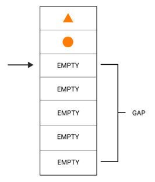
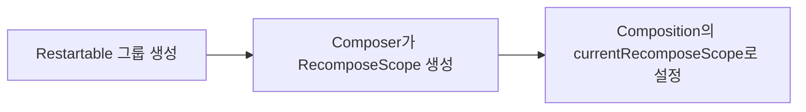
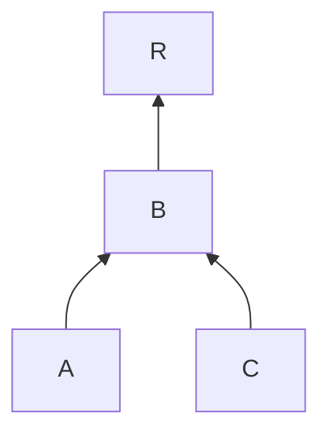
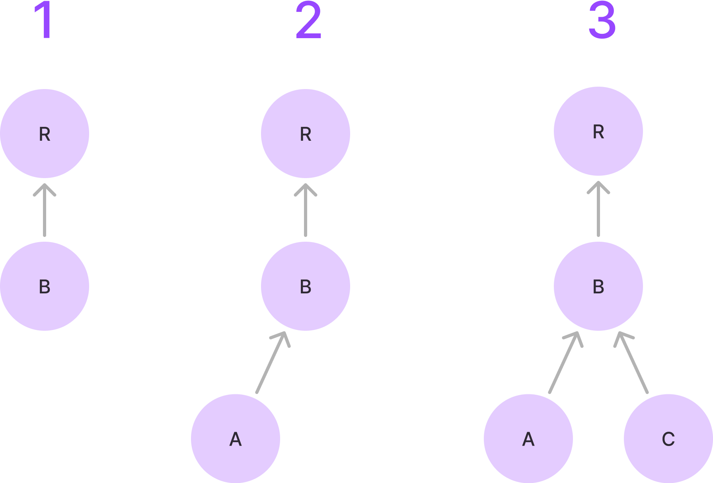
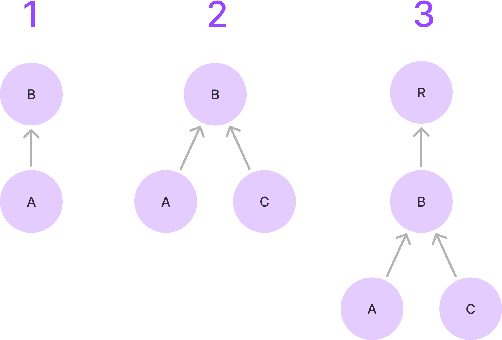
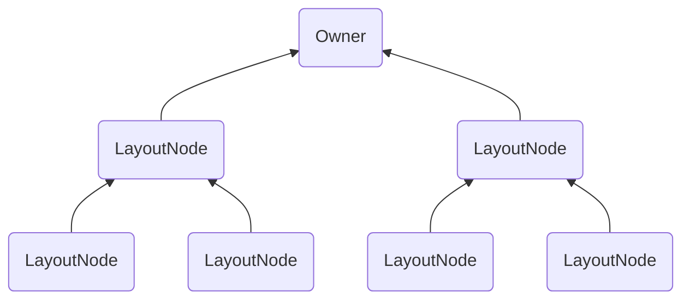

Chapter3는 Compose 런타임에 초점을 맞추고 있지만, Compose의 다양한 구성 요소들이 어떻게 협력하는지를 이해하는데 중요한 챕터입니다.

Compose에서 중요한 점은 컴포저블이 실제로 UI를 생성하지 않고, `Composer`를 통해 런타임에서 관리하는 메모리 내 구조(슬롯 테이블)에 변경 사항을 "발행"한다는 사실입니다.  
이러한 표현은 나중에 해석되어 UI를 "실체화"하는데 사용됩니다.

이는 컴포저블이 어떻게 컴포지션에 변경 사항을 **발행**하는지, 그리고 이를 통해 컴포지션은 필요한 모든 정보로 업데이트되는 과정을 설명한 것입니다.       
이 과정은 컴파일러가 주입한 현재의 `$composer` 인스턴스를 통해 이루어지며, `Composer` 인스턴스와 컴포지션은 Compose 런타임의 중요한 구성 요소입니다.

지금까지는 런타임에서 '메모리에 유지되는 상태'를 “컴포지션”이라고 불러왔지만, 이 개념은 의도적으로 단순화된 것입니다.  
이제부터 컴포지션 상태를 저장하고 관리하는 데이터 구조에 대해 자세히 알아보겠습니다.

## The slot table and the list of changes

Compose 내부에 대한 문서가 부족하다 보니, '슬롯 테이블'과 '변경 목록'의 데이터 구조 차이에 대해 혼란을 느낄 수 있습니다.  
먼저 이 부분을 명확히 하는 것이 중요합니다.

슬롯 테이블은 컴포지션의 현재 상태를 저장하는 메모리 내 구조로, 컴포저블이 호출될 때 그 위치와 관련 데이터를 기록하는 역할을 합니다.  
여기에는 컴포저블의 위치, 파라미터, `remember`로 처리된 값, `CompositionLocal`와 같은 중요한 정보들이 포함됩니다.  
초기 컴포지션이 실행되면 슬롯 테이블에 위 정보들이 기록되며, 이후 리컴포지션이 발생할 때마다 이미 기록된 정보를 바탕으로 필요한 부분만 업데이트됩니다.  
`Composer`는 슬롯 테이블에 기록된 컴포지션의 현재 상태를 바탕으로 다음 변경 사항 목록을 생성합니다.  
또한, 트리에서 발생하는 모든 변경 사항은 슬롯 테이블에 기록된 컴포지션의 현재 상태에 의존합니다.

슬롯 테이블이 컴포지션의 상태를 기록하는 동안, 변경 목록은 실제로 노드 트리에 변경 사항을 적용하는 역할을 합니다.   
변경 목록은 패치 파일처럼 생각할 수 있습니다. 즉, 모든 변경 사항을 먼저 기록한 후, 그 기록된 변경 사항을 한꺼번에 트리에 적용하는 구조입니다.   
이 변경 목록을 적용하는 것은 `Applier`가 담당하며, 이는 런타임에서 트리를 실체화하는데 의존하는 추상화된 개념입니다.  
이 부분에 대해서는 나중에 자세히 다룰 것입니다.

마지막으로, `Recomposer`는 전체 과정을 조율하며, 리컴포지션을 언제, 어떤 스레드에서 실행할지, 그리고 변경 사항을 언제, 어떤 스레드에서 적용할지를 결정합니다.  
이 또한, 나중에 자세히 다룰 것입니다.

## The slot table in depth

컴포지션의 상태가 어떻게 저장되는지 알아보겠습니다.  
슬롯 테이블은 빠른 선형 접근이 가능하도록 최적화된 데이터 구조로, 텍스트 편집기에서 자주 사용되는 "갭 버퍼"라는 개념을 기반으로 합니다.  
슬롯 테이블은 이를 위해 두 개의 선형 배열에 데이터를 저장하는데, 하나는 컴포지션에 포함된 **그룹** 정보를 저장하고, 다른 하나는 각 그룹에 속한 **슬롯**을 저장합니다.

```kotlin
var groups = IntArray(0)
    private set

var slots = Array<Any?>(0) { null }
    private set
```

> Chapter2에서 컴파일러가 컴포저블의 본문을 래핑하여 그룹을 발행하는 방법에 대해 배웠습니다.  
> 이 그룹들은 메모리에 저장될 때 컴포저블에 아이덴티티(유니크 키)를 부여하여, 나중에 이를 식별할 수 있게 합니다.  
> 그룹은 컴포저블 호출과 그 자식 요소들과 관련된 모든 정보를 포함하며, 해당 컴포저블을 그룹으로 처리하는 방식을 정의합니다.  
> 그룹은 컴포저블 본문 내부의 제어 흐름 패턴에 따라서 다른 타입이 될 수 있습니다:  
> Restartable 그룹, Moveable 그룹, Replaceable 그룹, Reusable 그룹 등...

그룹 배열은 오직 "그룹 필드"만 저장하기 때문에 `Int` 값으로 구성됩니다.  
그룹 필드는 그룹의 메타데이터를 나타내며, 부모 그룹과 자식 그룹이 그룹 필드 형태로 저장됩니다.  
그룹 배열은 선형 구조이므로, 부모 그룹의 그룹 필드가 먼저 오고, 자식 그룹의 그룹 필드가 뒤따릅니다.  
이는 그룹 트리를 선형 방식으로 모델링하며, 자식 그룹들을 빠르게 탐색할 수 있게 도와줍니다.  
선형 구조에서 랜덤 접근은 비용이 많이 들기에, 이를 위해 그룹 앵커(`Anchors`)라는 포인터 역할의 개념이 사용됩니다.

| Group 1 (Parent) | Group 2 (Child) | Group 3 (Child) | Group 4 (Parent) | Group 5 (Child) | Group 6 (Child) |
|------------------|-----------------|-----------------|------------------|-----------------|-----------------|

반면, 슬롯 배열은 각 그룹에 대한 관련 데이터를 저장하며, 모든 타입(`Any?`)의 값을 저장할 수 있도록 설계되어 있습니다.  
따라서, 실제 컴포지션 데이터는 이 슬롯 배열에 저장됩니다.  
`groups` 배열에 있는 각 그룹은 `slots` 배열에서 자신과 연결된 슬롯을 어떻게 찾아 해석할지에 대한 정보를 포함하고 있으며, 각 그룹은 특정 슬롯 범위와 연결되어 있습니다.

슬롯 테이블은 데이터를 읽고 쓰기 위해 갭(gap)이라는 개념을 사용합니다.  
갭은 테이블 내의 포지션 범위로 생각할 수 있는데, 이 범위는 이동할 수 있고, 배열에서 데이터를 읽고 쓸 위치를 결정합니다.  
갭에는 데이터를 쓰기 시작할 위치를 가리키는 포인터가 있으며, 이 갭의 시작점과 끝점은 이동 가능하기에 테이블의 데이터를 덮어쓸 수도 있습니다.



다음 조건부 로직을 생각해보세요:

```kotlin
@Composable
@NonRestartableComposable
fun ConditionalText() {
    if (a) {
        Text(a)
    } else {
        Text(b)
    }
}
```

위와 같이 컴포저블이 `@NonRestartableComposable`로 표시된 경우, Restartable 그룹 대신에 Replaceable 그룹이 삽입됩니다.  
이 Replaceable 그룹은 현재 "활성화"된 자식의 데이터를 슬롯 테이블에 저장합니다.  
즉, `a`가 `true`일 때는 `Text(a)`의 데이터를 테이블에 저장합니다.  
이후 조건이 변경되면, 갭은 그룹의 시작 위치로 돌아가서 데이터를 다시 쓰기 시작하며, `Text(b)`의 데이터로 기존 슬롯을 덮어씁니다.

슬롯 테이블에서 데이터를 읽고 쓰기 위해서는 `SlotReader`와 `SlotWriter`가 사용됩니다.  
Reader는 여러 개를 동시에 활성화 할 수 있지만, **Writer는 한 번에 하나만 활성화**될 수 있습니다.  
각 읽기/쓰기 작업이 완료되면, 해당 Reader나 Writer는 닫히게 됩니다.  
여러 개의 Reader가 동시에 열려 있을 수 있지만, 안전을 위해 **쓰기가 진행 중일 때는 테이블을 읽을 수 없습니다**.  
`SlotTable`은 활성화된 Writer가 닫힐 떄까지 무효하며, 이는 Writer가 그룹과 슬롯을 직접 수정하기 때문에 동시에 읽으려하면 경쟁 조건이 발생할 수 있습니다.

Reader는 방문자 패턴처럼 작동합니다.   
현재 그룹 배열에서 읽고 있는 그룹의 시작과 끝의 위치, 바로 앞에 저장된 부모 그룹, 현재 읽고 있는 슬롯, 해당 그룹이 가진 슬롯의 수 등을 추적합니다.  
또한, Reader는 위치를 변경하거나, 그룹을 건너뛰거나, 현재 슬롯의 값을 읽거나, 특정 인덱스에서 값을 읽는 등 다양한 작업을 수행할 수 있습니다.  
즉, Reader는 배열에서 그룹과 그 슬롯에 대한 정보를 읽어오는데 사용됩니다.

| Group 1 (Parent) | Group 2 (Child) | Group 3 (Child) | Group 4 (Parent) | Group 5 (Child) | Group 6 (Child) |
|------------------|-----------------|-----------------|------------------|-----------------|-----------------|

| 현재 읽고 있는 그룹 | 시작 위치 | 끝 위치 |  부모 그룹  | 그룹의 슬롯 인덱스 | 슬롯 개수 |
|:-----------:|:-----:|:----:|:-------:|:----------:|:-----:|
|   Group 1   |   0   |  3   |  NONE   |     0      |   3   |
|   Group 2   |   1   |  2   | Group 1 |     1      |   1   |
|   Group 3   |   2   |  3   | Group 1 |     2      |   1   |

반대로, Writer는 배열에 그룹과 슬롯을 기록하는데 사용됩니다.  
앞서 설명했듯이, Writer는 `Any?` 타입의 데이터를 테이블에 쓸 수 있습니다.  
`SlotWriter`는 그룹과 슬롯을 작성할 위치를 결정하기 위해, "갭"을 사용하여 배열 내에서 적절한 위치를 찾아 기록합니다.

갭은 이동 가능하고 크기를 조정할 수 있는 선형 배열의 포지션 범위로 생각할 수 있습니다.  
Writer는 각 갭의 시작과 끝 위치, 그리고 길이를 추적하며, 시작점과 끝점을 조정하여 갭을 이동시킬 수 있습니다.

Writer는 그룹과 슬롯을 추가, 교체, 이동, 제거할 수 있습니다.  
예를 들어, 트리에 새로운 컴포저블 노드를 추가하거나, 조건부 로직 내에서 조건이 바뀔 때 컴포저블을 교체하는 경우를 생각할 수 있습니다.

또한, Writer는 그룹과 슬롯을 스킵하거나, 특정 위치로 이동하거나, `Anchor`에 의해 결정된 위치로 이동하는 등의 다양한 작업을 수행할 수 있습니다.

Writer는 테이블에서 특정 인덱스로 빠르게 접근할 수 있도록 `Anchor` 목록을 추적합니다.  
테이블 내 그룹의 위치(그룹 인덱스)도 `Anchor`를 통해 추적됩니다.  
그룹이 이동되거나 교체, 삽입, `Anchor`가 가리키는 위치 이전에서 제거되는 경우, 해당 `Anchor`는 업데이트됩니다.

슬롯 테이블은 컴포지션 그룹의 Iterator 역할도 하기 떄문에, 도구들이 컴포지션의 세부 정보를 검사하고 표시할 수 있는 정보를 제공합니다.

이제 변경 목록에 대해 알아보겠습니다.

## The list of changes

위에서 슬롯 테이블에 대해 배웠고, 런타임에서 현재 컴포지션의 상태를 추적할 수 있도록 슬롯 테이블이 어떻게 사용되는지 알아보았습니다.  
그렇다면 변경 사항 목록의 정확한 역할은 무엇이며, 언제 생성되고, 무엇을 모델링하는지, 이러한 변경 사항은 언제 적용되는지, 그 이유는 무엇인지 등을 명확히 이해해야 합니다.
이를 차례차례 살펴보겠습니다.

매번 컴포지션(또는 재구성)이 발생할 때마다, 소스 코드의 컴포저블들이 실행되고 발행됩니다. 책에선 "발행"이라는 단어를 이미 여러번 사용했습니다.  
발행이란, 슬롯 테이블을 업데이트하고 궁극적으로 실체화된 트리도 업데이트하기 위한 지연된 '변경 사항'을 생성하는 것을 의미합니다.  
여기서 '변경 사항'들은 '목록'으로 저장되며, 새로운 변경 사항 목록을 생성하는 것은 슬롯 테이블에 저장된 내용을 기반으로 합니다.  
기억할 점은 트리에 대한 모든 변경 사항은 컴포지션의 현재 상태에 따라 달라져야 한다는 것입니다.

> 이에 대한 예시로, 노드가 이동하는 경우를 생각해볼 수 있습니다. 리스트의 컴포저블들을 재정렬하는 상황을 상상해보면,  
> 해당 노드가 이전 테이블의 어디에 위치했는지 확인하고, 해당 슬롯을 모두 제거한 다음, 새로운 위치에서 다시 쓰는 작업을 수행해야 합니다.

다시 말해서, 컴포저블이 발행될 때마다 슬롯 테이블을 참조하여 현재 이용 가능한 정보와 필요에 따라 지연된 변경 사항을 생성하고, 이를 변경 사항 목록에 모두 추가합니다.  
나중에 컴포지션이 완료되면, 실체화 단계가 시작됩니다. 실체화 단계에서는 이전에 기록된, 지연된 변경 사항 모두를 실제로 실행됩니다.  
이때 컴포지션의 최신 정보를 사용하여 슬롯 테이블을 업데이트합니다.   
이렇게 함으로써 컴포저블이 발행될 때마다 슬롯 테이블을 즉시 수정하는 대신, 나중에 일괄적으로 변경 사항을 적용하여 발행 과정을 매우 빠르게 만들 수 있습니다. 

변경 사항 목록은 최종적으로 슬롯 테이블에 변경 사항을 적용하는 역할을 한다는 것을 알 수 있습니다.  
이 과정에서 변경 사항 모곩은 `Applier`에게 알림을 보내 실체화된 노드 트리를 업데이트합니다.

`ReComposer`는 이 전체 과정을 조율하고, 어떤 스레드에서 컴포지션이나 재구성을 수행할 지, 그리고 변경 사항 목록의 변경 사항을 적용할 스레드를 결정합니다.  
또한, `LaunchedEffect`가 이펙트를 실행할 때 사용될 기본 컨텍스트를 설정하여, 모든 작업이 올바른 순서와 타이밍으로 이루어지도록 보장합니다.

이로써 변경 사항이 어떻게 기록되고, 지연되며, 최종적으로 실행되는지, 그리고 모든 상태가 슬롯 테이블에 어떻게 저장되는지를 명확하게 이해할 수 있습니다.

## The Composer

주입된 `$composer`는 작성한 컴포저블을 Compose 런타임에 연결하는 역할을 합니다.

## Feeding the Composer

트리의 인메모리 표현에서 노드가 어떻게 추가되는지 자세히 알아보기 위해, `Layout` 컴포저블을 예로 들어 설명할 수 있습니다.  
`Layout`은 Compose UI에서 제공하는 모든 UI 구성 요소의 기본 요소로, 다양한 UI 컴포넌트들이 배치되고 정렬되는 방식의 기반이 됩니다.  

코드를 보면 다음과 같습니다:

```kotlin
@Suppress("ComposableLambdaParameterPosition")
@Composable
inline fun Layout(
    content: @Composable () -> Unit,
    modifier: Modifier = Modifier,
    measurePolicy: MeasurePolicy
) {
    val density = LocalDensity.current
    val layoutDirection = LocalLayoutDirection.current
    
    ReusableComposeNode<ComposeUiNode, Applier<Any>>(
        factory = ComposeUiNode.Constructor,
        update = {
            set(measurePolicy, ComposeUiNode.SetMeasurePolicy)
            set(density, ComposeUiNode.SetDensity)
            set(layoutDirection, ComposeUiNode.SetLayoutDirection)
        },
        skippableUpdate = materializerOf(modifier),
        content = content
    )
}
```

`Layout`은 `ReusableComposeNode`을 통해 컴포지션에 `LayoutNode`를 발행합니다.  
이 작업은 노드를 바로 생성하고 추가하는 것처럼 보이지만, 실제로는 런타임에 노드를 생성, 초기화 및 컴포지션 위치에 삽입하는 방법을 알려주는 것입니다.

이를 코드로 보면:

```kotlin
@Composable
inline fun <T, reified E : Applier<*>> ResuableComposeNode(
    noinline factory: () -> T,
    update: @DisallowComposableCalls Updater<T>.() -> Unit,
    noinline skippableUpdate: @Composable SkippableUpdater<T>.() -> Unit,
    content: @Composable () -> Unit
) {
    // ...
    currentComposer.startReusableNode()
    // ...
    currentComposer.createNode(factory)
    // ...
    Updater<T>(currentComposer).update() // initialization
    // ...
    currentComposer.startReplaceableGroup(0x7ab4aae9)
    content()
    currentComposer.endReplaceableGroup()
    currentComposer.endNode()
}
```

위 코드에선 아직 관련이 없는 몇 가지 부분을 생략했지만, 모든 작업을 `currentComposer` 인스턴스에 위임하는 것을 볼 수 있습니다.  
또한, 컴포저블의 `content`를 저장할 때, 이를 래핑하기 위해 Replaceable 그룹을 시작하는 것을 볼 수 있습니다.  
이로 인해, `content` 람다 내에서 발행되는 모든 자식 컴포저블을 Replaceable 그룹 내에서 컴포지션에 저장합니다. 

다른 컴포저블도 동일한 발행 작업이 수행되며, `remember`를 예시로 살펴보겠습니다:

```kotlin
@Composable
inline fun <T> remember(calculation: @DisallowComposableCalls () -> T): T =
    currentComposer.cache(invalid = false, calculation)
```

`remember` 컴포저블은 `currentComposer`를 활용하여 특정 값을 컴포지션에 캐시합니다.  
`invalid` 파라미터를 사용하면, 이전에 저장된 값이 있더라도 이를 무시하고 값을 강제로 업데이트하여 항상 최신 값을 유지할 수 있습니다.

`cache` 함수는 다음과 같이 작성됩니다:

```kotlin
@Composable
inline fun <T> Composer.cache(
    invalid: Boolean,
    block: () -> T
): T {
    return rememberedValue().let {
        if (invalid || it === Composer.Empty) {
            val value = block()
            rememberedValue(value)
            value
        } else {
            it
        }
    } as T
}
```

위 코드를 보면, 컴포지션의 슬롯 테이블에서 값을 검색합니다.  
만약 값이 발견되지 않으면, 해당 값을 업데이트하도록 변경 사항을 기록합니다. 즉, 값을 저장하고 나중에 사용할 수 있도록 예약합니다.  
값이 이미 존재하는 경우, 추가적인 변경 없이 현재 값을 그대로 반환합니다.

## Modeling the Changes

앞서 설명한 것처럼, 컴포지션에서 발생하는 모든 발행 작업은 `currentComposer`에게 위임되며, 이 작업들은 내부적으로 `Change`로 모델링됩니다.  
이 `Change`는 리스트에 추가되며, 필요할 때 실행될 수 있는 지연 함수(deferred function) 형태로 존재합니다.  
`Change` 함수는 현재의 `Applier`와 `SlotWriter`에 접근할 수 있습니다. (한 번에 하나의 활성화된 writer만 존재합니다.)

코드로 살펴보겠습니다:

```kotlin
internal typealias Change = (
    applier: Applier<*>,
    slots: SlotWriter,
    rememberManager: RememberManager
) -> Unit
```

발행 작업들은 `Change` 형태로 리스트에 추가(기록)됩니다.  
또한, 발행 작업은 슬롯 테이블에서 노드를 추가, 제거, 교체 또는 이동시키기 위한 '지연된 람다 함수'를 생성하는 것을 의미합니다.  
이러한 `Change`는 나중에 실행될 수 있도록 지연되며, 실제로 적용될 수 있도록 `Applier`에게 알립니다.

따라서 "변경 사항을 발행(emitting changes)"한다는 의미는 다음을 뜻합니다.

- 변경 사항을 리스트에 추가하여 기록 (recording changes)
- 나중에 적용할 수 있도록 예약(scheduling changes)하는 것을 의미합니다.

컴포지션 프로세스가 완료되면, 모든 컴포저블 호출이 종료되고, 변경 사항이 모두 기록됩니다.  
이 시점에서, 기록된 모든 변경 사항은 `Applier`에 의해 일괄적으로 적용됩니다.  
이렇게 함으로써, 컴포지션 내에서 발생한 모든 상태 변경과 노드 조작이 효율적으로 처리되고, UI 일관성을 유지할 수 있습니다.  
`Applier`는 기록된 `Change`들을 받아서 실질적으로 적용하여 컴포지션의 상태를 업데이트하고, 최종적인 UI 상태를 반영합니다.

## Optimizing when to write

컴포지션에 새로운 노드를 삽입하는 작업은 Composer에게 위임되며, Composer는 항상 현재 새로운 노드를 삽입 중인지 인지하고 있습니다.  

만약, Composer가 노드를 삽입하는 중이라면, 변경 사항이 발행될 때 이를 즉시 슬롯 테이블에 쓰는 방식으로 프로세스를 최적화할 수 있습니다.  
이는 변경 사항을 나중에 해석하기 위해 리스트에 추가하는 대신, 즉각적으로 적용할 수 있음을 의미합니다.  

반면, Composer가 노드를 삽입하는 중이 아니라면, 변경 사항은 기록되고 지연되어 나중에 적용될 시점까지 대기하게 됩니다.

## Writing and reading groups

컴포지션이 완료되면, `composition.applyChanges()`가 호출되어 변경 사항을 슬롯 테이블에 기록하고 트리를 실체화합니다.  
Composer는 데이터, 노드, 그룹 등 다양한 유형의 정보를 슬롯 테이블에 기록할 수 있습니다.  
그러나 이 모든 정보들을 단순화하기 위해 궁극적으로는 그룹 형태로 저장되며, 각기 다른 유형의 정보는 다른 '그룹 필드'를 사용하여 구분됩니다.

Composer는 컴포지션 프로세스에서 그룹을 "시작"하고 "종료"할 수 있으며, 이 동작은 현재 수행 중인 작업에 따라 다르게 해석됩니다.    

- Composer가 데이터를 쓰고 있다면, 슬롯 테이블에서 "그룹 생성"과 "그룹 제거"를 의미합니다.
- Composer가 데이터를 읽고 있다면, `SlotReader`가 그룹 내외로 읽기 포인터를 이동시켜 해당 그룹에서 읽기를 시작하거나 종료하도록 요청받게 됩니다.

컴포저블 트리의 노드들은 결국 테이블의 그룹 형태로 존재하며, 이 노드들은 삽입될 뿐만 아니라 제거되거나 이동될 수 있습니다.  
그룹을 제거하는 작업은 해당 그룹과 관련된 모든 슬롯을 테이블에서 제거하는 것을 의미합니다.  
이를 위해 Composer는 `SlotReader`에게 위치를 재조정하여 제거된 그룹을 건너뛰도록 요청하고, 해당 그룹의 모든 노드를 `Applier`에서 제거하는 작업을 기록합니다.  
이러한 제거 작업은 나중에 일괄적으로 적용될 수 있도록 기록하여, 모든 수정 작업이 함께 일관되게 적용되도록 보장할 수 있습니다.   

추가로, Composer는 제거된 그룹에 대해 예정된 모든 무효화(invalidation) 작업을 폐기합니다.  
무효화 작업은 컴포지션의 특정 부분이 더 이상 유효하지 않음을 표시하는 작업입니다.  
제거된 그룹은 더 이상 존재하지 않기에, 해당 그룹에 대한 무효화 작업도 더 이상 필요하지 않습니다.

> 모든 그룹이 재시작 가능(Restartable), 교체 가능(Replaceable), 이동 가능(Movable), 재사용 가능(Reusable)한 것은 아닙니다.  
> 예를 들어, 기본 래핑 블록(defaults wrapping block)은 특정한 그룹 형태로 저장됩니다.  
> 이 블록은 특정 컴포저블 호출에서 기본 파라미터를 생성하기 위해 기억된(remembered) 값을 저장합니다: `model: Model = remember { DefaultModel() }`  

Composer가 그룹을 "시작"하려고 할 때, 여러 가지 상황에 따라 다른 작업을 수행합니다:

- Composer가 값을 삽입하는 중이라면, 기다릴 필요 없이 즉시 슬롯 테이블에 기록하여, 변경 사항을 즉시 반영합니다.
- Composer가 현재 삽입 작업을 하고 있지 않고, 보류 중인 작업이 있다면, 변경 사항들을 기록하여 나중에 적용될 때 반영되도록 합니다.  
여기서 Composer는 해당 그룹이 테이블에 이미 존재하는지 확인하고, 존재한다면 이를 재사용하려고 시도합니다.
- 그룹이 슬롯 테이블에 저장되어 있지만, 다른 위치에 있는 경우, Composer는 해당 그룹의 모든 슬롯을 이동시키는 작업을 기록합니다.  
이는 그룹이 이동된 위치에서 올바르게 반영되도록 하기 위함입니다.
- 그룹이 테이블에서 새로 생성된 경우(테이블에서 찾을 수 없는 경우), Composer는 삽입 모드로 전환됩니다.  
삽입 모드에서는 그룹과 그 자식 요소들이 모두 기록될 때까지, 중간 `insertTable`(다른 `SlotTable`)에 기록하는 작업을 진행합니다.    
이후에 이를 최종 슬롯 테이블에 삽입하도록 예약합니다.
- Composer가 삽입 중이 아니면서, 보류 중인 쓰기 작업이 없는 경우, 현재 상태를 파악하고 필요한 작업을 수행하기 위해 그룹을 읽기 시작하려고 시도합니다.

그룹을 재사용하는 것은 컴포지션 내에서 효율성을 높이는 일반적인 방법입니다.  
새로운 노드를 생성할 필요가 없는 경우, 기존에 존재하는 노드를 재사용할 수 있습니다. (e.g: `ReusableComposeNode`)  
이 과정에서는 `Applier`가 해당 노드로 이동하는 작업을 기록하지만, 노드를 새로 생성하고 초기화하는 작업은 생략됩니다.

노드의 특정 속성을 업데이트해야 할 필요가 있을 때, 이러한 변경 작업은 `Change`로 기록됩니다. 

## Remembering values

Composer는 컴포지션에서 값을 기억(슬롯 테이블에 기록)하고, 나중에 이를 업데이트할 수 있는 능력을 가지고 있습니다.  
이 과정에서 중요한 부분은 기억된 값이 이전 컴포지션과 비교하여 변경되었는지 확인하는 것입니다. 이러한 비교는 `remember`가 호출될 때 즉시 수행됩니다.  
만약 값이 변경되었다면, 업데이트 작업은 `Change`로 기록됩니다. 그러나 Composer가 이미 값을 삽입 중인 경우, 즉각적으로 업데이트가 이루어집니다.  

업데이트할 값이 `RememberObserver`인 경우, Composer는 컴포지션에서 이 기억 작업을 추적하기 위해 추가적인 암시적 `Change`를 기록합니다.  
이 `Change`는 나중에 기억된 모든 값들을 잊어버려야 할 때 필요합니다.

## Recompose scopes

재구성 범위(Recompose scope)는 Composer를 통해 관리되며, 스마트 재구성을 가능하게 합니다.  
재구성 범위는 Restartable 그룹과 직접적으로 연결되며, Restartable 그룹이 생성될 때마다, Composer는 이 그룹에 대한 `RecomposeScope`를 생성하고, 이를 `Composition`의 `currentRecomposeScope`로 설정합니다.



`RecomposeScope`는 컴포지션 내에서 특정 영역을 독립적으로 재구성할 수 있도록 모델링하고, 수동으로 무효화하여 컴포저블의 재구성을 트리거할 수 있습니다.  
무효화는 Composer를 통해 요청됩니다: `composer.currentRecomposeScope().invalidate()`  
또한, Composer는 특정 영역을 재구성하기 위해 슬롯 테이블을 Restartable 그룹의 시작 위치로 이동시키고, 람다에 전달된 '재구성 블록(Recompose block)'을 호출합니다.  
이는 컴포저블을 다시 호출하여, 다시 한 번 발행하여 테이블의 기존 데이터를 덮어쓰도록 요청합니다.

Composer는 무효화된 재구성 범위들을 스택에 추가하고, 보류 상태로 유지하다가, 재구성이 필요할 때 이 스택을 사용하여 어떤 범위가 재구성되어야 하는지 결정합니다.   
`currentRecomposeScope`는 이 스택에서 가장 최근에 무효화된 재구성 범위를 가리킵니다. 

`RecomposeScope`는 항상 활성화되지 않으며, 컴포저블 내에서 `State` 스냅샷으로부터 읽기 작업이 수행될 때만 활성화됩니다.  
이 경우 Composer는 `RecomposeScope`를 사용되었음으로 표시하여, "end" 호출이 null을 반환하지 않게 하고, 재구성 람다를 활성화 합니다.

```kotlin
// After compiler inserts boilerplate
@Composable
fun A(
    x: Int,
    $composer: Composer<*>,
    $changed: Int
) {
    $composer.startRestartGroup()
    // ..
    f(x)
    $composer.endRestartGroup()?.updateScope { next ->
        A(x, next, $changed or 0b1)                     // Recompose block
    }
}
```

Composer는 재구성이 필요할 때, 현재 부모 그룹 내의 '무효화된 모든 자식 그룹'을 재구성할 수 있습니다.    
재구성이 필요하지 않는 경우, Reader에게 해당 그룹을 건너뛰어 끝으로 이동하도록 지시할 수 있습니다.

## SideEffects in the Composer

Composer는 `SideEffects`를 관리하여, 항상 컴포지션이 완료된 후에 실행되도록 합니다.  
즉, `SideEffect`는 컴포지션 트리에 변경 사항이 적용된 후, 호출될 함수로 등록됨을 말합니다.  

이 부수 효과(`SideEffect`)는 컴포저블의 생명주기와는 무관하게 발생합니다.  
예를 들어, 컴포지션을 벗어날 때 자동으로 취소되거나, 재구성 시 다시 시도되지 않습니다.  

이는 `SideEffect`가 슬롯 테이블에 저장되지 않으며, 컴포지션이 실패하면 단순하게 폐기됨을 의미합니다.

## Storing CompositionLocals

Composer는 `CompositionLocals`를 등록하고, 키를 통해 해당 값을 얻을 수 있는 방법을 제공합니다.  
`CompositionLocal.current` 호출은 이러한 메커니즘을 사용하여 현재 값을 반환합니다.  
프로바이더와 현재 값은 함께 그룹으로, 슬롯 테이블에 저장되어 필요한 시점에 참조될 수 있습니다. 

## Storing source information

Composer는 컴포지션 프로세스에서 수집된 `CompositionData`를 통해 소스 코드 정보를 저장합니다.  
이 정보들은 컴포지션 도구에서 활용되어, 컴포저블의 디버깅, 분석, 최적화 등의 작업을 지원합니다.

## Linking Compositions via CompositionContext

컴포지션은 단일 구조가 아니라, 여러 개의 컴포지션과 자식 컴포지션으로 이루어진 트리 형태를 가집니다.  
자식 컴포지션은 현재 컴포지션의 컨텍스트 내에서 별도로 생성된 컴포지션으로, 독립적인 무효화를 지원하기 위해 인라인으로 생성됩니다.

자식 컴포지션은 부모 컴포지션과 부모의 `CompositionContext` 참조를 통해 연결됩니다.  
즉, `CompositionContext`는 컴포지션과 자식 컴포지션을 트리 구조로 연결하는 역할을 합니다.  
이를 통해 `CompositionLocals`와 무효화를 마치 하나의 단일 컴포지션 내에서 이루어지는 것처럼 트리 아래로 자연스럽게 전달되고 적용됩니다.  
또한, `CompositionContext` 자체도 슬롯 테이블에 그룹으로 저장되어, 전체 커머포지션 구조 내에서 컴포지션 간의 연관성을 유지하고 관리합니다.

일반적으로 자식 컴포지션의 생성은 `rememberCompositionContext`를 통해 이루어집니다:

```kotlin
@Composable
fun rememberCompositionContext(): CompositionContext {
    return currentComposer.buildContext()
}
```

이 함수는 슬롯 테이블의 현재 위치에 새로운 컴포지션을 기억하거나, 이미 기억된 경우 해당 컴포지션을 반환합니다.  
이는 `VectorPainter`, `Dialog`, `SubcomposeLayout`, `Popup`, `AndroidView`와 같이 별도의 컴포지션이 필요한 곳에서 하위 컴포지션을 생성하는데 사용됩니다.
(`AndroidView`는 Android View를 컴포저블 트리에 통합하기 위한 래퍼입니다.)

## Accessing the current State snapshot

Composer는 현재 스레드에서 가변 상태 및 다른 상태 객체들이 반환한 값의 스냅샷을 참조합니다.  
이 스냅샷은 생성된 시점의 상태 값을 그대로 유지하며, 명시적으로 변경되지 않는 한 동일한 값을 유지합니다.  
Composer는 이 스냅샷을 통해 현재 상태 값을 읽고, 필요에 따라 상태 값을 업데이트합니다.

## Navigating the nodes

노드 트리의 탐색은 `Applier`에 의해 수행되지만, 직접적으로 이루어지는 것은 아닙니다.  
대신, Reader가 노드를 순회하면서 각 노드의 위치를 `downNodes` 배열에 저장하는 방식으로 이루어집니다.  
노드 탐색이 완료되면 `downNodes` 배열에 저장된 모든 down 동작은 `Applier`에 전달됩니다.  
만약 대응되는 down 동작이 실현되기 전에 up 동작이 저장되면, 이는 `downNodes` 스택에서 간단하게 제거됩니다.

## Keeping reader and writer in sync

약간 저수준의 개념이지만, 그룹이 삽입-삭제 또는 이동될 때, Writer와 Reader의 그룹 위치가 일시적으로 다를 수 있습니다. (변경 사항이 적용될 때까지)  
이러한 차이를 추적하기 위해 '델타'를 유지해야 합니다.  

델타는 그룹의 삽입, 삭제, 이동 동작에 따라 업데이트되며, "Reader의 현재 슬롯 위치와 일치하도록 Writer가 이동해야 하는 거리"를 나타냅니다.

## Applying the changes

Composer는 변경 사항을 적용하는 과정을 `Applier`에게 위임하여, 컴포지션이 완료된 후에 저장된 모든 변경 사항을 처리합니다.  
이 과정을 "실체화"라고 부르며, `Change` 목록을 실행함으로써 이루어집니다.  
`Change` 목록을 실행함으로써 슬롯 테이블이 업데이트되고, 해당 테이블에 저장된 컴포지션 데이터를 해석하여 실제 결과를 산출합니다.

`Applier`는 플랫폼과의 통합 지점으로, 사용 사례에 따라 구현 방식이 달라집니다.  
이에 따라 런타임은 `Applier`의 구체적인 구현에 대해 알지 못하며, 클라이언트 라이브러리가 구현해야 하는 공개적인 계약(contract)에 의존합니다.

이 공개적인 계약은 다음과 같습니다:

```kotlin
interface Applier<N> {
    val current: N
    fun onBeginChanges() { }
    fun onEndChanges() { }
    fun down(node: N)
    fun up()
    fun insertTopDown(index: Int, instance: N)
    fun insertBottomUp(index: Int, instance: N)
    fun remove(index: Int, count: Int)
    fun move(from: Int, to: Int, count: Int)
    fun clear()
}
```

`Applier` 다양한 노드 타입을 처리하기 위해, 제네릭 타입 파라미터 `N`을 사용합니다.  
이를 통해 Compose는 특정 노드 타입에 구애받지 않고, 제네릭 호출 그래프나 노드 트리를 처리할 수 있습니다.  
`Applier`는 트리를 순회하고, 노드를 삽입, 제거, 이동시키는 다양한 작업을 제공하지만, 노드의 타입이나 이들이 궁극적으로 어떻게 삽입되는지에 대해서는 알지 못합니다.  
이러한 세부 사항은 노드 자체에 위임됩니다.

계약은 주어진 범위 내에서 현재 노드의 자식 노드 모두를 제거하거나, 현재 노드의 자식 노드들을 이동하여 위치를 변경하는 방법을 정의합니다.  
또한, `clear` 작업은 루트를 가리키고, 트리의 모든 노드를 제거하여 `Applier`와 루트를 미래의 새로운 컴포지션 타겟으로 사용할 수 있도록 준비하는 방법을 정의합니다.

`Applier`는 트리 구조를 모든 노드를 순회하며, 필요한 변경 사항을 적용합니다.  
이 과정에서 트리는 부모에서 자식으로 또는 자식에서 부모로 순회할 수 있으며, 현재 방문하고 있는 노드에 대한 참조를 유지합니다.   
Composer는 변경 사항 적용을 시작하고 끝낼 때 `Applier`의 메서드 호출로, 부모에서 자식으로 또는 자식에서 부모로 노드를 삽입하거나 이동할 수 있는 다양한 방법을 제공합니다.

## Performance when building the node tree

노드 트리를 구축할 때, 트리를 상단에서 하단으로(top-down) 구축하는 것과 하단에서 상단으로(bottom-up) 구축하는 것 사이에는 중요한 차이가 존재합니다.

### Inserting top-down

다음 트리를 보면:



위 트리를 하향식(top-down)으로 구축하려면 다음 순서를 따라야 합니다:

1. B를 R에 삽입
2. A를 B에 삽입
3. C를 B에 삽입



### Inserting bottom-up

노드 트리의 상향식(bottom-up) 구축은 A와 C를 B에 삽입한 다음, B 트리를 R에 삽입하는 것으로 시작됩니다:



트리를 구축할 때, 하향식(top-down)과 상향식(bottom-up) 방식의 성능 차이는 각 방식이 얼마나 많은 노드에게 알림을 보내야 하는지에 따라 달라집니다.
이는 `Applier`의 구현에 따라 이 결정들이 이루어집니다.

예를 들어, Compose를 사용하여 그래프를 표현할 때, 노드가 삽입될 때마다 모든 부모 노드에게 알림을 보내야 하는 경우를 가정해보겠습니다.

하향식으로 구축하는 경우
- 루트 노드부터 시작하여 각 자식 노드를 순차적으로 추가합니다.
- 각 노드가 삽입될 때마다 여러 상위 노드(부모, 부모의 부모 등)에게 알림을 보낼 수 있습니다.
- 트리에 새로운 레벨이 추가될 때마다 알림을 보내야 하는 노드의 수가 기하급수적으로 증가할 수 있습니다.

상향식으로 구축하는 경우
- 말단 노드부터 시작하여 상위 노드를 차례대로 추가합니다.
- 각 노드가 삽입될 때마다 직접적인 부모 노드에게만 알림을 보냅니다.
- 부모 노드는 아직 트리에 연결되지 않은 상태이므로 알림의 범위가 한정됩니다.

이처럼, 삽입 전략은 트리 구조와 변경 사항이 어떻게 알림 처리되는지에 따라 달라집니다.  
여기서 중요한 점은 삽입을 위해 하나의 전략을 선택하여 일관되게 사용하는 것이 중요합니다. (둘 모두 사용할 수 없습니다.)  

## How changes are applied

위에서 설명한 것처럼, 클라이언트 라이브러리는 `Applier` 인터페이스의 구현을 제공합니다.  
이에 대한 예시로 Android UI를 위한 `UiApplier`가 있습니다. 
이를 통해 "노드 적용"이 무엇을 의미하는지, 이 적용이 특정 사용 사례에서 화면에 보이는 컴포넌트를 어떻게 생성하는지 알 수 있습니다.

구현을 살펴보면, 매우 간단합니다:

```kotlin
internal class UiApplier(
    root: LayoutNode
): AbstractApplier<LayoutNode>(root) {
    override fun insertTopDown(index: Int, instance: LayoutNode) {
        // Ignored
    }
    
    override fun insertBottomUp(index: Int, instance: LayoutNode) {
        current.insertAt(index, instance)
    }
    
    override fun remove(index: Int, count: Int) {
        current.removeAt(index, count)
    }
    
    override fun move(from: Int, to: Int, count: Int) {
        current.move(from, to, count)
    }
    
    override fun onClear() {
        current.removeAll()
    }
    
    override fun onEndChanges() {
        super.onEndChanges()
        (root.owner as? AndroidComposeView)?.clearInvalidObservations()
    }
}
```

처음 볼 수 있는 것은 제네릭 타입 `N`이 `LayoutNode`로 고정되어 있다는 것입니다.  
이는 Compose UI가 렌더링할 UI 노드를 나타내기 위해 선택한 노드 타입입니다.

다음으로 주목할 점은 `UiApplier`가 `AbstractApplier`를 확장한다는 점입니다.  
`AbstractApplier`는 방문한 노드들을 스택에 저장하는 기본 구현을 제공합니다.  
새로운 노드를 방문할 때마다 이를 스택에 추가하고, 방문자가 부모 노드로 이동할 때마다 마지막으로 방문한 노드를 스택에서 제거합니다.  
이는 대부분의 `Applier`에서 공통적으로 사용되는 패턴이므로, 공통 부모 클래스(`AbstractApplier`)에 두어 사용하고 있습니다.

또한 `UiApplier`에서 `insertTopDown` 메서드를 무시하는 것을 볼 수 있습니다.  
이런 이유는 Android가 삽입 작업을 상향식으로 수행되기 때문입니다.  
앞서 언급한 바와 같이, 삽입 전략은 하나로 선택하는 것이 중요하며, 두 전략을 모두 사용해서는 안됩니다.  
상향식 삽입은 새로운 자식이 삽입될 때 중복 알림을 피할 수 있기 때문에 성능상 이점이 있습니다.

노드를 삽입-제거-이동하는 작업 모두, 해당 노드 자체에 위임됩니다.  
`LayoutNode`는 Compose UI에서 UI 노드를 모델링하는 방식으로, 부모 노드와 자식 노드에 대한 모든 정보를 알고 있습니다.  
- 노드 삽입은 주어진 위치에서 해당 노드를 새로운 부모 노드와 연결하는 것을 의미합니다.
  - 이는 부모 노드가 여러 자식을 가질 수 있음을 의미합니다.  
- 노드 이동은 부모 노드의 자식 목록을 재정렬하는 작업입니다.  
- 노드 제거는 부모 노드의 자식 목록에서 해당 노드를 삭제하는 것을 의미합니다.

변경 사항 적용이 완료되면 `onEndChanges()`를 호출하여 루트 노드 소유자(root node owner)에게 최종 작업을 위임합니다.  
`onBeginChanges()`는 변경 사항 적용 전에 항상 호출된다고 가정되므로, `onEndChanges()`는 변경 사항 적용 후 반드시 호출되어야 합니다. 
이 시점에서 보류 중인 모든 무효 관찰(invalid observations)이 제거됩니다.

무효 관찰은 스냅샷 관찰로, 컴포저블이 읽고 있는 값이 변경될 때 자동으로 해당 컴포저블을 다시 그리거나 레이아웃을 다시 계산하도록 설계된 메커니즘입니다.
예를 들어, 트리 구조에서 노드 추가-삽입-교체-이동 등 이러한 변화는 레이아웃(layout)이나 측정(measuring)에 영향을 줄 수 있습니다.

## Attaching and drawing the nodes

이제는 다음과 같은 질문에 답을 할 수 있습니다:  

Q : 트리에 노드를 삽입하면(부모에 연결하면) 어떻게 화면에 표시되는가?  
A : 노드는 자신을 그릴 수 있는 방법을 알고 있습니다.

`LayoutNode`는 이 특정 사용 사례(Android UI)를 위해 선택된 노드 타입입니다.  
`UiApplier` 구현이 노드 삽입을 `LayoutNode`에 위임하면 다음과 같은 순서로 작업이 진행됩니다:

1. 노드를 삽입하기 전, 조건이 충족되었는지 확인합니다. (e.g : 노드가 이미 부모를 가지고 있지 않은지)
2. 노드를 자식 목록에 추가하고, Z 인덱스에서의 빠른 정렬을 위해 정렬된 자식 목록을 업데이트합니다.
3. 새로운 노드를 부모(`Owner`)에 연결합니다.

> `Owner`는 트리의 루트에 위치하며, 기본 View 시스템과 연결을 구현합니다.  
> 이를 통해 노드는 실제로 Android View 시스템에 연결되며, 레이아웃, 그리기, 입력 및 접근성 기능을 사용할 수 있습니다.
> 
> `Owner`는 `AndroidComposeView`에 의해 구현되며, 자체적으로 `View` 입니다.  
> `LayoutNode`는 화면에 표시되기 위해 `Owner`에 연결되어야 하며, 그 부모 노드도 동일한 `Owner`에 연결되어 있어야 합니다.
> `Owner`도 Compose UI의 일부입니다.



노드를 연결할 때 추가로 수행되는 작업들은 노드가 올바르게 트리에 통합되고 화면에 렌더링되도록 보장합니다.  
이 작업들은 다음과 같습니다:

- 노드가 이미 연결되어 있는지, 또는 부모의 `Owner`와 다른 `Owner`에 연결하려고 시도하는지 확인합니다.
  - 노드는 부모 노드와 동일한 `Owner`에 연결되어야만 화면에 올바르게 표시될 수 있습니다.
- 새로운 시멘틱 노드가 시멘틱 트리에 추가되므로, 부모 노드의 시멘틱 정보를 업데이트합니다.
  - 시멘틱 트리는 접근성 서비스나 UI 테스트에서 사용되는 중요한 정보를 포함하는 병렬 트리입니다.
- `Owner`에게 레이어 생성을 요청하여, Compose UI 캔버스를 사용해 `LayoutNode` 콘텐츠를 그리는 방법을 알려줍니다.
  - Compose UI 캔버스는 Android 캔버스를 래핑하고 위임하여, Android 전용으로 구현된 추상화 개념입니다.
- `Owner`는 `AndroidComposeView`에 의해 구현되므로, 노드가 변경된 후 View의 원시 기능 모두에 접근하여 무효화 작업을 수행합니다.
- 노드가 부모와 연결된 후, `Owner`와 부모 노드에게 다시 측정을 요청합니다.

마침내, Compose UI가 Android에서 노드 트리를 어떻게 실체화하는지 알 수 있게 되었습니다.  
`Applier` 구현은 노드 트리를 구성하는 개별 노드들에 작업을 위임합니다.  
각 노드는 자신을 캔버스에 그리는 방법을 알고 있으며, 변경 사항이 발생할 때 이를 반영하기 위해 필요한 무효화를 수행합니다.  

지금까지, Compose UI의 노드 트리가 어떻게 실체화되고, 개별 노드가 자신을 어떻게 그리는지 자세하게 살펴보았습니다.  
이제부터 컴포지션 프로세스 자체에 대해 더 깊이 파고들어보겠습니다.

## Composition

이전 섹션에서는 Composer가 슬롯 테이블에 쓰거나 읽기 위한 변경 사항을 어떻게 기록하고, 컴포저블이 실행될 때 이러한 변경 사항이 어떻게 발생하는지, 
그리고 최종적으로 이러한 변경 사항이 어떻게 적용되는지에 대해 살펴보았습니다. 그러나, 아직 컴포지션 프로세스 자체에 대해서는 다루지 않았습니다.  
이제부터 컴포지션이 어떻게 생성되고, 누가 이를 담당하며, 언제 이루어지는지, 그리고 어떤 단계들이 포함되는지 알아보겠습니다.

`Composer`가 `Composition`에 대한 참조를 가지고 있다고 언급했지만, 실제로는 `Composition`이 생성되면, 컴포지션 스스로가 `Composer`를 생성합니다.  
생성된 Composer는 `currentComposer` 메커니즘을 통해 접근 가능하며, 컴포지션이 관리하는 트리를 생성하고 업데이트하는 데 사용됩니다.

Compose 런타임에 대한 클라이언트 라이브러리의 진입점은 두 가지 부분으로 나뉩니다:

- 컴포저블을 작성하여 UI와 관련된 모든 정보를 발행하여, 사용 사례와 런타임을 연결합니다.
- 컴포저블이 정의되었더라도, 실제로 이를 실행하여 화면에 표시하려면 컴포지션 프로세스가 필요합니다.  
이를 위해 컴포지션을 생성하고, 시작하는 역할인 `setContent`가 사용되며, 대상 플랫폼(Android)과의 통합 계층(integration layer)을 구축합니다.

## Creating a Composition

Android의 경우, 새로운 `Composition`을 반환하는 ViewGroup.`setContent`가 호출 될 수 있습니다:

```kotlin
internal fun ViewGroup.setContent(
    parent: CompositionContext,
    content: @Composable () -> Unit
): Composition {
    // ...
    val composeView = ...
    return doSetContent(composeView, parent, content)
}

private fun doSetContent(
    owner: AndroidComposeView,
    parent: CompositionContext,
    content: @Composable () -> Unit
): Composition {
    // ...
    val original = Composition(UiApplier(owner.root), parent)           // Here
    val wrapped = owner.view.getTag(R.id.wrapped_composition_tag) 
        as? WrappedComposition ?: WrappedComposition(owner, original).also {
            owner.view.setTag(R.id.wrapped_composition_tag, it)    
        }
    wrapped.setContent(content)
    return wrapped
}
```

`UiApplier` 인스턴스가 `Composition`에 전달될 때, 이 인스턴스가 트리의 루트 `LayoutNode`를 가리키는 것을 주목해야 합니다.  
이로 인해 `Applier`의 구체적인 구현을 선택하는 것은 클라이언트 라이브러리가 담당한다는 것을 명확하게 알 수 있습니다.  
(`Applier`는 노드를 방문하며 작업을 수행하는 역할을 합니다. 따라서 루트 노드를 가리키는 상태에서 시작하는 것이 중요합니다.)

`WrappedComposition`은 `Composition`을 `AndroidComposeView`와 연결하여 Android View 시스템과 직접 연결하는 역할을 하는 데코레이터입니다.  
이 데코레이터는 키보드 가시성 변화, 접근성 등의 사항을 추적하기 위해 제어된 효과(effect)를 시작합니다.  
또한, Android 컨텍스트에 대한 정보를 `CompositionLocals`로 전달함으로써, 모든 컴포저블에서 다양한 정보들을 암묵적으로 사용할 수 있도록 합니다.  
다양한 정보들에는 Context, Configuration, 현재 `LifecycleOwner`, 현재 `savedStateRegistryOwner`, Owner의 View 등이 포함됩니다.

마지막으로 `composition.setContent(content)`가 호출되는 부분을 볼 수 있습니다.  
`Composition#setContent`는 컴포지션의 `content`를 설정하여, 해당 컴포저블에서 제공하는 모든 정보를 사용하여 컴포지션을 업데이트합니다.

컴포지션 생성의 좋은 예로, Compose UI 라이브러리의 일부인 `VectorPainter`를 들 수 있습니다.  
`VectorPainter`는 자체적으로 `Composition`을 만들고 유지합니다:

```kotlin
@Composable
internal fun RenderVector(
    name: String,
    viewportWidth: Float,
    viewportHeight: Float,
    content: @Composable (viewportWidth: Float, viewportHeight: Float) -> Unit
) {
    // ...
    val composition = composeVector(rememberCompositionContext(), content)
    DisposableEffect(composition) {
        onDispose {
            composition.dispose()       // composition needs to be disposed in the end
        }
    }
}

private fun composeVector(
    parent: CompositionContext,
    composable: @Composable (Float, Float) -> Unit
): Composition {
    val existing = composition

    val next = if (existing == null || existing.isDisposed) {
        Composition(VectorApplier(vector.root), parent)      // Here
    } else {
        existing
    }
    composition = next
    next.setContent {
        composable(vector.viewportWidth, vector.viewportHeight)
    }
    return next
}
```

곧 다룰 Compose 고급 사용 사례 장에서는 다양한 `Applier` 전략을 선택하는 방법에 대해 더 깊이 탐구할 것입니다.  
예를 들어, 위 코드에서는 `VectorApplier`를 사용하여 벡터 트리의 루트 노드를 가리키고 있습니다. 이 루트 노드는 `VNode`가 될 것입니다.  
이처럼, 다른 `Applier` 전략을 통해 다양한 트리 구조를 효율적으로 관리할 수 있습니다.

마지막으로, 컴포지션 생성의 또 다른 예시는 Compose UI의 `SubcomposeLayout`이 있습니다.  
`SubcomposeLayout`는 자체 컴포지션을 유지하는 `Layout`으로, 측정(measuring) 단계에서 `content`를 서브 컴포즈(sub-compose)할 수 있습니다.  
이는 부모의 측정 결과가 자식의 컴포지션에 필요할 때 유용합니다. (e.g : 부모의 크기나 위치를 기준으로 자식의 레이아웃 조정 시)

사용 사례와 상관 없이, 컴포지션이 생성될 때 `parent: CompositionContext`를 전달할 수 있습니다. (위 예제 'Here' 참고)  
부모 컨텍스트가 전달되면 새로운 컴포지션을 기존 컴포지션과 논리적으로 연결하여, 무효화와 `CompositionLocals`가 마치 동일한 컴포지션인것처럼 동작하도록 합니다.  
하지만 부모 컨텍스트는 선택 사항이며, `null`일 수 있습니다.

`Composition`을 생성할 때 리컴포즈 컨텍스트(re-compose context)도 전달할 수 있습니다.    
이 컨텍스트는 `Applier`가 변경 사항을 적용하고 트리를 실체화하는데 사용하는 `CoroutineContext`입니다.  
만약 이 컨텍스트가 별도로 제공되지 않으면, Recomposer에서 제공하는 기본 값인 `EmptyCoroutineContext`가 사용됩니다.  
트리 실체화에 `EmptyCoroutineContext`가 사용되면, Android는 기본적으로 `AndroidUIDispatcher.Main` 리컴포즈(re-compose)를 수행합니다.

컴포지션은 생성된 것과 같은 방식으로 더 이상 필요하지 않을 때는 반드시 폐기되어야 합니다.   
`composition.dispose()`를 호출하여 컴포지션이 더 이상 필요하지 않거나, 해당 UI가 필요하지 않을 때 폐기할 수 있습니다.  
컴포지션은 소유자(`Owner`)에 따라 범위(scope)가 지정된다고 할 수 있습니다.  
컴포지션의 폐기 과정은 라이프사이클 옵저버 뒤에서 처리되는 `ViewGroup.setContent`의 경우처럼 명시적으로 드러나지 않을 수 있습니다.  
그러나 이 폐기 작업은 항상 존재하며, 적절한 시점에 컴포지션을 정리하고 자원을 해제하는 역할을 합니다.

## The initial Composition process

이전 예제 코드를 보면, 새로운 컴포지션이 생성될 때마다 `composition.setContent(content)`이 항상 호출됩니다.  
이는 컴포지션이 처음으로 데이터를 채우는 과정이며, 이 과정에서 슬롯 테이블은 컴포지션의 상태와 UI 요소들의 데이터로 채워집니다.

`composition.setContent(content)` 호출은 부모 컴포지션에 위임되어 초기 컴포지션 프로세스를 시작합니다.  
(컴포지션과 서브 컴포지션이 부모의 `CompositionContext`를 통해 연결되는 방식을 기억해보세요.)

```kotlin
override fun setContent(content: @Composable () -> Unit) {
    // ...
    this.composable = content
    parent.composeInitial(this, composable) // `this` is the current Composition
}
```

서브 컴포지션의 부모는 다른 컴포지션이 되고, 루트 컴포지션의 부모는 `Recomposer`가 됩니다.  
그러나, 초기 컴포지션을 수행하는 모든 로직은 `Recomposer`에 의존합니다.  
서브 컴포지션에서 `composeInitial` 호출은 부모 컴포지션에 위임되며, 이러한 위임 과정이 계속 반복되어 루트 컴포지션에 도달하게 되면
루트 컴포지션에서 `Recomposer`가 초기 컴포지션 프로세스를 수행합니다.

따라서 `parent.composeInitial(composition, content)` 호출은 `recomposer.composeInitial(composition, content)`로 변환되어 초기 컴포지션을 채우기 위한 몇 가지 중요한 작업을 수행합니다:

1. 모든 상태(State) 객체의 현재 값을 스냅샷으로 저장합니다. 이 값들은 다른 스냅샷의 변경 사항으로부터 격리됩니다.    
또한, 이 스냅샷은 **수정** 가능하고, 동시성 안정성(concurrency safe)을 보장합니다.  
상태 객체의 모든 변경 사항은 해당 스냅샷에만 적용되기에 다른 스냅샷에 영향을 주지 않고 안전하게 수정될 수 있습니다.  
이후 단계에서 상태 객체의 모든 변경 사항은 전역 공유 상태(global shared state)와 원자적으로 동기화됩니다.

2. 가변 스냅샷의 상태 값은 `snapshot.enter(block: () -> T)`를 호출할 때 전달된 블록 내에서만 수정될 수 있습니다.
   
3. 스냅샷을 찍을 때 `Recomposer`는 상태 객체에 대한 읽기/쓰기 작업을 감지할 수 있는 옵저버를 전달하여,   
상태 객체가 읽히거나 쓰일 때마다 컴포지션에 알림을 줍니다. 
이를 통해 `Composition`은 영향을 받는 재구성 범위를 `used`로 플래그 처리하고, 해당 범위가 나중에 다시 재구성될 수 있도록 합니다.

4. `snapshot.enter(block)`을 호출하여, 실제로 컴포지션이 이루어지는 블록(`composition.composeContent(content)`)을 전달함으로써 스냅샷에 진입합니다.
스냅샷에 진입하는 작업은 컴포지션 동안 읽거나 쓰는 모든 상태 객체가 `Recomposer`에 의해 추적되도록 하여, 상태 변경 사항이 컴포지션에 통보되도록 합니다.

5. 컴포지션 프로세스는 Composer에게 위임됩니다. (이 단계에 대해서는 아래에서 더 자세히 다룰 것입니다.)

6. 컴포지션이 완료되면, 상태 객체에 대한 모든 변경 사항은 현재 상태 스냅샷에만 적용됩니다.  
따라서 이러한 변경 사항을 전역 상태로 전파할 필요가 있으며, 이는 `snapshot.apply()`를 호출하여 수행됩니다.

이것이 '초기 컴포지션 프로세스'의 대략적인 순서입니다. 상태 스냅샷 시스템에 관한 모든 내용은 다음 장에서 더 자세히 다루게 됩니다.

이제 컴포지션 프로세스를 구체적으로 설명하겠습니다.  
이 과정은 Composer에게 위임되며, 대략적으로 다음 순서로 진행됩니다:

1. 컴포지션이 이미 실행 중인 경우, 컴포지션을 시작할 수 없습니다.  
이 경우 예외가 발생하고, 새로운 컴포지션은 무시됩니다. 이는 컴포지션의 재진입을 방지하기 위한 조치입니다.
2. 보류 중인 무효화가 있는 경우, 이를 Composer가 관리하는 무효화 목록으로 복사됩니다.  
이 무효화 목록은 재구성이 필요한 `RecomposeScopes`를 추적하고 관리하는데 사용됩니다.
3. 컴포지션이 시작되기 전에 `isComposing` 플래그를 `true`로 설정하여, 현재 컴포지션이 진행 중임을 표시합니다.
4. `startRoot()`를 호출하여 컴포지션을 시작합니다.  
이는 슬롯 테이블에서 컴포지션의 루트 그룹을 시작하고, 필요한 다른 필드와 구조를 초기화 합니다.
5. `startGroup()`을 호출하여 슬롯 테이블에서 `content`에 대한 그룹을 시작합니다.
6. `content` 람다를 호출하여 모든 변경 사항을 발행합니다.
7. `endGroup()`을 호출하여 컴포지션을 종료합니다.
8. 컴포지션이 완료되었으므로 `isComposing` 플래그를 `false`로 설정하여, 현재 컴포지션이 종료되었음을 표시합니다.
9. 임시 데이터를 유지하는 다른 구조를 정리합니다.

## Applying changes after initial Composition

초기 컴포지션이 완료된 후, `Applier`는 `composition.applyChanges()`를 통해 기록된 모든 변경 사항을 적용하도록 알립니다.
이 과정은 컴포지션을 통해 수명되며, 다음 단계로 진행됩니다:

1. `Composition`은 `applier.onBeginChanges()`를 호출하여 변경 사항 적용을 시작합니다.
2. `Composition`은 변경 사항 목록을 순회하면서 각 변경 사항을 실행하고, 필요한 `Applier`와 `SlotWriter` 인스턴스를 각 변경 사항에 전달합니다.
3. 모든 변경 사항이 적용된 후, `applier.onEndChanges()`를 호출하여 변경 사항 적용을 종료합니다.

이 후, 등록된 모든 `RememberedObservers`를 디스패치하여, 컴포지션에 들어가거나 나갈 때 `RememberObserver` 계약을 구현하는 클래스들이 알림을 받을 수 있도록 합니다.
이 계약을 구현하는 클래스로는 `LaunchedEffect`나 `DisposableEffect` 등이 있으며, 이를 통해 컴포지션 내에서 컴포저블 생명주기에 효과(effect)를 제한할 수 있습니다.

마지막으로, 모든 `SideEffects`가 기록된 순서대로 트리거됩니다.

## Additional information about the Composition

컴포지션은 재구성을 위해 보류 중인 무효화 사항을 알고 있으며, 현재 컴포지션이 진행 중인지에 대해서도 알고 있습니다.  
이 정보를 활용하여, 컴포지션이 진행 중일 때 무효화를 즉시 적용하거나, 그렇지 않은 경우에는 미룰 수 있습니다.  
또한, `Recomposer`는 현재 컴포지션이 진행 중일 때 재구성을 취소할 수 있습니다.

런타임은 컴포지션의 변형인 `ControlledComposition`을 사용하여 외부에서 제어할 수 있는 몇 가지 추가 기능을 제공합니다.   
이를 통해 `Recomposer`는 무효화와 추가적인 재구성을 조정할 수 있습니다.  
예를 들어, `Recomposer`는 필요할 때 `composeContent`나 `recompose`와 같은 함수들을 컴포지션에서 트리거할 수 있습니다.

컴포지션은 특정 객체 집합이 자신에 의해 관촬되고 있는지 감지하여, 해당 객체들이 변경될 때 재구성을 강제할 수 있는 방법을 제공합니다. 
예를 들어, `CompositionContext`로 연결된 부모 컴포지션에서 `CompositionLocal`이 변경될 때, 자식 컴포지션에서 재구성을 강제하기 위해 `Recomposer`를 사용합니다.

컴포지션 중에 오류가 발생할 때는, 컴포지션을 중단할 수 있습니다.  
이는 Composer, 모든 참조/스택 및 기타 모든 것을 초기화하는 과정과 유사합니다. 

Composer는 다음 조건을 만족할 때, 재구성을 건너뛴다고 가정합니다.

- 삽입이나 재사용을 하지 않음
- 무효화된 공급자가 없음
- 현재 `currentRecomposeScope`가 재구성을 필요로 하지 않음

스마트 재구성에 관한 내용은 다음 장에서 다룰 예정입니다.

## The Recomposer

초기 컴포지션이 어떻게 이루어지는지에 대해 배웠고, `RecomposeScope`와 무효화에 대해서도 어느 정도 이해했습니다.  
하지만, `Recomposer`가 실제로 어떻게 작동하는지에 대해서는 아직 알지 못합니다.  
예를 들어, `Recomposer`는 어떻게 생성되며, 언제 실행되며, 어떻게 무효화를 감지하여 자동으로 재구성을 트리거할까요?

`Recomposer`는 `ControlledComposition`을 제어하며, 필요할 때 재구성을 트리거하여 업데이트를 적용합니다.  
또한, 컴포지션이나 재구성을 수행할 스레드와 변경 사항을 적용할 스레드를 결정하는 역할을 합니다.

`Recomposer`를 생성하고 무효화를 대기하도록 설정하는 방법을 알아보겠습니다.

## Spawning the Recomposer

Compose에서 클라이언트 라이브러리가 시작하는 첫 단계는 컴포지션을 생성하고, 이를 통해 `setContent`를 호출하는 것입니다.  
이는 앞서 설명한 [Creating a Composition](#creating-a-composition)에서 다룬 내용입니다.  
컴포지션을 생성할 때는 반드시 '부모'를 제공해야 합니다.  
여기서, 루트 컴포지션의 부모는 `Recomposer`이므로, 컴포지션을 생성할 때는 `Recomposer`도 생성해야 합니다.

`setContent`를 호출하는 과정은 플랫폼과 Compose 런타임을 연결하는 중요한 단계이며, 이는 클라이언트가 제공하는 코드로 이루어집니다.  
Android에서는 이와 같은 역할을 Compose UI가 담당합니다. 클라이언트 라이브러리는 컴포지션을 생성하고(내부적으로는 자체 Composer를 생성), 부모로 사용할 `Recomposer`를 생성합니다.

> 각 플랫폼에서는 각각의 컴포지션을 생성할 가능성이 있습니다.  
> 또한, 이와 마찬가지로 각자 자신의 `Recomposer`를 생성할 가능성도 있다는 점을 기억하세요.

Android의 `ViewGroup`에서 Compose를 사용하려면 `ViewGroup.setContent`를 호출해야 합니다.  
이 호출은 여러 단계를 거쳐서, 'Recomposer Factory'에게 부모 컨텍스트를 생성하는 작업을 위임합니다:

```kotlin
fun interface WindowRecomposerFactory {
    fun createRecomposer(windowRootView: View): Recomposer
    
    companion object {
        val LifecycleAware: WindowRecomposerFactory = WindowRecomposerFactory { rootView ->
            rootView.createLifecycleAwareViewTreeRecomposer()
        }
    }
}
```

이 팩토리는 현재 윈도우에 대한 `Recomposer`를 생성합니다.  
이 생성 과정은 Android가 Compose와 통합하는 방법에 대한 많은 단서를 제공하므로, 매우 흥미로운 주제입니다.

`createRecomposer`를 호출하려면 루트 뷰에 대한 참조를 전달해야 합니다.  
이렇게 하면 생성된 `Recomposer`가 라이프사이클을 인식하게 되어, 뷰 계층 구조 루트에 있는 `ViewTreeLifecycleOwner`와 연결됩니다.  
이를 통해, 뷰 트리가 분리될 때 `Recomposer`를 취소(종료)할 수 있으며, 이 방식은 재구성 프로세스가 메모리 누수 없이 안전하게 종료되도록 하는데 중요합니다.  
(재구성 프로세스는 `suspend` 함수로 모델링되었으며, suspend 함수가 아닌 경우 메모리 누수가 발생할 수 있습니다.)

> Compose UI에서는 모든 UI 작업이 `AndroidUiDispatcher`를 사용하여 조정되거나 디스패치됩니다.  
> 이 디스패처는 `Choreographer` 인스턴스와 메인 `Looper`의 핸들러와 연결되어 있으며, 핸들러 콜백이나 `Choreographer`의 애니메이션 프레임 단계 중 먼저 발생하는 이벤트 디스패치를 수행합니다. 
> 또한, 이 디스패처는 프레임 렌더링을 조정하기 위해 `suspend`를 사용하는 `MonotonicFrameClock`와 연결되어 있습니다.  
> 
> 이 과정이 Compose 전체 UX를 구동하며, 애니메이션과 같은 작업이 시스템 프레임과 동기화되어 부드러운 UX를 제공하는데 많이 의존합니다.

팩토리 함수는 가장 먼저 `AndroidUiDispatcher`의 'Monotonic Clock'을 래핑하는 `PausableMonotonicFrameClock`를 생성합니다.  
이 클래스는 `withFrameNanos` 이벤트의 디스패치를 수동으로 일시 중지하고, 다시 시작할 수 있도록 지원합니다.   
이는 UI를 호스팅하는 윈도우가 더 이상 보이지 않을 때와 같이 특정 시간 동안 프레임을 생성하지 않아야 하는 경우에 유용합니다.

모든 `MonotonicFrameClock`은 `CoroutineContext.Element`이기도 하므로, 다른 `CoroutineContext`와 결합할 수 있습니다.

`Recomposer`를 인스턴스화할 땐, 반드시 `CoroutineContext`를 제공해야 합니다.  
이 컨텍스트는 `AndroidUiDispatcher`의 현재 스레드 컨텍스트와 생성된 `PausableMonotonicFrameClock`을 결합하여 생성됩니다.

```kotlin
val contextWithClock = currentThreadContext + (pauseableClock ?: EmptyCoroutineContext)
val recomposer = Recomposer(effectCoroutineContext = contextWithClock)
```

이렇게 결합된 컨텍스트는 `Recomposer`가 내부 `Job`을 생성하여, `Recomposer`가 종료될 때, 모든 컴포지션 또는 재구성 이펙트를 안전하게 취소할 수 있도록 합니다. 
예를 들어, Android 윈도우가 파괴(destroyed)되거나 분리(unattached)될 때 이 작업이 필요합니다.  

또한, 결합된 컨텍스트는 컴포지션 또는 재구성 후 변경 사항을 적용하는 데 사용되며, 추가로 `LaunchedEffect`가 이펙트를 실행하는 데 사용되는 기본 컨텍스트가 됩니다. 
이로 인해, 이펙트가 변경 사항을 적용하는 데 사용하는 스레드와 동일한 스레드에서 시작되며, Android에서는 일반적으로 메인 스레드를 사용합니다.  
물론, 이펙트 내에서 필요에 따라 언제든지 메인 스레드를 벗어날 수 있습니다.

> `LaunchedEffect`는 이펙트 핸들러로, 이에 대한 자세한 내용은 해당 주제에 대한 장에서 다룰 예정입니다.  
> 모든 이펙트 핸들러는 컴포저블 함수이며, 변경 사항을 발생시키고 이를 기록합니다. `LaunchedEffect`는 실제로 기록되며, 적절한 시점에 슬롯 테이블에 저장됩니다. 
> 따라서 `LaunchedEffect`는 `SideEffect`와 달리 컴포지셔 라이프사이클을 인식합니다.

마지막으로, 결합된 컨텍스트를 사용하여 `CoroutineScope`를 생성합니다.  
이 스코프는 재구성 작업(suspend 함수)을 시작하는 데 사용되며, 무효화가 발생할 떄까지 기다린 후, 재구성을 트리거합니다.

```kotlin
val runRecomposeScope = CoroutineScope(contextWithClock)
```

뷰 계층 구조 루트에 있는 `ViewTreeLifecycleOwner`와 연결되는 코드를 살펴보겠습니다:  

```kotlin
viewTreeLifecycleOwner.lifecycle.addObserver(
    object : LifecycleEventObserver { 
        override fun onStateChanged(owner: LifecycleOwner, event: Lifecycle.Event) {
            val self = this
            
            when (event) {
                Lifecycle.Event.ON_CREATE -> {
                    runRecomposeScope.launch(start = CoroutineStart.UNDISPATCHED) {
                        try {
                            recomposer.runRecomposeAndApplyChanges()
                        } finally {
                            // After completion or cancellation
                            owner.lifecycle.removeObserver(self)
                        }
                    }
                }
                Lifecycle.Event.ON_START -> pausableClock?.resume()
                Lifecycle.Event.ON_STOP -> pausableClock?.pause()
                Lifecycle.Event.ON_DESTROY -> recomposer.cancel()
            }
        }
    }
)
```

뷰 트리의 라이프사이클에 옵저버가 추가되며, 'Pausable Clock'을 사용하여 뷰 트리가 시작될 때 이벤트 디스패치를 재개하고, 중지될 때 이벤트 디스패치를 일시 중지합니다.
또한, 뷰 트리가 파괴될 때 `Recomposer`를 종료(취소)하고, 뷰 트리가 생성될 때 재구성 작업을 시작합니다.

재구성 작업은 `recomposer.runRecomposeAndApplyChanges()`에 의해 시작됩니다.  
이 함수는 앞서 언급한 suspend 함수로, 연관된 Composer(및 그들의 `RecomposeScope`)의 무효화를 기다린 후, 재구성을 수행하고, 마지막으로 새로운 변경 사항을 컴포지션에 적용합니다.

'Recomposer Factory'는 Compose UI에서 Android 라이프사이클에 연결된 `Recomposer`를 생성하는 방법입니다.  
이는 플랫폼과의 통합 지점에서 컴포지션과 함께 `Recomposer`가 어떻게 생성되는지를 잘 보여주는 예시입니다.  
다시 한번 상시시키자면, `ViewGroup`에 `content`를 설정할 때 컴포지션이 어떻게 생성되는지 살펴보겠습니다:

```kotlin
internal fun ViewGroup.setContent(
    parent: CompositionContext,                         // Recomposer is passed here
    content: @Composable () -> Unit
): Composition {
    // ...
    val composeView = ...
    return doSetContent(composeView, parent, content)
}

private fun doSetContent(
    owner: AndroidComposeView,
    parent: CompositionContext,
    content: @Composable () -> Unit
): Composition {
    // ...
    val original = Composition(UiApplier(owner.root), parent)           // Here
    val wrapped = owner.view.getTag(R.id.wrapped_composition_tag) 
        as? WrappedComposition ?: WrappedComposition(owner, original).also {
            owner.view.setTag(R.id.wrapped_composition_tag, it)    
        }
    wrapped.setContent(content)
    return wrapped
}
```

이곳의 부모는 `Recomposer`가 될 것이며, `setContent`를 호출하는 쪽에서 제공됩니다.  
이 사용 사례에서는 `AbstractComposeView`가 될 것입니다.

## Recomposition process

`recomposer.runRecomposeAndApplyChanges()`는 무효화를 기다리고, 무효화가 발생하면 자동으로 재구성을 수행하기 위해 호출됩니다.  
이제 이 과정에 포함된 다양한 단계들을 살펴보곘습니다.

이전 섹션에서 스냅샷 상태가 자신의 스냅샷 내에서 어떻게 수정되는지 배웠지만, 이후 이러한 변경 사항은 `snapshot.apply()`를 통해 전역 상태로 전파되어 동기화되어야 합니다.
`recomposer.runRecomposeAndApplyChanges()`를 호출하면 가장 먼저, 이 변경 사항을 전파하기 위한 옵저버를 등록합니다.
이후 변경 사항이 발생하면 이 옵저버가 활성화되어 모든 변경 사항을 스냅샷 무효화 목록에 추가하고, 이를 알려진 모든 Composer에게 전파하여 어떤 부분이 재구성되어야 하는지를 기록할 수 있도록 합니다.
간단히 말해, 이 옵저버는 상태가 변경될 때 자동으로 재구성을 트리거하는 중요한 역할을 합니다.

스냅샷을 적용하는 옵저버를 등록한 후, `Recomposer`는 모든 컴포지션을 무효화하여 이전에 발생한 모든 변경 사항을 반영하지 않았다고 가정하고 처음부터 다시 시작합니다.
이는 이전에 발생한 변경 사항들이 추적되지 않았기 때문에, 이를 보완하기 위해 모든 것을 새로 시작하는 것입니다.
그런 다음 `Recomposer`는 재구성이 필요한 작업이 있을 때까지 대기합니다.
여기서 "작업이 있다"는 것은 보류 중인 상태 스냅샷 무효화가 있거나, `RecomposeScope`에서 컴포지션이 무효화된 상황을 의미합니다.

`Recomposer`가 다음으로 수행하는 작업은, 생성할 때 제공된 'Monotonic Clock'을 사용하여 `parentFrameClock.withFrameNanos { }`를 호출하고, 다음 프레임이 도착할 때까지 기다리는 것입니다.
이후의 모든 작업은 이 프레임이 도착한 시점에 수행되며, 그 이전에는 작업이 수행되지 않습니다.  
이렇게 하는 이유는 여러 변경 사항들을 하나의 프레임에 맞춰서 함께 처리하기 위함입니다.

이 블록 안에서 `Recomposer`는 먼저 'Monotonic Clock' 프레임을 디스패치하여, 애니메이션과 같은 잠재적인 대기자들에게 전달합니다.  
이 과정에서 새로운 무효화가 발생할 수 있으며, 이 무효화 역시 추적해야 합니다.  
예를 들어, 애니메이션이 끝날 때 조건부 컴포저블의 상태가 변경되는 경우가 이에 해당합니다.

이제 본격적인 작업이 시작됩니다. `Recomposer`는 마지막 재구성 호출 이후 수정된 모든 상태 값(보류 중인 모든 스냅샷 무효화)을 가져와, 모든 변경 사항을 Composer에 기록하여 재구성 대기 작업으로 만듭니다.

`composition.invalidate()`를 통해 무효화된 컴포지션이 있을 수도 있습니다. 예를 들어, 상태가 컴포저블 람다 내에서 변경된 경우가 이에 해당합니다.
`Recomposer`는 이러한 모든 무효화된 컴포지션에 대해 재구성을 수행하고, 변경 사항을 적용할 대기 중인 컴포지션 목록에 추가합니다.

재구성이란, 컴포지션 상태(슬롯 테이블)와 실체화된 트리(Applier)에 필요한 모든 변경 사항을 다시 계산하는 것을 의미합니다.  
이 과정은 이미 [The initial Composition process](#the-initial-composition-process)에서 다뤘으므로, 이 섹션을 참조하세요. 

이후에 컴포지션으로 값이 변경되어 재구성이 필요한 잠재적인 후행 재구성을 찾아, 이를 재구성할 수 있도록 예약합니다.  
예를 들어, 부모 컴포지션에서 `CompositionLocal` 값이 변경되고, 이 값이 자식 컴포지션에서 사용되었을 때, 자식 컴포지션이 여전히 유효하더라도 재구성이 필요할 수 있습니다.

마지막으로, `Recomposer`는 변경 사항이 적용되어야 하는 모듴 컴포지션을 순회하며 `composition.applyChanges()`를 호출합니다.  
그 후, `Recomposer`의 상태를 업데이트합니다.

## Concurrent recomposition

Recomposer는 재구성을 동시에 수행할 수 있는 기능을 가지고 있습니다.  
비록 Compose UI에서 이 기능을 사용하지 않더라도, 다른 클라이언트 라이브러리는 필요에 따라 이를 활용할 수 있습니다.

Recomposer는 `runRecomposeAndApplyChanges()`의 동시 수행 버전인 `runRecomposeConcurrentlyAndApplyChanges()`를 제공합니다. 
이 함수는 상태 스냅샷의 무효화를 대기하고, 자동으로 재구성을 수행하는 `suspend` 함수로, 이전 함수와 동일한 기능을 수행합니다.   

다만, `runRecomposeConcurrentlyAndApplyChanges` 함수는 무효화된 컴포지션을 외부에서 제공된 `CoroutineContext`에서 재구성한다는 점에서 차이가 있습니다:

```kotlin
suspend fun runRecomposeConcurrentlyAndApplyChanges(
    context: CoroutineContext
) { ... }
```

이 `suspend` 함수는 전달된 `CoroutineContext`를 사용하여 자체적인 `CoroutineScope`를 생성하고, 이 스코프 내에서 필요한 모든 동시 재구성(concurrent recomposition) 작업을 위한 `Job`을 생성하고 조정합니다. 

## Recomposer states

Recomposer는 수명 주기 동안 다양한 상태를 거칩니다:

```kotlin
enum class State {
    ShutDown,
    ShuttingDown,
    Inactive,
    InactivePendingWork,
    Idle,
    PendingWork
}
```

다음은 kdocs에서 직접 가져온 정보로, 다시 정리할 필요가 없습니다. 각 상태의 의미는 다음과 같습니다:

- ShutDown 
  - Recomposer가 취소되었으며, 정리 작업이 완료되었습니다.
  - 더 이상 사용할 수 없습니다.
- ShuttingDown
  - Recomposer가 취소되었지만, 정리 작업이 진행 중입니다.
  - 더 이상 사용할 수 없습니다.
- Inactive
  - Recomposer가 Composer에서 발생하는 무효화를 무시하고, 이에 따라 재구성을 트리거하지 않습니다.
  - `runRecomposeAndApplyChanges()`를 호출해야 무효화를 감지하고 처리하기 시작합니다.
  - Inactive 상태는 Recomposer가 생성된 직후의 초기 상태입니다.
- InactivePendingWork 
  - Recomposer가 비활성 상태이지만, 이미 프레임을 기다리고 있는 보류 중인 이펙트가 있는 상태입니다.
  - Recomposer가 실행되면 프레임이 생성됩니다.
- Idle
  - Recomposer가 컴푖션과 스냅샷 무효화를 추적하지만, 현재 처리할 작업이 없는 상태입니다.
- PendingWork
  - Recomposer가 보류 중인 작업을 인지하고 있으며, 이미 그 작업을 수행 중이거나, 수행할 준비를 하고 있는 상태입니다.
