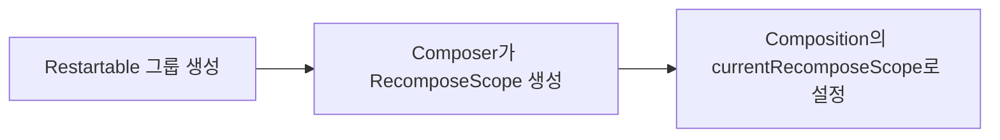
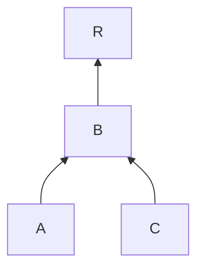
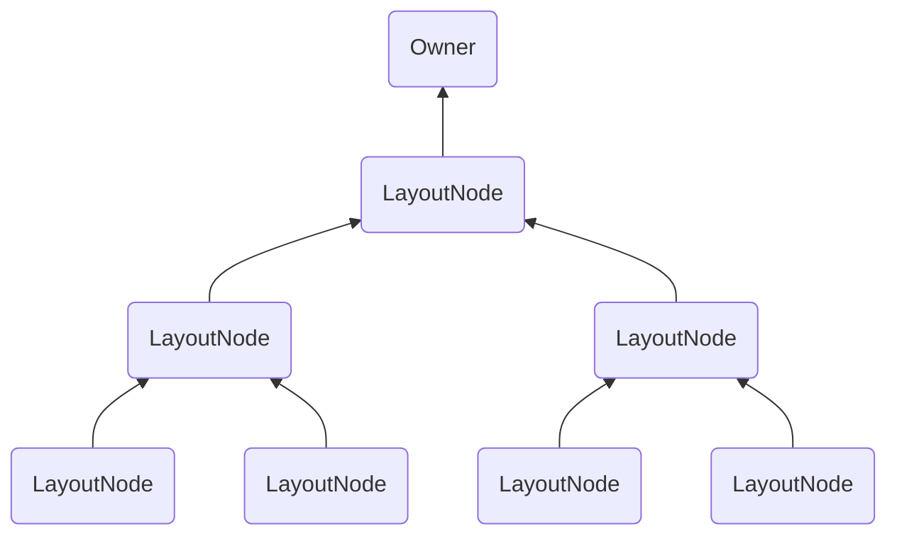

Chapter3는 Compose 런타임에 초점을 맞추고 있지만, Compose의 다양한 구성 요소들이 어떻게 협력하는지를 이해하는데 중요한 챕터입니다.

Compose에서 중요한 점은 컴포저블이 실제로 UI를 생성하지 않고, Composer를 통해 런타임에서 관리하는 메모리 내 구조(슬롯 테이블)에 변경 사항을 "발행"한다는 사실입니다.  
이러한 표현은 나중에 해석되어 UI를 "구체화"하는데 사용됩니다.

이는 컴포저블이 어떻게 Composition에 변경 사항을 **발행**하는지, 그리고 이를 통해 Composition은 필요한 모든 정보로 업데이트되는 과정을 설명한 것입니다.       
이 과정은 컴파일러가 주입한 현재의 `$composer` 인스턴스를 통해 이루어지며, `Composer` 인스턴스와 Composition은 Compose 런타임의 중요한 구성 요소입니다.

지금까지는 런타임에서 '메모리에 유지되는 상태'를 “Composition”이라고 불러왔지만, 이 개념은 의도적으로 단순화된 것입니다.  
이제부터 Composition 상태를 저장하고 관리하는 데이터 구조에 대해 자세히 알아보겠습니다.

## The slot table and the list of changes

Compose 내부에 대한 문서가 부족하다 보니, '슬롯 테이블'과 '변경 목록'의 데이터 구조 차이에 대해 혼란을 느낄 수 있습니다.  
먼저 이 부분을 명확히 하는 것이 중요합니다.

슬롯 테이블은 Composition의 현재 상태를 저장하는 메모리 내 구조로, 컴포저블이 호출될 때 그 위치와 관련 데이터를 기록하는 역할을 합니다.  
여기에는 컴포저블의 위치, 파라미터, `remember`로 처리된 값, `CompositionLocal`와 같은 중요한 정보들이 포함됩니다.  
Initial Composition이 실행되면 슬롯 테이블에 위 정보들이 기록되며, 이후 Recomposition이 발생할 때마다 이미 기록된 정보를 바탕으로 필요한 부분만 업데이트됩니다.  
Composer는 슬롯 테이블에 기록된 Composition의 현재 상태를 바탕으로 다음 변경 사항 목록을 생성합니다.  
또한, 트리에서 발생하는 모든 변경 사항은 슬롯 테이블에 기록된 Composition의 현재 상태에 의존합니다.

슬롯 테이블이 Composition의 상태를 기록하는 동안, 변경 목록은 실제로 노드 트리에 변경 사항을 적용하는 역할을 합니다.   
변경 목록은 패치 파일처럼 생각할 수 있습니다. 즉, 모든 변경 사항을 먼저 기록한 후, 그 기록된 변경 사항을 한꺼번에 트리에 적용하는 구조입니다.   
이 변경 목록을 적용하는 것은 `Applier`가 담당하며, 이는 런타임에서 트리를 구체화하는데 의존하는 추상화된 개념입니다.  
이 부분에 대해서는 나중에 자세히 다룰 것입니다.

마지막으로, `Recomposer`는 전체 과정을 조율하며, Recomposition을 언제, 어떤 스레드에서 실행할지, 그리고 변경 사항을 언제, 어떤 스레드에서 적용할지를 결정합니다.  
이 또한, 나중에 자세히 다룰 것입니다.

## The slot table in depth

Composition의 상태가 어떻게 저장되는지 알아보겠습니다.  
슬롯 테이블은 빠른 선형 접근이 가능하도록 최적화된 데이터 구조로, 텍스트 편집기에서 자주 사용되는 "갭 버퍼"라는 개념을 기반으로 합니다.  
슬롯 테이블은 이를 위해 두 개의 선형 배열에 데이터를 저장하는데, 하나는 Composition에 포함된 **그룹** 정보를 저장하고, 다른 하나는 각 그룹에 속한 **슬롯**을 저장합니다.

```kotlin
var groups = IntArray(0)
    private set

var slots = Array<Any?>(0) { null }
    private set
```

> Chapter2에서 컴파일러가 컴포저블의 본문을 래핑하여 그룹을 발행하는 방법에 대해 배웠습니다.  
> 이 그룹들은 메모리에 저장될 때 컴포저블에 아이덴티티(유니크 키)를 부여하여, 나중에 이를 식별할 수 있게 합니다.  
> 그룹은 컴포저블 호출과 그 자식 요소들과 관련된 모든 정보를 포함하며, 해당 컴포저블을 그룹으로 처리하는 방식을 정의합니다.  
> 그룹은 컴포저블 본문 내부의 제어 흐름 패턴에 따라서 다른 타입이 될 수 있습니다:  
> Restartable 그룹, Moveable 그룹, Replaceable 그룹, Reusable 그룹 등...

그룹 배열은 오직 "그룹 필드"만 저장하기 때문에 `Int` 값으로 구성됩니다.  
그룹 필드는 그룹의 메타데이터를 나타내며, 부모 그룹과 자식 그룹이 그룹 필드 형태로 저장됩니다.  
그룹 배열은 선형 구조이므로, 부모 그룹의 그룹 필드가 먼저 오고, 자식 그룹의 그룹 필드가 뒤따릅니다.  
이는 그룹 트리를 선형 방식으로 모델링하며, 자식 그룹들을 빠르게 탐색할 수 있게 도와줍니다.  
선형 구조에서 랜덤 접근은 비용이 많이 들기에, 이를 위해 그룹 앵커(`Anchors`)라는 포인터 역할의 개념이 사용됩니다.

| Group 1 (Parent) | Group 2 (Child) | Group 3 (Child) | Group 4 (Parent) | Group 5 (Child) | Group 6 (Child) |
|------------------|-----------------|-----------------|------------------|-----------------|-----------------|

반면, 슬롯 배열은 각 그룹에 대한 관련 데이터를 저장하며, 모든 타입(`Any?`)의 값을 저장할 수 있도록 설계되어 있습니다.  
따라서, 실제 Composition 데이터는 이 슬롯 배열에 저장됩니다.  
`groups` 배열에 있는 각 그룹은 `slots` 배열에서 자신과 연결된 슬롯을 어떻게 찾아 해석할지에 대한 정보를 포함하고 있으며, 각 그룹은 특정 슬롯 범위와 연결되어 있습니다.

슬롯 테이블은 데이터를 읽고 쓰기 위해 갭(gap)이라는 개념을 사용합니다.  
갭은 테이블 내의 포지션 범위로 생각할 수 있는데, 이 범위는 이동할 수 있고, 배열에서 데이터를 읽고 쓸 위치를 결정합니다.  
갭에는 데이터를 쓰기 시작할 위치를 가리키는 포인터가 있으며, 이 갭의 시작점과 끝점은 이동 가능하기에 테이블의 데이터를 덮어쓸 수도 있습니다.


다음 조건부 로직을 생각해보세요:

```kotlin
@Composable
@NonRestartableComposable
fun ConditionalText() {
    if (a) {
        Text(a)
    } else {
        Text(b)
    }
}
```

위와 같이 컴포저블이 `@NonRestartableComposable`로 표시된 경우, Restartable 그룹 대신에 Replaceable 그룹이 삽입됩니다.  
이 Replaceable 그룹은 현재 "활성화"된 자식의 데이터를 슬롯 테이블에 저장합니다.  
즉, `a`가 `true`일 때는 `Text(a)`의 데이터를 테이블에 저장합니다.  
이후 조건이 변경되면, 갭은 그룹의 시작 위치로 돌아가서 데이터를 다시 쓰기 시작하며, `Text(b)`의 데이터로 기존 슬롯을 덮어씁니다.

슬롯 테이블에서 데이터를 읽고 쓰기 위해서는 `SlotReader`와 `SlotWriter`가 사용됩니다.  
Reader는 여러 개를 동시에 활성화 할 수 있지만, **Writer는 한 번에 하나만 활성화**될 수 있습니다.  
각 읽기/쓰기 작업이 완료되면, 해당 Reader나 Writer는 닫히게 됩니다.  
여러 개의 Reader가 동시에 열려 있을 수 있지만, 안전을 위해 **쓰기가 진행 중일 때는 테이블을 읽을 수 없습니다**.  
`SlotTable`은 활성화된 Writer가 닫힐 떄까지 무효하며, 이는 Writer가 그룹과 슬롯을 직접 수정하기 때문에 동시에 읽으려하면 경쟁 조건이 발생할 수 있습니다.

Reader는 방문자 패턴처럼 작동합니다.   
현재 그룹 배열에서 읽고 있는 그룹의 시작과 끝의 위치, 바로 앞에 저장된 부모 그룹, 현재 읽고 있는 슬롯, 해당 그룹이 가진 슬롯의 수 등을 추적합니다.  
또한, Reader는 위치를 변경하거나, 그룹을 건너뛰거나, 현재 슬롯의 값을 읽거나, 특정 인덱스에서 값을 읽는 등 다양한 작업을 수행할 수 있습니다.  
즉, Reader는 배열에서 그룹과 그 슬롯에 대한 정보를 읽어오는데 사용됩니다.

| Group 1 (Parent) | Group 2 (Child) | Group 3 (Child) | Group 4 (Parent) | Group 5 (Child) | Group 6 (Child) |
|------------------|-----------------|-----------------|------------------|-----------------|-----------------|

| 현재 읽고 있는 그룹 | 시작 위치 | 끝 위치 |  부모 그룹  | 그룹의 슬롯 인덱스 | 슬롯 개수 |
|:-----------:|:-----:|:----:|:-------:|:----------:|:-----:|
|   Group 1   |   0   |  3   |  NONE   |     0      |   3   |
|   Group 2   |   1   |  2   | Group 1 |     1      |   1   |
|   Group 3   |   2   |  3   | Group 1 |     2      |   1   |

반대로, Writer는 배열에 그룹과 슬롯을 기록하는데 사용됩니다.  
앞서 설명했듯이, Writer는 `Any?` 타입의 데이터를 테이블에 쓸 수 있습니다.  
`SlotWriter`는 그룹과 슬롯을 작성할 위치를 결정하기 위해, "갭"을 사용하여 배열 내에서 적절한 위치를 찾아 기록합니다.

갭은 이동 가능하고 크기를 조정할 수 있는 선형 배열의 포지션 범위로 생각할 수 있습니다.  
Writer는 각 갭의 시작과 끝 위치, 그리고 길이를 추적하며, 시작점과 끝점을 조정하여 갭을 이동시킬 수 있습니다.

Writer는 그룹과 슬롯을 추가, 교체, 이동, 제거할 수 있습니다.  
예를 들어, 트리에 새로운 컴포저블 노드를 추가하거나, 조건부 로직 내에서 조건이 바뀔 때 컴포저블을 교체하는 경우를 생각할 수 있습니다.

또한, Writer는 그룹과 슬롯을 스킵하거나, 특정 위치로 이동하거나, `Anchor`에 의해 결정된 위치로 이동하는 등의 다양한 작업을 수행할 수 있습니다.

Writer는 테이블에서 특정 인덱스로 빠르게 접근할 수 있도록 `Anchor` 목록을 추적합니다.  
테이블 내 그룹의 위치(그룹 인덱스)도 `Anchor`를 통해 추적됩니다.  
그룹이 이동되거나 교체, 삽입, `Anchor`가 가리키는 위치 이전에서 제거되는 경우, 해당 `Anchor`는 업데이트됩니다.

슬롯 테이블은 Composition 그룹의 Iterator 역할도 하기 떄문에, 도구들이 Composition의 세부 정보를 검사하고 표시할 수 있는 정보를 제공합니다.

이제 변경 목록에 대해 알아보겠습니다.

## The list of changes

위에서 슬롯 테이블이 Composition의 현재 상태를 추적하는 방법을 배웠습니다.  
그렇다면 변경 목록의 정확한 역할을 무엇이고, 언제 생성되며, 무엇을 모델링하는지, 언제 적용되는지, 그 이유는 무엇인지 등 명확히 알아야 할 것들이 남아 있습니다.  
이번 섹션에서는 이 모든 것들을 정리하겠습니다.

Composition(or Recomposition)이 발생할 때마다, 소스 코드의 컴포저블들이 실행되고 **발행**됩니다.  
"발행"은 먼저 슬롯 테이블을 업데이트하고, 그 후에 구체화된 트리를 업데이트 하기 위한 **deferred 변경 사항**을 생성하는 것을 의미합니다.  
'deferred 변경 사항'들은 목록으로 저장되며, 이 새로운 변경 목록은 이미 슬롯 테이블에 저장된 현재 상태를 기반으로 만들어집니다.  
기억할 점은, 트리의 모든 변경 사항은 Composition의 현재 상태에 의존해야 한다는 것입니다.

> 이에 대한 예시로, 리스트에서 컴포저블 요소의 순서를 변경하여, 노드가 이동하는 상황을 생각할 수 있습니다.  
> 이 경우, 해당 노드가 테이블 어디에 위치했는지 확인한 후, 해당 슬롯을 제거하고, 새로운 위치에서 다시 기록해야 합니다.

즉, 컴포저블이 발행될 때마다 슬롯 테이블을 참조하여, 필요한 정보에 따라 'deferred 변경 사항'을 생성하고, 이를 변경 목록에 추가합니다.  
이후 Composition이 완료되면, 구체화가 이루어지고, 이때 **기록된** 변경 사항들이 실제로 실행됩니다. 이 괴정에서 슬롯 테이블은 Composition의 최신 정보로 업데이트됩니다.   
이러한 과정 덕분에 발행 프로세스는 나중에 실행될 지연된 작업만 생성되기에 매우 빠르게 처리됩니다.

이 과정을 통해 변경 목록이 슬롯 테이블에 변경 사항을 반영하는 역할을 담당한다는 것을 알 수 있습니다.  
그 후, `Applier`에게 구체화된 노드 트리를 업데이트하도록 알림을 보냅니다.

앞에서 설명한 것처럼, `Recomposer`는 이 과정을 조율하여 어떤 스레드에서 Composition이나 Recomposition을 할지, 그리고 변경 목록의 변경 사항을 어느 스레드에서 적용할지를 결정합니다.
후자는 `LaunchedEffect`가 이펙트를 실행하기 위해 사용하는 기본 컨텍스트가 되기도 합니다.

이로써 변경 사항이 어떻게 기록되고, 지연되며, 최종적으로 실행되는 방식과 상태가 슬롯 테이블에 저장되는 방식을 명확하게 이해할 수 있습니다.  
이제는 Composer에 대해 알아볼 차례입니다.

## The Composer

주입된 `$composer`는 작성한 컴포저블을 Compose 런타임과 연결하는 역할을 합니다.

## Feeding the Composer

트리의 메모리 내 표현에 노드가 어떻게 추가되는지 살펴보기 위한 예시로 `Layout` 컴포저블을 사용할 수 있습니다.  
`Layout`은 Compose UI에서 제공하는 모든 UI 컴포넌트의 기본 구조를 담당합니다.  
코드는 다음과 같습니다:

```kotlin
@Suppress("ComposableLambdaParameterPosition")
@Composable
inline fun Layout(
    content: @Composable () -> Unit,
    modifier: Modifier = Modifier,
    measurePolicy: MeasurePolicy
) {
    val density = LocalDensity.current
    val layoutDirection = LocalLayoutDirection.current
    
    ReusableComposeNode<ComposeUiNode, Applier<Any>>(
        factory = ComposeUiNode.Constructor,
        update = {
            set(measurePolicy, ComposeUiNode.SetMeasurePolicy)
            set(density, ComposeUiNode.SetDensity)
            set(layoutDirection, ComposeUiNode.SetLayoutDirection)
        },
        skippableUpdate = materializerOf(modifier),
        content = content
    )
}
```

`Layout`은 `ReusableComposeNode`을 사용하여 Composition에 `LayoutNode`를 발행합니다. 이는 노드를 즉시 생성하고 추가하는 것처럼 보입니다.  
하지만, 실제로는 런타임에게 노드를 어떻게 생성하고, 초기화할지, 그리고 적절한 시점에 Composition 내 현재 위치에 삽입할지를 알려주는 역할을 합니다.

이를 코드로 보면:

```kotlin
@Composable
inline fun <T, reified E : Applier<*>> ResuableComposeNode(
    noinline factory: () -> T,
    update: @DisallowComposableCalls Updater<T>.() -> Unit,
    noinline skippableUpdate: @Composable SkippableUpdater<T>.() -> Unit,
    content: @Composable () -> Unit
) {
    // ...
    currentComposer.startReusableNode()
    // ...
    currentComposer.createNode(factory)
    // ...
    Updater<T>(currentComposer).update() // initialization
    // ...
    currentComposer.startReplaceableGroup(0x7ab4aae9)
    content()
    currentComposer.endReplaceableGroup()
    currentComposer.endNode()
}
```

아직 관련되지 않은 일부분은 생략했지만, 이 코드가 `currentComposer` 인스턴스에 모든 작업을 위임하고 있다는 점을 주목해야 합니다.  
또한, 이 컴포저블의 `content`를 저장할 때 Replaceable 그룹을 시작하여 래핑하는 방식도 볼 수 있습니다.  
`content` 람다에서 발행된 자식들은 Replaceable 그룹의 자식으로 Composition에 저장됩니다.

이 발행 작업은 다른 컴포저블에도 동일하게 적용됩니다. `remember`를 살펴보겠습니다:

```kotlin
@Composable
inline fun <T> remember(calculation: @DisallowComposableCalls () -> T): T =
    currentComposer.cache(invalid = false, calculation)
```

`remember` 컴포저블은 `currentComposer`를 사용하여 제공된 람다의 반환 값을 Composition에 캐시(remember) 처리 합니다.  
`invalid` 파라미터는 이전에 저장된 값과 상관없이 값을 강제로 업데이트하도록 지시하는 데 사용됩니다.

`cache` 함수는 다음과 같이 작성됩니다:

```kotlin
@Composable
inline fun <T> Composer.cache(
    invalid: Boolean,
    block: () -> T
): T {
    return rememberedValue().let {
        if (invalid || it === Composer.Empty) {
            val value = block()
            updateRememberedValue(value)
            value
        } else {
            it
        }
    } as T
}
```

먼저 Composition(슬롯 테이블)에서 값을 검색합니다.  
값을 찾지 못하면, 값을 **업데이트하도록 예약**하는 변경 사항을 발행하고, 값을 찾으면 그대로 반환합니다.

## Modeling the Changes

`currentComposer`에 위임된 모든 발행 작업은 내부적으로 `Change`로 모델링되며, `Change`들은 목록에 추가됩니다.  
`Change`은 현재 `Applier`와 `SlotWriter`에 접근할 수 있는 deferred 함수입니다. (한 번에 하나의 Writer만 활성화될 수 있는 것을 기억하세요.)

코드를 살펴보겠습니다:

```kotlin
internal typealias Change = (
    applier: Applier<*>,
    slots: SlotWriter,
    rememberManager: RememberManager
) -> Unit
```

이 변경 사항들은 목록에 추가(기록)됩니다. "발행" 작업은 본질적으로 이러한 `Change`를 생성하는 것을 의미합니다.  
이 `Change`는 deferred 람다로, 슬롯 테이블에서 노드를 추가, 제거, 교체, 또는 이동 할 수 있게 합니다.  
그리고 나서 `Applier`에게 변경 사항을 알리면, 해당 변경 사항들이 구체화됩니다.

이런 이유로 "변경 사항을 발행한다"는 표현을 쓸 때, "변경 사항을 기록한다" or "변경 사항을 예약한다"는 말도 함께 사용할 수 있습니다.  
이들은 모두 같은 의미를 가리킵니다. 

Composition이 끝나고, 모든 컴포저블 호출이 완료되어 변경 사항들이 기록되면, `Applier`가 이 모든 변경 사항을 한 번에 일괄 처리하여 적용합니다.

> Composition은 `Composition` 클래스로 모델링됩니다.  
> 하지만 이 부분은 나중에 자세히 다룰 것이기에, `Composer`에 대해 더 알아보겠습니다.

## Optimizing when to write

앞서 배운 것처럼, 새로운 노드의 삽입 작업은 `Composer`에게 위임되기에, `Composer`는 새로운 노드를 Composition에 삽입하는 중인지를 항상 알고 있습니다.  
그래서 노드가 삽입 중일 떄는 변경 사항을 기록하여 나중에 처리하는 대신, 슬롯 테이블에 즉시 변경 사항을 적용하여 프로세스를 단축할 수 있습니다.  
반면, 삽입 중이 아닐 때는 변경 사항이 기록되고 지연 처리됩니다. 이는 아직 변경 사항을 적용할 시점이 아니기 때문입니다.

## Writing and reading groups

Composer는 그룹을 "시작"하거나 "종료"할 수 있으며, 이 작업은 현재 수행 중인 작업에 따라 다른 의미를 가집니다:    

- 기록 중이라면, 슬롯 테이블에 "그룹이 생성"되거나 "그룹이 제거"됨을 의미합니다.
- 읽는 중이라면, `SlotReader`가 읽기 포인터를 그룹 내외로 이동시켜 그룹의 읽기를 시작하거나 종료하게 됩니다.

컴포저블 트리의 노드들(= 슬롯 테이블의 그룹)은 삽입될 뿐만 아니라 제거되거나 이동될 수도 있습니다.  
그룹을 제거하는 것은 해당 그룹과 관련된 모든 슬롯을 테이블에서 제거하는 것을 의미합니다.  
이를 위해 Composer는 `SlotReader`에게 제거된 그룹을 스킵하도록 포인터를 재배치하고, `Applier`에게 제거된 그룹의 모든 노드를 제거하는 작업을 기록하게 요청합니다.  
모든 수정 작업은 예약(기록)되어 나중에 일괄적으로 처리되며, 이는 수정 작업의 일관성 보장하기 위함입니다.  
또한, Composer는 제거된 그룹에서 보류 중인 모든 무효화 작업을 폐기합니다. 해당 그룹은 더 이상 존재하지 않기 때문입니다.  

> 모든 그룹이 Restartable, Replaceable, Movable, Reusable 하지는 않습니다.  
> 그룹으로 저장되는 요소들 중에는 defaults wrapper block도 있습니다.  
> 이 블록은 컴포저블 호출에서 기본 파라미터를 생성하기 위해 `remember` 처리된 값을 래핑하는 역할을 합니다. (e.g: `model: Model = remember { DefaultModel() }`)
> 이 블록도 특정한 그룹으로 슬롯 테이블에 저장됩니다.

Composer가 그룹을 "시작"하려고 할 때, 다음과 같은 일들이 발생합니다:

- Composer가 값을 `inserting` 하고 있다면, 기다릴 필요 없이 즉시 슬롯 테이블에 값을 기록합니다.
- 그렇지 않고 보류 중인 작업이 있는 경우, 변경 사항을 기록하고 나중에 변경 사항을 적용할 때 실행될 것입니다.
  - 이 경우, Composer는 그룹이 슬롯 테이블에 이미 존재한다면, 이를 재사용하려고 시도합니다.
- 그룹이 슬롯 테이블에 저장되어 있지만 **다른 위치에 있는 경우**(= 그룹이 이동된 경우), 해당 그룹의 슬롯을 이동시키는 작업이 기록됩니다.
- 그룹이 새로운 그룹이라면(= 슬롯 테이블에서 찾을 수 없는 경우), Composer는 `inserting` 모드로 전환되어, 해당 그룹과 자식들을 중간(intermediate) `insertTable`(다른 `SlotTable`)에 기록합니다.
  - `insertTable`은 그룹이 완설될 떄까지 사용되며, 이후 최종 테이블에 그룹을 삽입하도록 예약합니다.
- 마지막으로, Composer가 삽입 중이 아니고 보류 중인 기록 작업이 없는 경우, 그룹을 읽기 시작하려고 시도합니다.

그룹을 재사용하는 것은 일반적입니다.  
새로운 노드를 생성할 필요가 없을 때, 기존에 있는 노드를 재사용할 수 있습니다. (`ReusableComposeNode` 참조)  
이 경우 `Applier`가 해당 노드로 이동하는 작업이 발행(기록)되지만, 노드를 생성하거나 초기화하는 작업은 스킵됩니다.

노드의 속성을 업데이트해야 할 때, 이 작업 역시 `Change`로 기록됩니다. 

## Remembering values

Composer는 값을 Composition에 기억할 수 있고(슬롯 테이블에 기록), 이후에 그 값을 업데이트할 수 있다는 점을 배웠습니다.  
기억된 값이 이전 Composition과 비교하여 변경되었는지는 `remember`가 호출될 때 바로 확인되지만, 업데이트 작업은 Composer가 삽입 중이 아닐 경우 `Change`로 기록됩니다.

업데이트할 값이 `RememberObserver`인 경우, Composer는 Composition에서 remember 작업을 추적하기 위한 암시적인 `Change`를 기록합니다.  
이 `Change`는 나중에 기억된 모든 값들을 잊어야 할 때 필요하게 됩니다.

## Recompose scopes

Composer가 처리하는 또 다른 작업은 재구성 범위(Recompose scope)입니다.  
재구성 범위는 스마트 Recomposition을 가능하게 하며, Restartable 그룹과 직접적으로 연결됩니다.  

Restartable 그룹이 생성될 때마다, Composer는 이 그룹에 맞는 `RecomposeScope`를 생성하고, 이를 `Composition`의 `currentRecomposeScope`로 설정합니다.



`RecomposeScope`는 Composition에서 특정 부분을 독립적으로 재구성할 수 있는 영역을 나타냅니다.  
이 범위는 수동으로 무효화하여 컴포저블의 Recomposition을 트리거하는데 사용될 수 있으며, 무효화는 Composer를 통해 요청됩니다: `composer.currentRecomposeScope().invalidate()`  
재구성이 시작되면, Composer는 슬롯 테이블을 Restartable 그룹의 시작 위치로 이동시키고, 람다에 전달된 재구성 블록(Recompose block)을 호출합니다.  
이렇게 하면 컴포저블이 다시 호출되어, 한 번 더 발행되고, Composer는 테이블에 있는 기존 데이터를 덮어쓰게 됩니다.

Composer는 무효화된 재구성 범위들을 모두 `Stack`에 저장합니다.  
`Stack`에 저장된 무효화된 재구성 범위들은 보류 중인 재구성으로, 다음 Recomposition에서 트리거되어야 합니다.  
`currentRecomposeScope`는 이 `Stack`에서 피크(peek)하여 얻어집니다.

`RecomposeScope`는 항상 활성화되지 않고, 컴포저블 내에서 `State` 스냅샷을 읽는 작업을 발견했을 때만 활성화됩니다.  
이 경우, Composer는 `RecomposeScope`를 `used`로 표시하며, 컴포저블 끝에서 호출되는 "end"는 **non-null을 반환**하고, 그 다음의 Recomposition 람다가 활성화됩니다. (아래의 `?` 문자 이후 참조)

```kotlin
// After compiler inserts boilerplate
@Composable
fun A(
    x: Int,
    $composer: Composer<*>,
    $changed: Int
) {
    $composer.startRestartGroup()
    // ..
    f(x)
    $composer.endRestartGroup()?.updateScope { next ->
        A(x, next, $changed or 0b1)                     // Recompose block
    }
}
```

Composer는 Recomposition이 필요할 때, 현재 부모 그룹의 '무효화된 자식 그룹' 모두를 재구성할 수 있습니다.    
Recomposition이 필요하지 않다면, Reader가 해당 그룹을 스킵하고 끝으로 이동하게 할 수 있습니다. ([see](Chapter%202%20%3A%20The%20Compose%20compiler.md#comparison-propagation))

## SideEffects in the Composer

Composer는 `SideEffect`도 기록할 수 있습니다.  
`SideEffect`는 항상 **Composition이 완료된 후**에 실행되며, 트리에 대한 변경 사항이 **이미 적용된 후**에 호출될 함수로 기록됩니다.

`SideEffect`는 컴포저블의 라이프사이클과는 무관하게 발생하기에, Composition을 떠날 때 자동으로 취소되거나, Recomposition 시 다시 실행되지 않습니다.  
이는 `SideEffect`가 **슬롯 테이블에 저장되지 않기 때문에**, Composition이 실패하면 단순히 폐기됩니다.  
이와 관련된 내용은 이펙트 핸들러 챕터에서 더 다루겠지만, Composer를 통해 이들이 어떻게 기록되는지 살펴보는 것도 흥미로운 부분입니다.

## Storing CompositionLocals

Composer는 `CompositionLocals`를 등록하고, 키를 통해 해당 값을 가져오는 수단을 제공합니다.  
`CompositionLocal.current` 호출은 이를 기반으로 동작합니다.  
Provider와 해당 값들은 모두 그룹으로 슬롯 테이블에 함께 저장됩니다. 

## Storing source information

Composer는 Composition 중에 수집된 소스 정보를 `CompositionData` 형태로 저장하여, 이를 Compose 도구에서 활용할 수 있도록 합니다.

## Linking Compositions via CompositionContext

Composition은 단일 구조가 아니라, Composition과 SubComposition들로 이루어진 트리 구조를 가지고 있습니다.  
SubComposition은 독립적인 무효화를 지원하기 위해, 현재 Composition 내에서 별도의 Composition을 생성할 목적으로 인라인에서 생성됩니다.

SubComposition은 부모의 `CompositionContext` 참조를 통해 부모 Composition과 연결됩니다.  
즉, `CompositionContext`는 Composition과 SubComposition들을 트리처럼 연결하기 위해 존재합니다.  
또한, `CompositionContext`를 통해서 `CompositionLocals`와 무효화 작업이 하나의 Composition처럼 트리 내에서 자연스럽게 처리되고 전파됩니다.   
`CompositionContext` 역시 슬롯 테이블에 그룹 형태로 기록됩니다.

SubComposition의 생성은 일반적으로 `rememberCompositionContext`를 통해 이루어집니다:

```kotlin
@Composable
fun rememberCompositionContext(): CompositionContext {
    return currentComposer.buildContext()
}
```

`rememberCompositionContext()`은 현재 슬롯 테이블 위치에서 새로운 Composition을 기억하거나, 이미 존재하는 Composition이 있다면 해당 Composition을 반환합니다.  
이 함수는 SubComposition을 생성하는데 사용되며, 별도의 Composition이 필요한 `VectorPainter`, `Dialog`, `SubcomposeLayout`, `Popup`, `AndroidView` 래퍼 등에서 사용됩니다.

## Accessing the current State snapshot

Composer는 현재 스레드에서 가변 상태와 기타 상태 객체들이 반환하는 값의 스냅샷에 대한 참조를 가지고 있습니다.  
모든 상태 객체는 스냅샷이 생성될 때의 값을 유지하며, 스냅샷 내에서 명시적으로 변경되지 않는 한 동일한 값을 가집니다.  
이 부분은 상태 관리 챕터에서 자세히 다루겠습니다.

## Navigating the nodes

노드 트리의 탐색은 `Applier`에 의해 수행되지만, 직접적으로 이뤄지지는 않습니다.  
대신, Reader가 노드를 탐색할 때 해당 노드들의 위치를 `downNodes` 배열에 기록하는 방식으로 이루어집니다.   

노드 탐색이 완료되면, `downNodes` 배열에 기록된 모든 down 동작이 `Applier`에 전달됩니다.  
만약 down 동작이 처리되기 전에 up 동작이 기록된다면, 해당 down 동작은 `downNodes` 스택에서 제거됩니다.  
이는 작업을 단축시키기 위한 방법입니다.

## Keeping reader and writer in sync

Reader와 Writer의 동기화 유지는 다소 저수준의 개념이지만, 그룹이 삽입, 삭제, 또는 이동될 수 있기 때문에, 
변경 사항이 적용되기 전까지 Writer에서의 그룹 위치가 잠시 동안 Reader의 위치와 다를 수 있습니다. 

이 위치 차이를 추적하기 위해 델타라는 개념이 필요합니다.  
델타는 삽입, 삭제, 이동이 발생할 때마다 업데이트되며, Writer가 Reader의 현재 슬롯과 일치하려면 얼마나 이동해야 하는 '아직 반영되지 않은 거리'를 나타냅니다.

## Applying the changes

Chapter 3에서 여러 번 언급했듯이, `Applier`는 변경 사항을 적용하는 작업을 담당합니다.  
현재 `Composer`는 Recomposition 후에 기록된 모든 변경 사항을 적용하기 위해, 이를 추상화된 `Applier`에 위임합니다.  
이 과정을 "구체화"라고 부르며, 이 과정은 기록된 변경 목록을 실행하고, 그 결과로 슬롯 테이블을 업데이트하며, 그 안에 저장된 Composition 데이터를 해석하여 최종 결과를 산출합니다.

**런타임은 `Applier`의 구현 방식에 대해서는 관여하지 않는** 대신, 클라이언트 라이브러리에서 구현해야 하는 public contract에 의존합니다.  
이는 `Applier`가 플랫폼과의 통합 지점이기 때문에, 사용 사례에 따라 달라질 수 있기 떄문입니다.

다음은 `Applier`의 public contract 형태입니다:

```kotlin
interface Applier<N> {
    val current: N
    fun onBeginChanges() { }
    fun onEndChanges() { }
    fun down(node: N)
    fun up()
    fun insertTopDown(index: Int, instance: N)
    fun insertBottomUp(index: Int, instance: N)
    fun remove(index: Int, count: Int)
    fun move(from: Int, to: Int, count: Int)
    fun clear()
}
```

우선 contract 선언에서의 볼 수 있는 것은 `N`이라는 타입 파라미터이며, 이는 적용하는 노드들의 타입을 나타냅니다.  
이 덕분에 Compose는 노드의 타입에 구애받지 않으면서 제네릭 호출 그래프 or 노드 트리와 같이 다양한 형태의 구조에서도 작동할 수 있습니다.  
`Applier`는 트리를 탐색하고, 노드의 삽입, 삭제, 이동하는 작업을 제공하지만, 노드 타입이나 삽입 방식에 대해서는 관여하지 않습니다.  
참고로, **이 작업은 나중에 노드 자체에 위임됩니다.**

contract에서는 현재 노드의 주어진 범위 내 자식 노드를 제거하는 방법이나, 자식 노드를 이동시켜 위치를 변경하는 방법도 정의하고 있습니다.  
또한, `clear` 연산은 루트를 가리키며 트리 내의 모든 노드를 제거하여, `Applier`와 그 루트를 새로운 Composition의 타겟으로 사용할 수 있도록 준비하는 방법을 정의합니다.

`Applier`는 트리 전체를 순회하며 각 노드를 방문하고 변경 사항을 적용합니다. 이때, 트리는 하향식/상향식으로 탐색할 수 있습니다.   
`Applier`는 항상 현재 방문 중인 노드를 참조하며, 해당 노드에 필요한 변경 사항을 적용합니다.  
또한, `Composer`가 변경 사항을 적용하기 전 또는 적용 후 호출할 수 있는 메서드를 제공합니다.  
그리고 하향식/상향식으로 노드를 삽입하는 방법과 하향식(현재 노드의 자식으로 이동) / 상향식(현재 노드의 부모로 이동)으로 탐색하는 수단을 제공합니다.

## Performance when building the node tree

트리를 하향식으로 구축하는 것과 상향식으로 구축하는 것에는 중요한 차이가 있습니다.  
이와 관련된 내용을 좀 더 쉽게 이해하기 위해, 공식 문서의 특정 예시를 살펴보겠습니다.

### Inserting top-down

다음 트리를 보면:



위 트리를 하향식으로 구축하려면 다음 순서를 따라야 합니다:

1. R에 B를 삽입
2. B에 A를 삽입
3. B에 C를 삽입


### Inserting bottom-up

트리를 상향식으로 구축할 때는 다음 순서로 진행됩니다.

1. B에 A를 삽입
2. B에 C를 삽입
3. R에 B 트리 삽입


트리를 상향식으로 구축할 때와 하향식으로 구축할 때의 성능은 상당히 차이가 날 수 있습니다.  
이는 `Applier`의 구현 방식에 따라 달라지며, 주로 새로운 자식이 삽입될 때 알림을 받아야 하는 노드의 수에 따라 결정됩니다.

예를 들어, Compose로 표현하려는 그래프에서 노드가 삽입될 때마다 모든 부모 노드에게 알림을 보내야 한다고 가정하겠습니다.  

하향식 방식에서는 노드를 삽입할 때마다 여러 노드(부모, 부모의 부모 등)에게 알림이 전달됩니다.  
이러한 알림의 수는 트리의 레벨이 늘어날수록 기하급수적으로 증가할 것입니다.

반면, 상향식 방식에서는 항상 직접적인 부모 노드에게만 알림이 전달됩니다.  
왜냐하면 부모 노드가 아직 트리에 연결되지 않은 상태이기 때문입니다.  

하지만, 알림을 모든 자식에게 보내야 하는 전략이라면, 상황은 반대가 될 수 있습니다.  
결국, 표현하고자 하는 트리와 변경 사항을 위로 또는 아래로 알려야 하는 방식에 따라 다르게 결정됩니다.  
여기서 중요한 점은 트리의 구축 방식을 상향식 또는 하향식 중 한 가지 방법으로만 선택해야 하며, 절대로 두 가지 방법을 혼용해서는 안 됩니다.

## How changes are applied

위에서 설명한 것처럼, 클라이언트 라이브러리는 `Applier` 인터페이스의 구현을 제공합니다.  
그 중 하나로 Android UI를 위한 `UiApplier`가 있습니다.   
이를 통해 "노드를 적용한다"는 것이 무엇을 의미하며, 이 특정 사용 사례에서 화면에 보이는 컴포넌트들이 어떻게 생성되는지를 명확히 이해할 수 있습니다.

`UiApplier`의 구현은 매우 간결합니다:

```kotlin
internal class UiApplier(
    root: LayoutNode
): AbstractApplier<LayoutNode>(root) {
    override fun insertTopDown(index: Int, instance: LayoutNode) {
        // Ignored
    }
    
    override fun insertBottomUp(index: Int, instance: LayoutNode) {
        current.insertAt(index, instance)
    }
    
    override fun remove(index: Int, count: Int) {
        current.removeAt(index, count)
    }
    
    override fun move(from: Int, to: Int, count: Int) {
        current.move(from, to, count)
    }
    
    override fun onClear() {
        current.removeAll()
    }
    
    override fun onEndChanges() {
        super.onEndChanges()
        (root.owner as? AndroidComposeView)?.clearInvalidObservations()
    }
}
```

처음으로 볼 수 있는 것은 제네릭 타입 `N`이 `LayoutNode`로 고정된 점입니다.  
`LayoutNode`는 Compose UI에서 렌더링될 UI 노드를 표현하기 위해 선택된 타입입니다.

다음으로, `UiApplier`가 `AbstractApplier`를 확장하고 있다는 것을 볼 수 있습니다.  
`AbstractApplier`는 방문한 노드를 `Stack`에 저장하는 기본 구현체입니다.  
트리 아래로 새로운 노드를 탐색할 때마다, 해당 노드를 스택에 추가하고, 트리 위로 이동할 때는 스택 최상단의 마지막 노드를 제거합니다.  
이러한 접근 방식은 대부분의 `Applier`에서 공통적으로 사용되므로, 이를 공통 부모 클래스에 정의하는 것이 효율적입니다.

`UiApplier`에서 `insertTopDown`이 무시되는 것을 볼 수 있는데, 이는 Android의 경우 노드 삽입이 상향식으로 이루어지기 때문입니다.  
앞서 언급했듯이, 삽입 전략을 선택할 때 상향식/하향식 중 하나만 선택해야 하며, 두 전략을 혼용해서는 안 됩니다.  
Android에서는 새로운 자식이 삽입될 때, 중복된 알림을 피하기 위해 상향식 방식이 더 적합합니다.

노드를 삽입, 제거, 이동하는 메서드들은 모두 **노드 자체에 위임**됩니다.  
`LayoutNode`는 Compose UI에서 UI 노드를 모델링한 것이므로, 부모와 자식 노드에 대한 모든 정보를 알고 있습니다.  
노드 삽입은 해당 노드를 새로운 부모 노드의 특정 위치에 연결하는 것이며, 부모는 여러 자식을 가질 수 있습니다.  
노드 이동은 부모의 자식 목록을 재정렬하는 것이고, 노드 제거는 자식 목록에서 해당 노드를 삭제하는 것을 의미합니다.

변경 사항을 모두 적용한 후에는 `onEndChanges()`를 호출하여 루트 노드의 오너에게 최종 작업을 위임할 수 있습니다.  
(변경 사항을 적용하기 전에 항상 `onBeginChanges()`가 호출된다고 가정되므로, `onEndChanges()`는 마지막에 호출되어야 합니다.)  
`onEndChanges()`가 호출되는 시점에서는 보류 중이던 유효하지 않은 관찰들이 모두 정리됩니다.  
이러한 유효하지 않은 관찰은 스냅샷 관찰로, 이들이 읽거나 의존하는 값이 변경되면 layout 또는 draw 단계가 자동으로 다시 수행되도록 설계되었습니다.  
예를 들어, 노드가 추가, 삽입, 교체, 이동되는 경우, 이러한 변화가 measuring이나 layout에 어떤 영향을 미칠지 쉽게 예상할 수 있습니다.

## Attaching and drawing the nodes

이제는 다음과 같은 핵심 질문을 할 수 있습니다:  

Q : 트리에 노드를 삽입하고 이를 부모에 연결하는 과정이 어떻게 화면에 나타나는 것일까?  
A : 노드는 스스로 연결하고 그리는 방법을 알고 있습니다.

`LayoutNode`는 Android UI와 같은 특정 사용 사례에서 사용하기 위해 선택된 노드 타입입니다.  
`UiApplier` 구현이 `LayoutNode`에 삽입 작업을 위임할 때, 다음과 같은 순서로 진행됩니다:

- 노드를 삽입할 조건이 충족되었는지 확인합니다. 
  - 예를 들어, 노드에 이미 부모가 있는지 확인합니다.
- Z 인덱스에서 정렬된 자식 목록을 무효화합니다. 
  - 이 목록은 자식 노드를 Z 인덱스에 따라 정렬하여, 낮은 Z 인덱스부터 그려질 수 있도록 관리하는 병렬 목록입니다.
  - 목록을 무효화하면, 필요할 때마다 다시 생성되고 정렬됩니다.
- 새로운 노드를 부모와 `Owner`에게 연결합니다.
- 무효화 작업을 수행합니다.

오너는 **컴포저블 트리와 Android의 기본 View 시스템을 연결**하는 중요한 역할을 합니다.  
트리의 루트에 위치한 오너는 Android와의 통합되는 얇은 레이어로서, 실제로 `AndroidComposeView`라는 표준 `View`로 구현됩니다.  
모든 layout, draw, 입력, 접근성은 오너를 통해 처리됩니다.  
`LayoutNode`가 화면에 나타내기 위해서는 반드시 `Owner`에 연결되어야 하고, 이 오너는 부모의 오너와 동일해야 합니다.  
오너는 Compose UI의 일부이며, `LayoutNode`를 연결한 후에는 `Owner`를 통해 `invalidate`를 호출하여 컴포저블 트리를 렌더링할 수 있습니다.



최종 통합은 `Owner`가 설정될 떄 발생하며, 이는 `Activity`, `Fragment`, 또는 `ComposeView`에서 `setContent`를 호출할 때 발생합니다.  
`setContent`가 호출되는 시점에 `AndroidComposeView`가 생성되어 `View` 계층 구조에 부착된 후, `Owner`로 설정되어, 필요할 때 무효화를 수행할 수 있습니다.

드디어 Compose UI가 Android에서 노드 트리를 구체화하는 방식을 이해하게 되었습니다.  
다음 챕터에서 이 과정에 대해 더 깊이 다룰 것입니다.

하나의 사이클을 마무리했지만, 아직 이른 감이 있습니다.  
지금까지 Composition이 어떻게 작동하는지에 대한 흥미로운 세부 사항을 수집했지만, 정작 Composition 과정 자체를 아직 다루지 않았습니다.

이제 Composition 과정에 대해 알아보겠습니다.

## Composition

이전 섹션에서는 Composer의 많은 디테일을 알아보았습니다. 
Composer가 슬롯 테이블에 변경 사항을 기록하거나 읽는 방법, 컴포저블이 실행될 때 변경 사항이 어떻게 발생하는지, 그리고 기록된 변경 사항이 최종적으로 어떻게 적용되는지를 살펴보았습니다.
하지만 아직 Composition을 누가, 어떻게, 그리고 언제 생성하는지, 그리고 그 과정에 어떤 단계들이 있는지는 다루지 않았습니다.

`Composer`가 `Composition`에 대한 참조를 가진다고 했지만, 이것이 마치 `Composition`이 `Composer`에 의해 생성되고 소유되는 것처럼 오해할 수 있습니다.  
그러나 실제로는 그 반대입니다. Composition이 생성될 때 스스로 Composer를 만들고, 이렇게 만들어진 Composer는 `currentComposer`를 통해 접근할 수 있게 됩니다.  
이후 이 Composer는 Composition이 관리하는 트리를 생성하고 업데이트하는데 사용됩니다.

Compose 런타임에 대한 클라이언트 라이브러리의 진입점은 두 가지로 나눌 수 있습니다.

- 컴포저블 작성: 컴포저블은 필요한 모든 정보를 발행하여, 사용 사례와 런타임을 연결합니다.
- 컴포저블은 Composition 과정 없이는 절대 실행될 수 없습니다. 
  - 그래서 또 다른 진입점인 `setContent`가 필요합니다. 
  - `setContent`는 타겟 플랫폼과의 통합 레이어 역할을 하며, 여기에서 `Composition`이 생성되고 시작됩니다.

## Creating a Composition

Android에서는 `ViewGroup.setContent`를 호출하여 새로운 `Compostion`을 생성할 수 있습니다:

```kotlin
// Wrapper.android.kt
internal fun ViewGroup.setContent(
    parent: CompositionContext,
    content: @Composable () -> Unit
): Composition {
    // ...
    val composeView = ...
    return doSetContent(composeView, parent, content)
}

private fun doSetContent(
    owner: AndroidComposeView,
    parent: CompositionContext,
    content: @Composable () -> Unit
): Composition {
    // ...
    val original = Composition(UiApplier(owner.root), parent)           // Here
    val wrapped = owner.view.getTag(R.id.wrapped_composition_tag) 
        as? WrappedComposition ?: WrappedComposition(owner, original).also {
            owner.view.setTag(R.id.wrapped_composition_tag, it)    
        }
    wrapped.setContent(content)
    return wrapped
}
```

`WrappedComposition`은 `Composition`을 `AndroidComposeView`에 연결하여 Android View 시스템과 직접 연결되도록 하는 데코레이터입니다.  
이 데코레이터는 키보드 가시성 변경이나 접근성과 같은 상태를 추적하기 위해 제어된 이펙트를 시작하고, `CompositionLocal`을 통해 Android의 `Context` 정보를 Composition에 전달합니다. 
이 덕분에, 모든 컴포저블에서 `Context` 정보를 암묵적으로 사용할 수 있습니다.  
(`Context` 정보는 Context 자체, Configuration, 현재 `LifecycleOwner`, 현재 `savedStateRegistryOwner`, 오너의 View 등이 포함됩니다.)

트리의 루트 `LayoutNode`를 가리키는 `UiApplier` 인스턴스가 Composition에 전달되는 것을 주목해야 합니다.
이 부분이 바로 `Applier`의 구현을 선택하는 책임이 클라이언트 라이브러리에 있다는 점을 명확히 보여줍니다.  
(`Applier`는 노드를 순회하는 방문자 역할을 하며, 처음에는 루트 노드를 카리키도록 설정됩니다.)

마지막으로 `composition.setContent(content)`가 호출되는 것을 볼 수 있습니다.  
`Composition#setContent`는 Composition의 콘텐츠를 설정하는 역할을 합니다.  
(즉, `content`가 제공하는 모든 정보로 Composition을 업데이트합니다.)

Composition을 생성하는 좋은 예로는 `VectorPainter`를 들 수 있습니다.  
`VectorPainter`는 Compose UI의 일부로, 화면에 벡터를 그리는 역할을 합니다.  
`VectorPainter`는 자체적으로 `Composition`을 생성하고 이를 유지합니다:

```kotlin
@Composable
internal fun RenderVector(
    name: String,
    viewportWidth: Float,
    viewportHeight: Float,
    content: @Composable (viewportWidth: Float, viewportHeight: Float) -> Unit
) {
    // ...
    val composition = composeVector(rememberCompositionContext(), content)
  
    DisposableEffect(composition) {
        onDispose {
            composition.dispose()       // composition needs to be disposed in the end
        }
    }
}

private fun composeVector(
    parent: CompositionContext,
    composable: @Composable (Float, Float) -> Unit
): Composition {
    val existing = composition
    val next = if (existing == null || existing.isDisposed) {
        Composition(VectorApplier(vector.root), parent)      // Here
    } else {
        existing
    }
    composition = next
    next.setContent {
        composable(vector.viewportWidth, vector.viewportHeight)
    }
    return next
}
```

이 주제는 Compose 고급 사용 사례를 다루는 다음 장에서 더 깊이 다룰 예정입니다.  
여기서 눈여겨볼 점은 다른 `Applier` 전략이 사용된다는 것입니다.  
즉, 벡터 트리의 루트 노드를 가리키는 `VectorApplier`가 선택되며, 이때 루트 노드는 `VNode`가 됩니다.

마지막으로, Compose UI에서 또 하나의 예로 들 수 있는 것은 `SubcomposeLayout` 입니다.  
이 레이아웃은 자체 Composition을 유지하여 measuring 단계에서 콘텐츠를 서브 컴포즈할 수 있습니다.  
부모의 크기 측정이 자식의 Composition을 위해 필요한 경우, 이를 유용하게 사용할 수 있습니다.

---

사용 사례와 상관 없이 Composition을 생성할 때 `parent CompositionContext`를 전달할 수 있습니다.  
다만, 이것이 `null`일 수도 있다는 점을 주의해야 합니다.  
부모 컨텍스트가 존재할 경우, 새로운 Composition은 기존 Composition과 논리적으로 연결됩니다.  
이렇게 함으로써 무효화와 `CompositionLocal`이 마치 동일한 Composition 내에서 처리되는 것처럼 동작하게 됩니다.

`Composition`을 생성할 때, Recompose Context를 전달할 수 있습니다.  
이 컨텍스트는 `Applier`가 변경 사항을 적용하고, 트리를 실체화하는데 사용하는 `CoroutineContext`입니다.  
만약 별도의 컨텍스트를 제공하지 않으면, 기본적으로 Recomposer가 제공하는 `EmptyCoroutineContext`가 사용됩니다.  
이 경우 Android에서는 `AndroidUiDispatcher.Main`에서 Recompose가 수행됨을 의미합니다. 

Composition이 생성되면, 더 이상 필요하지 않을 때 반드시 폐기해야 하며, 이를 위해 `composition.dispose()`를 호출합니다.   
이는 UI나 그 외 사용 사례가 더 이상 필요 하지 않을 때 이루어지며, Composition은 오너 범위에서 관리됩니다.  
때로는 Composition 폐기 작업이 명시적이지 않을 수 있습니다.  
예를 들어, `ViewGroup.setContent`의 경우 라이프사이클 옵저버 뒤에서 수행될 뿐이지, 폐기 작업은 반드시 존재합니다.

## The initial Composition process

새로운 Composition이 생성될 때, 항상 `composition.setContent(content)`가 호출됩니다.  
이 호출은 Composition이 데이터를 채우는 첫 단계입니다. (슬롯 테이블이 관련 데이터로 채워짐)  

`setContent` 호출은 `parent` Composition에 위임되어, Initial Composition 프로세스를 시작합니다.  
(부모 `CompositionContext`를 통해 Composition과 Subcomposition이 연결되는 방식을 기억하세요.)

```kotlin
override fun setContent(content: @Composable () -> Unit) {
    // ...
    this.composable = content
    parent.composeInitial(this, composable) // `this` is the current Composition
}
```

Subcomposition은 부모가 또 다른 Composition이 되고, 루트 Composition은 부모가 `Recomposer`가 됩니다.  
그러나 이와 관계없이, Initial Composition을 수행하는 로직은 언제나 `Recomposer`에 의존하게 됩니다.  
왜냐하면 Subcomposition은 `composeInitial()`이 루트 Composition에 도달할 떄까지 계속해서 부모에게 위임되기 때문입니다.

따라서 `parent.composeInitial(composition, content)` 호출은 `recomposer.composeInitial(composition, content)`로 변환될 수 있습니다.  
이를 통해, Initial Composition을 설정하기 위한 몇 가지 중요한 작업이 수행됩니다.

---

모든 상태 객체의 현재 값을 스냅샷으로 캡처하며, 이 값들은 다른 스냅샷의 변경 사항으로부터 격리됩니다.   
이 스냅샷은 **가변성**을 가지면서도 동시성에 안전합니다.  
격리되어 있기 때문에 기존의 다른 상태 스냅샷에 영향을 주지 않고 안전하게 수정할 수 있으며, 상태 객체의 변경 사항은 오직 해당 스냅샷에만 적용됩니다.   
이후 단계에서 모든 변경 사항이 글로벌 공유 상태와 atomically synchronized 됩니다.

가변 스냅샷의 상태 값은 `snapshot.enter(block: () -> T)`를 호출할 때 전달된 블록 내에서만 수정 가능합니다.

스냅샷을 캡처할 때, `Recomposer`는 언급된 상태 객체에 대한 read 및 write 작업을 위한 옵저버를 전달하여, Composition이 이러한 작업이 발생할 때 적절하게 알림을 받을 수 있도록 합니다.
이를 통해 `Composition`은 영향을 받는 Recomposition 범위를 `used`로 표시할 수 있으며, 적절한 시점에 Recomposition이 이루어지게 됩니다.

`snapshot.enter(block)`를 통해, `composition.composeContent(content)` 블록을 전달함으로써 스냅샷에 진입합니다. **여기서 실제로 Composition이 이루어집니다.**   
진입하는 액션은 Composition 동안 읽거나 쓰는 모든 상태 객체가 추적될 것임을 `Recomposer`에게 알리는 역할을 합니다.

Composition 프로세스는 Composer에게 위임됩니다. (이 단계에 대해서는 아래에서 더 자세히 다룰 것입니다.)

Composition이 완료되면, 상태 객체에 대한 모든 변경 사항은 현재 상태 스냅샷에만 적용되므로, 이러한 변경 사항을 전역 상태로 전파할 필요가 있습니다.
이는 `snapshot.apply()`를 통해 이루어집니다.

---

이것이 Initial Composition과 관련된 대략적인 순서입니다.  
상태 스냅샷 시스템에 대한 모든 내용은 다음 챕터에서 더 자세히 다룰 것입니다.

이제 Composition 프로세스 자체, 즉 `Composer`에게 위임된 프로세스를 살펴보겠습니다.  
대략적으로 다음과 같은 방식으로 진행됩니다:

1. Composition이 이미 실행 중인 경우, 새로운 Composition을 시작할 수 없습니다.  
이 경우 예외가 발생하고, 새로운 Composition은 무시됩니다. 즉, Composition의 재진입은 지원되지 않습니다.
2. 보류 중인 무효화가 있는 경우, 이를 `RecomposeScopes`의 무효화 목록에 복사합니다. 이 목록은 Composer에 의해 관리됩니다.
3. Composition이 시작될 예정이므로 `isComposing`을 `true`로 설정합니다.
4. `startRoot()`를 호출하여 Composition을 시작합니다. 이 호출은 슬롯 테이블에서 Composition의 루트 그룹을 시작하고 필요한 필드와 구조를 초기화합니다.
5. 슬롯 테이블의 `content`를 위해 `startGroup`을 호출하여 그룹을 시작합니다.
6. `content` 람다를 호출하여 모든 변경 사항을 발행합니다.
7. `endGroup()`을 호출하여 Composition을 종료합니다.
8. Composition이 완료되었으므로 `isComposing` 플래그를 `false`로 설정합니다.
9. 임시 데이터를 유지하는 다른 구조를 초기화합니다.

## Applying changes after initial Composition

Initial Composition이 완료된 후, 이 과정에서 기록된 모든 변경 사항을 적용하라고 `Applier`에게 알림을 보냅니다: `composition.applyChanges()`.  
이 과정은 Composition을 통해 이루어지며, 다음과 같은 단계로 진행됩니다.

1. `applier.onBeginChanges()`를 호출하여 변경 사항 적용을 시작합니다.
2. 변경 목록을 순회하면서 각 변경 사항을 실행하고, 각 변경 사항에 필요한 `Applier`와 `SlotWriter` 인스턴스를 전달합니다.
3. 모든 변경 사항이 적용된 후에는 `applier.onEndChanges()`를 호출합니다.

이러한 일련의 과정이 자연스럽게 이루어집니다.

그 후, 등록된 모든 `RememberedObservers`가 호출됩니다.  
이렇게 하면 `RememberObserver` 계약을 구현하는 클래스가 Composition에 진입하거나 떠날 때 알림을 받을 수 있습니다.  
예를 들어, `LaunchedEffect`나 `DisposableEffect`와 같은 클래스들이 이 계약을 구현하여, 해당 이펙트가 Composition 내의 컴포저블 라이프사이클에 맞춰 제한될 수 있습니다.

그 직후에는 모든 `SideEffects`가 기록된 순서대로 트리거됩니다.

## Additional information about the Composition

컴포지션은 재구성을 위해 보류 중인 무효화 사항을 알고 있으며, 현재 컴포지션이 진행 중인지에 대해서도 알고 있습니다.  
이 정보를 활용하여, 컴포지션이 진행 중일 때 무효화를 즉시 적용하거나, 그렇지 않은 경우에는 미룰 수 있습니다.  
또한, `Recomposer`는 현재 컴포지션이 진행 중일 때 재구성을 취소할 수 있습니다.

런타임은 컴포지션의 변형인 `ControlledComposition`을 사용하여 외부에서 제어할 수 있는 몇 가지 추가 기능을 제공합니다.   
이를 통해 `Recomposer`는 무효화와 추가적인 재구성을 조정할 수 있습니다.  
예를 들어, `Recomposer`는 필요할 때 `composeContent`나 `recompose`와 같은 함수들을 컴포지션에서 트리거할 수 있습니다.

컴포지션은 특정 객체 집합이 자신에 의해 관촬되고 있는지 감지하여, 해당 객체들이 변경될 때 재구성을 강제할 수 있는 방법을 제공합니다. 
예를 들어, `CompositionContext`로 연결된 부모 컴포지션에서 `CompositionLocal`이 변경될 때, 자식 컴포지션에서 재구성을 강제하기 위해 `Recomposer`를 사용합니다.

Composition 중에 오류가 발생할 때는, 컴포지션을 중단할 수 있습니다.  
이는 Composer, 모든 참조/스택 및 기타 모든 것을 초기화하는 과정과 유사합니다. 

Composer는 다음 조건을 만족할 때, 재구성을 건너뛴다고 가정합니다.

- 삽입이나 재사용을 하지 않음
- 무효화된 공급자가 없음
- 현재 `currentRecomposeScope`가 재구성을 필요로 하지 않음

스마트 재구성에 관한 내용은 다음 장에서 다룰 예정입니다.

## The Recomposer

초기 컴포지션이 어떻게 이루어지는지에 대해 배웠고, `RecomposeScope`와 무효화에 대해서도 어느 정도 이해했습니다.  
하지만, `Recomposer`가 실제로 어떻게 작동하는지에 대해서는 아직 알지 못합니다.  
예를 들어, `Recomposer`는 어떻게 생성되며, 언제 실행되며, 어떻게 무효화를 감지하여 자동으로 재구성을 트리거할까요?

`Recomposer`는 `ControlledComposition`을 제어하며, 필요할 때 재구성을 트리거하여 업데이트를 적용합니다.  
또한, 컴포지션이나 재구성을 수행할 스레드와 변경 사항을 적용할 스레드를 결정하는 역할을 합니다.

`Recomposer`를 생성하고 무효화를 대기하도록 설정하는 방법을 알아보겠습니다.

## Spawning the Recomposer

Compose에서 클라이언트 라이브러리가 시작하는 첫 단계는 컴포지션을 생성하고, 이를 통해 `setContent`를 호출하는 것입니다.  
이는 앞서 설명한 [Creating a Composition](#creating-a-composition)에서 다룬 내용입니다.  
컴포지션을 생성할 때는 반드시 '부모'를 제공해야 합니다.  
여기서, 루트 컴포지션의 부모는 `Recomposer`이므로, 컴포지션을 생성할 때는 `Recomposer`도 생성해야 합니다.

`setContent`를 호출하는 과정은 플랫폼과 Compose 런타임을 연결하는 중요한 단계이며, 이는 클라이언트가 제공하는 코드로 이루어집니다.  
Android에서는 이와 같은 역할을 Compose UI가 담당합니다. 클라이언트 라이브러리는 컴포지션을 생성하고(내부적으로는 자체 Composer를 생성), 부모로 사용할 `Recomposer`를 생성합니다.

> 각 플랫폼에서는 각각의 컴포지션을 생성할 가능성이 있습니다.  
> 또한, 이와 마찬가지로 각자 자신의 `Recomposer`를 생성할 가능성도 있다는 점을 기억하세요.

Android의 `ViewGroup`에서 Compose를 사용하려면 `ViewGroup.setContent`를 호출해야 합니다.  
이 호출은 여러 단계를 거쳐서, 'Recomposer Factory'에게 부모 컨텍스트를 생성하는 작업을 위임합니다:

```kotlin
fun interface WindowRecomposerFactory {
    fun createRecomposer(windowRootView: View): Recomposer
    
    companion object {
        val LifecycleAware: WindowRecomposerFactory = WindowRecomposerFactory { rootView ->
            rootView.createLifecycleAwareViewTreeRecomposer()
        }
    }
}
```

이 팩토리는 현재 윈도우에 대한 `Recomposer`를 생성합니다.  
이 생성 과정은 Android가 Compose와 통합하는 방법에 대한 많은 단서를 제공하므로, 매우 흥미로운 주제입니다.

`createRecomposer`를 호출하려면 루트 뷰에 대한 참조를 전달해야 합니다.  
이렇게 하면 생성된 `Recomposer`가 라이프사이클을 인식하게 되어, 뷰 계층 구조 루트에 있는 `ViewTreeLifecycleOwner`와 연결됩니다.  
이를 통해, 뷰 트리가 분리될 때 `Recomposer`를 취소(종료)할 수 있으며, 이 방식은 재구성 프로세스가 메모리 누수 없이 안전하게 종료되도록 하는데 중요합니다.  
(재구성 프로세스는 `suspend` 함수로 모델링되었으며, suspend 함수가 아닌 경우 메모리 누수가 발생할 수 있습니다.)

> Compose UI에서는 모든 UI 작업이 `AndroidUiDispatcher`를 사용하여 조정되거나 디스패치됩니다.  
> 이 디스패처는 `Choreographer` 인스턴스와 메인 `Looper`의 핸들러와 연결되어 있으며, 핸들러 콜백이나 `Choreographer`의 애니메이션 프레임 단계 중 먼저 발생하는 이벤트 디스패치를 수행합니다. 
> 또한, 이 디스패처는 프레임 렌더링을 조정하기 위해 `suspend`를 사용하는 `MonotonicFrameClock`와 연결되어 있습니다.  
> 
> 이 과정이 Compose 전체 UX를 구동하며, 애니메이션과 같은 작업이 시스템 프레임과 동기화되어 부드러운 UX를 제공하는데 많이 의존합니다.

팩토리 함수는 가장 먼저 `AndroidUiDispatcher`의 'Monotonic Clock'을 래핑하는 `PausableMonotonicFrameClock`를 생성합니다.  
이 클래스는 `withFrameNanos` 이벤트의 디스패치를 수동으로 일시 중지하고, 다시 시작할 수 있도록 지원합니다.   
이는 UI를 호스팅하는 윈도우가 더 이상 보이지 않을 때와 같이 특정 시간 동안 프레임을 생성하지 않아야 하는 경우에 유용합니다.

모든 `MonotonicFrameClock`은 `CoroutineContext.Element`이기도 하므로, 다른 `CoroutineContext`와 결합할 수 있습니다.

`Recomposer`를 인스턴스화할 땐, 반드시 `CoroutineContext`를 제공해야 합니다.  
이 컨텍스트는 `AndroidUiDispatcher`의 현재 스레드 컨텍스트와 생성된 `PausableMonotonicFrameClock`을 결합하여 생성됩니다.

```kotlin
val contextWithClock = currentThreadContext + (pauseableClock ?: EmptyCoroutineContext)
val recomposer = Recomposer(effectCoroutineContext = contextWithClock)
```

이렇게 결합된 컨텍스트는 `Recomposer`가 내부 `Job`을 생성하여, `Recomposer`가 종료될 때, 모든 Composition 또는 재구성 이펙트를 안전하게 취소할 수 있도록 합니다. 
예를 들어, Android 윈도우가 파괴(destroyed)되거나 분리(unattached)될 때 이 작업이 필요합니다.  

또한, 결합된 컨텍스트는 Composition 또는 재구성 후 변경 사항을 적용하는 데 사용되며, 추가로 `LaunchedEffect`가 이펙트를 실행하는 데 사용되는 기본 컨텍스트가 됩니다. 
이로 인해, 이펙트가 변경 사항을 적용하는 데 사용하는 스레드와 동일한 스레드에서 시작되며, Android에서는 일반적으로 메인 스레드를 사용합니다.  
물론, 이펙트 내에서 필요에 따라 언제든지 메인 스레드를 벗어날 수 있습니다.

> `LaunchedEffect`는 이펙트 핸들러로, 이에 대한 자세한 내용은 해당 주제에 대한 장에서 다룰 예정입니다.  
> 모든 이펙트 핸들러는 컴포저블 함수이며, 변경 사항을 발생시키고 이를 기록합니다. `LaunchedEffect`는 실제로 기록되며, 적절한 시점에 슬롯 테이블에 저장됩니다. 
> 따라서 `LaunchedEffect`는 `SideEffect`와 달리 컴포지셔 라이프사이클을 인식합니다.

마지막으로, 결합된 컨텍스트를 사용하여 `CoroutineScope`를 생성합니다.  
이 스코프는 재구성 작업(suspend 함수)을 시작하는 데 사용되며, 무효화가 발생할 떄까지 기다린 후, 재구성을 트리거합니다.

```kotlin
val runRecomposeScope = CoroutineScope(contextWithClock)
```

뷰 계층 구조 루트에 있는 `ViewTreeLifecycleOwner`와 연결되는 코드를 살펴보겠습니다:  

```kotlin
viewTreeLifecycleOwner.lifecycle.addObserver(
    object : LifecycleEventObserver { 
        override fun onStateChanged(owner: LifecycleOwner, event: Lifecycle.Event) {
            val self = this
            
            when (event) {
                Lifecycle.Event.ON_CREATE -> {
                    runRecomposeScope.launch(start = CoroutineStart.UNDISPATCHED) {
                        try {
                            recomposer.runRecomposeAndApplyChanges()
                        } finally {
                            // After completion or cancellation
                            owner.lifecycle.removeObserver(self)
                        }
                    }
                }
                Lifecycle.Event.ON_START -> pausableClock?.resume()
                Lifecycle.Event.ON_STOP -> pausableClock?.pause()
                Lifecycle.Event.ON_DESTROY -> recomposer.cancel()
            }
        }
    }
)
```

뷰 트리의 라이프사이클에 옵저버가 추가되며, 'Pausable Clock'을 사용하여 뷰 트리가 시작될 때 이벤트 디스패치를 재개하고, 중지될 때 이벤트 디스패치를 일시 중지합니다.
또한, 뷰 트리가 파괴될 때 `Recomposer`를 종료(취소)하고, 뷰 트리가 생성될 때 재구성 작업을 시작합니다.

재구성 작업은 `recomposer.runRecomposeAndApplyChanges()`에 의해 시작됩니다.  
이 함수는 앞서 언급한 suspend 함수로, 연관된 Composer(및 그들의 `RecomposeScope`)의 무효화를 기다린 후, 재구성을 수행하고, 마지막으로 새로운 변경 사항을 컴포지션에 적용합니다.

'Recomposer Factory'는 Compose UI에서 Android 라이프사이클에 연결된 `Recomposer`를 생성하는 방법입니다.  
이는 플랫폼과의 통합 지점에서 컴포지션과 함께 `Recomposer`가 어떻게 생성되는지를 잘 보여주는 예시입니다.  
다시 한번 상시시키자면, `ViewGroup`에 `content`를 설정할 때 컴포지션이 어떻게 생성되는지 살펴보겠습니다:

```kotlin
internal fun ViewGroup.setContent(
    parent: CompositionContext,                         // Recomposer is passed here
    content: @Composable () -> Unit
): Composition {
    // ...
    val composeView = ...
    return doSetContent(composeView, parent, content)
}

private fun doSetContent(
    owner: AndroidComposeView,
    parent: CompositionContext,
    content: @Composable () -> Unit
): Composition {
    // ...
    val original = Composition(UiApplier(owner.root), parent)           // Here
    val wrapped = owner.view.getTag(R.id.wrapped_composition_tag) 
        as? WrappedComposition ?: WrappedComposition(owner, original).also {
            owner.view.setTag(R.id.wrapped_composition_tag, it)    
        }
    wrapped.setContent(content)
    return wrapped
}
```

이곳의 부모는 `Recomposer`가 될 것이며, `setContent`를 호출하는 쪽에서 제공됩니다.  
이 사용 사례에서는 `AbstractComposeView`가 될 것입니다.

## Recomposition process

`recomposer.runRecomposeAndApplyChanges()`는 무효화를 기다리고, 무효화가 발생하면 자동으로 재구성을 수행하기 위해 호출됩니다.  
이제 이 과정에 포함된 다양한 단계들을 살펴보곘습니다.

이전 섹션에서 스냅샷 상태가 자신의 스냅샷 내에서 어떻게 수정되는지 배웠지만, 이후 이러한 변경 사항은 `snapshot.apply()`를 통해 전역 상태로 전파되어 동기화되어야 합니다.
`recomposer.runRecomposeAndApplyChanges()`를 호출하면 가장 먼저, 이 변경 사항을 전파하기 위한 옵저버를 등록합니다.
이후 변경 사항이 발생하면 이 옵저버가 활성화되어 모든 변경 사항을 스냅샷 무효화 목록에 추가하고, 이를 알려진 모든 Composer에게 전파하여 어떤 부분이 재구성되어야 하는지를 기록할 수 있도록 합니다.
간단히 말해, 이 옵저버는 상태가 변경될 때 자동으로 재구성을 트리거하는 중요한 역할을 합니다.

스냅샷을 적용하는 옵저버를 등록한 후, `Recomposer`는 모든 컴포지션을 무효화하여 이전에 발생한 모든 변경 사항을 반영하지 않았다고 가정하고 처음부터 다시 시작합니다.
이는 이전에 발생한 변경 사항들이 추적되지 않았기 때문에, 이를 보완하기 위해 모든 것을 새로 시작하는 것입니다.
그런 다음 `Recomposer`는 재구성이 필요한 작업이 있을 때까지 대기합니다.
여기서 "작업이 있다"는 것은 보류 중인 상태 스냅샷 무효화가 있거나, `RecomposeScope`에서 컴포지션이 무효화된 상황을 의미합니다.

`Recomposer`가 다음으로 수행하는 작업은, 생성할 때 제공된 'Monotonic Clock'을 사용하여 `parentFrameClock.withFrameNanos { }`를 호출하고, 다음 프레임이 도착할 때까지 기다리는 것입니다.
이후의 모든 작업은 이 프레임이 도착한 시점에 수행되며, 그 이전에는 작업이 수행되지 않습니다.  
이렇게 하는 이유는 여러 변경 사항들을 하나의 프레임에 맞춰서 함께 처리하기 위함입니다.

이 블록 안에서 `Recomposer`는 먼저 'Monotonic Clock' 프레임을 디스패치하여, 애니메이션과 같은 잠재적인 대기자들에게 전달합니다.  
이 과정에서 새로운 무효화가 발생할 수 있으며, 이 무효화 역시 추적해야 합니다.  
예를 들어, 애니메이션이 끝날 때 조건부 컴포저블의 상태가 변경되는 경우가 이에 해당합니다.

이제 본격적인 작업이 시작됩니다. `Recomposer`는 마지막 재구성 호출 이후 수정된 모든 상태 값(보류 중인 모든 스냅샷 무효화)을 가져와, 모든 변경 사항을 Composer에 기록하여 재구성 대기 작업으로 만듭니다.

`composition.invalidate()`를 통해 무효화된 컴포지션이 있을 수도 있습니다. 예를 들어, 상태가 컴포저블 람다 내에서 변경된 경우가 이에 해당합니다.
`Recomposer`는 이러한 모든 무효화된 컴포지션에 대해 재구성을 수행하고, 변경 사항을 적용할 대기 중인 Composition 목록에 추가합니다.

재구성이란, Composition 상태(슬롯 테이블)와 실체화된 트리(Applier)에 필요한 모든 변경 사항을 다시 계산하는 것을 의미합니다.  
이 과정은 이미 [The initial Composition process](#the-initial-composition-process)에서 다뤘으므로, 이 섹션을 참조하세요. 

이후에 컴포지션으로 값이 변경되어 재구성이 필요한 잠재적인 후행 재구성을 찾아, 이를 재구성할 수 있도록 예약합니다.  
예를 들어, 부모 컴포지션에서 `CompositionLocal` 값이 변경되고, 이 값이 자식 컴포지션에서 사용되었을 때, 자식 컴포지션이 여전히 유효하더라도 재구성이 필요할 수 있습니다.

마지막으로, `Recomposer`는 변경 사항이 적용되어야 하는 모듴 컴포지션을 순회하며 `composition.applyChanges()`를 호출합니다.  
그 후, `Recomposer`의 상태를 업데이트합니다.

## Concurrent recomposition

Recomposer는 재구성을 동시에 수행할 수 있는 기능을 가지고 있습니다.  
비록 Compose UI에서 이 기능을 사용하지 않더라도, 다른 클라이언트 라이브러리는 필요에 따라 이를 활용할 수 있습니다.

Recomposer는 `runRecomposeAndApplyChanges()`의 동시 수행 버전인 `runRecomposeConcurrentlyAndApplyChanges()`를 제공합니다. 
이 함수는 상태 스냅샷의 무효화를 대기하고, 자동으로 재구성을 수행하는 `suspend` 함수로, 이전 함수와 동일한 기능을 수행합니다.   

다만, `runRecomposeConcurrentlyAndApplyChanges` 함수는 무효화된 컴포지션을 외부에서 제공된 `CoroutineContext`에서 재구성한다는 점에서 차이가 있습니다:

```kotlin
suspend fun runRecomposeConcurrentlyAndApplyChanges(
    context: CoroutineContext
) { ... }
```

이 `suspend` 함수는 전달된 `CoroutineContext`를 사용하여 자체적인 `CoroutineScope`를 생성하고, 이 스코프 내에서 필요한 모든 동시 재구성(concurrent recomposition) 작업을 위한 `Job`을 생성하고 조정합니다. 

## Recomposer states

Recomposer는 수명 주기 동안 다양한 상태를 거칩니다:

```kotlin
enum class State {
    ShutDown,
    ShuttingDown,
    Inactive,
    InactivePendingWork,
    Idle,
    PendingWork
}
```

다음은 kdocs에서 직접 가져온 정보로, 다시 정리할 필요가 없습니다. 각 상태의 의미는 다음과 같습니다:

- ShutDown 
  - Recomposer가 취소되었으며, 정리 작업이 완료되었습니다.
  - 더 이상 사용할 수 없습니다.
- ShuttingDown
  - Recomposer가 취소되었지만, 정리 작업이 진행 중입니다.
  - 더 이상 사용할 수 없습니다.
- Inactive
  - Recomposer가 Composer에서 발생하는 무효화를 무시하고, 이에 따라 재구성을 트리거하지 않습니다.
  - `runRecomposeAndApplyChanges()`를 호출해야 무효화를 감지하고 처리하기 시작합니다.
  - Inactive 상태는 Recomposer가 생성된 직후의 초기 상태입니다.
- InactivePendingWork 
  - Recomposer가 비활성 상태이지만, 이미 프레임을 기다리고 있는 보류 중인 이펙트가 있는 상태입니다.
  - Recomposer가 실행되면 프레임이 생성됩니다.
- Idle
  - Recomposer가 컴푖션과 스냅샷 무효화를 추적하지만, 현재 처리할 작업이 없는 상태입니다.
- PendingWork
  - Recomposer가 보류 중인 작업을 인지하고 있으며, 이미 그 작업을 수행 중이거나, 수행할 준비를 하고 있는 상태입니다.
