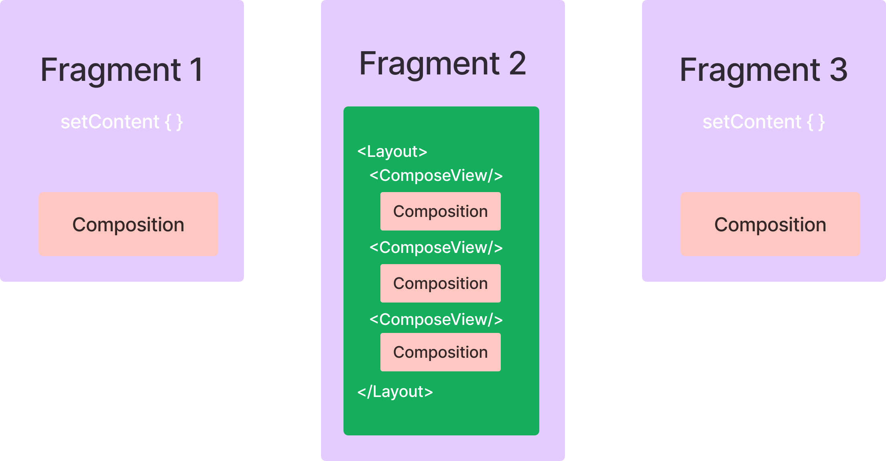
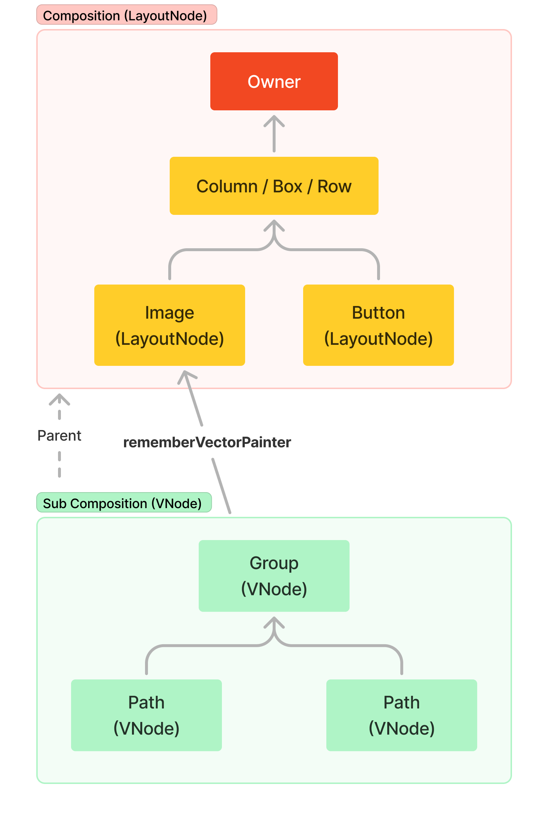
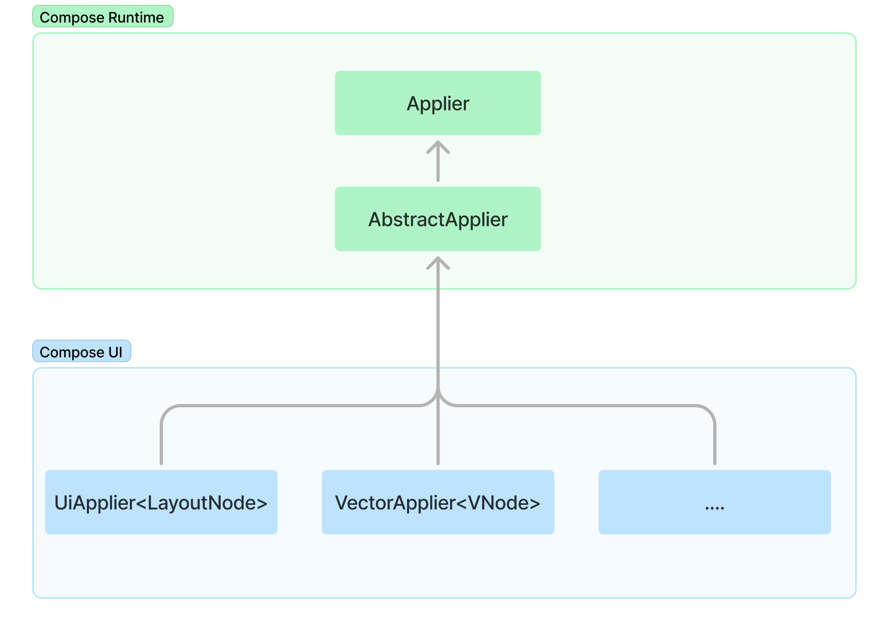
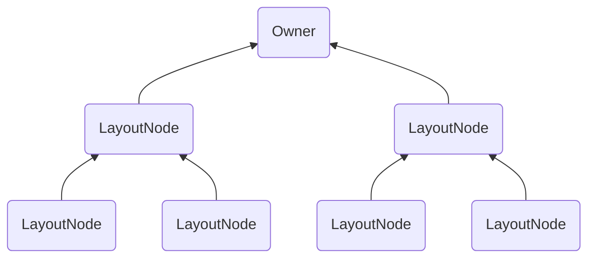
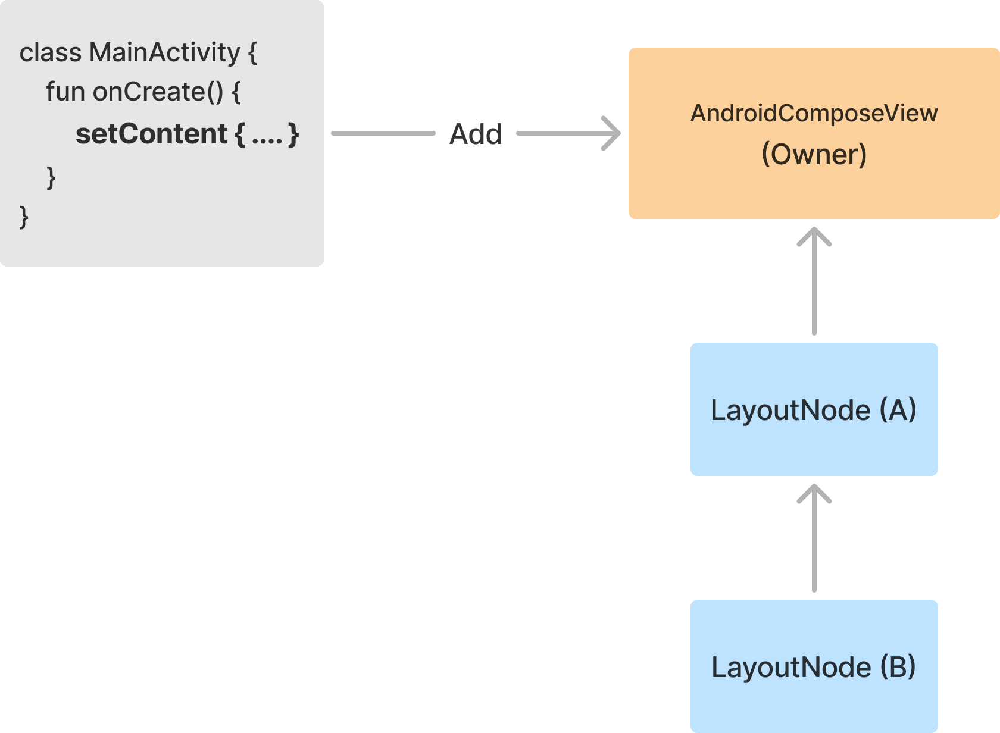
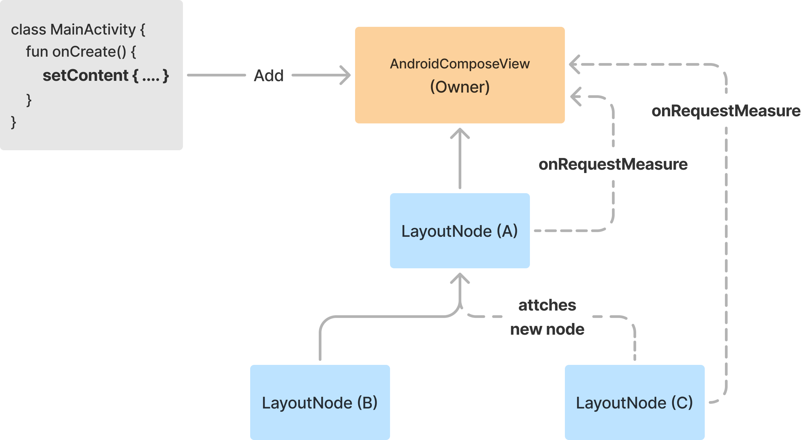
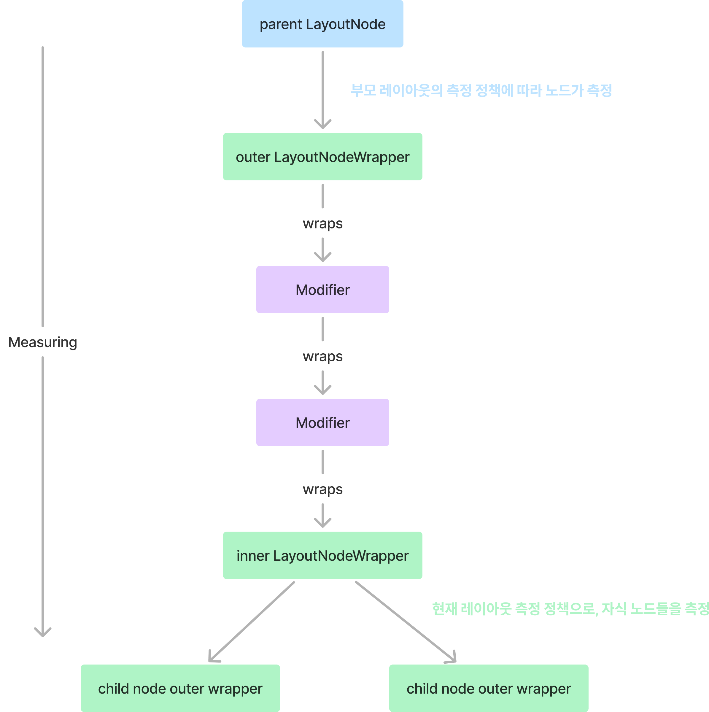
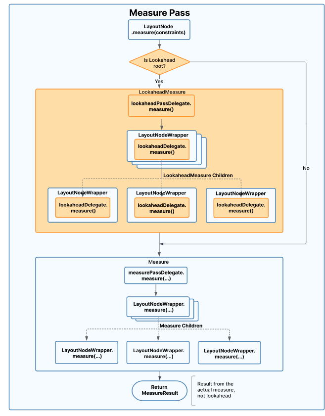
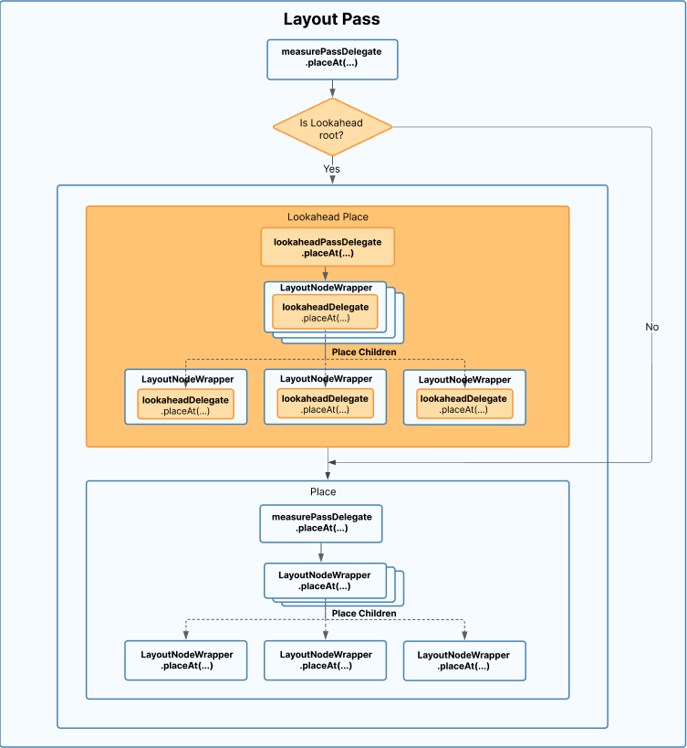

Jetpack Compose에 대해 이야기할 때, 일반적으로 컴파일러, 런타임, 그리고 경우에 따라 Compose UI까지 포함한 모든 구성 요소를 하나로 묶어 말합니다.
이전 섹션에서는 컴파일러에 대해 배우고, 그것이 런타임에서 최적화와 다양한 기능을 가능하게 하는 방법을 알아보았습니다.
그 다음으로, 런타임 자체를 공부하면서, Compose의 실제 메커니즘이 어떻게 작동하고, 그 모든 기능과 강력함이 어디에 있는지를 발견했습니다.
이제는 Compose UI, 즉 런타임을 사용하는 클라이언트 라이브러리를 살펴볼 차례입니다.

## Integrating UI with the Compose runtime

Compose UI는 Kotlin 멀티플랫폼 프레임워크로, 컴포저블을 사용해 UI를 생성할 수 있는 기본 구성 블록(building blocks)과 메커니즘을 제공합니다.
또한, 이 라이브러리에는 Android와 Desktop 플랫폼을 위한 통합 레이어를 제공하는 소스셋(source set)이 포함되어 있습니다.

> JetBrains는 Desktop 소스셋을 적극적으로 관리하며, Google은 Android와 공통 소스셋을 관리합니다.  
> Android와 Desktop 소스셋은 공통 소스셋에 의존합니다.   
> 한편, Compose for Web은 DOM을 사용하여 구축되기 때문에, 현재 Compose UI와는 별도로 유지되고 있습니다.

Compose 런타임과 UI 프레임워크를 통합할 때의 목표는 사용자가 화면에서 경험할 수 있는 '레이아웃 트리'를 구축하는 것입니다.  
이 트리는 UI를 생성하는 컴포저블을 실행하여 만들어지며, 이후에 필요에 따라 업데이트됩니다.  
이 트리에 사용되는 노드 타입은 Compose UI만이 알고 있으므로, 런타임은 이런 세부 사항에 대해 알 필요 없이 독립적으로 유지됩니다.

비록 Compose UI 자체가 이미 Kotlin 멀티플랫폼 프레임워크이지만, 현재 지원되는 노드 타입은 Android와 Desktop에 한정되어 있습니다.  
Compose for Web과 같은 다른 라이브러리는 다른 노드 타입을 사용합니다.   
이러한 제한으로 인해, 클라이언트 라이브러리가 생성하는 노드 타입은 해당 클라이언트 라이브러리에서만 알아야 합니다.  
이 때문에 런타임은 트리에서 노드를 삽입-제거-이동-교체하는 작업을 클라이언트 라이브러리에 위임합니다.

초기 컴포지션 프로세스와 이후의 재구성 과정은 레이아웃 트리를 구축하고 업데이트하는데 중요한 역할을 합니다.  
이 과정에서는 컴포저블을 실행하여, 트리에서 노드를 삽입-제거-이동-교체하는 '변경 사항'을 예약하게 됩니다.  
이 변경 사항들은 이후 `Applier`를 통해 트리의 구조에 영향을 미치는 변경 사항을 감지하고, 이를 실제 트리 변경으로 반영하여 사용자가 경험할 수 있도록 합니다.

초기 컴포지션에서는 이 변경 사항들이 모든 노드를 삽입하여 레이아웃 트리를 구축하며, 재구성에서는 트리를 업데이트합니다.  
재구성은 컴포저블의 입력 데이터(i.e : 파라미터 또는 읽어들인 가변 상태)가 변경될 때 트리거됩니다.

## Mapping scheduled changes to actual changes to the tree

컴포지션 또는 재구성 과정에서 컴포저블이 실행될 때, 변경 사항을 발행합니다.  
이 과정에서 `Composition`이라는 사이드 테이블(side table)이 사용됩니다.

이 사이드 테이블은 컴포저블의 실행으로 발행한 예약된 변경 사항(scheduled changes)을 노드 트리의 실제 변경 사항(actual changes)으로 매핑하는데 필요한 데이터를 포함하고 있습니다.

Compose UI를 사용하는 애플리케이션에서는 표현해야 하는 노드 트리의 수만큼 많은 `Composition`을 가질 수 있습니다.  
지금까지는 `Composition`이 여러 개일 수 있다는 언급이 없었기에 다소 놀라울 수 있습니다. 그러나, 실제로 `Composition`은 여러 개일 수 있습니다.

이제부터 이에 대해 더 자세히 알아보면서, 레이아웃 트리가 어떻게 구축되는지, 어떤 노드 타입이 사용되는지 빠르게 이해할 것입니다.

## Composition from the point of view of Compose UI

Android로 예시를 들면, Compose UI 라이브러리에서 런타임으로 가장 자주 진입하는 지점은 특정 화면을 구성하기 위한 `setContent`를 호출할 때입니다.

```kotlin
class MainActivity : ComponentActivity() {
    override fun onCreate(savedInstanceState: Bundle?) {
        super.onCreate(savedInstanceState)

        setContent {
            MaterialTheme {
                Text("Hello, World!")
            }
        }
    }
}
```

그러나 화면(e.g : Activity/Fragment)만이 `setContent` 호출이 발생할 수 있는 유일한 곳은 아닙니다.  
예를 들어, 하이브리드 Android 앱에서 `ComposeView`를 통해 뷰 계층 구조의 중간에서도 `setContent`를 호출할 수 있습니다:

```kotlin
ComposeView(requireContext()).apply {
    setContent {
        MaterialTheme {
            Text("Hello, World!")
        }
    }
}
```

이 예제에서는 뷰를 프로그래밍 방식으로 생성하고 있지만, 이 뷰는 앱에서 XML로 정의된 레이아웃 계층의 일부로도 포함될 수 있습니다.

`setContent`는 새로운 루트 `Composition`을 생성하고, 가능한 경우 이를 재사용합니다.  
이를 "루트" 컴포지션으로 부르는 이유는 각각이 독립적인 컴포저블 트리를 호스팅하기 때문입니다.  
이 컴포지션들은 서로 연결되지 않으며, 각 컴포지션은 표현하는 UI의 복잡성에 따라 단순하거나 복잡할 수 있습니다.

이러한 개념을 바탕으로, 앱 내에 여러 개의 노드 트리가 있고, 각각이 다른 `Composition`과 연결될 수 있다고 상상해 볼 수 있습니다.

예를 들어, 3개의 `Fragment`가 있는 Android 앱을 생각해보면(아래 그림 참조), Fragment 1과 3은 `setContent`를 호출하여 각자의 컴포저블 트리를 연결합니다.
반면, Fragment 2는 레이아웃에서 여러 개의 `ComposeView`를 선언하며 각각의 `setContent`를 호출합니다.
이 경우, 앱에는 5개의 '루트 컴포지션'이 존재하게 되며, 이들은 모두 완전히 독립적으로 작동합니다.



이러한 레이아웃 계층 중 어느 하나를 생성하기 위해, 해당하는 Composer는 컴포지션 프로세스를 실행합니다.  
이 과정에서 해당 `setcontent` 호출에 포함된 모든 컴포저블들이 실행되어 변경 사항을 발행합니다.

Compose UI에서는 이러한 변경 사항이 UI 노드의 삽입-이동-교체를 포함하며, 이는 주로 `Box`, `Column`, `LazyColumn`과 같은 일반적인 UI 구성 블록들에 의해 이루어집니다.
이러한 컴포저블들이 서로 다른 라이브러리(`foundation`, `material`)에 속하더라도, 모두 최종적으로는 `Layouts`(`compose-ui`)로 정의되며, 동일한 노드 타입인 `LayoutNode`를 내보내게 됩니다.

`LayoutNode`는 UI 블록을 나타내기에, Compose UI에서 루트 컴포지션으로 가장 자주 사용되는 노드 타입입니다.

모든 `Layout` 컴포저블은 컴포지션에 `LayoutNode`를 발행하며, 이는 `ReusableComposeNode`를 통해 이루어집니다.
(`ComposeUiNode`는 `LayoutNode`에 의해 구현된 계약(contract)임에 유의하세요):

```kotlin
@Composable
inline fun Layout(
    measurePolicy: MeasurePolicy,
    modifier: Modifier = Modifier,
    content: @Composable () -> Unit
) {
    val density = LocalDensity.current
    val layoutDirection = LocalLayoutDirection.current
    val viewConfiguration = LocalViewConfiguration.current

    // Emits a LayoutNode
    ReusableComposeNode<ComposeUiNode, Applier<Any>>(
        factory = { LayoutNode() },
        update = {
            set(measurePolicy, { this.measurePolicy = it })
            set(density, { this.density = it })
            set(layoutDirection, { this.layoutDirection = it })
            set(viewConfiguration, { this.viewConfiguration = it })
        },
        skippableUpdate = materializerOf(modifier),
        content = content
    )
}
```

위 코드는 'ReusableNode'를 컴포지션에 삽입하거나 업데이트하는 변경 사항을 발행합니다.  
이러한 과정은 개발자들이 사용하는 모든 UI 구성 블록에서 동일하게 이루어집니다.

> ReusableNode는 Compose 런타임에서의 최적화 기법입니다.  
> 노드의 키가 변경될 때, ReusableNode를 사용하면 Composer가 노드를 삭제하고 새로 만드는 대신, 그 자리에서 노드의 `content`를 재구성(update)할 수 있습니다.
> 이를 위해, 컴포지션은 새로운 `content`를 생성하는 것처럼 동작하지만, 슬롯 테이블은 재구성이 일어나는 것처럼 탐색됩니다.
> 
> 이러한 최적화는 `set` 및 `update` 연산 정보만으로 완전히 정의될 수 있는 노드, 즉 내부에 숨겨진 상태가 없는 노드에만 가능합니다.
> 예를 들어, `LayoutNode`는 이러한 조건을 충족하지만, `AndroidView`는 그렇지 않기 때문에 ReusableNode 대신 표준 `ComposeNode`를 사용합니다.

`ReusableComposeNode`는 노드를 생성하고(팩토리 함수를 통해), 이를 초기화한 다음(`update` 람다로), 노드의 모든 `content`를 래핑하는 Replaceable 그룹을 생성합니다.
이 그룹에는 나중에 식별할 수 있도록 유니크 키가 할당됩니다.   
Replaceable 그룹 내에서 `content` 람다가 호출되어 발행된 모든 노드는 이 노드의 자식이 됩니다.

`update` 블록 내의 `set` 호출들은 노드가 처음 생성되었을 때나, 해당 속성의 값이 마지막으로 기억된 이후 변경된 경우에만, 후행 람다를 실행하도록 예약됩니다.

이렇게 해서 `LayoutNode`가 애플리케이션에 존재하는 각각의 여러 컴포지션에 전달됩니다.  
이로 인해 모든 컴포지션이 `LayoutNode`만을 포함한다고 생각할 수 있지만, 이는 잘못된 생각입니다.  
Compose UI의 런타임에 전달되는 요소들을 이해할 때, 고려해야 할 다른 타입의 컴포지션과 노드들도 있습니다.

## Subcomposition from the point of view of Compose UI

컴포지션은 루트 레벨에만 존재하지 않고, 더 깊은 레벨의 컴포저블 트리에서도 생성될 수 있으며, 이때 부모 컴포지션과 연결됩니다.
Compose에서는 이를 '**서브 컴포지션**'이라고 부릅니다.

이전에 배운 것처럼, 컴포지션들은 트리 구조로 연결될 수 있습니다.  
각 컴포지션은 부모 컴포지션을 나타내는 `CompositionContext`에 대한 참조를 가지며, 이 `CompositionContext`는 해당 컴포지션의 부모 컴포지션을 의미합니다. (루트 컴포지션의 경우, 부모는 `Recomposer` 자체입니다)

이러한 구조 덕분에 런타임은 `CompositionLocal`과 무효화를 트리 전체에 걸쳐 단일 컴포지션처럼 처리하고 전파할 수 있습니다.

Compose UI에서 서브 컴포지션을 생성하는 중요한 두 가지 이유가 있습니다:

1. 일부 정보가 알려질 때까지 초기 컴포지션 프로세스를 연기하기 위함.
2. 서브 트리가 생성하는 노드의 타입을 변경하기 위함.

이 두 가지 이유에 대한 내용을 다루어 보겠습니다.

### 1. Deferring initial composition process

`SubcomposeLayout`에서 초기 컴포지션 프로세스를 연기하는 예시를 볼 수 있습니다.

`SubcomposeLayout`은 '레이아웃 단계'에서 독립적인 컴포지션을 생성하고 실행하는 `Layout`과 유사한 기능을 제공합니다.  
이를 통해 자식 컴포저블들이 해당 레이아웃에서 계산된 값에 의존할 수 있습니다.

예를 들어, `SubcomposeLayout`은 `BoxWithConstraints`에서 사용되며, 이 블록은 부모의 제약 조건(constraints)을 노출하여 콘텐츠를 그에 맞게 조정할 수 있습니다.
아래는 공식 문서에서 가져온 예제로, `BoxWithConstraints`를 사용하여 `maxHeight`에 따라 두 컴포저블 중 하나를 선택합니다.

```kotlin
BoxWithConstraints {
    val rectangleHeight = 100.dp
    
    if (maxHeight < rectangleHeight * 2) {
        Box(Modifier.size(50.dp, rectangleHeight).background(Color.Blue))
    } else {
        Column {
            Box(Modifier.size(50.dp, rectangleHeight).background(Color.Blue))
            Box(Modifier.size(50.dp, rectangleHeight).background(Color.Gray))
        }
    }
}
```

서브 컴포지션을 생성하는 주체는, 초기 컴포지션 프로세스의 실행 시점을 제어할 수 있습니다.   
즉, `SubcomposeLayout`은 초기 컴포지션 프로세스를 루트 컴포지션이 이루어질 때가 아닌, 레이아웃 단계에서 실행하도록 결정할 수 있습니다.

또한, 서브 컴포지션은 부모 컴포지션과 독립적으로 재구성을 수행할 수 있습니다.  
예를 들어, `SubcomposeLayout`에서 '레이아웃'이 발생할 때마다 람다에 전달되는 파라미터가 달라질 수 있으며, 이 경우에 서브 컴포지션에 대한 재구성이 트리거됩니다. 
그러나, 서브 컴포지션 내부에서 사용되는 상태가 변경될 경우, 초기 컴포지션이 완료된 후, 부모 컴포지션에서 재구성이 예약됩니다.

노드를 발행하는 관점에서 보면, `SubcomposeLayout`는 `LayoutNode`를 내보내므로, 서브 트리에서 사용되는 노드 타입과 부모 컴포지션에서 사용되는 노드 타입이 동일합니다.
여기에서 다음과 같은 질문이 생길 수 있습니다.

- Q : 단일 컴포지션 내에서 서로 다른 노드 타입을 지원하는 것이 가능할까?  
- A : 기술적으로는 가능하지만, 해당 `Applier`가 이를 허용하는 경우에만 가능합니다.  

결국에는 노드 타입이 무엇을 의미하는지에 따라 달라집니다.

만약 사용되는 노드 타입이 여러 서브 타입의 공통 부모라면, 서로 다른 노드 타입을 지원할 수 있습니다.  
하지만, 이 경우 `Applier`의 로직이 더 복잡해질 수 있습니다.  
실제로 Compose UI에서 사용 가능한 `Applier` 구현은 단일 노드 타입으로 고정되어 있습니다.

그럼에도 불구하고, 서브 컴포지션을 사용하면 서브 트리에서 완전히 다른 노드 타입을 지원할 수 있습니다.  
이는 앞서 언급한 서브 컴포지션의 두 번째 사용 사례입니다.

### Changing the node type in a subtree

Compose UI에는 서브 트리에서 노드 타입을 변경하는 좋은 예시가 있습니다.  
바로 벡터 그래픽을 생성하고 표시하는 컴포저블인 `rememberVectorPainter` 입니다.

벡터 컴포저블은 벡터 그래픽을 트리 구조로 모델링하기 위해 자체적인 서브 컴포지션을 생성합니다.  
벡터 컴포저블이 컴포지션될 때, 서브 컴포지션에 사용될 `VNode`라는 노드 타입을 발행합니다.  
이 `VNode`는 독립적인 경로(path) 또는 경로 그룹을 모델링하는 재귀 타입입니다.

```kotlin
@Composable
fun MenuButton(
    onMenuClick: () -> Unit
) {
    Icon(
        painter = rememberVectorPainter(image = Icons.Rounded.Menu),
        contentDescription = "Menu",
        modifier = Modifier.clickable(onClick = onMenuClick)
    )
}
```

여기서 흥미로운 점은, 일반적으로 벡터 그래픽을 표시할 때 `Image`, `Icon`과 같은 컴포저블 내에서 `VectorPainter`를 사용한다는 것입니다.
이는 벡터를 화면에 그리기 위해 사용되는데, 이 경우 외부의 컴포저블은 `Layout`이며, 따라서 해당 컴포지션에 `LayoutNode`를 내보낸다는 것을 의미합니다.

동시에, `VectorPainter`는 벡터를 위한 자체 서브 컴포지션을 생성하고, 이 서브 컴포지션은 상위 컴포지션과 연결되어 부모-자식 관계를 형성합니다.



이 설정을 통해 벡터 서브 트리(서브 컴포지션)는 `VNode`라는 노드 타입을 사용할 수 있습니다.

벡터는 서브 컴포지션을 통해 모델링되는데, 이는 벡터 컴포저블 호출(e.g : `rememberVectorPainter`) 내에서 부모 컴포지션의 `CompositionLocal`에 접근하는 것이 편리하기 때문입니다.
예를 들어, 테마 색상이나 밀도(density)와 같은 것들이 좋은 예시가 될 수 있습니다.

벡터를 위해 생성된 서브 컴포지션은 해당 `VectorPainter`가 부모 컴포지션에서 떠날 때마다 폐기됩니다.  
이는 `VectorPainter`를 포함하고 있는 컴포저블이 컴포지션에서 떠날 때마다 발생합니다.   
이후 장에서 컴포저블의 라이프사이클을 더 자세히 배우겠지만, 모든 컴포저블은 어느 시점에서 컴포지션에 들어가고, 다시 떠납니다.

이로써, 일반적인 Compose UI 애플리케이션(Android 또는 Desktop)에서 루트 컴포지션과 서브 컴포지션이 어떻게 구성되는지에 대해 더 자세히 이해했습니다.  

이제 플랫폼과의 통합 외 다른 측면, 즉 화면에 변경 사항을 반영하여 사용자에게 실제로 보여주는 것에 대해 이해할 차례입니다.

## Reflecting changes in the UI

앞서 초기 컴포지션과 재구성 프로세스를 통해 UI 노드가 어떻게 생성되고, 런타임에 전달되는지 알아봤습니다.  
이 시점에서 런타임은 Chapter3에서 배운 것처럼 자신의 역할을 수행합니다. 그러나, 이는 전체 프로세스의 일부에 불과합니다. 

생성된 모든 변경 사항을 실제 UI에 반영하여, 사용자가 이를 체험할 수 있도록 하는 통합 과정도 존재해야 합니다.  
이 프로세스는 흔히 노드 트리의 실체화(materialization)라고 불리며, 이는 클라이언트 라이브러리인 Compose UI의 책임입니다.

이전 장에서 이 개념을 간단히 소개했으니, 이번에는 더 자세히 살펴보겠습니다.

## Different types of Appliers

앞서, 런타임이 트리의 변경 사항을 최종적으로 실체화하는데 사용하는 추상화 계층으로 `Applier`를 소개했습니다.  
이 추상화는 런타임이 라이브러리가 사용되는 플랫폼에 대해 전혀 알 필요가 없도록 의존성을 역전시킵니다.

이러한 추상화 계층 덕분에 Compose UI와 같은 클라이언트 라이브러리는 자신의 `Applier` 구현을 연결할 수 있으며, 
이를 통해 플랫폼과의 통합에 사용할 노드 타입을 선택할 수 있습니다.



> 상단의 `Applier`와 `AbstractApplier`는 Compose 런타임에 속합니다.  
> 하단의 상자들은 Compose UI에서 제공하는 여러 `Applier`의 구현들을 나열한 것입니다.

`AbstractApplier`는 Compose 런타임에서 제공하는 기본 구현으로, 다양한 `Applier` 간의 로직을 공유할 수 있도록 설계되었습니다. 
이 클래스는 방문한 노드를 스택에 저장하고, 현재 방문 중인 노드에 대한 참조를 유지하여, 어떤 노드에서 작업을 수행해야 하는지를 파악합니다.

트리에서 새로운 노드를 방문할 때마다, Composer는 `applier#down(node: N)`을 호출하여 `Applier`에게 이를 알립니다.  
그러면 해당 노드는 스택에 푸시되고, `Applier`는 해당 노드에서 필요한 작업을 수행할 수 있습니다.

방문자가 부모 노드로 돌아가야 할 때마다, Composer는 `applier#up()`을 호출하며, 그 결과 마지막으로 방문한 노드가 스택에서 제거(pop)됩니다.

아주 간단한 예시를 통해 이를 이해해보겠습니다. 다음과 같은 컴포저블 트리가 있다고 가정해봅시다:

```kotlin
Column {
    Row {
        Text("Some txt")
        if (condition) {
            Text("Some conditional txt")
        }
    }
    
    if (condition) {
        Text("Some more conditional txt")
    }
}
```

`condition`이 변경될 때마다, `Applier`는 다음과 같은 작업을 수행합니다:

- `Column`에 대한 `down` 호출을 받습니다.
- 그 다음, `Row`로 이동하기 위한 또 다른 `down` 호출을 받습니다.
- 그 다음, `condition`에 따른 선택적인 자식 `Text`의 삭제(또는 삽입) 작업을 수행합니다.
- 이후, 부모(`Column`)로 돌아가기 위한 `up` 호출이 이어집니다.
- 마지막으로, 두 번째 조건부 `Text`에 대한 삭제(또는 삽입) 작업을 수행합니다.

스택과 `down` 및 `up` 연산은 `AbstractApplier`에 포함되어 있어서, 자식 `Applier`들이 다루는 노드 타입에 상관없이 동일한 탐색 로직을 공유할 수 있습니다. 
이렇게 하면 노드 간의 부모-자식 관계가 자동으로 관리되므로, 특정 노드 타입은 트리를 탐색하기 위해 직접 부모-자식 관계를 유지할 필요가 없어집니다.
하지만, 필요에 따라 특정 노드 타입은 클라이언트 라이브러리의 특정 요구에 맞춰 자체적으로 부모-자식 관계를 구현할 수 있습니다.

> 위 예시는 실제로 `LayoutNode`의 사례이며, `LayoutNode`의 모든 작업이 컴포지션 중에 수행되는 것이 아니기 때문입니다.  
>
> 예를 들어, 노드를 다시 그려야 할 때, Compose UI는 부모 노드들을 따라 위로 탐색하면서, 해당 노드가 그리는 레이어를 생성한 노드를 찾아서 해당 레이어를 무효화합니다.
> 이 모든 작업은 컴포지션 외부에서 이루어지므로, Compose UI는 트리를 자유롭게 위아래로 탐색할 수 있는 수단이 필요합니다.

이 시점에서 Chapter3로 돌아가서, `Applier`가 노드 트리를 하향식(top-down), 상향식(down-top)으로 구축할 수 있는 방법을 설명했습니다.  
또한, 이러한 접근 방식이 성능에 미치는 영향과, 새 노드가 삽입될 때마다 알림을 받아야 하는 노드의 수에 따라 달라지는 성능 차이에 대해서도 설명했습니다.  
지금 약간 혼란스럽다면, Chapter3의 [Performance when building the node tree](Chapter%203%20%3A%20The%20Compose%20runtime.md#performance-when-building-the-node-tree) 섹션을 다시 읽어보는 것을 추천합니다.

이 내용을 다시 언급하는 이유는 Compose UI에서 노드 트리를 구축할 때 사용하는 두 가지 전략의 실제 예시가 존재하기 때문입니다.  
이들은 라이브러리에서 사용되는 두 가지 `Applier` 타입에 의해 구현됩니다.

Compose UI는 Android 플랫폼과 Compose 런타임을 통합하기 위해 두 가지 `AbstractApplier` 구현을 제공합니다:

- `UiApplier`
  - 대부분의 Android UI를 렌더링하는데 사용됩니다.
  - 노드 타입을 `LayoutNode`로 고정하여, 트리 내의 모든 레이아웃을 실체화합니다.
- `VectorApplier`
  - 벡터 그래픽을 렌더링하는데 사용됩니다.
  - 노드 타입을 `VNode`로 고정하여, 벡터 그래픽을 표현하고 실체화합니다.

> 현재 Android에서 제공되는 구현체는 이 두 가지뿐이지만, 특정 플랫폼에서 사용할 수 있는 구현체의 수는 곶어된 것이 아닙니다.  
> 앞으로 기존 노드 트리와는 다른 노드 트리를 표현해야 하는 필요성이 있다면, Compose UI에 더 많은 구현체가 추가될 수 있습니다.

방문하는 노드의 타입에 따라 다른 `Applier` 구현이 사용됩니다.  
예를 들어, 루트 컴포지션에 `LayoutNode`가 사용되고, 서브 컴포지션이 `VNode`가 사용된다면, 두 `Applier`가 모두 사용되어 전체 UI 트리를 실체화합니다.

두 `Applier`가 노드 트리를 구축하는데 사용하는 전략을 간단히 살펴보겠습니다.

`UiApplier`는 노드를 상향식으로 삽입하며, 이는 새로운 노드가 트리에 들어올 때 중복 알림을 피하기 위한 것입니다.  
이해를 돕기 위해 Chapter3에서 상향식 삽입 전략 다이어그램을 다시 가져오겠습니다:


트리를 상향식으로 구축하는 방식은 먼저 A와 C를 B에 삽입한 다음, B 트리를 R에 삽입하여 트리를 완성합니다.  
이 방법은 새로운 노드가 삽입될 때마다 직접적인 부모에게만 알림을 보냅니다.  
상향식 전략은 일반적으로 중첩이 많이 발생하는 Android UI(특히, 오버드로(overdraw)가 문제가 되지 않는 Compose UI)에서, 알림을 받아야 하는 많은 상위 노드가 있을 때 특히 유용합니다.

반면에, `VectorApplier`는 트리를 하향식으로 구축하는 예시입니다.  
위에서 설명한 샘플 트리를 하향식으로 구축하려면, 먼저 B를 R에 삽입하고, 그 다음 A를 B에, 마지막으로 C를 B에 삽입합니다:


하향식 전략에서는 새로운 노드를 삽입할 때마다, 해당 노드의 모든 상위 노드들에게 알림을 보내야 합니다.  
그러나 벡터 그래픽의 경우, 어떤 노드에게도 알림을 전파할 필요가 없기에, 두 전략 모두 성능 면에서 동등하게 유효합니다.  
따라서, 하향식과 상향식 전략 중 어느 것을 선택해도 큰 차이가 없습니다.  
새로운 자식 노드가 `VNode`에 삽입될 때는 해당 노드의 리스너에게 알림을 보내지만, 자식 노드나 부모 노드에게는 알림이 전파되지 않습니다.

이제 Compose UI 라이브러리가 사용하는 두 가지 `Applier` 구현에 대해 이해했으니, 이들이 최종적으로 UI에서 변경 사항(Changes)을 어떻게 실체화하는지 알아볼 차례입니다.

## Materializing a new LayoutNode

다음은 Compose UI에서 사용되는 `UiApplier`의 단순화된 버전입니다:

```kotlin
internal class UiApplier(
    root: LayoutNode,
) : AbstractApplier<LayoutNode>(root) {
    
    override fun insertTopDown(index: Int, instance: LayoutNode) {
        // Ignored. (The tree is built bottom-up with this one).
    }
  
    override fun insertBottomUp(index: Int, instance: LayoutNode) { 
        current.insertAt(index, instance)
    }
  
    override fun remove(index: Int, count: Int) { 
        current.removeAt(index, count)
    }
  
    override fun move(from: Int, to: Int, count: Int) {
        current.move(from, to, count)
    }
  
    override fun onClear() { 
        root.removeAll()
    }

    ...
}
```

위 구현에서는 노드 타입이 `LayoutNode`로 고정되어 있으며, 트리에서 노드를 삽입, 제거 또는 이동하는 모든 작업이 현재 방문 중인 노드에 위임됩니다.  
`LayoutNode`는 스스로를 실체화하는 방법을 알고 있어서, 런타임은 이 세부 사항에 대해 알 필요가 없기에, 노드에 위임하는 방식은 합리적인 방식입니다.

`LayoutNode`는 다음과 같은 특징을 가지고 있습니다:

- 플랫폼에 의존하지 않는 순수 Kotlin 클래스로, 이런 특성으로 여러 플랫폼(Android, Desktop)에서 사용할 수 있도록 설계되었습니다.
- UI 노드를 모델링하며, 자식 노드 목록을 유지하고, 자식 노드를 삽입-제거-이동(재정렬) 하는 작업을 제공합니다.
- 트리 구조로 연결되어 있어, 각 `LayoutNode`는 부모에 대한 참조를 가지고 있고, 모두 동일한 `Owner`와 연결됩니다.

부모에 대한 참조를 가지고, 모두 동일한 `Owner`와 연결되는 요구 사항은 새로운 노드가 연결될 때마다 적용됩니다.  
아래는 이러한 계층 구조를 보여주는 다이어그램입니다:



`Owner`는 추상화된 개념으로써 플랫폼과의 통합 지점을 의미하며, 각 플랫폼이 이를 다르게 구현할 수 있습니다.  
Android에서 `Owner`는 View(`AndroidComposeView`)로 구현되며, 컴포저블 트리(`LayoutNode`)와 Android View 시스템 간의 연결을 담당합니다.  

노드가 연결, 분리, 재정렬, 재측정되거나, 어떤 방식으로든 업데이트될 때마다, `Owner`를 통해 Android `View` API를 사용하여 무효화를 트리거할 수 있습니다.
그 결과, 다음 드로우 패스(draw pass)에서 화면에 최신 변경 사항이 반영됩니다. 이러한 방식으로 화면에 변경 사항이 반영됩니다.

새로운 노드가 어떻게 삽입되고, 실체화되는지를 이해하기 위해서 `LayoutNode#insertAt` 작업을 간단히 살펴보겠습니다.

```kotlin
internal fun insertAt(
    index: Int,
    instance: LayoutNode
) {
    check(instance._foldedParent == null) {
        "Cannot insert, it already has a parent"
    }
  
    check(instance.owner == null) {
        "Cannot insert, it already has an owner"
    }
  
    instance._foldedParent = this
    _foldedChildren.add(index, instance)
    onZSortedChildrenInvalidated()
  
    instance.outerLayoutNodeWrapper.wrappedBy = innerLayoutNodeWrapper
  
    val owner = this.owner
    if (owner != null) {
        instance.attach(owner)
    }
}
```

몇 가지 안정성 검사를 통해 노드가 이미 트리에 있거나, 이미 연결되어 있는지를 확인한 후, 현재 노드가 새로 삽입되는 노드의 부모로 설정됩니다.  
이후, 새로운 노드는 새로운 부모에 의해 관리되는 자식 목록에 추가됩니다. 이와 더불어, Z 인덱스로 정렬된 자식 목록이 무효화됩니다.  

이 목록은 자식 노드들을 Z 인덱스에 따라 정렬하여, 낮은 Z 인덱스부터 순서대로 그려질 수 있도록 유지하는 역할을 합니다.  
이 목록을 무효화하면 재정렬이 이루어지게 되며, 이는 새로운 노드가 삽입된 후에 필요한 작업입니다.   
왜냐하면, Z 인덱스는 레이아웃에서 `placeable.place()` 호출 순서뿐만 아니라, `Modifier.zIndex()`를 사용하여 임의의 값으로 설정할 수 있기 때문입니다.
(이는 레거시 View가 레이아웃에서 나중에 배치되는 View 위에 표시되는 방식과 유사하며, Z 인덱스를 임의의 값으로 설정할 수 있는 기능도 제공합니다.)

그 다음으로는 `LayoutNodeWrapper`와 관련된 "outer"와 "inner"라는 할당(assignment)을 볼 수 있습니다. 

```kotlin
instance.outerLayoutNodeWrapper.wrappedBy = innerLayoutNodeWrapper
```

이것은 노드, 모디파이어, 그리고 자식들이 어떻게 측정되고 그려지는지와 관련이 있습니다.  
이 내용은 약간 복잡하기 때문에, 측정에 대한 별도의 섹션에서 자세히 설명할 예정입니다.

마지막으로, 노드를 연결할 차례입니다.  
노드를 연결한다는 것은 새로운 부모와 동일한 `Owner`를 노드에 할당하는 것을 의미합니다.

아래는 노드가 삽입될 때 호출되는 `attach` 함수의 단순화된 버전입니다: (`instance.attach(owner)`)

```kotlin
internal fun attach(owner: Owner) {
    check(_foldedParent == null || _foldedParent?.owner == owner) {
        "Attaching to a different owner than the parent's owner"
    }
    val parent = this.parent // [this] is the node being attached
    
    this.owner = owner
    
    if (outerSemantics != null) {
        owner.onSemanticsChange()
    }
    owner.onAttach(this)
    _foldedChildren.forEach { child -> 
        child.attach(owner)
    }
  
    requestRemeasure()
    parent?.requestRemeasure()
}
```


위 코드를 보면, 모든 자식 노드가 부모와 동일한 `Owner`에 할당되도록 강제하는 보호 장치(guard)가 동작하는 것을 볼 수 있습니다.  
`attach` 함수는 자식 노드들에 대해 재귀적으로 호출되기에, 이 노드에 연결된 전체 서브 트리는 최종적으로 동일한 `Owner`에 연결됩니다.  
이렇게 함으로써, 동일한 컴포저블 트리 내의 모든 노드에서 발생하는 무효화가, 동일한 `View`를 통해 처리되도록 보장하여, 모든 작업을 조정할 수 있게 됩니다.

보호 장치가 실행된 후, `Owner`가 할당됩니다.

이 시점에서, 연결 중인 노드에 시멘틱 메타데이터가 포함되어 있다면, `Owner`에게 이를 알리게 됩니다.  
이는 노드가 삽입되거나 제거될 때뿐만 아니라, 노드의 값이 업데이트되거나, 시멘틱 모디파이어가 추가되거나 제거될 때도 발생할 수 있습니다.

Android에서는 `Owner`가 접근성을 처리하는 대리자(delegate)를 가지고 있어서, 이 알림을 받아 변경 사항을 처리하고, 시멘틱 트리를 업데이트하여 Android SDK accessibility API와의 연결을 관리합니다.
Compose의 시멘틱 처리에 대한 자세한 내용은 이후 섹션에서 다루게 될 것입니다. 

> 시멘틱 트리는 접근성 서비스와 테스트 프레임워크가 UI를 검사할 수 있도록, UI를 설명하는 병렬 트리입니다.  
> 두 개의 시멘틱 트리가 병렬로 유지되지만, 이에 대한 자세한 내용은 이후 섹션에서 다룰 것입니다.

이후, 새로운 노드와 그 부모에 대한 재측정이 요청됩니다. 이는 이전에 설명한 것처럼 매우 중요한 단계로, 이 과정에서 노드가 실체화됩니다.  
재측정 요청은 `Owner`를 통해 전달되며, 필요에 따라 `View` 기본 요소(primitives)를 사용하여 `invalidate` 또는 `requestLayout`을 호출합니다.  

이러한 과정을 거쳐서, 결국 새로운 노드가 실체화되고, 화면에 변경 사항이 반영됩니다.

## Closing the circle

이제 전체 프로세스를 마무리하면, `Owner`는 `Activity`, `Fragment`, 또는 `ComposeView`에서 `setContent`가 호출되자마자 View 계층 구조에 연결됩니다. 
이 부분이 지금까지 설명에서 빠져 있던 마지막 단계입니다.

이 프로세스를 간단한 예시로 다시 한 번 요약하겠습니다.

`Activity#setContent`가 호출되어 `AndroidComposeView`가 생성되고, View 계층 구조에 연결된 상황을 가정해봅시다.  
이 예시에서는 두 개의 `LayoutNode`(루트 노드`LayoutNode(A)`와 그 자식 노드 `LayoutNode(B)`)가 있습니다: 



`Applier`가 `current.insertAt(index, instance)`를 호출하여, 새로운 노드 `LayoutNode(C)`를 삽입(실체화) 한다고 가정해봅시다.  
이로 인해 새로운 노드가 연결되고, `Owner`를 통해 자신과 부모 노드에 대해 재측정을 요청하게 됩니다.



이런 일이 발생하면 대부분의 경우, `AndroidComposeView#invalidate`가 호출됩니다.  
위 이미지처럼, 현재 노드와 부모 노드가 동시에, 동일한 View(`Owner`)를 무효화하더라도 문제되지 않습니다. 
무효화는 `View`를 더러운(dirty) 상태로 표시하는 것과 같기 때문에, 두 프레임 사이에 여러 번 무효화가 일어나도, `View`는 다음 드로잉 단계에서 한 번만 다시 그려집니다.

`View`가 그려지는 시점에는 `AndroidComposeView#dispatchDraw`가 호출되며, Compose UI는 요청된 모든 노드를 재측정하고 레이아웃 단계를 수행합니다.
만약, 이 재측정 과정에서 루트 노드의 크기가 변경되면, `AndroidComposeView#requestLayout()`이 호출되어 `onMeasure`를 다시 트리거하고, 모든 `View` 형제의 노드 크기에 영향을 줄 수 있도록 합니다.

측정과 레이아웃 단계가 끝나면, `dispatchDraw` 호출은 루트 `LayoutNode`의 `draw` 함수를 호출하게 됩니다.  
루트 `LayoutNode`는 자신을 캔버스에 그리는 방법을 알고 있으며, 또한 모든 자식 노드들의 `draw` 함수도 트리거합니다.

노드가 이미 측정 중일 때, 재측정 요청이 발생하면, 이 요청은 무시됩니다.   
마찬가지로, 노드에 대해 이미 재측정이 예약된 경우에도 동일하게 무시됩니다.

> 노드는 항상 먼저 측정되고, 그 다음 레이아웃 단계가 수행되며, 마지막으로 드로잉됩니다.

이것이 새로운 노드가 삽입/실체화되는 방식이며, 사용자가 화면에서 이를 경험할 수 있는 방법입니다.

## Materializing a change to remove nodes

하나 이상의 자식 노드를 제거하는 과정도 유사한 프로세스를 거칩니다.  

`UiApplier`는 `current.removeAt(index, count)`를 호출하여 현재 노드에서 지정된 인덱스와 개수만큼 자식 노드를 제거합니다.  
그러면 현재 노드(부모)는 제거할 자식 노드들을 마지막부터 순차적으로 제거합니다.  
각 자식 노드는 부모의 자식 목록에서 제거되고, Z 인덱스 자식 목록의 재정렬이 이루어지며, 해당 자식 노드와 그 자식들이 트리에서 분리(detach)됩니다.

이 프로세스에서 자식 노드와 그 자식들은 모두 `Owner` 참조를 `null`로 리셋되고, 부모 노드가 제거의 영향을 받아 크기가 변경될 수 있으므로, 재측정을 요청합니다.

또한, 새로운 노드를 추가할 때와 마찬가지로, 노드/노드들을 제거함으로써 시멘틱에 변경이 생기는 경우, `Owner`에게 알림을 보냅니다.

## Materializing a change to move nodes

노드를 이동하여 변경 사항을 실체화하는 것은, 자식 노드의 순서를 재정렬하는 것과 같습니다.  
`UiApplier`가 하나 이상의 자식 노드를 이동시키기 위해 `current.move(from, to, count)`를 호출하면, 순차적으로 이동될 각 자식 노드에 `removeAt`을 호출해 노드를 제거합니다.
그런 다음, 해당 노드를 새로운 위치에 다시 추가합니다. 마지막으로, 현재 노드(부모)는 재측정을 요청합니다.

## Materializing a change to clear all the nodes

모든 노드를 제거하여 변경 사항을 실체화하는 것은, 여러 노드를 제거하는 것과 동일합니다.  
마지막 자식 노드부터 시작해 모든 자식 노드를 순차적으로 분리(detach)하고, 각 자식 노드는 부모 노드에게 재측정을 요청합니다.

## Measuring in Compose UI

지금까지 재측정이 언제, 어떻게 요청되는지 이제 이해했습니다. 이제부터는 실제로 측정이 어떻게 이루어지는지 이해할 차례입니다.

모든 `LayoutNode`는 자식이 연결, 분리, 이동될 때 `Owner`를 통해 재측정을 요청할 수 있습니다.  
이때 View(`Owner`)는 더러운 상태(즉, 무효화)로 표시되며, 해당 노드는 **재측정하고 레이아웃을 조정해야 할 노드 목록에 추가됩니다.**  
이후의 드로우 패스에서 `AndroidComposeView#dispatchDraw`가 호출되면(무효화된 `ViewGroup`에서 발생하는 것처럼), 
`AndroidComposeView`는 이 목록을 순회하며, 대리자(delegate)를 통해 필요한 측정과 레이아웃 작업을 수행합니다.

재측정 및 레이아웃 재조정(remeasure and relayout)이 예약된 각 노드에 대해, 다음과 같은 3단계가 순서대로 수행됩니다:

1. 노드가 재측정이 필요한지 확인하고, 필요한 경우 재측정을 수행합니다.
2. 재측정 후, 노드가 레이아웃 재조정이 필요한지 확인하고, 필요한 경우 레이아웃 단계를 다시 수행합니다.
3. 마지막으로, 노드에 대한 연기된 측정 요청이 있는지 확인하고, 해당 노드에 대한 재측정을 스케줄합니다.  
즉, 다음 드로우 패스에서 재측정 및 레이아웃을 재조정해야 할 노드 목록에 추가하여 1단계로 돌아갑니다.  
재측정 요청은 이미 측정 중일 때 발생하면 연기되며, 측정이 완료된 후에 처리됩니다.

각 노드를 측정할 때(1단계), 측정 작업은 "outer LayoutNodeWrapper"에 위임됩니다.  
만약, 측정 결과로 인해 노드의 크기가 변경되었고, 해당 노드에 부모가 있다면, 필요에 따라 해당 부모에 대한 재측정 및 레이아웃 재조정을 요청합니다. 

`LayoutNode`를 설명할 떄, "inner"와 "outer" 래퍼에 대해 자세히 다룰 것이라고 말했었는데, 이제 이 내용을 다룰 차례입니다.  
이를 위해, 래퍼로 이동하여 측정 작업이 어떻게 이루어지는지 알아보겠습니다.

잠시 `LayoutNode#insertAt` 함수로 돌아가보겠습니다. (이 함수는 `UiApplier`가 새로운 노드를 삽입할 때 호출하는 함수입니다.)  
이 함수에서 "outer"와 "inner" `LayoutNodeWrapper`와 관련된 할당 작업이 이루어지는 것을 볼 수 있습니다:

```kotlin
internal fun insertAt(index: Int, instance: LayoutNode) {
    ...
    instance.outerLayoutNodeWrapper.wrappedBy = innerLayoutNodeWrapper
    ...
}
```

각 `LayoutNode`는 "outer"와 "inner" `LayoutNodeWrapper`를 가지고 있습니다.  

- outer LayoutNodeWrapper : 현재 노드의 측정과 드로우를 담당합니다.
- inner LayoutNodeWrapper : 자식 노드들의 측정과 드로우를 담당합니다.

위 설명은 좋은 설명이지만, 완전한 설명은 아닙니다.

실제로 노드에는 모디파이어가 적용될 수 있고, 모디파이어는 측정에 영향을 줄 수 있기 때문에, 노드를 측정할 때 모디파이어도 고려되어야 합니다.  
예를 들어, `Modifier.padding`은 자식 노드의 측정에 직접 영향을 미칩니다. 더 나아가 모디파이어는 체인된 다른 모디파이어의 크기에도 영향을 줄 수 있습니다.
실제로, `Modifier.padding(8.dp).background(Color.Red)`는 패딩이 적용된 후 남은 공간만 색이 채워집니다.

이로 인해, 모디파이어의 측정된 크기를 어딘가에 저장할 필요가 있다는 것입니다.   
하지만, **모디파이어는 상태를 가지지 않았기에(stateless)**, 상태를 유지할 래퍼(wrapper)가 필요합니다.  
이와 같은 이유로, `LayoutNode`는 "outer"와 "inner" 래퍼뿐만 아니라, 각 모디파이어에 대한 래퍼도 가지고 있습니다.  
그리고 이 모든 래퍼들은(outer, modifiers, inner) 체인으로 연결되어 항상 순서대로 적용됩니다.

> 모디파이어의 래퍼는 측정된 크기뿐만 아니라, 측정에 영향을 받을 수 있는 다른 기능들도 포함합니다.  
> 예를 들어, `Modifier.drawBehind`와 같이 모디파이어를 위한 드로우 작업을 처리하는 기능이나, 터치 판별과 관련된 기능이 포함됩니다.

모든 래퍼가 연결되는 방식은 다음과 같습니다:



1. 부모 `LayoutNode`는 자신의 `measurePolicy`를 사용하여 모든 자식 노드의 "outer 래퍼"를 측정합니다.
2. 각 자식 노드의 "outer 래퍼"는 체인에서 첫 번째 모디파이어를 래핑합니다.
3. 첫 번째 모디파이어는 두 번째 모디파이어를 래핑합니다.
4. 두 번째 모디파이어는 "inner 래퍼"를 래핑합니다. (이 노드에서는 모디파이어가 2개 있다고 가정.)
5. 다시 1단계로 돌아가서, "inner 래퍼"는 현재 노드의 `measurePolicy`를 사용하여, 자식 노드들의 "outer 래퍼"를 측정합니다.

이처럼 측정은 순서대로 이루어지며, 모디파이어도 정확하게 반영되도록 보장합니다.  
Compose 1.2부터는 `LayoutModifier`에 대해서만 이와 같은 래핑이 이루어지며, 다른 타입의 모디파이어들은 더 간단한 추상화로 래핑됩니다.  
그러나, 사용된 추상화가 다르더라도, 기본적인 접근 방식은 동일합니다.

드로우의 경우에도 동일한 방식으로 작동하지만, 
마지막 단계에서는 "inner 래퍼"가 Z 인덱스에 따라 정렬된 자식 노드 목록을 순차적으로 반복하며, 각 노드에 대해 `draw`를 호출합니다.

이제 `insertAt` 함수에서의 `LayoutNodeWrapper` 할당 부분으로 돌아가보겠습니다:

```kotlin 
instance.outerLayoutNodeWrapper.wrappedBy = innerLayoutNodeWrapper
```

현재 노드(즉, 새로운 부모)의 inner 래퍼에 의해, 삽입되는 노드의 outer 래퍼가 래핑되는 것을 볼 수 있습니다.  
이는 앞서 설명한 이미지의 첫 번째와 마지막 단계에서 나타난 과정입니다.

> 새로운 노드를 연결할 때, 모든 `LayoutNodeWrapper`가 알림을 받습니다.  
> 이들은 상태를 가지기 때문에 라이프사이클을 가지고 있으며, 초기화 및 처분 작업이 필요한 경우를 대비하여, 모든 연결 및 분리 이벤트에 대해 알림을 받습니다.
> 예를 들어, 포커스 모디파이어는 연결될 때 포커스 이벤트를 전송하는 역할을 합니다.

노드에 대한 재측정이 요청되면, 이 작업은 해당 노드의 "outer LayoutNodeWrapper"에 위임됩니다.  
그리고 이 래퍼는 부모의 측정 정책(`measurePolicy`)를 사용해 노드를 측정합니다. 이후, 체인을 따라 각 모디파이어를 재측정합니다.  
마지막으로 "inner LayoutNodeWrapper"에 도달하여, 현재 노드의 측정 정책을 사용해 자식 노드들을 재측정합니다.

노드를 측정하는 동안, 측정 람다(측정 정책) 내에서 발생하는 모든 가변 상태의 읽기(read)는 기록됩니다. 이로 인해, 해당 상태가 변경될 때마다 람다가 다시 실행됩니다.
측정 정책은 외부에서 전달되며, Compose의 상태에 의존할 수 있습니다. 스냅샷 상태를 자동으로 읽는 것은 다음 장에서 자세히 다룰 예정입니다.   

측정이 완료되면, 이전에 측정된 크기와 현재 크기를 비교하여 크기가 변경되었는지 확인하고, 변경된 경우 부모에게 재측정을 요청합니다.

이제 측정 정책에 대해 알아보겠습니다.

## Measuring policies

노드를 측정할 때, 해당 `LayoutNodeWrapper`는 노드를 발행할 때 제공된 측정 정책에 의존하며, 다음과 같은 방식으로 적용됩니다:

```kotlin
@Composable
inline fun Layout(
    measurePolicy: MeasurePolicy,
    modifier: Modifier = Modifier,
    content: @Composable () -> Unit,
) {
    ...
  ReusableComposeNode<ComposeUiNode, Applier<Any>>(
    factory = { LayoutNode() },
    update = {
        set(measurePolicy, { this.measurePolicy = it })     // Here
        ...
    },
    skippableUpdate = materializerOf(modifier),
    content = content
  )
}
```

실제로 측정 정책이 외부에서 전달되는 방식을 볼 수 있습니다.   
`LayoutNode`는 항상 동일하게 유지되며, `LayoutNode`의 측정 정책이 변경될 때마다 재측정이 요청됩니다.

Compose에서 커스텀 레이아웃을 만들어 본적이 있다면, 측정 정책이 익숙하게 보일 것입니다.  
측정 정책은 개발자들이 커스텀 레이아웃을 생성할 때 전달하는 람다입니다.  
만약, 이에 대한 경험이 없다면, [공식 문서](https://developer.android.com/jetpack/compose/layouts/custom)를 읽어보는 것을 추천합니다.

가장 심플한 측정 정책 중 하나는 아마도 `Spacer` 컴포저블에서 설정된 정책일 것입니다:

```kotlin
@Composable
fun Spacer(modifier: Modifier) {
    Layout({}, modifier) { _, constraints -> 
        with(constraints) {
            val width = if (hasFixedWidth) maxWidth else 0
            val height = if (hasFixedHeight) maxHeight else 0
          
            layout(width, height) {}
        }
    }  
}
```

후행 람다가 `MeasurePolicy#measure` 함수의 실질적인 구현이며, 측정 정책을 정의합니다.   
이 람다에서는 레이아웃 자식들의 측정 가능한 목록(위 경우에는 자식이 없기에 파라미터는 무시됨)과 각 자식이 따라야 할 '제약 조건'을 처리합니다.  
이 제약 조건들은 레이아웃의 '너비'와 '높이'를 결정하는데 사용됩니다.

- 제약 조건이 고정된 경우(즉, 정확한 너비나 높이가 설정된 경우), `Spacer`는 해당 크기로 설정됩니다.
  - 이 경우, `maxWidth`가 `minWidth`와 같고, `maxHeight`가 `minHeight`와 같습니다.
- 제약 조건이 고정되지 않은 경우, 두 치수 값은 기본값인 0으로 설정됩니다.

위 내용은 `Spacer`가 항상 부모나 모디파이어에 의해 크기 제약을 받아야 한다는 것을 의미합니다.  
또한, `Spacer`는 자식을 포함하지 않기 때문에, `content`에 맞추어 크기를 조정할 수 없다는 점에서도 이러한 방식이 합리적임을 알 수 있습니다.

더 완전한 측정 정책의 예시로 `Box` 컴포저블을 들 수 있습니다:

```kotlin
@Composable
inline fun Box(
    modifier: Modifier = Modifier,
    contentAlignment: Alignment = Alignment.TopStart,
    propagateMinConstraints: Boolean = false,
    content: @Composable BoxScope.() -> Unit
) {
    val measurePolicy = rememberBoxMeasurePolicy(contentAlignment, propagateMinConstraints)
    Layout(
      content = { BoxScopeInstance.content() },
      measurePolicy = measurePolicy, 
      modifier = modifier,
    )
}
```

이 측정 정책은 `Box`에 설정된 정렬(alignment)에 따라 달라집니다. (기본값은 `TopStart`로, 자식들을 위에서 아래로, 왼쪽에서 오른쪽으로 정렬)  
또한, 부모의 최소 제약 조건을 `content`에 적용할지 여부에 따라, 측정 정책이 달라질 수 있습니다.  
`Box`를 기반으로 하거나, 이를 포함하는 많은 컴포넌트들이 존재합니다.   
(e.g : `Crossfade`, `Switch`, `Surface`, `FloatingActionButton`, `IconButton`, `AlertDialog` 등)  
이처럼 많은 컴포넌트들이 존재하기에, 각 컴포넌트가 자신에게 필요한 제약 조건을 적용할 수 있도록, 최소 제약 조건을 전달할 수 있는 옵션이 제공됩니다.

이제 `Box`의 측정 정책에 대해 더 자세히 알아보겠습니다.

아래의 구현 세부 사항은 시간이 지남에 따라 변경될 수 있습니다.  
그럼에도 불구하고, 이는 교육적인 예제로 활용할 수 있으며, 측정 정책은 다음과 같이 시작됩니다:

```kotlin
// Box.kt
MeasurePolicy { measurables, constraints ->
    if (measurables.isEmpty()) {
        return@MeasurePolicy layout(
            constraints.minWidth,
            constraints.minHeight
        ) {}
    }    
}
```

`Box`에 자식이 전혀 없는 경우, 부모(or 모디파이어)가 설정한 최소 너비와 높이에 맞게 크기가 조정됩니다.

이후, 최소 제약 조건이 자식에게 전파되도록 설정된 경우, 부모가 설정한 제약 조건을 그대로 유지합니다.  
만약, 최소 제약 조건이 전파되지 않도록 설정된 경우, 최소 너비와 높이의 제약 조건을 제거하여, 자식들이 스스로 너비와 높이를 결정할 수 있도록 합니다:

```kotlin
// Box.kt
val contentConstraints = 
    if (propagateMinConstraints) {
        constraints
    } else {
        constraints.copy(minWidth = 0, minHeight = 0)
    }
```

제약 조건을 준비한 후, 자식이 하나만 있는지 확인합니다.  
만약, 자식이 하나만 있는 경우, 그 자식을 측정하고 배치하는 프로세스를 진행합니다:

```kotlin
// Box.kt
if (measurables.size == 1) {
    val measurable = measurables[0]
    ...
    if (!measurable.matchesParentSize) {
        boxWidth = max(constraints.minWidth, placeable.width)
        boxHeight = max(constraints.minHeight, placeable.height)
        placeable = measurable.measure(contentConstraints)
    } else {
        boxWidth = constraints.minWidth 
        boxHeight = constraints.minHeight 
        placeable = measurable.measure(
            Constraints.fixed(constraints.minWidth, constraints.minHeight)
        )
    }
  
    return@MeasurePolicy layout(boxWidth, boxHeight) {
        placeInBox(placeable, measurable, layoutDirection, boxWidth, boxHeight, alignment)
    }
}
```

여기서 흥미로운 차이점을 발견할 수 있으며, 두 가지 시나리오가 있습니다.

- `Box`를 '자식'(`content`)에 맞춰 크기를 조정하는 경우
- `Box`를 '부모'에 맞춰 크기를 조정하는 경우

자식(유일한 자식)이 부모 크기에 맞추도록 설정되지 않은 경우(e.g : `Modifier.fillMaxSize()`), `Box`는 자식의 크기에 맞춰 자신의 크기를 조정합니다.
이를 위해 먼저, 자식을 제약 조건에 따라 측정합니다. 이 과정에서 제약 조건이 적용된 상태에서 자식이 차지할 크기가 반환됩니다.  
그런 다음, `Box`는 이 크기를 사용해 자신의 크기를 결정합니다.  
`Box`의 너비는 제약 조건의 `minWidth`와 자식의 너비 중 더 큰 값으로 설정되며, 높이도 이와 마찬가지로 결정됩니다.  
결과적으로, `Box`는 자식의 크기보다 작아지지 않도록 보장됩니다.

반대로, `Box`가 부모의 크기에 맞추도록 설정된 경우, `Box`의 너비와 높이는 부모 제약 조건에서 지정된 최소 너비, 높이와 정확히 동일한 값으로 설정됩니다.

하지만, 위 시나리오는 자식이 하나만 있을 때의 경우에만 해당됩니다.  
만약에 자식이 여러명이라면, 측정 정책도 달라지기에, 부모 크기에 맞추지 않은 모든 자식을 측정하여 `Box`의 크기를 결정합니다:

```kotlin
// Box.kt
val placeables = arrayOfNulls<Placeable>(measurables.size)

val hasMatchParentSizeChildren = false
var boxWidth = constraints.minWidth
var boxHeight = constraints.minHeight

measurables.fastForEachIndexed { index, measurable -> 
    if (!measurable.matchesParentSize) {
        val placeable = measurable.measure(contentConstraints)
        placeables[index] = placeable
        boxWidth = max(boxWidth, placeable.width)
        boxHeight = max(boxHeight, placeable.height)
    } else {
        hasMatchParentSizeChildren = true
    }
}
```

위 코드의 첫 번째 줄은, 측정된 모든 자식들을 추적하기 위해 `placeables` 컬렉션을 초기화합니다.  
이 컬렉션은 이후에 자식들을 배치할 때 필요합니다.

그 다음, 모든 자식을 순회하면서 부모가 설정한 최소 제약 조건과, 해당 제약 조건 아래에서 각 자식이 차지할 너비와 높이를 비교하여, 최대 너비와 높이를 계산합니다.
이를 통해, 자식들이 최소 제약 조건을 초과하면 `Box`는 자식들에 맞춰 크기를 조정하고, 반대인 경우엔 최소 제약 조건을 크기로 설정하게 됩니다.  
이 과정에서 각 자식을 측정하며, 그 결과로 얻어진 `placeble`을 컬렉션에 추가합니다.  
부모 크기에 맞추도록 설정된 자식들은 이 과정에서 무시되며, 다음 단계에서 `Box` 크기를 측정할 때 고려됩니다.

부모 크기에 맞추도록 설정된 자식들을 측정할 때 주목해야 할 점이 있습니다.  
만약, 지금까지 계산된 `Box`의 제약 조건이 '무한'이라면, 자식들을 측정할 때 최소 제약 조건이 `0`으로 설정됩니다.  
이는 각 자식이 스스로를 얼마나 좁게 설정할지 결정할 수 있음을 의미합니다.  
이 시나리오는 `boxWidth` 또는 `boxHeight`가 무한대인 경우에만 발생할 수 있으며, 이는 부모의 제약 조건에서 최소 크기가 무한대로 설정된 경우에만 발생할 수 있습니다.
그렇지 않은 경우에는 이미 계산된 `boxWidth`와 `boxHeight`가 사용됩니다:

```kotlin
// Box.kt
if (hasMatchParentSizeChildren) {
  // The infinity check is needed for default intrinsic measurements.
    val matchParentSizeConstraints = Constraints(
        minWidth = if (boxWidth != Constraints.Infinity) boxWidth else 0,
        minHeight = if (boxHeight != Constraints.Infinity) boxHeight else 0,
        maxWidth = boxWidth,    
        maxHeight = boxHeight
    )
  
    measurables.fastForEachIndexed { index, measurable -> 
        if (measurable.matchesParentSize) {
            placeables[index] = measurable.measure(matchParentSizeConstraints)
        }
    }
}
```

위 예제를 보면, 부모 크기에 맞춰진 자식들이, 계산된 제약 조건(`matchParentSizeConstraints`)을 사용해 측정되고, 이를 `placeables` 컬렉션에 추가하는 것을 볼 수 있습니다.

측정 정책의 마지막 단계는 계산된 너비와 높이를 사용해, 레이아웃을 생성하고, 모든 자식들을 그 안에 배치하는 것입니다.

```kotlin
// Box.kt
layout(boxWidth, boxHeight) {
    measurables.forEachIndexed { index, placeable -> 
        placeable as Placeable
        val measurable = measurables[index]
        placeInBox(placeable, measurable, layoutDirection, boxWidth, boxHeight, alignment)
    }
}
```

드디어 끝났습니다. 이제 제대로 된 측정 정책을 갖추었습니다.

Compose UI에는 이 외에도 다양한 측정 정책이 존재합니다.   
모두 나열하고 설명할 수는 없지만, 위 예제를 통해서 측정 정책이 어떻게 작동하는지에 대해 더 자세히 이해할 수 있었을 것입니다.

## Intrinsic measurements

`MeasurePolicy`는 레이아웃의 인트린식 크기를 계산하는 몇 가지 메서드를 포함합니다.   

인트린식 크기 : 제약 조건이 없는 상황에서 레이아웃의 예상 크기

인트린식 측정은 자식을 실제로 측정하기 전에, 얘상되는 크기를 알아야 할 떄 유용합니다.  
예를 들어, 자식의 높이를 가장 큰 형제의 높이와 일치시키고 싶을 때가 있습니다.   
다만, 형제 자식들이 아직 측정되지 않은 측정 단계에서 어떻게 이 작업을 수행할 수 있을까요?

이를 해결하는 방법 중 하나로 서브 컴포지션을 사용할 수 있지만, 때로는 이 정도로 복잡한 방법을 사용하지 않아도 되는 경우도 있습니다.  

물론, 두 번 측정하는 방법도 생각해 볼 수 있습니다.   
하지만, Compose는 성능상의 이유로 컴포저블을 한 번만 측정하도록 제한하고 있습니다. 따라서 두 번 측정을 시도하면 예외가 발생합니다.

이러한 이유로, 인트린식 측정은 좋은 대안이 될 수 있습니다.  
이미 배운 것처럼, 모든 `LayoutNode`는 측정 정책이 할당되어 있지만, 이와 동시에 해당 측정 정책에 의존하는 '인트린식 측정 정책'도 가지고 있습니다.  
이 의존성으로 인해, 노드의 측정 정책이 변경되면, 그 노드의 인트린식 측정에 의존하는 모든 상위 요소들의 레이아웃이 다시 계산됩니다.

`LayoutNode`에 할당된 '인트린식 정책'은 다음을 계산하는 메서드를 제공합니다:

- 주어진 높이에 대한 `minIntrinsicWidth`, `maxIntrinsicWidth`
- 주어진 너비에 대한 `minIntrinsicHeight`, `maxIntrinsicHeight`

제공하는 메서드를 보면, 원하는 치수를 계산하기 위해선 항상 반대되는 치수를 제공해야 합니다.  
이는 제약 조건이 없는 상황에서 레이아웃 콘텐츠를 올바르게 그릴 수 있는 적절한 크기를 계산할 때, 라이브러리에 제공할 수 있는 유일한 단서가 한쪽의 치수뿐이기 때문입니다.
라이브러리는 이 치수를 기반으로, 다른 치수를 계산할 수 있습니다.

이 함수들의 공식 kdocs를 보면, 각 함수가 어떤 역할을 하는지 더 명확하게 이해할 수 있습니다:

- `minIntrinsicWidth` : 특정 높이가 주어졌을 때, 레이아웃의 콘텐츠를 올바르게 그려질 수 있는 최소 너비를 제공합니다.
- `minIntrinsicHeight` : 특정 너비가 주어졌을 때, 레이아웃의 콘텐츠를 올바르게 그려질 수 있는 최소 높이를 제공합니다.
- `maxIntrinsicWidth` : 특정 높이가 주어졌을 때, 최소 인트린식 높이가 감소하지 않으면서, 증가시킬 수 있는 최소 너비를 제공합니다.
- `maxIntrinsicHeight` : 특정 너비가 주어졌을 때, 최소 인트린식 너비가 감소하지 않으면서, 증가시킬 수 있는 최소 높이를 제공합니다.

인트린식을 이해하기 위해 `Modifier.width(intrinsicSize: IntrinsicSize)` (또는 이에 대응하는 height)를 예시로 살펴보겠습니다.  
이 메서드는 일반적으로 사용되는 `Modifier.width(width: Dp)`와는 다릅니다.

- `Modifier.width(width: Dp)` : 노드의 정확한 너비를 설정하는데 사용
- `Modifier.width(intrinsicSize: IntrinsicSize)` : 노드의 최소/최대 인트린식 너비와 일치하는 너비를 설정하는데 사용

아래는 이 메서드가 어떻게 구현되는지 보여줍니다:

```kotlin
// Intrinsic.kt
@Stable
fun Modifier.width(intrinsicSize : IntrinsicSize) = when (intrinsicSize) {
    IntrinsicSize.Min -> this.then(MinIntrinsicWidthModifier)
    IntrinsicSize.Max -> this.then(MaxIntrinsicWidthModifier)
}
```

위 메서드를 `Modifier.width(IntrinsicSize.Max)`와 같이 호출하면, `MaxIntrinsicWidthModifier`가 선택됩니다.  

`MaxIntrinsicWidthModifier`는 최소 인트린식 너비를 최대 인트린식 너비와 일치하도록 오버라이드하여 정확한 크기로 설정합니다.   
또한, 주어진 `maxHeight` 제약 조건에 맞춰, 최대 인트린식 너비에 맞도록 '콘텐츠 제약 조건'을 고정합니다.  
콘텐츠 제약 조건은 인트린식 모디파이어를 사용하여, 노드를 측정할 때 사용됩니다.

```kotlin
// Intrinsic.kt
private object MaxIntrinsicWidthModifier : IntrinsicSizeModifier {
    
    override fun MeasureScope.calculateContentConstraints(
        measurable: Measurable,
        constraints: Constraints
    ): Constraints {
        val width = measurable.maxIntrinsicWidth(constraints.maxHeight) 
        return Constraints.fixedWidth(width)
    }
      
    override fun IntrinsicMeasureScope.minIntrinsicWidth(
        measurable: IntrinsicMeasurable,
        height: Int
    ) = measurable.maxIntrinsicWidth(height)
}
```

여기서 이해해야 할 것은 사용자 관점에서 이 모디파이어가 어떤 영향을 미치는지입니다.  
이 모디파이어를 사용했을 때 UI가 어떻게 보일지, 또는 어떤 동작을 할지를 이해하기 위해 `DropdownMenu` 컴포저블을 살펴보겠습니다.  

아래는 `DropdownMenuContent`를 사용하여 `Column` 내에서 메뉴 항목을 표시합니다:

```kotlin
@Composable
fun DropdownMenuContent(...) {
    ...
    Column(
      modifier = modifier
        .padding(vertical = DropdownMenuVerticalPadding)
        .width(IntrinsicSize.Max)
        .verticalScroll(rememberScrollState()),
      content = content
    )
    ...
}
```

위와 같은 설정은 `Column`이 선호하는 모든 자식(메뉴 항목)들의 최대 인트린식 너비와 일치시키도록 합니다.  
이를 통해, 드롭다운 메뉴의 너비가 가장 넓은 자식의 너비와 일치하도록 강제합니다.


인트린식 측정에 대한 [공식 문서](https://developer.android.com/jetpack/compose/layouts/intrinsic-measurements)를 읽어보면, Android UI에서 인트린식이 어떻게 사용되는지에 대한 실제 사용 사례를 더 많이 볼 수 있습니다.

이제부터는 지금까지 매우 중요한 역할을 해온 레이아웃 제약 조건(`Constraints`)에 대해 자세히 살펴보겠습니다.

## Layout Constraints

레이아웃의 `Constraints`는 부모 `LayoutNode` 또는 모디파이어에서 제공될 수 있으며, 자식 레이아웃을 측정할 때 사용됩니다.

제약 조건을 설정할 때는 너비와 높이에 최소값과 최대값을 지정하여, 픽셀 단위의 범위를 설정합니다.  
측정된 레이아웃(자식)은 아래의 제약 조건 내에 들어와야 합니다.

- `minWidth <= chosenWidth <= maxWidth`
- `minHeight <= chosenHeight <= maxHeight`

대부분의 기존 레이아웃은 수정되지 않은 제약 조건을 자식에게 그대로 전달하거나, 최소 제약 조건을 완하(0으로 설정)하여 전달합니다.  
최소 제약 조건을 완하하는 방식의 예시로는 `Box`가 있으며, 이는 [측정 정책](#measuring-policies)에서 다룬 내용입니다.

아래에서는, 이를 다른 시나리오로 설명해보겠습니다:

가끔씩 부모 노드나 모디파이어는 자식에게 선호하는 크기를 물어보고 싶을 수 있습니다.  
이 경우에는 `maxWidth`나 `maxHeight`의 제약 조건에 무한대(즉, `Constraints.Infinity`)를 전달할 수 있습니다.  

자식이 가용 공간을 모두 채우도록 정의되어 있을 때, 해당 치수에 무제한(unbounded) 제약 조건을 전달하는 것은, 자식에게 원하는 크기를 스스로 결정하도록 신호를 보내는 것과 같습니다.
예를 들어, 아래와 같은 `Box`를 생각할 수 있습니다:


```kotlin
// Box filling max height.
Box(Modifier.fillMaxHeight()) {
    Text("Hello")
}
```

기본적으로, 이 `Box`는 사용 가능한 모든 높이를 채우게 됩니다. 
하지만, 이 `Box`를 `LazyColumn` 안에 넣으면, `Box`는 `content`의 크기에 맞춰 조정되어 `Text`의 높이를 가지게 됩니다.
(`LazyColumn`은 스크롤이 가능하기 때문에, 자식들에게 무한한 높이의 제약 조건이 적용됩니다.)

`Box`가 `Text`의 높이를 가지게 되는 이유는 무한한 높이의 제약 조건을 채우는 것이 아무런 의미가 없기 때문입니다.  
주요 레이아웃 컴포넌트 중에서는 이러한 조건에서 자식들이 `content`에 맞게 크기를 조정하는 것이 일반적입니다.  
하지만, 최종적으로는 레이아웃이 어떻게 정의도었는지에 따라 달라질 수 있습니다.

`LazyColumn`은 무제한(unbounded) `Constraints`를 배우기 위한 좋은 사례가 될 수 있습니다.  
`LazyColumn`은 자식 요소를 측정하기 위해, 서브 컴포지션을 사용하는 `LazyList`라는 더 일반적인 레이아웃을 기반으로 합니다.

서브 컴포지션은 사용 가능한 크기에 따라 아이템을 게으르게(lazily) 컴포즈할 때 유용합니다.  
이 경우, `LazyList`는 화면에 보이는 아이템들만 컴포즈하기 때문에, 화면 크기에 따라 아이템이 컴포즈됩니다.  
아래는 자식 요소를 측정하기 위한 제약 조건이 어떻게 생성되는지 보여줍니다:

```kotlin
// LazyMeasuredItemProvider.kt

// The main axis is not restricted
val childConstraints = Constraints(
    maxWidth = if (isVertical) constraints.maxWidth else Constraints.Infinity,
    maxHeight = if (isVertical) Constraints.Infinity else constraints.maxHeight
)
```

자식 요소를 측정할 때마다, 위 제약 조건이 적용됩니다.  
먼저, 해당 아이템의 콘텐츠가 서브 컴포즈됩니다. 이 작업은 `LazyList`의 측정 과정에서 이루어지며, `SubcomposeLayout` 덕분에 가능합니다.  
콘텐츠를 서브 컴포즈하면, 화면에 보이는 자식들에 대한 측정 가능한 목록이 생성되고, 이 목록은 생성된 `childConstraints`를 사용하여 측정됩니다.  
이 시점에서 자식 요소들은 높이 제약 조건이 무제한이기 때문에, 기본적으로 스스로가 높이를 선택할 수 있습니다. 

이에 반해, 때로는 모든 자식들에게 정확한 크기를 설정하고 싶을 때가 있습니다.  
부모나 모디파이어가 자식에게 정확한 크기를 강제하려면, `minWidth == maxWidth`, `minHeight == maxHeight`로 설정합니다.  
이렇게 하면 자식은 해당 공간에 맞춰지도록 강제됩니다.

이에 대한 예시로 `LazyVerticalGrid` 컴포저블을 들 수 있으며, 이 컴포저블은 동적으로 아이템의 수를 조정하여, 효율적으로 수직 그리드를 표시합니다.  
또한, 이 컴포저블은 `LazyColumn`이나 `LazyRow`와 매우 유사하며, 화면에 보이는 컴포저블들만 게으르게 컴포즈합니다.  

그리드의 셀 수가 고정된 경우, `LazyVerticalGrid`는 실제로 `LazyColumn`을 사용하며, 각 열에는 여러 개의 아이템을 포함하는 `ItemRow`가 렌더링됩니다. 
`ItemRow` 레이아웃은 스팬 카운트(열의 수), 열의 크기, 그리고 아이템 간의 간격에 따라서 각 자식을 고정된 너비로 측정합니다.

```kotlin
// LazyGrid.kt
val width = span * columnSize + remainderUsed + spacing * (span - 1)
measurable.measure(Constraints.fixed(width))
```

이렇게 생성된 제약 조건에서는 너비가 고정되고, 높이는 `0 ~ Infinity` 사이의 범위를 가집니다:

```kotlin
// Constraints.kt
minWidth = width,
maxWidth = width,
minHeight = 0,
maxHeight = Constraints.Infinity
```

다양한 제약 조건의 사용 사례를 더 알아보고 싶다면, 크기와 관련된 일반적인 레이아웃 모디파이어나, Compose UI 소스에서 익숙한 레이아웃의 내부를 살펴보는 것이 좋습니다.
이 과정을 통하면 측정 방식에 대한 이해가 더욱 증가할 것입니다. 

`Constraints`는 `inline` 클래스로 모델링되어 있으며, 단일 `Long` 값을 사용하여 4가지 제약 조건을 표현합니다. (i.e : `minWidth`, `minHeight`, `maxWidth`, `maxHeight`)
그리고 비트마스크를 통해 이 값에서 서로 다른 제약 조건을 읽을 수 있습니다.

## LookaheadLayout

`LookaheadLayout`는 Compose에서 측정과 레이아웃을 다루는 중요한 개념입니다. 

[링크를 통해 gif를 보면](https://x.com/doris4lt/status/1531364543305175041), 라디오 버튼을 통해 두 가지 다른 화면 상태 사이를 전환할 때, 요소들이 애니메이션을 통해 움직이는 것을 볼 수 있습니다.
클릭할 때마다 상태가 변하면서 `Row`와 `Column` 레이아웃 간에 전환되는 `SmartBox` 컴포저블을 예시로 들어보겠습니다:

```kotlin
@Composable
fun SmartBox() {
    var vertical by remember { mutableStateOf(false) }
    
    Box(
      Modifier.clickable { vertical = !vertical }
    ) { 
        if (vertical) {
            Column {
              Text("Text 1")
              Text("Text 2")
            }
        } else {
            Row {
              Text("Text 1")
              Text("Text 2")
            }
        }
    } 
}
```

이상적으로, 두 텍스트들은 완전히 동일하기 때문에, 두 상태 사이에서 텍스트들은 **공유 요소**가 되어야 합니다.  
또한, 현재 즉시 변경되는 대신에 쉽게 애니메이션 효과를 줄 수 있는 방법이 있으면 좋을 것입니다.  
애니메이션 중, 또는 그 이후에도 상태를 잃지 않으면서, 이 텍스트를 재사용할 수 있도록 `movableContentOf`을 활용하는 것도 고려할 수 있습니다.

위 예시를 좀 더 확장하면, 가변 상태에 따라, 앱 내에서 두 개의 컴포저블 화면을 전환하는 것이 될 수 있습니다.  
아래 예시는 보통의 앱은 두 개 이상의 화면이 있을 것이기에, 조금 단순할 수 있지만, 이 정도로 충분할 것입니다: 

```kotlin
@Composable
fun TvShowApp() {
    var listScreen by remember { mutableStateOf(true) }
  
    Box(
      Modifier.clickable { listScreen = !listScreen }
    ) { 
        if (listScreen) {
            CharacterList()
        } else {
            Detail()
        } 
    }
}
```

이 두 화면에도 일부 공유 요소를 포함시켜, `CharacterList` 내에서 캐릭터 이미지나 전체 캐릭터 행을 클릭할 때 애니메이션이 실행되도록 할 수 있습니다. 
이 시나리오에서의 각 서브 트리는 전체 화면을 나타내기 때문에, 단순한 텍스트 몇 개보다 훨씬 더 복잡해질 것입니다. 

전환 애니메이션을 적용하려면, 공유 요소들이 최종적으로 위치하게 될 곳과 크기를 미리 알아야 하기 때문에, 애니메이션 타겟을 직접 설정해야 할 수 있습니다. 
하지만, 이 방법은 최선의 방법이 아닙니다. 이상적으로는 Compose UI가 이러한 정보를 미리 계산하여 제공해주고, 이를 기반으로 애니메이션 타겟을 설정하는 것이 좋습니다.
이때 `LookaheadLayout`이 중요한 역할을 하게 됩니다.

`LookaheadLayout`은 직접적이거나 간접적인 자식들이 변경될 때, 이들의 새로운 측정값과 배치를 미리 계산할 수 있습니다.  
이 기능을 통해, 각 자식 요소는 자신이 속한 측정/레이아웃 단계에서 미리 계산된 값을 관찰하고, 이 값을 활용해 크기나 위치를 점진적으로 조정할 수 있습니다.  
이 과정이 애니메이션 효과를 만들어냅니다. 

위 예시에서의 공유 요소 전환의 경우, 각 공유 요소는 자신이 이동할 화면에서의 최종 크기와 위치를 미리 알고, 이를 바탕으로 애니메이션을 수행하게 됩니다. 
또 다른 예시로, 모핑 애니메이션이 있습니다.

### Yet another way of pre-calculating layouts

`LookaheadLayout`은 `SubcomposeLayout`(서브 컴포지션) 및 인트린식과 더불어 Compose에서 레이아웃을 사전에 계산하는 또 다른 방법으로 볼 수 있습니다. 
그러나, 이 세 가지 접근 방식에는 중요한 차이점이 있으며, 이를 명확히 이해하는 것이 좋습니다.

#### SubcomposeLayout

측정 시점까지 컴포지션을 지연시켜, 사용 가능한 공간을 기반으로 어떠한 노드/서브트리를 빌드할 지 결정할 수 있습니다.  
이는 사전 레이아웃(pre-layout) 보다는 조건부 컴포지션에 더 가까운 개념입니다.  

그리고 `SubcomposeLayout`은 성능 비용이 크기 때문에, 다른 시나리오에서 레이아웃을 미리 계산하는 용도로 사용하는 것은 권장되지 않습니다.
이는 단순한 측정/레이아웃 과정보다 훨씬 더 복잡하기 때문입니다.

#### Intrinsics

인트린식은 서브 컴포지션보다 훨씬 효율적이며, 내부적으로는 `LookaheadLayout`과 매우 유사하게 동작합니다.  
두 접근 방식 모두 같은 프레임 내에서 `LayoutModifiers`, `MeasurePolicy`에 의해 정의된 측정 람다를 서로 다른 제약 조건으로 호출합니다.

하지만 인트린식의 경우, 실제 측정을 수행하기 전에, 얻은 값을 바탕으로 임시적인 계산을 먼저 수행하는 역할을 합니다.  
예를 들어, 3개의 자식을 가진 행(row)의 높이를 가장 큰 자식의 높이와 일치시키려면, 
모든 자식의 인트린식 측정값을 계산한 후, 그 중 최대값을 사용하여 행의 높이를 결정해야 합니다.

#### LookaheadLayout

`LookaheadLayout`은 자동 애니메이션을 지원하기 위해, 모든 자식(직접적이거나, 간접적인 자식)의 크기와 위치를 정확하게 사전에 계산하는데 사용됩니다.
또한, 측정뿐만 아니라, 선행된 크기(lookahead size)를 기반으로 배치 계산도 수행합니다.  

`LookaheadLayout`는 트리가 변경되지 않는 한(e.g : 새로운 레이아웃 노드 추가, 모디파이어 변경 등), 불필요한 선행 측정을 피하기 위해 인트린식보다 더 적극적인 캐싱을 수행합니다.
이를 위해 `LookaheadDelegate`는 선행된 측정값과 배치 결과를 캐싱하여, 불필요한 재계산을 건너뛸 수 있습니다.

인트린식과의 차이점은, `LookaheadLayout`에서는 레이아웃이 최종적으로 선행 계산된 상태에 도달할 것이라는 암묵적인 보장이 있다는 점입니다. 
이로 인해, 사용자는 선행된 제약 조건을 임의로 조작할 수 없습니다.

### How it works

실제로, `LookaheadLayout`은 "일반적인" 측정/레이아웃 단계 이전에, 선행(lookahead)으로 측정/레이아웃 단계를 수행합니다.  
이 과정에서 미리 계산된 값들은, 이후 측정/레이아웃 단계에서 사용되어, 매 프레임마다 노드를 업데이트하는데 활용됩니다.  
이러한 '선행 패스(lookahead pass)'는 트리 구조가 변경되거나, 상태 변화로 인해 레이아웃이 변경될 때만 실행됩니다.

선행 패스가 실행될 때, 레이아웃 애니메이션은 생략되며, 측정과 레이아웃은 애니메이션이 이미 완료된 것처럼 수행됩니다.  
앞으로, 레이아웃 애니메이션의 모든 API는 설계에 따라, 선행 패스가 실행될 때 자동으로 생략되도록 업데이트될 예정입니다.  
이 기능은 `LookaheadLayout`의 직접적이거나 간접적인 모든 자식 요소에 적용될 것입니다.

미리 계산된 데이터를 활용하기 위해, `LookaheadLayout`은 `LookaheadLayoutScope` 내에서 콘텐츠 람다를 실행하고,  
자식들이 사용할 수 있는 여러 모디파이어에 접근할 수 있게 합니다:

- `Modifier.intermediateLayout`
  - 이 모디파이어가 적용된 레이아웃이 다시 '측정'될 때마다 호출됩니다.
  - 이 모디파이어는 레이아웃의 선행(미리 계산된) 크기에 접근할 수 있도록 하며, 해당 크기(타겟 크기)를 기반으로 중간(intermediate) 레이아웃을 생성하는 역할을 합니다.
- `Modifier.onPlaced`
  - 이 모디파이어가 적용된 레이아웃이 다시 '배치'될 때마다 호출됩니다. 
    이를 통해, 자식 요소는 부모를 기준으로 자신의 위치를 조정할 수 있습니다.
  - 이 모디파이어는 `LookaheadLayout`과 해당 모디파이어(즉, `LookaheadLayout`의 자식)에 대한 선행 좌표에 접근할 수 있도록 하여, 부모를 기준으로 '선행 위치'와 '현재 위치'를 계산할 수 있게 합니다.
    계산된 위치 정보들은 저장된 후, 중간 레이아웃을 생성할 때 `intermediateLayout`에서 사용되어, 레이아웃 위치를 애니메이션하는데 사용됩니다.

이 두 모디파이어는 일반적인 측정/레이아웃 단계에서 실행되므로, 람다에서 제공되는 미리 계산된 정보를 활용해 레이아웃을 타겟 값에 맞게 크기를 변경하거나 위치를 조정할 수 있습니다. 
개발자들은 이 모디파이어를 기반으로, 커스텀 모디파이러를 작성하여 맞춤형 애니메이션을 만들 수 있습니다.  

아래는 '선행 사이즈'를 기반으로, 자식의 측정 제약 조건을 애니메이션화하는 커스텀 모디파이어 예시입니다: 

```kotlin
fun Modifier.animateConstraints(
    lookaheadScope: LookaheadLayoutScope,
) = composed {
    var sizeAnimation: Animatable<IntSize, AnimationVector2D>? by remember { mutableStateOf(null) }
    
    var targetSize: IntSize? by remember { mutableStateOf(null) }
    LaunchedEffect(Unit) {
        snapshotFlow { targetSize }
            .collect { target -> 
                if (target != null && target != sizeAnimation?.targetValue) {
                    sizeAnimation?.run {
                        launch { animateTo(target) }
                    } ?: Animatable(target, IntSize.VectorConverter).let {
                        sizeAnimation = it
                    }
                }
            }
    }
  
    with(lookaheadScope) {
        this@composed.intermediateLayout { measurable, _, lookaheadSize -> 
            targetSize = lookaheadSize
            val (width, height) = sizeAnimation?.value ?: lookaheadSize
            val animatedConstraints = Constraints.fixed(width, height)
          
            val placeable = measurable.measure(animatedConstraints)
            layout(placeable.width, placeable.height) {
                placeable.place(0, 0)
            }
        }
    }
}
```
'사이즈 애니메이션'은 너비와 높이 값을 애니메이션하기 위해 생성되며, 레이아웃이 변경될 때마다 다시 시작됩니다. 
또한, 측정/레이아웃 단계(이 모디파이어가 실행될 때)에서 통제되지 않은 사이드 이펙트가 발생하지 않도록 `LaunchedEffect` 내에서 실행됩니다.

미리 계산된 `lookaheadSize`는 `intermediateLayout` 람다에서 접근할 수 있으며, 이 값이 변경되면 애니메이션이 트리거되도록 `targetSize`로 설정됩니다.

`lookaheadSize`는 자식들을 측정하는데 사용되어, 매 프레임마다 '사이즈 애니메이션' 값을 반영하여 새롭게 생성된 '고정 제약 조건'을 통해, 자식들의 크기가 점진적으로 변경되도록 합니다. 
이로 인해 시간이 지남에 따라 자연스러운 애니메이션 효과가 발생합니다.

> `intermediateLayout`의 람다는 선행 패스 동안에 생략됩니다.  
> 이는 이 모디파이어가 레이아웃이 최종 상태로 전환되기 전에, 중간 단계(선행 상태)를 생성하는데 사용되기 때문입니다.

제약 조건을 애니메이션화하는 커스텀 모디파이어를 만들고 나면, 이를 `LookaheadLayout`에서 사용할 수 있습니다.   
아래는 공식 소스에서 추출한 예시입니다:

```kotlin
LookaheadLayout(
    content = {
      var fullWidth by remember { mutableStateOf(false) } 
      
      Row(
          (if (fullWidth) Modifier.fillMaxWidth() else Modifier.width(100.dp)) 
            .height(200.dp)
            .animateConstraints(this@LookaheadLayout)     // Here
            .clickable { fullWidth = !fullWidth }) {
          
          Box(
            Modifier
              .weight(1f)
              .fillMaxHeight()
              .background(Color.Red)
          )
        
          Box(
              Modifier
                .weight(2f)
                .fillMaxHeight()
                .background(Color.Yellow)
          )
      }
    } 
) { measurables, constraints ->
    val placeables = measurables.map { it.measure(constraints) }
    val maxWidth = placeables.maxOf { it.width }
    val maxHeight = placeables.maxOf { it.height }
    layout(maxWidth, maxHeight) {
        placeables.forEach {
            it.place(0, 0)
        }
    }
}
```

가변 상태(`fullWidth`)를 사용하여 `Row`의 너비를 "전체 너비"와 "짧은 너비"로 전환할 수 있습니다.  
여기서 `Row` 레이아웃의 변경은, `animateConstraints` 커스텀 모디파이어를 통해 애니메이션 처리됩니다.

즉, 가변 상태가 전환될 때마다, `Row`의 너비가 변경되고 `animateConstraints`가 실행됩니다.  
이 결과, 새로운 선행 패스가 트리거되며, 이를 통해 애니메이션이 실행됩니다.

`LookaheadLayout`은 자식들 중 최대 너비와 최대 높이를 기준으로 크기를 측정하여, 모든 자식이 그 안에 들어가도록 합니다.  
그리고 모든 자식들은 `(0,0)` 위치에 배치됩니다.

위 예시는 레이아웃이 변경될 때마다, 자동으로 자연스러운 애니메이션을 생성합니다.  
이것이 '선행 사이즈'를 기반으로 한, 사이즈 애니메이션의 좋은 예시입니다.

---

그렇다면, 이제 '선행 위치'는 어떻게 처리되는지 살펴보겠습니다.

앞서 언급했듯이, `LookaheadLayoutScope`에서는 `Modifier.onPlaced`도 사용할 수 있습니다.  

`onPlaced` 모디파이어는 자식의 위치를 부모를 기준으로 조정하기 위해 존재합니다.  
또한, 부모를 기준으로, 레이아웃의 '선행 위치'와 '현재 위치'를 계산하는데 필요한 데이터를 제공합니다.  
그런 다음, 이러한 위치 값을 변수에 저장하고, 이후 `intermediateLayout` 호출 시 활용하여, 레이아웃을 선행 값에 맞게 재배치할 수 있습니다.

다음은 이 기능의 예시로, 레이아웃이 변경될 때마다, 수정된 레이아웃의 로컬 위치를 애니메이션화하는 예시입니다:

```kotlin
fun Modifier.animatePlacementInScope(lookaheadScope: LookaheadLayoutScope) = composed {
    var offsetAnimation: Animatable<IntOffset, AnimationVector2D>? by remember { mutableStateOf(null) }
    
    var placementOffset: IntOffset by remember { mutableStateOf(IntOffset.Zero) }
    var targetOffset : IntOffset? by remember { mutableStateOf(null) }
  
    LaunchedEffect(Unit) {
        snapshotFlow { targetOffset }
            .collect { target -> 
                if (target != null && target != offsetAnimation?.targetValue) {
                    offsetAnimation?.run {
                        launch { animateTo(target) }
                    } ?: Animatable(target, IntOffset.VectorConverter).let {
                        offsetAnimation = it
                    }
                }
            }
    }
  
    with(lookaheadScope) {
        this@composed.onPlaced { lookaheadScopeCoordinates, layoutCoordinates ->
            // the target position of this modifier in local coordinates.
            targetOffset = lookaheadScopeCoordinates
                .localLookaheadPositionOf(layoutCoordinates)
                .round()
          
            // the current position of this modifier in local coordinates.
            placementOffset = lookaheadScopeCoordinates
                .localPositionOf(layoutCoordinates, Offset.Zero)
                .round()
        }
          .intermediateLayout { measurable, constraints, _ ->
              val placeable = measurable.measure(constraints)
              layout(placeable.width, placeable.height) {
                  val (x, y) = offsetAnimation?.run { value - placementOffset }
                      ?: (targetOffset!! - placementOffset)

                  placeable.place(x, y)
              }
          }
    }
}
```

오프셋 애니메이션은 레이아웃의 위치를 애니메이션화 하는데 사용되며, 부모를 기준으로 오프셋을 애니메이션화합니다. 
또한, 측정/레이아웃 단계(이 모디파이어가 실행될 때)에서 통제되지 않은 사이드 이펙트가 발생하지 않도록 `LaunchedEffect` 내에서 실행됩니다.

`lookaheadScopeCoordinates`와 `layoutCoordinates`는 `onPlaced` 람다에서 사용되며, 다음 '선행 좌표'를 제공합니다.

- `lookaheadScopeCoordinates` : `LookaheadLayout`의 선행 좌표
- `layoutCoordinates` : 자식 레이아웃의 선행 좌표

위 선행 좌표들은 로컬 좌표에서 '현재 오프셋'과 '타겟 오프셋'을 계산하는데 사용됩니다.  
그리고 계산된 오프셋은 `intermediateLayout`에서 사용되어, 레이아웃의 위치를 업데이트합니다. (`placeable.place(x, y)` 참조)

이와 같이 커스텀 모디파이어가 준비되면 이전 예시에서 설명한것과 마찬가지로, `LookaheadLayout`의 모든 자식들이 동일하게 사용할 수 있습니다.

### Internals of Lookaheadlayout

이제 `LookaheadLayout`이 무엇이고, 어떻게 작동하는지 이해했으니, 내부 구조를 살펴볼 차례입니다.  
이를 가장 잘 이해하는 방법은 다이어그램을 통해 이해하는 것입니다.

이 다이어그램에는 측정/레이아웃의 초기 단계에서 발생하는 일들을 보여주며, 여기에는 선행 측정과 선행 레이아웃도 포함됩니다.

측정 패스(measure pass)부터 시작해보겠습니다.  
(이미지에 대한 출처는 다음과 같습니다: https://newsletter.jorgecastillo.dev/p/introducing-lookaheadlayout)



`LayoutNode`가 처음으로 측정되어야 하는 경우(e.g : 방금 연결된 경우), 해당 노드가 "`LookaheadLayout`의 루트" 위치에 있는지 확인합니다.
만약 루트에 있다면, '선행 측정 패스'가 먼저 실행됩니다.   
(단, 이 '선행 측정 패스'는 `LookaheadLayout` 서브트리에서만 실행됩니다.)

'선행 측정 패스'를 시작하기 위해 `LayoutNode`는 `LookaheadPassDelegate#measure()`를 호출합니다.
`LookaheadPassDelegate`는 해당 노드에 대한, 모든 선행 측정/레이아웃 요청을 처리합니다.
이 호출 과정에서 `LookaheadDelegate`는 "outer LayoutNodeWrapper"를 사용하여, 노드의 '선행 측정'을 실행합니다.   
(`LayoutNodeWrapper`는 원래 노드를 측정할 때 사용되지만, `LookaheadDelegate` 덕분에 선행 측정이 가능합니다.)

Compose에서 측정에 대해 배웠던 그래픽을 돌아보면, [`LayoutNodeWrappers`의 체인 구조와 함께 모디파이어들도 래핑되어 체인으로 연결되는 방식](#measuring-in-compose-ui)을 기억할 것입니다.
즉, "outer LayoutNodeWrapper"가 현재 노드를 측정한 후, 첫 번째 모디파이어 래퍼를 감싸고, 그 모디파이어는 다음 모디파이어 래퍼를 감싸는 방식입니다.
체인의 마지막 모디파이어는 "inner LayoutNodeWrapper"를 래핑하고, 이 래퍼는 자식 노드를 '측정'하는데 사용됩니다. (실제 측정 과정은 자식의 "outer wrapper"를 통해 이루어짐.)  
여기서도 동일한 과정이 발생하지만, "일반적인 측정"이 아닌, 각 단계에서 `LookaheadDelegate`를 통해 '선행 측정'이 실행됩니다.

루트 노드와 직접적이거나 간접적인 모든 자식들의 선행 측정이 완료되거나, 노드가 `LookaheadLayout`의 루트에 위치하지 않은 경우, "일반" 측정 패스가 실행됩니다.

"일반" 측정 프로세스는 기본적으로 이전에 설명한 것과 동일합니다. 
차이점이 있다면, 이번에는 실제 측정을 수행하는 시간이기 때문에, 모든 단계에서 `LookaheadDelegate` 대신에 `MeasurePassDelegate`가 사용됩니다.

---

이제 레이아웃 패스(layout pass)를 살펴보겠습니다.



레이아웃 패스는 측정 패스와 동일한 절차로 진행되며, 동일한 델리게이트가 사용됩니다.  
유일한 차이점은, `placeAt(...)`이 호출된다는 점입니다. 
이 호출은 '일반 레이아웃 패스'에서는 노드와 자식 노드를 배치하기 위해 사용되거나, '선행 레이아웃 패스'에서는 노드의 선행 위치를 계산하기 위해 사용됩니다.

지금까지는 처음으로 측정/레이아웃 되는 노드에 초점을 맞췄습니다.  
하지만, `LayoutNode`의 콘텐츠가 변경되어 다시 측정/레이아웃 되어야 하는 경우, 시점이 약간 다릅니다.  
측정/레이아웃 및 선행 패스의 무효화는 무효화 범위를 최소화하기 위해 최적화됩니다.  
즉, 트리의 변경으로 영향을 받지 않는 `LayoutNode`는 무효화되지 않게 됩니다.  
결과적으로, `LookaheadLayout` 서브트리의 일부만 무효화될 수 있습니다.

### Some extra bits


새로운 `LayoutNode`가 트리에 연결되면, 트리에서 가장 바깥쪽에 존재하는 `LookaheadScope`를 상속 받아, `LookaheadLayout`의 모든 직접적이거나 간접적인 자식들이 동일한 스코프를 공유할 수 있습니다.  
이는 중첩된 `LookaheadLayout`을 지원하기 때문에 가능한 일입니다.   
Compose UI는 모든 `LookaheadLayout`에 대해 단일 선행 패스를 보장합니다.

또한, `LookaheadLayout`은 `movableContentOf` 및 `movableContentWithReceiverOf`와 결합하여, 애니메이션 중에도 컴포저블의 상태를 유지할 수 있습니다.

`LookaheadLayout`은 Compose 1.3에서 릴리스되었습니다.

## Modeling modifier chains

현재 챕터에서 모디파이어에 대해 일부 다루긴 했지만, 실제로 모디파이어는 더 많은 역할을 합니다.  
Compose UI에서 모디파이어는 매우 중요한 요소이므로, 내부 구조를 조금 더 자세히 살펴보겠습니다.

`Modifier` 인터페이스는 UI 컴포저블에 데코레이션이나 행동(behavior)을 추가하는 불변 요소들의 컬렉션을 모델링합니다.
`Modifier`는 다양한 모디파이어를 체인으로 연결할 수 있는 기능(`then`), 체인을 순회하면서 값을 누적할 수 있는 폴딩 기능(`foldIn`, `foldOut`),
그리고 체인의 모디파이어들이 특정 조건을 만족하는지 검사할 수 있는 몇 가지 연산을 제공합니다.

코드에서 모디파이어 체인을 발견할 때, 이 체인은 `Modifier` 타입으로 시작되는 "Linked List"로 표현됩니다:

```kotlin
Box(
    modifier
        .then(indentMod) // Returns a new Modifier
        .fillMaxWidth() // Returns a new Modifier
        .background(color) // Returns a new Modifier
)
```

모디파이어 체인은 명시적 또는 암시적으로 연결될 수 있으며, 위 코드에서는 이 두 가지 방식이 결합되어 있습니다.  
`then`이 명시되지 않은 경우, 이는 확장 함수를 통해 모디파이어를 체인으로 연결하고 있음을 의미합니다.
이 확장 함수들은 내부적으로 `then`을 호출하고 있습니다. 두 방식 모두 동등한 결과를 제공합니다.

실제 프로젝트에서는 확장 함수가 더 자주 사용되며, 다음 예시는 확장 함수를 통해 선언된 모디파이어입니다: 

```kotlin
// Padding.kt
@Stable
fun Modifier.padding(
    horizontal: Dp = 0.dp,
    vertical: Dp = 0.dp
) = then(
        PaddingModifier(
            start = horizontal,
            top = vertical,
            end = horizontal,
            bottom = vertical,
            ...
        )
    )
```

`then`을 호출하여 두 개의 모디파이어를 체인으로 연결하면, `CombinedModifier`가 생성됩니다.  
이 `CombinedModifier`는 체인 구조를 모델링하는 방식으로, 현재의 모디파이어(outer)에 대한 참조와, 체인의 다음 모디파이어(inner)에 대한 포인터를 가집니다.
이 포인터가 가리키는 'inner' 역시 또 다른 `CombinedModifier`일 수 있습니다. 

```kotlin
// Modifier.kt
class CombinedModifier(
    private val outer: Modifier,
    private val inner: Modifier
): Modifier
```

노드들이 'outer'와 'inner'로 불리는 이유는, `CombinedModifier` 체인에서 현재 노드가 다음 노드를 래핑하는 구졸르 가지고 있기 때문입니다: 

```kotlin
CombinedModifier(
  outer = a, 
  inner = CombinedModifier(
    outer = b,
    inner = CombinedModifier(
      outer = c,
      inner = d
    )
  )
)
```

이렇게 모디파이어 체인이 모델링됩니다.  
다음은 실제로, 모디파이어가 `LayoutNode`에 어떻게 설정되는지 알아보겠습니다.

## Setting modifiers to the LayoutNode

모든 `LayoutNode`에는 `Modifier`(또는 그 체인)가 할당됩니다.  
레이아웃을 선언할 떄, Compose UI는 `update` 람다라는 파라미터를 전달합니다:

```kotlin
// Layout.kt
@Composable
inline fun Layout(
    measurePolicy: MeasurePolicy,
    modifier: Modifier = Modifier,
) {
    val density = LocalDensity.current
    val layoutDirection = LocalLayoutDirection.current
    val viewConfiguration = LocalViewConfiguration.current
  
    val materialized = currentComposer.materialize(modifier)
  
    ReusableComposeNode<ComposeUiNode, Applier<Any>>(
        factory = { LayoutNode() },
        update = {
            set(measurePolicy, { this.measurePolicy = it })
            set(density, { this.density = it })
            set(layoutDirection, { this.layoutDirection = it })
            set(viewConfiguration, { this.viewConfiguration = it })
            set(materialized, { this.modifier = it })
        }
    )
}
```

`factory`를 통해 노드가 생성되면, `update` 람다가 호출되어 `LayoutNode`의 상태를 초기화하거나 업데이트합니다.  
이 과정에서 측정 정책(measuring policy), 밀도(density), 레이아웃 방향(layout direction), 뷰 구성(view configuration) 등 다양한 속성들이 설정되고, 모디파이어도 설정됩니다.

또한, 마지막 줄에서 "실체화된" 모디파이어 체인이 `LayoutNode`에 설정되는 것을 볼 수 있습니다:

```kotlin
set(materialized, { this.modifier = it })
```

그렇다면, "실체화된" 모디파이어란 무엇이냐?  
바로 몇 줄위에서 모디파이어가 "실체화"되는 지점을 찾을 수 있는데, 이는 노드를 발행하기 전에 이루어집니다:

```kotlin
val materialized = currentComposer.materialize(modifier)
```

여기서 `modifier` 파라미터는 싱글 모디파이어일 수 있고, 여러 모디파이어가 연결된 체인일 수 있습니다.  
만약 `Layout`에 전달된 모든 모디파이어가 "표준" 모디파이어라면, 이 함수는 이들을 그대로 반환하여, 추가적인 처리 없이 `LayoutNode`에 설정합니다. 
이렇게 "표준" 또는 "일반" 모디파이어가 설정됩니다. 

여기서 의문점은 "표준" 모디파이어가 무엇인가? 입니다.  
이 말을 다르게 받아들이면, Compose UI에서는 다른 타입의 모디파이어도 존재함을 의미합니다.

바로 "Composed" 모디파이어가 이에 해당합니다.  
이전 섹션에서 모디파이어는 상태가 없기에 상태를 유지하기 위해서 래핑되어야 한다고 언급했습니다.  
이 개념은 "표준" 모디파이어에 해당됩니다. 

반면, Composed 모디파이어는 상태를 가지는 특별한 타입으로 컴포지션이 필요한 경우에 사용됩니다.  
예를 들어, 모디파이어 로직에서 어떤 값을 `remember`해야 하거나, 모디파이어가 `CompositionLocal`에서 값을 읽어야 하는 경우가 있습니다.
이러한 작업들은 컴포지션 컨텍스트에서 모디파이어 람다를 실행하지 않으면 불가능합니다.

Composed 모디파이어는 수정하려는 각 요소마다 개별적으로 컴포즈됩니다.  
레이아웃에 여러 개의 Composed 모디파이어가 모디파이어 체인의 일부로 전달될 경우, 이 모디파이어들은 먼저 `factory` 컴포저블 함수를 통해 컴포즈된 후에야 `LayoutNode`에 할당됩니다:  

```kotlin
// ComposedModifier.kt
private open class ComposeModifier(
    inspectorInfo: InspectorValueInfo.() -> Unit,
    val factory: @Composable Modifier.() -> Modifier,
) : Modifier.Element, InspectorValueInfo(inspectorInfo)
```

`factory` 컴포저블 람다를 먼저 실행해야 하는 이유는 `LayoutNode`가 Composed 모디파이어를 처리하는 방법을 모르기 때문입니다.  
따라서, Composed 모디파이어는 일반 모디파이어로 변환된 후에야 `LayoutNode`에 할당될 수 있습니다.

`factory` 람다는 노드가 사용될 때마다 컴포지션 컨텍스트에서 실행되며, 이를 통해 블록 내의 다른 컴포저블에 접근할 수 있게 됩니다.  
또한, `factory` 람다는 Composed 모디파이어를 작성하는데 사용됩니다. 

이해를 돕기 위해 `clickable` 모디파이어를 예로 들어보면, 
`Modifier.composed()` 확장 함수를 사용하여 상태를 가지는(Composed) 모디파이어가 생성되는 것을 볼 수 있습니다:

```kotlin
// Clickable.kt
fun Modifier.clickable(
    interactionSource: MutableInteractionSource,
    indication: Indication?,
    enabled: Boolean = true,
    onClick: () -> Unit,
    ...
) = composed(
    factory = {
        val onClickState = rememberUpdatedState(onClick)
        val pressedInteraction = remember { mutableStateOf<PressInteraction.Press?>(null) }

        ...
        val isClickableInScrollableContainer = remember { mutableStateOf(true) }
        val delayPressInteraction = rememberUpdatedState { 
            isClickableInScrollableContainer.value || isRootInScrollableContainer()
        }
        val gesture = Modifier.pointerInput(interactionSource, enabled) { ... }

        Modifier
            .then(... adds more extra modifiers)
            .genericClickableWithoutGesture(
                gestureModifiers = gesture,
                ...
            )
    },
    inspectorInfo = ...append info about the modifier for dev tooling
)
```

블록 내에서 상태를 `remember`하려면 컴포지션이 필요하기 떄문에, Composed 모디파이어가 사용됩니다.

`clickable` 모디파이어 외에도 `focusable`, `scroll`, `swipeable`, `border`, `selectable`, `pointerInput`, `draggable`, `toggleable` 등 다양한 Composed 모디파이어가 존재합니다.
이러한 모디파이어들에 대해 더 알아보려면, 소스 코드를 검토하고 `Modifier.composed()` 확장 함수의 사용법을 찾아보는 것이 좋습니다.

Compose UI는 특정한 목적을 위해 임시로 `LayoutNode`를 생성해야 할 때가 있으며, 이때 모디파이어를 설정하는 기회로 활용하기도 합니다.  
예를 들어, `Owner`의 루트 `LayoutNode`(e.g : `AndroidComposeView`)가 대표적인 예시입니다:

```kotlin
// AndroidComposeView.android.kt
override val root = LayoutNode().also {
    it.measurePolicy = RootMeasurePolicy
    it.modifier = Modifier
      .then(semanticsModifier)
      .then(_focusManager.modifier)
      .then(keyInputModifier)
    it.density = density
}
```

`AndroidComposeView`가 루트 `LayoutNode`를 연결할 떄, 이 기회를 활용하여 측정 정책, 밀도, 접근성을 위한 몇 가지 모디파이어를 설정합니다. 
이러한 모디파이어들은 시맨틱 트리의 기본 구성을 적용하고, 접근성을 위한 포커스 관리자, 키 입력 처리를 담당하는 관리자를 설정합니다.

## How LayoutNode ingests new modifiers

모디파이어(또는 모디파이어 체인)가 `LayoutNode`에 설정될 때, 현재 노드에 이미 설정된 모든 모디파이어는 캐시에 저장됩니다.  
이 캐시는 새로운 모디파이어 체인이 설정될 때, 재사용할 수 있는 모디파이어를 찾는데 사용됩니다. 모디파이어 인스턴스가 일치하는 경우, 해당 모디파이어는 재사용됩니다.

캐시된 모든 모디파이어는 재사용 불가능한 상태로 초기화됩니다. 그런 다음, 노드는 새로운 모디파이어 체인을 처음부터 순차적으로 처리합니다.  
이 과정은 `Modifier#foldIn` 함수, 즉 `Modifier`의 폴딩 기능 중 하나를 통해 이루어집니다.

각 모디파이어는 캐시 안에 동일한 모디파이어가 있는지 확인하고, 발견되면 해당 모디파이어를 재사용 가능하다고 표시합니다.  
만약, 캐시된 모디파이어에 부모가 있다면, 계층 구조를 따라 올라가 해당 모디파이어와 그 상위 모든 모디파이어를 재사용 가능하다고 표시합니다.  
이렇게 하면, 캐시된 모디파이어의 초기 사전 처리(pre-processing)가 완료되어 다음 단계로 넘어갈 준비가 완료됩니다.

이후, `LayoutNode`는 outer `LayoutNodeWrapper`를 리빌드합니다.  
outer 래퍼는 체인의 첫 번째 모디파이어를 래핑하고, 첫 번째 모디파이어는 두 번째 모디파이어를 래핑하는 방식으로 진행됩니다.  
여기서 outer 래퍼는 새로운 모디파이어 체인을 설정하기 때문에, 리빌드 되어야 합니다.


outer 래퍼를 리빌드하기 위해, 새로운 모디파이어 체인을 다시 폴드 처리하지만, 이번에는 `Modifier#foldOut` 함수를 통해 반대 방향으로, 즉 끝에서부터 처음으로 진행합니다.
이 과정의 목표는 새로운 모디파이어들을 위한 `LayoutNodeWrapper` 체인을 쌓는 것입니다. 

끝에서부터 시작하기 위해, 폴딩의 초기값은 `innerLayoutNodeWrapper`가 됩니다. (다이어그램에서 가장 아래쪽에 위치)  
그런 다음, 이 `LayoutNode`에 설정된 모든 모디파이어를 거쳐 위로 올라갑니다.

각 모디파이어를 처리할 때, 먼저 캐시를 확인하여 재사용 가능한지를 판단합니다.  
재사용할 수 있는 경우, 이를 체인에 연결하고 캐시에서 제거합니다.   
재사용할 수 없는 경우, 해당 모디파이어 타입에 맞는 `LayoutNodeWrapper`를 사용하여 모디파이어를 래핑한 후 체인에 연결합니다.
`LayoutNodeWrapper`는 다양한 타입이 있으며, 각 타입은 모디파이어 특성에 맞는 기능을 제공합니다.

폴딩이 처음(i.e : `outerLayoutNoeWrapper`)에 도달하면, outer 래퍼는 부모 노드의 inner 래퍼로 할당됩니다.  
이는 다이어그램의 맨위에서 확인할 수 있으며, 이렇게 새로운 래퍼 체인의 빌드 프로세스가 완료됩니다.

다음 단계는 캐시에 남아 있는 모든 모디파이어를 분리합니다.  
이들은 재사용되지 않을 모디파이어들로, 분리 후 새로운 래퍼들에 대해 `attach()`가 호출됩니다.  
이후, 캐시를 비우고 모든 모디파이어가 다시 그려질 수 있도록, 모디파이어들을 무효화합니다. 

마지막 단계는 필요에 따라 부모 노드의 재측정을 요청하는 것입니다. 

## Drawing the node tree

측정과 레이아웃에 대해 많은 이야기를 했지만, 드로잉에 대해서는 조금만 다루었습니다.  
드로잉 과정에서도 `LayoutNodeWrapper` 체인을 따라, 현재 노드가 먼저 그려지고, 그 다음에 모디파이어들이 순서대로 그려집니다.  
마지막으로 자식 노드들이 그려지며, 이 프로세스는 전체 노드 계층 구조가 그려질 때까지 반복됩니다.

이제 이 단계들을 더 자세히 살펴보겠습니다.

Android 시스템에서는 측정과 레이아웃이 완료된 후에, 드로우 패스가 진행됩니다.  
드로우의 매 주기마다, 시스템은 `View` 또는 `ViewGroup`의 `draw` 메서드를 호출하여 드로잉 작업을 수행합니다. 

이 과정은 Compose에서도 마찬가지입니다.   
`LayoutNode`가 재측정을 요청하면, 해당 노드는 '더티' 상태로 표시되며, 다음 드로우 패스에서 `Owner`(`AndroidComposeView`와 같은 `ViewGroup`)가 모든 더티 노드를 재측정하고 재배치한 후, 드로잉 작업을 수행합니다.
이러한 작업은 Android `ViewGroup`이 자식들을 드로우하는 `dispatchDraw` 함수에서 이루어집니다.

`Owner`의 예시로 `AndroidComposeView`를 들어 보겠습니다.   
드로잉 직전에, `AndroidComposeView`는 계층 구조의 모든 `LayoutNode`의 드로잉 레이어를 무효화합니다.  
이 무효화는 해당 노드가 다시 드로잉해야 한다는 것을 의미하며, 여기에는 드로잉에 사용될 수 있는 모든 모디파이어 래퍼도 포함됩니다.  
노드의 드로잉 레이어가 무효화될 때마다, 먼저 해당 노드가 이미 드로우 되고 있는지 확인합니다.

드로잉 프로세스는 루트 `LayoutNode`에서 시작되며, `root.draw(canvas)` 메서드를 호출하여 이루어집니다.  
이 메서드 호출은 노드의 `outerLayoutNodeWrapper`로 위임됩니다.

> Compose UI는 멀티 플랫폼 라이브러리이기 때문에, 여기서 사용되는 `Canvas`는 추상화된 개념입니다.  
> Android에서 드로잉 작업은 모두 네이티브 `Canvas`에 위임되며, Compose `Canvas`는 네이티브 `Canvas`보다 더 편리한 API를 제공합니다.
> 둘 사이의 주요 차이점 중 하나는 Compose `Canvas`의 함수들이 더 이상 `Paint` 객체를 인자로 받지 않는다는 점입니다.  
>
> Android에서 `Paint` 인스턴스를 할당하는 것은 비용이 많이 들며, 특히 드로잉 호출 중에는 권장되지 않습니다.  
> 이러한 이유로, 동일한 `Paint` 인스턴스를 암묵적으로 생성하고 재사용하도록 API를 다시 설계했습니다.

각 `LayoutNodeWrapper`는 자체 드로잉 레이어를 가지고 있으며, outer 래퍼도 예외는 아닙니다.  
루트 노드에 `root.draw(canvas)`를 통해 드로잉이 전달되면, outer 래퍼의 드로잉 레이어가 드로잉 작업을 수행합니다.

여기서 고려해야 할 몇 가지 시나리오가 있습니다:

1. 래퍼에 드로잉 레이어가 연관되어 있다면, 해당 레이어에 드로잉을 디스패치합니다. 이렇게 하면 해당 노드가 그려지는데, 이는 `LayoutNode` 이거나 모디파이어일 수 있습니다.
2. 래퍼에 드로잉 레이어가 연관되어 있지 않다면, 드로우 모디파이어가 있는지 확인합니다. 만약 드로우 모디파이어가 있다면, 그것들을 모두 드로우합니다.
   - 드로우 모디파이어는 래퍼에 연결 리스트 형태로 연결되며, 다른 모디파이어들과 달리 별도의 래퍼로 래핑되지 않습니다.
3. 래퍼에 드로잉 레이어나 드로우 모디파이어가 없다면, 체인의 다음 래퍼에 `draw`를 호출하여 `LayoutNode` 계층 구조 전체를 드로잉하는 프로세스를 계속 진행합니다.

1단계에서는 노드를 드로잉하는 작업이 진행됩니다.   
이를 위해 Compose UI는 `LayoutNode`에 두 가지 타입의 드로잉 레이어를 제공합니다:

- `RenderNodeLayer`
  - `RenderNode`를 드로잉하기 위한 레이어로, Compose UI 노드를 렌더링할 때 기본적으로 사용됩니다.
  - `RenderNode`는 하드웨어 기반 드로잉을 보다 효율적으로 수행할 수 있게 해주며, 한 번 그린 후 여러번 다시 드로잉을 할 때 매우 효율적으로 처리할 수 있습니다. 
- `ViewLayer`
  - `View` 기반의 구현으로, `RenderNode`를 직접 사용할 수 없을 때만 대체 수단으로 사용됩니다.
  - `ViewLayer`는 `RenderNodeLayer` 보다 더 "꼼수(hacky)" 같은 방식으로 구현되는데, `View`를 `RenderNode`처럼 다루기 위해 추가적인 작업이 필요하기 때문입니다. 하지만 `View`는 `RenderNode`보다 훨씬 더 복잡한 요소입니다.

두 구현 방식 모두 직간접적으로 `RenderNode`에 의존하기에 하드웨어 가속이 적용됩니다.  
예를 들어, 두 구현 모두 `Modifier.graphicsLayer`에 대한 유효한 구현체로 사용될 수 있습니다.

드로잉 레이어는 새로운 노드가 연결될 때마다 생성되며, 어떤 타입의 레이어를 사용할지는 `Owner`에 의해 결정됩니다.  
`AndroidComposeView`의 경우, 플랫폼 버전이 지원한다면 항상 `RenderNodeLayer`를 우선적으로 사용하고, 그렇지 않은 경우 `ViewLayer`를 사용합니다.

Android 버전마다 `RenderNode`에 대한 API가 다르게 제공되기 때문에, 실행 시점에서 `RenderNode` 시스템 구현에 드로잉 작업을 위임할 수 있도록, `RenderNodeLayer`는 Compose UI에서 제공하는 추상화에 의존합니다.

반면, `ViewLayer`는 드로잉을 수행하기 위해 `View`에 의존합니다. 
모든 `ViewLayer`에는 드로잉을 트리거하기 위해 연결된 컨테이너 `View`를 가지고 있으며, 이 컨테이너는 일반적으로 `Owner`, 즉 `ViewGroup`입니다.
`ViewLayer`가 생성되면, 자신을 컨테이너의 자식으로 할당합니다. 이는 `ViewLayer`가 실제로 `View`로 구현되었기 때문에 가능하며, 여기서 중요한 '트릭'이기도 합니다. 
레이어가 드로잉을 필요로 할 때, 컨테이너의 `ViewGroup#drawChild` 함수를 호출하여 자식(레이어)을 그리게 되며, 이로 인해 `View`의 드로잉 메커니즘을 재사용할 수 있습니다. 
앞서 언급했듯이, 이는 `RenderNode`를 직접 사용하는 것보다 더 꼼수 같은 방식인데, 이는 `View`를 사용해야 하기 때문입니다. 

드로잉 전에, `ViewLayer`는 일부 고도(elevation)가 할당된 경우, "엘리베이션 모드"를 활성화할 수 있습니다.  
이 모드는 Android `Canvas`에서 지원되며, 그림자를 렌더링하고, 서로 다른 고도에 따라 레이어를 재배치할 수 있게 해줍니다.  
또한, 이 모드가 활성화되면, 레이어는 드로잉을 진행할 수 있으며, 이후에는 비활성화됩니다.

체인에 있는 모든 래퍼가 드로우되면, `AndroidComposeView#dispatchDraw`는 더티로 표시된 모든 레이어에게 디스플레이 리스트를 업데이트하도록 알리며, 이를 통해 현재 캔버스를 업데이트합니다.

레이어는 무효화될 때 더티로 표시됩니다. 
`dispatchDraw` 함수의 시작 부분에서 모든 레이어를 무효화했기 때문에, 이는 계층 구조에 있는 모든 노드의 모든 레이어가 업데이트되도록 강제할 것입니다.

디스플레이 리스트를 업데이트하는 작업은 동일한 레이어를 무효화시킬 수 있습니다.  
이러한 경우, 해당 레이어들은 이 시점에서 더티로 표시되어, 다음 패스에서 업데이트될 수 있습니다.

때로는 `LayoutNode`를 레이어에 드로잉할 때 스냅샷 상태를 읽어옵니다. 이 상태가 변경되면, 일관성을 유지하기 위해 해당 노드를 다시 드로우시킬 필요가 있습니다.
루트에는 모든 자식 노드의 상태 변경을 관찰하여, 이에 따라 드로잉 레이어를 무효화하는 layer 모디파이어가 있습니다.
아래는 루트 노드에 설정된 측정 정책의 일부입니다:

```kotlin
override val root = LayoutNode().also {
    it.measurePolicy = RootMeasurePolicy
    it.modifier = Modifier
      .then(semanticsModifier)
      .then(_focusManager.modifier)
      .then(keyInputModifier)
    it.density = density
}
```

`RootMeasurePolicy`는 루트 노드에 연결된 자식들을 측정하고 배치합니다.  
이를 위해 `placeable.placeRelativeWithLayer(0, 0)`을 호출하여 측정된 자식을 좌표 (0, 0)에 배치하고, 그래픽 레이어를 도입합니다. 
이 그래픽 레이어는 스냅샷 상태 변경을 자동으로 관찰하고 반응할 수 있도록 구성됩니다.

## Semantics in Jetpack Compose

이 챕터를 시작하는 가장 좋은 방법은 시맨틱에 대한 간단한 요약으로 시작하는 것입니다.  
Compose에서 컴포지션은 UI를 설명하는 트리입니다. 동시에, 접근성 서비스와 테스트 프레임워크가 이해할 수 있는 방식으로 UI를 설명하는 또 다른 트리가 있습니다.
이 트리의 노드들은 자신들의 시맨틱 의미에 대한 메타데이터를 제공합니다.

이전 섹션에서 `LayoutNode` 계층의 `Owner`가 Android SDK를 통해, 시맨틱을 전달하는 접근성 델리게이트를 가지고 있다는 것을 확인했습니다.
그리고 노드가 연결되거나, 분리되거나, 시맨틱이 업데이트될 때마다, 시맨틱 트리는 `Owner`를 통해 알림을 받습니다. 

`Owner`가 생성되면(`AndroidComposeView`에서 `setContent`가 호출되면),   
몇 가지 기본 모디파이어가 설정된, 임시 루트 `LayoutNode`가 생성됩니다:

```kotlin
override val root = LayoutNode().also {
    it.measurePolicy = RootMeasurePolicy
    it.modifier = Modifier
      .then(semanticsModifier)
      .then(_focusManager.modifier)
      .then(keyInputModifier)
    it.density = density
}
```

위 예시에서의 3가지 모디파이어들은 접근성과 시맨틱에 중요한 역할을 합니다.

- semantics 모디파이어는 루트 노드에 기본 구성으로 코어 시맨틱을 추가하여, 시맨틱 트리를 구축하기 시작합니다.  
- focusManager 모디파이어는 컴포저블 계층 전체에서 포커스를 관리할 수 있도록, 루트 모디파이어를 설정합니다.   
  이 매니저는 필요에 따라, 포커스를 설정하고 이동하는 작업을 담당합니다.  
- keyInput 모디파이어는 키보드 입력을 처리하고, `KeyDown` 이벤트를 focusManager로 전달하여, 키보드를 사용해 포커스를 관리할 수 있도록 합니다.

여기서 focusManager와 keyInput 모디파이어는 접근성 측면에서 매우 중요합니다.

루트가 아닌, 다른 노드에 시맨틱을 추가하려면 `Modifier.semantics` 함수를 사용합니다.  
`Layout`에 설정되는 모든 semantics 모디파이어는 ID와 일부 시맨틱 구성을 포함하고 있습니다: 

```kotlin
fun Modifier.semantics(
    properties: (SemanticsPropertyReceiver.() -> Unit),
    mergeDescendants: Boolean = false,
): Modifier = composed(
    inspectorInfo = debugInspectorInfo {
        name = "semantics"
        this.properties["mergeDescendants"] = mergeDescendants
        this.properties["properties"] = properties
    }
) {
    val id = remember { SemanticsModifierCore.generateSemanticsId() }
    SemanticsModifierCore(id, mergeDescendants, clearAndSetSemantics = false, properties)
}
```

위 코드에서는 Compose 도구가 컴포저블 트리를 검사할 떄, 노드에 대한 세부 정보를 표시할 수 있도록, 디버그 인스펙터 정보가 암묵적으로 생성되는 것을 확인할 수 있습니다.

ID는 자동으로 생성되고 기억됩니다. 이 ID들은 `LayoutNode` 계층 내에서 고유하며(정적으로 공유됨), 순차적으로 생성됩니다.  
새로 생성된 ID는 이전 ID보다 크며, 이는 새로운 컴포지션이 ID를 처음부터 생성할 수도 있고, 이전에 생성된 다른 컴포지션의 마지막 ID 다음으로 이어서 생성할 수도 있음을 의미합니다.

마지막으로, semantics 모디파이어는 위 요소들과, 제공되는 구성 파라미터(`properties`, `mergeDescendants`)를 사용하여 생성됩니다.

현재, `semantics` 모디파이어는 블록 내에서 생성된 ID를 기억하기 위해 `remember`를 사용해야 하므로, 컴포지션 컨텍스트에 접근할 수 있는 `composed` 모디파이어로 구현되어 있습니다.
그러나, 이 구현은 변경될 예정이며, 진행 중인 리팩토링에 따라서 ID는 더 이상 `remember`를 필요로 하지 않고, 해당 `LayoutNode`를 생성할 때 자동으로 생성되도록 변경될 것입니다.
따라서 컴포지션 컨텍스트에 대한 필요성이 제거되면, `composed` 모디파이어도 제거될 것입니다.

`AndroidComposeView`가 루트 노드에 기본 semantics 모디파이어를 할당할 때, 동일한 방식으로 생성합니다:

```kotlin
private val semanticsModifier = SemanticsModifierCore(
    id = SemanticsModifierCore.generateSemanticsId(),
    mergeDescendants = false,
    clearAndSetSemantics = false,
    properties = { }
)
```

> `material` or `foundation` 라이브러리에서 제공하는 컴포저블을 사용할 때는, 시맨틱이 이미 암묵적으로 연결되어 있을 가능성이 매우 높습니다. 
> 이는 매우 유용하지만, 직접 커스텀 레이아웃을 작성할 때는 이러한 작업이 자동으로 수행되지 않습니다.
> 이런 이유로, Compose에서 새로운 레이아웃을 작성할 때마다, 우선시 되는 접근성과 테스트를 위해 시맨틱을 제공하는 것이 중요합니다.

## Notifying about semantic changes

이미 여러 번 언급했듯이, `Owner`를 통해 Android SDK에 시맨틱 변경 사항을 알립니다. 

이에 대해 좀 더 자세히 알아보겠습니다. 

AndroidX Core 라이브러리는 시스템 버전 전반에 걸쳐, 접근성 서비스 작업을 표준화하기 위해 `AccessibilityDelegateCompat`을 추가했습니다.
`LayoutNode` 계층의 `Owner`는 이 델리게이트 구현을 사용하여 접근성 변경 사항을 처리합니다.  
또한, 이 델리게이트 구현은 `Owner`로부터 얻은 Android 컨텍스트를 사용해 시스템 접근성 서비스를 활용합니다.

시맨틱 변경 사항이 `Owner`를 통해 알려지면, 네이티브 `Handler`를 통해 시맨틱 트리에서의 시맨틱 변경 사항을 확인하는 작업이 메인 루퍼에 게시됩니다.

이 작업은 다음과 같은 순서로 진행됩니다:

1. 이전 시맨틱 트리와 새로운 시맨틱 트리를 비교하여 구조적 변화를 찾습니다. 즉, 자식 노드가 추가되거나 제거된 경우를 찾습니다.
구조적 변화가 감지되면, 델리게이트는 병합된(conflated) `Channel`을 통해 변화를 알리는데, 이는 시스템 접근성 서비스를 알리는 코드가 코루틴에서 실행되는 `suspend` 함수이기 때문입니다. 
이 작업은 Compose 인스턴스의 전체 수명 동안 반복되며, 최근의 레이아웃 변경 사항을 처리하고, 100ms마다 발생한 이벤트를 묶어 접근성 프레임워크로 전송합니다.
이러한 이벤트를 생성하는데 가장 적절한 방법은 `Channel`을 사용하는 것입니다.

2. 이전 시맨틱 트리와 새로운 시맨틱 트리를 비교하여, 시맨틱 속성의 변화를 찾습니다.
시맨틱 속성이 변경되면, 네이티브 메커니즘인 `ViewParent#requestSendAccessibilityEvent`를 통해 접근성 서비스에 이를 알립니다.

3. 이전 시맨틱 노드 목록을 현재 시맨틱 노드들로 업데이트합니다.