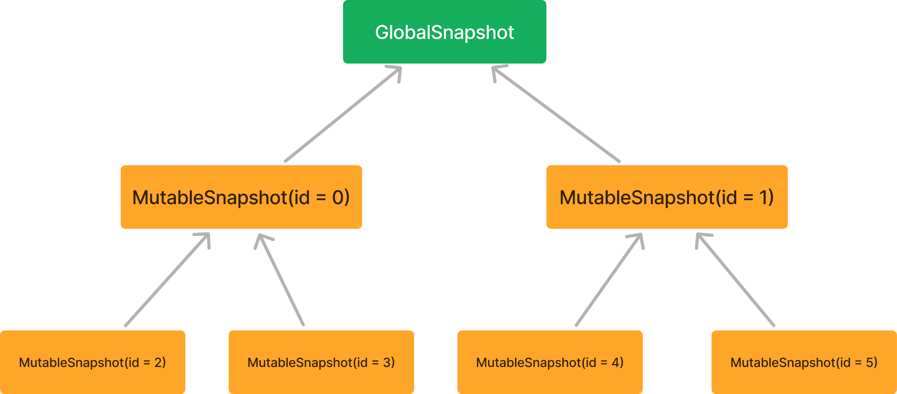
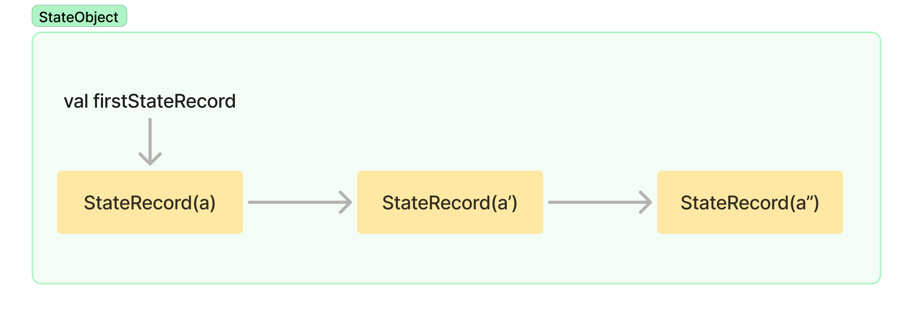
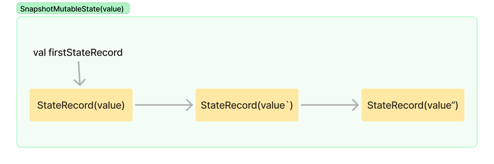
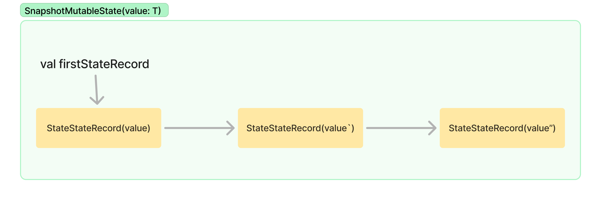
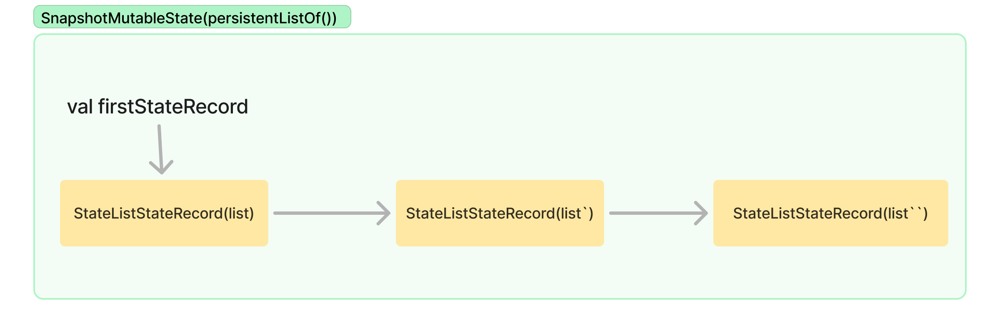

Jetpack Compose는 상태 스냅샷 시스템이라는 특별한 방식으로 상태를 표현하고 상태 변경을 전파하여, 최종적으로 리액티브 경험을 제공합니다.  
이 리액티브 모델은 컴포넌트가 입력에 따라 자동으로 리컴포즈되도록 하여, 코드를 더 강력하고 간결해지도록 도와줍니다.  
이를 통해, 과거 Android View 시스템에서 수동으로 변경 사항을 알리면서 발생했던 불필요한 보일러플레이트 코드를 피할 수 있습니다. 

이 챕터에서는 먼저 "스냅샷 상태"라는 용어를 소개하겠습니다.

## What snapshot state is

스냅샷 상태는 **변경 사항을 기억하고 관찰할 수 있는 격리된 상태**를 의미합니다. 
이는 `mutableStateOf`, `mutableStateListOf`, `mutableStateMapOf`, `derivedStateOf`, `produceState`, `collectAsState`와 같은 함수를 호출할 때 얻을 수 있는 상태를 의미합니다. 
이 함수들은 모두 특정 타입의 `State`를 반환하며, 개발자들은 이를 스냅샷 상태라고 부릅니다.

스냅샷 상태는 Compose 런타임에서 정의된 상태 스냅샷 시스템의 일부이기 때문에 이렇게 명명되었습니다.  
상태 스냅샷 시스템은 상태 변경 및 변경 사항 전파를 모델링하고 조정합니다.   
또한, 이 시스템은 독립적으로 설계되어 있어, 이론적으로는 관찰 가능한 상태를 필요로 하는 다른 라이브러리에서도 사용할 수 있습니다. 

변경 사항 전파와 관련하여, Compose 컴파일러는 모든 컴포저블 선언과 표현식을 래핑하여, **컴포저블 본문 내에서 자동으로 스냅샷 상태를 읽는 작업을 추적**합니다.
이를 통해 스냅샷 상태가 (자동으로) 관찰됩니다.
목표는 컴포저블이 참조하는 상태가 변경될 때마다, 런타임이 해당 컴포저블의 `RecomposeScope`를 무효화하여, 다음 리컴포지션에서 다시 실행되도록 하는 것입니다.

위 내용은 Compose에서 제공하는 인프라 코드로, 클라이언트 코드베이스에 필요하지 않습니다.  
Compose UI와 같은 런타임의 클라이언트는 무효화 및 상태 전파 방법, 리컴포지션 트리거 방법에 대해 전혀 알 필요가 없으며, 오직 상태와 함께 작동하는 빌딩 블록, 즉 컴포저블 함수 제공에만 집중하면 됩니다.

그러나 스냅샷 상태는 단순히 변경 사항을 자동으로 감지하여 리컴포지션을 트리거하는 것만을 의미하지 않습니다.  
"스냅샷"이라는 이름이 붙은 중요한 이유는 바로 **상태 격리** 때문입니다. 이는 동시성 관련 컨텍스트에서 적용되는 격리 수준을 의미합니다.

스레드 간에 가변 상태를 처리하는 것은 매우 복잡해질 수 있으며, 상태 무결성을 보장하기 위해서는 엄격한 조정과 동기화가 필요합니다.  
그렇지 않으면, 여러 스레드에서 동시에 상태를 읽거나 수정할 때 충돌, 발견하기 어려운 버그, 레이스 컨디션이 발생할 수 있습니다.

전통적으로, 프로그래밍 언어들은 동시성 문제를 해결하기 위해 다양한 방법을 사용해왔으며, 그 중 하나가 불변성입니다. 
불변 데이터는 생성된 후 수정할 수 없기에, 동시성 시나리오에서 안전합니다. 
또 다른 접근 방식으로는 액터 시스템(actor system)이 있으며, 이 시스템은 스레드 간 상태를 격리하여 관리합니다.
액터는 자신의 상태를 복사본으로 유지하며, 메시지를 통해 통신과 조정을 수행합니다. 
가변 상태일 경우, 프로그램의 전역 상태를 일관되게 유지하기 위해 어떤 조정이 필요합니다.
Compose 스냅샷 시스템은 액터 시스템을 기반으로 하지는 않지만, 이 접근 방식과 유사한 면이 있습니다.

Compose는 가변 상태를 활용하여 컴포저블이 상태 업데이트에 자동으로 반응할 수 있도록 합니다. 
따라서 불변 상태만으로는 이 라이브러리가 의미가 없을 것입니다. 
그러나 가변 상태를 활용하려면 여러 스레드에서 컴포지션이 가능하기에, 동시성 시나리오에서 공유 상태의 문제를 해결해야 합니다.
이를 위해 Compose는 상태 스냅샷 시스템을 도입하여 이 문제를 해결하며, 이 시스템은 상태를 격리하고 이후에 변경 사항을 전파하여 **스레드 간에 안전하게 가변 상태를 다룰 수 있도록** 합니다.

스냅샷 상태 시스템은 스레드 간 상태를 안전하게 조정하기 위해, 동시성 제어 시스템을 사용하여 모델링되었습니다.  
동시성 환경에서 공유 가변 상태를 다루는 것은 쉽지 않으며, 이는 라이브러리의 실제 사용 사례와는 무관한 일반적인 문제입니다.  
다음 섹션에서는 동시성 제어 시스템에 대해 자세히 살펴보고, Compose가 이를 어떻게 활용하는지 알아보겠습니다.

소개를 끝내기 전에, 스냅샷 상태 객체가 구현하는 `State` 인터페이스를 살펴보는 것이 유용할 수 있습니다.  
아래는 코드에서 어떻게 보이는지에 대한 예시입니다:

```kotlin
// SnapshotState.kt
@Stable
interface State<T> {
    val value: T
}
```

Jetpack Compose는 설계상 안정적인 구현만을 사용하기 때문에, 이 계약은 `@Stable`로 표시됩니다.  
다시 말해, 이 인터페이스를 구현하는 모든 클래스는 다음 사항을 **반드시** 준수해야 합니다:

- 동일한 두 `State` 인스턴스를 비교할 때, `equals` 메서드는 항상 일관된 결과를 반환해야 합니다.
- `value`와 같은 공용 프로퍼티가 변경될 때마다, 컴포지션은 반드시 이 변경 사항을 통지받아야 합니다.
- `value`와 같은 모든 공용 프로퍼티 타입은 안정적이어야 합니다.

이 프로퍼티들은 스냅샷 상태의 본질을 잘 나타냅니다.  
이후 섹션에서 스냅샷 상태 객체가 쓰여질 때마다, 컴포지션에 어떻게 알림이 전달되는지 자세히 살펴보겠습니다.  
이는 위에서 언급한 규칙 중 하나로 요구되는 사항입니다.

다음 섹션에서는 동시성 제어 시스템에 대해 알아보면서, Compose의 상태 스냅샷 시스템이 왜 이런 방식으로 모델링되었는지 쉽게 이해할 수 있을 것입니다.

## Concurrency control systems

상태 스냅샷 시스템은 동시성 제어 시스템을 기반으로 구현되었으므로, 먼저 이 개념을 알아보겠습니다.

컴퓨터 사이언스에서 "동시성 제어"는 동시에 실행되는 연산들의 올바른 결과를 보장하기 위해, 조정과 동기화를 수행함을 의미합니다.  
동시성 제어는 시스템 정확성을 보장하는 일련의 규칙으로 구성되지만, 이러한 조정은 성능에 영향을 미칠 수 있습니다.
따라서 주요 과제는 성능 저하 없이 가능한 한 효율적인 동시성 제어 방법을 설계하는 것입니다.

대부분의 DBMS에서 사용하는 트랜잭션 시스템은 동시성 제어의 대표적인 예시입니다.  
이 컨텍스트에서 동시성 제어는 동시에 실행되는 환경에서도 데이터베이스 트랜잭션이 안전하게 수행되고, 데이터 무결성이 유지되도록 보장하는 것을 목표로 합니다.
여기서 "안정성"이란 트랜잭션이 아토믹하게 수행되고, 안전하게 롤백될 수 있으며, 커밋된 트랜잭션의 효과가 손실되지 않고, 중단된 트랜잭션의 효과가 데이터베이스에 남지 않도록 보장하는 것을 의미합니다.
이러한 문제를 해결하는 것은 매우 복잡할 수 있습니다.

동시성 제어는 DBMS뿐만 아니라 프로그래밍 언어에서도 자주 사용되며, 트랜잭셔널 메모리를 구현하는데 활용됩니다.  
실제로, Compose의 상태 스냅샷 시스템도 이 개념을 따릅니다.

트랜잭셔널 메모리는 로드 및 스토어의 연산 그룹을 아토믹하게 실행할 수 있게 하여 동시성 프로그래밍을 간소화합니다.  
상태 스냅샷 시스템에서도 스냅샷 간의 상태 변경이 전파될 때, 단일 아토믹 연산으로 상태 쓰기를 처리합니다.  
이러한 방식으로 연산을 그룹화하면, 병렬 시스템/프로세스에서 공유 데이터를 동시에 읽고 쓰는 과정을 더 쉽게 조정할 수 있으며, 아토믹한 변경 사항을 쉽게 중단하거나, 되돌리거나, 재현할 수 있습니다.
즉, 프로그램 상태의 모든 버전을 재현할 수 있는 변경 사항의 이력을 보유할 수 있습니다.

동시성 제어 시스템은 다음과 같은 여러 카테고리로 나뉩니다:

### Optimistic

옵티미스틱 방식은 읽기와 쓰기를 차단하지 않고, 이들이 안전하다고 가정합니다.  
그러나, 트랜잭션이 커밋될 때 요구되는 규칙을 위반할 가능성이 있다면 트랜잭션을 중단하고, 중단된 트랜잭션은 즉시 재실행됩니다.  
이 과정에서 오버헤드가 발생할 수 있지만, 중단된 트랜잭션의 수가 많지 않은 경우에는 효과적인 전략이 될 수 있습니다.

### Pessimistic 

페시미스틱 방식은 트랜잭션이 규칙을 위반할 가능성이 있는 경우, 그 가능성이 사라질 때까지 해당 트랜잭션을 차단합니다.


### Semi-optimistic

세미 옵티미스틱 방식은 다른 두 방식의 혼합한 하이브리드 솔루션입니다.  
일부 상황에서는 작업을 차단하고, 다른 상황에서는 옵티미스틱하게 처리하되, 커밋 시 충돌이 발생하면 중단합니다.

---

각 카테고리의 성능은 평균 트랜잭션 완료율(처리량), 요구되는 병렬성 수준, 데드락 발생 가능성 등 다양한 요인에 따라 달라질 수 있습니다.  
특히, 옵티미스틱이 아닌 카테고리는 데드락에 걸릴 가능성이 높으며, 
이 문제는 보통 진행이 멈춘(stalled) 트랜잭션을 중단하고, 다른 트랜잭션을 진행시킨 후, 중단된 트랜잭션을 가능한 빨리 재시작함으로써 해결됩니다.

Compose는 동시성 제어 시스템으로 옵티미스틱 방식을 사용합니다.   
상태 업데이트 충돌은 변경 사항이 전파될 때만 보고되며, 이 충돌은 자동으로 병합되거나, 병합이 불가능한 경우에는 변경 사항이 취소됩니다. 
(이에 대한 자세한 내용은 이후에 다룰 예정입니다.)

Compose의 동시성 제어 시스템은 DBMS에서 사용되는 것보다 간단하며, 시스템의 정확성을 유지하는데 중점을 두고 있습니다.  
데이터베이스 트랜잭션에서 흔히 볼 수 있는 복구 가능성, 내구성, 분산성, 복제성 같은 기능은 Compose 상태 스냅샷 시스템에서는 지원되지 않습니다. ("ACID"의 "D"는 포함되지 않습니다.)  
그러나, Compose 스냅샷은 메모리 내에서, 그리고 프로세스 내에서만 동작하며, 아토믹하고, 일관되며, 격리된 상태를 유지합니다.

앞서 언급한 다양한 동시성 제어 카테고리(옵티미스틱, 페시미스틱, 세미-옵티미스틱)와 함께, 추가적으로 사용할 수 있는 타입들이 있습니다.   
그 중 하나가 다중 버전 동시성 제어(MVCC)이며, Compose는 상태 스냅샷 시스템을 구현하기 위해 MVCC 방식을 사용합니다.  
이 시스템은 데이터베이스 객체가 수정될 때마다 새로운 버전을 생성하여 동시성과 성능을 향상시킵니다. 
또한, 객체의 다양한 최신 버전을 읽을 수 있게 해줍니다.

이제 MVCC 시스템에 대해 자세히 설명하고, 이 시스템의 목적에 대해 알아보겠습니다.

## Multiversion concurrency control (MCC or MVCC)

Compose의 전역 상태는 여러 컴포지션에서 공유되며, 이는 곧 **스레드**에서도 공유된다는 것을 의미합니다.  
컴포저블은 병렬로 실행될 수 있어야 하며, 이로 인해 스냅샷 상태를 동시에 읽거나 수정할 수 있어야 합니다.  
즉, 병렬로 리컴포지션이 가능하기에 상태 격리가 필요합니다.

동시성 제어의 주요 속성 중 하나는 **격리성**입니다. 이 속성은 데이터를 동시에 접근하는 시나리오에서 정확성을 보장합니다.  
격리성을 달성하는 가장 간단한 방법은 쓰기 작업이 완료될 때까지 모든 읽기 작업을 차단하는 것이지만, 이는 성능 면에서 매우 좋지 않을 수 있습니다.
MVCC(그리고 Compose)는 이러한 문제를 더 효과적으로 해결합니다.

격리성을 달성하기 위해, MVCC는 데이터 **여러 복사본**(스냅샷)을 유지합니다.  
이를 통해 각 스레드는 특정 시점에서 격리된 상태의 스냅샷을 사용할 수 있으며, 이는 상태의 다양한 **버전**("다중 버전)으로 이해할 수 있습니다.
한 스레드에서 수행된 수정 사항은 해당 스레드의 변경 작업이 모두 완료되고, 이 변경 사항이 다른 스레드로 전파될 때까지, 다른 스레드에서는 알 수 없습니다.

> 동시성 제어 시스템에서는 이 기술을 "스냅샷 격리"라고 하며, 각 "트랜잭션"(이 경우 스냅샷)이 어떤 버전을 볼 수 있는지를 결정하는 '격리 레벨'로 정의됩니다.

MVCC는 불변성을 활용하여, 데이터를 수정할 때마다 원본을 변경하는 대신 새로운 데이터 복사본을 생성합니다.  
이로 인해, 메모리에는 **동일한 데이터의 여러 버전**이 저장되며, 이는 객체의 모든 변경 사항에 대한 이력을 제공하는 것과 같습니다.  
Compose에서는 이러한 복사본을 "상태 기록(state records)"라고 하며, 이후 섹션에서 자세히 다루겠습니다.

MVCC의 또 다른 특징은 **특정 시점의 일관된 뷰**를 생성한다는 점입니다. 이 뷰는 특정 시점의 백업 파일처럼, 모든 객체 참조를 일관성 있게 유지합니다.
MVCC에서는 주로 트랜잭션 ID를 통해 이 일관성을 보장하며, 모든 읽기 작업은 참조할 ID를 결정하여 어떤 버전의 상태를 사용할지 결정합니다.
Compose에서도 이와 같은 방식으로 동작합니다. **각 스냅샷에는 고유한 ID가 할당**되며, 이 ID는 단조롭게 증가하는 값으로, 스냅샷이 자연스럽게 순서대로 정렬됩니다.
ID로 스냅샷을 구분하기에, 읽기와 쓰기 작업이 잠금 없이도 서로 격리될 수 있습니다.

동시성 제어 시스템의 필요성과 '다중 버전 동시성 제어'의 작동 방식을 이해한 지금, 상태 스냅샷 시스템의 내부 구조를 살펴볼 시점이 되었습니다.

## The Snapshot

스냅샷은 언제든지 특정 시점에 찍을 수 있으며, 찍힌 시점의 프로그램 상태(모든 스내샷 상태 객체)를 반영합니다.  
여러 개의 스냅샷을 찍을 수 있으며, 각 스냅샷은 **자신만의 격리된 프로그램 상태 복사본**을 받습니다.  
즉, 찍힌 시점에서 모든 스냅샷 상태 객체의 현재 상태를 복사한 것입니다. (`State` 인터페이스를 구현하는 객체들)

스냅샷은 서로 격리되어 있기 떄문에, 하나의 스냅샷에서 상태 객체를 수정해도 다른 스냅샷의 상태 복사본에는 영향을 주지 않습니다.
이러한 접근 방식은 상태를 안전하게 수정할 수 있도록 합니다.
또한, 여러 스레드가 동시에 실행되는 시나리오에서는 각 스레드가 서로 다른 스냅샷을 가리키게 되므로, 각각 다른 상태 복사본을 사용하게 됩니다.

Compose 런타임은 프로그램의 현재 상태를 모델링하기 위해 `Snapshot` 클래스를 제공합니다.  
스냅샷을 찍고 싶다면, `Snapshot.takeSnapshot()` 정적 메서드를 호출하여, 모든 상태 객체의 현재 값을 스냅샷으로 저장할 수 있습니다.
저장된 스냅샷은 `snapshot.dispose()`가 호출될 때까지 유지되며, 이 호출은 스냅샷의 수명을 결정합니다.

스냅샷은 생성된 시점부터 해제(disposed)될 때까지 액티브 상태로 간주되며, 이처럼 스냅샷은 라이프사이클을 가집니다. 
스냅샷 사용이 끝나면 반드시 `snapshot.dispose()`를 호출하여 해제해야 하며, 해제되지 않은 스냅샷은 상태와 리소스가 유지되므로, 메모리 누수가 발생합니다.

스냅샷이 찍히면 ID가 부여되어, 다른 스냅샷이 유지하는 동일한 상태의 다른 버전들과 쉽게 구분할 수 있습니다. 
이로 인해 프로그램 상태를 **버전화**할 수 있으며, 프로그램 상태를 **특정 버전에 따라 일관되게 유지**하는 다중 버전 동시성 제어를 가능하게 합니다.

스냅샷의 작동 방식을 이해하는 가장 좋은 방법은 코드를 통해 확인하는 것입니다:

```kotlin
fun main() {
    val dog = Dog()
    dog.name.value = "Rex"
    val snapshot = Snapshot.takeSnapshot()
    dog.name.value = "Fido"
    
    println(dog.name.value)                     // Prints "Fido"
    snapshot.enter { println(dog.name.value) }  // Prints "Rex"
    println(dog.name.value)                     // Prints "Fido"
}
```

`enter` 함수는 "스냅샷에 진입한다."라고 불리며, **스냅샷의 컨텍스테에서 람다를 실행**하여, 스냅샷이 해당 상태에 대한 리소스의 출처(source of truth)가 되도록 합니다. 
즉, 람다 내에서 읽히는 모든 상태 값은 스냅샷에서 가져오게 됩니다. 이 메커니즘은 Compose와 기타 클라이언트 라이브러리들이 특정 스냅샷의 컨텍스트에서 상태를 다루는 로직을 실행할 수 있도록 합니다.
이 작업은 로컬 스레드에서만 이루어지고, `enter` 호출이 반환될 때까지 지속됩니다. 다른 스레드에는 전혀 영향을 주지 않습니다. 

위 예시에서 볼 수 있듯이, Dog의 이름은 업데이트 후 "Fido"가 되지만, 스냅샷의 컨텍스트에서 읽으면 "Rex"가 반환됩니다.  
이는 **스냅샷이 찍힌 시점에 가졌던 값**을 반환하기 때문입니다.

> `enter` 내부에서는 스냅샷 타입에 따라 상태를 읽고 쓸 수 있습니다.  
> 스냅샷 타입으로는 '읽기 전용 스냅샷'과 '가변 스냅샷'이 있으며, 가변 스냅샷은 이후에 자세히 다룰 예정입니다.

`Snapshot.takeSnapshot()`으로 생성된 스냅샷은 읽기 전용이므로, 해당 스냅샷이 보유한 상태는 수정할 수 없습니다.  
만약 스냅샷 내의 상태 객체에 쓰기 작업을 시도하면, 예외가 발생합니다.

그러나, 상태를 읽는 것뿐만 아니라, 상태를 업데이트(쓰기)해야 할 수도 있습니다.  
Compose에서는 이 시나리오를 대비하여, `Snapshot` 계약의 특정 구현체인 `MutableSnapshot`을 제공합니다.  
또한, 이 외에도 다양한 스냅샷 구현체들이 존재하며, 아래는 다양한 스냅샷 타입을 요약한 코드입니다:

```kotlin
// Snapshot.kt
sealed class Snapshot(...) {
    open class MutableSnapshot(...) : Snapshot() {...}
    class ReadonlySnapshot(...) : Snapshot() {...}
    class NestedReadonlySnapshot(...) : Snapshot() {...}
    class NestedMutableSnapshot(...) : MutableSnapshot() {...}
    class GlobalSnapshot(...) : MutableSnapshot() {...}
    class TransparentObserverMutableSnapshot(...) : MutableSnapshot() {...}
}
```

다양한 스냅샷 타입을 간단히 살펴보겠습니다:

- `ReadonlySnapshot` : 이 스냅샷이 보유한 상태 객체는 읽기만 가능하며, 수정할 수 없습니다.
- `MutableSnapshot` : 이 스냅샷이 보유한 상태 객체는 읽기와 수정이 모두 가능합니다.
- `NestedReadonlySnapshot` 및 `NestedMutableSnapshot` : 스냅샷은 트리 구조를 형성하므로, 하나의 스냅샷은 여러 개의 중첩된 읽기 전용 및 가변 스냅샷을 자식으로 가질 수 있습니다. 이는 이후에 자세히 다루겠습니다.
- `GlobalSnapshot` : 전역(공유) 프로그램 상태를 보유하는 가변 스냅샷으로, 모든 스냅샷의 최종적인 루트 역할을 합니다.
- `TransparentObserverMutableSnapshot` : 이 스냅샷은 특별한 경우로, 상태 격리를 적용하지 않으며, 상태 객체가 읽히거나 쓰일 때마다 읽기 및 쓰기 관찰자에게 알리기 위해 존재합니다.
이 스냅샷의 모든 상태 기록은 자동으로 무효화되어 다른 스냅샷에서 볼 수 없거나 읽을 수 없습니다.
또한, 이 스냅샷의 ID는 항상 부모 스냅샷의 ID와 동일하며, 생성된 모든 기록은 부모 스냅과 연관됩니다.
마지막으로, 이 스냅샷에서 수행된 모든 작업은 부모 스냅샷에서 수행된 것처럼 작동하므로 "투명(transparent)"하다고 불립니다.
  
## The snapshot tree

스냅샷은 **트리 구조를 형성**하며, 이 구조에서 `NestedReadonlySnapshot` 및 `NestedMutableSnapshot` 같은 중첩된 스냅샷 타입이 존재합니다.
하나의 스냅샷은 여러 개의 중첩된 스냅샷을 포함할 수 있으며, 트리의 루트는 전역 상태를 보유하는 `GlobalSnapshot`이 담당합니다.



중첩된 스냅샷은 **부모 스냅샷을 액티브 상태로 유지하면서 독립적으로 해제**할 수 있는 스냅샷의 독립적인 복사본과 같습니다.  
이 중첩된 스냅샷은 **서브 컴포지션**을 다룰 때, Compose에서 자주 사용됩니다.

> 챕터 2에서 언급했듯이, 서브 컴포지션은 **독립적인 무효화**를 지원하기 위해, 부모 컴포지션 내에서 인라인으로 생성된 컴포지션이라고 설명했습니다.  
> 컴포지션과 서브 컴포지션은 트리 구조로 연결되어 있습니다.

중첩된 스냅샷이 생성되는 서브 컴포지션의 예로는, LazyList 아이템이나 `BoxWithConstraints`가 컴포즈될 때를 들 수 있습니다.  
또한, `SubcomposeLayout`이나 `VectorPainter`에서도 서브 컴포지션을 찾을 수 있습니다.

서브 컴포지션이 필요할 때, 상태를 저장하고 격리하기 위해 중첩된 스냅샷이 생성됩니다.  
이렇게 하면, 서브 컴포지션이 사라질 때 해당 스냅샷을 해제할 수 있으며, 부모 컴포지션과 부모 스냅샷은 그대로 유지됩니다.  
중첩된 스냅샷에 변경 사항이 발생하면, 이 변경 사항은 부모 스냅샷으로 전파됩니다.

모든 스냅샷 타입은 중첩된 스냅샷을 생성하여, 부모 스냅샷과 연결할 수 있는 기능을 제공합니다.  
예를 들어, `Snapshot#takeNestedSnapshot()` 또는 `MutableSnapshot#takeNestedMutableSnapshot()` 같은 함수가 있습니다.

읽기 전용 자식 스냅샷은 모든 스냅샷 타입에서 생성될 수 있지만, 가변 스냅샷은 또 다른 가변 스냅샷에서만 생성될 수 있습니다.  
또한, 글로벌 스냅샷은 가변 스냅샷으로 간주될 수 있기에, 글로벌 스냅샷에서도 가변 스냅샷을 생성할 수 있습니다.

## Snapshots and threading

스냅샷은 특정 스레드에 종속되지 않고, 스레드의 범위를 벗어나 존재하는 독립적인 구조로 생각하는 것이 중요합니다.  
스레드는 현재 스냅샷을 가질 수 있지만, 스냅샷은 **반드시 스레드에 연결되는 것은 아닙니다.**  
스레드는 임의로 스냅샷에 진입하거나 빠져나올 수 있으며, 자식 스냅샷은 다른 스레드에서 진입할 수 있습니다.  
실제로, 병렬 작업은 스냅샷의 주요 사용 사례 중 하나로, 여러 자식 스레드는 각자 자신만의 스냅샷을 가질 수 있습니다.

가변 스냅샷을 정의하면, 자식 스냅샷이 부모 스냅샷과의 일관성을 유지하기 위해 변경 사항을 알리는 방법을 배우게 됩니다.  
모든 스레드의 변경 사항은 서로 격리되며, 서로 다른 스레드 간의 충돌 업데이트는 감지되고 처리됩니다. (자세한 내용은 이후에 다룹니다.)  
중첩된 스냅샷은 이러한 작업을 재귀적으로 분할할 수 있게 하며, 이를 통해 병렬 컴포지션과 같은 기능을 활성화할 수 있습니다.

스레드의 현재 스냅샷은 `Snapshot.current`를 통해 언제든지 가져올 수 있습니다.  
이 함수는 현재 스레드에 스냅샷이 존재하면 해당 스냅샷을 반환하고, 그렇지 않은 경우 전역 상태를 보유한 글로벌 스냅샷을 반환합니다.

## Observing reads and writes

Compose 런타임은 '관찰된 상태'가 변경될 때 리컴포지션을 트리거할 수 있습니다.   
이전 챕터에서 설명한 이 메커니즘이 상태 스냅샷 시스템과 어떻게 연결되는지 이해하는 것이 좋습니다.  
이를 이해하기 위해, 먼저 읽기 작업을 관찰하는 방법부터 알아보겠습니다.

스냅샷을 찍으면(i.e : `Snapshot.takeSnapshot()`), `ReadonlySnapshot`이 반환됩니다.  
이 스냅샷의 상태 객체는 수정할 수 없고, 오직 읽기만 가능하므로, 스냅샷이 해제될 때까지 상태가 유지됩니다.  
`takeSnapshot` 함수는 `readObserver`를 옵션 파라미터로 전달할 수 있으며, 이 옵저버는 스냅샷 내에서 **`enter` 호출로** 상태 객체가 읽힐 때마다 알림을 받습니다:

```kotlin
// ReadOnlySnapshot.kt
// simple observer to track the total number of reads
val snapshot = Snapshot.takeSnapshot { reads++ }
// ...
snapshot.enter { /* read some state */ }
// ...
```

`snapshotFlow` 함수는 `State<T>` 객체를 `Flow`로 변환하는 예시입니다.  
이 함수는 수집될 때 블록을 실행하고, 블록 내에서 읽은 `State` 객체의 결과를 발행합니다.  
이후, 읽은 `State` 객체 중 하나가 변경되면, `Flow`는 새로운 값을 컬렉터에게 발행합니다.

이러한 동작을 구현하기 위해, `snapshotFlow`는 모든 상태의 읽기를 기록하고, 상태 객체가 변경될 때마다 블록을 다시 실행할 수 있어야 합니다.  
이를 위해 '읽기 전용 스냅샷'을 찍고, 읽기 옵저버를 사용하여 읽은 상태 객체를 `Set`에 저장합니다:

```kotlin
// snapshotFlow.kt
fun <T> snapshotFlow(block: () -> T): Flow<T> {
    // ...
    snapshot.takeSnapshot { readSeet.add(it) }
    // ...
    // Do Something with the Set
}
```

읽기 전용 스냅샷은 상태가 읽힐 떄 자신의 `readObserver`뿐만 아니라, 부모 스냅샷의 `readObserver`에도 알림을 보냅니다.  
중첩된 스냅샷에서의 읽기는 부모 스냅샷과 그들의 옵저버에게도 전달되어, 스냅샷 트리의 모든 옵저버가 적절하게 알림을 받습니다.

이제 쓰기 작업을 관찰하는 방법을 알아보겠습니다.

쓰기 작업(상태 업데이트)에도 옵저버를 사용할 수 있으며, 이는 **가변 스냅샷**을 생성할 때만 가능합니다.  
가변 스냅샷은 자신이 보유한 상태를 수정할 수 있는 스냅샷으로, `Snapshot.takeMutableSnapshot()`을 호출하여 생성할 수 있습니다.  
이 과정에서 읽기 및 쓰기 옵저버를 선택적으로 전달하여, 상태가 읽히거나 쓰일 때마다 알림을 받을 수 있습니다.

읽기와 쓰기를 관찰하는 좋은 예시로 `Recomposer`가 있습니다.  
`Recomposer`는 컴포지션 내에서 발생하는 읽기와 쓰기를 추적하여, 필요 시 자동으로 리컴포지션을 트리거합니다.

아래는 그 예시입니다:

```kotlin
// Recomposer.kt
private fun readObserverOf(
    composition: ControlledComposition
): (Any) -> Unit {
    return { value -> 
        composition.recordReadOf(value)  // recording reads 
    } 
}

private fun writeObserverOf(
    composition: ControlledComposition,
    modifiedValues: IdentityArraySet<Any>?
): (Any) -> Unit {
    return { value ->
        composition.recordWriteOf(value) // recording writes
        modifiedValues?.add(value)
    }
}

private inline fun <T> composing(
    composition: ControlledComposition,
    modifiedValues: IdentityArraySet<Any>?,
    block: () -> T
): T {
    val snapshot = Snapshot.takeMutableSnapshot(
        readObserver = readObserverOf(composition),
        writeObserver = writeObserverOf(composition, modifiedValues)
    )
    
    try {
        return snapshot.enter(block)
    } finally {
        applyAndCheck(snapshot)
    }
}
```

`composing` 함수는 초기 컴포지션을 생성할 때와 모든 리컴포지션에서 호출됩니다.  
이 함수는 상태를 읽고 수정할 수 있는 `MutableSnapshot`을 사용하며, 블록 내에서 발생하는 모든 읽기와 쓰기 작업이 컴포지션에 의해 추적(알림이 전달)됩니다. (`enter` 호출 참조)

`block`으로 전달된 코드는 컴포지션 또는 리컴포지션을 실행하는 역할을 하며, 트리 내의 모든 컴포저블을 실행하여 변경 사항 목록을 계산합니다.  
이 과정이 `enter` 함수 내부에서 이루어지기에, 모든 읽기 및 쓰기 작업이 자동으로 추적됩니다.

스냅샷 상태에 대한 쓰기 작업이, 컴포지션에 추적될 때마다, 해당 스냅샷 상태를 읽고 있는 `RecomposeScopes`는 무효화되고 리컴포지션이 트리거됩니다.

마지막으로 호출되는 `applyAndCheck(snapshot)` 함수는 컴포지션 중에 발생한 변경 사항을, 다른 스냅샷과 전역 상태로 전파합니다.

옵저버는 코드에서 다음과 같이 간단한 함수 타입으로 구현됩니다:

```kotlin
// ReadAndWriteObservers.kt
readObserver: ((Any) -> Unit)?
writeObserver: ((Any) -> Unit)?
```

현재 스레드에서 읽기 및 쓰기 작업을 관찰하기 위해 `Snapshot.observe(readObserver, writeObserver, block)`라는 유틸리티 함수가 사용됩니다.  
예를 들어, `derivedStateOf`는 위 함수를 통해, 제공되는 블록에서 모든 객체의 읽기 작업을 감지하고 반응합니다.  
또한, `TransparentObserverMutableSnapshot`은 위 함수가 사용되는 유일한 곳으로, 부모(루트) 스냅샷으로 생성되어 옵저버에게 읽기 작업이 발생했음을 알립니다. 
이 스냅샷 타입은 특별한 경우에 스냅샷에 콜백 목록을 가지고 있지 않아도 되도록 만들어졌습니다.

## MutableSnapshots

지금까지 상태 업데이트(쓰기)에 대해 많이 이야기했지만, 가변 스냅샷에 대해 아직 자세히 다루지 않았습니다.   
이제 이 주제에 대해 자세히 살펴보겠습니다.

`MutableSnapshot`은 가변 스냅샷 상태를 다룰 떄 사용하는 스냅샷 타입으로, 쓰기 작업을 추적하여 자동으로 리컴포지션을 트리거할 수 있도록 합니다.

가변 스냅샷에서는 스냅샷이 찍힐 당시의 상태 객체 값이 그대로 유지되지만, 스냅샷 내에서 로컬로 변경될 때에는 다르게 동작합니다.
`MutableSanpshot`에서 발생한 모든 변경 사항은 다른 스냅샷에서 발생한 변경 사항과 격리되며, 변경 사항은 트리의 아래에서 위로 전파됩니다.  
자식 중첩 가변 스냅샷은 먼저 자신의 변경 사항을 적용한 후, 이를 부모 스냅샷이나, 트리의 루트인 경우 글로벌 스냅샷으로 전파해야 합니다.  
이 작업은 `NestedMutableSnapshot#apply`를 호출하여 수행되며, 중첩되지 않은 경우 `MutableSnapshot#apply`를 호출합니다.

변경 사항을 아래에서 위로 전파하는 방식은, 중첩된 스냅샷에서 발행한 모든 변경 사항이 부모 스냅샷에 먼저 적용된 후에만 루트 스냅샷이 적용될 수 있도록 보장합니다.  
이렇게 함으로써, 변경 사항이 전역 상태에 도달하기 전에, 모든 중첩된 스냅샷의 변경 사항이 이미 적용되었음을 보장할 수 있습니다.

다음 문단은 Compose 런타임 Kdocs에서 추출한 내용입니다:

_컴포지션은 가변 스냅샷을 사용하여, 컴포저블에서 발생한 변경 사항을 전역 상태로부터 일시적으로 격리시킵니다. 
이후 컴포지션이 적용될 때, 이러한 변경 사항이 전역 상태에 반영됩니다. 
만약 `MutableSnapshot.apply`가 스냅샷을 적용하는데 실패하면, 해당 스냅샷과 컴포지션 동안 계산된 변경 사항은 폐기되고, 새로운 컴포지션이 다시 계산되도록 예약됩니다._

즉, 컴포지션의 마지막 단계에서 `Applier`를 통해 변경 사항을 적용할 때, 가변 스냅샷에서 발생한 모든 변경 사항이 적용되고, 부모 스냅샷이나 최종적으로 글로벌 스냅샷(프로그램 상태)에 알림이 전달됩니다.
만약 이러한 변경 사항을 적용하는 과정에서 실패가 발생하면, 새로운 컴포지션이 예약되어 다시 계산됩니다.

가변 스냅샷은 고유한 라이프사이클을 가지며, 반드시 `apply` 또는 `dispose`를 호출하여 끝내야 합니다.  
이는 상태 변경 사항을 다른 스냅샷에 전파하고 메모리 누수를 방지하기 위해 필요합니다.

`apply`를 통해 전파된 변경 사항은 원자적(atomically)으로 적용됩니다.   
즉, 전역 상태나 부모 스냅샷(중첩된 경우)은 여러 개의 변경 사항을 각각 따로 처리하는게 아닌, 이들을 하나의 단일 변경 사항으로 인식하고 처리합니다. (**단일 아토믹 변경**)
이를 통해 상태 변경 이력이 정리되어, 식별, 재현, 중단 또는 되돌리기가 더 쉬워집니다.   
이것이 바로 동시성 제어 시스템을 배울 때 설명했던, 트랜잭셔널 메모리의 핵심 개념입니다. 

가변 스냅샷이 해제되었지만 적용되지 않은 경우, 그 동안 보류 중인 상태 변경 사항은 폐기됩니다.

다음은 클라이언트 코드에서 `apply`가 어떻게 동작하는지에 대한 실제 예시입니다:

```kotlin
class Address {
    var street: MutableState<String> = mutableStateOf("")
}

fun main() {
    val address = Address()
    address.street.value = "Main St."
    val snapshot = Snapshot.takeMutableSnapshot()
    
    println(address.street.value)       // Prints "Main St."
    snapshot.enter {
        address.street.value = "Second St."
        println(address.street.value)   // Prints "Second St."
    }
    println(address.street.value)       // Prints "Main St."
    
    snapshot.apply()
    println(address.street.value)       // Prints "Second St."
}
```

`enter` 호출 내에서 값을 출력하면 "Second St."로 출력되는데, 이는 스냅샷의 컨텍스트에서 실행되기 때문입니다.  
하지만 `enter` 호출 이후에서 출력하면, 값이 원래 값으로 되돌아간 것처럼 보입니다.  
이는 `MutableSnapshot`의 변경 사항이 다른 스냅샷과 격리되어 있기 때문입니다.  
그러나 `apply`를 호출하면 변경 사항이 전파되어, 다시 출력을 하면 수정된 값("Second St.")이 출력되는 것을 확인할 수 있습니다.

`enter` 호출 내에서 이루어진 상태 업데이트만이 추적되고 전파된다는 점에 유의하셔야 합니다.

이 패턴을 간소화하기 위한 대안으로 `Snapshot.withMutableSnapshot`이 있습니다.   
이 함수는 마지막에 `apply`가 자도으로 호출되도록 보장합니다.

```kotlin
fun main() {
    val address = Address()
    address.street.value = "Main St."
    
    Snapshot.withMutableSnapshot {
        println(address.street.value)       // Prints "Main St."
        address.street.value = "Second St."
        println(address.street.value)       // Prints "Second St."
    }
    println(address.street.value)           // Prints "Second St."
}
```

> `apply`가 마지막에 호출되는 방식은 챕터 3에서 설명한 바와 같이, Composer가 변경 사항 목록을 기록하고 나중에 적용하는 방식을 떠올릴 수 있습니다. 
> 이는 동일한 개념으로, 트리 구조에서 변경 사항 목록을 한꺼번에 처리하려면, 이를 기록하거나 연기하여 올바른 순서로 적용(트리거)하고, 그 순간에 일관성을 부여해야 합니다.
> 이 시점이 바로, 프로그램이 모든 변경 사항을 파악하고, 전체적인 그림을 볼 수 있는 유일한 시점입니다.

최종적으로 수정된 변경 사항을 관찰하기 위해 `apply` 옵저버를 등록할 수 있으며, 이는 `Snapshot.registerApplyObserver`를 통해 이루어집니다.

## GlobalSnapshot and nested snapshots

`GlobalSnapshot`은 전역 상태를 보유하는 가변 스냅샷 타입으로, 아래에서 위로 전파되는 다른 스냅샷의 업데이트를 받습니다.

`GlobalSnapshot`은 중첩될 수 없으며, 오직 하나만 존재하며, 모든 스냅샷의 최종적인 루트 역할을 합니다.  
이 스냅샷은 현재의 전역(공유) 상태를 보유하고 있기 때문에, `apply` 메서드가 없으며, 직접적으로 상태 변경을 적용할 수 없습니다. 

글로벌 스냅샷의 변경 사항을 적용하려면 스냅샷을 "진행"시켜야 하며, 이는 `Snapshot.advanceGlobalSnapshot()`를 호출하여 이루어집니다.  
이 메서드는 이전 글로벌 스냅샷을 제거하고, 새로운 스냅샷을 생성하여 이전 스냅샷의 모든 유효한 상태를 받아들입니다.  
비록 메커니즘은 다르지만, 변경 사항이 "적용"되었기 때문에, 이 경우에도 `apply` 옵저버에게 알림이 전달됩니다.  
또한, 글로벌 스냅샷에서는 `dispose()`를 직접 호출할 수 없으며, 해제는 스냅샷을 진행시키는 방식으로 이루어집니다.

Compose에서 글로벌 스냅샷은 스냅샷 시스템이 초기화되는 동안 생성되며, JVM에서는 Java 또는 Android 런타임에 의해 `SnapshotKt.class`가 초기화될 때 생성됩니다.

글로벌 스냅샷 매니저는 `Composer`가 생성될 때 시작되며, 이후 각 컴포지션(초기 컴포지션과 이후의 리컴포지션 포함)은 자체적인 중첩 가변 스냅샷을 생성하고 트리에 연결하여, 컴포지션의 모든 상태를 저장하고 격리합니다.
또한, 컴포지션은 이 과정에서 읽기 및 쓰기 옵저버를 등록하여, 컴포지션 내의 읽기 및 쓰기 작업을 추적합니다.

아래는 `composing` 함수의 코드 예시입니다:

```kotlin
// Recomposer.kt
// Called for the initial composition and any for every recomposition
private inline fun <T> compsing(
    composition: ControlledComposition,
    modifiedValues: IdentityArraySet<Any>?,
    block: () -> T
): T {
    val snapshot = Snapshot.takeMutableSnapshot(
        readObserver = readObserverOf(composition),
        writeObserver = writeObserverOf(composition, modifiedValues)
    )
    
    try {
        return snapshot.enter(block)
    } finally {
        applyAndCheck(snapshot)
    }
}
```

마지막으로, 서브 컴포지션도 자체적인 중첩 스냅샷을 생성하여 트리에 연결할 수 있으며, 이를 통해 부모 컴포지션을 액티브 상태로 유지하면서 무효화를 지원할 수 있습니다.
이 과정은 스냅샷 트리가 어떻게 구성될 수 있는지에 대한 전체적인 이해를 제공합니다.

또 하나 흥미로운 사실은, `Composer`가 생성될 때(즉 `Composition`이 생성될 때), `GlobalSnapshotManager.ensureStarted()`가 호출됩니다.  
이는 플랫폼(Compose UI)과의 통합 과정의 일부로, 전역 상태에 대한 모든 쓰기 작업을 관찰하고, `AndroidUiDispatcher.Main` 컨텍스트에서 스냅샷 적용 알림을 주기적으로 전송하도록 예약합니다.

## StateObjects and StateRecords

다중 버전 동시성 제어(MVCC)는 상태가 쓰여질 때마다, 새로운 버전이 생성되도록 보장합니다.    
Compose의 상태 스냅샷 시스템도 이 원칙을 따르므로, 동일한 스냅샷 상태 객체의 여러 버전이 저장될 수 있습니다.

이러한 스냅샷 시스템 설계는 성능 최적화를 위해 다음 세 가지 측면에서 중요합니다:

1. 스냅샷을 생성하는 비용은 O(N)이 아닌, O(1)으로 상태 객체의 수와 무관하게 일정한 시간 내에 이루어집니다.
2. 스냅샷을 커밋하는 비용은 O(N)으로, N은 스냅샷에서 수정된 객체의 수를 의미합니다.
3. 스냅샷 시스템에는 스냅샷 데이터를 저장하는 리스트가 없어(일시적으로 수정된 객체 목록만 존재), 상태 객체는 GC에 의해 자유롭게 수집될 수 있습니다. 
   이 과정에서 스냅샷 시스템에 별도의 알림이 필요하지 않습니다.

내부적으로, 스냅샷 상태 객체는 `StateObject`로 모델링되며, 이 객체에 저장된 여러 버전은 각각 `StateRecord`로 구성됩니다.  
각 `StateRecord`는 상태의 단일 버전에 대한 데이터를 저장합니다.   
각 스냅샷이 참조하는 버전(레코드)은 **스냅샷이 생성되었을 때**, 사용 가능한 가장 최신의 유효한 버전(가장 높은 스냅샷 ID를 가진 유효한 버전)을 참조합니다.



상태 레코드의 "유효성"은 특정 스냅샷에 따라 달라집니다.  
각 상태 레코드는 생성된 스냅샷의 ID와 연관되어 있으며, 스냅샷에서 유효한 레코드로 간주되기 위해선 다음 조건을 충족해야 합니다:

1. 상태 레코드의 ID가 스냅샷 ID보다 작거나 같음. (즉, 상태 레코드가 현재 또는 이전 스냅샷에서 생성되어야 함.)
2. 상태 레코드가 스냅샷의 `invalid` 집합에 포함되지 않음. 
3. 상태 레코드가 명시적으로 무효로 지정되지 않아야 함.

이 조건을 만족하는 유효한 상태 레코드들은, 새로운 스냅샷이 생성될 때 자동으로 복사됩니다.   

위 내용을 보면, 다음과 같은 의문점이 생길것 입니다.

Q : 어떤 경우에 상태 레코드가 `invalid` 집합에 포함되거나, 명시적으로 무효로 지정될까?  
A : 이 조건은 아래와 같습니다.

- 현재 스냅샷 이후에 생성된 레코드는 무효로 간주됩니다. (즉, 해당 스냅샷 이후에 생성된 경우)  
- 현재 스냅샷을 생성할 때, 이미 열려있던 스냅샷을 위해 생성된 레코드는 `invalid` 집합에 추가되어, 무효로 간주됩니다.
- 스냅샷이 시스템에 반영되기 전에 폐기된 경우, 해당 스냅샷에서 생성된 레코드는 명시적으로 무효로 표시됩니다. 

무효화된 레코드는 어떤 스냅샷에서도 보이지 않기 때문에 읽을 수 없습니다.  
따라서 컴포저블에서 스냅샷 상태를 읽을 때, 무효화된 레코드는 무시되며, 유효한 최신 상태만 반환됩니다.

다시 상태 객체로 돌아가, 상태 스냅샷 시스템에서 어떻게 모델링되는지 간단한 예시를 살펴보겠습니다:

```kotlin
// Snapshot.kt
interface StateObject {
    val firstRecord: StateRecord
    
    fun prependRecord(record: StateRecord)
    
    fun mergeRecords(
        previous: StateRecord,
        current: StateRecord,
        applied: StateRecord
    ): StateRecord? = null
}
```

어떠한 방식으로든 생성된, 모든 가변 스냅샷 상태 객체는 `StateObject` 인터페이스를 구현합니다.  
예를 들어, `mutableStateOf`, `mutableStateListOf`, `derivedStateOf` 등 런타임 함수가 반환하는 상태가 이에 해당합니다.

예시로 `mutableStateOf(value)` 함수를 살펴보겠습니다.

```kotlin
// SnapshotState.kt
fun <T> mutableStateOf(
    value: T,
    policy: SnapshotMutationPolicy<T> = structuralEqualityPolicy()
): MutableState<T> = 
    createSnapshotMutableState(value, policy)
```

`mutableStateOf` 호출은 `SnapshotMutableState` 인스턴스를 반환하며, 이는 업데이트될 때 자동으로 옵저버에게 알림을 보내는, 관찰 가능한 가변 상태입니다.

`SnapshotMutableState` 클래스는 `StateObject`로, 다양한 버전의 상태(value)를 저장하는 레코드들을 연결 리스트로 유지합니다.  
상태가 읽힐 때마다, 이 레코드 리스트를 순회하여 가장 최근의 유효한 레코드를 찾아 반환합니다.



`StateObject` 정의를 살펴보면, 레코드 연결 리스트의 첫 번째 요소를 가리키는 포인터가 있으며, 각 레코드는 다음 레코드를 가리키는 구조임을 알 수 있습니다. 
또한, 새로운 레코드를 리스트 맨 앞에 추가하여, 해당 레코드를 새로운 `firstStateRecord`로 만들 수 있습니다.

`StateObject` 정의에 포함된 또 다른 함수는 `mergeRecords` 입니다.  
Compose의 동시성 제어 시스템은 가능한 경우, 충돌을 자동으로 병합할 수 있다고 언급했습니다. `mergeRecords`가 바로 그 역할을 수행합니다.  
병합 전략은 간단하며, 이후 자세히 다룰 예정입니다.

이제 `StateRecords`를 살펴보겠습니다.

```kotlin
// Snapshot.kt
abstract class StateRecord {
    internal var snapshotId: Int = currentSnapshot().id     // associated with
    internal var next: StateRecord? = null                  // points to the next one
    
    abstract fun assign(value: StateRecord)
    abstract fun create(): StateRecord
}
```

위 코드를 보면, 각 레코드는 스냅샷 ID와 연관되어 있음을 볼 수 있습니다.  
이 ID는 레코드가 생성된 스냅샷의 ID로, 주어진 스냅샷에서 해당 레코드의 유효 여부를 결정하는 중요한 요소입니다.

객체가 읽힐 때 마다, 주어진 스냅샷 상태(`StateObject`)에 대한 `StateRecords` 리스트를 순회하며, 유효한 최신 레코드(가장 높은 스냅샷 ID를 가진 레코드)를 찾습니다. 
마찬가지로, 스냅샷이 찍힐 때도 모든 스냅샷 상태 객체에서 가장 최근의 유효한 상태가 캡처되며, 이 상태는 새로운 스냅샷의 수명 동안 유지됩니다.   
(단, 가변 스냅샷이고 상태가 로컬에서 변경된 경우는 예외입니다.)

`StateRecord`는 다른 레코드에서 값을 할당받거나, 초기 생성을 위한 함수를 가지고 있습니다.

`StateRecord`는 각각의 `StateObject` 타입에 따라서 다양한 구현체가 정의되는 계약(인터페이스)입니다.  
이는 상태 레코드가 상태 객체와 관련된 정보를 저장하기 떄문인데, 이 정보는 각 타입 및 사용 사례에 따라 다릅니다.

`mutableStateOf`의 예시를 보면, `StateObject`인 `SnapshotMutableState`를 반환합니다.  
이 `SnapshotMutableState`는 특정 타입의 레코드, 즉 `StateStateRecord`들을 연결 리스트로 유지합니다.  
각 `StateStateRecord`는 단순히 `T` 타입의 값을 감싸는 래퍼로, 각 레코드에 저장되는 정보는 `T` 타입의 값입니다.



또 다른 좋은 예시로 `mutableStateListOf()`는 `StateObject`의 또 다른 구현체인 `SnapshotStateList`를 생성합니다.  
이 `SnapshotStateList`는 관찰 가능한(즉, Kotlin의 `MutableList` 컬렉션 계약을 구현하는) 가변 리스트를 모델링하므로, 이 상태의 레코드는 `StateListStateRecord` 타입을 가집니다. 

이 `StateListStateRecord`는 상태 리스트의 버전을 저장하기 위해 `PersistentList`라는 Kotlin의 불변 컬렉션을 사용합니다. 

