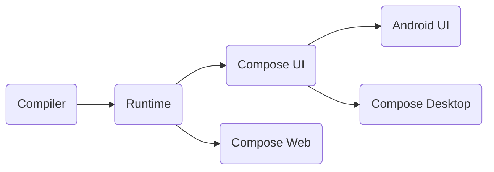

지금까지는 Compose를 주로 Android와 관련지어 설명했습니다. 그러나, Compose의 응용 범위는 Android나 UI를 훨씬 넘어 확장됩니다.  
이 챕터에서는 Compose의 고급 사용 사례와 실용적인 예시들을 살펴보겠습니다.

## Compose runtime vs Compose UI

내부 구조를 다시 살펴보기 전에, Compose UI와 Compose 런타임을 명확히 구분하는 것이 중요합니다.

- Compose UI : Android의 새로운 UI 툴킷으로, `LayoutNodes` 트리를 통해 캔버스에 콘텐츠를 그립니다.
- COmpose 런타임 : 상태 및 컴포지션과 관련된 다양한 기본 메커니즘을 제공합니다.

Compose 컴파일러가 Kotlin 플랫폼 전반에 대한 지원을 받으면서, 이제는 Kotlin이 실행되는 환경 거의 모든 곳에서 UI 또는 다른 트리 구조를 관리하는데 Compose 런타임을 사용할 수 있게 되었습니다.
여기서 중요한 점은 "다른 트리 구조"입니다. Compose 런타임은 UI or Android를 직접적으로 언급하지 않으며, 비록 UI를 위한 최적화된 런타임이지만 다양한 종류의 트리 구조를 구축할 만큼 일반적인 기능을 제공합니다.
이는 React JS와 유사한데, React JS는 주로 웹 UI 구축을 목적으로 개발되었지만, 이후 신디사이저나 3D 렌더러 등 더 넓은 용도로 확장되었습니다.
커스텀 렌더러는 React 런타임의 핵심 기능을 재사용하면서 브라우저 DOM 대신, 자신만의 빌딩 블록을 제공합니다.

> Compose 개발자들이 React에서 영감을 받은 것은 잘 알려진 사실입니다.  
> 초기 프로토타입만 봐도, XML을 Kotlin에서 직접 사용하는 방식은 React의 HTML-in-JS 접근 방식과 비슷했습니다.  
> 그 결과, React로 구현된 다양한 서드파티 기능들은 Compose로도 손쉽게 복제할 수 있으며, KMP에서도 실행할 수 있습니다.

```kotlin
// Early prototype of compose
class ContactsView: Component() {
    var contacts: List<Contact>
    
    override fun compose() {
        <LinearLayout orinentation = "vertical">
            for (contact in contacts) {
                <LinearLayout>
                    <ImageView image = {contact.img} />
                    <TextView text = {contact.name} />
                </LinearLayout>
            }
        </LinearLayout>
    }
}
```

Compose가 베타 단계일 때부터 JetBrains는 이미 Compose for Kotlin 멀티플랫폼을 도입했습니다.  
현재는 Desktop JVM 버전, 브라우저 JS 버전, iOS 버전도 지원하고 있습니다. 이들 버전은 Compose의 여러 부분을 재사용하고 있습니다.

- Compose for Desktop은 Skia 래퍼가 포팅된 덕분에, Compose UI의 전체 렌더링 레이어를 재사용하며 Android 구현과 매우 유사한 상태를 유지했습니다.
이벤트 시스템도 마우스/키보드 지원을 확장하여 더 나은 지원을 제공합니다.
- Compose for iOS는 Skia를 렌더링 레이어로 사용하고, JVM에서 Kotlin/Native로 이동 가능한 기존 논리의 상당 부분을 재사용합니다.
- Compose for Web은 브라우저 DOM을 사용하여 요소를 표시하도록 설계되었으며, 컴파일러와 런타임만을 재사용합니다.
제공되는 구성 요소는 HTML/CSS 위에 정의되어 있어 Compose UI와는 다른 시스템을 형성합니다.



## (Re-) Introducing composition

`Composition`은 모든 컴포저블이 실행되는 컨텍스트를 제공합니다.  
`SlotTable`을 기반으로 "캐시"를 제공하고, `Applier`를 통해 커스텀 트리를 생성하는 인터페이스를 제공합니다.  
`Recomposer`는 `Composition`을 구동하며, 상태 변경과 같은 이벤트가 발생할 때마다 리컴포지션을 트리거합니다.  
일반적으로 `Composition`은 프레임워크에 의해 자동으로 생성되지만, 이 챕터에서는 특별한 사용 사례를 다루며, 직접 `Composition`을 관리하는 방법도 알아볼 것입니다.


`Composition`을 생성하려면 다음과 같은 팩토리 메서드를 사용할 수 있습니다:

```kotlin
// Composition.kt
fun Composition(
    parent: CompositionContext,
    applier: Applier<*>,
): Composition = ...
```

- 부모 `context`는 보통 `rememberCompositionContext()`를 통해 컴포저블 내에서 얻을 수 있습니다.   
또는, `Recomposer`가 `CompositionContext`를 구현하며, Android에서 사용할 수 있거나 필요에 따라 별도로 생성할 수 있습니다.
- 두 번째 파라미터는 `Applier`로, `Composition`이 생성하는 트리를 어떻게 구성하고 연결할지를 결정합니다.  
이전 챕터에서 이에 대해 자세히 다루었으며, 이 챕터에서는 이를 구현하는 몇 가지 좋은 예시를 살펴볼 것입니다.

> 재밌는 점은, 만약 컴포저블 함수의 다른 기능만 필요하다면 아무 동작도 하지 않는 `Applier` 인스턴스를 제공할 수 있습니다.  
> 노드를 사용하지 않더라도, `@Composable` 어노테이션은 모든 컴포저블이 그러하듯이 상태 변경에 반응하는 데이터 스트림 변환 또는 이벤트 핸들러를 제공할 수 있습니다.  
> 단순히 `Applier<Nothing>`을 만들고 `ComposeNode`를 사용하지 않으면 됩니다.

이 장의 나머지 부분은 **Compose UI** 없이 **Compose 런타임**을 사용하는 것에 중점을 둡니다.  
첫 번째 예시는 Compose UI 라이브러리에서 가져온 것으로, 커스텀 트리를 통해 벡터 그래픽을 렌더링하는 예시입니다.  
이후에는 Kotlin/JS로 전환하여, Compose를 활용한 간단한 브라우저 DOM 관리 라이브러리를 만들것입니다.