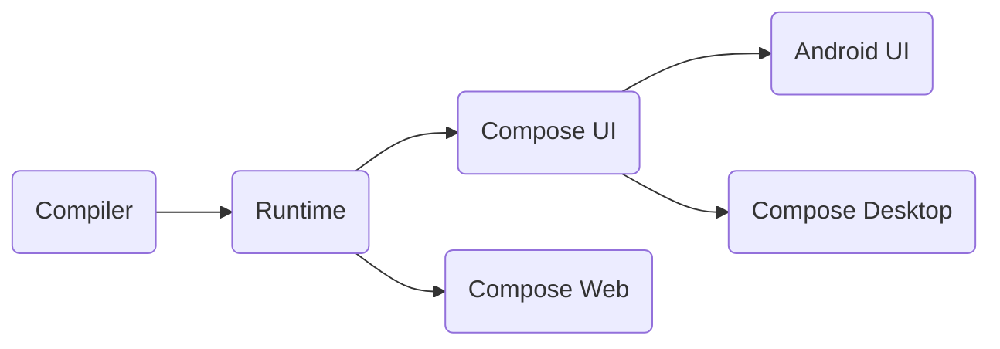
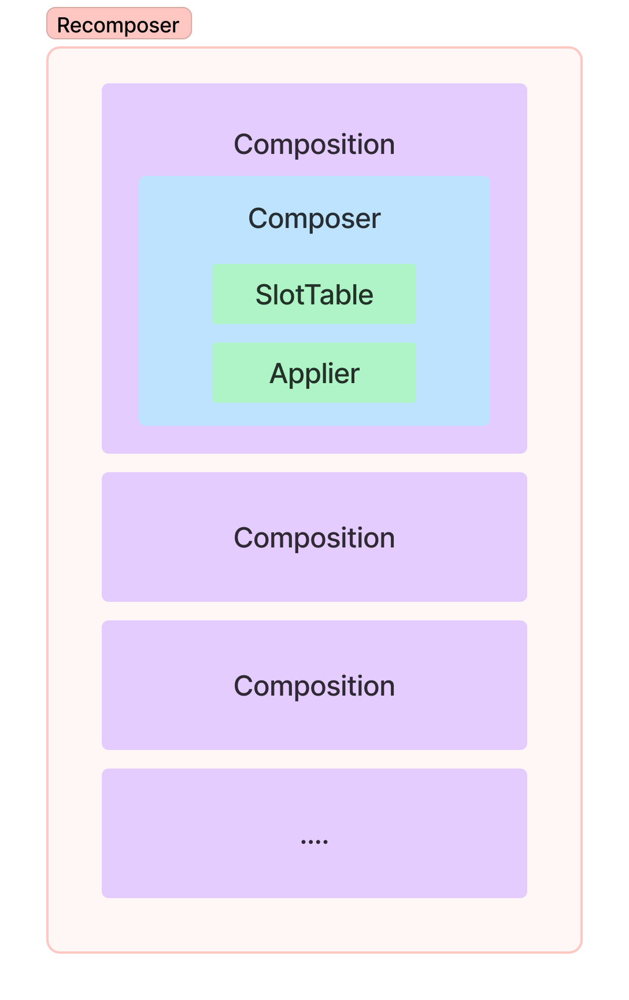
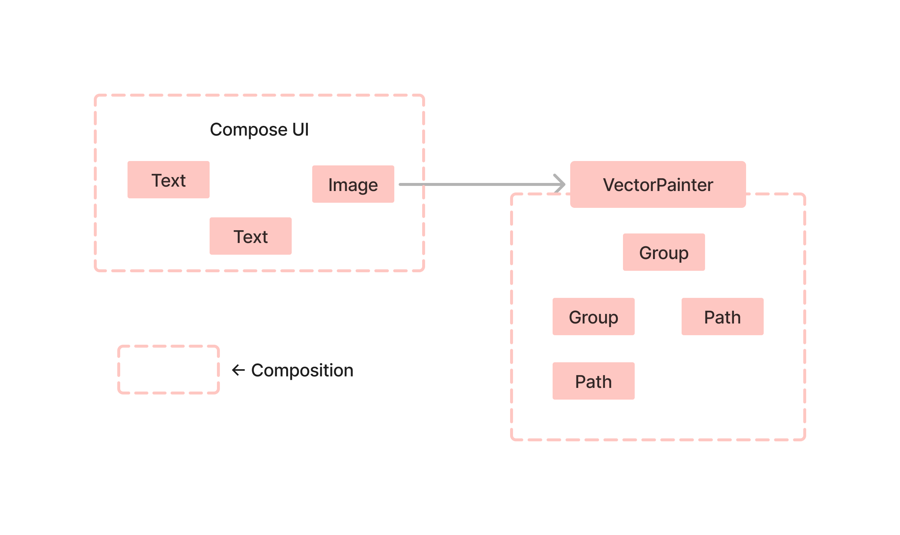

지금까지는 Compose를 주로 Android와 관련지어 설명했습니다. 그러나, Compose의 응용 범위는 Android나 UI를 훨씬 넘어 확장됩니다.  
이 챕터에서는 Compose의 고급 사용 사례와 실용적인 예시들을 살펴보겠습니다.

## Compose runtime vs Compose UI

내부 구조를 다시 살펴보기 전에, Compose UI와 Compose 런타임을 명확히 구분하는 것이 중요합니다.

- Compose UI : Android의 새로운 UI 툴킷으로, `LayoutNodes` 트리를 통해 캔버스에 콘텐츠를 그립니다.
- COmpose 런타임 : 상태 및 컴포지션과 관련된 다양한 기본 메커니즘을 제공합니다.

Compose 컴파일러가 Kotlin 플랫폼 전반에 대한 지원을 받으면서, 이제는 Kotlin이 실행되는 환경 거의 모든 곳에서 UI 또는 다른 트리 구조를 관리하는데 Compose 런타임을 사용할 수 있게 되었습니다.
여기서 중요한 점은 "다른 트리 구조"입니다. Compose 런타임은 UI or Android를 직접적으로 언급하지 않으며, 비록 UI를 위한 최적화된 런타임이지만 다양한 종류의 트리 구조를 구축할 만큼 일반적인 기능을 제공합니다.
이는 React JS와 유사한데, React JS는 주로 웹 UI 구축을 목적으로 개발되었지만, 이후 신디사이저나 3D 렌더러 등 더 넓은 용도로 확장되었습니다.
커스텀 렌더러는 React 런타임의 핵심 기능을 재사용하면서 브라우저 DOM 대신, 자신만의 빌딩 블록을 제공합니다.

> Compose 개발자들이 React에서 영감을 받은 것은 잘 알려진 사실입니다.  
> 초기 프로토타입만 봐도, XML을 Kotlin에서 직접 사용하는 방식은 React의 HTML-in-JS 접근 방식과 비슷했습니다.  
> 그 결과, React로 구현된 다양한 서드파티 기능들은 Compose로도 손쉽게 복제할 수 있으며, KMP에서도 실행할 수 있습니다.

```kotlin
// Early prototype of compose
class ContactsView: Component() {
    var contacts: List<Contact>
    
    override fun compose() {
        <LinearLayout orinentation = "vertical">
            for (contact in contacts) {
                <LinearLayout>
                    <ImageView image = {contact.img} />
                    <TextView text = {contact.name} />
                </LinearLayout>
            }
        </LinearLayout>
    }
}
```

Compose가 베타 단계일 때부터 JetBrains는 이미 Compose for Kotlin 멀티플랫폼을 도입했습니다.  
현재는 Desktop JVM 버전, 브라우저 JS 버전, iOS 버전도 지원하고 있습니다. 이들 버전은 Compose의 여러 부분을 재사용하고 있습니다.

- Compose for Desktop은 Skia 래퍼가 포팅된 덕분에, Compose UI의 전체 렌더링 레이어를 재사용하며 Android 구현과 매우 유사한 상태를 유지했습니다.
이벤트 시스템도 마우스/키보드 지원을 확장하여 더 나은 지원을 제공합니다.
- Compose for iOS는 Skia를 렌더링 레이어로 사용하고, JVM에서 Kotlin/Native로 이동 가능한 기존 논리의 상당 부분을 재사용합니다.
- Compose for Web은 브라우저 DOM을 사용하여 요소를 표시하도록 설계되었으며, 컴파일러와 런타임만을 재사용합니다.
제공되는 구성 요소는 HTML/CSS 위에 정의되어 있어 Compose UI와는 다른 시스템을 형성합니다.



## (Re-) Introducing composition

`Composition`은 모든 컴포저블이 실행되는 컨텍스트를 제공합니다.  
`SlotTable`을 기반으로 "캐시"를 제공하고, `Applier`를 통해 커스텀 트리를 생성하는 인터페이스를 제공합니다.  
`Recomposer`는 `Composition`을 구동하며, 상태 변경과 같은 이벤트가 발생할 때마다 리컴포지션을 트리거합니다.  
일반적으로 `Composition`은 프레임워크에 의해 자동으로 생성되지만, 이 챕터에서는 특별한 사용 사례를 다루며, 직접 `Composition`을 관리하는 방법도 알아볼 것입니다.



`Composition`을 생성하려면 다음과 같은 팩토리 메서드를 사용할 수 있습니다:

```kotlin
// Composition.kt
fun Composition(
    parent: CompositionContext,
    applier: Applier<*>,
): Composition = ...
```

- 부모 `context`는 보통 `rememberCompositionContext()`를 통해 컴포저블 내에서 얻을 수 있습니다.   
또는, `Recomposer`가 `CompositionContext`를 구현하며, Android에서 사용할 수 있거나 필요에 따라 별도로 생성할 수 있습니다.
- 두 번째 파라미터는 `Applier`로, `Composition`이 생성하는 트리를 어떻게 구성하고 연결할지를 결정합니다.  
이전 챕터에서 이에 대해 자세히 다루었으며, 이 챕터에서는 이를 구현하는 몇 가지 좋은 예시를 살펴볼 것입니다.

> 재밌는 점은, 만약 컴포저블 함수의 다른 기능만 필요하다면 아무 동작도 하지 않는 `Applier` 인스턴스를 제공할 수 있습니다.  
> 노드를 사용하지 않더라도, `@Composable` 어노테이션은 모든 컴포저블이 그러하듯이 상태 변경에 반응하는 데이터 스트림 변환 또는 이벤트 핸들러를 제공할 수 있습니다.  
> 단순히 `Applier<Nothing>`을 만들고 `ComposeNode`를 사용하지 않으면 됩니다.

이 장의 나머지 부분은 **Compose UI** 없이 **Compose 런타임**을 사용하는 것에 중점을 둡니다.  
첫 번째 예시는 Compose UI 라이브러리에서 가져온 것으로, 커스텀 트리를 통해 벡터 그래픽을 렌더링하는 예시입니다.  
이후에는 Kotlin/JS로 전환하여, Compose를 활용한 간단한 브라우저 DOM 관리 라이브러리를 만들것입니다.

## Composition of vector graphics

Compose에서 벡터 렌더링은 `Painter` 추상화를 통해 구현되며, 이는 전통적인 Android 시스템의 `Drawable`과 유사합니다:

```kotlin
Image(
    painter = rememberVectorPainter { width, height -> 
        Group(
            scaleX = 0.75f,
            scaleY = 0.75f,
        ) {
            val pathData = PathData { ... }
            Path(pathData = pathData)
        }
    }
)
```

`rememberVectorPainter` 블록 내부 함수들(`Group`, `Path` 등) 또한 컴포저블이지만, 일반적인 컴포저블과는 다른 타입입니다.  
Compose UI의 다른 컴포저블들이 `LayoutNode`를 생성하는 것과 달리, 이들은 벡터 그래픽을 구성하는 요소들을 만듭니다.  
이 요소들이 결합되어 '벡터 트리'가 생성되며, 이후 캔버스에 그려집니다.



`Group`과 `Path`는 일반 UI와는 다른, **벡터 컴포지션**에 속해 있습니다.  
벡터 컴포지션은 `VectorPainter` 안에 있으며, 벡터 이미지를 구성하는 요소만 사용할 수 있고, 일반적인 UI 컴포저블은 사용할 수 없습니다.

> 벡터 컴포저블에 대한 검사는 현재 런타임에서 이루어지며, `VectorPainter` 블록 안에 `Image` or `Box`를 사용하더라도 컴파일러는 이를 무시하고 건너뜁니다.

이전 챕터에서 설명한 상태, 이펙트, 그리고 **런타임**에 관한 규칙들은 UI 컴포지션뿐만 아니라 벡터 컴포지션에서도 동일하게 적용됩니다.  
예를 들어, 트랜지션 API를 사용해 UI와 벡터 이미지의 변화를 함께 애니메이션할 수 있습니다. 
([벡터 그래픽 데모](https://cs.android.com/androidx/platform/frameworks/support/+/56f60341d82bf284b8250cf8054b08ae2a91a787:compose/ui/ui/integration-tests/ui-demos/src/main/java/androidx/compose/ui/demos/VectorGraphicsDemo.kt)와 [애니메이션 벡터 그래픽 데모](https://cs.android.com/androidx/platform/frameworks/support/+/56f60341d82bf284b8250cf8054b08ae2a91a787:compose/animation/animation/integration-tests/animation-demos/src/main/java/androidx/compose/animation/demos/vectorgraphics/AnimatedVectorGraphicsDemo.kt)를 참조하세요.)

## Building vector image tree

벡터 이미지는 `LayoutNode`보다 더 단순한 요소들로부터 구성되어, 벡터 그래픽의 요구 사항에 더 적합하게 설계됩니다:

```kotlin
// VNode.kt
sealed class VNode {
    abstract fun DrawScoep.draw()
}

// the root node
internal class VectorComponent : VNode() { 
    val root = GroupComponent()
    
    override fun DrawScope.draw() { 
        // set up viewport size and cache drawing
    } 
}

internal class PathComponent : VNode() { 
    var pathData: List<PathNode>
    // more properties
    
    override fun DrawScope.draw() { 
        // draw path
    }
}

internal class GroupComponent : VNode() { 
    private val children = mutableListOf<VNode>()
    // more properties
    
    override fun DrawScope.draw() { 
        // draw children with transform
    }
}
```

위 노드들은 전통적인 벡터 드로어블 XML에서 사용되는 것과 유사한 트리 구조를 정의합니다.  
이 트리는 두 가지 주요 노드 타입으로 구성됩니다:

- `GroupComponent` : 자식 노드들을 결합하고, 공통 변활을 적용하는 노드
- `PathComponent` : 자식 노드가 없는 리프 노드로, `pathData`를 그리는 역할을 합니다.

`fun DrawScope.draw()` 함수는 노드와 그 자식들의 콘텐츠를 그리는 방법을 제공합니다.  
이 함수의 시그니처는 나중에 이 트리의 루트와 통합되는 `Painter` 인터페이스와 동일합니다.

> `VectorPainter`는 전통적인 Android 시스템의 XML 벡터 드로어블 리소스를 표시하는데 사용됩니다.   
> XML 파서는 유사한 구조를 생성하고, 이를 일련의 `Composable` 호출로 변환하여 겉보기에는 다른 타입의 리소스라도 동일한 방식으로 구현됩니다.

위 트리 노드들은 `internal`로 선언되어 있어, 이를 생성하는 유일한 방법은 해당 `@Composable` 선언을 통해 생성하는 것입니다.
이 함수들은 이 섹션의 시작 부분에서 `rememberVectorPainter` 예제에서 사용된 함수들입니다.

```kotlin
// VectorComposables.kt
@Composable
fun Group(
    scaleX: Float = DefaultScaleX,
    scaleY: Float = DefaultScaleY,
    ...
    content: @Composable () -> Unit
) {
    ComposeNode<GroupComponent, VectorApplier>(
        factory = { GroupComponent() },
        update = {
            set(scaleX) { this.scaleX = it }
            set(scaleY) { this.scaleY = it } 
            ...
        },
        content = content
    )
}

@Composable
fun Path(
    pathData: List<PathNode>,
    ...
) {
    ComposeNode<PathComponent, VectorApplier>(
        factory = { PathComponent() },
        update = {
            set(pathData) { this.pathData = it }
            ...
        }
    )
}
```

`ComposeNode` 호출은 컴포지션에 노드를 삽입하여 트리 구조를 생성합니다.  
그 외의 경우에는 `@Composable` 함수가 트리와 직접 상호작용할 필요가 없습니다.  
초기 삽입(노드 요소가 생성될 때) 이후, Compose는 정의된 파라미터의 업데이트를 추적하고, 관련 속성을 점진적으로 업데이트합니다.

- `factory` 파라미터는 트리 노드가 어떻게 생성되는지를 정의합니다.   
  여기서는 `Path`나 `Group` 컴포넌트의 생성자를 호출하는 방식으로 노드를 생성합니다.
- `update` 파라미터는 이미 생성된 인스턴스의 속성을 점진적으로 업데이트하는 방법을 제공합니다.   
  람다 내부에서 Compose는 헬퍼 함수와 함께 데이터를 메모이즈하여 효율적으로 업데이트합니다.

`fun <T> Updater.set(value: T)` or `fun <T> Updater.update(value: T)`와 같은 헬퍼 함수는 제공된 값이 변경될 때만 트리 노드의 속성을 새로고침하여, 불필요한 무효화를 방지합니다.

- `content` 파라미터는 자식 노드를 부모 노드에 추가하는 방식입니다.  
  이 파라미터는 노드 업데이트가 끝난 후 실행되며, 생성된 모든 자식 노드는 현재 노드(부모)에 연결됩니다.  
  또한, `ComposeNode`에는 `content` 파라미터가 없는 버전도 있어, 이는 `Path` 처럼 자식 노드가 없는 리프 노드에 사용될 수 있습니다.

자식 노드를 부모 노드에 연결하기 위해, Compose는 앞서 간략히 설명한 `Applier`를 사용합니다. 
`VNodes`는 `VectorApplier`를 통해 결합됩니다:

```kotlin
// VectorApplier.kt
class VectorApplier(root: VNode) : AbstractApplier<VNode>(root) {
    override fun insertTopDown(index: Int, instance: VNode) {
        current.asGroup().insertAt(index, instance)
    }
    
    override fun insertBottomUp(index: Int, instance: VNode) {
        // Ignored as the tree is built top-down
    }
    
    override fun remove(index: Int, count: Int) {
        current.asGroup().remove(index, count)
    }
    
    override fun move(from: Int, to: Int, count: Int) {
        current.asGroup().move(from, to, count)
    }
    
    override fun onClear() {
        root.asGroup().let { it.remove(0, it.numChildren) }
    }
    
    // VectorApplier only works with [GroupComponent], 
    // as it cannot add children to [PathComponent] by design
    private fun VNode.asGroup(): GroupComponent {
        return when (this) {
            is GroupComponent -> this
            else -> error("Cannot only insert VNode into Group")
        }
    }
}
```

`Applier` 인터페이스의 메서드들은 리스트 연산(`insert`/`move`/`remove`)을 자주 수행합니다.   
이를 반복적으로 재구현하는 것을 피하기 위해, `AbstractApplier`는 `MutableList`에 대한 편리한 확장 기능을 제공합니다.  
`VectorApplier`의 경우, 이러한 리스트 연산이 `GroupComponent` 내부에서 직접 구현됩니다.

> `Applier`는 트리 조립 순서에 따라 `topDown`과 `bottomUp` 두 가지 삽입 방법을 제공합니다.
> 
> - `topDown`은 먼저 노드를 트리에 추가한 후, 자식들을 하나씩 삽입합니다.
> - `bottomUp`은 노드를 생성하고 모든 자식을 추가한 후, 트리에 삽입합니다.
> 
> 이 방식의 차이는 성능 최적화에 있습니다.  
> 일부 환경에서는 트리에 자식을 추가할 때 성능 비용이 발생할 수 있습니다. (예를 들어 Android 시스템에서 View를 추가할 때 발생하는 레이아웃 재배치 비용을 생각해보세요.)
> 벡터의 경우, 이러한 성능 비용이 없으므로 노드가 탑다운 방식으로 삽입됩니다.