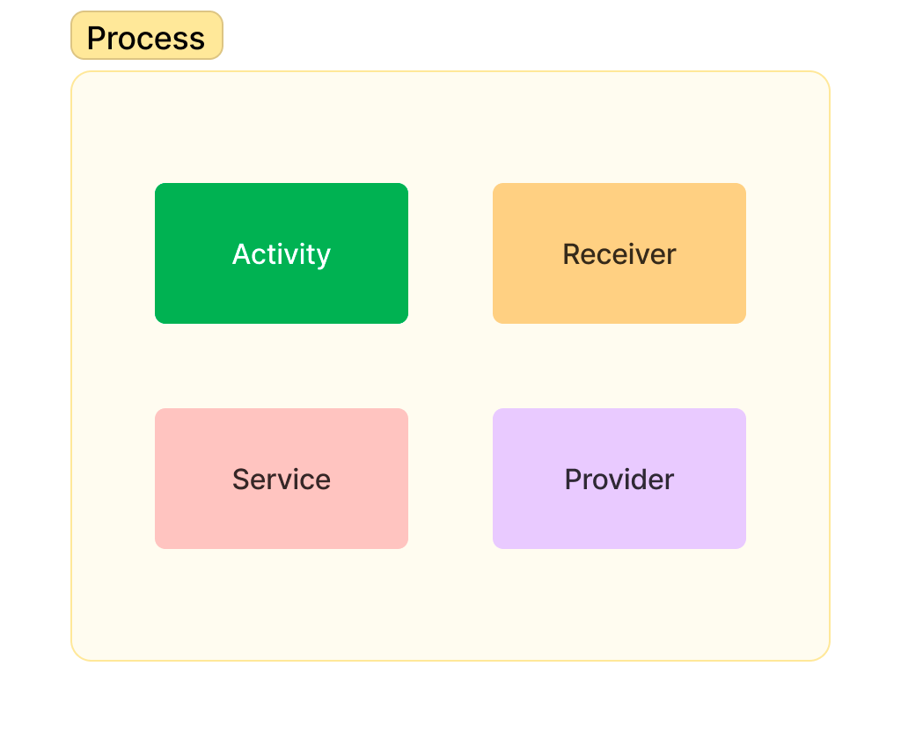
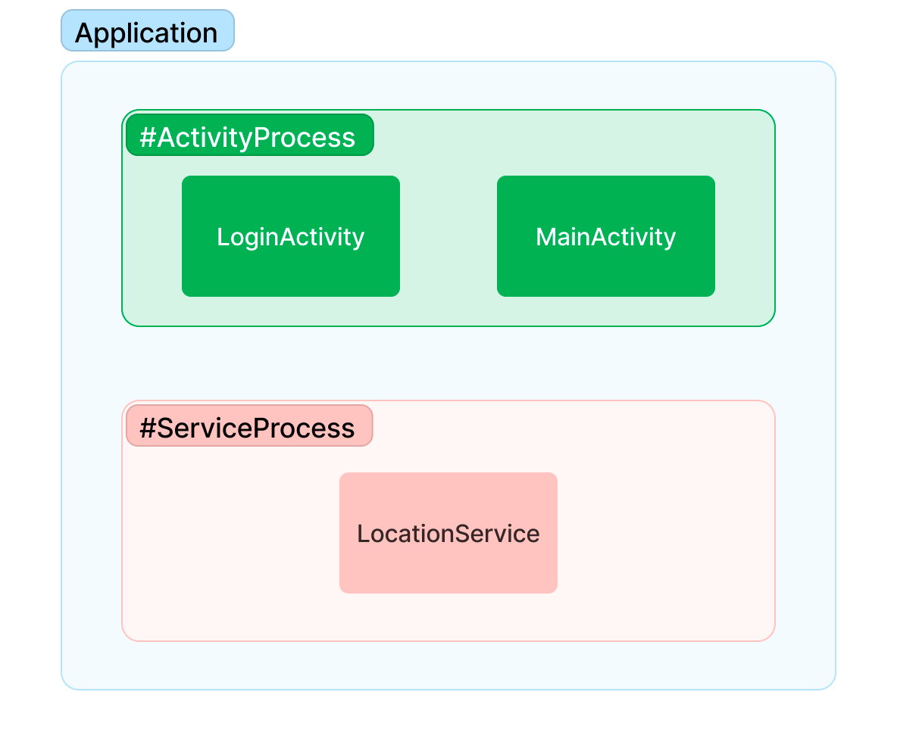

# Android Process and MainThread 

Application 컴포넌트가 처음 시작될 때, 실행 중인 다른 컴포넌트가 없다면,
안드로이드 시스템은 Application을 위해 리눅스 프로세스와 단일 실행 스레드를 새롭게 생성합니다.

기본적으로 동일한 Application의 모든 컴포넌트는 `Main Thread`라고 불리는 동일한 `Process`와 `Thread`에서 실행됩니다.


만약 같은 Application 내의 다른 컴포넌트가 이미 실행 중이라면, 새로운 컴포넌트는 그 `Process`와 `Thread`를 공유합니다.  
필요하다면, 개발자는 컴포넌트를 별도의 프로세스에서 실행되도록 설정하거나 추가 스레드를 생성할 수 있습니다.

---

## Process



기본적으로 Application의 모든 컴포넌트는 동일한 `Process`에서 실행되며, 대부분의 Application은 이를 변경하지 않습니다.

그러나 특정 컴포넌트가 어떤 Process에 속해야 하는지 제어해야 할 필요가 있다면, `AndroidManifest.xml` 파일에서 이를 설정할 수 있습니다.

각 컴포넌트 타입(`<activity>`, `<service>`, `<receiver>`, `<provider>`)은 컴포넌트가 실행되는 `Process`를 지정할 수 있는 `android:process`를 지원합니다.
이 속성을 설정하여 각 컴포넌트가 자체 `Process`에서 실행되도록 하거나 일부 컴포넌트가 `Process`를 공유하고 다른 컴포넌트는 공유하지 않도록 할 수 있습니다.

또한 `android:process`를 설정하여 다른 Application의 컴포넌트가 동일한 `Process`에서 실행되도록 할 수 있습니다.  
단, Applicaiton들이 동일한 '리눅스 사용자 ID'를 공유하고 '동일한 인증서로 서명'되어야 합니다.

`<application>` 컴포넌트도 `android:process` 속성을 지원하며, 이를 사용하여 모든 컴포넌트에 적용되는 기본값을 설정할 수 있습니다.



```xml
<!-- AndroidManifest.xml -->
<application>
    <activity
            android:name="LoginActivity"
            android:process=":ActivityProcess"/>
    <activity
            android:name="MainActivity"
            android:process=":ActivityProcess"/>
    <service
        android:name="LocationService"
        android:process=":ServiceProcess"/>
</application>
```

안드로이드는 다른 `Process`가 사용자에게 더 즉각적으로 필요한 리소스를 요구할 때 다른 `Process`를 종료할 수 있습니다.  
`Process`가 종료되면 그 `Process`에서 실행되던 Application의 모든 컴포넌트도 종료됩니다.  
만약 종료된 컴포넌트들에게 할 일이 있을 때 `Process`는 다시 시작됩니다.

어떤 `Process`를 종료할 지 결정할 때, 안드로이드 시스템은 그 `Process`가 사용자에게 얼마나 중요한지를 고려합니다.  
예를 들어, 화면에 더 이상 보이지 않는 `Activity`를 호스팅하는 `Process`는 화면에 보이는 `Activity`를 호스팅하는 `Process` 보다 더 쉽게 종료됩니다.
즉, `Process`를 종료할지 여부는 그 `Process`에서 실행되는 컴포넌트의 상태에 따라 달라집니다.

---

## Threads

Application을 실행할 때 안드로이드 시스템은 `Main Thread`를 생성합니다.  
`Main Thread`는 적절한 UI 위젯에 이벤트를 전달하고 그림을 그리는 이벤트를 포함하여 처리합니다.

안드로이드 시스템은 각 컴포넌트 인스턴스마다 별도의 `Thread`를 생성하지 않습니다.  
모든 안드로이드 컴포넌트는 동일한 `Process`에서 실행되며 `Main Thread`에서 인스턴스화됩니다.
