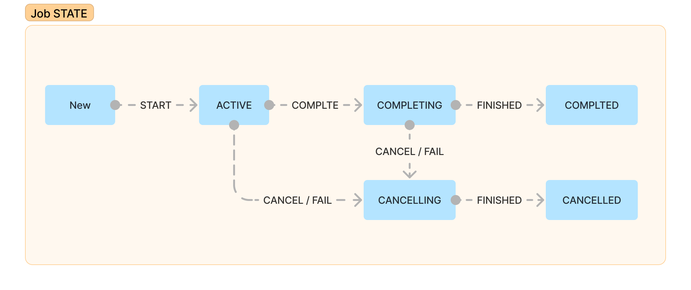

## Job State Flow

## COMPLETING / COMPLETED 상태에서 코루틴을 시작할 수 없는 이유

`COMPLETING / COMPLETED` 상태는 `Job`이 완료되었거나 완료 과정에 있는 상태를 나타냅니다.  

이 상태에서 새로운 자식 코루틴을 시작하면, 부모 `Job`의 상태와 자식 코루틴의 상태 사이에 일관성을 잃게 됩니다.  
예를 들어 부모가 이미 `Completed` 상태라면 '새로 시작된 자식 코루틴은 어떻게 관리되어야 할까??'  
이러한 모호성과 복잡성을 피하기 위해 `Completing / Completed` 상태에서는 새로운 자식 코루틴을 시작할 수 없습니다.

## Active 상태에서만 자식 코루틴의 시작이 가능한 이유

`ACTIVE` 상태는 `Job`이 실행 중이고 아직 완료되지 않았음을 나타냅니다.
이 상태에서 새로운 자식 코루틴을 추가하면, 부모 `Job`이 완료되기 전까지 자식 코루틴도 완료되지 않아야 함이 명확합니다. 
(부모와 자식이 동일한 생명주기를 공유함)

또한 부모 `Job`이 취소될 때 자식 코루틴도 함께 취소됩니다. 이는 리소스 누수를 방지하고 효율적으로 관리할 수 있게 됩니다.  
마지막으로 부모 `Job`에서 예외 처리 메커니즘이 자식 코루틴에게도 적용되어 예외 처리 로직을 일관되게 유지할 수 있게합니다.

위와 같은 이유로 `ACTIVE` 상태에서만 부모 자식-관계를 형성하면 코루틴의 상태와 동작이 더 명확하고 일관성 있게 처리됩니다.
