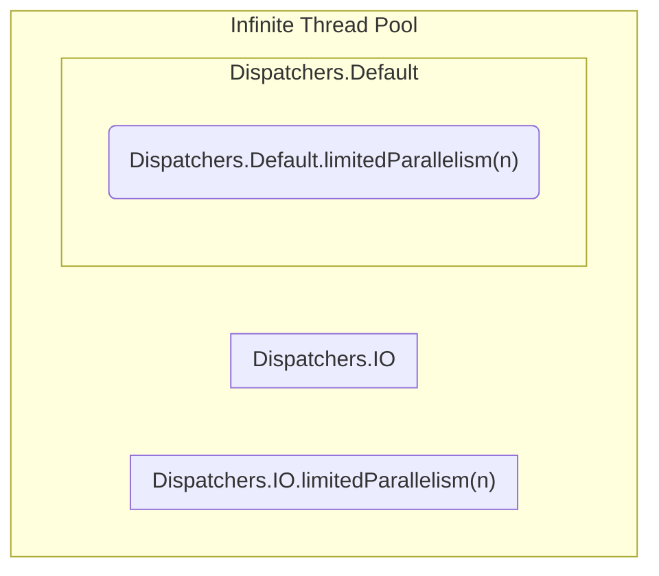

# Dispatchers

코루틴 라이브러리에서 중요한 기능 중 하나는 코루틴이 실행되어야 할 스레드(또는 스레드 풀)을 선택할 수 있도록 하는 것입니다.

이는 디스패처(dispatchers)를 사용하여 수행되며 이를 통해 작업을 병렬로 처리하거나, 특정 작업을 메인 스레드에서 다른 스레드로 옮겨 실행 할 수 있습니다.

코루틴 컨텍스트는 코루틴의 여러 속성을 담고 있습니다. 따라서 코루틴이 어떻게 동작할지에 대한 정보들이 들어있습니다.

## Default dispatcher

디스패처를 지정하지 않으면 기본적으로 `Dispatchers.Default`가 선택됩니다.

`Dispatchers.Default`는 다음과 같은 특징을 가지고 있습니다.

- 복잡한 수학저 계산이나 대규모 데이터의 정렬과 같은 CPU 집약적인 작업을 수행하기 위해 최적화 되어 있습니다.
- CPU 자원을 최대한 효율적으로 활용하기 위해 스레드 풀의 크기는 실행 환경의 CPU 코어 수에 따라 결정됩니다.
- 블로킹 연산을 수행할 경우, 스레드가 대기 상태에 빠져 자원을 낭비할 수 있으므로 블로킹 연산에 적합하지 않습니다.

```kotlin
suspend fun main() = coroutineScope {
    repeat(1000) {
        launch {  // or launch(Dispatchers.Default)
            List(1000) { Random.nextLong() }.maxOrNull()

            val threadName = Thread.currentThread().name
            println("Running on thread: $threadName")
        }
    }
}
// Running on thread: DefaultDispatcher-worker-1
// Running on thread: DefaultDispatcher-worker-5
// Running on thread: DefaultDispatcher-worker-7
// Running on thread: DefaultDispatcher-worker-6
// Running on thread: DefaultDispatcher-worker-11
// Running on thread: DefaultDispatcher-worker-2
// Running on thread: DefaultDispatcher-worker-10
// Running on thread: DefaultDispatcher-worker-4
// ...
```

`runBlocking`은 다른 디스패처가 설정되지 않은 경우 자체 디스패처를 설정합니다.
따라서 `runBlocking` 내부에서는 자동으로 `Dispatchers.Default`가 선택되지 않습니다.

만약 위의 예제에서 `corotineScope` 대신 `runBlocking`을 사용했다면 모든 코루틴이 메인 스레드에서 실행 됩니다.

---

## Limiting the default dispatcher

비용이 많이 드는 프로세스가 `Dispatchers.Default`의 모든 스레드를 사용하고 다른 코루틴들이 이 디스패처에서 스레드를 얻지 못할 것 같다고 의심이 되는 경우,
`limitedParallelism`을 사용하여 동일한 스레드에서 실행됨과 동시에 사용할 수 있는 스레드 수를 제한할 수 있습니다.

`private val dispatcher = Dispatchers.Default.limitedParallelism(5)`

이 메커니즘은 `Dispatchers.IO`를 제한하기 위한 것이지만, `Dispatchers.Default`를 제한하는 것도 가능합니다.

---

## Main dispatcher

안드로이드에서 메인 스레드는 UI 업데이트를 담당합니다.
메인 스레드는 시간이 오래 걸리는 작업을 실행하면 앱이 멈춘 것처럼 보이므로, 긴 작업을 할 때는 다른 디스패처를 사용해야 합니다.

`Dispatchers.Main`는 UI 업데이트와 같은 작업을 메인 스레드에서 안전하게 수행할 수 있도록 도와줍니다.  
단, `Dispatchers.Main`을 사용하려면 관련된 아티팩트나 라이브러리가 프로젝트에 포함되어 있어야 하며 그렇지 않으면 사용할 수 없습니다.

프론트엔드 라이브러리는 일반적으로 유닛 테스트에서 사용되지 않으므로, 여기서는 `Dispatchers.Main`이 정의되지 않습니다.
`Dispatchers.Main`을 사용하려면 `kotlinx-coroutines-test`에서 `Dispatchers.setMain(dispatcher)`를 사용하여 디스패처를 설정해야 합니다.

```kotlin
class SomeTest {
    private val dispatcher = Executors.newSingleThreadExecutor().asCoroutineDispatcher()

    @Before
    fun setUp() {
        Dispatchers.setMain(dispatcher)
    }

    @After
    fun tearDown() {
        Dispatchers.resetMain()
        dispatcher.close()
    }

    @Test
    fun testSomeUI() = runBlocking {
        launch(Dispatchers.Main) {
            // ...
        }
    }
}
```

안드로이드에서는 일반적으로 `Dispatchers.Main`를 기본 디스패처로 사용합니다.

만약 블로킹 대신 suspending 기능을 가진 라이브러리를 사용하고 복잡한 계산을 하지 않는다면, 실제로는 `Dispatchers.Main`만 사용하여도 충분할 수 있습니다.
그러나 CPU 집약적인 작업을 수행한다면, 이러한 작업은 `Dispatchers.Default`에서 실행되어야 합니다.

위 2가지 디스패처만으로도 많은 앱에서는 충분하지만, 큰 파일을 읽는 것과 같이 긴 I/O 작업을 수행하는 등 스레드를 블로킹해야 하는 상황이 있을 수 있습니다.

메인 스레드를 블로킹하는 경우 앱이 멈춰버릴 수 있고 Default 디스패처를 블로킹하면 스레드 풀의 모든 스레드를 블로킹하는 위험이 있으며 어떠한 계산도 수행할 수 없게 됩니다.
이러한 상황에 대비하여 `Dispatchers.IO`가 사용됩니다.

---

## IO dispatcher

`Dispatchers.IO`는 I/O 작업에 최적화되어 있어, 디스크 또는 네트워크 작업을 수행할 때 이 디스패처를 사용하는 것이 좋습니다.

`Dispatchers.IO`는 동시에 여러 스레드를 활성화할 수 있으며 이는 I/O 작업이 CPU를 많이 사용하지 않고 대부분 대기 상태에 있기 때문에 가능합니다.  
또한 I/O 작업을 수행하는 동안 UI 업데이트 등이 차단되지 않도록 할 수 있습니다.

안드로이드에서는 `Dispatchers.IO`를 통해 데이터베이스 접근, 네트워크 요청 등 다양한 I/O 작업을 수행할 수 있습니다.

아래 예제는 `Dispatchers.IO`가 동시에 50개 이상의 스레드를 활성화하는 것을 허용하기에 1초 정도 걸립니다.

```kotlin
suspend fun main() {
    val time = measureTimeMillis {
        coroutineScope {
            repeat(50) {
                launch(Dispatchers.IO) {
                    Thread.sleep(1000)
                }
            }
        }
    }
    println(time) // ~ 1000
}
```

무제한 스레드 풀은 처음에는 비어있지만, 더 많은 스레드가 필요하면 생성되어 사용되지 않을 때까지 활성 상태를 유지합니다.  
이러한 스레드 풀은 너무 많은 스레드가 활성화 되어있는 경우 성능은 천천히지만, 무한히 저하되고, 결국에는 메모리 부족 오류를 발생 시킬 수 있습니다.

이러한 이유로 인해 한번에 사용할 수 있는 스레드 수가 제한된 디스패처를 생성하는 것이 좋습니다.

- `Dispatchers.Default`는 CPU 집약적 작업을 최적하기 위해 CPU 코어 수에 따라 스레드 수가 제한됩니다.
- `Dispatchers.IO`는 일반적으로 최대 64개의 스레드로 제한됩니다.

```kotlin
suspend fun main() = coroutineScope {
    repeat(1000) {
        launch(Dispatchers.IO) {
            Thread.sleep(200)

            val threadName = Thread.currentThread().name
            println("Running on thread: $threadName")
        }
    }
}
// Running on thread: DefaultDispatcher-worker-1
// ...
// Running on thread: DefaultDispatcher-worker-51
// Running on thread: DefaultDispatcher-worker-11
```

`Dispatchers.Default`와 `Dispatchers.IO`는 동일한 스레드 풀을 공유합니다.
이는 중요한 최적화로써 스레드는 재사용되며, 대부분의 경우 재디스패칭이 필요하지 않습니다.

예를 들어 `Dispatchers.Default`에서 실행 중인 코드가 `withContext(Dispatcher.IO) { ... }`에 도달한다면, 대부분의 경우 동일한 스레드에서 계속 실행됩니다.

그러나, `Default`와 `IO`는 각자 독립적인 스레드 제한을 가지고 있기에, 하나의 디스패처에서 너무 많은 스레드를 사용하더라도 다른 디스패처가 스레드를 사용하지 못하게 하는 일은 없습니다.

```kotlin
suspend fun main() = coroutineScope {
    launch(Dispatchers.Default) {
        println(Thread.currentThread().name)
        withContext(Dispatchers.IO) {
            println(Thread.currentThread().name)
        }
    }
}
// DefaultDispatcher-worker-1
// DefaultDispatcher-worker-1
```

위 내용을 더 명확하게 이해하기 위해서 `Default`와 `IO`를 최대한 활용한다고 가정해보면 결과적으로 활성된 스레드의 수는 두 디스패처의 제한의 합계가 될 것입니다.

만약 `IO`에서 64개의 스레드를 허용하고 시스템의 코어가 8개라면 현재 공유된 스레드 풀에서는 총 72개의 활성화된 스레드가 있을 것입니다.
이는 효율적인 스레드 재사용과 두 디스패처가 강한 독립성을 가진다고 이해할 수 있습니다.

일반적으로 `Dispatchers.IO`를 사용하는 경우는 블로킹 함수를 호출해야 할 때 입니다.   
이러한 경우는 해당 함수를 `withContext(Dispatchers.IO)`로 감싸서 suspending 함수로 만드는 것입니다.

```kotlin
class DiscUserRepository(
    private val discReader: DiscReader
) : UserRepository {
    override suspend fun getUser(): UserData = withContext(Dispatchers.IO) {
        UserData(discReader.read("userName"))
    }
}
```

너무 많은 스레드가 블로킹 상태가 되버리면, 다른 중요한 작업들이 대기 상태에 놓이게 될 수 있습니다.  
이를 해결하기 위해서 `limitedParallelism`을 사용하여 특정 디스패처에서 동시에 실행될 수 있는 코루틴의 수를 제한할 수 있습니다.

---

## IO dispatcher with a custom pool of threads

`Dispatchers.IO`는 `limitedParallelism` 함수에 대해 특별한 동작이 정의되어 있습니다.

`Dispatchers.IO`에서 `limitedParallelism`을 사용하면 독립적인 스레드 풀을 가진 새로운 디스패처를 생성할 수 있습니다.
또한 이 스레드 풀은 64개로 제한되지 않고 원하는 만큼 스레드 수를 제한할 수 있습니다.

아래 예시는 1초 동안 스레드를 차단하는 코루틴 100개를 시작한다고 가정합니다.  
이 코루틴들을 `Dispatchers.IO`에서 실행하면 작업을 완료하는데 2초가 걸리는 반면,  
`limitedParallelism`을 100개의 스레드로 설정한 `Dispatchers.IO`에서 실행하면 1초만에 완료됩니다.

두 디스패처의 한계는 독립적이기에 두 디스패처의 실행 시간을 동시에 측정할 수 있습니다.

```kotlin
suspend fun printCoroutinesTime(dispatcher: CoroutineDispatcher) {
    val test = measureTimeMillis {
        coroutineScope {
            repeat(100) {
                launch(dispatcher) {
                    Thread.sleep(1000)
                }
            }
        }
    }
    println("$dispatcher took: $test")
}

suspend fun main(): Unit = coroutineScope {
    launch {
        printCoroutinesTime(Dispatchers.IO)
        // Dispatchers.IO took: 2074
    }

    launch {
        val dispatcher = Dispatchers.IO.limitedParallelism(100)
        printCoroutinesTime(dispatcher)
        // LimitedDispatcher@XXX took: 1082
    }
}
```

개념적으로 다음과 같은 방법으로 상상해볼 수 있습니다.

```kotlin
// Dispatcher with an unlimited pool of threads
private val pool = ...

Dispatchers.IO = pool.limitedParallelism(64)
Dispatchers.IO.limitedParallelism(x) = pool.limitedParallelism(x)
```



위 처럼 `limitedParallelism`을 `Dispatchers.Default`에 적용하면 기존 `Dispatchers.Default`의 스레드 제한에 추가적인 제한을 설정하는것인
반면에 `Dispatchers.IO`에 `limitedParallelism`을 적용하면 기본 `Dispatchers.IO`와는 별도로 동작하는 새로운 디스패처가 생성됩니다.

위와 같은 디스패처들은 결국 동일한 스레드 풀을 공유하기에 스레드 재사용과 최적화가 가능하게 됩니다.

스레드를 많이 블로킹할 가능성이 있는 클래스는 독립적인 제한을 가진 자체 디스패처를 설정하는 것이 좋습니다.

이 제한을 너무 많은 스레드로 제한하면 자원 낭비가 되고, 너무 적은 스레드로 하면 성능을 저하 시킬 수 있기에 상황과 필요에 따라 결정해야 합니다.

중요한 것은 이러한 자체 디스패처의 제한은 `Dispatchers.IO` 혹은 다른 디스패처의 제한과 무관하므로 서비스 간 스레드 경쟁 문제를 줄일 수 있습니다.

```kotlin
class DiscUserRepository(
    private val discReader: DiscReader
) : UserRepository {
    private val dispatcher = Dispatchers.IO.limitedParallelism(5)

    override suspend fun getUser(): UserData = withContext(dispatcher) {
        UserData(discReader.read("userName"))
    }
}
```

---

## Dispatcher with a fixed pool of threads

Java의 `Executors` 클래스를 사용하여 고정된 풀 또는 캐시된 풀을 생성할 수 있습니다.  
이러한 풀은 `ExecutorService` 또는 `Executor` 인터페이스로 구현하며, `asCoroutienDispatcher` 함수를 사용하여 디스패처로 변환할 수 있습니다.

```kotlin
val NUMBER_OF_THREADS = 20
val dispatcher = Executors.newFixedThreadPool(NUMBER_OF_THREADS).asCoroutineDispatcher()
```

`ExecutorService.asCoroutineDispatcher()`로 생성한 디스패처는 `close` 함수로 종료해야 하며, 그렇지 않으면 스레드 누수가 발생될 수 있습니다.
또한 고정된 스레드 풀을 생성하게 되면, 미사용 스레드를 계속 유지해야 하므로 효율성이 떨어질 수 있습니다.

이러한 문제로인해 코루틴에서 제공하는 디스패처들을 사용하거나, 필요한 경우에만 세밀한 제어를 위해 `ExecutorService`를 사용하는 것이 좋습니다.

---

## Dispatcher limited to a single thread

다중 스레드 디스패처를 사용할 때는 공유 상태(shared state) 문제를 신중히 고려해야 합니다.

아래의 예제를 보면, 10000개의 코루틴이 변수 `i`의 값을 1씩 증가시키지만, 실제로는 10000이 아닌 작은 숫자가 출력됩니다.
이는 여러 스레드가 동시에 `i`를 수정하기 때문에 발생하는 공유 상태 문제입니다.

```kotlin
var i = 0

suspend fun main() = coroutineScope {
    repeat(10000) {
        launch(Dispatchers.IO) { // or Default
            i++
        }
    }
    delay(1000)
    println(i) // ~9930
}
```

이러한 문제는 경쟁 상태(Race Condition)로 알려져 있습니다.

이를 해결하기 위한 방법 중 하나는 단일 스레드 디스패처를 사용하여 처리하는 방법이 있습니다.  
이처럼 단일 스레드를 사용하면 추가적인 동기화 메커니즘이 필요하지 않습니다.

이를 구현하는 전통적인 방법은 `Executors`를 사용하여 해당 디스패처를 생성하는 것입니다.

```kotlin
val dispatcher Executores.newSingleThreadExecutor().asCoroutineDispatcher()

// previsouly:
// val dispacher = newSingleThreadContext("name")
```

`Executor`를 통한 단일 스레드 디스패처 구현의 문제점은 더 이상 사용되지 않을 때 종료해야하는 추가적인 관리가 필요하다는 점이 있습니다.

이러한 해결책으로 `Dispatchers.Default` 또는 `Dispatchers.IO`를 사용하되 `limitedParallelism`을 통해 병렬성을 1로 제한하여 별도의 스레드 관리를 하지 않는 방법이
있습니다.

```kotlin
var i = 0

suspend fun main() = coroutineScope {
    val dispatcher = Dispatchers.Default.limitedParallelism(1)

    repeat(10000) {
        launch(dispatcher) {
            i++
        }
    }
    delay(1000)
    println(i) // ~10000
}
```

단일 스레드의 문제점으로는 스레드가 블로킹되면 호출들이 순차적으로 처리될 수 밖에 없기에 성능이 저하될 수 있습니다.

```kotlin
suspend fun main() = coroutineScope {
    val dispatcher = Dispatchers.Default.limitedParallelism(1)

    val job = Job()

    repeat(5) {
        launch(dispatcher + job) {
            Thread.sleep(1000)
        }
    }

    job.complete()
    val time = measureTimeMillis { job.join() }
    println("Took $time") // Took 5006

}
```

---

## Unconfined dispatcher

`Dispatchers.Unconfined`는 이전의 디스패처들과 다르게 어떠한 스레드도 변경하지 않으며, 별도의 스레드 풀을 사용하지 않습니다.
`Dispatchers.Unconfined`는 시작된 스레드나 재개된 스레드에서 실행됩니다.

따라서 스레드 관리에 대한 부담이 없으며, 특별한 경우에 유용하게 사용될 수 있습니다.

```kotlin
suspend fun main() = withContext(newSingleThreadContext("Thread Name 1")) {
    var continuation: Continuation<Unit>? = null

    launch(newSingleThreadContext("Thread Name 2")) {
        delay(1000)
        continuation?.resume(Unit)
    }

    launch(Dispachers.Unconfined) {
        println(Thread.currentThread().name) // Thread Name 1

        suspendCancellableCoroutine<Unit> {
            continuation = it
        }

        println(Thread.currentThread().name) // Thread Name 2
        delay(1000)
        println(Thread.currentThread().name) // kotlinx.coroutines.DefaultExecutor used by dealy
    }
}
```

`Dispatchers.Unconfined`는 Unit-Test에서 유용하게 사용될 수 있습니다.

모든 코루틴 범위에서 이 디스패처를 사용하면, 모든 로직은 동일한 스레드에서 실행됩니다.  
이로 인해 연산의 순서를 더 쉽게 제어할 수 있으므로, 복잡한 동기화나 타이밍 이슈를 피할 수 있습니다.  
그러나 `runTest` 사용한다면 이러한 트릭은 필요하지 않습니다.

`Dispatchers.Unconfined`는 스레드 전환 없이 실행되므로 성능 측면에서 가장 효율적입니다.
하지만 이러한 특성으로 인해 무분별하게 사용하는 것은 좋지 않습니다. 만약 메인 스레드에서 블로킹 호출을 하게 되는 경우 앱 전체가 멈출 위험이 있습니다.
따라서 이 디스패처는 매우 특별한 경우 혹은 테스팅 환경에서만 주로 사용되어야 하며, 일반적입 앱 개발에서는 다른 디스패처를 고려하는 것이 좋습니다.

---

## Immediate main dispatching

`withContext`를 호출할 때마다 일시 중단과 재개라는 프로세스를 거치게 되어 그에 따른 일정한 비용이 발생됩니다.
만약 이미 실행 중인 스레드에서 동일한 디스패처를 사용하려고 한다면, 더욱이 이러한 비용은 불필요 합니다.

```kotlin
suspend fun showUser(user: User) = withContext(Dispatchers.Main) {
    userNameElement.text = user.name
    // ...
}
```

또한 메인 스레드의 대기열이 길다면 사용자 데이터가 약간의 지연과 함께 표시될 수 있어 사용성에 좋지 않을 수 있습니다.  
이처럼 같은 스레드에서 여러번 디스패칭되는 것을 피하고자 할때 `Dispachers.Main.immediate`를 사용하는 것이 유용합니다.

`Dispachers.Main.immediate`는 현재 스레드가 이미 해당 스레드라면 디스패칭을 건너뛰고 즉시 실행됩니다.  
이로 인해 UI 반응성이 좋아지며, 불필요한 CPU 리소스 사용을 줄일 수 있습니다.

```kotlin
suspend fun showUser(user: User) = withContext(Dispatchers.Main.immediate) {
    userNameElement.text = user.name
// ...
}
```

이러한 최적화는 현재 `Dispatchers.Main`에서만 사용할 수 있습니다.

---

## Continuation interceptor

디스패칭은 [continuation Interception 메커니즘](../Continuation.md#mechanism-of-continuation-interception) 기반으로 실행됩니다.

`ContinuationInterceptor` 코루틴 컨텍스트가 존재하며 이 컨텍스트는 다음 2가지 메서드를 지원합니다.

- `interceptContinuation` : 코루틴이 일시 중단될 때 `continuation`을 수정하는 데 사용됩니다.
- `releaseInterceptedContinuation` : `continuation`이 종료될 때 호출됩니다.

```kotlin
public interface ContinationInterceptor: CoroutineContext.Elemnt {
    
    companion object key: CoroutineContext.Key<ContinationInterceptor>
    
    fun interceptContinuation(contination: Continuation<T>): Continuation<T>
    fun releaseInterceptedContinuation(continuation: Continuation<*>) { }
    
    // ...
}
```

디스패처는 `interceptContinuation()`을 사용하여 `Continuation`을 특정 스레드 풀에서 실행되는 `DispatchedContinuation`으로 래핑할 수 있습니다.

만약 비동기 작업을 테스트할 때 실제 작업을 처리하는 디스패처가 같은 컨텍스트를 공유하게 되면 키 충돌이 발생될 수 있습니다.
이 때문에 테스트 환경에서는 실제 환경의 디스패처를 테스트 디스패처로 교체해야지만 테스트 시 동일한 로직과 동작을 기대할 수 있게됩니다.

```kotlin
class DiscUserRepository(
    private val discReader: DiscReader,
    private val dispatcher: CoroutineContext = Dispatchers.IO
) : UserRepository {
    override suspend fun getUser(): UserData = withContext(dispatcher) {
        UserData(discReader.read("userName"))
    }
}

class UserReaderTests {
    @Test
    fun `some test`() = runTest {
        // given
        val discReader = FakeDiscReader()
        val repo = DiscUserRepository(
            discReader, 
            this.coroutineContext[ContiunationInterceptor]!!
        )
        // ...
    }
}
```