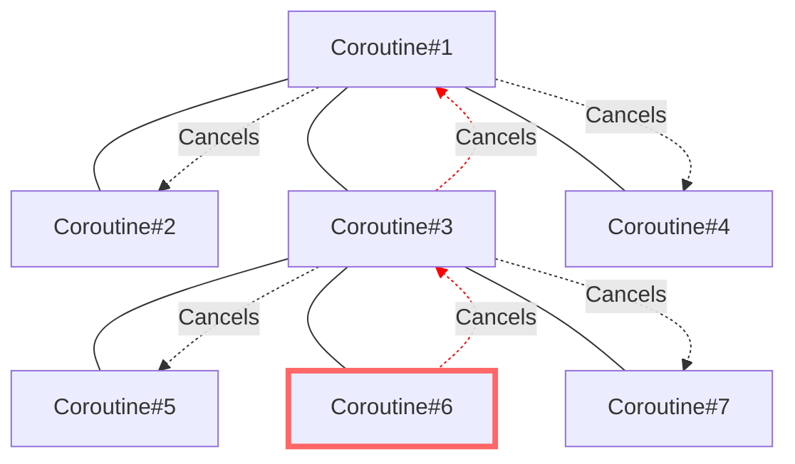
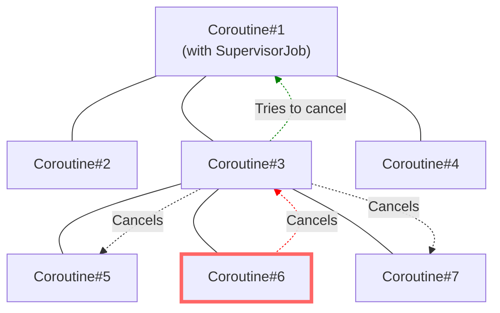
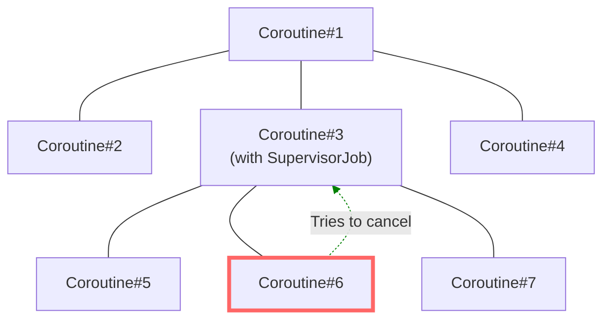
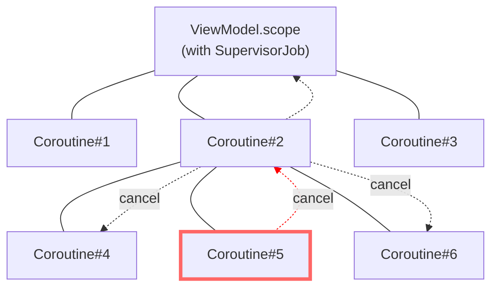
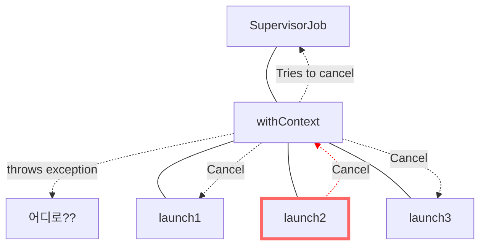

# Exception handling

코루틴 동작 방식엘서 중요한 부분 중 하나는 예외 처리입니다.

처리되지 않은 예외가 통과될 경우 프로그램이 중단되는 것처럼, 코루틴의 경우도 동일하게 중단됩니다.

예를 들어 스레드도 이러한 경우에 종료됩니다. 
그러나 스레드와 코루틴의 차이점으로는 코루틴 빌더가 부모도 취소하고, 각 취소된 부모가 모든 자식을 취소한다는 점입니다.

아래 예시를 보면 코루틴이 예외를 받으면 자신을 취소하고 예외를 부모(`launch`)에 전파합니다. 부모는 자신과 모든 자식을 취소한 다음, 그 예외를 그의 부모(`runBlocking`)에 전파합니다.

`runBlocking`은 루트 코루틴이므로 그냥 프로그램을 종료시킵니다.

```kotlin
fun main(): Unit = runBlocking {
    launch {
        launch {
            delay(1000)
            throw Error("Some error")
        }
        
        launch {
            delay(2000)
            println("Will not be printed")
        }
        
        launch {
            delay(500) // faster than the exception
            println("Will be printed")
        }
    }
    
    launch {
        delay(2000)
        println("Will not be printed")
    }
}

// Will be printed
// Exception in thread "main" java.lang.Error: Some error
```

추가적인 `launch` 코루틴을 추가해도 아무 것도 변경되지 않습니다. 
예외의 전파는 양방향입니다. 예외는 자식에서 부모로 전파되고, 그 부모가 취소되면 그들의 자식도 취소합니다.

따라서 예외 전파가 중단되지 않으면 계층 구조에서 모든 코루틴이 취소됩니다.



---

## Stop breaking my coroutines

코루틴에서 `try-catch`를 사용하여 예외를 잡으려 하더라도, 이는 `launch` 블록 자체를 감싸는 형태로는 동작하지 않습니다.
왜냐하면 `launch`가 즉시 반환되고 내부에서 발생하는 예외는 별도의 `Job`을 통해 전달되기 때문입니다.

```kotlin
fun main(): Unit = runBlocking {
    // Don't wrap in a try-catch here. It will be ignored.
    try {
        launch {
            delay(1000)
            throw Error("Some error")
        }   
    } catch (e: Throwable) { // nope, does not help here
        println("Will not be printed")
    }
    
    launch {
        delay(2000)
        println("Will not be printed")
    }
}
// Exception in thread "main" java.lang.Error: Some error
```

### SupervisorJob

`SupervisorJob`은 일반 `Job`과 비슷하지만 차이가 있습니다.

일반 `Job`은 자식 코루틴에서 예외가 발생하면 부모 코루틴도 취소되지만, `SupervisorJob`은 자식 코루틴에서 발생한 예외가 부모 코루틴에 영향을 주지 않습니다.

이렇게 하면 하나의 자식 코루틴에서 예외가 발생해도 다른 자식 코루틴이나 부모 코루틴이 중단되지 않습니다.





`SupervisorJob`은 일반적으로 여러 코루틴을 시작하는 `Scope`의 일부로 사용됩니다.

아래 예제를 보면 `CoroutineScope` 생성 시 `SupervisorJob`을 인자로 전달하는데,
이렇게 하면 이 `Scope`에서 시작된 모든 코루틴은 자동으로 `SupervisorJob`에 의해 관리됩니다.

```kotlin
fun main(): Unit = runBlocking {
    val scope = CoroutineScope(SupervisorJob())
    
    scope.launch {
        delay(1000)
        throw Error("Some error")
    }
    
    scope.launch {
        delay(2000)
        println("Will be printed")
    }
    delay(3000)
}
// Some error...
// Will be printed
```



자주 범하는 실수 중 하나는 아래 예제 코드처럼 `SupervisorJob`을 부모 코루틴의 인자로 사용하는 것입니다.

이런식으로 사용하게 되면 `SupervisorJob`은 오직 하나의 직접적인 자식만을 가지고 있기 때문에 예외 처리에 도움이 되지 않습니다.
즉, `SupervisorJob`을 사용하는 것과 그냥 `Job`을 사용하는 것 사이에는 별다른 이점이 없습니다.

```kotlin
fun main(): Unit = runBlocking {
    // Don't do that, SupervisorJob with one children and no parent works similar to just job
    launch(SupervisorJob()) { // 1
        launch {
            delay(1000)
            throw Error("Some error")
        }

        launch {
            delay(2000)
            println("Will not be printed")
        }
    }
    
    delay(3000)
}
// Some error...
```

아래 예제와 같이 `SupervisorJob`을 여러 코루틴 빌더의 컨텍스트로 사용하는 것이 더 효과적입니다.
이렇게 되면 각 코루틴은 취소될 수 있지만, 서로를 취소하지 않습니다.

```kotlin
fun main(): Unit = runBlocking {
    val job = SupervisorJob()
    
    launch(job) {
        delay(1000)
        throw Error("Some error")
    }
    
    launch(job) {
        delay(2000)
        println("Will be printed")
    }
    
    job.join()
}
// 1s delay
// Some error...
// 2s delay
// Will be printed
```

### supervisorScope

`supervisorScope`는 예외 전파를 중단하는 또 다른 방법을 제공합니다.
부모 코루틴과의 연결을 유지하면서도 자식 코루틴에서 발생하는 예외를 무시하거나 제어할 수 있습니다.

```kotlin
fun main(): Unit = runBlocking {
    supervisorScope {
        launch {
            delay(1000)
            throw Error("Some error")
        }
        
        launch {
            delay(2000)
            println("Will be printed")
        }
    }
    
    delay(1000)
    println("Done")
}
// Some error...
// Will be printed
// 1s delay
// Done
```

`supervisorScope`는 단순한 suspension 함수이며 suspension 함수의 본문을 감싸는 데 사용할 수 있습니다.

```kotlin
suspend fun notifyAnalytics(actions: List<UserAction>) = supervisorScope {
    actios.forEach { action -> 
        launch {
            notifyAnalytics(action)
        }
    }
}
```

`coroutineScope`는 부모 코루틴에게 예외를 전파하지 않고, 해당 스코프 내에서 예외를 잡을 수 있게 해줍니다.
이는 `launch`, `async`와 같은 코루틴 빌더와의 차이점 입니다. 
코루틴 빌더는 자체적으로 예외를 잡지 않기 때문에, 부모 코루틴에게 예외가 전파될 가능성이 높습니다.

`supervisorScope`와 `withContext(SupervisorJob())`은 서로 다릅니다.
`supervisorScope`는 자식 코루틴의 예외가 부모 코루틴에게 전파되지 않도록 하는 반면에 `withContext(SupervisorJob())`는 이를 보장하지 않습니다.

    `supervisorScope` != `withContext(SupervisorJob())`

```kotlin
// Don't do that
suspend fun sendNotifications(
    notifications: List<Notification>
) = withContext(SupervisorJob()) {
    notifications.forEach { notification ->
        launch {
            client.send(notification)
        }
    }
}
```

코루틴 컨테스트에서 `Job`은 유일하게 상속되지 않는 컨텍스트이므로 새로운 코루틴을 생성할 때마다 새로운 `Job` 인스턴스가 필요합니다.

위 코드를 보면 `withContext(SupervisorJob())`를 사용하여 `withContext` 블록에서 실행되는 코루틴들의 `Job`을 `SupervisorJob`가 부모 `Job`으로 형성되게 됩니다.
그러나 이 경우, `SupervisorJob`의 예외 무시 기능이 적용되지 않습니다. 왜냐하면 `withContext`는 단순히 코루틴의 컨텍스트를 변경하는 것이기 때문입니다.

따라서 `client.send(notification)`에서 예외가 발생되면, 그 예외는 `withContext` 코루틴으로 전파됩니다.
그 결과 모든 자식 코루틴이 취소되고 예외가 던져집니다.



---

## Await

`await`은 `async` 코루틴 빌더와 함께 사용되며, 비동기 작업의 결과를 가져오기 위한 메서드입니다.

만약 비동기 작업에서 예외가 발생하면, 일반적으로는 해당 코루틴의 부모 코루틴까지 예외가 전파되어 중단됩니다.  
이는 자식 코루틴의 실패가 부모 코루틴에 영향을 미치기 때문입니다.

하지만 `SupervisorJob`이나 `supervisorScope` 사용 시 자식 코루틴의 예외를 부모 코루틴으로 전파하지 않을 수 있습니다. 
이러한 경우에 `await` 호출 시 그 결과나 예외는 호출한 코루틴에서만 처리됩니다.

즉, 부모 코루틴이 중단되지 않아도 `await`는 여전히 해당 코루틴의 결과나 예외를 얻을 수 있는것 입니다.

```kotlin
class MyException: Throwable()

suspend fun main() = supervisorScope {
   val str1 = async<String> {
       delay(1000)
       throw MyException()
   }
    
    val str2 = async<String> {
        delay(2000)
        "Text2"
    }
    
    try {
        println(str1.await())
    } catch (e: MyException) {
        println(e)
    }
    
    println(str2.await())
}
// MyException
// Text2
```

---

## CancellationException does not propagate to its parent

예외가 `CancellationException`의 하위 클래스라면, 이 예외는 부모로 전파되지 않고 현재 코루틴만 취소합니다.

```kotlin
object MyNonPropageatingException: CancellationException()

suspend fun main(): Unit = coroutineScope {
    launch { // 1
        launch { // 2 
            delay(2000)
            println("Will not be printed")
        }
        throw MyNonPropageatingException // 3
    }
    
    launch { // 4
        delay(2000)
        println("Will be printed")
    }
}
// 2s delay
// Will be printed
```

---

## Coroutine exception handler

`CoroutineExceptionHandler`는 코루틴에서 예외 처리 시, 모든 예외에 대한 기본 동작을 정의하는데 유용합니다.

이 핸들러는 코루틴의 컨텍스트에 추가할 수 있으며, 예외가 발생하면 지정된 코드 블록이 실행됩니다.  
그러나 예외 전파를 멈추지 않기에 아래 예제처럼 `SupervisorJob`과 같이 사용하면 효율적입니다.

```kotlin
fun main(): Unit = runBlocking {
    val handler = CoroutineExceptionHandler { ctx, e -> println("Caught $e") }
    
    val scope = CoroutineScope(SupervisorJob() + handler)
    
    scope.launch { 
        delay(1000)
        throw Error("Some error")
    }
    
    scope.launch {
        delay(2000)
        println("Will be printed")
    }
    
    delay(3000)
}
// Caught java.lang.Error: Some error
// Will be printed
```