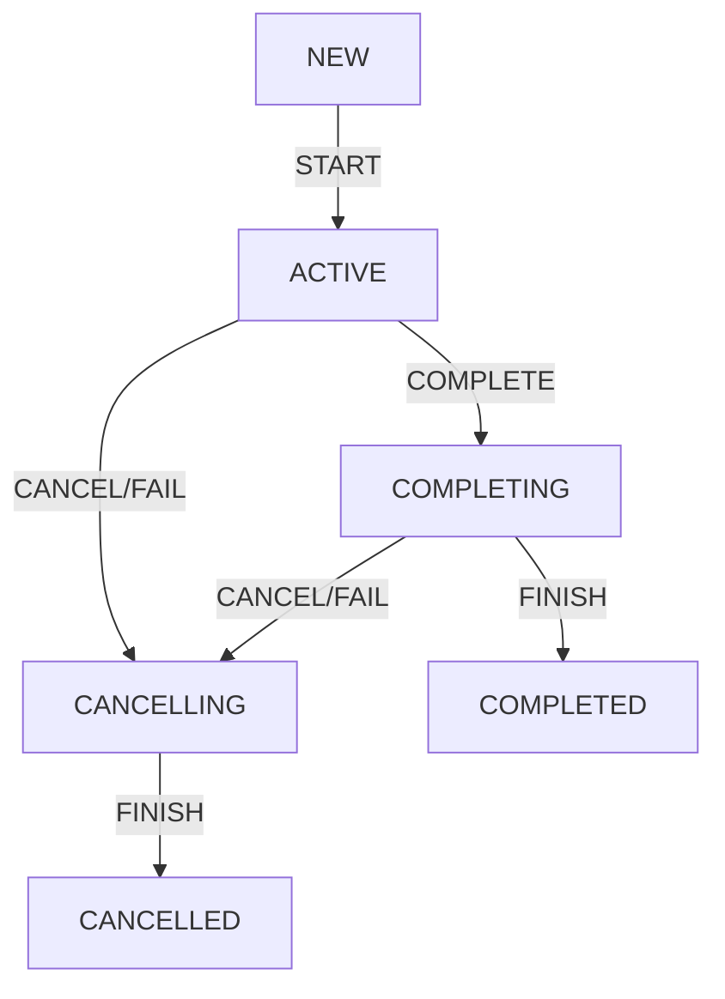

# Jobs and awaiting children

[구조적 동시성](../Structured%20Concurrency.md)에서 설명한것과 같이 코루틴에서 부모 코루틴 내부에서 자식 코루틴을 생성하면 이 관계는 다음과 같은 특징을 가집니다.

- 자식 코루틴은 부모 코루틴의 컨텍스트를 상속합니다.
- 부모 코루틴은 자식 코루틴이 모두 완료될 때까지 완료되지 않습니다.
- 부모 코루틴이 취소되면 자식 코루틴도 취소됩니다.
- 자식 코루틴이 파괴되면 부모 코루틴도 파괴됩니다.

```kotlin
fun main(): Unit = runBlocking(CoroutineName("main")) {
    val name = coroutineContext[CoroutineName]?.name
    println(name) // main

    launch {
        delay(1000)
        val name = coroutineContext[CoroutineName]?.name
        println(name) // main
    }
}
```

이 원칙들은 대부분 `Job` 컨텍스트에 크게 의존하게 됩니다.  
`Job` 컨텍스트는 코루틴을 취소하거나, 상태를 추적하고 다른 기능을 제공할 수 있습니다.

---

## What is Job?

`Job`은 취소 가능한 작업을 나타내는 개념으로 Kotlin에서는 인터페이스로 정의되어 있지만, 구체적인 계약과 상태를 가지고 있어 추상 클래스처럼 취급될 수 있습니다.

`Job`의 생명 주기는 아래와 같은 상태(State)와 전이(Transition)로 나타낼 수 있습니다.

### Job State

1. 새로 생성된 `Job`은 `NEW` 상태에서 시작됩니다.
2. `START`를 통해 `ACTIVE` 상태가 됩니다.
3. `ACTIVE` 상태에서는 실제 작업이 실행됩니다.
4. 작업이 완료되면 `COMPLETING` 상태로 전환되고, 그 다음 `COMPLETED` 상태로 전환됩니다.
5. `ACTIVE`나 `COMPLETING` 상태에서 실패하거나 취소되면, `CANCELLING` 상태로 전환됩니다.
6. `CANCELLING` 상태에서 리소스를 해제하고 `CANCELLED` 상태로 전환됩니다.



`Job`이 Activie 상태에 있을 때, 이 작업은 실행 중이며 실제 작업을 수행하고 있습니다.

만약 `Job`이 코루틴 빌더로 생성되었다면, `Active` 상태에서 코루틴의 본문(body)이 실행됩니다.  
또한 `Active` 상태에서는 자식 코루틴을 시작할 수 있습니다.

대부분의 코루틴은 `Active` 상태에서 시작하지만, 지연(lazy) 옵션을 사용한 코루틴은 New 상태에서 시작됩니다.
이러한 코루틴은 `Active` 상태로 전환되기 위해 명시적으로 시작시켜야 하며, 코루틴이 본문을 실행할 때는 `Active` 상태에 있습니다.

본문 실행이 끝나면, `Job`의 상태는 `Completing` 상태로 전환되고 자식 코루틴의 완료를 기다립니다.
이 후에 모든 자식 코루틴이 완료되면 `Job`의 상태는 `Completed` 상태로 전환됩니다.

`Active` 또는 `Completing` 상태에서 작업이 취소되거나 실패하게되면, 상태는 `Cancelling` 상태로 전환됩니다.
`Cancelling` 상태에서 마지막으로 정리(clean-up)를 수행한 후, `Job`은 `Cancelled` 상태로 전환됩니다.

아래 예제는 `Job`의 상태 변화를 관찰하는 예시이며 `join`을 사용하면 코루틴 완료를 대기합니다.

```kotlin
suspend fun main() = coroutineScope {
    // Job created with a builder is active
    val job = Job()
    println(job) // "Job(active)"

    // until we complete it with a method
    job.complete()
    println(job) // "Job(completed)"

    // launch is initially active by default
    val activeJob = launch { delay(1000) }
    println(activeJob) // "StandaloneCoroutine{Active}@7b69c6c2"

    // here we await until this job is done
    activeJob.join() // 1s delay
    println(activeJob) // "StandaloneCoroutine{Completed}@7b69c6c2"

    // launch started lazily is in new state
    val lazyJob = launch(start = CoroutineStart.LAZY) { delay(1000) }
    println(lazyJob) // "LazyStandaloneCoroutine{New}@7b69c6c2"
    // we need to start it, to make it active
    lazyJob.start()
    println(lazyJob) // "LazyStandaloneCoroutine{Active}@7b69c6c2"
    lazyJob.join() // 1s delay
    println(lazyJob) // "LazyStandaloneCoroutine{Completed}@7b69c6c2"
}
```

### Job StateCheck

`isActive`, `isCompleted`, `isCancelled` 등의 속성을 통해 `Job`의 상태를 확인할 수 있습니다.

| state      | isActive | isCompleted | isCancelled |
|------------|----------|-------------|-------------|
| New        | false    | false       | false       |
| Active     | true     | false       | false       |
| Completing | true     | false       | false       |
| Cancelling | false    | false       | true        |
| Cancelled  | false    | true        | true        |
| Completed  | false    | true        | false       |

---

## Coroutine builders create their jobs based on their parent job

코루틴 라이브러리의 모든 코루틴 빌더는 자체 `Job`을 생성합니다.

대부분의 코루틴 빌더들은 이 `Job`을 반환하므로 다른곳에서도 사용할 수 있으며, 이는 `launch`에서 명확하게 확인할 수 있습니다.

```kotlin
fun launchTest(): Unit = runBlocking {
    val job: Job = launch {
        delay(1000)
        println("Test")
    }
}

fun asyncTest(): Unit = runBlocking {
    val deferred: Deferred<String> = async {
        delay(1000)
        "Test"
    }

    val job: Job = deferred
}
```

`Job`은 코루틴 컨텍스트이므로 `coroutineContext[Job]`을 통해 접근할 수 있으며 
확장 프로퍼티 `job`을 통해 더 쉽게 `Job`에 접근할 수 있습니다.

```kotlin
// extension
val coroutineContext.job: Job
    get() = get(Job) ?: error("Current context doesn't...")

// usage
fun main(): Unit = runBlocking {
    print(coroutineContext.job.isActive) // true
}
```

`Job`은 **코루틴에서 코루틴으로 자동으로 상속되지 않은 유일한 코루틴 컨텍스트**입니다.

대신 새로운 코루틴은 자신만의 `Job` 인스턴스를 생성합니다.
이는 코루틴이 부모 코루틴의 `Job`을 사용하지 않고, 자신만의 `Job`을 생성한다는 것을 의미합니다.

그렇다면 모든 코루틴은 부모-자식 관계가 성립되어야 하는데 부모 코루틴의 `Job`은 어떻게 자식 코루틴 `Job`의 부모가 될까요?

새로운 코루틴이 생성되면 그 코루틴은 부모 코루틴의 `Job`을 '참조'하게 됩니다. 
이는 상속과는 다르며, 새로운 코루틴은 부모 `Job`을 '부모로서' 참조하는 것입니다.

즉, 새로운 코루틴의 `Job`은 부모 코루틴의 `Job`을 참조하여 부모-자식 관계를 형성한다고 볼 수 있습니다.

```kotlin
fun main(): Unit = runBlocking {
    val name = CoroutineName("Some name")
    val job = Job()
    
    launch(name + job) {
        val childName = coroutineContext[CoroutineName]
        println(childName == name) // true
        val childJob = coroutineContext[Job]
        println(childJob == job) // false
        println(childJob == job.children.first()) // true
    }
}
```

부모 코루틴은 자신의 모든 자식 코루틴을 참조할 수 있고, 자식 코루틴도 부모 코루틴을 참조할 수 있습니다.  
이러한 관계는 코루틴 범위 내에서 취소 및 예외 처리를 구현할 수 있도록 합니다.

```kotlin
fun main(): Unit = runBlocking {
    val job: Job = launch { delay(1000) }
    
    val parentJob: Job = coroutineContext.job // or coroutineContext[Job]!!
    println(job == parentJob) // false
    val parentChildren: Sequence<Job> = parentJob.children
    println(parentChildren.first() == job) // true
}
```

부모 `Job` 컨텍스트가 새로운 `Job`으로 대체될 경우 구조적 동시성 메커니즘은 동작되지 않습니다.  
이러한 경우 부모 코루틴은 자식 코루틴을 기다리지 않고 끝내버립니다.

```kotlin
fun main(): Unit = runBlocking {
    launch(Job()) { // the new job replaces one from parent
        delay(1000)
        println("Will not be printed")
    }
}
// nothing is printed
```

---

## Waiting for children

`Job`의 중요한 기능 중 하나는 코루틴이 완료될 때까지 기다리는 것이 가능하다는 것입니다. 이를 위해 `join` 메서드를 사용합니다.

`join`은 suspend 함수로 호출한 코루틴을 일시 중단시키고 지정된 `Job`이 완료(`Cancelled` or `Completed` 상태)될 때까지 기다립니다.

```kotlin
fun main(): Unit = runBlocking {
    val job1 = launch {
        delay(1000)
        println("Job1")
    }
    
    val job2 = launch {
        delay(2000)
        println("Job2")
    }
    
    job1.join()
    job2.join()
    println("Done")
}
// 1s delay
// Job1
// 1s delay
// Job2
// Done
```

`Job`은 자식 코루틴을 참조할 수 있는 `children` 프로퍼티를 제공하며, 이를 통해 모든 자식 코루틴이 완료될 때까지 기다릴 수 있습니다.

아래와 같이 부모 코루틴의 `Job`에서 `children`을 가져와 각각에 대해 `join`을 호출할 수 있습니다.

```kotlin
fun main(): Unit = runBlocking {
    launch { 
        delay(1000)
        println("Test1")
    }
    
    launch { 
        delay(2000)
        println("Test2")
    }
    
    val children = coroutineContext[Job]?.children
    val childrenNum = children?.count()
    println("Number of children: $childrenNum")
    children?.forEach { it.join() }
    println("Done")
}

// Number of children: 2
// 1s delay
// Test1
// 1s delay
// Test2
// Done
```

---

## Job factory function

`Job()` 팩토리 함수 사용 시 코루틴과 연결되지 않은 `Job` 인스턴스를 생성할 수 있습니다.

`Job()`을 통해 생성된 `Job`은 다른 코루틴들의 부모로 사용될 수 있습니다. 
단, 모든 자식 코루틴이 끝난 상태에서 `join`을 호출하더라도 이 `Job`은 여전히 `Active` 상태로 남아 있어 종료되지 않는 문제가 발생할 수 있습니다.

```kotlin
suspend fun main(): Unit = coroutineScope {
    val job = Job()
    
    launch(job) { // thr new job replaces one from parent
        delay(1000)
        println("Text 1")
    }
    
    launch(job) { // thr new job replaces one from parent
        delay(2000)
        println("Text 2")
    }
    
    job.join() // Here we will await forever
    println("Will not be printed")
}

// 1s delay
// Text 1
// 1s delay
// Text 2
// runs forever
```

위와 같은 문제를 해결하기 위해 `Job.children`을 활용하여 모든 자식 코루틴에 `join`을 호출하는 것이 좋습니다.

```kotlin
suspend fun main(): Unit = coroutineScope {
    val job = Job()
    
    launch(job) { // thr new job replaces one from parent
        delay(1000)
        println("Text 1")
    }
    
    launch(job) { // thr new job replaces one from parent
        delay(2000)
        println("Text 2")
    }
    
    job.children.forEach { it.join() }
}

// 1s delay
// Text 1
// 1s delay
// Text 2
```

실제로 `Job()`은 `CompletableJob`이라는 하위 인터페이스 타입의 객체를 반환합니다.

```kotlin
public fun Job(parent: Job? = null): CompletableJob
```

`CompletableJob`은 `Job`의 기능을 확장해 `complete()`와 `completeExceptionally()` 메서드를 제공합니다.

### CompletableJob - complete(): Boolean

`Job`을 완료시키며, 이 메서드를 호출하면, 모든 자식 코루틴이 모두 끝날 때까지 계속 실행됩니다.  
그러나 이후에는 이 `Job`에서 새로운 코루틴을 시작할 수 없습니다. 

- 결과값이 `true`라면 이 메서드 호출에 의해 `Job`이 완료되었음을 의미합니다.
- 결과값이 `false`라면 이 `Job`이 이미 완료되었음을 의미합니다.

```kotlin
fun main() = runBlocking {
    val job = Job()
    
    launch(job) {
        repeat(5) { num -> 
            delay(200)
            println("Req$num")
        }
    }
    
    launch {
        delay(500)
        job.complete()
    }
    
    job.join()
    
    launch(job) { println("Will not be printed") }
    
    println("Done")
}

// Req0
// Req1
// Req2
// Req3
// Req4
// Done
```

### CompletableJob - completeExceptionally(exception: Throwable): Boolean

주어진 예외와 함께 `Job`을 완료시킵니다.  
이로 인해 모든 자식 코루틴은 즉시 취소되며 `CancellationException`이 주어진 예외를 감싸고 있습니다.

반환 값은 `complete()`와 동일하게, 이 메서드 호출로 인해 `Job`이 완료되었는지 아닌지를 나타냅니다.

```kotlin
fun main() = runBlocking {
    val job = Job()
    
    launch(job) { 
        repeat(5) { num -> 
            delay(200)
            println("Req$num")
        }
    }
    
    launch {
        delay(500)
        job.complteExceptionally(Error("Some Error"))
    }
    
    job.join()
    
    launch(job) { println("Will not be printed") }
    
    println("Done")
}

// Req0
// Req1
// Done
```

`complete()`은 마지막 코루틴을 `Job`에서 시작한 후에 자주 사용됩니다.

`complete()`를 호출하면, `Job` 내에 실행 중인 모든 자식 코루틴들이 완료될 때까지 실행을 계속하게 됩니다.
또한 `job.join()`을 사용하여 `Job`의 완료를 대기할 수 있습니다.

이렇게 하면 모든 코루틴이 완료된 후에만 프로그램이 종료됩니다.

```kotlin
suspend fun main(): Unit = coroutineScope {
    val job = Job()
    launch(job) { 
        delay(1000)
        println("Text 1")
    }
    
    launch(job) { 
        delay(2000)
        println("Text 2")
    }
    job.complete()
    job.join()
}

// 1s delay
// Text 1
// 1s delay
// Text 2
```

`Job()`에 부모 `Job`을 인자로 전달할 수 있습니다. 부모 `Job`이 취소되면, 자식 `Job`도 같이 취소됩니다.  
이를 통해 부모-자식 관계를 활용하여 코루틴의 실행을 조율할 수 있습니다.

```kotlin
suspend fun main(): Unit = coroutineScope {
    val parentJob = Job()
    val job = Job(parentJob)

    launch(job) {
        delay(1000)
        println("Text 1")
    }

    launch(job) {
        delay(2000)
        println("Text 2")
    }

    delay(1100)
    parentJob.cancel()
    job.children.forEach { it.join() }
}
// Text 1
```