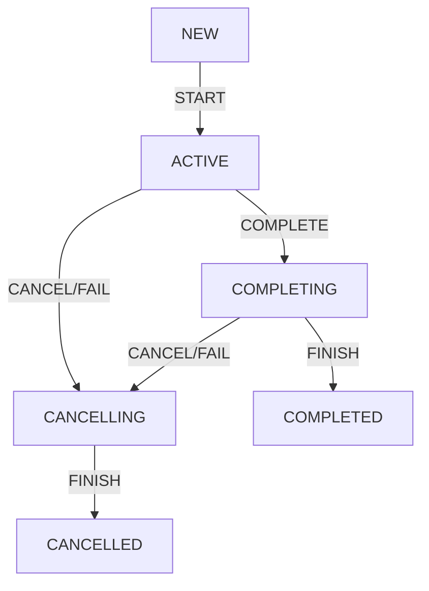

# Jobs and awaiting children

[구조적 동시성](../Structured%20Concurrency.md)에서 설명한것과 같이 코루틴에서 부모 코루틴 내부에서 자식 코루틴을 생성하면 이 관계는 다음과 같은 특징을 가집니다.

- 자식 코루틴은 부모 코루틴의 컨텍스트를 상속합니다.
- 부모 코루틴은 자식 코루틴이 모두 완료될 때까지 완료되지 않습니다.
- 부모 코루틴이 취소되면 자식 코루틴도 취소됩니다.
- 자식 코루틴이 파괴되면 부모 코루틴도 파괴됩니다.

```kotlin
fun main(): Unit = runBlocking(CoroutineName("main")) {
    val name = coroutineContext[CoroutineName]?.name
    println(name) // main

    launch {
        delay(1000)
        val name = coroutineContext[CoroutineName]?.name
        println(name) // main
    }
}
```

이 원칙들은 대부분 `Job` 컨텍스트에 크게 의존하게 됩니다.  
`Job` 컨텍스트는 코루틴을 취소하거나, 상태를 추적하고 다른 기능을 제공할 수 있습니다.

---

## What is Job?

`Job`은 취소 가능한 작업을 나타내는 개념으로 Kotlin에서는 인터페이스로 정의되어 있지만, 구체적인 계약과 상태를 가지고 있어 추상 클래스처럼 취급될 수 있습니다.

`Job`의 생명 주기는 아래와 같은 상태(State)와 전이(Transition)로 나타낼 수 있습니다.

### Job State

1. 새로 생성된 `Job`은 `NEW` 상태에서 시작됩니다.
2. `START`를 통해 `ACTIVE` 상태가 됩니다.
3. `ACTIVE` 상태에서는 실제 작업이 실행됩니다.
4. 작업이 완료되면 `COMPLETING` 상태로 전환되고, 그 다음 `COMPLETED` 상태로 전환됩니다.
5. `ACTIVE`나 `COMPLETING` 상태에서 실패하거나 취소되면, `CANCELLING` 상태로 전환됩니다.
6. `CANCELLING` 상태에서 리소스를 해제하고 `CANCELLED` 상태로 전환됩니다.



`Job`이 Activie 상태에 있을 때, 이 작업은 실행 중이며 실제 작업을 수행하고 있습니다.

만약 `Job`이 코루틴 빌더로 생성되었다면, `Active` 상태에서 코루틴의 본문(body)이 실행됩니다.  
또한 `Active` 상태에서는 자식 코루틴을 시작할 수 있습니다.

대부분의 코루틴은 `Active` 상태에서 시작하지만, 지연(lazy) 옵션을 사용한 코루틴은 New 상태에서 시작됩니다.
이러한 코루틴은 `Active` 상태로 전환되기 위해 명시적으로 시작시켜야 하며, 코루틴이 본문을 실행할 때는 `Active` 상태에 있습니다.

본문 실행이 끝나면, `Job`의 상태는 `Completing` 상태로 전환되고 자식 코루틴의 완료를 기다립니다.
이 후에 모든 자식 코루틴이 완료되면 `Job`의 상태는 `Completed` 상태로 전환됩니다.

`Active` 또는 `Completing` 상태에서 작업이 취소되거나 실패하게되면, 상태는 `Cancelling` 상태로 전환됩니다.
`Cancelling` 상태에서 마지막으로 정리(clean-up)를 수행한 후, `Job`은 `Cancelled` 상태로 전환됩니다.

아래 예제는 `Job`의 상태 변화를 관찰하는 예시이며 `join`을 사용하면 코루틴 완료를 대기합니다.

```kotlin
suspend fun main() = coroutineScope {
    // Job created with a builder is active
    val job = Job()
    println(job) // "Job(active)"

    // until we complete it with a method
    job.complete()
    println(job) // "Job(completed)"

    // launch is initially active by default
    val activeJob = launch { delay(1000) }
    println(activeJob) // "StandaloneCoroutine{Active}@7b69c6c2"

    // here we await until this job is done
    activeJob.join() // 1s delay
    println(activeJob) // "StandaloneCoroutine{Completed}@7b69c6c2"

    // launch started lazily is in new state
    val lazyJob = launch(start = CoroutineStart.LAZY) { delay(1000) }
    println(lazyJob) // "LazyStandaloneCoroutine{New}@7b69c6c2"
    // we need to start it, to make it active
    lazyJob.start()
    println(lazyJob) // "LazyStandaloneCoroutine{Active}@7b69c6c2"
    lazyJob.join() // 1s delay
    println(lazyJob) // "LazyStandaloneCoroutine{Completed}@7b69c6c2"
}
```

### Job StateCheck

`isActive`, `isCompleted`, `isCancelled` 등의 속성을 통해 `Job`의 상태를 확인할 수 있습니다.

| state      | isActive | isCompleted | isCancelled |
|------------|----------|-------------|-------------|
| New        | false    | false       | false       |
| Active     | true     | false       | false       |
| Completing | true     | false       | false       |
| Cancelling | false    | false       | true        |
| Cancelled  | false    | true        | true        |
| Completed  | false    | true        | false       |