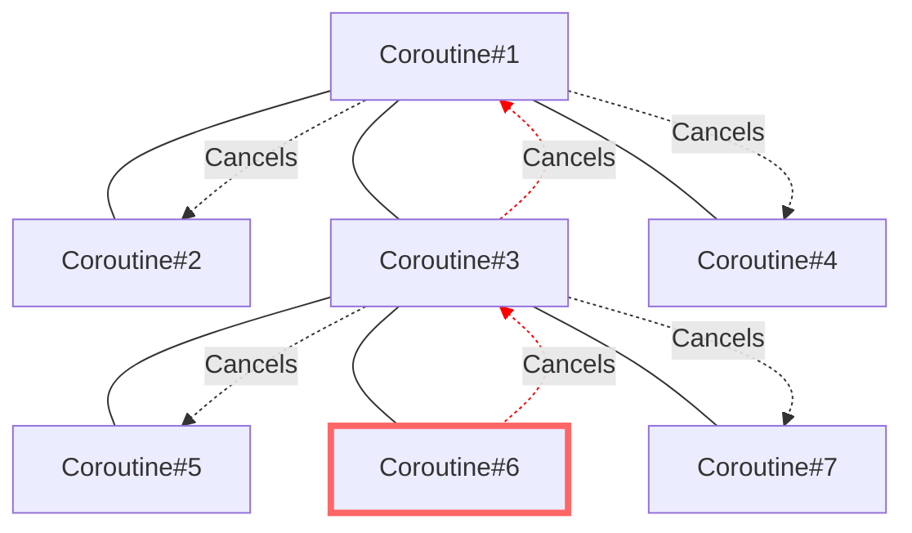
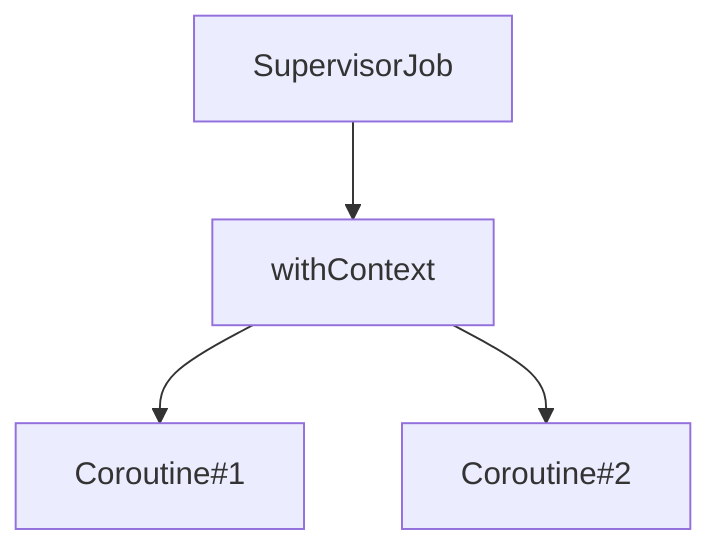
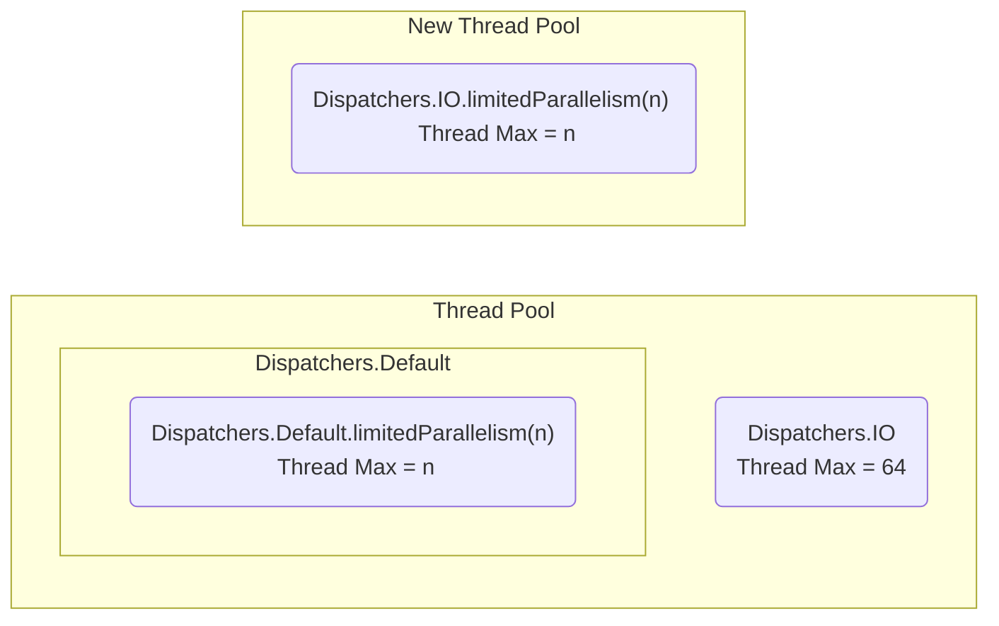
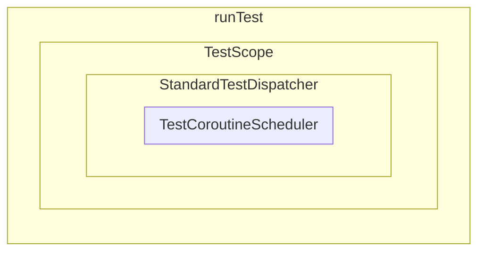

# Kotlin Coroutines library

코루틴을 제대로 사용하기 위해 필요한 모든 것을 배우며 아래의 항목들을 정리하는 파트 입니다.

## 목차

- [Coroutine Builder](#part-21--coroutine-builder)
- [CoroutineContext](#part-22--coroutine-context)
- [Job and awaiting children](#part-23--jobs-and-awaiting-children)
- [Cancellation](#part-24--cancellation)
- [Exception handling](#part-25--exception-handling)
- [Coroutine scope functions](#part-26--coroutine-scope-functions)
- [Dispatchers](#part-27--dispatchers)
- [Construncting a coroutine scope](#part-28--constructing-a-coroutine-scope)
- [The problem with shared state](#part-29--the-problem-with-shared-state)
- [Testing Kotlin coroutines](#part-210--testing-kotlin-coroutines)

## [Part 2.1 : Coroutine Builder](코루틴%20빌더.md)

> - '일반 함수' → 'suspending function' 호출 X, 'suspending function' → '일반 함수' 또는 'suspending function' 호출 O
> - 일반적으로 'CoroutineBuilder'에서 'suspending function' 시작하며 종류는 다음과 같음
>   - `launch` : '로직 실행'을 위한 'Coroutine' 실행, `Job`을 반환
>   - `async` : '값 생성'을 위한 'Coroutine' 실행, `Deferred<T>`를 반환
>   - `runBlocking` : Coroutine 중단 X, Thread Blocking O, 주로 'Unit Test' 또는 Thread Blocking이 필요한 경우 사용
> - Structured Concurrency : Parent → Child CoroutineScope 제공, 'Child Coroutine'은 Parent CoroutineScope 내에서 '관리'
>   - 'Child'는 'Parent CoroutineContext'를 상속 받거나, 덮어쓰기 가능
>   - 'Parent'는 'Child'가 완료될 때까지 '중단'
>   - 'Parent'가 '취소'되면, 'Child'도 '취소'
>   - 'Child'에서 알 수 없는 '예외' 발생 시, 'Parent' 파괴
> - 

'suspending function'에서 일반 함수를 호출하는데 문제는 없지만, 일반 함수에서 'suspending function'를 호출할 수 없습니다.   
즉, 'suspending function'은 다른 'suspending function'에서 호출되어야 하며, 이들은 'Coroutine Builder'로 시작됩니다.

---

`launch`를 통해 시작된 'Coroutine'은 호출한 Thread와는 독립적으로 실행됩니다.  
즉, 'MainTherad' 또는 '다른 Thread'의 실행 흐름에 영향을 주지 않고, 별도의 실행 경로를 갖습니다.

`launch`는 `CoroutineScope`의 확장 함수 입니다.   
이는 `launch`를 호출한 'Parent Coroutine'과 `launch`를 통해 시작된 'Child Coroutine' 간에 'Structured Concurrency'이 형성됨을 의미합니다.

`launch`는 'Daemon Thread'와 비슷한 방식으로 작동하지만, 프로세스 진행 중 'Blocking'이 발생될 경우 차이점이 발생하게 됩니다.  
'Daemon Thread'의 경우 'Blocking Thread'를 유지하는 데 비용이 발생하지만, 'Coroutine'의 경우 비용이 거의 발생하지 않습니다.

---

일반적으로 'Coroutine'은 'Thread 'Blocking'을 목표로 하지 않지만, Thread를 일시적으로 차단해야 하는 상황이 생길 수 있습니다.  
이런 경우에 `runBlocking`을 사용할 수 있습니다.

`runBlocking`은 'Coroutine'이 중단될 때, 해당 'Coroutine'을 시작한 Thread를 'Blocking' 합니다.
즉, `runBlocking` 내에서 `Thread.sleep(1000L)`과 `delay(1000)`가 동일하게 동작함을 의미하며, 'Unit Test'시 유용하게 사용할 수 있습니다.

`runBlocking`은 `CoroutineScope`의 확장 함수가 아니기에, 'Child Coroutine'이 될 수 없으며, 오직 'Root Coroutine' 만으로 사용됩니다.

---

`async`는 `launch`와 유사하게 'Coroutine'을 시작하지만, `async`는 '값 생성'에 중점을 두고, `launch`는 '로직 실행'에 중점을 둡니다.

`async`는 'lambda expression'을 통해 `Deferred<T>`를 반환합니다.  
`Deferred<T>`는 내부에 값을 '저장'하고 내보낼 '준비'가 되면, `await()` 호출 시 값을 '반환'합니다.  
만약 값이 준비가 되기 전에 `await()`을 호출하면, 값이 준비될 때까지 '중단'됩니다.

`async`는 2개의 프로세스를 '병렬'로 처리하여 동시에 값을 생성하는데 적합합니다.

---

'Structured Concurrency'는 'Parent Coroutine'이 'Child Coroutine'에게 'CoroutineScope'를 제공하고,
'Child Coroutine'은 'Parent Coroutine'의 'CoroutineScope' 내에서 호출되는 메커니즘을 의미합니다.

'Structured Concurrency'는 다음과 같은 효과를 얻습니다.

1. 'Child Coroutine'은 'Parent Coroutine'으로부터 `CoroutineContext`를 상속 받거나 덮어 쓸 수 있습니다.
2. 'Parent Coroutine'은 'Child Coroutine'이 '완료'될 때까지 '중단'됩니다.
3. 'Parent Coroutine'이 '취소'되면, 'Child Coroutine'도 '취소'됩니다.
4. 'Child Coroutine'에서 알 수 없는 '예외'가 발생하면, 'Parent Coroutine'은 파괴됩니다.

---

앞서 말했던것과 같이, 'suspending function'은 'Coroutine Builder'로 시작해야 하며,
`runBlocking`을 제외한 'Coroutine Builder'들은 `CoroutineScope`에서 시작되어야 합니다.

그러나 'suspending function'에는 `CoroutineScope`가 없기에, `coroutineScope { ... } `를 통해 'suspending function'에 'Scope'를 생성할 수 있습니다.  

즉, `coroutineScope { ... }`는 함수 자체가 'suspending function'으로 'lambda' 범위(`{ ... }`)에 `CoroutineScope`를 생성합니다.  
추가로 'lambda expression'의 마지막 값을 반환할 수 있습니다.

```kotlin
suspend fun getArticle(
    service: ApiService
): List<Article> = coroutineScope {
    return service.getArticle()
}
```

---

## [Part 2.2 : Coroutine Context](코루틴%20컨텍스트.md)

> - `CoroutineContext` : Job, CoroutineName 등 `Element`를 관리하는 인터페이스
> - `Elemnet` : `CoroutineContext.Element`로 구현, 그 `Element`는 다시 `CoroutineContext`로 구현
> - `Key`를 통해 `Element`들을 고유하게 식별 및 관리
>   - `get(Key)`, `[key]`를 통해 식별, 해당 `Element`가 없는 경우 `null` 반환
>   - `plus()`, `+`를 통해 여러 `CoroutineContext`를 합쳐, 새로운 `CoroutineContext` 생성
>   - `minusKey()`를 통해 특정 `Key`를 가진 `Element`를 제거
> - `Element`가 비어있는 `EmptyCoroutineContext` 활용 가능
> - 'Structured Concurrency'로 '상속'받은 `CoroutineContext`를 'Child'는 이를 override'하여 사용할 수 있음
>   - CoroutineContext 간소화된 계산식 : `defaultContext + parentContext + childContext`
> - `CoroutineContext` 접근 방법
>   - CoroutineScope : `CoroutineScope.coroutineContext`를 통해 접근
>   - 'suspending function' : `continuation`의 `CoroutineContext`를 통해 'Parent Coroutine'의 `coroutineContext` 접근

`CoroutineContext`는 'Coroutine'의 여러 `Element`(`Job`, `CoroutineName`, `CoroutineDispatcher` 등)을 관리하는 인터페이스입니다.

```kotlin
interface CoroutineContext {
    // ...

    interface Element : CoroutineContext {
        val key: Key<*>
    }
}

val name: CoroutineName = CoroutineName("Test")
val element: CoroutineContext.Element = name // OK
val context: CoroutineContext = element // OK
```

`Element`는 `CoroutineContext.Element`로 구현되며, `Element`은 다시 `CoroutineContext`로 구현됩니다.  
이는 각 `Element`가 그 자체로 `CoroutineContext`가 될 수 있음을 말합니다.

'Kotlin'에서 '클래스의 이름' 자체가 해당 클래스의 `companion object` 참조로 작용하는 특징으로 다음과 같은 호출이 허용됩니다.
이처럼 `companion object Key`는 `CoroutineName`, `Job` 등을 나타내며, '동일한 `Key`'를 가진 여러 클래스(`Job`, `SupervisorJob` 등)를 가리킬 수
있습니다.

```kotlin
data class CoroutineName(
    val name: String
) : AbstracCoroutineContextElement(CoroutineName) {
    companion object Key : CoroutineContext.Key<CoroutineName>
}

val context: CoroutineContext = CoroutineName("Test")
context.get(CoroutineName) // OK == context.get(CoroutineName.Key)
```

`CoroutineContext`는 `Key`를 통해 `Element`를 '식별'하고 '고유'하게 관리 할 수 있습니다.

- `get(Key)`, `[key]`를 통해 식별하고, 해당 `Element`가 없는 경우 `null` 반환
- `plus()`, `+`를 통해 여러 `CoroutineContext`를 합쳐, 새로운 `CoroutineContext` 생성 가능  
  단, `Key`가 서로 다른 경우 `Element`가 유지 되지만, 동일한 경우 새로운 `Element`가 이전 `Element`를 대체
- `minusKey()`를 통해 특정 `Key`를 가진 `Element`를 제거 가능

`CoroutineContext`은 '컬렉션'과 같은 성격을 갖기에, 'Empty Context' 인 `EmptyCoroutineContext`를 제공합니다.
또한 컬렉션의 `fold()`와 유사한 함수를 제공하여 `Element`에 대한 `fold` 연산을 수행할 수 있습니다.

---

기본적으로 'Parent Coroutine'은 'Child Coroutine'에게 `CoroutineContext`를 '상속'합니다.  
또한 'Child Coroutine'은 '상속'받은 `CoroutineContext`를 'override'하여 사용할 수 있습니다.

`CoroutineContext`를 계산하는 간소화된 공식입니다. : `defaultContext + parentContext + childContext`

동일한 `Key`를 갖는 `Element`가 존재하는 경우, '기존 `Element`'를 '새로운 `Element`'가 'override' 합니다.  
즉, 우선 순위로 따지면 default < parent < child 입니다.

`defaultContext`에는 기본 설정들이 적용되어 있습니다.  
`Dispatchers`의 경우 `Dispatchers.Default`가 적용, 디버그 모드에서는 `CoroutineId`가 적용됩니다.

---

`CoroutineScope`는 `coroutineContext`으로 현재 `CoroutineContext`에 접근할 수 있습니다.

하지만, 'suspending function'의 경우 `CoroutineScope`에 직접 접근할 수 없으므로,
`continuation`의 `CoroutineContext`를 통해 'Parent Coroutine'의 `CoroutineContext`에 접근이 가능합니다.

---

자체적인 `CoroutineContext` 생성 시, `CoroutineContext.Element`를 구현하는 클래스를 생성하면 됩니다.  
생성된 클래스에 `CoroutineContext.Key<*>` 타입의 `Key`와 `companion object Key`를 추가로 정의하면 됩니다.

```kotlin
class CounterCoroutineContext(val name: String) : CoroutineContext.Element {
    override val key: CoroutineContext.Key<*> = Key

    private var counter = 0
    fun printCounter() {
        println("$name : ${counter++}")
    }

    companion object Key : CoroutineContext.Key<CounterCoroutineContext>
}
```

---

## [Part 2.3 : Jobs and awaiting children](Job과%20자식%20코루틴의%20대기.md)

> - `Job`은 '상태'를 관리하고 추적하여 'Coroutine'의 'Lifecycle' 관리
>   -  
>   - ACTIVE : 'Coroutine'의 작업 '실행 중'
>   - NEW : `CoroutineStart.LAZY`가 적용된 'Coroutine'의 초기 상태, `Job.start()`로 'ACTIVE'로 전환 필요
>   - COMPLETING : 작업이 완료되고 'Child Coroutine'을 '기다리는' 상태
>   - COMPLETED : 'Child Coroutine'을 포함한 '모든 작업이 완료'된 상태
>   - CANCELLING : '취소•실패'가 발생한 상태, 리소스 해제 작업 수행 필요
>   - CANCELLED : 리소스 해제 작업을 끝내고 `Job`이 취소가 된 상태
>   - isActive, isCompleted, isCancelled 등으로 '상태' 확인 가능
> - `CoroutineContext.Element` 중 `Job`은 유일하게 'Parent'에서 'Child'로 '자동 상속'되지 않음
>   - 'Structured Concurrency' 형성을 위해 'Child Job'은 'Parent Job'을 '참조'하여 생성
> - `Job.join()`을 통해 `Job`이 완료될 때까지 'Coroutine 중단' 가능
> - 팩토리 함수 `Job()`은 `Job`의 하위 타입 `CompletableJob`을 반환, 이는 `complete()`, `completeExceptionally()` 제공
>   - `complete()` 
>     - `Job` 완료에 사용, 모든 'Child Coroutine'이 완료될 때까지 계속 실행
>     - `complete()` 호출 후, 해당 `Job`에서 새로운 'Coroutine' 시작 불가
>     - `complete()`로 인해 `Job` 완료 시 `true`, 이미 완료된 `Job`이면 `false`
>   - `completeExceptionally()`
>     - 주어진 '예외'와 함께 `Job` 완료하며, 모든 'Child Coroutine'을 모두 '취소'

'Structured Concurrency'를 통한 특징들은 다음과 같습니다.

1. 'Child Coroutine'은 'Parent Coroutine'의 `CoroutineContext` 상속
2. 'Parent Coroutine'은 'Child Coroutine'이 완료될 때까지 '중단'
3. 'Parent Coroutine'이 '취소'되면, 'Child Coroutine'도 '취소'
4. 'Child Coroutine'에서 알 수 없는 '예외'가 발생하면, 'Parent Coroutine'은 파괴

이 특징은 대부분 `CoroutineContext.Element` 중 하나인 `Job`에 의해 구현됩니다.

`Job`은 'Coroutine'의 'Lifecycle'을 관리하는 `CoroutineContext.Element`의 일부입니다.  
이는 인터페이스로 구현되지만, 구체적인 '상태'와 '동작'을 가지고 있어 '추상 클래스'처럼 사용될 수 있습니다.

---

'Coroutine'의 'Lifecycle'은 `Job`의 '상태'에 의해 표현됩니다.

'Coroutine Builder'로 `Job`이 생성된 경우, 해당 `Job`은 'ACTIVE' 상태로 시작됩니다.  
'ACTIVE' 상태에서는 'Coroutine'의 '작업을 실행'하며, 추가로 'Child Coroutine' 작업을 실행 할 수 있습니다.

`CoroutineStart.LAZY`이 적용된 'Coroutine'은 'NEW' 상태에서 시작되며, 'ACTIVE' 상태로 전환하기 위해 `Job.start()`을 통해 '명시적으로 시작'해야 합니다.

작업 완료 시, 해당 `Job`은 'Child Coroutine'을 기다리는 'COMPLETING' 상태로 변경됩니다.  
이 후 모든 'Child Coroutine'이 완료되면 'COMPLETED' 상태로 변경됩니다.

만약, 작업 실행 중('ACTIVE' or 'COMPLETING') '취소•실패'가 되면, 해당 `Job`은 'CANCELLING' 상태로 변경됩니다.
'CANCELLING' 상태에서는 리소스 해제와 같은 '정리 작업'을 할 수 있습니다. '정리 작업'이 완료되면 `Job`은 'CANCELLED' 상태로 변경됩니다.

`Job.join()`은 해당 `Job`이 '완료'될 때까지 'Coroutine'을 '중단'시키는데 사용됩니다.

이처럼 `Job`은 여러 상태로 변경되며, `isActive`, `isCompleted`, `isCancelled` 등으로 '상태' 확인이 가능합니다.

---

'Coroutine Builder'는 자체적으로 `Job`을 생성하여 반환하기에, 여러 곳에서 사용될 수 있습니다.  
또한 `Job`에 접근하는 방법으로는 `coroutineContext[Job]`, 확장 프로퍼티`job`을 사용하는 방법이 있습니다.
```kotlin
val launchJob: Job = launch { /* ... */ }

val deferred: Deferred<Int> = async { /* ... */ }
val asyncJob: Job = deferred // OK

val activeCheck = coroutineContext.job.isActive
```

`Job`은 'Parent Coroutine'에서 'Child Coroutine'으로 '자동 상속'되지 않는 유일한 `CoroutineContext` 입니다.  
대신 'Structured Concurrency' 형성을 위해 'Child Coroutine'의 `Job`은 'Parent Coroutine'의 `Job`을 '참조'하여 생성하도록 합니다.

만약, 'Parent Coroutine'의 `Job`을 상속하여 사용할 경우, 'Structured Concurrency'가 형성되지 않아, 그 특징을 잃게 됩니다.

---

`Job.join()`을 통해 `Job`이 완료될 때까지 'Coroutine 중단'이 가능합니다.  
`join()`은 'suspending function'에서 호출한 'Coroutine'을 '중단'시키고 지정된 `Job`의 상태가 'CANCELLED' 또는 'COMPLETED'가 될 때까지 기다립니다. 

이를 응용하면, `Job`은 `children` 프로퍼티로 모든 'Child Coroutine'이 완료될 때까지 기다릴 수 있습니다.

---

`Job()` 'Factory Function' 사용 시, 'Coroutine'과 연결되지 않은 `Job`을 생성할 수 있습니다.  
이렇게 생성된 `Job`은 여러 'Coroutine'의 'Parent'로 사용될 수 있음을 의미합니다.

이 때 만약, 'Parent Job'에서 `join()`을 하면 'Parent Job'이 'Child Coroutine'의 완료를 기다립니다.  
이런 경우 모든 'Child Coroutine'이 끝났어도, 'Parent Job'은 여전히 'Active' 상태로 유지되어 프로세스가 종료되지 않는 문제가 발생할 수 있습니다. 
 
더 나은 방법으로는 `Job`의 모든 'Child Coroutine'에 `join()`을 호출하여, 'Parent Job'을 기다리는 것이 아닌, 'Child Coroutine'의 완료를 기다리는 것입니다. 

`Job()`은 'constructor' 호출이 아닌, 'Factory Function' 호출 입니다.  
실제로 반환되는 타입은 `Job`의 하위 인터페이스인 `CompletableJob`입니다.

`CompletableJob`는 `Job`의 기능을 확장하여 `complete()`, `completeExceptionally()`를 제공합니다.

`complete()`는 `Job`을 완료하는 데 사용되며, `complete()`를 호출하면 모든 'Child Coroutine'이 완료될 때까지 계속 실행됩니다. 
그러나 `complete()` 호출 후 해당 `Job`에서 새로운 'Coroutine'을 시작할 수 없습니다.  
또한 `complete()`를 통해 `Job`이 완료 되었으면 `true`를 반환하고, 이미 완료된 `Job`이면 `false`를 반환합니다.

`completeExceptionally()`는 주어진 '예외'와 함께 `Job`을 완료합니다.
이로 인해 모든 'Child Coroutine'은 즉시 '취소'되며, `CancellationException`이 주어진 '예외'를 감쌉니다.

---

## [Part 2.4 : Cancellation](Cancellation.md)

> - `Job.cancel()`은 해당 `Job`을 '취소'  
>   - 첫 번째 'suspension point'에서 종료됨
>   - 'Child Coroutine' 존재 시 해당 'Coroutine'도 같이 '취소'
>   - '취소' 후 `Job`은 새로운 'Coroutine'의 부모로 사용될 수 없으며, '상태'가 `CANCELLING` → `CANCELLED`로 변경
> - `cancel(throwable: CancellationException)`으로 명확한 취소 가능
> - `cancel()` 시 `join()`을 호출 하지 않으면, 'Coroutine'의 완료까지 '중단'을 보장 받을 수 없음 
>   - `Job-COMPLETED` or `Job-CANCELLED` 보장 불가능
> - `try-catch-fianlly`로 `cancel()`시 `CancellationException`를 캐치 후, 'Parent'로 예외 전파 및 리소스 정리 가능
> - `Job-CANCELLING`에서 `withContext(NonCancellable)`을 통해 취소되지 않는 `Job-ACTIVE` 제공 가능
> - `invokeOnCompletion`을 통해 `Job`이 최종('COMPLETED' or 'CANCELLED') 상태 도달 시 실행할 'Handler' 설정 가능
>   - '리소스 해제', '다른 Coroutine에게 전파' 등의 작업 가능
>   - `throwable` 파라미터를 통해 'Coroutine 종료 상황' 확인 가능
>     - `== null` : 정상 종료
>     - `is CancellationException` : 취소
>     - `is Exception` : 예외 종료
> - `suspendCancellableCoroutine`을 통해 `CancellableContinuation<T>`으로 여러 작업 가능
>   - `invokeOnCancellation`을 통해 'Coroutine 취소' 시 어떤 작업을 수행할 지 결정 가능
>   - `Job` 상태 확인 후 '취소 원인'과 함께 `continuation` 취소 가능

`Job`에는 `cancel()`을 통해 '취소'할 수 있는 기능을 제공하며, 이는 다음과 같은 효과가 발생합니다.

- 해당 'Coroutine'은 첫 번째 'suspension point'에서 `Job`을 종료합니다.
- `Job`에 'Child Coroutine'이 존재하는 경우, 해당 'Child Coroutine'도 '취소'됩니다.
- `Job`이 '취소'되면, 새로운 'Coroutine'의 부모로 사용될 수 없으며, '상태'가 `CANCELLING` → `CANCELLED`로 변경됩니다.

`cancel(throwable: CancellationException)`을 통해 예외를 전달하여 'Coroutine'의 취소 원인을 명확하게 할 수 있습니다.

`join()`은 'Coroutine'을 '중단'시키고 해당 `Job`의 상태가 'CANCELLED' or 'COMPLETED' 될 때까지 기다립니다.   
이런 특성으로 `cancel()` 호출 후 `join()` 호출 시 'Coroutine'이 종료된 후 다음 작업을 수행함을 보장합니다.  
추가로 'Coroutine Library'에서는 `cancel()`와 `join()`을 같이 호출하는 `cancelAndJoin()` 확장 함수가 존재합니다.

`Job()` 팩토리 함수를 사용하여 생성된 `Job`도 동일한 방식으로 `cancel()`과 `join()`의 특징을 가집니다.

---

`Job`이 '취소'되면 CANCELLING'으로 변경되며, 'Coroutine'이 다음 'suspension point'에 도달하면 `CancellationException`이 발생됩니다.

발생된 `CancellationException`은 `try-catch`를 통해 잡을 수 있으며, 발생된 `throw`를 '상위'로 전파해야 'Strucutred Concurrency'가 제대로 적용됩니다.
또한 `CancellationException`은 '코루틴이 강제로 종료'되는 것이 아닌, '정상적인 예외 처리 흐름'을 따르게 하여 `finally` 블록을 통해 리소스 정리를 안전하게 정리할 수 있는 기회를 줍니다.

---

`cancel()` 후 `Job-CANCELLING`으로 변경되어 더 이상의 'Coroutine'을 시작하거나, 'suspending function'의 호출은 불가능하며,
만약 'Coroutine 중단' 시도 시 `CancellationException`이 다시 발생합니다.

별개로, `Job-CANCELLING`에서 DataBase-Rollback 등의 'suspending function'의 호출이 필요한 경우,  
`withContext(NonCancellable)`을 통해 취소되지 않는 `Job`을 제공하여 해당 `Job-ACTIVE`로 유지하여 작업을 할 수 있습니다.

---

`invokeOnCompletion`은 `Job`이 최종 상태('COMPLETED' or 'CANCELLED')에 도달 시 실행할 'Handler'를 설정할 수 있습니다.  
이를 통해, '리소스 해제', '다른 Coroutine에게 전파' 등의 작업에 유용합니다.

`invokeOnCompletion`은 `throwable` 파라미터를 통해 'Coroutine'이 어떻게 종료되는지 확인이 가능합니다.

```kotlin
job.invokeonCompletion { throwable: Throwable? ->
    throwable == null // Coroutine 정상 종료
    throwable is CancellationException // Coroutine 취소
    throwable is Exception // Coroutine 예외 종료
}
```

`invokeOnCompletion` 호출 전 `Job`이 이미 완료된 경우, 'Handler'가 즉시 실행됩니다.  
또한 'Coroutine'이 '취소'되는 순간 동기적으로 `invokeOnCompletion`이 호출되며, 이는 다른 Thread에서도 실행될 수 있습니다. 

---

`Job` 취소는 'suspension point'에서 발생되며 이런 'point'가 없으면 취소가 발생되지 않습니다.  
만약 이런 경우에도 '취소'를 하고 싶은 경우 `Job.isActive` 또는 `ensureActive()` 통해 `Job` 상태 확인 후 조치할 수 있습니다.

---

`suspendCancellableCoroutine`은 `suspendCoroutine`과 비슷하지만,   
`Continuation`을 `CancellableContinuation<T>`으로 '래핑'하여 몇 가지 추가적인 메서드를 제공합니다.

`CancellableContinuation`은 `invokeOnCancellation`을 제공하여 'Coroutine 취소' 시 어떤 작업을 수행할 지 결정할 수 있습니다.  
또한 `Job`의 상태를 확인하여 '취소 원인'과 함께 `continuation`을 취소할 수 있게 해줍니다.

---

## [Part 2.5 :Exception handling](Exception%20handling.md)

> - 예외가 전파된 경우 'Coroutine Builder'는 'Parent Coroutine' 취소, 'Parent Coroutine'은 모든 'Child Coroutine'을 취소
> - `SupervisorJob`은 'Child Coroutine'에서 발생된 예외가 'Parent Coroutine'에 영향을 주지 않음
>   - 일반적으로 `SupervisorJob`은 '다수의 Coroutine'을 시작하는 `Scope`로 사용
>   - `CoroutineScope(SupervisorJob())`으로 시작되는 모든 'Child Coroutine'은 자동으로 `SupervisorJob`에 의해 관리
> - `supervisorScope`은 'Parent Coroutine'에 예외 전파를 중단하는 방법 중 하나
>   - `withContext(SupervisorJob())`은 `supervisorScope` 대체 불가능
> - 예외 타입이 `CancellationException`의 하위 클래스 경우, 'Parent Coroutine'으로 예외 전파를 하지 않고 현재 'Coroutine'만 취소
> - `CoroutineExceptionHandler`는 `CoroutineContext`로 모든 예외에 대한 기본 동작 정의 가능

'Coroutine'에서 처리되지 않는 예외가 전파된 경우, **'Coroutine Builder'가 'Parent Coroutine'을 취소**하고,  
취소된 'Parent Coroutine'은 **모든 'Child Coroutine'을 취소**하게 됩니다.



'Coroutine' 예외는 `Job`을 통해 전파되기에, `try-catch`로 'Coroutine Builder'를 감싸서 예외를 잡는 로직은 동작되지 않습니다.

`SupervisorJob`은 `Job`과 비슷하지만, 'Child Coroutine'에서 발생된 예외가 'Parent Coroutine'에 영향을 주지 않습니다.  
즉, 'Child Coroutine'에서 예외가 발생하더라도 다른 'Child Coroutine'이나 'Parent Coroutine'이 중단되지 않습니다.

`SupervisorJob`은 **다수의 'Coroutine'을 시작하는 `Scope`로 사용**되며,   
해당 `Scope`에서 시작되는 모든 'Coroutine'은 자동으로 `SupervisorJob`에 의해 관리됩니다.

만약 'Single Coroutine Builder'의 인자로 `SupervisorJob`을 사용하면, 
`Job`을 사용하는 것과 같기에 예외 처리에 큰 이점을 가질 수 없습니다.

```kotlin
val scope = CoroutineScope(SupervisorJob())
scope.launch { ... } // CoroutineContext.Job is SupervisorJob

val job = SupervisorJob()
launch(job) { ... } 
async(job) { ... }
job.cancelAndJoin()

launch(SupervisorJob()) { ... } // Bad practice
```

---

`supervisorScope`은 'Parent Coroutine'에 **예외 전파를 중단**하는 방법 중 하나 입니다.  
'Strucutred Concurrency'를 유지하면서, 'Child Coroutine'에서 발생하는 예외를 무시하거나 제어할 수 있습니다.

'Coroutine Builder'는 자체적으로 예외를 잡지 않기에, 'Parent Coroutine'에 예외가 전파될 가능성이 높습니다.  
반면, `supervisorScope`은 해당 `Scope` 내에서 예외를 잡을 수 있게 해줍니다.

주의 할 점으로 `withContext(SupervisorJob())`이 `supervisorScope`를 대체 할 수 없습니다.  
`CoroutineContext`에서 `Job`은 유일하게 상속되지 않기에, 각 'Coroutine'은 `Parent Job`을 참조하여 새로운 `Job`을 생성하게 됩니다.

이때 `withContext()`은 단순히 `CoroutineContext`를 변경하는 것이기에, `SupervisorJob`이 `ParentJob`으로 적용이 됩니다.
즉, 다음과 같은 구조로 형성이 됩니다.



따라서 'Child Coroutine' 중 한 곳에서 예외가 발생되면 모든 'Child Coroutine'가 취소되고 'Parent Coroutine'으로 예외가 던져집니다.
이러한 이유로 `withContext(SupervisorJob())`은 `supervisorScope`를 대체 할 수 없습니다.

---

예외 타입이 `CancellationException`의 하위 클래스라면, 이 예외는 부모로 전파되지 않고 현재 'Coroutine'만 취소합니다.

`CoroutineExceptionHandler`를 통해 예외 처리 시, 모든 예외에 대한 기본 동작을 정의할 수 있습니다.
그러나 예외 전파를 멈추지 않기에 `SupervisorJob`과 같이 사용하면 효율적일 수 있습니다.

---

## [Part 2.6 : Coroutine scope functions](CoroutineScope%20함수.md)

> - `GlobalScope`은 `EmptyCoroutineContext`을 가진 `CoroutineScope` 
>   - `Scope`, `CoroutienContext` 상속이 발생하지 않기에 'Parent Coroutine'이 취소되어도 독립적으로 계속 실행
> - `CoroutineScope` '확장 함수' 또는 '인자로 받는 함수'는 많은 문제점 존재
>   - 여러 곳에서 호출되면 `Scope` 관리가 어려움
>   - `Job`으로 로직 실행 중 예외 발생 시, 해당 `Scope`의 모든 'Child Coroutine' 취소
>   - 어느 곳에서든 `Scope`에 접근하여 `cancel()`이 가능
> - `coroutineScope { ... }`는 `CoroutineScope`를 시작하는 'suspending function'
>   - 인자로 주어진 함수에 의해 생성된 값 반환 
>   - 내부에서 시작된 모든 'Child Coroutine'이 완료될 때까지 기존 'Coroutine'을 중단
>   - 복잡한 동시성 제어 없이 'Coroutine' 직렬화 가능
>   - 'Parent Coroutine'의 `CoroutineContext` 상속하여 'Structured Concurrency' 형성
> - 'Coroutien Builder' 특징
>   - `CoroutineScope`의 확장 함수, `CoroutineScope`를 통해 `CoroutineContext`를 얻음
>   - `Job`을 통해 예외 전파, 비동기 'Coroutine' 생성 시작
> - 'Coroutine scope functions' 특징
>   - 'suspending function'이며, `Continuation`에서 `CoroutineContext`를 얻음
>   - 일반 함수처럼 예외 전파, 호출한 'Coroutine'으로 시작
>   - `withContext()` : 'Parent'-`CoroutineContext` 'override' 후 새로운 `CoroutineContext.Element` 설정
>   - `supervisorScope` : `CoroutineContext`를 상속받지만, `Job`을 `SupervisorJob`으로 'override'
>   - `withTimeout` : 특정 작업에 대한 '제한 시간' 설정, 초과 시 `TimeoutCancellationException` 발생
>   - `withTimeoutOrNull` : `TimeoutCancellationException` 대신 `null` 반환

`GlobalScope`은 'Parent Coroutine'이 취소 되어도, 독립적으로 계속 실행 됩니다.  
또한 `GlobalScope`는 `Scope`, `CoroutineContext`의 상속이 일어나지 않습니다.  
이런 특징으로 지속적인 리소스 낭비와 `CoroutineContext`를 고려하지 않아 예기치 못한 동작이 발생할 수 있습니다.

`CoroutineScope`를 인자로 받거나, `CoroutineScope`를 확장하는 함수를 통해 사용하는 것은 좋지 못합니다.

```kotlin
// Don't do that
suspend fun CoroutineScope.doSomething() { /*...*/ }
suspend fun doSomething(coroutineScope: CoroutineScope) { /*...*/ }
```

위와 같은 경우는 다음과 같은 문제점이 발생될 수 있습니다.
1. 중첩 호출을 관리하는 경우, `Scope`를 여러 함수에 전달하면 `Scope` 관리가 어려워짐
2. `SupervisorJob`이 아닌 `Job`을 통해 실행 중 예외 발생 시, 해당 `Scope`의 모든 작업이 중단됨
3. `CoroutineScope`에 직접 접근하여 `cancel()` 시 어디서든 취소가 가능하여 예상치 못한 동작 발생

---

`coroutineScope`는 `Scope`를 시작하는 'suspending function'으로, 인자로 주어진 함수에 의해 생성된 값을 반환합니다.
`coroutineScope`는 내부에서 시작된 모든 'Coroutine'이 완료될 때까지 기존 'Coroutine'을 중단시킵니다.  
결과적으로 `coroutineScope`는 복잡한 동시성 제어 없이 'Coroutine'의 실행을 직렬화 할 수 있게 해줍니다.

`coroutineScope`는 'Parent Coroutine'의 `CoroutineContext`를 상속받고, 'Parent Job'을 참조하여 새로운 `Job`을 생성합니다.
즉, 'Structured Concurrency'를 형성하며 동일하게 다음 특징을 지닙니다.

1. 'Parent Coroutine' 취소 시, `coroutineScope` 내 모든 'Child Coroutine' 취소
2. `coroutineScope` 내 'Child Coroutine'에서 예외 발생 시 해당 `Scope`의 모든 'Child Coroutine' 취소 후 'Parent Coroutine'으로 예외 전파

이러한 특징으로 `coroutineScope`는 여러 'suspending function'을 '동시에 실행'하여 '단일 값을 얻기' 간편합니다.

```kotlin
suspend fun getUser(): User = coroutineScope {
    val name = async { fetchName() }
    val email = async { fetchEmail() }
    User(name.await(), email.await())
}
```

---

'Coroutine Builder'와 'Coroutine scope functions'의 차이점 입니다.

|    Coroutine Builder (`runBlocking` 제외)     |                   Coroutine scope functions                    |
|:-------------------------------------------:|:--------------------------------------------------------------:|
|         `launch` `async` `produce`          | `coroutineScope` `supervisorScope` `withContext` `withTimeout` |
|           `CoroutineScope` 확장 함수            |                      suspending function                       |
| `CoroutineScope`를 통해 `CoroutineContext`를 얻음 | 'suspending function'의 `Continuation`에서 `CoroutineContext`를 얻음 |
|               `Job`을 통해 예외 전파               |                         일반 함수처럼 예외 전파                          | 
|              비동기 Coroutine 시작               |                   그 자리에서 호출되는 'Coroutine' 시작                   |

---

`withContext()`는 'Parent Coroutine'의 `CoroutineContext`를 'override'하면서, 특정 `CoroutineContext.Element` 변경하여 설정할 수 있습니다.
이로 인해 `withContext()` 내에서 실행되는 'Coroutine'은 새로운 `CoroutineContext` 설정을 따릅니다.

보통 코드의 일부분에서 `Dispatchers`를 변경하기 위해 사용됩니다. 
```kotlin
launch(Dispatchers.Main) { 
    // ....
    withcontext(Dispatchers.IO + CoroutineName("DB Update Coroutine #1")) { /* ... */ }
}
```

---

`supervisorScope`은 `coroutineScope`와 유사하게 `CoroutineContext`를 상속받지만,   
`Job`을 `SupervisorJob`으로 'override'하여 'Child Coroutine'에서 예외가 발생해도 다른 'Coroutine'을 취소 시키지 않습니다.

이로 인해 다수의 독립적인 비동기 작업을 안전하고 효율적으로 관리하기 적합합니다.

```kotlin
suspend fun sendAnalytics(actions: List<UserAction>) = supervisorScope {
    actions.forEach { action ->
        launch { analytics.event(action) }
    }
}
```

---

`withTimeout`은 특정 작업에 최대 실행 시간을 부여하여, 시간 초과 시 작업을 강제로 '종료'시키는 기능을 제공합니다. 

시간 초과 시 `TimeoutCancellationException`을 발생시키며, 이는 `CancellationException`의 하위 클래스 입니다.  
작업 완료 시 `withTimeout`은 블록에서 반환된 값을 반환합니다.

이런 특징으로 특정 작업에 시간 제한을 두거나, 느린 네트워크 요청, 복잡한 계산 등에 적용할 수 있습니다.  

`withTimeoutOrNull`은 작업의 시간이 초과되면, 작업을 '취소'하고 `null`을 반환합니다.

---

'Coroutine scope function'을 조합해서 사용해야 하는 경우 'suspending function'이므로 중첩해서 사용할 수 있습니다.

```kotlin
suspend fun calculateAnswerOrNull(): User? = withContext(Dispatchers.IO) {
    withTimeoutOrNull(2000) { calculateAnswer() }
}
```

---

## [Part 2.7 : Dispatchers](Dispatchers.md)

> - 'Dispatcher' 지정하지 않으면 기본적으로 `Dispatchers.Default` 적용, 'Android'에서는 `Dispatchers.Main` 적용
> - `limitedParallelism` : 'Dispatcher' 내 사용할 수 있는 'Thread' 수 제한
> - `Dispatchers.Default` 특징
>   - CPU 집약적 연산을 위해 설계
>   - '기기의 CPU 코어 수'와 동일한 크기의 'ThreadPool' 지니며, 최소 2개 이상의 'Thread' 보유
> - `Dispatchers.IO` 특징
>   - I/O 연산과 같은 Thread Blocking 작업을 위해 설계
>   - 'Thread'가 필요할 때마다 'Thread' 생성, 일정 시간 사용되지 않으면 비활성화
>   - 활성화된 'Thread 수'가 많아지면 성능 저하와 메모리 부족의 위험이 있기에 최대 64개로 제한
> - `Default`와 `IO`는 '동일한 Thread Pool'을 '공유'하기에 'Thread' 재사용과 재배치 최적화 가능
> - `Dispatchers.IO.limitedParallelism(n)`는 '독립적인 Thread Pool' 생성하여 'Thread' 경쟁이 빈번한 경우 효과적임
> - `Dispatchers.Default.limitedParallelism(n)`는 `Dispatchers.Default`와 동일한 'Thread Pool'을 공유하기에 의미 없음
> - Java `Executors`를 통해 'ThreadPool' 생성 시, `asCoroutineDispatcher()`를 통해 'Dispatcher' 변환 가능
> - Dispatchers.Unconfined : 'Thread' 변경 없이 'Coroutine 실행

'Dispatcher'를 사용하여 'Coroutine'이 실행되어야 할 'Thread' 또는 'ThreadPool'을 선택할 수 있습니다.

---

'Coroutine'에 'Dispatcher'를 지정하지 않으면 `Dispatchers.Default`가 적용됩니다.

`Dispatchers.Default`는 CPU 집약적인 연산을 실행하기 위해 설계되었습니다.  
코드가 실행되는 '기기의 CPU 코어 수'와 동일한 크기의 'ThreadPool'을 지니며, 최소 2개 이상의 'Thread'를 보유하고 있습니다.

---

`Dispatchers.Default`이 적용된 'Coroutine'에서 어떤 큰 작업이 모든 'Thread'를 독점하고 있는 경우, 
다른 'Coroutine'에서 'Thread'를 얻지 못하여 원활한 작업이 진행되지 않는 비효율적인 상황이 생길 수 있습니다.

이러한 경우 `limitedParallelism`를 적용하여 해당 'Dispatcher'에 사용할 수 있는 'Thread'의 수를 제한할 수 있습니다.  
즉, `limitedParallelism`는 'Thread'의 수가 제한되어 'Race Condition'이 발생하는 상황을 관리하기 위해 설계되었습니다.

---

'Android'에서 UI 업데이트와 같은 작업을 'Main Thread'에서 안전하게 수행할 수 있도록 `Dispatchers.Main`을 제공합니다.  
일반적으로 'Android'에서 'Dispatcher'를 사용할 때 `Dispatchers.Main`을 '기본 Dispatcher'으로 사용합니다.

---

`Dispatchers.IO`는 'File Read/Write', 'Network Call' 등의 I/O 연산으로 인해 'Thread'를 Blocking 할 때 사용됩니다.  

`Dispatchers.IO`는 'Thread'가 필요할 때마다 'Thread'를 생성하고, 'Thread'가 일정시간 사용되지 않으면 비활성화 됩니다.  
단, 활성화된 'Thread 수'가 많아지면 성능 저하와 메모리 부족의 위험이 있기에, 'Dispatcher'에는 'Thread 수'가 제한되는 것이 좋습니다.  
이와 같은 이유로 `Dispatchers.IO`는 'Thread 수'를 최대 64개로 제한됩니다.

`Dispatchers.IO`가 위와 같이 설계된 이유는 I/O 작업과 CPU 작업이 다르다는 점에 있습니다.  
I/O 작업은 대기 시간이 있지만 CPU를 많이 사용하지 않기에, 더 많은 'Thread'를 효율적으로 운영하고 관리할 수 있습니다.  
이 때문에 `Dispatchers.Default` 보다 활용 가능한 'Thread' 수가 더 많습니다.

---

`Dispachers.Default`와 `Dispatchers.IO`는 '동일한 Thread Pool'을 공유하여 'Thread'의 재사용과 재배치에 관한 최적화를 제공합니다.

`Dispatchers.Default`에서 `withContext()`를 통해 `Dispatchers.IO`로 전환 되면, 
해당 'Thread'는 `Dispatchers.IO`의 'Thread 수 제한'에 포함되어, `Dispatchers.Default`의 'Thread 제한'에 영향을 주지 않습니다.

이러한 방식으로 두 디스패처는 효율적으로 'Thread'를 공유하면서 각각의 작업을 독립적으로 처리할 수 있습니다.

앞서 설명한 `limitedParallelism`은 `Dispatchers.Default`와 `Dispatchers.IO`에서 동일하게 적용됩니다.

---

`Dispatchers.IO`와 `Dispatchers.Default`는 '동일한 Thread Pool'을 사용하지만, 
`Dispatchers.IO`에 `limitedParallelism`을 적용하면 독립적인 새로운 'Thread Pool'을 가진 새로운 'Dispatcher'를 생성할 수 있습니다.

이렇게 생성된 새로운 'Thread Pool'은 'Thread 수'의 제한이 64개가 아닌, 원하는 만큼 제한할 수 있습니다.

단, `Dispatchers.Default`에 `limitedParallelism`을 적용하면, `Dispatchers.Default` 내의 'Thread Pool'을 공유하기에 의미가 없습니다.



만약 'Thread'를 빈번하게 Blocking 해야하는 클래스는 위와 같이 '독립적인 Thread Pool'을 갖는 'Dispatcher'를 사용하는 것이 좋습니다.  
이러한 '독립적인 Thread Pool'은 '다른 Thread Pool'들과 무관하므로 'Thread'를 경쟁하는 문제를 줄일 수 있습니다.

---

Java `Executors`를 통해 '고정된 Thread Pool', '캐싱된 Thread Pool'을 생성할 수 있으며, 이를 `asCoroutineDispatcher()`를 통해 'Dispatcher'로 변환할 수 있습니다.

`ExecutorService.asCoroutineDispatcher()`로 생성된 'Dispatcher'는 `close()`로 종료하지 않으면 'Thread Leak'이 발생될 수 있습니다.

---

'Multi Thread Dispatcher' 사용 시 'Race Condition' 문제를 고려해야하며, 이는 'Single Thread Dispatcher'를 통해 해결할 수 있습니다.

```kotlin
Dispatchers.Default.limitedParallelism(1)
Dispatchers.IO.limitedParallelism(1)
```

단, 'Thread Blocking' 시 호출이 순차적으로 처리되기에 성능이 저하될 수 있음을 고려해야 합니다.

---

`Dispatchers.Unconfined`는 'Thread' 변경을 하지 않습니다.

'Coroutine' 시작 시 시작된 'Thread'에서 실행되며, 'Coroutine'이 일시 중단되고 재개될 때는 그것을 시작한 'Thread'에서 재개됩니다.

이러한 특징으로 `CoroutineScope`에 `Dispatchers.Unconfined`를 사용하면, 동일한 'Thread'에서 실행이 보장됨에 따라, 연산의 순서를 쉽게 제어하고 복잡한 동기화나 타이밍 이슈를 피할 수 있습니다. 
이는 Unit-Test에서 유용하게 사용되지만, `runTest`를 사용한다면 이러한 트릭은 의미가 없습니다.

---

`withContext`가 호출될 때 마다 '중단'과 '재개' 프로세스를 거치게 되는데, 이는 일정한 비용이 발생됩니다.  
만약 동일한 스레드로 디스패칭 되는 것이라면 이는 불필요한 비용이 될 수 있습니다.  
또한 'Main Thread' 대기열이 길다면 데이터를 UI에 업데이트하는데 지연이 될 수 있어 사용성에 좋지 않을 수 있습니다.

이처럼 'Main Thread'에서 여러번 디스패칭되는 것을 스킵하고 비용을 절약하고자 할 때, `Dispatchers.Main.immediate`를 사용할 수 있습니다.

------------------------------------------------------------------------------

## [Part 2.8 : Constructing a coroutine scope](CoroutineScope%20구성.md)

> - `CoroutineScope`는 `CoroutineContext`를 'single property'로 지닌 인터페이스
> - CoroutineScope Factory Function을 통해 `CoroutineScope` 생성하는 것이 좋은 패턴
> - 'Android' 앱에서는 `viewModelScope`과 `lifecycleScope`를 통해 `CoroutineScope` 생성하는 것이 좋음
> - `Analytics`, `Crashlytics` 등 추가 작업을 위해선 별도 `CoroutineScope`를 생성하여 `ViewModel` or `Presenter`의 생성자로 주입하여 사용하는 것이 좋은 패턴

`CoroutineScope`는 `CoroutineContext`를 'single property'로 지닌 인터페이스입니다. 

이에 따라 `CoroutineScope` 구현 클래스를 정의하고 직접 'CoroutineBuilder' 호출이 가능하지만, 
해당 클래스 아무 곳에서 `cancel()`을 호출하여 'Scope'가 해제되어 예상치 못한 문제가 발생할 수 있기에 
`CoroutineScope`을 객체로 생성하여 'Property'로 선언하고, 해당 'Property'를 통해 'CoroutineBuilder'를 호출하는 방식을 권장합니다.   

`CoroutineScope` 생성하는 가장 간편한 방법은 'CoroutineScope Factory Function'을 사용하는 것입니다.

'CoroutineScope Factory Function'은 제공된 `CoroutineContext`를 통해 `CoroutineScope`를 생성하며, 
`CoroutineContext`에 `Job`이 비어있다면 'Concurrency Structure'를 위해 `Job`을 별도로 생성합니다.

```kotlin
fun CoroutineScope(context: CoroutineCOntext) : CoroutineScope = 
    ContextScope(
        if (context[Job] != null) context
        else context + Job()
    )

internal class ContextScope(context: CoroutineCOntext): CoroutineScope {
    override val coroutineContext: CoroutineContext = context
    override fun toString(): String = "CoroutineScope(coroutineContext = $coroutineContext)"
}
```

---

'Android' 앱에서는 `viewModelScope`과 `lifecycleScope`를 통해 `CoroutineScope`를 생성하는 것이 좋습니다.  
이들은 `Dispatchers.Main`과 `SupervisorJob`을 사용하고, `ViewModel` 혹은 `LifecycleOwner`가 소멸되면 자동으로 'Coroutine'을 취소합니다.

---

`Analytics`, `Crashlytics` 등 추가 작업을 위해선 별도 `CoroutineScope`를 생성하여 생성자 또는 인자로 주입하여 사용하는 것이 좋은 패턴입니다.

```kotlin
private val exceptionHandler = CoroutineExceptionHandler { _, throwable ->
    FirebaseCrashlytics.getInstance().recordException(throwable)
}

val analyticsScope = CoroutineScope(SupervisorJob() + exceptionHandler)
```

------------------------------------------------------------------------------------------------

## [Part 2.9 : The problem with shared state](SharedState%20문제점.md)

> - 'SharedState' : 'Multi Thread' 환경에서 '공유'하거나 '변경이 가능'한 상태(리소스)
> - 'SharedState'는 데이터 일관성이 보장되지 않고, 데이터 충돌이 발생할 수 있음
> - Concurrency Issue Java 해결 방식 
>   - `synchronized` : 'Thread'를 'Blocking'하여 'Concurrency Issue' 해결, 그러나 'Thread Block'으로 인한 리소스 낭비 발생
>   - `Atomic` : '단일 변수', '참조'를 동시에 접근하여 연산 시 방해 받지 않고 'Thread-Safe' 하게 수행되는 것을 보장, 그러나 '복잡한 데이터 구조', '여러 변수' 사용에는 제한적
> - Concurrency Issue Coroutine 해결 방식
>   - `Dispatcher` : 'Single Thread'로 제한하여 'Concurrency Issue' 해결
>     - 전체 함수 또는 코드 블록을 'Single Thread Dispatcher'로 감싸 'SharedState'에 대한 충돌 제거, 단 병렬 처리 방법 사라지며 성능 저하 발생
>     - 'SharedState' 변경 코드를 'Single Thread Dispatcher'로 감싸는 방식, 병렬 처리 이점을 더 많이 활용 가능, 단 코드 복잡도 증가
>   - `Mutex` : 여러 'Coroutine'이 특정 리소스에 동시에 접근하는 것을 막기 위해 사용
>     - 'Thread Blocking'이 아닌 'Coroutine 중단' 이기에, 다른 해결책보다 더 안전하고 경량화가 되어 있어 더나은 성능 제공
>     - 'Coroutine 중단'되어도 잠금이 해제되지 않기에 작업을 이어갈 수 없음, 즉 동시성 제어 시 비효율적
>     - `lock()`을 2번 지나려고하면 해당 블록이 데드락에 빠질 수 있음
>   - `Semaphore` : 허가 개수 만큼의 'Coroutine'이 동시에 리소스 접근을 허용하는 방법
>     - 'SharedState' 해결 보다는 'Concurrency Issue' 해결에 더 효과적

'Multi Thread' 환경에서 공유하거나 변경이 가능한 'State'를 'SharedState'라고 합니다.  
'SharedState'는 데이터 일관성이 보장되지 않고, 데이터 충돌이 발생할 수 있습니다.

이러한 문제를 해결하는 방법은 여러가지가 있습니다.

---

`synchronized`를 통해 'Thread'를 'Blocking'하여 'Concurrency Issue'를 해결할 수 있습니다.  
그러나 'Thread Block'이 되어 리소스가 낭비될 수 있으며, 최악의 경우 'Main Thread'가 차단된 경우 앱이 응답하지 않을 수 있습니다. 

---

`Atomics`은 Java 솔루션 중 하나로, 모든 연산이 빠르고 'Thread-Safe' 하게 수행 되는것을 보장합니다.  
또한 연산들은 '잠금 메커니즘 없이 수행'되기에 'Concurrency Issue'를 다룰 때 더 효율적인 해결책이 될 수 있습니다.

단, `Atomics`은 '단일 변수', '참조'를 안전하게 만들기 위한 목적으로 사용되며, 복잡한 데이터 구조나 여러 변수가 상호작용해야 하는 경우에는 제한적입니다.

---

'Dispatcher'를 'Single Thread'로 제한하여 'Concurrency Issue'를 해결할 수 있으며, 2가지 방식으로 사용할 수 있습니다.

전체함수 또는 큰 코드 블록을 'Single Thread Dispatcher'로 감싸 'SharedState'에 대한 충돌을 제거하는 방식이 있습니다.  
단, 이 방식은 병럴 처리 방법이 사라지기에 성능이 저하될 수 있습니다.

또 다른 방식은 'SharedState'를 변경하는 코드를 'Single Thread Dispatcher'로 감싸는 방식이 있습니다.  
불필요 코드를 'Single Thread Dispatcher'로 제한하지 않기에 병렬 처리의 이점을 더 많이 활용할 수 있습니다.  
단, 코드가 더 복잡해져 유지보수가 어려워 질 수 있고, 초기 설계 단계에서 더 많은 시간을 소비할 수 있습니다.

---

`Mutex`는 여러 'Coroutine'이 특정 리소스에 동시에 접근하는 것을 막기 위해 사용됩니다.  
이럴 경우 리소스 변경 중 다른 'Coroutine'이 그 상태를 변경할 수 없게 되므로 데이터 일관성을 유지할 수 있습니다.

`lock()` 호출 시 'Coroutine'이 `unlock()`을 호출하기 전까지 리소스에 대한 접근 권한을 갖게되며, 다른 'Coroutine'이 해당 리소스 접근 시 대기열에 쌓이게 됩니다. 
그 후 `unlock()`이 호출되면 대기열에 있는 'Coroutine' 중 하나가 리소스에 접근할 수 있게 됩니다.  

그러나, `lock()`과 `unlock()` 사이에 예외나 조기 리턴이 발생하는 경우 데드락이 발생할 수 있기에, 내부적으로 `try-finally`를 사용하여 `lock()`을  관리하는 `withLock()`을 사용하여 안전하게 사용할 수 있습니다.   

또한 `Mutex`는 'Thread Blocking'이 아닌, 'Coroutine 중단' 이기에, 다른 해결책보다 더 안전하고 경량화가 되어 있어  더나은 성능을 제공할 수 있습니다.  

주의할 점으로는 'Coroutine 중단'되어도 잠금이 해제되지 않기에 다른 'Coroutine'이 작업을 이어갈 수 없어 동시성 제어 시 비효율적일 수 있습니다.  
또한 `lock()`을 2번 지나려고하면 해당 블록이 데드락에 빠질 수 있습니다.

---

`Semaphore`는 허가 개수 만큼의 'Coroutine'이 동시에 리소스 접근을 허용하는 방법입니다.  
`acquire`, `release`, `withPermit`과 같은 함수를 사용하며, `acquire`를 통해 허가를 얻고 `release`를 통해 허가를 반환합니다.

`Semaphore`는 'SharedState'에 대한 해결 보다는 동시 요청의 수를 제한하는 데 사용되어 서비스의 안전성을 유지하는데 도움이 됩니다.

---------------------------------------------------------------

## [Part 2.10 : Testing Kotlin coroutines](Coroutine%20테스트.md)

### Testing time dependencies

단위 테스트 중 함수에 실행 시간이 각각 다른 경우 실제 함수 대신 `Fake Class`와 `delay`를 사용하여 데이터 로딩 시나리오를 시뮬레이션 할 수 있습니다.
그러나 단위 테스트에서 많은 시간을 소비하는 것은 좋지 않기에, `StandardTestDispatcher`를 사용하면 테스트 중 코루틴의 가상 시간을 조작할 수 있습니다.

이처럼 가상 시간을 조작하여 오래 걸리는 작업을 테스트할 떄도 거의 즉시 완료할 수 있습니다.

### TestCoroutineScheduler and StandardTestDispatcher

단위 테스트에서 `TestCoroutineScheduler`와 `StandardTestDispatcher` 사용 시 실제 시간이 아닌 가상 시간을 사용하여 실제 앱이나 서비스에서 발생할 수 있는 여러 시나리오를
빠르게 재현하고 검증할 수 있습니다.

`TestCoroutineScheduler`는 다음과 같은 메서드를 지원합니다.

- `advanceUntilIdle` : 가상 시간을 진행시키고, 해당 시간 동안 실제 시간에 호출되었을 모든 작업을 호출합니다.
- `advanceTimeBy` : `ms` 단위를 인자로 보내 지정한 시간 까지의 모든 코루틴 작업을 재개합니다.
- `runCurrent` : 현재 시점에 예정된 작업들을 실행합니다.

가상 시간과 실제 시간은 완전히 독립적으로 스레드를 일시 정지시켜도 `StandardTestDispatcher` 기반 코루틴에는 영향을 주지 않습니다.

`TestScope`를 사용하면 내부적으로 `StandardTestDispatcher`가 사용되기에 위 3가지 메서드를 사용할 수 있습니다.

### runTest

`runTest` 사용 시 코루틴 로직 테스트 시 실제로 시간을 기다리지 않고 코루틴의 로직을 빠르게 테스트 할 수 있습니다.
이는 `TestScope`와 함께 제공되는 가상 시간 관리 기능 덕분에 가능합니다.

```kotlin
@Test
fun test1() = runTest {
        assertEquals(0, currentTime)
        delay(1000)
        assertEquals(1000, currentTime)
    }
```



### Background scope

`runTest`는 테스트에서 코루틴을 실행하기 위한 스코프를 제공하는데, 만약 해당 스코프에서 시작된 코루틴 작업이 완료되지 않으면 `runTest`는 반환되지 않고 계속 실행됩니다.

이처럼 장기적으로 실행되는 작업이나, 테스트의 주요 흐름에 직접적인 영향을 주지않는 별도의 프로세스를 시작할 때 `backgroundScope`를 사용하는 것이 좋습니다.

```kotlin
@Test
fun simPleTest() = runTest {
        backgroundScope.launch {
            // ...
        }
    }
```

### Testing cancellation and context passing

코루틴을 안전하게 관리하고 예상치 못한 동시성 문제를 방지하기 위해서는 코루틴이 구조화된 동시성을 준수하는지 테스트하는 것이 중요합니다.

이를 위해 suspending 함수에서 현재 코루틴 컨텍스트를 캡처하고, 컨텍스트가 올바른 값과 상태를 갖는지 테스트를 통해 확인할 수 있습니다.

여기에서 코루틴의 현재 컨텍스트를 캡처하는 방법으로는 다음과 같습니다.

1. suspending 함수의 컨텍스트 캡처 : `currentCoroutineContext()` 혹은 `coroutineContext` 프로퍼티 사용
2. 코루틴 빌더 혹은 스코프 함수 내부 : `CoroutineScope.coroutineContext`는 현재 코루틴 컨텍스트를 제공하는 프로퍼티보다 우선순위가
   있기에 `currentCoroutineContext()` 사용

코루틴 취소를 테스트하는 방법으로는 자식 코루틴의 `Job`을 캡처하고 부모 코루틴을 취소하여 자식 코루틴이 취소 되었는지 검증하면 됩니다.

### UnconfinedTestDispatcher

`UnconfinedTestDispatcher`는 코루틴 테스트 시 시작되자마자 첫 번째 `delay`가 호출되지 전 까지의 모든 작업을 즉시 실행하도록 합니다.
즉, 코루틴 내부에서 일련의 작업을 수행하고 중간에 `delay` 발생 시 이전의 모든 작업을 즉시 실행하여 그 결과를 출력합니다.

이는 `StandardTestDispatcher`와 차이가 있습니다.
`StandardTestDispatcher`는 별도의 스케줄링 처리를 해주지 않으면 아무런 작업을 실행하지 않습니다.

### Using mocks

Mocking은 테스트에서 외부 시스템 혹은 복잡한 객체를 대체하기 위해 사용되는 기법으로써,
실제 객체 대신 mock 객체를 생성하여 테스트에서 원하는 동작을 정의할 수 있습니다.

그러나 Mocking은 인터페이스 혹은 클래스 구조 변경 시 모든 mock 객체의 정의도 변경해야 할 수 있습니다.  
반면 `fake`는 실제 객체와 유사한 동작을 수행하는 간단한 객체로 이러한 상황에서 더 유연하고 쉽게 대응할 수 있습니다.

### Testing functions that change a dispatcher

단위 테스트 시 `runBlocking`을 사용하는 경우, `runBlocking`은 주어진 블록 내 코루틴 코드가 완료될 떄까지 현재 스레드를 차단합니다.
이런 특징으로 디스패처를 변경하는 함수의 테스트는 `runBlocking` 내에서 수행됩니다.

실제로 어떤 디스패처에서 실행되는지 확인하기 위해 해당 함수의 내부 동작을 모킹하여 현재 실행 중인 스레드의 이름을 캡처하는 방법을 사용할 수 있습니다.

또한 디스패처를 변경하는 함수 중 시간 의존성을 고려하여 테스트하는 경우 디스패처의 교환이 일어나면 `StandardTestDispatcher`의 가상 시간 제어 기능을 사용할 수 없기에,
디스패처를 직접적으로 내부에서 고정해서 사용하는 대신, 생성자나 메서드의 파라미터를 통해 주입하는 것이 좋습니다.

### Testing what happens during function execution

함수 실행 중 상태가 변화되는 것을 확인하는 방법은 이 함수를 새로운 코루틴에서 시작하고 외부에서 가상 시간을 제어하는 방법이 있습니다.

`runTest`를 사용하면 `StandardTestDispatcher`를 사용하여 코루틴을 생성하며,
[`StandardTestDispatcher`에서 제공되는 메서드](#testcoroutinescheduler-and-standardtestdispatcher)를 통해 가상 시간을 제어하고 검증할 수 있습니다.

위와 비슷한 테스트 환경을 `delay`로 구현할 수 있지만, 명시적으로 표현하는 `StandardTestDispatcher`의 메서드를 사용하는 것이 코드 가독성과 명확성을 위해 좋습니다.

### Replacing the main dispatcher

단위 테스트에서는 기본적으로 메인 디스패처가 제공되지 않기에,
만약 필요한 경우 테스트 실행 전 `Dispatcher.setMain`을 통해 메인 디스패처를 설정하고
테스트 종료 후 `Dispatcher.resetMain`을 사용하여 초기 상태로 설정할 수 있습니다.

### Testing Android functions that launch coroutines

안드로이드에서는 보통 `ViewModel`, `Presenter`, `Fragment`, `Activity` 등에서 코루틴을 시작하며,
해당 클래스에서 시작되는 코루틴들은 보통 테스트 환경에서 사용되지 않기에, 테스트 환경에서는 `StandardTestDispatcher`를 메인 디스패처로 사용하여 가상 시간을 제어하도록 합니다.

```kotlin
private lateinit var testDispatcher: CoroutineDispatcher

@Before
fun set() {
    testDispatcher = StandardTestDispatcher()
    Dispatchers.setMain(testDispatcher)
}

@After
fun shutdown() {
    Dispatchers.resetMain()
}
```

### Setting a test dispatcher with a rule

`JUnit4`의 규칙 기능을 사용하여 테스트 코드 실행 전,후 특정 동작이나 설정을 수행할 수 있습니다.

코루틴 테스트 시, 테스트 실행 전 테스트 디스패처를 설정하고 테스트 후 원래 디스패처로 되돌리는 작업이 필요한데,
이때 `JUnit4`의 규칙을 사용하면 이를 자동화 할 수 있습니다.

```kotlin
class MainCoroutineRule : TestWatcher() {
    private val testDispatcher = UnconfinedTestDispatcher()

    override fun starting(description: Description) {
        Dispatchers.setMain(testDispatcher)
    }

    override fun finished(description: Description) {
        Dispatchers.resetMain()
    }
}
```

### Summary

- `StandardTestDispatcher`를 이용하면 코루틴의 가상 시간을 조작할 수 있어 실제 오래 걸리는 작업도 거의 즉시 완료할 수 있습니다.
- 코루틴 테스트 시 `TestCoroutineScheduler`는 다음과 같은 메서드를 지원합니다.
    - `advanceUntilIdle`: 가상 시간을 진행하고 해당 시간 동안 실제 호출되었을 작업을 호출합니다.
    - `advanceTimeBy`: 지정한 시간까지의 모든 코루틴 작업 재개합니다.
    - `runCurrent`: 현 시점까지 예정된 작업을 실행합니다.
- `runTest` 사용하여 테스트 시 실제 시간을 기다리지 않고 코루틴 로직을 빠르게 테스트할 수 있습니다.
- `backgroundScope`는 코루틴 테스트 중 장기 실행 작업이나 주요 흐름에 영향을 주지 않는 별도의 프로세스를 시작할 때 유용합니다.
- `UnconfinedTestDispatcher`는 코루틴 테스트 시 첫 번째 `delay` 전까지 모든 작업을 즉시 실행합니다.
- 코루틴의 현재 컨텍스트를 캡처하는 방법으로는 다음과 같습니다.
    - suspending 함수의 컨텍스트 캡처: `currentCoroutineContext()` 혹은 `coroutineContext` 프로퍼티 사용
    - 코루틴 빌더 혹은 스코프 함수 내부: `CoroutineScope.coroutineContext`는 현재 코루틴 컨텍스트를 제공하는 프로퍼티보다 우선순위가
      있기에 `currentCoroutineContext()` 사용
- Mocking은 테스트에서 외부 시스템 혹은 복잡한 객체를 대체하기 위해 사용되는 기법으로 원하는 동작을 정의할 수 있지만 클래스 혹은 인터페이스 구조 변경 시 모든 mock 객체 정의도 변경해야 할 수 있는
  단점이 있습니다.
- Fake는 실제 객체와 유사한 동작을 수행하는 간단한 객체로 구조 변경에 유연하게 대응할 수 있습니다.
- 테스트 환경에서는 기본적으로 메인 디스패처가 제공되지 않으므로 필요한 경우 `Dispatcher.setMain` 및 `Dispatcher.resetMain`을 이용하여 설정할 수 있습니다.
- `JUnit4`의 규칙 기능을 사용하여 테스트 전,후의 설정 및 동작을 수행할 수 있습니다.