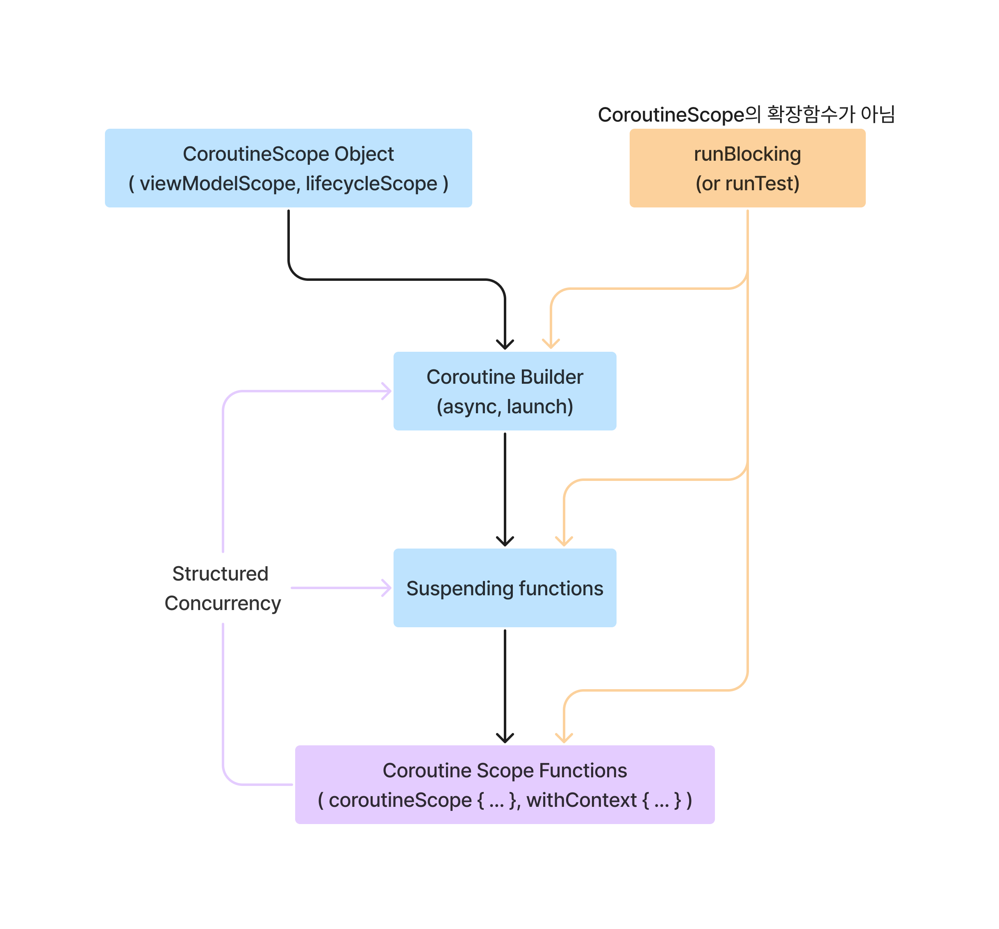
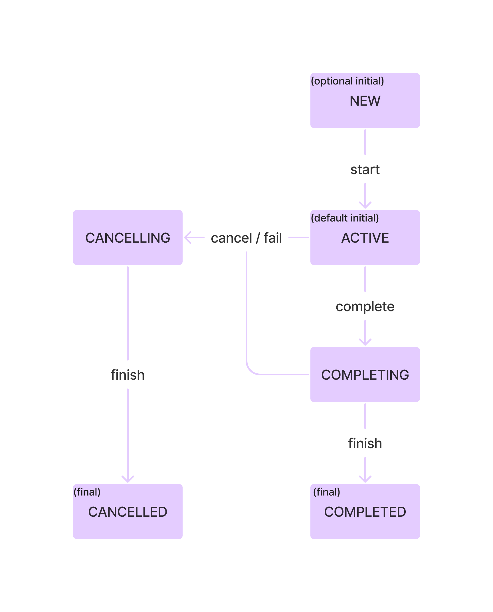
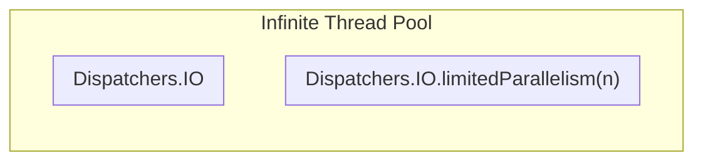
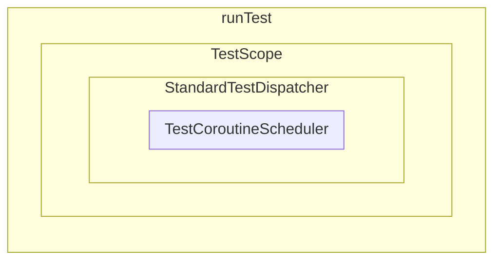

# Kotlin Coroutines library

코루틴을 제대로 사용하기 위해 필요한 모든 것을 배우며 아래의 항목들을 정리하는 파트 입니다.

## 목차

- [Coroutine Builder](#part-21--coroutine-builder)
- [CoroutineContext](#part-22--coroutine-context)
- [Job and awaiting children](#part-23--jobs-and-awaiting-children)
- [Cancellation](#part-24--cancellation)
- [Exception handling](#part-25--exception-handling)
- [Coroutine scope functions](#part-26--coroutine-scope-functions)
- [Dispatchers](#part-27--dispatchers)
- [Construncting a coroutine scope](#part-28--constructing-a-coroutine-scope)
- [The problem with shared state](#part-29--the-problem-with-shared-state)
- [Testing Kotlin coroutines](#part-210--testing-kotlin-coroutines)

## [Part 2.1 : Coroutine Builder](코루틴%20빌더.md)

> - '일반 함수' → 'suspending function' 호출 X, 'suspending function' → '일반 함수' 또는 'suspending function' 호출 O
> - 일반적으로 'CoroutineBuilder'에서 'suspending function' 시작하며 종류는 다음과 같음
>   - `launch` : '로직 실행'을 위한 'Coroutine' 실행, `Job`을 반환
>   - `async` : '값 생성'을 위한 'Coroutine' 실행, `Deferred<T>`를 반환
>   - `runBlocking` : Coroutine 중단 X, Thread Blocking O, 주로 'Unit Test' 또는 Thread Blocking이 필요한 경우 사용
> - Structured Concurrency : Parent → Child CoroutineScope 제공, 'Child Coroutine'은 Parent CoroutineScope 내에서 '관리'
>   - 'Child'는 'Parent CoroutineContext'를 상속 받거나, 덮어쓰기 가능
>   - 'Parent'는 'Child'가 완료될 때까지 '중단'
>   - 'Parent'가 '취소'되면, 'Child'도 '취소'
>   - 'Child'에서 알 수 없는 '예외' 발생 시, 'Parent' 파괴
> - 

'suspending function'에서 일반 함수를 호출하는데 문제는 없지만, 일반 함수에서 'suspending function'를 호출할 수 없습니다.   
즉, 'suspending function'은 다른 'suspending function'에서 호출되어야 하며, 이들은 'Coroutine Builder'로 시작됩니다.

---

`launch`를 통해 시작된 'Coroutine'은 호출한 Thread와는 독립적으로 실행됩니다.  
즉, 'MainTherad' 또는 '다른 Thread'의 실행 흐름에 영향을 주지 않고, 별도의 실행 경로를 갖습니다.

`launch`는 `CoroutineScope`의 확장 함수 입니다.   
이는 `launch`를 호출한 'Parent Coroutine'과 `launch`를 통해 시작된 'Child Coroutine' 간에 'Structured Concurrency'이 형성됨을 의미합니다.

`launch`는 'Daemon Thread'와 비슷한 방식으로 작동하지만, 프로세스 진행 중 'Blocking'이 발생될 경우 차이점이 발생하게 됩니다.  
'Daemon Thread'의 경우 'Blocking Thread'를 유지하는 데 비용이 발생하지만, 'Coroutine'의 경우 비용이 거의 발생하지 않습니다.

---

일반적으로 'Coroutine'은 'Thread 'Blocking'을 목표로 하지 않지만, Thread를 일시적으로 차단해야 하는 상황이 생길 수 있습니다.  
이런 경우에 `runBlocking`을 사용할 수 있습니다.

`runBlocking`은 'Coroutine'이 중단될 때, 해당 'Coroutine'을 시작한 Thread를 'Blocking' 합니다.
즉, `runBlocking` 내에서 `Thread.sleep(1000L)`과 `delay(1000)`가 동일하게 동작함을 의미하며, 'Unit Test'시 유용하게 사용할 수 있습니다.

`runBlocking`은 `CoroutineScope`의 확장 함수가 아니기에, 'Child Coroutine'이 될 수 없으며, 오직 'Root Coroutine' 만으로 사용됩니다.

---

`async`는 `launch`와 유사하게 'Coroutine'을 시작하지만, `async`는 '값 생성'에 중점을 두고, `launch`는 '로직 실행'에 중점을 둡니다.

`async`는 'lambda expression'을 통해 `Deferred<T>`를 반환합니다.  
`Deferred<T>`는 내부에 값을 '저장'하고 내보낼 '준비'가 되면, `await()` 호출 시 값을 '반환'합니다.  
만약 값이 준비가 되기 전에 `await()`을 호출하면, 값이 준비될 때까지 '중단'됩니다.

`async`는 2개의 프로세스를 '병렬'로 처리하여 동시에 값을 생성하는데 적합합니다.

---

'Structured Concurrency'는 'Parent Coroutine'이 'Child Coroutine'에게 'CoroutineScope'를 제공하고,
'Child Coroutine'은 'Parent Coroutine'의 'CoroutineScope' 내에서 호출되는 메커니즘을 의미합니다.

'Structured Concurrency'는 다음과 같은 효과를 얻습니다.

1. 'Child Coroutine'은 'Parent Coroutine'으로부터 `CoroutineContext`를 상속 받거나 덮어 쓸 수 있습니다.
2. 'Parent Coroutine'은 'Child Coroutine'이 '완료'될 때까지 '중단'됩니다.
3. 'Parent Coroutine'이 '취소'되면, 'Child Coroutine'도 '취소'됩니다.
4. 'Child Coroutine'에서 알 수 없는 '예외'가 발생하면, 'Parent Coroutine'은 파괴됩니다.

---

앞서 말했던것과 같이, 'suspending function'은 'Coroutine Builder'로 시작해야 하며,
`runBlocking`을 제외한 'Coroutine Builder'들은 `CoroutineScope`에서 시작되어야 합니다.

그러나 'suspending function'에는 `CoroutineScope`가 없기에, `coroutineScope { ... } `를 통해 'suspending function'에 'Scope'를 생성할 수 있습니다.  

즉, `coroutineScope { ... }`는 함수 자체가 'suspending function'으로 'lambda' 범위(`{ ... }`)에 `CoroutineScope`를 생성합니다.  
추가로 'lambda expression'의 마지막 값을 반환할 수 있습니다.

```kotlin
suspend fun getArticle(
    service: ApiService
): List<Article> = coroutineScope {
    return service.getArticle()
}
```

---

## [Part 2.2 : Coroutine Context](코루틴%20컨텍스트.md)

> - `CoroutineContext` : Job, CoroutineName 등 `Element`를 관리하는 인터페이스
> - `Elemnet` : `CoroutineContext.Element`로 구현, 그 `Element`는 다시 `CoroutineContext`로 구현
> - `Key`를 통해 `Element`들을 고유하게 식별 및 관리
>   - `get(Key)`, `[key]`를 통해 식별, 해당 `Element`가 없는 경우 `null` 반환
>   - `plus()`, `+`를 통해 여러 `CoroutineContext`를 합쳐, 새로운 `CoroutineContext` 생성
>   - `minusKey()`를 통해 특정 `Key`를 가진 `Element`를 제거
> - `Element`가 비어있는 `EmptyCoroutineContext` 활용 가능
> - 'Structured Concurrency'로 '상속'받은 `CoroutineContext`를 'Child'는 이를 override'하여 사용할 수 있음
>   - CoroutineContext 간소화된 계산식 : `defaultContext + parentContext + childContext`
> - `CoroutineContext` 접근 방법
>   - CoroutineScope : `CoroutineScope.coroutineContext`를 통해 접근
>   - 'suspending function' : `continuation`의 `CoroutineContext`를 통해 'Parent Coroutine'의 `coroutineContext` 접근

`CoroutineContext`는 'Coroutine'의 여러 `Element`(`Job`, `CoroutineName`, `CoroutineDispatcher` 등)을 관리하는 인터페이스입니다.

```kotlin
interface CoroutineContext {
    // ...

    interface Element : CoroutineContext {
        val key: Key<*>
    }
}

val name: CoroutineName = CoroutineName("Test")
val element: CoroutineContext.Element = name // OK
val context: CoroutineContext = element // OK
```

`Element`는 `CoroutineContext.Element`로 구현되며, `Element`은 다시 `CoroutineContext`로 구현됩니다.  
이는 각 `Element`가 그 자체로 `CoroutineContext`가 될 수 있음을 말합니다.

'Kotlin'에서 '클래스의 이름' 자체가 해당 클래스의 `companion object` 참조로 작용하는 특징으로 다음과 같은 호출이 허용됩니다.
이처럼 `companion object Key`는 `CoroutineName`, `Job` 등을 나타내며, '동일한 `Key`'를 가진 여러 클래스(`Job`, `SupervisorJob` 등)를 가리킬 수
있습니다.

```kotlin
data class CoroutineName(
    val name: String
) : AbstracCoroutineContextElement(CoroutineName) {
    companion object Key : CoroutineContext.Key<CoroutineName>
}

val context: CoroutineContext = CoroutineName("Test")
context.get(CoroutineName) // OK == context.get(CoroutineName.Key)
```

`CoroutineContext`는 `Key`를 통해 `Element`를 '식별'하고 '고유'하게 관리 할 수 있습니다.

- `get(Key)`, `[key]`를 통해 식별하고, 해당 `Element`가 없는 경우 `null` 반환
- `plus()`, `+`를 통해 여러 `CoroutineContext`를 합쳐, 새로운 `CoroutineContext` 생성 가능  
  단, `Key`가 서로 다른 경우 `Element`가 유지 되지만, 동일한 경우 새로운 `Element`가 이전 `Element`를 대체
- `minusKey()`를 통해 특정 `Key`를 가진 `Element`를 제거 가능

`CoroutineContext`은 '컬렉션'과 같은 성격을 갖기에, 'Empty Context' 인 `EmptyCoroutineContext`를 제공합니다.
또한 컬렉션의 `fold()`와 유사한 함수를 제공하여 `Element`에 대한 `fold` 연산을 수행할 수 있습니다.

---

기본적으로 'Parent Coroutine'은 'Child Coroutine'에게 `CoroutineContext`를 '상속'합니다.  
또한 'Child Coroutine'은 '상속'받은 `CoroutineContext`를 'override'하여 사용할 수 있습니다.

`CoroutineContext`를 계산하는 간소화된 공식입니다. : `defaultContext + parentContext + childContext`

동일한 `Key`를 갖는 `Element`가 존재하는 경우, '기존 `Element`'를 '새로운 `Element`'가 'override' 합니다.  
즉, 우선 순위로 따지면 default < parent < child 입니다.

`defaultContext`에는 기본 설정들이 적용되어 있습니다.  
`Dispatchers`의 경우 `Dispatchers.Default`가 적용, 디버그 모드에서는 `CoroutineId`가 적용됩니다.

---

`CoroutineScope`는 `coroutineContext`으로 현재 `CoroutineContext`에 접근할 수 있습니다.

하지만, 'suspending function'의 경우 `CoroutineScope`에 직접 접근할 수 없으므로,
`continuation`의 `CoroutineContext`를 통해 'Parent Coroutine'의 `CoroutineContext`에 접근이 가능합니다.

---

자체적인 `CoroutineContext` 생성 시, `CoroutineContext.Element`를 구현하는 클래스를 생성하면 됩니다.  
생성된 클래스에 `CoroutineContext.Key<*>` 타입의 `Key`와 `companion object Key`를 추가로 정의하면 됩니다.

```kotlin
class CounterCoroutineContext(val name: String) : CoroutineContext.Element {
    override val key: CoroutineContext.Key<*> = Key

    private var counter = 0
    fun printCounter() {
        println("$name : ${counter++}")
    }

    companion object Key : CoroutineContext.Key<CounterCoroutineContext>
}
```

---

## [Part 2.3 : Jobs and awaiting children](Job과%20자식%20코루틴의%20대기.md)

> - `Job`은 '상태'를 관리하고 추적하여 'Coroutine'의 'Lifecycle' 관리
>   -  
>   - ACTIVE : 'Coroutine'의 작업 '실행 중'
>   - NEW : `CoroutineStart.LAZY`가 적용된 'Coroutine'의 초기 상태, `Job.start()`로 'ACTIVE'로 전환 필요
>   - COMPLETING : 작업이 완료되고 'Child Coroutine'을 '기다리는' 상태
>   - COMPLETED : 'Child Coroutine'을 포함한 '모든 작업이 완료'된 상태
>   - CANCELLING : '취소•실패'가 발생한 상태, 리소스 해제 작업 수행 필요
>   - CANCELLED : 리소스 해제 작업을 끝내고 `Job`이 취소가 된 상태
>   - isActive, isCompleted, isCancelled 등으로 '상태' 확인 가능
> - `CoroutineContext.Element` 중 `Job`은 유일하게 'Parent'에서 'Child'로 '자동 상속'되지 않음
>   - 'Structured Concurrency' 형성을 위해 'Child Job'은 'Parent Job'을 '참조'하여 생성
> - `Job.join()`을 통해 `Job`이 완료될 때까지 'Coroutine 중단' 가능
> - 팩토리 함수 `Job()`은 `Job`의 하위 타입 `CompletableJob`을 반환, 이는 `complete()`, `completeExceptionally()` 제공
>   - `complete()` 
>     - `Job` 완료에 사용, 모든 'Child Coroutine'이 완료될 때까지 계속 실행
>     - `complete()` 호출 후, 해당 `Job`에서 새로운 'Coroutine' 시작 불가
>     - `complete()`로 인해 `Job` 완료 시 `true`, 이미 완료된 `Job`이면 `false`
>   - `completeExceptionally()`
>     - 주어진 '예외'와 함께 `Job` 완료하며, 모든 'Child Coroutine'을 모두 '취소'

'Structured Concurrency'를 통한 특징들은 다음과 같습니다.

1. 'Child Coroutine'은 'Parent Coroutine'의 `CoroutineContext` 상속
2. 'Parent Coroutine'은 'Child Coroutine'이 완료될 때까지 '중단'
3. 'Parent Coroutine'이 '취소'되면, 'Child Coroutine'도 '취소'
4. 'Child Coroutine'에서 알 수 없는 '예외'가 발생하면, 'Parent Coroutine'은 파괴

이 특징은 대부분 `CoroutineContext.Element` 중 하나인 `Job`에 의해 구현됩니다.

`Job`은 'Coroutine'의 'Lifecycle'을 관리하는 `CoroutineContext.Element`의 일부입니다.  
이는 인터페이스로 구현되지만, 구체적인 '상태'와 '동작'을 가지고 있어 '추상 클래스'처럼 사용될 수 있습니다.

---

'Coroutine'의 'Lifecycle'은 `Job`의 '상태'에 의해 표현됩니다.

'Coroutine Builder'로 `Job`이 생성된 경우, 해당 `Job`은 'ACTIVE' 상태로 시작됩니다.  
'ACTIVE' 상태에서는 'Coroutine'의 '작업을 실행'하며, 추가로 'Child Coroutine' 작업을 실행 할 수 있습니다.

`CoroutineStart.LAZY`이 적용된 'Coroutine'은 'NEW' 상태에서 시작되며, 'ACTIVE' 상태로 전환하기 위해 `Job.start()`을 통해 '명시적으로 시작'해야 합니다.

작업 완료 시, 해당 `Job`은 'Child Coroutine'을 기다리는 'COMPLETING' 상태로 변경됩니다.  
이 후 모든 'Child Coroutine'이 완료되면 'COMPLETED' 상태로 변경됩니다.

만약, 작업 실행 중('ACTIVE' or 'COMPLETING') '취소•실패'가 되면, 해당 `Job`은 'CANCELLING' 상태로 변경됩니다.
'CANCELLING' 상태에서는 리소스 해제와 같은 '정리 작업'을 할 수 있습니다. '정리 작업'이 완료되면 `Job`은 'CANCELLED' 상태로 변경됩니다.

`Job.join()`은 해당 `Job`이 '완료'될 때까지 'Coroutine'을 '중단'시키는데 사용됩니다.

이처럼 `Job`은 여러 상태로 변경되며, `isActive`, `isCompleted`, `isCancelled` 등으로 '상태' 확인이 가능합니다.

---

'Coroutine Builder'는 자체적으로 `Job`을 생성하여 반환하기에, 여러 곳에서 사용될 수 있습니다.  
또한 `Job`에 접근하는 방법으로는 `coroutineContext[Job]`, 확장 프로퍼티`job`을 사용하는 방법이 있습니다.
```kotlin
val launchJob: Job = launch { /* ... */ }

val deferred: Deferred<Int> = async { /* ... */ }
val asyncJob: Job = deferred // OK

val activeCheck = coroutineContext.job.isActive
```

`Job`은 'Parent Coroutine'에서 'Child Coroutine'으로 '자동 상속'되지 않는 유일한 `CoroutineContext` 입니다.  
대신 'Structured Concurrency' 형성을 위해 'Child Coroutine'의 `Job`은 'Parent Coroutine'의 `Job`을 '참조'하여 생성하도록 합니다.

만약, 'Parent Coroutine'의 `Job`을 상속하여 사용할 경우, 'Structured Concurrency'가 형성되지 않아, 그 특징을 잃게 됩니다.

---

`Job.join()`을 통해 `Job`이 완료될 때까지 'Coroutine 중단'이 가능합니다.  
`join()`은 'suspending function'에서 호출한 'Coroutine'을 '중단'시키고 지정된 `Job`의 상태가 'CANCELLED' 또는 'COMPLETED'가 될 때까지 기다립니다. 

이를 응용하면, `Job`은 `children` 프로퍼티로 모든 'Child Coroutine'이 완료될 때까지 기다릴 수 있습니다.

---

`Job()` 'Factory Function' 사용 시, 'Coroutine'과 연결되지 않은 `Job`을 생성할 수 있습니다.  
이렇게 생성된 `Job`은 여러 'Coroutine'의 'Parent'로 사용될 수 있음을 의미합니다.

이 때 만약, 'Parent Job'에서 `join()`을 하면 'Parent Job'이 'Child Coroutine'의 완료를 기다립니다.  
이런 경우 모든 'Child Coroutine'이 끝났어도, 'Parent Job'은 여전히 'Active' 상태로 유지되어 프로세스가 종료되지 않는 문제가 발생할 수 있습니다. 
 
더 나은 방법으로는 `Job`의 모든 'Child Coroutine'에 `join()`을 호출하여, 'Parent Job'을 기다리는 것이 아닌, 'Child Coroutine'의 완료를 기다리는 것입니다. 

`Job()`은 'constructor' 호출이 아닌, 'Factory Function' 호출 입니다.  
실제로 반환되는 타입은 `Job`의 하위 인터페이스인 `CompletableJob`입니다.

`CompletableJob`는 `Job`의 기능을 확장하여 `complete()`, `completeExceptionally()`를 제공합니다.

`complete()`는 `Job`을 완료하는 데 사용되며, `complete()`를 호출하면 모든 'Child Coroutine'이 완료될 때까지 계속 실행됩니다. 
그러나 `complete()` 호출 후 해당 `Job`에서 새로운 'Coroutine'을 시작할 수 없습니다.  
또한 `complete()`를 통해 `Job`이 완료 되었으면 `true`를 반환하고, 이미 완료된 `Job`이면 `false`를 반환합니다.

`completeExceptionally()`는 주어진 '예외'와 함께 `Job`을 완료합니다.
이로 인해 모든 'Child Coroutine'은 즉시 '취소'되며, `CancellationException`이 주어진 '예외'를 감쌉니다.

---

## [Part 2.4 : Cancellation](Cancellation.md)

### Basic Cancellation

`Job` 인터페이스에는 `cancel()` 메서드를 제공하여 작업을 취소할 수 있는 기능을 제공하며 다음 효과가 발생됩니다.

- 코루틴이 일시 정지되는 지점이 있는 경우 그 지점에서 작업이 종료합니다. (`delay` or `yield`)
- 자식 작업이 존재하는 경우 그 작업도 취소합니다. (A-B-C 작업 중 B가 취소되면 B,C가 취소되고 A는 아무런 영향을 받지 않음)
- 작업이 취소되면 `CANCELLING` 상태가 되고, 그 다음 `CANCELLED` 상태가 됩니다. (취소된 작업은 더 이상 새로운 코루틴의 부모로서 사용되지 못함)

`CancellationException` 하위 타입을 `cancel`의 인자로 전달하여 코루틴의 취소 원인을 명확하게 할 수 있습니다.  
만약 `CacnellationException` 외 타입으로 코루틴 취소 시도 시 코루틴은 취소되지 않습니다.

코루틴 취소 후 `join` 호출 시 취소가 완전히 처리된 뒤 다음 작업을 수행할 수 있습니다.
이렇게 처리되지 않으면 코루틴이 취소되기 전 다른 코드가 실행될 가능성이 있으며, 이로 인해 예기치 못한 결과 혹은 버그가 발생될 수 있습니다.

`cancel`, `join`을 같이 호출하는 `cancelAndJoin` 확장 함수가 존재합니다.

### How does cancellation work

`Job`이 취소되면 `CANCELLING` 상태로 변경되며 이 상태에서 코루틴이 다음 suspension point에 도달하면 `CancellationException`이 발생됩니다.  
`CancellationException`은 `catch` 블록을 통해 잡을 수 있으며, 이 예외를 다시 던져야 코루틴의 취소 상태가 정상적으로 상위에 전파됩니다.

취소된 코루틴은 `CancellationException`이 발생됨을 알 수 있는데 이는 코루틴이 강제로 종료되는 것이 아닌, 정상적인 예외 처리 흐름을 따르게 하여 리소스 정리를 안전하게 정리할 수 있는 기회를
줍니다.
코루틴이 취소되거나 예외가 발생하더라도 `finally` 블록이 항상 실행되는데 이 블록에서 리소스 해제나 필요한 정리 작업을 수행하면 됩니다.

### Just one more call

`CancellationException`이 발생한 후 `finally` 블록에서는 기본적으로 모든 리소스를 정리할 수 있지만,
새로운 코루틴을 시작하거나 일시 정지 함수를 호출하는 것은 허용되지 않습니다.
이는 해당 `Job`이 이미 `CANCELLING` 상태로 전환되었기 때문입니다.

그러나 `withContext(NonCancellable)` 함수를 이용하면, 코루틴이 이미 취소된 상태에서도 데이터베이스 롤백과 같은 일시 정지 함수를 안전하게 사용할 수 있습니다.
`withContext`는 실행 컨텍스트를 임시로 변경하며, `NonCancellable`은 취소할 수 없는 `Job`을 제공해 블록 내의 작업을 `ACTIVE` 상태로 유지합니다.

### invokeOnCompletion

`invokeOnCompletion` 함수는 코루틴 `Job`이 최종 상태에 도달 시 실행할 핸들러를 설정하는데 사용되고 리소스 해제, 다른 코루틴에게 알림을 보내는 등의 작업에 유용합니다.

`invokeOnCompletion`은 예외 파라미터를 전달하는데 이 값을 통해 코루틴이 어떻게 종료되는지 확인할 수 있습니다.

- `null` : 코루틴이 정상적으로 종료
- `CancellationException` : 코루틴이 취소됨
- 그 외 예외 : 코루틴이 예외와 함께 종료됨

또한 `invokeOnCompletion` 호출 전 코루틴이 완료된 경우 핸들러가 즉시 실행됩니다.

코루틴이 취소되는 순간 동기적으로 `invokeOnCompletion`을 호출하며 이는 다른 스레드에서도 실행될 수 있습니다.
즉 실행되는 스레드를 직접 제어할 수 없습니다.

### Stopping the unstoppable

취소(Cancellation)는 suspension point에서 발생되며 이러한 지점이 없는 코루틴의 경우 취소가 발생되지 않습니다.

suspension point가 존재하지 않는 코루틴을 취소하는 방법으로는 다음과 같이 있습니다.

- `yield()`를 호출하여 코루틴을 잠깐 중단하고 다시 재개하여 코루틴을 취소할 수 있는 suspension point를 생성하는 방법
- `Job.isActive` 프로퍼티를 사용하여 현재 코루틴이 `ACTIVE` 상태인지 확인 후 적절한 조치를 취하는 방법
- `ensureActive()`를 사용하여 `Job`이 `ACTIVE` 상태가 아닌 경우 `CancellationException`을 발생시키는 방법

`yield()`는 일반적인 최상위 suspension 함수이며, 스레드 변경 등 다른 효과를 가질 수 있습니다.
`ensureActive()`는 특정 `coroutineScope`나 `Job`에서만 호출될 수 있으며, 코루틴이 `ACTIVE` 상태가 아닌 경우에만 예외를 발생시킵니다.

### suspendCancellableCoroutine

`suspendCancellableCoroutine` 함수는 코루틴 내에서 비동기 작업을 수행할 떄 사용됩니다.
표준 `suspendCoroutine`과 달리 취소 가능성을 고려한 추가적인 메서드들을 제공합니다.

`invokeOnCancellation`은 코루틴이 취소되었을 때 실행될 코드 블록을 정의하는 메서드로 불필요한 리소스 해제와 실행 중인 작업 중단 등을 실행할 수 있습니다.

### Summary

- `Job` 인터페이스는 코루틴을 취소할 수 있는 `cancel()`을 제공하며 코루틴이 취소된 경우 자식 `Job`도 함께 취소됩니다.
- 코루틴이 취소되면 다음 'suspension point'에서 `CancellationException`이 발생되며 `finally` 블록에서 리소스를 정리하는 것이 좋습니다.
- `withContext(NonCancellable)`을 사용하면 이미 취소된 코루틴에서도 suspension 함수를 호출할 수 있습니다.
- `invokeOnCompletion` 함수는 '코루틴 종료' 시 어떤 작업을 실행할 지 설정할 수 있으며, 코루틴이 어떤 예외로 종료되는지 확인할 수 있습니다.
- `suspendCancellableCoroutine` 함수는 코루틴 내 비동기 작업을 수행할 때 사용되며 취소 가능성을 고려한 추가적인 메서드들을 제공합니다.
    - `invokeOnCancellation` 함수는 '코루틴 취소' 시 어떤 작업을 실행할 지 설정 할 수 있습니다.

---

## [Part 2.5 :Exception handling](Exception%20handling.md)

### Stop breaking my coroutines

`SupervisorJob`은 일반 `Job`과 다르게 자식 코루틴에서 발생된 예외가 부모 코루틴에 영향을 주지 않습니다.  
즉, 자식 코루틴에서 예외가 발생하더라도 다른 자식 코루틴이나 부모 코루틴이 중단되지 않습니다.

일반적으로 `SupervisorJob`은 아래와 같이 여러 코루틴을 시작하는 `Scope`의 일부로 사용되며 해당 `Scope`에서 시작되는 모든 코루틴은 자동으로 `SupervisorJob`에 의해 관리됩니다.

```kotlin
val scope = CoroutineScope(SupervisorJob())

scope.launch { ... }
scope.async { ... }
```

자주 범하는 실수 중 하나는 `launch`, `async`의 인자로 `SupervisorJob`을 사용하는 것인데,
이는 오직 하나의 직접적인 자식만을 가지고 있기에 일반 `Job`을 사용하는 것과 같이 예외 처리에 큰 이점을 가질 수 없습니다.  
이처럼 큰 이점을 가지려면 `SupervisorJob`은 여러 코루틴 빌더의 컨텍스트로 사용하는 것이 더 효과적입니다.

```kotlin
val job = SupervisorJob()

launch(job) { ... }
async(job) { ... }
job.cancelAndJoin()
```

`supervisorScope`는 예외 전파를 중단하는 또 다른 방법으로 부모 코루틴과의 연결을 유지하면서도 자식 코루틴에서 발생하는 예외를 무시하거나 제어 할 수 있습니다.

`coroutineScope`는 `launch`, `async` 등의 코루틴 빌더와 다르게 부모 코루틴에게 예외를 전파하지 않고 해당 Scope 내에서 예외를 잡을 수 있게 해줍니다.
코루틴 빌더는 자체적으로 예외를 잡지 않기에, 부모 코루틴에게 예외가 전파될 가능성이 높습니다.

`supervisorScope`는 자식 코루틴의 예외가 부모 코루틴에게 전파되지 않지만,
`withContext(SupervisorJob())`에서 `SupervisorJob()`을 부모 `Job`으로 만들지만, `withContext`는 단순히 코루틴의 컨텍스트를 변경하는 것이기에 예외 무시 기능이
적용되지 않습니다.

### await

`await`은 `async` 코루틴 빌더와 함께 사용되며 비동기 작업의 결과를 가져오기 위한 메서드입니다.
다른 코루틴들과 동일하게 비동기 작업에서 예외가 발생되면, 부모 코루틴까지 예외를 전파합니다.

### CancellationException does not propagate to its parent

예외가 `CancellationException`의 하위 클래스라면, 이 예외는 부모로 전파되지 않고 현재 코루틴만 취소합니다.

### Coroutine exception handler

`CoroutineExceptionHandler`는 코루틴에서 예외 처리 시, 모든 예외에 대한 기본 동작을 정의하는데 유용합니다.
이 핸들러는 예외가 발생하면 정의한 코드 블록이 실행되며, 코루틴 컨텍스트에 추가할 수 있어 `SupervisorJob` 등과 같이 사용할 수 있습니다.

### Summary

- `SupervisorJob`에서 발생된 예외는 부모 코루틴에게 전파되지 않으며, 이로 인해 여러 코루틴 빌더의 컨텍스트로 사용하는 것이 효과적입니다.
- `suervisorScope` 블록에서 생성된 코루틴들은 예외가 발생해도 부모 코루틴에게 전파되지 않습니다.
- 예외가 `CancellationException`의 하위 클래스라면, 이 예외는 부모로 전파되지 않고 현재 코루틴만 취소합니다.
- `CoroutineExceptionHandler`는 코루틴에서 예외 처리 시, 모든 예외에 대한 기본 동작을 정의하는데 유용합니다.

---

## [Part 2.6 : Coroutine scope functions](CoroutineScope%20함수.md)

### Approaches that were used before coroutine scope functions were introduced

코루틴 빌더(`async`, `launch` 등)을 사용하려면 스코프가 필요하며 이는 `runBlocking`, `coroutineScope` 등을 통해 제공됩니다.

스코프 중 `GlobalScope`도 존재하는데 이 스코프는 다음과 같은 특징을 지닙니다.

- `GlobalScope`는 애플리케이션의 전체 수명 주기 동안 유지되며, 애플리케이션의 수명 주기와 동일하게 실행되기에 부모 코루틴이 취소되더라도 계속 실행됩니다.
- `GlobalScope`는 `EmptyCoroutineContext`를 얻기에 컨텍스트와 스코프에 대한 값이 없어 일반적인 부모-자식 간 상속이 없습니다.

이와 같은 특징으로 인해 '리소스 낭비가 발생'할 수 있으며, '컨텍스트에 대한 설정을 직접 해야하고', '유닛테스트가 어려워진다'는 단점이 있습니다.

### coroutineScope

`launch`나 `async`는 새로운 코루틴을 생성하고 즉시 다음 코드 라인으로 넘어가지만
`coroutineScope`는 자식 코루틴들이 모두 완료될 떄까지 생성된 코루틴을 일시 중단합니다.

즉, `coroutineScope`는 '일시 정지 가능한 코드 블록'을 실행하기 위한 새로운 코루틴 스코프를 생성합니다.

`coroutineScope`는 다음과 같은 특징을 지닙니다.

- 상위 스코프의 `coroutineContext`를 상속받아 생성된 자식 코루틴에게 해당 컨텍스트를 상속합니다.
- 생성된 자식 코루틴이 완료되어야지만, 자기 자신을 종료할 수 있습니다.
- `coroutineScope`가 속한 부모 코루틴이 취소된다면, 생성된 자식 코루틴들도 모두 취소됩니다.

`coroutineScope` 또는 그 안의 자식 코루틴에서 예외가 발생되면 해당 범위의 코루틴들이 모두 취소되고 부모 코루틴에 예외를 던집니다.

### Coroutine Scope functions

코루틴 스코프 함수는 suspending 함수 내에서 새로운 코루틴 스코프를 생성하거나 기존의 스코프를 변형하는데 사용됩니다.
이러한 코루틴 스코프 함수에는 `coroutineScope`, `superviorScope`, `withContext`, `withTimeout` 등이 있습니다.

코루틴 스코프 함수와 코루틴 빌더는 혼동될 수 있지만 이 둘을 엄연히 [차이점](CoroutineScope%20함수.md#코루틴-스코프-함수와-코루틴-빌더의-차이점)이 존재합니다

코루틴 스코프 함수와 `runBlocking`도 비슷해 보이지만, `runBlocking`은 blocking 함수, 코루틴 스코프 함수는 suspending 함수 입니다.
이로 인해 서로 다른 목적과 환경에서 사용되므로 명확하게 구분해야 합니다.

### withContext

컨텍스트 변경이 필요한 경우 `withContext`를 사용하는 것이 유용하며, 컨텍스트의 변경이 필요 없는 경우 `coroutineScope`를 사용하면 됩니다.

`withContext`는 코드 중간에 다른 코루틴 스코프를 설정하기 위해 `Dispatchers` 컨텍스트와 함께 자주 사용됩니다.

코드의 가독성과 관리성을 위해서 `async`와 `await()`를 즉시 사용할 떄 특별한 경우가 아니라면 `coroutineScope` or `withContext`를 사용하게 좋습니다.

### supervisorScope

`coroutineScope`와 유사하지만, 컨텍스트의 `Job`을 `SupervisorJob`으로 오버라이드하여 자식 코루틴이 예외를 발생시켜도 다른 코루틴들을 취소 시키지 않습니다.
이 때문에 여러 독립적인 비동기 작업을 안전하고 효율적으로 관리하는 데 주로 사용됩니다.

`supervisorScope` 내부에서 `async`와 `await()`를 사용하여 코루틴의 결과를 얻는 중 예외가 발생되면 `await()` 기준으로 예외가 전파되기에,
이를 고려하여 `await()` 호출 주변에 `try-catch`와 같은 예외 처리 코드를 작성해야 합니다.

`withContext(SupervisorJob())` 사용 시, `SupervisorJob()`은 `withContext`의 `Job`에 부모로 사용되게 됩니다.
이 떄문에 `withContext`의 자식 코루틴에서 예외가 발생하게 되면 `withContext`로 전파되기에 `SupervisorJob()`은 크게 의미가 없습니다.

### withTimeout

`withTimeout`은 작업에 최대 실행 시간을 부여하고 다음과 같이 처리됩니다.

- 시간이 초과되면 `TimeoutCancellationException`을 발생시켜 작업을 강제로 종료시킵니다.
- 성공적으로 완료된 경우 블록에서 반환된 값을 얻습니다.

주로 네트워크 요청, 복잡한 알고리즘 등의 처리 시간에 민감한 곳에 사용될 수 있으며, 이는 테스트에 유용하게 사용될 수 있습니다.

`withTimeoutOrNull`은 `withTimeout`과 동일하지만, 시간 초과 시 `TimeoutCancellationException`을 발생시키지 않고 `null`을 반환합니다.
이로 인해 좀 더 유연한 예외 처리를 할 수 있습니다.

### Connecting coroutine scope functions

코루틴 스코프 함수들은 자체적으로 특정한 기능을 제공하며 이 함수들을 중첩해서 사용하여 여러 기능을 조합해서 사용할 수 있습니다.

단, 각 함수의 특정과 영향성을 잘 이해하고 사용해야 합니다.   
(`withContext`가 취소 불가능한 작업을 수행하는데 `withTimeout`은 의미 없는 기능이 될 수 있습니다.)

### Additional operations

기본적으로 suspending 함수는 내부 코루틴 작업이 모두 완료될 때까지 완료되지 않습니다.
이때 같은 코루틴 스코프에서 별도의 추가 작업(Analytics 호출 등)과 같은 작업이 포함되어 있는 경우에
추가 작업에서 예외가 발생되면 메인 로직이 취소 되기에 좋은 방식이 아닙니다.

이 때문에 명시적으로 스코프를 주입하여 사용하는 것이 좋습니다.
명시적으로 스코프를 주입하면 해당 로직이 독립적으로 비동기 작업을 할 수 있음이 명확해지고, 해당 코루틴 작업의 흐름을 쉽게 파악할 수 있어 디버깅이 간단해집니다.

### Summary

- 코루틴 스코프 함수를 통해 코루틴 빌더들을 사용할 수 있으며, 코루틴 스코프 함수 중 `GlobalScope`는 다음과 같은 특징을 지닙니다.
    - Application Lifecycle을 가지며 Application 종료될 떄까지 해당 스코프에서 실행된 코루틴 작업이 실행 됩니다.
    - `EmptyCoroutineScope`를 통해 생성되므로 컨텍스트와 스코프에 대한 값이 없습니다.
- `coroutineScope`는 '일시 정지 가능한 코드 블록'을 실행하기 위한 새로운 코루틴 스코프를 생성하며 다음 특징을 지닙니다.
    - 상위 스코프의 컨텍스트를 상속받아 자식 코루틴에게 전달합니다.
    - 자식 코루틴이 완료되어야지만, 자신도 종료할 수 있습니다.
    - 부모 코루틴이 취소되면 자기 자신을 포함한 모든 자식 코루틴도 취소됩니다.
- 코루틴 스코프 함수에는 `coroutineScope`, `withContext`, `superviorScope`, `withTimeout` 등이 있습니다.
    - `withContext` : `Dispatchers`의 변경과 같이 코루틴 컨텍스트의 변경이 필요한 경우 사용됩니다.
    - `supervisorScope` : `SupervisorJob`을 사용하여 자식 코루틴의 예외를 전파하지 않는 독립적인 비동기 작업에 사용됩니다.
    - `withTimeout` : 특정 작업에 시간 제한을 두고 싶을 때 사용됩니다.
- 코루틴 스코프 함수들은 중첩해서 여러 기능을 조합해서 사용할 수 있습니다.
- 코루틴 내부에서 메인 로직과 추가 작업을 같이 실행 시, 별도의 스코프를 생성하여 클래스에 명시적으로 주입한 뒤 별도의 스코프로 추가 작업을 실행하는 것이 메인 로직에 영향을 주지 않기에 권장됩니다.

---

## [Part 2.7 : Dispatchers](Dispatchers.md)

### Default dispatcher

코루틴 빌더에서 디스패처를 지정하지 않으면 기본적으로 `Dispatchers.Default`가 선택되며 이 디스패처는 다음 특징을 지닙니다.

- CPU 집약적인 작업을 수행하기 위해 최적화 되어 있으며, 스레드 풀의 크기는 실행 환경의 CPU 코어 수에 따라 결정됩니다.
- 블로킹 연산을 수행할 경우, 스레드가 대기 상태에 빠져 자원을 낭비할 수 있으므로 블로킹 연산에 해당 디스패처는 적절하지 않습니다.

`runBlocking`은 다른 디스패처가 설정되지 않은 경우 기본적으로 `Dispatchers.Default`가 아닌 메인 스레드에서 실행됩니다.

### Limiting the default dispatcher

비용이 많이 드는 연산에서 디스패처에 `limitedParallelism`를 적용하면 사용할 수 있는 스레드 수를 제한할 수 있습니다.

이 메커니즘은 `Dispatchers.IO`에서 사용하는 것을 주된 목적으로 만들어졌지만, 다른 디스패처에서도 사용할 수 있습니다.

### Main Dispatcher

`Dispatchers.Main`은 UI 업데이트와 같이 메인 스레드에서 처리해야 할 작업을 안전하게 수행하도록 도와줍니다.
안드로이드 플랫폼에서는 일반적으로 `Dispatchers.Main`을 기본 디스패처로 사용합니다.

### IO dispatcher

디스크 또는 네트워크 작업을 수행하는 등의 작업을 하기 위한 I/O 작업 최적화 디스패처 입니다.

스레드 풀에 제한이 없어 너무 많은 스레드가 활성화되는 경우 성능 저하와 메모리 부족의 위험이 있기에 디스패처를 사용합니다.
`Dispatchers.Default`는 CPU 코어 수 만큼, `Dispatchers.IO`는 최대 64개로 제한됩니다.

`Dispatchers.Default`와 `Dispatchers.IO`는 동일한 스레드 풀을 공유하여 스레드를 효율적으로 재사용합니다.
두 디스패처는 독립적인 스레드 제한을 가지므로 하나가 다른 하나의 리소스를 차지하지 않습니다.

너무 많은 스레드가 블로킹 상태에 빠지는 것을 방지하기 위해 `limitedParallelism`을 사용하여 동시에 실행할 수 있는 코루틴의 수를 제한합니다.

### IO dispatcher with a custom pool of threads

`Dispatchers.IO`에서 `limitedParallelism` 사용 시 독립적인 스레드 풀을 가진 새로운 디스패처를 생성할 수 있으며, 이 스레드 풀은 64개로 제한되지 않고 원하는 만큼 스레드 수를 제한할
수 있습니다.



각 디스패처들은 결국 동일한 스레드 풀을 공유하기에 스레드의 재사용과 최적화가 가능합니다.

스레드를 많이 블로킹할 가능성이 있는 클래스는 위와 같이 독립적인 제한을 가진 자체 디스패처를 설정하는 것이 좋습니다.
이러한 독립적인 제한을 가진 디스패처는 다른 디스패처와 무관하므로 동일한 스레드 풀에서 스레드를 경쟁 하는 문제를 줄일 수 있습니다.

### Dispatcher with a fixed pool of threads

Java의 `Executors`를 사용하여 고정된 풀, 캐사된 풀을 생성할 수 있습니다.
또한 이러한 풀을 `asCoroutineDispatcher`르 사용하여 디스패처로 변환할 수 있습니다.

그러나 위와 같이 생성된 디스패처는 `close`로 종료시켜야 합니다. 그렇지 않으면 스레드 누수가 발생됩니다.
또한 고정된 스레드 풀은 미사용 스레드를 계속 유지해야 하므로 효율성이 떨어질 수 있습니다.

이러한 문제로 코루틴에서 제공하는 기본 디스패처를 사용하거나, 필요한 경우에만 `Executor`를 사용하는 것이 좋습니다.

### Dispatcher limited to a single thread

다중 스레드 디스패처 사용 시 공유 상태(shared state)를 수정(하나의 변수를 변경하는 등)하면 경쟁 상태(race condition)가 발생하게 될 수 있습니다.

이를 해결하기 위한 방법 중 하나는 단일 스레드 디스패처 구현하여 추가적인 동기화 메커니즘을 넣지 않고 경쟁 상태를 피하는 것입니다.

아래는 단일 스레드 디스패처 구현 방법입니다.

```kotlin
Dispatchers.Default.limitedParallelism(1)
Dispatchers.IO.limitedParallelism(1)
```

단, 단일 스레드 디스패처 구현 시 스레드가 블로킹 되면 호출들이 순차적으로 처리되기에 성능이 저하될 수 있습니다.

### Unconfined dispatcher

`Dispatchers.Unconfined`는 어떠한 스레드 변경도 하지 않으며 별도의 스레드 풀을 사용하지 않습니다.  
즉, 시작된 스레드 혹은 재개된 스레드에서 실행됩니다. 이에 따라 스레드 관리에 대한 부담이 없으며 특별한 경우 유용하게 사용될 수 있습니다.

모든 코루틴 범위에 `Dispatchers.Unconfined`를 사용하면 동일한 스레드에서 실행되어 연산의 순서를 쉽게 제어하고 복잡한 동기화나 타이밍 이슈를 피할 수 있기에 테스트 환경에서 유용하게 사용될 수
있습니다.   
단, `runTest`를 사용한다면 이러한 트릭은 의미가 없습니다.

### Immediate main dispatching

`withContext`를 호출할 때 마다 일시 중단과 재개라는 프로세스를 거치며 그에 따른 일정한 비용이 발생되며, 동일한 스레드로 디스패칭 되는것이면 이는 더욱이 불필요한 비용입니다.

이에 따라 메인 디스패처에서는 `Dispatchers.Main.immediate`를 지원하여 불필요한 디스패칭을 방지하여 비용을 절약할 수 있습니다.  
이는 현재 메인 디스패처만 사용할 수 있습니다.

### Continuation interceptor

`ContinuationInterceptor` 코루틴 컨텍스트는 다음 2가지 메서드를 지원합니다.

- `interceptContinuation` : 코루틴이 일시 중단될 때 `continuation`을 수정하는 데 사용됩니다.
- `releaseInterceptedContinuation` : `continuation`이 종료될 때 호출됩니다.

`ContinuationInterceptor.interceptContinuation`를 통해 `Continuation`을 특정 스레드 풀에서 실행되는 `DispatchedContinuation`으로 래핑할 수
있으며,
이를 통해 비동기 작업 테스트 시 실제 코드에서 처리되는 디스패처를 테스트 디스패처로 교환할 수 있습니다.

### Performance of dispatchers against different tasks

디스패처 성능을 비교하기 위한 벤치마크 결과 다음과 같은 점을 얻을 수 있습니다.

- 단순한 suspend 작업 시 여러 스레드를 사용하더라도 성능 향상을 기대하기 어렵습니다.
- Blocking 작업 시 여러 스레드를 사용하면 작업을 분산하기에 효율적으로 처리할 수 있습니다.
- CPU 집약적인 작업 시 `IO` 대신 `Default`를 사용하는 것이 효율적이며, `IO`의 경우 너무 많은 스레드가 활성화되어 Context switching에 소비되는 시간때문에 성능이 떨어질 수
  있습니다.
- 메모리를 많이 사용하는 작업 시 스레드 수를 늘려도 큰 성능 향상을 기대하기 어렵습니다.

### Summary

| Dispachers Type              | Description                                                                      |
|------------------------------|----------------------------------------------------------------------------------|
| `Dispatchers.Default`        | CPU 연산이 많이 필요한 작업에 최적화 되어 있으며 CPU 코어 수만큼 스레드가 제한됩니다.                             |
| `Dispatchers.Main`           | UI 업데이트와 같이 메인 스레드에서만 가능한 작업에 사용됩니다.                                             |
| `Dispatchers.IO`             | 파일 I/O, 네트워크 호출 등과 같은 블로킹 작업에 사용되며 최대 64개의 스레드로 제한됩니다.                           |
| `Dispachers.Unconfined`      | 어떤 스레드도 변경하지 않고 별도의 스레드 풀을 가지지 않아 테스트 환경에서 유용합니다. 그러나 테스트 시 `runTest`를 많이 활용합니다. |
| `Dispatchers.Main.immediate` | 메인 스레드에서 불필요한 디스패칭을 방지하여 비용을 절약할 수 있습니다.                                         |

- 스레드 풀에서 `Default`와 `IO`는 각각 독립적인 스레드 제한을 가지고 있습니다.
- 디스패처에 `limitedParallelism` 사용 시 스레드 수를 제한할 수 있습니다. 주로 스레드를 많이 사용하는 `Dispatchers.IO`에 사용됩니다.
- `Dispatchers.IO.limitedParallelism` 사용 시 `Dispatchers.IO`와 독립적인 스레드 풀을 생성할 수 있습니다.
- Java의 `Executor`를 생성하여 `asCoroutineDispatcher`를 통해 디스패처로 변환할 수 있습니다. 단, `close`로 꼭 정리해줘야 합니다.
- `ContinuationInterceptor` : 코루틴 일시 중단 시 생성되는 `Continuation`을 특정 스레드 풀에서 실행되는 `DispatchedContinuation`으로 래핑할 수 있어 테스트 시
  디스패처를 주입하는 용도로 사용합니다.

------------------------------------------------------------------------------

## [Part 2.8 : Constructing a coroutine scope](CoroutineScope%20구성.md)

### CoroutineScope factory function

`CoroutineScope`는 단일 프로퍼티 `coroutineContext`를 가진 인터페이스입니다.

대부분 프로퍼티로 코루틴 스코프 객체를 사용하여 코루틴 빌더를 호출하는 방식을 사용하거나
`CoroutineScope` 팩토리 함수를 사용합니다.

### Constructing a scope on Android

안드로이드 플랫폼에서는 코루틴의 시작을 `Fragment`, `Activity`, `ViewModel`, `Presenter` 등에서 시작될 수 있지만,
디자인 패턴을 많이 사용하는 요즘에는 `ViewModel` 혹은 `Presenter`에서 많이 시작되도록 하고 있습니다.

이 때 공통적으로 사용될 코루틴 스코프를 생성하고 관리하는 것은 중복된 코드를 줄이고 동일한 생명주기로 관리하도록 할 수 있어 좋은 방법이 될 수 있습니다.

코루틴들을 생성하였으면, 사용자가 화면을 벗어나거나, `ViewModel`이 정리되는 등의 상황에서 모든 코루틴들을 취소하게 만들어주어야 합니다.

이와 같이 코루틴의 취소는 `Job`을 사용할 수 있지만, 좀 더 유연한 방식으로 코루틴을 관리하려면 `SupervisorJob` 컨텍스트를 스코프에 추가하여 사용할 수 있습니다.

코루틴에서 처리되지 않은 예외에 대해서 기본적인 예외 처리 방식을 정의하려면 `CoroutineExceptionHandler`를 사용할 수 있으며 이 핸들러는 코루틴 컨텍스트의 일부로 추가될 수 있습니다.

### viewModelScope and lifecycleScope

안드로이드 플랫폼에서는 스코프를 직접 정의하는 대신 `viewModelScope`와 `lifecycleScope`를 많이 사용합니다.

이들은 `Disptchers.Main`과 `SupervisorJob`을 사용하고 `ViewModel` 혹은 `LifecycleOwner`가 소멸되면 자동으로 코루틴을 취소합니다.

위 2가지 스코프를 사용하면 코루틴의 생명주기 관리에 대해서 신경을 쓰지 않아도 괜찮기에 코드를 간결하고 안정적으로 만들 수 있습니다.
그러나, 특별한 컨텍스트 설정이 필요한 경우(`CoroutineExceptionHandler`와 같이) 제한적일 수 있습니다.

### Constructing a scope for additional calls

`Analytics`, `Crashlytics` 등 추가 작업을 위해서 별도의 스코프를 생성하여 생성자 또는 인자로 주입하여 사용하는 것이 좋습니다.

```kotlin
private val exceptionHandler = CoroutineExceptionHandler { _, throwable ->
    FirebaseCrashlytics.getInstance().recordException(throwable)
}

val analyticsScope = CoroutineScope(SupervisorJob() + exceptionHandler)
```

### Summary

- 코루틴의 생명주기를 관리하기 위해 `CoroutineScope`를 사용합니다.
- 코루틴 예외 발생 시 공통적으로 처리를 위해 `CoroutineExceptionHandler`를 선언하여 코루틴 컨텍스트에 추가하여 사용할 수 있습니다.
- 안드로이드에서는 `viewModelScope`와 `lifecycleScope`를 사용하여 해당 생명주기에 맞춰 코루틴을 관리할 수 있습니다.

------------------------------------------------------------------------------------------------

## [Part 2.9 : The problem with shared state](SharedState%20문제점.md)

여러 스레드에서 상태를 공유하거나 변경 가능한 상태를 공유 상태(shared state)라고 합니다.

공유 상태는 데이터의 일관성이 보장되지 않으며, 데이터 충돌이 발생할 수 있습니다.

위 공유 상태를 Java에서는 아래와 같은 방법으로 동시성 문제를 해결하였습니다.

### synchronized

`synchronized` 블록에서는 스레드를 차단하여 동시성 문제를 해결합니다.

그러나, 이로 인해 리소스가 낭비될 수 있으며, 메인 스레드나 스레드 풀을 제한한 경우 문제가 발생될 수 있습니다.

### Atomics

여러 스레드가 동일한 데이터에 접근할 때 연산이 중간에 방해 받지 않고 한번에 완료되므로 다른 스레드가 동시에 값을 변경할 수 없어 동시성 문제를 해결할 수 있습니다.
또한 저수준에서 구현되므로 성능에 큰 이점을 가집니다.

그러나, `Atomic`은 주로 간단한 변수나 참조를 안전하게 만들기 위한 목적으로 사용되며,
복잡한 데이터 구조나 여러 변수가 상호작용해야 하는 경우에는 제한적입니다.

---

아래는 제한점이 있는 Java의 솔루션들 대신 Kotlin의 코루틴을 사용하여 동시성 문제를 해결하는 방법입니다.

### A dispatcher limited to a single thread

'coarse-garined thread confinement' 방식은 단일 스레드 디스패처를 사용하여 공유 상태를 한 스레드에 제한합니다.
그러나 전체 함수의 멀티 스레딩 기능을 잃을 수 있습니다.

'fine-grained thread confinement' 방식은 상태를 변경하는 코드를 `withContext`로 감싸서 단일 스레드 디스패처로 제한합니다.  
불필요한 큰 코드 블록을 단일 스레드로 제한하지 않아 병렬 처리의 이점을 더 많이 활용할 수 있으며, CPU 집약적이거나 블로킹 작업이 있는 경우에도 성능 저하를 최소화할 수 있습니다.  
그러나, 코드가 더 복잡해져 유지보수가 어려워 질 수 있고, 초기 설계 단계에서 더 많은 시간을 소비할 수 있습니다.

### Mutex

여러 코루틴이 동시에 특정 리소스에 접근하는 것을 막기 위해 사용되며, 리소스가 변경되는 도중 다른 코루틴이 그 상태를 변경할 수 없게되므로 데이터 일관성을 유지할 수 있습니다.

`Mutex`의 `lock`을 호출한 코루틴이 `unlock`을 호출하기 전까지 리소스에 대한 접근 권한을 갖게되며, 리소스에 다른 코루틴이 접근 시 대기열에 쌓이게 됩니다.  
해당 리소스에 `unlcok`이 호출되면 대기열에 있는 코루틴 중 하나가 리소스에 접근할 수 있게 됩니다.

`lock`과 `unlock` 사이에 예외나 조기 리턴이 발생하는 경우 데드락이 발생할 수 있기에, 내부적으로 `try-finally`를 사용하여 `lock`을 관리하는 `withLock`을 사용하여 안전하게 사용할
수 있습니다.

`Mutex`는 스레드를 차단하는 것이 아닌, 코루틴을 일시 중지시키는 점이 중요합니다.  
이로 인해 `Mutex` 사용 시 다음과 같은 점을 주의해야 합니다.

- 코루틴에서 `lock`을 2번 지나려고하면 해당 블록이 데드락에 빠질 수 있습니다.
- 코루틴이 중단되었을 때에도 잠금이 해제되지 않기에 다른 코루틴이 작업을 이어갈 수 없어 동시성 제어 시 비효율적일 수 있습니다.

### Semaphore

`Mutex`와 다르게 허가 개수에 따라 그 수 만큼의 코루틴이 동시에 리소스에 대한 접근을 허용할 수 있으며,
`acquire`, `release`, `withPermit`과 같은 함수를 사용하여 허가를 얻고 반환합니다.

`Semaphore`는 공유 상태에 대한 해결 보다는 동시 요청의 수를 제한하는 데 사용되어 서비스의 안전성을 유지하는데 도움이 됩니다.

### Summary

공유 상태는 여러 스레드에서 상태를 공유하거나 변경 가능한 상태를 말하며 이 상태는 동시성 문제를 발생시킬 수 있기에 적절한 동기화 메커니즘을 사용하여 해결해야 합니다.

#### Java 동시성 문제 해결

Java에서는 `synchronized`, `Atomics`를 사용하여 동시성 문제를 해결할 수 있습니다.

그러나, `synchronized`는 메인 스레드나 스레드 풀을 제한할 경우 여러 문제가 발생될 수 있으며,
`atomic`은 복잡한 데이터 구조나 여러 변수가 상호작용해야 하는 경우에는 제한적입니다.

#### Coroutine 동시성 문제 해결

코루틴에서는 `단일 스레드 디스패처`와 `Mutex`를 사용하여 동시성 문제를 해결할 수 있습니다.

`단일 스레드 디스패처`는 전체 함수를 단일 스레드로 제한하는 방식과, 공유 상태를 변경하는 코드 블럭에만 단일 스레드로 제한하는 방식을 사용하여 동시성 문제를 해결할 수 있습니다.

`Mutex`는 스레드를 제한하는 것이 아닌, 코루틴을 제한하는 방식으로 운용되며 `lock`, `unlock`을 통해 해당 리소스에 대한 접근을 제한하며 해제할 수 있습니다.
또한 `lock` 진행 중 예상치 못한 예외나 조기 리턴과 같은 상황을 고려하여 `withLock`를 통해 안전하게 사용합니다.

`Semaphore`는 리소스에 대한 접근을 허가하는 코루틴의 수를 지정하여 사용할 수 있으며,
이는 동시성 문제 해결보다는 동시 요청의 수를 제한하여 서비스 안전성을 유지하는데 도움이 됩니다.

---------------------------------------------------------------

## [Part 2.10 : Testing Kotlin coroutines](Coroutine%20테스트.md)

### Testing time dependencies

단위 테스트 중 함수에 실행 시간이 각각 다른 경우 실제 함수 대신 `Fake Class`와 `delay`를 사용하여 데이터 로딩 시나리오를 시뮬레이션 할 수 있습니다.
그러나 단위 테스트에서 많은 시간을 소비하는 것은 좋지 않기에, `StandardTestDispatcher`를 사용하면 테스트 중 코루틴의 가상 시간을 조작할 수 있습니다.

이처럼 가상 시간을 조작하여 오래 걸리는 작업을 테스트할 떄도 거의 즉시 완료할 수 있습니다.

### TestCoroutineScheduler and StandardTestDispatcher

단위 테스트에서 `TestCoroutineScheduler`와 `StandardTestDispatcher` 사용 시 실제 시간이 아닌 가상 시간을 사용하여 실제 앱이나 서비스에서 발생할 수 있는 여러 시나리오를
빠르게 재현하고 검증할 수 있습니다.

`TestCoroutineScheduler`는 다음과 같은 메서드를 지원합니다.

- `advanceUntilIdle` : 가상 시간을 진행시키고, 해당 시간 동안 실제 시간에 호출되었을 모든 작업을 호출합니다.
- `advanceTimeBy` : `ms` 단위를 인자로 보내 지정한 시간 까지의 모든 코루틴 작업을 재개합니다.
- `runCurrent` : 현재 시점에 예정된 작업들을 실행합니다.

가상 시간과 실제 시간은 완전히 독립적으로 스레드를 일시 정지시켜도 `StandardTestDispatcher` 기반 코루틴에는 영향을 주지 않습니다.

`TestScope`를 사용하면 내부적으로 `StandardTestDispatcher`가 사용되기에 위 3가지 메서드를 사용할 수 있습니다.

### runTest

`runTest` 사용 시 코루틴 로직 테스트 시 실제로 시간을 기다리지 않고 코루틴의 로직을 빠르게 테스트 할 수 있습니다.
이는 `TestScope`와 함께 제공되는 가상 시간 관리 기능 덕분에 가능합니다.

```kotlin
@Test
fun test1() = runTest {
        assertEquals(0, currentTime)
        delay(1000)
        assertEquals(1000, currentTime)
    }
```



### Background scope

`runTest`는 테스트에서 코루틴을 실행하기 위한 스코프를 제공하는데, 만약 해당 스코프에서 시작된 코루틴 작업이 완료되지 않으면 `runTest`는 반환되지 않고 계속 실행됩니다.

이처럼 장기적으로 실행되는 작업이나, 테스트의 주요 흐름에 직접적인 영향을 주지않는 별도의 프로세스를 시작할 때 `backgroundScope`를 사용하는 것이 좋습니다.

```kotlin
@Test
fun simPleTest() = runTest {
        backgroundScope.launch {
            // ...
        }
    }
```

### Testing cancellation and context passing

코루틴을 안전하게 관리하고 예상치 못한 동시성 문제를 방지하기 위해서는 코루틴이 구조화된 동시성을 준수하는지 테스트하는 것이 중요합니다.

이를 위해 suspending 함수에서 현재 코루틴 컨텍스트를 캡처하고, 컨텍스트가 올바른 값과 상태를 갖는지 테스트를 통해 확인할 수 있습니다.

여기에서 코루틴의 현재 컨텍스트를 캡처하는 방법으로는 다음과 같습니다.

1. suspending 함수의 컨텍스트 캡처 : `currentCoroutineContext()` 혹은 `coroutineContext` 프로퍼티 사용
2. 코루틴 빌더 혹은 스코프 함수 내부 : `CoroutineScope.coroutineContext`는 현재 코루틴 컨텍스트를 제공하는 프로퍼티보다 우선순위가
   있기에 `currentCoroutineContext()` 사용

코루틴 취소를 테스트하는 방법으로는 자식 코루틴의 `Job`을 캡처하고 부모 코루틴을 취소하여 자식 코루틴이 취소 되었는지 검증하면 됩니다.

### UnconfinedTestDispatcher

`UnconfinedTestDispatcher`는 코루틴 테스트 시 시작되자마자 첫 번째 `delay`가 호출되지 전 까지의 모든 작업을 즉시 실행하도록 합니다.
즉, 코루틴 내부에서 일련의 작업을 수행하고 중간에 `delay` 발생 시 이전의 모든 작업을 즉시 실행하여 그 결과를 출력합니다.

이는 `StandardTestDispatcher`와 차이가 있습니다.
`StandardTestDispatcher`는 별도의 스케줄링 처리를 해주지 않으면 아무런 작업을 실행하지 않습니다.

### Using mocks

Mocking은 테스트에서 외부 시스템 혹은 복잡한 객체를 대체하기 위해 사용되는 기법으로써,
실제 객체 대신 mock 객체를 생성하여 테스트에서 원하는 동작을 정의할 수 있습니다.

그러나 Mocking은 인터페이스 혹은 클래스 구조 변경 시 모든 mock 객체의 정의도 변경해야 할 수 있습니다.  
반면 `fake`는 실제 객체와 유사한 동작을 수행하는 간단한 객체로 이러한 상황에서 더 유연하고 쉽게 대응할 수 있습니다.

### Testing functions that change a dispatcher

단위 테스트 시 `runBlocking`을 사용하는 경우, `runBlocking`은 주어진 블록 내 코루틴 코드가 완료될 떄까지 현재 스레드를 차단합니다.
이런 특징으로 디스패처를 변경하는 함수의 테스트는 `runBlocking` 내에서 수행됩니다.

실제로 어떤 디스패처에서 실행되는지 확인하기 위해 해당 함수의 내부 동작을 모킹하여 현재 실행 중인 스레드의 이름을 캡처하는 방법을 사용할 수 있습니다.

또한 디스패처를 변경하는 함수 중 시간 의존성을 고려하여 테스트하는 경우 디스패처의 교환이 일어나면 `StandardTestDispatcher`의 가상 시간 제어 기능을 사용할 수 없기에,
디스패처를 직접적으로 내부에서 고정해서 사용하는 대신, 생성자나 메서드의 파라미터를 통해 주입하는 것이 좋습니다.

### Testing what happens during function execution

함수 실행 중 상태가 변화되는 것을 확인하는 방법은 이 함수를 새로운 코루틴에서 시작하고 외부에서 가상 시간을 제어하는 방법이 있습니다.

`runTest`를 사용하면 `StandardTestDispatcher`를 사용하여 코루틴을 생성하며,
[`StandardTestDispatcher`에서 제공되는 메서드](#testcoroutinescheduler-and-standardtestdispatcher)를 통해 가상 시간을 제어하고 검증할 수 있습니다.

위와 비슷한 테스트 환경을 `delay`로 구현할 수 있지만, 명시적으로 표현하는 `StandardTestDispatcher`의 메서드를 사용하는 것이 코드 가독성과 명확성을 위해 좋습니다.

### Replacing the main dispatcher

단위 테스트에서는 기본적으로 메인 디스패처가 제공되지 않기에,
만약 필요한 경우 테스트 실행 전 `Dispatcher.setMain`을 통해 메인 디스패처를 설정하고
테스트 종료 후 `Dispatcher.resetMain`을 사용하여 초기 상태로 설정할 수 있습니다.

### Testing Android functions that launch coroutines

안드로이드에서는 보통 `ViewModel`, `Presenter`, `Fragment`, `Activity` 등에서 코루틴을 시작하며,
해당 클래스에서 시작되는 코루틴들은 보통 테스트 환경에서 사용되지 않기에, 테스트 환경에서는 `StandardTestDispatcher`를 메인 디스패처로 사용하여 가상 시간을 제어하도록 합니다.

```kotlin
private lateinit var testDispatcher: CoroutineDispatcher

@Before
fun set() {
    testDispatcher = StandardTestDispatcher()
    Dispatchers.setMain(testDispatcher)
}

@After
fun shutdown() {
    Dispatchers.resetMain()
}
```

### Setting a test dispatcher with a rule

`JUnit4`의 규칙 기능을 사용하여 테스트 코드 실행 전,후 특정 동작이나 설정을 수행할 수 있습니다.

코루틴 테스트 시, 테스트 실행 전 테스트 디스패처를 설정하고 테스트 후 원래 디스패처로 되돌리는 작업이 필요한데,
이때 `JUnit4`의 규칙을 사용하면 이를 자동화 할 수 있습니다.

```kotlin
class MainCoroutineRule : TestWatcher() {
    private val testDispatcher = UnconfinedTestDispatcher()

    override fun starting(description: Description) {
        Dispatchers.setMain(testDispatcher)
    }

    override fun finished(description: Description) {
        Dispatchers.resetMain()
    }
}
```

### Summary

- `StandardTestDispatcher`를 이용하면 코루틴의 가상 시간을 조작할 수 있어 실제 오래 걸리는 작업도 거의 즉시 완료할 수 있습니다.
- 코루틴 테스트 시 `TestCoroutineScheduler`는 다음과 같은 메서드를 지원합니다.
    - `advanceUntilIdle`: 가상 시간을 진행하고 해당 시간 동안 실제 호출되었을 작업을 호출합니다.
    - `advanceTimeBy`: 지정한 시간까지의 모든 코루틴 작업 재개합니다.
    - `runCurrent`: 현 시점까지 예정된 작업을 실행합니다.
- `runTest` 사용하여 테스트 시 실제 시간을 기다리지 않고 코루틴 로직을 빠르게 테스트할 수 있습니다.
- `backgroundScope`는 코루틴 테스트 중 장기 실행 작업이나 주요 흐름에 영향을 주지 않는 별도의 프로세스를 시작할 때 유용합니다.
- `UnconfinedTestDispatcher`는 코루틴 테스트 시 첫 번째 `delay` 전까지 모든 작업을 즉시 실행합니다.
- 코루틴의 현재 컨텍스트를 캡처하는 방법으로는 다음과 같습니다.
    - suspending 함수의 컨텍스트 캡처: `currentCoroutineContext()` 혹은 `coroutineContext` 프로퍼티 사용
    - 코루틴 빌더 혹은 스코프 함수 내부: `CoroutineScope.coroutineContext`는 현재 코루틴 컨텍스트를 제공하는 프로퍼티보다 우선순위가
      있기에 `currentCoroutineContext()` 사용
- Mocking은 테스트에서 외부 시스템 혹은 복잡한 객체를 대체하기 위해 사용되는 기법으로 원하는 동작을 정의할 수 있지만 클래스 혹은 인터페이스 구조 변경 시 모든 mock 객체 정의도 변경해야 할 수 있는
  단점이 있습니다.
- Fake는 실제 객체와 유사한 동작을 수행하는 간단한 객체로 구조 변경에 유연하게 대응할 수 있습니다.
- 테스트 환경에서는 기본적으로 메인 디스패처가 제공되지 않으므로 필요한 경우 `Dispatcher.setMain` 및 `Dispatcher.resetMain`을 이용하여 설정할 수 있습니다.
- `JUnit4`의 규칙 기능을 사용하여 테스트 전,후의 설정 및 동작을 수행할 수 있습니다.