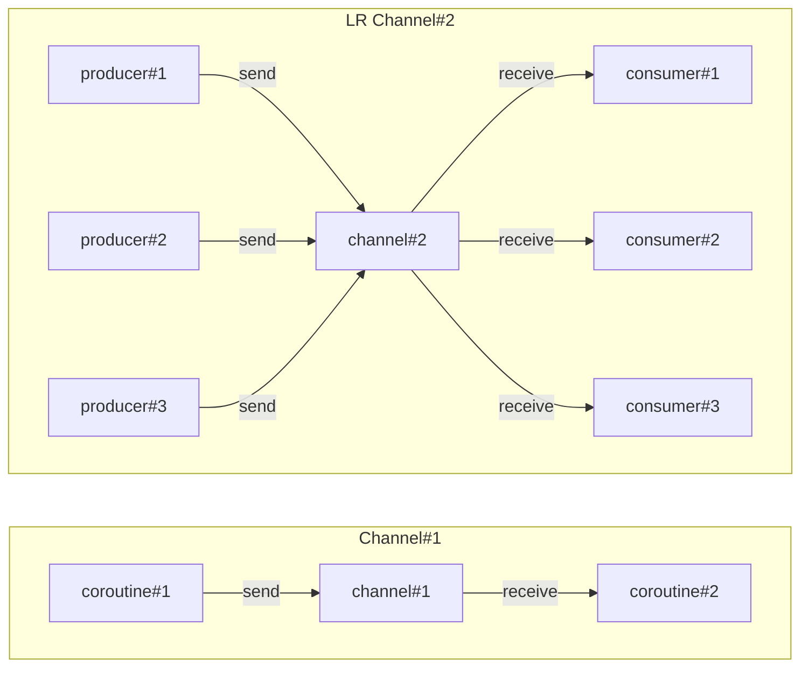

# Channel 

`Channel API`는 코루틴 간 데이터를 전송하기 위해 사용되는 통신 도구입니다.  
일반적으로 채널이 데이터를 전달하는 파이프처럼 작동한다고 생각할 수 있습니다.   

그러나 더 직관적인 비유로 도서관의 책장으로 생각할 수도 있습니다.  
책장에서는 한 사람이 책을 가져다 놓으면 다른 사람이 그 책을 가져갈 수 있습니다.

이런 방식으로 코루틴 내에서 어느 코루틴이 `Channel`에 데이터를 보내면, 다른 코루틴이 그 데이터를 받아올 수 있습니다.
이처럼 데이터를 주고 받는 두 코루틴 사이의 **직접적인 연결을 요구하지 않기에** 유용합니다.

---

`Channel`은 여러 개의 코루틴이 동시에 데이터를 보내거나 받을 수 있도록 설계되어 있습니다.  
이는 여러 코루틴이 동일한 `Channel`을 통해 정보를 주고 받을 수 있음을 의미합니다.

여기서 중요한 점은 `Channel`로 보내진 특정 값은 오직 **1번만 수신**될 수 있습니다.
이러한 특징은 `Channel`이 데이터의 일관성과 무결성을 보장하는데 중요합니다.



---

### Channel

```kotlin
interface Channel<E> : SendChannel<E>, ReceiveChannel<E>
```

`Channel` 인터페이스는 데이터를 보내는 작업과 데이터를 받는 작업을 위해 설계 되었습니다.  
이 2가지 작업을 명확히 구분하기 위해 `Channel`은 `SendChannel`과 `ReceiveChannel` 2개의 서브 인터페이스를 구현합니다.

### SendChannel

```kotlin
interface SendChannel<in E> {
    suspend fun send(element: E)
    fun close(): Boolean
    // ...
}
```

- 요소를 `Channel`에 보내기 위한 메서드들을 정의합니다.
- 코루틴이 데이터를 `SendChannel`을 통해 보내면, 이 데이터는 `Channel`의 수신자에게 제공될 수 있습니다.
- `SendChannel` 인터페이스를 통해 `Channel`을 닫을 수 있어 `Channel`의 수신자가 더 이상 데이터를 받지 못하도록 할 수 있습니다.

### ReceiveChannel

```kotlin
interface ReceiveChannel<out E> {
    suspend fun receive(): E
    fun cancel(cause: CancellationException? = null)
    // ...
}
```

- `Channel`에서 요소를 받기 위한 메서드들을 정의합니다.
- 코루틴이 `ReceiveChannel`을 통해 데이터를 받으면, 이 데이터는 `Channel`의 송신자에게 제공될 수 있습니다.

---

이처럼 `Channel`의 진입점을 제한하기 위해 `ReceiveChannel` 또는 `SendChannel`만 노출할 수 있습니다.

또한 각 인터페이스의 `send()`와 `receive()` 메서드들이 supsending 함수인것을 통해 다음과 같이 동시성 제어가 가능함을 짐작할 수 있습니다.

### 수신 시 일시 정지

코루틴이 데이터를 `Channel`에서 수신하려 시도할 때, 해당 데이터가 현재 `Channel`에 없으면 코루틴은 일시 정지됩니다.
즉, CPU 리소스를 낭비하지 않고 다른 작업을 수행할 수 있습니다. 데이터가 채널에 도착하면 코루틴은 자동으로 재개됩니다.

### 송신 시 일시 정지

`Channel`에 데이터를 전송하려 시도할 때, `Channel`의 용량이 가득 찼다면 해당 코루틴은 일시 정지됩니다.
이는 `Channel`의 용량이 초과되어 데이터 추가를 방지하며, 공간이 확보되면 코루틴은 자동으로 재개됩니다.  

### trySend & tryReceive

만약, 일시 정지되지 않는 함수에서 데이터를 보내거나 받아야 할 경우, `trySend`와 `tryReceive`를 사용할 수 있습니다.
이 메서드 들은 `Channel`의 현재 상태에 따라 즉시 성공 또는 즉시 실패를 반환하므로 일시 정지되지 않습니다.

---

`Channel`은 여러 개의 송신자와 수신자를 가질 수 있음을 계속해서 설명했습니다. 
그러나 실제 코루틴 기반 앱들은 `Channel`의 송신과 수신 측에 하나의 코루틴이 있는 경우가 일반적입니다. 

이러한 구조는 두 코루틴 사이의 직접적인 데이터 교환을 가능하게 하며, 더 복잡한 동시성 구조를 간단하게 유지할 수 있습니다.

`Channel`는 별도의 코루틴에서 생산자(송신자, producer)와 소비자(수신자, consumer)를 가져야 합니다.
즉, 생산자는 요소를 보내고, 소비자는 그것을 받습니다. 아래는 `Channel`의 간단한 구현입니다.

```kotlin
suspend fun main() = coroutineScope {
    val channel = Channel<Int>()
    
    launch {
        repeat(5) { i ->
            delay(1000)
            println("Producing next one")
            channel.send(i * 2)
        }
    }
    
    launch {
        repeat(5) {
            val received = channel.receive()
            println(received)
        }
    }
}
// 1s delay
// Producing next one
// 0
// 1s delay
// Producing next one
// 2
// ...
// 1s delay
// Producing next one
// 8
```

그러나 위 구현은 완벽하다고 할 수 없습니다.
`Channel`에서 데이터를 수신하는 전형적인 문제 중 하나는 수신자가 얼마나 많은 데이터를 수신해야 하는지 모르는 것입니다.

이러한 문제를 해결하기 위해서 코루틴은 `Channel`이 닫힐 때까지 요소를 계속해서 수신하는 방법으로 `for-loop`나 `consumeEach`를 사용 할 수 있습니다.

```kotlin
suspend fun main() = coroutineScope {
    val channel = Channel<Int>()
    
    launch {
        repeat(5) { i ->
            delay(1000)
            println("Producing next one")
            channel.send(i * 2)
        }
        channel.close()
    }
    
    launch {
        for (received in channel) {
            println(received)
        }
        
        // or 
        // channel.consumeEach { element ->
        //     println(element)
        // }
    }
}
```

위와 같은 방식은 `Channel`을 닫는 것을 잊어버리기 쉽습니다. 특히, 예외의 경우에 더욱 그렇습니다.
만약 코루틴이 예외로 인해 생성을 중단하면 다른 코루틴은 영원히 요소를 기다리게 되는 상황이 생길 수 있습니다.

이 때문에 코루틴은 `ReceiveChannel`을 반환하는 `produce` 코루틴 빌더를 제공합니다.

### Produce

`produce`는 `Channel`에서 데이터를 생성하는 코루틴을 생성할 때 사용되며 다른 코루틴에서 이 `Channel`을 통해 데이터를 수신 받을 수 있게 합니다.

또한 코루틴 본문에서 예외가 발생한 경우 자동으로 `Channel`을 닫아줍니다. 

따라서 개발자가 별도로 `close` 호출을 잊더라도 안전하게 리소스를 정리하고 다른 코루틴에게 더 이상 데이터가 없음을 알릴 수 있습니다.

```kotlin
suspend fun main() = coroutineScope {
    val channel = produce {
        repeat(5) { i ->
            delay(1000)
            println("Producing next one")
            send(i * 2)
        }
    }
    
    for(element in channel) println(element)
}
``` 