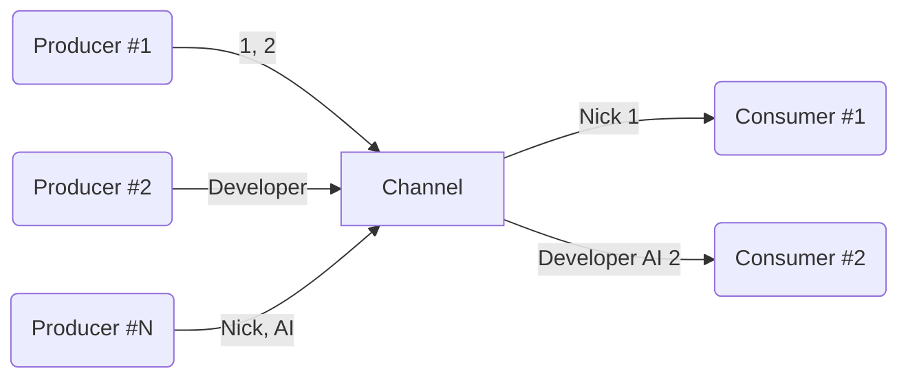

# Channel and Flow

## 목차

- [Channel](#part-31--channel)
- [Select](#part-32--select)
- [Hot and cold data sources](#part-33--hot-and-cold-data-sources)
- [Flow introduction](#part-34--flow-introduction)
- [Understanding flow](#part-35--understanding-flow)
- [Flow building](#part-36--flow-building)
- [Flow lifecycle functions](#part-37--flow-lifecycle-functions)
- [SharedFlow and StateFlow](#part-38--sharedflow-and-stateflow)

## [Part 3.1 : Channel](Channel.md)

> - Channel
>   - 'Coroutine' 간 데이터 전송•수신 가능한 파이프 라인, 오직 1번만 수신 가능
>   - 'Channel'은 데이터 전송 'Coroutine'과 데이터 수신 'Coroutine' 사이에 버퍼 역할을 하여 안전하게 데이터 전달이 가능하기에 Concurrency Issue 발생 X
> - SendChannel
>   - 데이터 전송 및 'Channel Close' 역할
>   - `send()` 시 'Channel' 용량이 가득 차있으면 'Coroutine' 중단 후, 'Channel'이 비워지면 '재개' 
> - ReceiveChannel
>   - 데이터 수신 및 'Channel Cancel' 역할
>   - `receive()` 시 'Channel'이 비어있으면 'Coroutine' 중단 후, 'Channel'이 채워지면 '재개'
> - 일반 함수에서 'Channel' 데이터 전송•수신 받는 경우 `trySend`, `tryReceive` 사용
> - `produce` 
>   - ReceiveChannel 반환 하는 CoroutineBuilder
>   - 'Coroutine'이 어떤 방식으로든 종료될 때 `Channel`을 자동으로 닫음
> - Channel Buffer Type
>   - UNLIMITED : 버퍼 용량 무한, `send()` 시 'Coroutine' 중단 없이 데이터 전송
>   - BUFFERED : 버퍼 용량 정해진 크기(기본 값 64), `send()` 시 버퍼가 가득 차면 'Coroutine' 중단
>   - RENDEZVOUS : 버퍼 용량 0, 'producer'와 'consumer'가 동시에 활성화 되어 있는 경우에만 데이터 전송•수신 가능
>   - CONFLATED : 버퍼 용량 1, 버퍼에 마지막 전송 데이터 유지, 새로운 데이터 들어오면 새로운 데이터로 대체
> - Channel Buffer Overflow
>   - SUSPEND : 버퍼가 가득 차면, `send()` 시 'Coroutine' 중단
>   - DROP_OLDEST : 버퍼가 가득 차면, 버퍼의 가장 오래된 데이터 삭제
>   - DROP_LATEST : 버퍼가 가득 차면, 버퍼의 가장 최근 데이터 삭제
> - onUndeliveredElement : 'Consumer'에게 데이터가 전달되지 않았을 경우 (예외 발생, 채널 종료-닫기 등) 처리할 수 있는 핸들러
> - Fanout Pattern : 하나의 'Channel'에서 여러 'Coroutine'이 안전하게 데이터 수신, Queue 방식 처리
> - Fanin Pattern : 여러 'Coroutine'이 하나의 'Channel'로 데이터 전송, 데이터 순서 보장 X

`Channel`은 'Coroutine' 간 직접적인 연결을 요구하지 않고, 데이터를 주고 받기 위해 사용되는 유용한 통신 도구 입니다.  
`Channel`로 보내진 데이터는 데이터는 오직 **'1번만 수신'** 가능하며, 이는 데이터의 일관성과 무결성을 보장하는데 중요합니다.



`Channel` 인터페이스는 데이터 전송과 수신 작업을 위해 설계 되었습니다.

```kotlin
interface Channel<E> : SendChannel<E>, ReceiveChannel<E>

interface SendChannel<E> {
  suspend fun send(element: E)
  fun close(): Boolean
  // ...
}

interface ReceiveChannel<E> {
  suspend fun receive(): E
  fun cancel(cause: CancellationException? = null)
  // ...
}
```

`SendChannel`은 데이터를 `Channel`에 전송하는 역할을 하며, `close()`를 통해 `Channel`을 닫을 수 있습니다.  
`send()`은 `Channel`이 가득 차 있으면, `Channel`이 비워질 때까지 '중단'되며, `Channel`에 공간이 확보되면 'Coroutine'을 자동으로 '재개' 합니다.

`ReceiveChannel`은 `Channel`의 데이터를 수신하는 역할을 하며, `cancel()`을 통해 `Channel`을 취소 시킬 수 있습니다.  
`receive()`은 `Channel`이 비어 있으면, `Channel`이 채워질 때까지 '중단'되며, 데이터가 `Channel`에 도착하면 'Coroutine'을 자동으로 '재개' 합니다. 

만약 일반 함수에서 데이터를 전송하거나 수신하려면 `trySend`와 `tryReceive`를 사용하여 즉시 성공과 즉시 실패를 반환받을 수 있습니다.

`Channel`에서 'consumer'가 얼만큼 데이터를 수신해야 하는지 모르는 경우, `Channel`이 닫힐 때까지 요소를 계속 수신하는 방법으로 `for-loop`와 `consumeEach`를 사용 할 수 있습니다. 
단, `for-loop`의 경우 `Channel`을 명시적으로 닫아줘야(`Channel.close()`) 하며, 'producer'에서 '예외가 발생'할 경우 확인이 불가능 합니다.

이를 위해 'Coroutine'은 `ReceiveChannel`을 반환하는 'CoroutineBuilder' `produce`를 제공합니다.

`produce`는 'Coroutine'이 어떤 방식으로든 종료될 때 (Finished, Stopped, Cancelled) `Channel`을 자동으로 닫아줍니다.
덕분에 `Channel`을 명시적으로 닫아줄 필요가 없이 안전하게 `Channel`을 사용할 수 있습니다.

---

`Channel`은 `capacity` 파라미터를 통해 '버퍼 용량을 지정'하여 사용할 수 있습니다.  
`capacity`에 값을 지정 하지 않으면 기본 값 'RENDEZVOUS'이 적용됩니다.

- UNLIMITED : 버퍼 용량이 무한한 채널로, `send()` 시 'Coroutine' 중단 없이 데이터 전송
- BUFFERED : 정해진 크기(기본 값 64)의 버퍼 용량을 가진 채널로, `send()` 시 버퍼가 가득 차면 'Coroutine' 중단
- RENDEZVOUS : 버퍼 용량이 0인 채널로, 'producer'와 'consumer'가 동시에 활성화 되어 있는 경우에만 데이터 전송과 수신 가능
- CONFLATED : 버퍼 용량이 1인 채널로, 버퍼에 마지막 전송 데이터가 유지되며 새로운 데이터가 들어오면 새로운 데이터로 대체

---

`Channel`은 `onBufferOverFlow` 파라미터를 통해 '버퍼 오버플로 동작'을 제어할 수 있습니다.  
`onBufferOverFlow` 값을 지정하지 않으면 기본 값 'SUSPEND'가 적용됩니다.

- SUSPEND : 버퍼가 가득 차면, `send()` 시 'Coroutine' 중단
- DROP_OLDEST : 버퍼가 가득 차면, 버퍼의 가장 오래된 데이터 삭제
- DROP_LATEST : 버퍼가 가득 차면, 버퍼의 가장 최근 데이터 삭제

---

`Channel`은 `onUndeliveredElement` 파라미터를 통해 'consumer'에게 데이터가 전달되지 않았을 경우 처리할 수 있는 핸들러를 제공합니다.
대부분 `Channel`이 `close()`, `cancel()`을 호출하거나, `send()`, `receive()`에서 예외가 발생했을 때 이 핸들러를 사용합니다.

`Channel`을 통해 데이터 전송 중 일부가 소비되지 않고 남아있는 경우, 
리소스 누수가 발생될 수 있기에 `onUndeliveredElement`을 통해 이러한 리소스를 정리하고 안전하게 관리할 수 있습니다.  

--- 

'Fanout' 패턴은 하나의 `Channel`에서 여러 'Coroutine'이 안전하게 데이터를 수신하는 패턴을 의미합니다.  
이 패턴은 `Channel`이 데이터를 'Queue' 방식으로 처리하며, 첫 번째로 대기하던 'Coroutine'이 먼저 데이터를 수신합니다.

'Fanin' 패턴은 여러 'Coroutine'이 하나의 `Channel`로 데이터를 전송하는 패턴을 의미합니다.  
이 패턴에서 주의할 점은 여러 'Coroutine'이 동시에 데이터를 전송하면 데이터 순서가 보장되지 않습니다.

여러 `Channel`을 하나로 병합하려면 `produce`를 통해 `Channel`을 생성하고 `Channel`을 병합하는 방식으로 구현할 수 있습니다.

------------------------------------------------------------------------------------------------

## [Part 3.2 : Select](Select.md)

> - `select` : 여러 'Coroutine' 중 먼저 완료되는 결과를 얻을 때 사용
> - `select`는 `Channel`과 함께 사용 가능하며, 다음과 같은 함수 지원
>   - onReceive : `Channel` 데이터 존재 시 해당 데이터 수신, `select`는 람다식 결과 반환
>   - onReceiveCatching : `Channel` 데이터 존재 시 해당 데이터 수신 및 `Channel` 닫힘 시 추가적인 처리 가능, `select` 람다식 결과 반환
>   - onSend : 데이터 '소비 속도 < 생산 속도' 일 때 사용, `Channel` 버퍼 공간 존재 시 데이터 전송, `select` `Unit` 반환

'Coroutine' `select`는 여러 'Coroutine' 중 가장 먼저 완료되는 결과를 기다리게 해줍니다. 
또한 버퍼 공간이 있는 첫 번째 `Channel`로 데이터를 전송하거나, 데이터가 준비되어 있는 첫 번째 `Channel`로부터 데이터를 수신하는 것이 가능합니다.

`Deferred`는 'Coroutine'에서 '비동기 작업의 결과'를 대표하는 타입으로 `async`에서 작업을 시작하고 결과를 `Deferred`로 반환합니다.  
그러나 때때로 여러 비동기 작업 중 가장 먼저 완료되는 것의 결과만을 원하는 경우 `select`를 사용할 수 있습니다.

```kotlin
suspend fun fetchMultipleRequest(): User = coroutineScope {
    select<User> {
        async { getRestApi1() }.onAwait { it }
        async { getRestApi2() }.onAwait { it }
    }.also { 
        coroutineContext.cancelChildren()
    }
}
```

---

`select`는 `Channel`과 함께 사용 할 수 있으며, 다음 함수들을 지원합니다.

- onReceive : `Channel` 데이터 존재 시 해당 데이터 수신, `select`는 람다 표현식 결과 반환
- onReceiveCatching : `Channel` 데이터 존재 시 해당 데이터 수신 및 `Channel` 닫힘 시 추가적인 처리 가능, `select`는 람다 표현식 결과 반환
- onSend : 데이터 소비 속도가 생산 속도 보다 느릴 경우 사용하며 `Channel` 버퍼 공간 존재 시 데이터 전송, `select`는 `Unit` 반환

--------------------------------------------------------------------

## [Part 3.3 : Hot and cold data sources](Hot%20and%20cold%20data%20sources.md)

> - 'Hot Stream'
>   - 'consumer' 소비 여부와 관계 없이 독립적으로 데이터 생성
>   - 생성된 데이터 저장 및 필요 시 제공
>   - `List`, `Channel` 등 해당
> - 'Cold Stream'
>   - 'consumer' 요청 시에만 연산 수행
>   - 데이터 미리 저장 X, 요청 발생 시 데이터 생성 및 연산
>   - `Sequence`, `Flow` 등 해당
> - 'Cold Stream' 특징
>   - 요청 발생 시 데이터를 생성하므로, 계속 요청하면 데이터가 무한할 수 있음
>   - 데이터가 필요한 시점에 연산 수행하기에 최소한의 연산만 수행
>   - 중간 결과를 저장하는 컬렉션이 필요 없기에 더 적은 메모리 사용
> - 'Coroutine'에서 `Channel`은 대표적인 'HotStream'으로, 소비와 무관하게 독립적으로 'Element'를 생성하고 유지
> - `Flow`는 'ColdStream'으로 요청(`emit()`)에 따라 'Element'를 발행하고 'consumer' 마다 독립적인 'DataStream'을 가짐
> - '`flow` Builder' 특징
>   - `CoroutineScope` 없이 Builder 사용이 가능하며, 'terminal 연산(`collect()`)'이 실행되는 'Scope'에서 실행 
>   - 'suspend function'에서 `Continuation`을 통해 'Scope'을 가져오는것과 동일한 방식으로 'Structured Concurrency' 지원 

'DataStream'은 'Hot'과 'Cold'로 구분할 수 있으며, 대부분의 데이터 소스는 'Hot'과 'Cold' 중 하나의 특성을 가집니다.

|       Hot Stream        |     Cold Stream      |
|:-----------------------:|:--------------------:|
| Collections (List, Set) |   Sequence, Stream   |
|         Channel         | Flow, RxJava streams |

'HotStream'은 다음과 같습니다.

- 적극적(eager)으로 데이터를 생성하며, 'Consumer'의 소비 여부와 관계 없이 독립적으로 데이터를 생성합니다.
- 생성된 데이터를 저장하고, 필요할 때 제공합니다.
- `List`, `Channel` 등이 해당합니다.

'ColdStream'은 다음과 같습니다.

- 'Consumer'의 요청이 있을 때만 연산을 수행 합니다. 즉, 게으른(Lazy) 실행을 합니다.
- 데이터를 미리 저장하지 않으며, 요청이 발생할 때마다 데이터를 생성하거나 연산 합니다.
- `Sequence`, `Flow` 등이 해당합니다.

'ColdStream'은 다음과 같은 특징을 지닙니다.
- 요청이 발생될 때마다 데이터를 생산하므로 무한할 수 있습니다.
- 데이터가 필요한 시점에 연산을 수행하기에 최소한의 연산만 수행 합니다.
- 중간 결과를 저장하는 컬렉션이 필요 없기에 더 적은 메모리를 사용합니다.

---

'Coroutine'에서 대표적인 'DataStream'은 `Channel`과 `Flow` 입니다.

`Channel`은 'HotStream'으로, 소비와 무관하게 독립적으로 'Element'를 생성하고 이를 유지 합니다.  
또한 'consumer' 수에 관심이 없고 'Element'는 1번 만 수신 될 수 있으므로, 
첫 번째 'consumer'가 'Element'를 모두 수신하면, 다른 'consumer'는 아무것도 수신할 수 없습니다.

반면, `Flow`는 'ColdStream'으로 요청(`emit()`)에 따라 'Element'를 발행합니다.  
`Flow`는 'consumer'가 요청할 때 까지 'Element'를 생성하지 않으며, 각 'consumer'는 독립적인 'DataStream'을 가집니다.  
즉, 'consumer' 마다 별도로 'Element'를 생성할 수 있고 발행할 수 있습니다.

`Flow`는 '`flow` Builder'를 통해 생성할 수 있으며, `CoroutineScope`가 필요하지 않습니다.  
'`flow` Builder'는 'terminal 연산(`collect()`)'이 실행되는 'Scope'에서 실행되며, 
이는 `coroutineScope`처럼 'suspend function'의 `Continuation`에서 'Scope'를 가져오는 것과 유사합니다.  

------------------------------------------------------------------

## [Part 3.4 : Flow introduction](Flow%20introduction.md)

> - `Flow`
>   - 비동기로 계산되는 'DataStream' 생성, 순차적으로 'Element' 발행
>   - 순차적으로 발행되는 'Element'에 일련의 처리 수행
>   - 유일 멤버 함수 `collect()` '터미널 연산' 제공
> - '터미널 연산' 'Thread Blocking' X, 'Coroutine 중단' O
> - '터미널 연산' 호출 지점의 'Parent Coroutine'과 연결되어 'structured concurrency' 지원
> - `Flow`는 여러 `CoroutineContext`를 지원 (CoroutineName, CoroutineExceptionHandler 등)
> - `Flow`는 '시작점', '중간 연산', '터미널 연산'으로 구성
>   - 시작점 : `flow` Builder, 다른 객체에서의 변환, Helper 함수 등
>   - 중간 연산 : 'Element' 변형, 필터링 등 연산 작업
>   - 터미널 연산 : 'Coroutine'이 '중단'되며, 'Scope'가 필요한 `Flow`의 유일한 연산
> - Flow UseCase
>   - 서버 전송 이벤트를 통한 메시지 수신 또는 전송 (WebSocket, RSocket, Notification 등)
>   - 텍스트 변경, 클릭 이벤트 등 사용자 이벤트 관찰
>   - Sensor 데이터 수신 (GPS, Accelerometer 등)
>   - 데이터 베이스 변화 관찰

`Flow`는 비동기로 계산되는 'DataStream'을 생성하고, 'Element'들이 순차적으로 흐르게 합니다.  
`Flow` 인터페이스 자체는 순차적으로 흐르는 'Element'를 가져와 일련의 처리를 합니다.  
이는 각 'Element'가 `Flow`의 'Terminal 연산'에 도달했을 때, 수집되어 처리되는 것을 의미합니다.

```kotlin
interface Flow<out T> {
    suspend fun collect(collector: FlowCollector<T>)
}
```

`collect()`는 `Flow`의 'only member function'으로 다른 함수들은 'extensions'으로 정의되어 있습니다.

---

`Flow`의 'Terminal 연산'들은 'Thread Blocking'이 아닌, 'Coroutine'을 '중단' 합니다.  
또한 'Terminal 연산' 호출 지점의 'Parent Coroutine'과 연결되어 'structured concurrency'를 지원합니다.  
즉, 'Coroutine'의 취소 메커니즘을 따르는데, 'Parent Coroutine'이 취소된 경우 그 안에서 실행 중인 `Flow`도 함께 취소됩니다. 

추가로 `Flow`는 `CoroutineContext`를 존중하여 `CoroutineExceptionHandler`, `CoroutineName` 등의 `CoroutineContext`를 지원합니다.

---

`Flow`는 '`flow` Builder', '다른 객체에서의 변환', 'Helper 함수'와 같은 시작점이 존재해야 합니다.  

'터미널 연산'은 `Flow`의 마지막 연산을 의미하며, 일반적으로 'Coroutine 중단'이 발생하거나 'Scope'가 필요한 유일한 연산입니다.
대표적으로 `collect()`, `collect { ... }`, 그 외 `launchIn`, `toList`, `toSet` 등이 있습니다.

'중간 연산'은 `Flow` 시작과 '터미널 연산' 사이에 `Flow`를 어떤 방식으로 수정하는 '중간 연산'이 있을 수 있습니다.  
이를 통해 데이터를 변형하거나 필터링 하는 등의 작업을 할 수 있습니다.

```kotlin
flow { emit("Message ABC") }                    // Start point (flow builder)
    .onStart { println("onStart") }             // Intermediate operation
    .onEach { println("onEach: $it") }          // Intermediate operation
    .onCompletion { println("onCompletion") }   // Intermediate operation
    .catch { println("catch: $it") }            // Intermediate operation
    .collect { println("collect: $it") }        // Terminal operation
```

---

`Flow` UseCase 예시 입니다.

- 서버 전송 이벤트를 통한 메시지 수신 또는 전송 (WebSocket, RSocket, Notification 등)
- 텍스트 변경, 클릭 이벤트 등 사용자 이벤트 관찰
- Sensor 데이터 수신 (GPS, Accelerometer 등)
- 데이터 베이스 변화 관찰

다수의 비동기 API 요청 상황에서 `flatMapMerge`와 `concurrency` 파라미터를 통해 호출 수를 제한하는 방법을 제공합니다.

```kotlin
suspend fun fetchMultipleRequest(
    keys: List<String>
): List<Response> = keys
        .asFlow()
        .flatMapMerge(concurrency = 4) { key ->
            suspend { api.request(key) }.asFlow()
        }
        .toList()
```

------------------------------------------------------------------

## [Part 3.5 : Understanding flow](Flow%20이해하기.md)

- 본문 참고

------------------------------------------------------------------

## [Part 3.6 : Flow building](Flow%20Building.md)

> - Flow Builder 
>   - flowOf() : `Flow`가 지닐 값 정의하여 구현, `flowOf(1, 2, 3, 4)`
>   - emptyFlow() : 비어있는 `Flow` 생성, `emptyFlow<Int>()`
>   - asFlow() : `Iterable`, `Sequence` 등 `Flow`로 변환, `listOf(1, 2, 3, 4, 5).asFlow()`
>   - flow { ... } : `emit()`, `emitAll()`을 통해 'Element' 발행하여 `Flow` 구현
>     - 순서 : flow { ... } -> emit(value: T) -> collect { ... }
> - `channelFlow`
>   - `Flow`와 같이 '터미널 연산'으로 시작
>   - `Channel`과 같이, 'consumer' 요청 없이 별도 'Coroutine'에서 데이터 생성
>   - 내부에서 `ProducerScope<E>` 사용 
>     - `CoroutineScope` 구현 되어 있어, 'Coroutine Builder'를 통한 별도 'Coroutine' 시작 가능
>     - `SendChannel<E>` 구현 되어 있어, `Channel` 직접 제어 가능
>   - 여러 'Coroutine'을 실행하여 독립적으로 값을 계산할 떄 사용
> - `callbackFlow`
>   - 'Callback'을 래핑하는데 사용되며, `channelFlow`와 마찬가지로 내부에서 `ProducerScope<T>` 사용
>   - `awaitClose { ... }` : 'Corotuine' 즉시 종료를 방지하고, `Channel`이 `cancel`, `close`을 통해 닫힐 때까지 'Coroutine'을 '중단' 상태로 유지
>   - `trySendBlocking(value)` : `send()`와 유사하지만, 'Thread Blocking'으로 처리되어 일반 함수에서 사용 가능
>   - `close()` : `Channel` 종료
>   - `cancel(throwable)` : `Channel` 종료 후 `Flow` 'consumer'에게 예외 전달 

`Flow` 생성 중 가장 간단한 방법은 `flowOf()`를 사용하는 것입니다.  
`flowOf()`는 `Flow`가 가질 값들을 정의하기만 하면 됩니다. (`listOf()`와 유사)  

또한 비어있는 `Flow` 생성하려면 `emptyFlow()`를 사용할 수 있습니다.

```kotlin
flowOf(1, 2, 3, 4, 5).collect()
emptyFlow<Int>().collect()
```

--- 

`asFlow()`를 사용하면 모든 `Iterable`, `Iterator`, `Sequence`를 `Flow`로 변환할 수 있습니다.

```kotlin
listOf(1, 2, 3, 4, 5)
    // setOf(1, 2, 3, 4, 5)
    // sequenceOf(1, 2, 3, 4, 5)
    .asFlow()
    .collect()
```

---

`Flow`는 시간에 따라 지연되는 '단일 값'을 나타나는 데 자주 사용되기에, 
'suspend function'을 `Flow`로 변환하는 방식은 매우 유용합니다.

'suspend function'의 결과는 해당 `Flow`에서 '유일 값'이 되고, 
`asFlow()`를 사용하여 `Flow`로 변환 할 수 있습니다. (`suspend () -> T`, `() -> T`)

```kotlin
suspend fun getUserName(): String { 
    delay(1000)
    return "Nick"
}

suspend fun main() {
    ::getUserName
        .asFlow()
        .collect { println(it) }

    val nameFunction = suspend { "Emma" }

    nameFunction
        .asFlow()
        .collect { println(it) }
}
```

---

`Flow` 생성 방법 중 가장 많이 사용되는 방법은 '`flow` Builder' 입니다.  
이는 'sequence builder', `produce`와 유사하게 동작됩니다.

`emit()`을 통해 다음 값을 발행하며, `Channel` 또는 `Flow` 모든 값을 발행하기 위해 `emitAll()`을 사용할 수 있습니다.

페이지 별 Rest API로 사용자 'Data Stream'을 만드는 방법 입니다.

```kotlin
fun fetchUsersFlow(api : UserApi) : Flow<User> = flow {
    var page = 0
    do {
        val users = api.takePage(page++)
        emitAll(users)
    } while (users.isNotEmpty())
}
```

---

```kotlin
fun <T> flow(
    block: suspend FlowCollector<T>.() -> Unit
): Flow<T> = object : Flow<T> {
    override suspend fun collect(collector: FlowCollector<T>) {
        collector.block()
    }
}

interface Flow<out T> {
    suspend fun collect(collector: FlowCollector<T>)
}

fun interface FlowCollector<in T> {
    suspend fun emit(value: T)
}

fun main() = runBlocking {
    flow { // 1
        emit("A")
        emit("B")
    }.collect { // 2
        println(it)
    }
}
```

'`flow` Builder' 호출 시, 실제로는 `object`를 생성합니다.  
그러나 `collect()`를 호출하는 것은 `FlowCollector`의 `block`을 호출하는 것과 같습니다.

즉, `block`은 `// 1`의 람다식을 의미하고, 람다식의 수신자는 `FlowCollector`입니다.  
'함수 인터페이스'를 람다식으로 사용하여 정의할 때, 람다식의 본문은 인터페이스에서 기대하는 유일한 함수(`emit`)의 구현으로 사용됩니다.
따라서 `emit()`의 본문은 `println(it)`과 같습니다.

그러므로 다음과 같은 실행 순서로 진행됩니다.

1. '`flow` Builder' 호출 (`Flow<T> object` 구현, `collect()` 호출 시 `FlowCollector`의 `block` 호출) 
2. `flow` 내부 `emit()` 호출 (`FlowCollector`의 `emit()` 호출)
3. `collect()` 호출 (`emit()` 발행된 각 'Element' 수신하여 `println(it)` 호출)

---

`channelFlow`는 일반 함수이며, '터미널 연산'으로 시작됩니다.  
또한 `Channel`과 유사하게, 일단 시작되면 'consumer'를 기다리지 않고 별도의 'Coroutine'에서 값을 생성합니다.

`channelFlow` 내부는 `ProducerScope<T>`를 사용합니다.  

```kotlin
interface ProducerScope<in E> : CoroutineScope, SendChannel<E> {
    val channel: SendChannel<E>
}
```
`ProducerScope<T>`는 `produce`에 의해 사용되는 것과 동일하며, `CoroutineScope`를 구현하고 있기에, 
'Coroutine Builder'를 사용하여 'Coroutine'를 시작할 수 있습니다.  

'Element' 생성을 위해 `emit()` 대신 `send()`를 사용합니다.  
또한 `SendChannel`의 다양한 함수를 통해 `Channel`을 직접 제어 할 수 있습니다. (채널 닫기, 데이터 전송 정지 등)

`channelFlow`는 `CoroutineScope`를 구현하고 있어 독립적으로 값을 계산할 때 자주 사용됩니다.

```kotlin
fun <T> contextualFlow(): Flow<T> = channelFlow {
    launch(Dispatchers.IO) { send(computeIoValue()) }
    launch(Dispatchers.Default) { send(computeCpuValue()) }
}

fun <T> Flow<T>.merge(other: Flow<T>): Flow<T> = channelFlow {
    launch { this.collect { send(it)} }
    other.collect { send(it) }
}
```

---

`callbackFlow`는 '사용자 이벤트', '다른 종류의 이벤트'의 흐름을 필요로 할 때 사용하는 기능입니다.  

'이벤트 입력 과정'과 '이벤트 처리 과정'은 독립적이어야 하므로, 
`channelFlow`가 좋은 선택이 될 수 있지만, 더 좋은 방법은 `callbackFlow` 입니다.

`callbackFlow`는 'Callback'을 래핑하는데 사용되며, `channelFlow`와 마찬가지로 내부에서 `ProducerScope<T>`를 사용합니다.

- `awaitClose { ... }` : `Channel`이 닫힐 때까지 '중단'되는 함수로, `Channel`이 닫히면 'argument'를 호출합니다.  
만약 `awaitClose`가 없는 경우 'Callback' 등록 직후 'Coroutine'이 즉시 종료됩니다.   
이는 'Coroutine' 본문이 끝나고 대기하는 'Child Coroutine'이 없으므로 자연스러운것이지만,   
이를 방지하기 위해 `awaitClose`를 사용하여 다른 방식으로 `Channel`이 닫힐 때까지 'Element'를 수신합니다.
- `trySendBlocking(value)` : `send`와 유사하지만, 'Coroutine 중단'이 아닌, 'Thread Blocking'하여 데이터를 전달 합니다.  
이는 일반 함수에서 사용이 가능하도록 합니다.
- `close()` : `Channel`을 종료시킵니다.
- `cancel(throwable)` : `Channel`을 종료하고 `Flow` 'consumer'에게 예외를 전달합니다.

### CallbackFlow

`callbackFlow`와 `channelFlow` 모두 독립적인 코루틴 환경에서 데이터 생성 및 전달을 수행합니다.  
그러나 `callbackFlow`는 콜백 기반 코드와의 통합을 목적으로 설계되었으며,
UI 이벤트와 네트워크 응답 등 비동기적인 콜백을 `Flow`로 표현할 때 사용합니다.

`callbackFlow` 다음 함수들을 통해 콜백 기안 비동기 작업을 `Flow`로 변환하고 관리할 수 있습니다.

- `awaitClose` : 코루틴이 콜백 등록 후 즉시 종료되는 것을 방지하며, 채널이 다른 방법으로 닫힐 때까지 코루틴을 일시 중지 상태로 유지합니다.
- `trySendBlocking` : 코루틴 일시 중지 없이 값을 채널에 전송하며, 일반 함수에서도 사용 가능합니다.
- `close` : 채널을 종료하고 해당 `Flow`의 데이터 전송을 중단합니다.
- `cancel` : 예외와 함께 채널을 종료하며 `Flow` 수신자에게 예외를 전달하여 오류 처리가 가능합니다.

------------------------------------------------------------------

## [Part 3.7 : Flow lifecycle functions](Flow%20lifecycle%20functions.md)

`Flow`는 다양한 이벤트를 감지하고 반응하는 기능을 제공합니다.

### onEach

`Flow` 데이터 스트림의 요소들을 순서대로 처리하며 일시 정지될 수 있어 `delay` 시 각 값을 지연하여 출력합니다.

```kotlin
flowOf(1, 2)
    .onEach { delay(1000) }
    .collect { println(it) }
```

---

### onStart

`Flow` 수집이 시작 될떄 동작하며, 터미널 연산이 호출될 때 즉시 실행됩니다.
데이터 스트림에서 데이터를 가져오기 전 로깅이나 초기화 작업을 수행하고자 할 때 `onStart`가 적합합니다.

```kotlin
flowOf(1, 3)
    .onStart { emit(0) }
    .collect { print(it) }
// 013
```

---

### onCompletion

`onCompletion`은 `Flow`의 다음과 같은 종료 시나리오에서 호출됩니다.

- 모든 데이터 전송 후
- 예외 발생
- 코루틴 취소

```kotlin
scope.launch {
    newsFlow()
        .onStart { showProgress() }
        .onCompletion { hideProgress() }
        .collect { view.showNews(it) }
}
```

---

### onEmpty

`onEmpty`는 `Flow`에서 어떠한 데이터도 전송되지 않고 종료된 경우에 호출됩니다.  
이는 특정 상황에서 데이터 없는 것이 예외적이거나, 특별한 처리가 필요한 경우에 유용합니다.

```kotlin
suspend fun main() = coroutineScope {
    flow<List<Int>> { delay(1000) }
        .onEmpty { emit(emptyList()) }
        .collect { println(it) }
}
```

---

### catch

`Flow`에서 예외가 발생한 경우 해당 예외를 처리하기 위한 함수입니다.  
`catch` 사용 시 예외를 인자로 받아 예외의 종류나 메시지에 따라 다양한 처리를 구현할 수 있습니다.

`catch` 내에서 `Flow`의 동작을 중지하지 않고 `catch` 블록 내에서 `emit`을 통해 데이터를 전송하여 계속해서 `Flow`를 실행할 수 있습니다.

또한 `Flow`의 업스트림에 대한 예외를 처리하는 데 사용하며, 다운스트림에 대한 예외는 책임지지 않습니다.

---

### Uncaught exceptions

`Flow` 내에서 잡히지 않은 예외가 발생되면 `Flow`는 즉시 중지되며 `collect`는 해당 에외를 다시 던져 호출자에게 알릴 수 있습니다.
이처럼 코루틴과 같이 `Flow`도 `try-catch`를 사용하여 예외를 잡아내고 적절한 처리를 수행할 수 있습니다.

`catch`는 파이프라인의 업스트림에 한해서 예외를 처리하기 위한것이지, 터미널 연산에서 발생하는 예외에 대해서는 동작하지 않습니다.
따라서 `collect` 내부에서 데이터를 직접 다루는 것이 아닌, `onEach`를 사용하여 해당 블록에서 작업을 수행하고, `catch`를 통해 파이프라인 모든 예외를 처리하게 할 수 있습니다.

```kotlin
flowOf(1, 2, 3)
    .onStart { println("Started") }
    .onEach { throw MyError() }
    .catch { println("Caught $it") }
    .collect()
```

---

### flowOn

`Flow`의 연산 및 빌더 내에서 사용되는 일시 중지 함수들은 터미널 연산이 호출되는 위치의 컨텍스트를 기반으로 실행됩니다.
이떄 터미널 연산 호출함으로 파이프라인을 따라 업스트림 방향으로 컨텍스트를 전파합니다.

여기서 `flowOn`을 사용하면 파이프라인 내에서 특정 부분의 컨텍스트를 변경할 수 있습니다.
또한 `flowOn`은 업스트림에 있는 함수들에 대해서만 동작함을 주의해야 합니다.

---

### launchIn

`Flow` 데이터 처리를 별도의 코루틴에서 비동기로 실행하고 싶은 경우 `launch` 코루틴 빌더와 `collect`를 사용하는 것이 일반적입니다.
그러나 이러한 패턴을 더 간결하게 만들기 위해 `launchIn`이 제공됩니다.

`launchIn`은 코루틴의 스코프를 파라미터로 받아 `collect`를 해당 스코프로 실행합니다.

```kotlin
fun <T> Flow<T>.launchIn(
    scope: CoroutineScope
): Job = scope.launch { collect() }
```

--------

## [Part 3.8 : SharedFlow and StateFlow](SharedFlow%20and%20StateFlow.md)

### SharedFlow

`SharedFlow`는 여러 코루틴이 동시에 구독하여 데이터를 수신할 수 있는 `Flow`의 특별한 타입입니다.
`SharedFlow`의 가변성 타입으로 `MutableSharedFlow`를 지원하여 데이터를 발행까지 할 수 있습니다.

#### MutableSharedFlow

`MutableSharedFlow`는 다음과 같은 특징을 지닙니다.

- 닫는 메커니즘이 없기에 한 번 시작된 수신 대기 상태의 코루틴은 계속 대기하게 됩니다.
따라서 해당 스코프에 속한 모든 코루틴을 명시적으로 취소해주어야 합니다.
- `replay` 파라미터를 통해 최근 발행된 값을 버퍼에 저장하여 제공하는 기능이 존재합니다.
- `resetReplayCache()`를 통해 버퍼에 저장된 캐시들을 초기화할 수 있습니다.
- `SharedFlow`와 `FlowCollector` 모두의 기능을 결합하여 데이터 발행과 관찰하는 기능을 갖추었습니다.

#### shareIn

`Flow`에 여러 구성 요소나 클래스들이 동일한 변화 혹은 이벤트 스트림을 기대하는 경우에 
하나의 `Flow` 소스를 여러 구독자에게 공유해야 하는 상황이 생길 수 있습니다.

이 때, `shareIn`을 통해 `Flow`를 `SharedFlow`로 간단하게 변환할 수 있으며, 아래 파라미터를 통해 원하고자 하는 동작으로 제어할 수 있습니다.

- `scope` : 해당 스코프 내에서 데이터를 수집하고, 요소를 전송하는 코루틴을 시작합니다. 이 스코프는 코루틴이 종료될 때까지 유지됩니다.
- `started` : `SharedFlow`가 어느 시점에 데이터를 수신할 지 결정합니다.
- `replay` : `SharedFlow`에 의해 저장되고 새로운 구독자에게 전송할 최근 값의 수, 즉 버퍼를 결정합니다.

이 중 `started`에 여러 옵션을 적용할 수 있스며, 이러한 옵션들은 여러 상황에서 유용합니다.

##### SharingStarted.Eagerly 

`SharedFlow`가 즉시 데이터를 수신하며, 별도의 수신자가 구독을 시작하기 전에도 원본 `Flow`에서 데이터를 수신합니다.

단, `replay = 0`일 경우 새로운 수신자가 구독을 시작하기 전 발행된 데이터는 저장되지 않고 손실되지만,
`replay = 2`인 경우 최근 2개의 데이터를 저장하고 새로운 수신자가 구독을 시작하면 저장된 데이터를 전송합니다.

##### SharingStarted.Lazily

`SharedFlow`가 첫 번째 구독자가 등장하기 전까지 데이터 수신을 지연합니다.

이 옵션은 첫 번째 구독자가 발행된 모든 값을 얻는 것을 보장하며, 그 후에 구독자들은 `replay` 설정 값에 따라 최근 데이터만 받을 수 있습니다.
또한 모든 구독자가 `SharedFlow`의 구독을 중단하더라도 원본 `Flow`는 계속 활성화되어 데이터를 수신할 수 있습니다.

##### SharingStarted.WhileSubscribed

`SharedFlow`의 동작을 구독자 존재에 따라 동적으로 제어됩니다.

최초 구독자가 등장하면 `SharedFlow`는 원본 `Flow`로 부터 데이터 수신을 시작하며,  
마지막 구독자가 사라지면 `SharedFlow`는 데이터 수신을 일시 중지합니다.  
데이터 수신이 중지된 상태에서 구독자가 등장하면, `SharedFlow`는 다시 데이터 수신을 시작합니다.

또한 2가지 파라미터를 제공하여 더욱 세밀하게 조절할 수 있습니다.

- `stopTimeoutMillis` : 마지막 구독자가 사라진 후, 데이터 수신 허용의 시간을 결정하며 기본 값은 `0` 입니다.
- `replayExpriationMillis` : `SharedFlow`가 중지된 후 버퍼를 유지 시간을 결정하며 기본 값은 `Long.MAX_VLAUE` 입니다.

----

## StateFlow

`StateFlow`는 `SharedFlow` 개념의 확장으로, 항상 최신 값을 저장하고 있는 특성을 지닙니다.  

이는 `StateFlow`의 `value` 프로퍼티를 통해 현재 상태를 읽거나 설정할 수 있습니다.
또한 `value`의 값이 변경되면 자동으로 업데이트 알림을 보내며, 이 알림을 통해 구독자는 항상 최신 상태의 값을 받을 수 있습니다.

`StateFlow`는 `MutableStateFlow`를 통해 가변성을 지니며, 
`MutableStateFlow` 사용 시 생성자에 초기 값을 설정해야 합니다.
이 초기 값은 나중에 다양한 구독자에게 전파됩니다.

Android 플랫폼에서는 `LiveData` 대신 `StateFlow`을 대안으로 사용할 수 있는데 이는
`StateFlow`가 코루틴을 지원하며 초기 값이 있기에 `LiveData`의 `nullable` 상태를 대안할 수 있기 때문입니다.

단점으로 `StateFlow`는 `conflated`되어 있어 값이 빠르게 여러 번 변경되는 경우 일부를 놓칠 수 있습니다.
만약 모든 이벤트를 수신하려면 `SharedFlow`를 사용해야 합니다.

#### stateIn

`stateIn`은 `Flow`에서 발생되는 이벤트, 값의 스트림을 지속적인 상태로 변환하는 데 사용됩니다.
이 변환을 통해 `Flow`의 최신 값에 쉽게 접근하고 관찰할 수 있습니다.

`stateIn`은 코루틴 스코프와 함께 호출될 수 있으며, 2가지 타입으로 나뉘어 집니다.

- 초기 값을 지정하지 않으면 첫 번째 값이 계산될 떄까지 코루틴을 일시 중지 합니다.
- 초기 값 제공 시 코루틴이 일시 중지 되지 않으며, `started` 파라미터와 함께 사용합니다. (`shareIn`에서 사용되는 `started`와 동일한 옵션과 동일하게 사용됩니다.)
