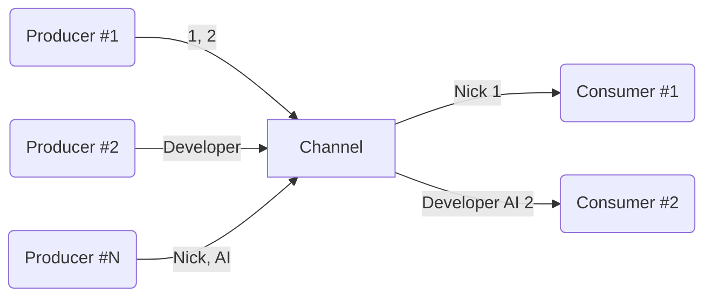

# Channel and Flow

## 목차

- [Channel](#part-31--channel)
- [Select](#part-32--select)
- [Hot and cold data sources](#part-33--hot-and-cold-data-sources)
- [Flow introduction](#part-34--flow-introduction)
- [Understanding flow](#part-35--understanding-flow)
- [Flow building](#part-36--flow-building)
- [Flow lifecycle functions](#part-37--flow-lifecycle-functions)
- [SharedFlow and StateFlow](#part-38--sharedflow-and-stateflow)

## [Part 3.1 : Channel](Channel.md)

> - Channel
>   - 'Coroutine' 간 데이터 전송•수신 가능한 파이프 라인, 오직 1번만 수신 가능
>   - 'Channel'은 데이터 전송 'Coroutine'과 데이터 수신 'Coroutine' 사이에 버퍼 역할을 하여 안전하게 데이터 전달이 가능하기에 Concurrency Issue 발생 X
> - SendChannel
>   - 데이터 전송 및 'Channel Close' 역할
>   - `send()` 시 'Channel' 용량이 가득 차있으면 'Coroutine' 중단 후, 'Channel'이 비워지면 '재개' 
> - ReceiveChannel
>   - 데이터 수신 및 'Channel Cancel' 역할
>   - `receive()` 시 'Channel'이 비어있으면 'Coroutine' 중단 후, 'Channel'이 채워지면 '재개'
> - 일반 함수에서 'Channel' 데이터 전송•수신 받는 경우 `trySend`, `tryReceive` 사용
> - `produce` 
>   - ReceiveChannel 반환 하는 CoroutineBuilder
>   - 'Coroutine'이 어떤 방식으로든 종료될 때 `Channel`을 자동으로 닫음
> - Channel Buffer Type
>   - UNLIMITED : 버퍼 용량 무한, `send()` 시 'Coroutine' 중단 없이 데이터 전송
>   - BUFFERED : 버퍼 용량 정해진 크기(기본 값 64), `send()` 시 버퍼가 가득 차면 'Coroutine' 중단
>   - RENDEZVOUS : 버퍼 용량 0, 'producer'와 'consumer'가 동시에 활성화 되어 있는 경우에만 데이터 전송•수신 가능
>   - CONFLATED : 버퍼 용량 1, 버퍼에 마지막 전송 데이터 유지, 새로운 데이터 들어오면 새로운 데이터로 대체
> - Channel Buffer Overflow
>   - SUSPEND : 버퍼가 가득 차면, `send()` 시 'Coroutine' 중단
>   - DROP_OLDEST : 버퍼가 가득 차면, 버퍼의 가장 오래된 데이터 삭제
>   - DROP_LATEST : 버퍼가 가득 차면, 버퍼의 가장 최근 데이터 삭제
> - onUndeliveredElement : 'Consumer'에게 데이터가 전달되지 않았을 경우 (예외 발생, 채널 종료-닫기 등) 처리할 수 있는 핸들러
> - Fanout Pattern : 하나의 'Channel'에서 여러 'Coroutine'이 안전하게 데이터 수신, Queue 방식 처리
> - Fanin Pattern : 여러 'Coroutine'이 하나의 'Channel'로 데이터 전송, 데이터 순서 보장 X

`Channel`은 'Coroutine' 간 직접적인 연결을 요구하지 않고, 데이터를 주고 받기 위해 사용되는 유용한 통신 도구 입니다.  
`Channel`로 보내진 데이터는 데이터는 오직 **'1번만 수신'** 가능하며, 이는 데이터의 일관성과 무결성을 보장하는데 중요합니다.



`Channel` 인터페이스는 데이터 전송과 수신 작업을 위해 설계 되었습니다.

```kotlin
interface Channel<E> : SendChannel<E>, ReceiveChannel<E>

interface SendChannel<E> {
  suspend fun send(element: E)
  fun close(): Boolean
  // ...
}

interface ReceiveChannel<E> {
  suspend fun receive(): E
  fun cancel(cause: CancellationException? = null)
  // ...
}
```

`SendChannel`은 데이터를 `Channel`에 전송하는 역할을 하며, `close()`를 통해 `Channel`을 닫을 수 있습니다.  
`send()`은 `Channel`이 가득 차 있으면, `Channel`이 비워질 때까지 '중단'되며, `Channel`에 공간이 확보되면 'Coroutine'을 자동으로 '재개' 합니다.

`ReceiveChannel`은 `Channel`의 데이터를 수신하는 역할을 하며, `cancel()`을 통해 `Channel`을 취소 시킬 수 있습니다.  
`receive()`은 `Channel`이 비어 있으면, `Channel`이 채워질 때까지 '중단'되며, 데이터가 `Channel`에 도착하면 'Coroutine'을 자동으로 '재개' 합니다. 

만약 일반 함수에서 데이터를 전송하거나 수신하려면 `trySend`와 `tryReceive`를 사용하여 즉시 성공과 즉시 실패를 반환받을 수 있습니다.

`Channel`에서 'consumer'가 얼만큼 데이터를 수신해야 하는지 모르는 경우, `Channel`이 닫힐 때까지 요소를 계속 수신하는 방법으로 `for-loop`와 `consumeEach`를 사용 할 수 있습니다. 
단, `for-loop`의 경우 `Channel`을 명시적으로 닫아줘야(`Channel.close()`) 하며, 'producer'에서 '예외가 발생'할 경우 확인이 불가능 합니다.

이를 위해 'Coroutine'은 `ReceiveChannel`을 반환하는 'CoroutineBuilder' `produce`를 제공합니다.

`produce`는 'Coroutine'이 어떤 방식으로든 종료될 때 (Finished, Stopped, Cancelled) `Channel`을 자동으로 닫아줍니다.
덕분에 `Channel`을 명시적으로 닫아줄 필요가 없이 안전하게 `Channel`을 사용할 수 있습니다.

---

`Channel`은 `capacity` 파라미터를 통해 '버퍼 용량을 지정'하여 사용할 수 있습니다.  
`capacity`에 값을 지정 하지 않으면 기본 값 'RENDEZVOUS'이 적용됩니다.

- UNLIMITED : 버퍼 용량이 무한한 채널로, `send()` 시 'Coroutine' 중단 없이 데이터 전송
- BUFFERED : 정해진 크기(기본 값 64)의 버퍼 용량을 가진 채널로, `send()` 시 버퍼가 가득 차면 'Coroutine' 중단
- RENDEZVOUS : 버퍼 용량이 0인 채널로, 'producer'와 'consumer'가 동시에 활성화 되어 있는 경우에만 데이터 전송과 수신 가능
- CONFLATED : 버퍼 용량이 1인 채널로, 버퍼에 마지막 전송 데이터가 유지되며 새로운 데이터가 들어오면 새로운 데이터로 대체

---

`Channel`은 `onBufferOverFlow` 파라미터를 통해 '버퍼 오버플로 동작'을 제어할 수 있습니다.  
`onBufferOverFlow` 값을 지정하지 않으면 기본 값 'SUSPEND'가 적용됩니다.

- SUSPEND : 버퍼가 가득 차면, `send()` 시 'Coroutine' 중단
- DROP_OLDEST : 버퍼가 가득 차면, 버퍼의 가장 오래된 데이터 삭제
- DROP_LATEST : 버퍼가 가득 차면, 버퍼의 가장 최근 데이터 삭제

---

`Channel`은 `onUndeliveredElement` 파라미터를 통해 'consumer'에게 데이터가 전달되지 않았을 경우 처리할 수 있는 핸들러를 제공합니다.
대부분 `Channel`이 `close()`, `cancel()`을 호출하거나, `send()`, `receive()`에서 예외가 발생했을 때 이 핸들러를 사용합니다.

`Channel`을 통해 데이터 전송 중 일부가 소비되지 않고 남아있는 경우, 
리소스 누수가 발생될 수 있기에 `onUndeliveredElement`을 통해 이러한 리소스를 정리하고 안전하게 관리할 수 있습니다.  

--- 

'Fanout' 패턴은 하나의 `Channel`에서 여러 'Coroutine'이 안전하게 데이터를 수신하는 패턴을 의미합니다.  
이 패턴은 `Channel`이 데이터를 'Queue' 방식으로 처리하며, 첫 번째로 대기하던 'Coroutine'이 먼저 데이터를 수신합니다.

'Fanin' 패턴은 여러 'Coroutine'이 하나의 `Channel`로 데이터를 전송하는 패턴을 의미합니다.  
이 패턴에서 주의할 점은 여러 'Coroutine'이 동시에 데이터를 전송하면 데이터 순서가 보장되지 않습니다.

여러 `Channel`을 하나로 병합하려면 `produce`를 통해 `Channel`을 생성하고 `Channel`을 병합하는 방식으로 구현할 수 있습니다.

------------------------------------------------------------------------------------------------

## [Part 3.2 : Select](Select.md)

코루틴의 `select`는 여러 코루틴 중 먼저 완료되는 코루틴을 기다리는 제공을 하여 이를 통해 여러 작업 중 빠르게 처리되는 작업의 결과를 얻을 수 있습니다.
추가로 여러 채널 중 데이터를 전송하거나, 데이터를 수신할 수 있는 첫 번째 채널을 선택하는 것도 가능합니다.

### Selecting deferred values

코루틴에서 대표적인 비동기 처리 방법으로는 `async`를 통해 처리하는 방법이 있습니다.

이러한 비동기 작업을 여러 작업을 동시에 실행하여 가장 먼저 처리되는 작업의 결과를 얻고 싶은 상황이 발생될 수 있습니다.
이러한 경우 `select`와 `async`를 같이 사용하여 가장 먼저 완료되는 비동기 작업을 얻을 수 있습니다.

주의할 점으로 하나의 코루틴 스코프에서 `select`를 통해 여러 비동기 작업을 실행할 때,   
코루틴의 [구조적 동시성 메커니즘](../Structured%20Concurrency.md)에 의해 모든 비동기 작업이 처리되지 않으면 해당 스코프가 완료되지 않는 비효율적인 처리가 될 수 있습니다.

이러한 문제를 해결하기 위해 `select`로 결과를 선택한 후 `also`를 사용하여 완료되지 않은 비동기 작업을 취소하는 별도의 작업을 추가하는 것이 효율적입니다.

```kotlin
select<User> {
    async { getRestApi1() }.onAwait { it }
    async { getRestApi2() }.onAwait { it }
}.also { coroutineContext.cancelChildren() }
```

---

### Selecting from channels

`select`과 채널을 같이 사용하여 여러 채널 중 데이터를 전송하거나, 데이터를 수신할 수 있는 첫 번째 채널을 선택할 수 있으며 다음 함수들을 지원합니다.

- onReceive : 채널에 데이터가 있을 떄 데이터를 받아올 수 있으며 `select`는 람다식의 결과를 반환합니다.
- onReceiveCatching : 채널에 데이터가 있을 떄 데이터를 받아올 수 있고, 추가로 채널이 닫혔을 떄 채널을 정리하는 등의 처리할 수 있습니다.
  `select`는 람다식의 결과를 반환합니다.
- onSend : 채널의 버퍼에 공간이 있을 때 데이터를 전송할 수 있습니다. `select`는 `Unit`을 반환합니다.

--------------------------------------------------------------------

## [Part 3.3 : Hot and cold data sources](Hot%20and%20cold%20data%20sources.md)

### Hot vs Cold

Hot Stream은 소비자의 구독과 관계 없이 데이터를 계속해서 생성하며, 생성된 데이터를 저장하고 있다가 필요할 때 제공할 수 있습니다.

Cold Stream은 데이터가 필요할 때까지 어떠한 연산도 수행하지 않습니다. 즉, 구독자가 데이터를 요청할 때만 데이터를 생성하고 연산을 수행하여 제공합니다.

이러한 특징으로 Cold Stream은 요청이 올 때 데이터를 생성하므로 이론적으로 데이터 길이가 무한할 수 있습니다.  
또한 최소한의 연산만을 수행하기에 연산의 최적화와 효율성을 가지며, 중간 결과를 저장하는 컬렉션이 없기에 메모리 사용량이 적습니다.

### Hot channels, cold flow

`Channel`과 `flow` 빌더는 개념적으로 유사하지만, 동작 방식에 차이가 있습니다.

`Channel`은 Hot Stream으로 즉시 값을 계산하여 시작합니다.  
이러한 계산은 수신자가 준비될 때까지 중지되며, `Channel`은 소비와 무관하게 요소를 독립적으로 생산하고 보관합니다.
또한 요소는 1번만 수신될 수 있기에 하나의 수신자가 모든 요소를 수신하면, 다른 수신자는 아무런 요소를 받을 수 없습니다.

`Flow`는 Cold Stream으로 요청에 따라 요소가 생산됩니다.  
또한 `Flow`는 처리 작업을 하지 않는 단순한 정의로 터미널 연산(`collect`)가 수행될 때 요소가 어떻게 생산될지에 대해 정의합니다.
즉, 터미널 연산을 여러번 시도하면 계속해서 요소를 사용할 수 있습니다.

------------------------------------------------------------------

## [Part 3.4 : Flow introduction](Flow%20introduction.md)

### The characteristics of Flow

`collect`와 같은 터미널 연산은 스레드 차단이 아닌 코루틴을 중지하며, 현재 코루틴 컨텍스트를 존중하여 다른 코루틴 컨텍스트들의
기능(`CoroutineExceptionHandler`, `CoroutineName` 등)들을 지원합니다.  
또한 구조적 동시성을 지원하기에 부모 코루틴이 취소되면, 내부에서 실행 중인 Flow 연산도 함께 취소됩니다.

`flow` 빌더는 일시 중지 함수가 아니며, 특별한 코루틴 없이 사용할 수 있지만, 터미널 연산은 코루틴을 중지한다는 특징을 알아야 합니다.

### Flow nomenclature

모든 Flow는 시작점이 필요하며 `flow` 빌더, 다른 객체로부터의 변환, 헬퍼 함수로 시작할 수 있습니다.  
터미널 연산은 Flow 처리를 마무리하는 단계로, 일시 중지 될 수 있습니다.  
Flow 시작과 터미녈 연산 사이에 중간 연산을 통해 데이터를 변형하거나 필터링 하는 등의 작업을 할 수 있습니다.

### Real-life use cases

다음은 Flow의 일반적인 사용 사례입니다.

- 웹소켓, 알림 등 서버와 메시지를 계속해서 주고받을 때
- 버튼 클릭, 텍스트 입력과 같은 연속적인 데이터 스트림으로 간주되는 사용자 이벤트 관찰
- GPS, 가속도계 등 센서에서 수신되는 연속적인 데이터 정보
- 데이터 베이스가 변화되는것을 관찰

또한 많은 양의 API를 요청하는 상황에서 `flatMapMerge` 중간 연산의 `concurrency` 파라미터를 추가하여 호출의 수를 제한하는 방법을 제공합니다.

------------------------------------------------------------------

## [Part 3.5 : Understanding flow](Flow%20이해하기.md)

Flow는 여러 여산들의 실행 정의를 나타내는 개념으로 중단 람다식과 유사합니다.

중단 람다식은 특정 연산이나 작업을 잠시 중단하고 나중에 재개 해주는 기능을 가진 코드 블록을 의미합니다.  
이는 기본 람다식에 `suspend` 키워드를 사용하여 만들 수 있으며, 코루틴 내에서 `delay`와 같이 일시적으로 정지할 수 있습니다.

그러나 이러한 람다식들은 코드 복잡성을 증가시킬 수 있기에, 이러한 람다 구현을 함수형 인터페이스로 정의하여 인스턴스를 전달할 필요 없이 직접 람다식을 사용하여 호출할 수 있습니다.

또한 함수형 인터페이스는 람다식으로 표현될 수 있기에 해당 람다식을 리시버 타입으로 만들어 특정 객체 참조 없이 멤버를 직접 사용할 수 있도록 할 수 있습니다.

```kotlin
fun interface FlowCollector<T> {
    suspend fun emit(value: T)
}

val f: suspend FlowCollector<String>.() -> Unit = {
    emit("A")
}
```

그럼에도 람다식 대신 인터페이스를 통해 코드의 목적과 구조가 명확해지길 원한다면 다음과 같이 정의할 수 있습니다.

```kotlin
interface Flow<T> {
    suspend fun collect(collector: FlowCollector<T>)
}

val builder: suspend FlowCollector<String>.() -> Unit = {
    emit("A")
}

val flow: Flow<String> = object : Flow<String> {
    override suspend fun collect(collector: FlowCollector<String>) {
        collector.builder()
    }
}
```

한번 더 `flow`의 생성을 간소화하기 위해 `flow` 빌더를 정의할 수 있습니다.

```kotlin
fun <T> flow(builder: suspend FlowCollector<T>.() -> Unit) = object : Flow<T> {
    override suspend fun collect(collector: FlowCollector<T>) {
        collector.builder()
    }
}

val flow: Flow<String> = flow {
    emit("A")
}
```

---

### Flow is synchronous

Flow는 동기적 특성을 가집니다. 즉, 각 단계의 실행은 순차적으로 이루어지고 특정 단계가 완료되기 전 다음 단계로 넘어가지 않습니다.

예를 들어 `collect`는 모든 요소를 수집하는 동안 중단되며, 이는 `Flow`가 동기적이고 새로운 코루틴을 생성하지 않음을 나타냅니다.
또한 `onEach`에서 `delay`를 사용하면 동기적 특성으로 인해 각 요소 사이에 `delay`가 적용됩니다.

---

### Flow and shared states

`Flow`는 동기적 특징을 지니기에, `Flow` 연산 내 로컬 변수를 사용하여 일부 데이터를 임시로 저장하거나,
연산의 중간 결과를 계산하는 등의 작업은 안전하다고 할 수 있습니다.

그러나 여러 코루틴에서 동시에 실행되는 `Flow` 혹은 다른 코루틴과 공유되는 상태를 사용할 때는
동시성 문제가 발생될 수 있으므로 동기화 메커니즘을 사용하여 공유된 상태를 보호해야 합니다.

------------------------------------------------------------------

## [Part 3.6 : Flow building](Flow%20Building.md)

### Flow from raw values

`Flow`를 생성하는 가장 간단한 방법은 `flowOf` 함수를 사용하는 것입니다.
또한 비어있는 `Flow`를 생성하려면 `emptyFlow`를 사용할 수 있습니다.

```kotlin
flowOf(1, 2, 3, 4, 5).collect()
emptyFlow<Int>().collect()
```

--- 

### Converters

`asFlow`는 `Iterable`, `Iterator`, `Sequence`와 같은 컬렉션 형태의 데이터 구조를 `Flow`로 변환하는 데 사용됩니다.

```kotlin
listOf(1, 2, 3, 4, 5)
    // setOf(1, 2, 3, 4, 5)
    // sequenceOf(1, 2, 3, 4, 5)
    .asFlow()
    .collect()
```

---

### Converting a function to a flow

기존의 suspending 함수나 일반 함수의 결과를 `Flow`로 변환하는 경우, `Flow`는 해당 함수의 결과만을 포함하게 됩니다.
즉, `suspend () -> T` or `() -> T`의 경우 `Flow<T>`로 변환됨을 말합니다.

또한 참조 연산자(`::`)를 통해 특정 함수를 참조하여 `Flow`로 변환할 수 있습니다.

---

### Flow builders

`flow { ... }` 빌더는 `Flow`를 생성하는 일반적인 방법으로 순차적 데이터 구조 혹은 채널을 생성하는 방식과 유사하게 동작합니다.

`emit`을 통해 원하는 값을 `Flow`에 추가할 수 있으며 `emitAll`을 사용하면 채널이나 다른 `Flow`의 값을 현재의 `Flow`에 순차적으로 추가할 수 있습니다.

---

### Understanding flow builder

`flow` 빌더 호출 시 실제 코드에서는 `Flow` 객체를 생성하기만 합니다.  
생성된 `Flow` 객체는 내부적으로 `Flow` 인터페이스를 구현하며, `collect`를 호출하면 `flow` 빌더 내 정의된 코드 블록을 실행합니다.

코드 블록 내부에서는 `FlowCollector`를 통해 `emit`을 호출하여 `Flow`에 값을 추가합니다.  
이 후에 `collect`에 원하는 값을 전달하여 마무리 합니다.

이러한 방식으로 `Flow`는 직관적이고 간단합니다.   
`Flow`에 대한 다양한 확장 함수나 추가 기능들은 모두 위 원리를 기반으로 구축됩니다.

---

### ChannelFlow

`channelFlow`는 `Flow`와 같이 터미널 연산으로 시작되지만, `Channel`과 같이 독립적으로 데이터를 생성할 수 있습니다.
이렇게 생성된 데이터는 별도의 코루틴에서 처리되어 데이터의 요청과 처리가 동시에 이루어질 수 있습니다.  
즉, `Flow`와 `Channel`의 특징을 결합한 `Flow` 입니다.

`channelFlow`는 내부에서 `ProducerScope<T>` 작업을 수행하며,
`ProducerScope`는 `CoroutineScope`를 구현하기에 코루틴 생성, 코루틴 생명주기 관리, 다양한 코루틴 연산을 수행할 수 있습니다.

`ProducerScope`는 `SendChannel`을 구현하고 있어, `SendChannel`의 다양한 함수를 통해 채널을 닫거나, 특정 조건에 데이터 전송을 일시 정지하는 등의 채널 동작을 제어할 수 있습니다.
또한 내부에서 데이터를 생성하고 전송하는데 `emit`이 아닌 `send`를 사용합니다.

---

### CallbackFlow

`callbackFlow`와 `channelFlow` 모두 독립적인 코루틴 환경에서 데이터 생성 및 전달을 수행합니다.  
그러나 `callbackFlow`는 콜백 기반 코드와의 통합을 목적으로 설계되었으며,
UI 이벤트와 네트워크 응답 등 비동기적인 콜백을 `Flow`로 표현할 때 사용합니다.

`callbackFlow` 다음 함수들을 통해 콜백 기안 비동기 작업을 `Flow`로 변환하고 관리할 수 있습니다.

- `awaitClose` : 코루틴이 콜백 등록 후 즉시 종료되는 것을 방지하며, 채널이 다른 방법으로 닫힐 때까지 코루틴을 일시 중지 상태로 유지합니다.
- `trySendBlocking` : 코루틴 일시 중지 없이 값을 채널에 전송하며, 일반 함수에서도 사용 가능합니다.
- `close` : 채널을 종료하고 해당 `Flow`의 데이터 전송을 중단합니다.
- `cancel` : 예외와 함께 채널을 종료하며 `Flow` 수신자에게 예외를 전달하여 오류 처리가 가능합니다.

------------------------------------------------------------------

## [Part 3.7 : Flow lifecycle functions](Flow%20lifecycle%20functions.md)

`Flow`는 다양한 이벤트를 감지하고 반응하는 기능을 제공합니다.

### onEach

`Flow` 데이터 스트림의 요소들을 순서대로 처리하며 일시 정지될 수 있어 `delay` 시 각 값을 지연하여 출력합니다.

```kotlin
flowOf(1, 2)
    .onEach { delay(1000) }
    .collect { println(it) }
```

---

### onStart

`Flow` 수집이 시작 될떄 동작하며, 터미널 연산이 호출될 때 즉시 실행됩니다.
데이터 스트림에서 데이터를 가져오기 전 로깅이나 초기화 작업을 수행하고자 할 때 `onStart`가 적합합니다.

```kotlin
flowOf(1, 3)
    .onStart { emit(0) }
    .collect { print(it) }
// 013
```

---

### onCompletion

`onCompletion`은 `Flow`의 다음과 같은 종료 시나리오에서 호출됩니다.

- 모든 데이터 전송 후
- 예외 발생
- 코루틴 취소

```kotlin
scope.launch {
    newsFlow()
        .onStart { showProgress() }
        .onCompletion { hideProgress() }
        .collect { view.showNews(it) }
}
```

---

### onEmpty

`onEmpty`는 `Flow`에서 어떠한 데이터도 전송되지 않고 종료된 경우에 호출됩니다.  
이는 특정 상황에서 데이터 없는 것이 예외적이거나, 특별한 처리가 필요한 경우에 유용합니다.

```kotlin
suspend fun main() = coroutineScope {
    flow<List<Int>> { delay(1000) }
        .onEmpty { emit(emptyList()) }
        .collect { println(it) }
}
```

---

### catch

`Flow`에서 예외가 발생한 경우 해당 예외를 처리하기 위한 함수입니다.  
`catch` 사용 시 예외를 인자로 받아 예외의 종류나 메시지에 따라 다양한 처리를 구현할 수 있습니다.

`catch` 내에서 `Flow`의 동작을 중지하지 않고 `catch` 블록 내에서 `emit`을 통해 데이터를 전송하여 계속해서 `Flow`를 실행할 수 있습니다.

또한 `Flow`의 업스트림에 대한 예외를 처리하는 데 사용하며, 다운스트림에 대한 예외는 책임지지 않습니다.

---

### Uncaught exceptions

`Flow` 내에서 잡히지 않은 예외가 발생되면 `Flow`는 즉시 중지되며 `collect`는 해당 에외를 다시 던져 호출자에게 알릴 수 있습니다.
이처럼 코루틴과 같이 `Flow`도 `try-catch`를 사용하여 예외를 잡아내고 적절한 처리를 수행할 수 있습니다.

`catch`는 파이프라인의 업스트림에 한해서 예외를 처리하기 위한것이지, 터미널 연산에서 발생하는 예외에 대해서는 동작하지 않습니다.
따라서 `collect` 내부에서 데이터를 직접 다루는 것이 아닌, `onEach`를 사용하여 해당 블록에서 작업을 수행하고, `catch`를 통해 파이프라인 모든 예외를 처리하게 할 수 있습니다.

```kotlin
flowOf(1, 2, 3)
    .onStart { println("Started") }
    .onEach { throw MyError() }
    .catch { println("Caught $it") }
    .collect()
```

---

### flowOn

`Flow`의 연산 및 빌더 내에서 사용되는 일시 중지 함수들은 터미널 연산이 호출되는 위치의 컨텍스트를 기반으로 실행됩니다.
이떄 터미널 연산 호출함으로 파이프라인을 따라 업스트림 방향으로 컨텍스트를 전파합니다.

여기서 `flowOn`을 사용하면 파이프라인 내에서 특정 부분의 컨텍스트를 변경할 수 있습니다.
또한 `flowOn`은 업스트림에 있는 함수들에 대해서만 동작함을 주의해야 합니다.

---

### launchIn

`Flow` 데이터 처리를 별도의 코루틴에서 비동기로 실행하고 싶은 경우 `launch` 코루틴 빌더와 `collect`를 사용하는 것이 일반적입니다.
그러나 이러한 패턴을 더 간결하게 만들기 위해 `launchIn`이 제공됩니다.

`launchIn`은 코루틴의 스코프를 파라미터로 받아 `collect`를 해당 스코프로 실행합니다.

```kotlin
fun <T> Flow<T>.launchIn(
    scope: CoroutineScope
): Job = scope.launch { collect() }
```

--------

## [Part 3.8 : SharedFlow and StateFlow](SharedFlow%20and%20StateFlow.md)

### SharedFlow

`SharedFlow`는 여러 코루틴이 동시에 구독하여 데이터를 수신할 수 있는 `Flow`의 특별한 타입입니다.
`SharedFlow`의 가변성 타입으로 `MutableSharedFlow`를 지원하여 데이터를 발행까지 할 수 있습니다.

#### MutableSharedFlow

`MutableSharedFlow`는 다음과 같은 특징을 지닙니다.

- 닫는 메커니즘이 없기에 한 번 시작된 수신 대기 상태의 코루틴은 계속 대기하게 됩니다.
따라서 해당 스코프에 속한 모든 코루틴을 명시적으로 취소해주어야 합니다.
- `replay` 파라미터를 통해 최근 발행된 값을 버퍼에 저장하여 제공하는 기능이 존재합니다.
- `resetReplayCache()`를 통해 버퍼에 저장된 캐시들을 초기화할 수 있습니다.
- `SharedFlow`와 `FlowCollector` 모두의 기능을 결합하여 데이터 발행과 관찰하는 기능을 갖추었습니다.

#### shareIn

`Flow`에 여러 구성 요소나 클래스들이 동일한 변화 혹은 이벤트 스트림을 기대하는 경우에 
하나의 `Flow` 소스를 여러 구독자에게 공유해야 하는 상황이 생길 수 있습니다.

이 때, `shareIn`을 통해 `Flow`를 `SharedFlow`로 간단하게 변환할 수 있으며, 아래 파라미터를 통해 원하고자 하는 동작으로 제어할 수 있습니다.

- `scope` : 해당 스코프 내에서 데이터를 수집하고, 요소를 전송하는 코루틴을 시작합니다. 이 스코프는 코루틴이 종료될 때까지 유지됩니다.
- `started` : `SharedFlow`가 어느 시점에 데이터를 수신할 지 결정합니다.
- `replay` : `SharedFlow`에 의해 저장되고 새로운 구독자에게 전송할 최근 값의 수, 즉 버퍼를 결정합니다.

이 중 `started`에 여러 옵션을 적용할 수 있스며, 이러한 옵션들은 여러 상황에서 유용합니다.

##### SharingStarted.Eagerly 

`SharedFlow`가 즉시 데이터를 수신하며, 별도의 수신자가 구독을 시작하기 전에도 원본 `Flow`에서 데이터를 수신합니다.

단, `replay = 0`일 경우 새로운 수신자가 구독을 시작하기 전 발행된 데이터는 저장되지 않고 손실되지만,
`replay = 2`인 경우 최근 2개의 데이터를 저장하고 새로운 수신자가 구독을 시작하면 저장된 데이터를 전송합니다.

##### SharingStarted.Lazily

`SharedFlow`가 첫 번째 구독자가 등장하기 전까지 데이터 수신을 지연합니다.

이 옵션은 첫 번째 구독자가 발행된 모든 값을 얻는 것을 보장하며, 그 후에 구독자들은 `replay` 설정 값에 따라 최근 데이터만 받을 수 있습니다.
또한 모든 구독자가 `SharedFlow`의 구독을 중단하더라도 원본 `Flow`는 계속 활성화되어 데이터를 수신할 수 있습니다.

##### SharingStarted.WhileSubscribed

`SharedFlow`의 동작을 구독자 존재에 따라 동적으로 제어됩니다.

최초 구독자가 등장하면 `SharedFlow`는 원본 `Flow`로 부터 데이터 수신을 시작하며,  
마지막 구독자가 사라지면 `SharedFlow`는 데이터 수신을 일시 중지합니다.  
데이터 수신이 중지된 상태에서 구독자가 등장하면, `SharedFlow`는 다시 데이터 수신을 시작합니다.

또한 2가지 파라미터를 제공하여 더욱 세밀하게 조절할 수 있습니다.

- `stopTimeoutMillis` : 마지막 구독자가 사라진 후, 데이터 수신 허용의 시간을 결정하며 기본 값은 `0` 입니다.
- `replayExpriationMillis` : `SharedFlow`가 중지된 후 버퍼를 유지 시간을 결정하며 기본 값은 `Long.MAX_VLAUE` 입니다.

----

## StateFlow

`StateFlow`는 `SharedFlow` 개념의 확장으로, 항상 최신 값을 저장하고 있는 특성을 지닙니다.  

이는 `StateFlow`의 `value` 프로퍼티를 통해 현재 상태를 읽거나 설정할 수 있습니다.
또한 `value`의 값이 변경되면 자동으로 업데이트 알림을 보내며, 이 알림을 통해 구독자는 항상 최신 상태의 값을 받을 수 있습니다.

`StateFlow`는 `MutableStateFlow`를 통해 가변성을 지니며, 
`MutableStateFlow` 사용 시 생성자에 초기 값을 설정해야 합니다.
이 초기 값은 나중에 다양한 구독자에게 전파됩니다.

Android 플랫폼에서는 `LiveData` 대신 `StateFlow`을 대안으로 사용할 수 있는데 이는
`StateFlow`가 코루틴을 지원하며 초기 값이 있기에 `LiveData`의 `nullable` 상태를 대안할 수 있기 때문입니다.

단점으로 `StateFlow`는 `conflated`되어 있어 값이 빠르게 여러 번 변경되는 경우 일부를 놓칠 수 있습니다.
만약 모든 이벤트를 수신하려면 `SharedFlow`를 사용해야 합니다.

#### stateIn

`stateIn`은 `Flow`에서 발생되는 이벤트, 값의 스트림을 지속적인 상태로 변환하는 데 사용됩니다.
이 변환을 통해 `Flow`의 최신 값에 쉽게 접근하고 관찰할 수 있습니다.

`stateIn`은 코루틴 스코프와 함께 호출될 수 있으며, 2가지 타입으로 나뉘어 집니다.

- 초기 값을 지정하지 않으면 첫 번째 값이 계산될 떄까지 코루틴을 일시 중지 합니다.
- 초기 값 제공 시 코루틴이 일시 중지 되지 않으며, `started` 파라미터와 함께 사용합니다. (`shareIn`에서 사용되는 `started`와 동일한 옵션과 동일하게 사용됩니다.)
