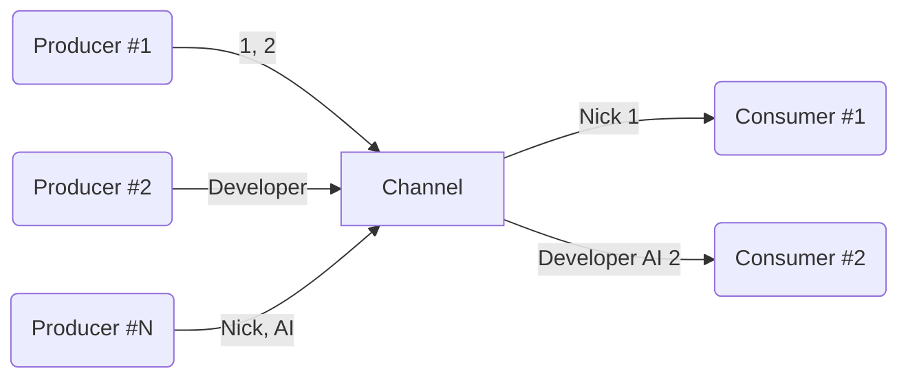

## [Part 3.1 : Channel](Channel.md)

> - Channel
>   - 'Coroutine' 간 데이터 전송•수신 가능한 파이프 라인, 오직 1번만 수신 가능
>   - 'Channel'은 데이터 전송 'Coroutine'과 데이터 수신 'Coroutine' 사이에 버퍼 역할을 하여 안전하게 데이터 전달이 가능하기에 Concurrency Issue 발생 X
> - SendChannel
>   - 데이터 전송 및 'Channel Close' 역할
>   - `send()` 시 'Channel' 용량이 가득 차있으면 'Coroutine' 중단 후, 'Channel'이 비워지면 '재개' 
> - ReceiveChannel
>   - 데이터 수신 및 'Channel Cancel' 역할
>   - `receive()` 시 'Channel'이 비어있으면 'Coroutine' 중단 후, 'Channel'이 채워지면 '재개'
> - 일반 함수에서 'Channel' 데이터 전송•수신 받는 경우 `trySend`, `tryReceive` 사용
> - `produce` 
>   - ReceiveChannel 반환 하는 CoroutineBuilder
>   - 'Coroutine'이 어떤 방식으로든 종료될 때 `Channel`을 자동으로 닫음
> - Channel Buffer Type
>   - UNLIMITED : 버퍼 용량 무한, `send()` 시 'Coroutine' 중단 없이 데이터 전송
>   - BUFFERED : 버퍼 용량 정해진 크기(기본 값 64), `send()` 시 버퍼가 가득 차면 'Coroutine' 중단
>   - RENDEZVOUS : 버퍼 용량 0, 'producer'와 'consumer'가 동시에 활성화 되어 있는 경우에만 데이터 전송•수신 가능
>   - CONFLATED : 버퍼 용량 1, 버퍼에 마지막 전송 데이터 유지, 새로운 데이터 들어오면 새로운 데이터로 대체
> - Channel Buffer Overflow
>   - SUSPEND : 버퍼가 가득 차면, `send()` 시 'Coroutine' 중단
>   - DROP_OLDEST : 버퍼가 가득 차면, 버퍼의 가장 오래된 데이터 삭제
>   - DROP_LATEST : 버퍼가 가득 차면, 버퍼의 가장 최근 데이터 삭제
> - onUndeliveredElement : 'Consumer'에게 데이터가 전달되지 않았을 경우 (예외 발생, 채널 종료-닫기 등) 처리할 수 있는 핸들러
> - Fanout Pattern : 하나의 'Channel'에서 여러 'Coroutine'이 안전하게 데이터 수신, Queue 방식 처리
> - Fanin Pattern : 여러 'Coroutine'이 하나의 'Channel'로 데이터 전송, 데이터 순서 보장 X

`Channel`은 'Coroutine' 간 직접적인 연결을 요구하지 않고, 데이터를 주고 받기 위해 사용되는 유용한 통신 도구 입니다.  
`Channel`로 보내진 데이터는 데이터는 오직 **'1번만 수신'** 가능하며, 이는 데이터의 일관성과 무결성을 보장하는데 중요합니다.



`Channel` 인터페이스는 데이터 전송과 수신 작업을 위해 설계 되었습니다.

```kotlin
interface Channel<E> : SendChannel<E>, ReceiveChannel<E>

interface SendChannel<E> {
  suspend fun send(element: E)
  fun close(): Boolean
  // ...
}

interface ReceiveChannel<E> {
  suspend fun receive(): E
  fun cancel(cause: CancellationException? = null)
  // ...
}
```

`SendChannel`은 데이터를 `Channel`에 전송하는 역할을 하며, `close()`를 통해 `Channel`을 닫을 수 있습니다.  
`send()`은 `Channel`이 가득 차 있으면, `Channel`이 비워질 때까지 '중단'되며, `Channel`에 공간이 확보되면 'Coroutine'을 자동으로 '재개' 합니다.

`ReceiveChannel`은 `Channel`의 데이터를 수신하는 역할을 하며, `cancel()`을 통해 `Channel`을 취소 시킬 수 있습니다.  
`receive()`은 `Channel`이 비어 있으면, `Channel`이 채워질 때까지 '중단'되며, 데이터가 `Channel`에 도착하면 'Coroutine'을 자동으로 '재개' 합니다. 

만약 일반 함수에서 데이터를 전송하거나 수신하려면 `trySend`와 `tryReceive`를 사용하여 즉시 성공과 즉시 실패를 반환받을 수 있습니다.

`Channel`에서 'consumer'가 얼만큼 데이터를 수신해야 하는지 모르는 경우, `Channel`이 닫힐 때까지 요소를 계속 수신하는 방법으로 `for-loop`와 `consumeEach`를 사용 할 수 있습니다. 
단, `for-loop`의 경우 `Channel`을 명시적으로 닫아줘야(`Channel.close()`) 하며, 'producer'에서 '예외가 발생'할 경우 확인이 불가능 합니다.

이를 위해 'Coroutine'은 `ReceiveChannel`을 반환하는 'CoroutineBuilder' `produce`를 제공합니다.

`produce`는 'Coroutine'이 어떤 방식으로든 종료될 때 (Finished, Stopped, Cancelled) `Channel`을 자동으로 닫아줍니다.
덕분에 `Channel`을 명시적으로 닫아줄 필요가 없이 안전하게 `Channel`을 사용할 수 있습니다.

---

`Channel`은 `capacity` 파라미터를 통해 '버퍼 용량을 지정'하여 사용할 수 있습니다.  
`capacity`에 값을 지정 하지 않으면 기본 값 'RENDEZVOUS'이 적용됩니다.

- UNLIMITED : 버퍼 용량이 무한한 채널로, `send()` 시 'Coroutine' 중단 없이 데이터 전송
- BUFFERED : 정해진 크기(기본 값 64)의 버퍼 용량을 가진 채널로, `send()` 시 버퍼가 가득 차면 'Coroutine' 중단
- RENDEZVOUS : 버퍼 용량이 0인 채널로, 'producer'와 'consumer'가 동시에 활성화 되어 있는 경우에만 데이터 전송과 수신 가능
- CONFLATED : 버퍼 용량이 1인 채널로, 버퍼에 마지막 전송 데이터가 유지되며 새로운 데이터가 들어오면 새로운 데이터로 대체

---

`Channel`은 `onBufferOverFlow` 파라미터를 통해 '버퍼 오버플로 동작'을 제어할 수 있습니다.  
`onBufferOverFlow` 값을 지정하지 않으면 기본 값 'SUSPEND'가 적용됩니다.

- SUSPEND : 버퍼가 가득 차면, `send()` 시 'Coroutine' 중단
- DROP_OLDEST : 버퍼가 가득 차면, 버퍼의 가장 오래된 데이터 삭제
- DROP_LATEST : 버퍼가 가득 차면, 버퍼의 가장 최근 데이터 삭제

---

`Channel`은 `onUndeliveredElement` 파라미터를 통해 'consumer'에게 데이터가 전달되지 않았을 경우 처리할 수 있는 핸들러를 제공합니다.
대부분 `Channel`이 `close()`, `cancel()`을 호출하거나, `send()`, `receive()`에서 예외가 발생했을 때 이 핸들러를 사용합니다.

`Channel`을 통해 데이터 전송 중 일부가 소비되지 않고 남아있는 경우, 
리소스 누수가 발생될 수 있기에 `onUndeliveredElement`을 통해 이러한 리소스를 정리하고 안전하게 관리할 수 있습니다.  

--- 

'Fanout' 패턴은 하나의 `Channel`에서 여러 'Coroutine'이 안전하게 데이터를 수신하는 패턴을 의미합니다.  
이 패턴은 `Channel`이 데이터를 'Queue' 방식으로 처리하며, 첫 번째로 대기하던 'Coroutine'이 먼저 데이터를 수신합니다.

'Fanin' 패턴은 여러 'Coroutine'이 하나의 `Channel`로 데이터를 전송하는 패턴을 의미합니다.  
이 패턴에서 주의할 점은 여러 'Coroutine'이 동시에 데이터를 전송하면 데이터 순서가 보장되지 않습니다.

여러 `Channel`을 하나로 병합하려면 `produce`를 통해 `Channel`을 생성하고 `Channel`을 병합하는 방식으로 구현할 수 있습니다.

------------------------------------------------------------------------------------------------

## [Part 3.2 : Select](Select.md)

> - `select` : 여러 'Coroutine' 중 먼저 완료되는 결과를 얻을 때 사용
> - `select`는 `Channel`과 함께 사용 가능하며, 다음과 같은 함수 지원
>   - onReceive : `Channel` 데이터 존재 시 해당 데이터 수신, `select`는 람다식 결과 반환
>   - onReceiveCatching : `Channel` 데이터 존재 시 해당 데이터 수신 및 `Channel` 닫힘 시 추가적인 처리 가능, `select` 람다식 결과 반환
>   - onSend : 데이터 '소비 속도 < 생산 속도' 일 때 사용, `Channel` 버퍼 공간 존재 시 데이터 전송, `select` `Unit` 반환

'Coroutine' `select`는 여러 'Coroutine' 중 가장 먼저 완료되는 결과를 기다리게 해줍니다. 
또한 버퍼 공간이 있는 첫 번째 `Channel`로 데이터를 전송하거나, 데이터가 준비되어 있는 첫 번째 `Channel`로부터 데이터를 수신하는 것이 가능합니다.

`Deferred`는 'Coroutine'에서 '비동기 작업의 결과'를 대표하는 타입으로 `async`에서 작업을 시작하고 결과를 `Deferred`로 반환합니다.  
그러나 때때로 여러 비동기 작업 중 가장 먼저 완료되는 것의 결과만을 원하는 경우 `select`를 사용할 수 있습니다.

```kotlin
suspend fun fetchMultipleRequest(): User = coroutineScope {
    select<User> {
        async { getRestApi1() }.onAwait { it }
        async { getRestApi2() }.onAwait { it }
    }.also { 
        coroutineContext.cancelChildren()
    }
}
```

---

`select`는 `Channel`과 함께 사용 할 수 있으며, 다음 함수들을 지원합니다.

- onReceive : `Channel` 데이터 존재 시 해당 데이터 수신, `select`는 람다 표현식 결과 반환
- onReceiveCatching : `Channel` 데이터 존재 시 해당 데이터 수신 및 `Channel` 닫힘 시 추가적인 처리 가능, `select`는 람다 표현식 결과 반환
- onSend : 데이터 소비 속도가 생산 속도 보다 느릴 경우 사용하며 `Channel` 버퍼 공간 존재 시 데이터 전송, `select`는 `Unit` 반환

--------------------------------------------------------------------

## [Part 3.3 : Hot and cold data sources](Hot%20and%20cold%20data%20sources.md)

> - 'Hot Stream'
>   - 'consumer' 소비 여부와 관계 없이 독립적으로 데이터 생성
>   - 생성된 데이터 저장 및 필요 시 제공
>   - `List`, `Channel` 등 해당
> - 'Cold Stream'
>   - 'consumer' 요청 시에만 연산 수행
>   - 데이터 미리 저장 X, 요청 발생 시 데이터 생성 및 연산
>   - `Sequence`, `Flow` 등 해당
> - 'Cold Stream' 특징
>   - 요청 발생 시 데이터를 생성하므로, 계속 요청하면 데이터가 무한할 수 있음
>   - 데이터가 필요한 시점에 연산 수행하기에 최소한의 연산만 수행
>   - 중간 결과를 저장하는 컬렉션이 필요 없기에 더 적은 메모리 사용
> - 'Coroutine'에서 `Channel`은 대표적인 'HotStream'으로, 소비와 무관하게 독립적으로 'Element'를 생성하고 유지
> - `Flow`는 'ColdStream'으로 요청(`emit()`)에 따라 'Element'를 발행하고 'consumer' 마다 독립적인 'DataStream'을 가짐
> - '`flow` Builder' 특징
>   - `CoroutineScope` 없이 Builder 사용이 가능하며, 'terminal 연산(`collect()`)'이 실행되는 'Scope'에서 실행 
>   - 'suspend function'에서 `Continuation`을 통해 'Scope'을 가져오는것과 동일한 방식으로 'Structured Concurrency' 지원 

'DataStream'은 'Hot'과 'Cold'로 구분할 수 있으며, 대부분의 데이터 소스는 'Hot'과 'Cold' 중 하나의 특성을 가집니다.

|       Hot Stream        |     Cold Stream      |
|:-----------------------:|:--------------------:|
| Collections (List, Set) |   Sequence, Stream   |
|         Channel         | Flow, RxJava streams |

'HotStream'은 다음과 같습니다.

- 적극적(eager)으로 데이터를 생성하며, 'Consumer'의 소비 여부와 관계 없이 독립적으로 데이터를 생성합니다.
- 생성된 데이터를 저장하고, 필요할 때 제공합니다.
- `List`, `Channel` 등이 해당합니다.

'ColdStream'은 다음과 같습니다.

- 'Consumer'의 요청이 있을 때만 연산을 수행 합니다. 즉, 게으른(Lazy) 실행을 합니다.
- 데이터를 미리 저장하지 않으며, 요청이 발생할 때마다 데이터를 생성하거나 연산 합니다.
- `Sequence`, `Flow` 등이 해당합니다.

'ColdStream'은 다음과 같은 특징을 지닙니다.
- 요청이 발생될 때마다 데이터를 생산하므로 무한할 수 있습니다.
- 데이터가 필요한 시점에 연산을 수행하기에 최소한의 연산만 수행 합니다.
- 중간 결과를 저장하는 컬렉션이 필요 없기에 더 적은 메모리를 사용합니다.

---

'Coroutine'에서 대표적인 'DataStream'은 `Channel`과 `Flow` 입니다.

`Channel`은 'HotStream'으로, 소비와 무관하게 독립적으로 'Element'를 생성하고 이를 유지 합니다.  
또한 'consumer' 수에 관심이 없고 'Element'는 1번 만 수신 될 수 있으므로, 
첫 번째 'consumer'가 'Element'를 모두 수신하면, 다른 'consumer'는 아무것도 수신할 수 없습니다.

반면, `Flow`는 'ColdStream'으로 요청(`emit()`)에 따라 'Element'를 발행합니다.  
`Flow`는 'consumer'가 요청할 때 까지 'Element'를 생성하지 않으며, 각 'consumer'는 독립적인 'DataStream'을 가집니다.  
즉, 'consumer' 마다 별도로 'Element'를 생성할 수 있고 발행할 수 있습니다.

`Flow`는 '`flow` Builder'를 통해 생성할 수 있으며, `CoroutineScope`가 필요하지 않습니다.  
'`flow` Builder'는 'terminal 연산(`collect()`)'이 실행되는 'Scope'에서 실행되며, 
이는 `coroutineScope`처럼 'suspend function'의 `Continuation`에서 'Scope'를 가져오는 것과 유사합니다.  

------------------------------------------------------------------

## [Part 3.4 : Flow introduction](Flow%20introduction.md)

> - `Flow`
>   - 비동기로 계산되는 'DataStream' 생성, 순차적으로 'Element' 발행
>   - 순차적으로 발행되는 'Element'에 일련의 처리 수행
>   - 유일 멤버 함수 `collect()` '터미널 연산' 제공
> - '터미널 연산' 'Thread Blocking' X, 'Coroutine 중단' O
> - '터미널 연산' 호출 지점의 'Parent Coroutine'과 연결되어 'structured concurrency' 지원
> - `Flow`는 여러 `CoroutineContext`를 지원 (CoroutineName, CoroutineExceptionHandler 등)
> - `Flow`는 '시작점', '중간 연산', '터미널 연산'으로 구성
>   - 시작점 : `flow` Builder, 다른 객체에서의 변환, Helper 함수 등
>   - 중간 연산 : 'Element' 변형, 필터링 등 연산 작업
>   - 터미널 연산 : 'Coroutine'이 '중단'되며, 'Scope'가 필요한 `Flow`의 유일한 연산
> - Flow UseCase
>   - 서버 전송 이벤트를 통한 메시지 수신 또는 전송 (WebSocket, RSocket, Notification 등)
>   - 텍스트 변경, 클릭 이벤트 등 사용자 이벤트 관찰
>   - Sensor 데이터 수신 (GPS, Accelerometer 등)
>   - 데이터 베이스 변화 관찰

`Flow`는 비동기로 계산되는 'DataStream'을 생성하고, 'Element'들이 순차적으로 흐르게 합니다.  
`Flow` 인터페이스 자체는 순차적으로 흐르는 'Element'를 가져와 일련의 처리를 합니다.  
이는 각 'Element'가 `Flow`의 'Terminal 연산'에 도달했을 때, 수집되어 처리되는 것을 의미합니다.

```kotlin
interface Flow<out T> {
    suspend fun collect(collector: FlowCollector<T>)
}
```

`collect()`는 `Flow`의 'only member function'으로 다른 함수들은 'extensions'으로 정의되어 있습니다.

---

`Flow`의 'Terminal 연산'들은 'Thread Blocking'이 아닌, 'Coroutine'을 '중단' 합니다.  
또한 'Terminal 연산' 호출 지점의 'Parent Coroutine'과 연결되어 'structured concurrency'를 지원합니다.  
즉, 'Coroutine'의 취소 메커니즘을 따르는데, 'Parent Coroutine'이 취소된 경우 그 안에서 실행 중인 `Flow`도 함께 취소됩니다. 

추가로 `Flow`는 `CoroutineContext`를 존중하여 `CoroutineExceptionHandler`, `CoroutineName` 등의 `CoroutineContext`를 지원합니다.

---

`Flow`는 '`flow` Builder', '다른 객체에서의 변환', 'Helper 함수'와 같은 시작점이 존재해야 합니다.  

'터미널 연산'은 `Flow`의 마지막 연산을 의미하며, 일반적으로 'Coroutine 중단'이 발생하거나 'Scope'가 필요한 유일한 연산입니다.
대표적으로 `collect()`, `collect { ... }`, 그 외 `launchIn`, `toList`, `toSet` 등이 있습니다.

'중간 연산'은 `Flow` 시작과 '터미널 연산' 사이에 `Flow`를 어떤 방식으로 수정하는 '중간 연산'이 있을 수 있습니다.  
이를 통해 데이터를 변형하거나 필터링 하는 등의 작업을 할 수 있습니다.

```kotlin
flow { emit("Message ABC") }                    // Start point (flow builder)
    .onStart { println("onStart") }             // Intermediate operation
    .onEach { println("onEach: $it") }          // Intermediate operation
    .onCompletion { println("onCompletion") }   // Intermediate operation
    .catch { println("catch: $it") }            // Intermediate operation
    .collect { println("collect: $it") }        // Terminal operation
```

---

`Flow` UseCase 예시 입니다.

- 서버 전송 이벤트를 통한 메시지 수신 또는 전송 (WebSocket, RSocket, Notification 등)
- 텍스트 변경, 클릭 이벤트 등 사용자 이벤트 관찰
- Sensor 데이터 수신 (GPS, Accelerometer 등)
- 데이터 베이스 변화 관찰

다수의 비동기 API 요청 상황에서 `flatMapMerge`와 `concurrency` 파라미터를 통해 호출 수를 제한하는 방법을 제공합니다.

```kotlin
suspend fun fetchMultipleRequest(
    keys: List<String>
): List<Response> = keys
        .asFlow()
        .flatMapMerge(concurrency = 4) { key ->
            suspend { api.request(key) }.asFlow()
        }
        .toList()
```

------------------------------------------------------------------

## [Part 3.5 : Understanding flow](Flow%20이해하기.md)

- 본문 참고

------------------------------------------------------------------

## [Part 3.6 : Flow building](Flow%20Building.md)

> - Flow Builder 
>   - flowOf() : `Flow`가 지닐 값 정의하여 구현, `flowOf(1, 2, 3, 4)`
>   - emptyFlow() : 비어있는 `Flow` 생성, `emptyFlow<Int>()`
>   - asFlow() : `Iterable`, `Sequence` 등 `Flow`로 변환, `listOf(1, 2, 3, 4, 5).asFlow()`
>   - flow { ... } : `emit()`, `emitAll()`을 통해 'Element' 발행하여 `Flow` 구현
>     - 순서 : flow { ... } -> emit(value: T) -> collect { ... }
> - `channelFlow`
>   - `Flow`와 같이 '터미널 연산'으로 시작
>   - `Channel`과 같이, 'consumer' 요청 없이 별도 'Coroutine'에서 데이터 생성
>   - 내부에서 `ProducerScope<E>` 사용 
>     - `CoroutineScope` 구현 되어 있어, 'Coroutine Builder'를 통한 별도 'Coroutine' 시작 가능
>     - `SendChannel<E>` 구현 되어 있어, `Channel` 직접 제어 가능
>   - 여러 'Coroutine'을 실행하여 독립적으로 값을 계산할 떄 사용
> - `callbackFlow`
>   - 'Callback'을 래핑하는데 사용되며, `channelFlow`와 마찬가지로 내부에서 `ProducerScope<T>` 사용
>   - `awaitClose { ... }` : 'Corotuine' 즉시 종료를 방지하고, `Channel`이 `cancel`, `close`을 통해 닫힐 때까지 'Coroutine'을 '중단' 상태로 유지
>   - `trySendBlocking(value)` : `send()`와 유사하지만, 'Thread Blocking'으로 처리되어 일반 함수에서 사용 가능
>   - `close()` : `Channel` 종료
>   - `cancel(throwable)` : `Channel` 종료 후 `Flow` 'consumer'에게 예외 전달 

`Flow` 생성 중 가장 간단한 방법은 `flowOf()`를 사용하는 것입니다.  
`flowOf()`는 `Flow`가 가질 값들을 정의하기만 하면 됩니다. (`listOf()`와 유사)  

또한 비어있는 `Flow` 생성하려면 `emptyFlow()`를 사용할 수 있습니다.

```kotlin
flowOf(1, 2, 3, 4, 5).collect()
emptyFlow<Int>().collect()
```

--- 

`asFlow()`를 사용하면 모든 `Iterable`, `Iterator`, `Sequence`를 `Flow`로 변환할 수 있습니다.

```kotlin
listOf(1, 2, 3, 4, 5)
    // setOf(1, 2, 3, 4, 5)
    // sequenceOf(1, 2, 3, 4, 5)
    .asFlow()
    .collect()
```

---

`Flow`는 시간에 따라 지연되는 '단일 값'을 나타나는 데 자주 사용되기에, 
'suspend function'을 `Flow`로 변환하는 방식은 매우 유용합니다.

'suspend function'의 결과는 해당 `Flow`에서 '유일 값'이 되고, 
`asFlow()`를 사용하여 `Flow`로 변환 할 수 있습니다. (`suspend () -> T`, `() -> T`)

```kotlin
suspend fun getUserName(): String { 
    delay(1000)
    return "Nick"
}

suspend fun main() {
    ::getUserName
        .asFlow()
        .collect { println(it) }

    val nameFunction = suspend { "Emma" }

    nameFunction
        .asFlow()
        .collect { println(it) }
}
```

---

`Flow` 생성 방법 중 가장 많이 사용되는 방법은 '`flow` Builder' 입니다.  
이는 'sequence builder', `produce`와 유사하게 동작됩니다.

`emit()`을 통해 다음 값을 발행하며, `Channel` 또는 `Flow` 모든 값을 발행하기 위해 `emitAll()`을 사용할 수 있습니다.

페이지 별 Rest API로 사용자 'Data Stream'을 만드는 방법 입니다.

```kotlin
fun fetchUsersFlow(api : UserApi) : Flow<User> = flow {
    var page = 0
    do {
        val users = api.takePage(page++)
        emitAll(users)
    } while (users.isNotEmpty())
}
```

---

```kotlin
fun <T> flow(
    block: suspend FlowCollector<T>.() -> Unit
): Flow<T> = object : Flow<T> {
    override suspend fun collect(collector: FlowCollector<T>) {
        collector.block()
    }
}

interface Flow<out T> {
    suspend fun collect(collector: FlowCollector<T>)
}

fun interface FlowCollector<in T> {
    suspend fun emit(value: T)
}

fun main() = runBlocking {
    flow { // 1
        emit("A")
        emit("B")
    }.collect { // 2
        println(it)
    }
}
```

'`flow` Builder' 호출 시, 실제로는 `object`를 생성합니다.  
그러나 `collect()`를 호출하는 것은 `FlowCollector`의 `block`을 호출하는 것과 같습니다.

즉, `block`은 `// 1`의 람다식을 의미하고, 람다식의 수신자는 `FlowCollector`입니다.  
'함수 인터페이스'를 람다식으로 사용하여 정의할 때, 람다식의 본문은 인터페이스에서 기대하는 유일한 함수(`emit`)의 구현으로 사용됩니다.
따라서 `emit()`의 본문은 `println(it)`과 같습니다.

그러므로 다음과 같은 실행 순서로 진행됩니다.

1. '`flow` Builder' 호출 (`Flow<T> object` 구현, `collect()` 호출 시 `FlowCollector`의 `block` 호출) 
2. `flow` 내부 `emit()` 호출 (`FlowCollector`의 `emit()` 호출)
3. `collect()` 호출 (`emit()` 발행된 각 'Element' 수신하여 `println(it)` 호출)

---

`channelFlow`는 일반 함수이며, '터미널 연산'으로 시작됩니다.  
또한 `Channel`과 유사하게, 일단 시작되면 'consumer'를 기다리지 않고 별도의 'Coroutine'에서 값을 생성합니다.

`channelFlow` 내부는 `ProducerScope<T>`를 사용합니다.  

```kotlin
interface ProducerScope<in E> : CoroutineScope, SendChannel<E> {
    val channel: SendChannel<E>
}
```
`ProducerScope<T>`는 `produce`에 의해 사용되는 것과 동일하며, `CoroutineScope`를 구현하고 있기에, 
'Coroutine Builder'를 사용하여 'Coroutine'를 시작할 수 있습니다.  

'Element' 생성을 위해 `emit()` 대신 `send()`를 사용합니다.  
또한 `SendChannel`의 다양한 함수를 통해 `Channel`을 직접 제어 할 수 있습니다. (채널 닫기, 데이터 전송 정지 등)

`channelFlow`는 `CoroutineScope`를 구현하고 있어 독립적으로 값을 계산할 때 자주 사용됩니다.

```kotlin
fun <T> contextualFlow(): Flow<T> = channelFlow {
    launch(Dispatchers.IO) { send(computeIoValue()) }
    launch(Dispatchers.Default) { send(computeCpuValue()) }
}

fun <T> Flow<T>.merge(other: Flow<T>): Flow<T> = channelFlow {
    launch { this.collect { send(it)} }
    other.collect { send(it) }
}
```

---

`callbackFlow`는 '사용자 이벤트', '다른 종류의 이벤트'의 흐름을 필요로 할 때 사용하는 기능입니다.  

'이벤트 입력 과정'과 '이벤트 처리 과정'은 독립적이어야 하므로, 
`channelFlow`가 좋은 선택이 될 수 있지만, 더 좋은 방법은 `callbackFlow` 입니다.

`callbackFlow`는 'Callback'을 래핑하는데 사용되며, `channelFlow`와 마찬가지로 내부에서 `ProducerScope<T>`를 사용합니다.

- `awaitClose { ... }` : `Channel`이 닫힐 때까지 '중단'되는 함수로, `Channel`이 닫히면 'argument'를 호출합니다.  
만약 `awaitClose`가 없는 경우 'Callback' 등록 직후 'Coroutine'이 즉시 종료됩니다.   
이는 'Coroutine' 본문이 끝나고 대기하는 'Child Coroutine'이 없으므로 자연스러운것이지만,   
이를 방지하기 위해 `awaitClose`를 사용하여 다른 방식으로 `Channel`이 닫힐 때까지 'Element'를 수신합니다.
- `trySendBlocking(value)` : `send`와 유사하지만, 'Coroutine 중단'이 아닌, 'Thread Blocking'하여 데이터를 전달 합니다.  
이는 일반 함수에서 사용이 가능하도록 합니다.
- `close()` : `Channel`을 종료시킵니다.
- `cancel(throwable)` : `Channel`을 종료하고 `Flow` 'consumer'에게 예외를 전달합니다.

### CallbackFlow

`callbackFlow`와 `channelFlow` 모두 독립적인 코루틴 환경에서 데이터 생성 및 전달을 수행합니다.  
그러나 `callbackFlow`는 콜백 기반 코드와의 통합을 목적으로 설계되었으며,
UI 이벤트와 네트워크 응답 등 비동기적인 콜백을 `Flow`로 표현할 때 사용합니다.

`callbackFlow` 다음 함수들을 통해 콜백 기안 비동기 작업을 `Flow`로 변환하고 관리할 수 있습니다.

- `awaitClose` : 코루틴이 콜백 등록 후 즉시 종료되는 것을 방지하며, 채널이 다른 방법으로 닫힐 때까지 코루틴을 일시 중지 상태로 유지합니다.
- `trySendBlocking` : 코루틴 일시 중지 없이 값을 채널에 전송하며, 일반 함수에서도 사용 가능합니다.
- `close` : 채널을 종료하고 해당 `Flow`의 데이터 전송을 중단합니다.
- `cancel` : 예외와 함께 채널을 종료하며 `Flow` 수신자에게 예외를 전달하여 오류 처리가 가능합니다.

------------------------------------------------------------------

## [Part 3.7 : Flow lifecycle functions](Flow%20lifecycle%20functions.md)

> - `Flow`는 'Element'를 순차적으로 처리하는 'Pipeline',
>   - `collect`를 통해 데이터 요청(UpStream), 'Coroutine 중단'
>   - `emit`을 통해 데이터 생성(DownStream)
> - `Flow` 연산자
>   - `onEach`, `onStart`, `onCompletion`, `onEmpty`, `catch` 등 함수 제공, 이들은 suspending 특징을 지님 (중단, 지연 등 가능)
>   - onEach : 'Element' 순차 처리
>   - onStart : '터미널 연산' 호출 시, 첫 번째 'Element'를 기다리지 않고 즉시 호출
>   - onCompletion : `Flow`가 완료된 경우 호출
>   - onEmpty : `Flow`가 어떤 'Element'도 발행하지 않고 완료되었을 때 호출
>   - catch : `Flow` 'UpStream'에서 발생한 예외를 잡아 처리
> - `catch`는 '터미널 연산' 뒤에 위치할 수 없기에, `onEach` → `catch` → `collect` 순서로 호출하여 예외 처리 하는 것이 일반적인 관행
> - `flowOn`은 '터미널 연산' 호출로 'UpStream'에 전파되는 `CoroutineContext` 변경 가능
> - `launchIn`은 `CoroutineScope`을 'argument'로 받아, 해당 'Scope' 내 새로운 'Coroutine'에서 `Flow`를 수집

`Flow`는 하나의 파이프로 상상할 수 있습니다. 이 파이프에서는 '데이터 요청'과 '데이터 생성'은 서로 다른 방향으로 이동합니다.  

`Flow`가 '완료'되거나 '예외'가 발생하면, 이런 정보 또한 '전파'되어 '중간 연산'들을 닫습니다.   
따라서 이러한 모든 흐름을 통해 값, 예외 또는 다른 특정 이벤트(시작 또는 완료)를 확인할 수 있습니다.

이를 위해 `Flow`는 `onEach`, `onStart`, `onCompletion`, `onEmpty`, `catch` 등 함수를 제공합니다.

---

`onEach`는 'suspend' 특성을 가지고 있으며, 'Element'들을 순차적으로 처리할 수 있습니다.  
따라서 `onEach` 내에 `delay` 추가 시, 각 'Element'들을 '지연'하여 출력할 수 있습니다.

```kotlin
flowOf(1, 2)
    .onEach { delay(1000) } // 1s Delay
    .collect()
```

---

`onStart`는 '터미널 연산'이 호출될 때, 첫 번째 요소를 기다리지 않고 즉시 호출되는 함수 입니다.  
중요한 점은 `onStart`에서도 'Element' 발행(`emit()`)이 가능하며, `onStart`로 발행된 'Element'들은 해당 지점부터 'DownStream'으로 흐릅니다. 

```kotlin
flowOf(1, 2)
    .onEach { delay(1000) }
    .onStart { emit(0) }
    .collect { print(it) }
// 0 
// '1s Delay' 1 
// '1s Delay' 2
```

---

`onCompletion`은 `Flow`가 완료된 경우 호출되는 함수 입니다.  
`Flow`의 완료란 다음과 같습니다.

- 마지막 'Element'가 전송 된 후
- 처리되지 않은 예외 발생
- 'Coroutine'의 취소

```kotlin
scope.launch {
    newsFlow()
        .onStart { showProgress() }
        .onCompletion { hideProgress() }
        .collect { view.showNews(it) }
}
```

---

`Flow`는 어떤 값도 발행하지 않고 완료될 수 있기에, `onEmpty`를 통해 `Flow`가 어떤 'Element'도 발행하지 않고 완료됨을 알 수 있습니다.
이처럼 어떤 'Element'도 발행하지 않았기에, '기본 값'을 '발행'하는 데 사용될 수 있습니다. 

```kotlin
suspend fun main() = coroutineScope {
    flow<List<Int>> { delay(1000) }
        .onEmpty { emit(emptyList()) }
        .collect { println(it) }
}
```

---

`Flow`를 만들거나 처리하는 동안 언제든지 예외가 발생할 수 있습니다.  
이런 예외들은 'DownStream'으로 흐르며, 경로의 모든 처리 단계를 종료 시킵니다.

`catch` 사용 시 이러한 예외를 잡아내 처리 할 수 있으며, `Flow` 복구 작업을 수행할 수 있게 도와줍니다.  
복구 작업이란, `catch`가 호출되는 시점에서는 이전 단계들이 이미 완료된 상태이지만, 새로운 값을 발행하고 나머지 `Flow`를 유지 하도록 함을 의미합니다.

또한 `catch`는 'UpStream'에서 정의된 함수에서 발생한 예외에만 반응합니다.  
만약 예외가 'DownStream'에서 발생하면, `catch`는 해당 예외를 처리하지 않습니다.  
이 때문에, `catch`는 '터미널 연산' 전에 발생하는 예외와 `Flow` 자체를 생성하는 과정에서 발생하는 에외를 처리하는 데 사용됩니다.

```kotlin
flowOf("Message 1")
    .onEach { throw Erorr(it) }
    .catch { emit("Error") }
    .collect { println(it) }
// Error
```

---

`Flow` 내에서 처리되지 않은 예외는 해당 `Flow`를 즉시 취소시키고, `collect()`는 해당 예외를 다시 발생 시킵니다. (rethrow)  
이런 행동은 'suspend function'의 특성이며, `coroutineScope` 역시 같은 방식을 동작됩니다.  

`Flow` 외부에서 예외를 잡으려면, `try-catch`를 사용하여 잡을 수 있습니다. 

`catch`는 '터미널 연산' 다음으로 위치할 수 없기에 '터미널 연산'에서 발생하는 예외를 처리할 수 없습니다.  
따라서 `collect` 내에서 예외가 발생된다면, `catch`는 해당 예외를 처리하지 않습니다.

이에 `collet` 대신 `onEach`에서 연산을 수행하고 이를 `catch` 전에 배치하는 것이 일반적인 관행입니다.  
이는 `collect`가 예외를 발생시킬 수 있다고 의심될 경우 유용합니다.

```kotlin
val flow = flow {
    emit("msg 1")
    throw Error("Error")
}

flow
    .onEach { println(it) }
    .catch { println("Caught $it") }
    .collect()

// msg 1
// Caught java.lang.Error: Error
```

---

`Flow` '연산(`onEach`, `onStart`, `onCompletion` 등)'과 '빌더(`flow`, `channelFlow`)'에 'argument'로 사용되는 람다식은 모두 'suspending'한 성격을 가집니다.
보통 'Coroutine'에서 'suspend function'은 `CoroutineContext`를 지니고 있으며, 이를 통해 'structured concurrency'를 형성합니다.

`Flow`는 `collect`가 호출되는 지점의 `CoroutineContext`를 가져와 'structured concurrency'를 형성합니다.

'터미널 연산'은 'UpStream'에 'Element'를 요청함으로써 'UpStream'으로 `CoroutienContext`를 전파합니다.  
이 때 'UpStream'으로 전파되는 `CoroutineContext`를 `flowOn`으로 '수정'할 수 있습니다.

```kotlin
suspend fun present(place: String, message: String) {
    val ctx = currentCoroutineContext()
    val name = ctx[CoroutineName]?.name
    println("[$name] $message on $place")
}

fun messageFlow(): Flow<String> = flow {
    present("flow builder", "Message")
    emit("Message")
}

suspend fun main() {
    withContext(CoroutineName("Name1")) {
        messageFlow()
            .flowOn(CoroutineName("Name3"))
            .onEach { present("onEach", it) }
            .flowOn(CoroutineName("Name2"))
            .collect { present("collect", it) }
    }
}
// [Name3] Message on flow builder
// [Name2] Message on onEach
// [Name1] Message on collect
```

---

`collect`는 `Flow`가 완료될 때까지 'Coroutine'을 '중단'시키는 'suspend function' 입니다.  

즉, 'suspend function'과 같이 '다른 Coroutine'에서 `Flow`를 처리할 수 있도록 'Coroutine Builder'로 감싸서 사용하는 것이 일반적이지만, 
`Flow`는 `launchIn`을 통해 `CoroutineScope`를 'only argument'로 받아 새로운 'Coroutine'에서 `collect`를 실행하도록 할 수 있습니다.

```kotlin
fun <T> Flow<T>.launchIn(scope: CoroutineScope): Job = 
    scope.launch { this.collect()}
```

--------

## [Part 3.8 : SharedFlow and StateFlow](SharedFlow%20and%20StateFlow.md)

> - `MutableSharedFlow`
>   - '모든 Coroutine'이 '메시지'를 보낼 수 있고, 이 메시지를 수신하고 있는 '모든 Coroutine'에게 메시지 전달 가능
>   - `replay` 설정 시 '캐시에 저장'할 '메시지 수' 지정 가능, `resetReplayCache`를 통해 재설정 가능
>   - `SharedFlow`를 상속 받아 `Flow`를 통해 '메시지 수신', `FlowCollector`를 상속 받아 `emit`을 통해 '메시지 전송'
> - `SharedFlow`
>   - 'Hot Stream'으로 이미 생성된 'Data Stream'을 '여러 consumer'에게 공유할 때 사용
>   - 다수의 클래스 또는 컴포넌트에 '동일한 이벤트' 또는 '데이터 변화'를 전파하고 싶을 때 사용
> - `shareIn`
>   - `Flow` → `SharedFlow`로 전환하는 함수, 3개 파라미터 필요
>   - scope : `Flow`의 'Element' 수집에 'Coroutine' 생성이 필요하므로, `CoroutineScope` 필요
>   - replay : 'Hot Stream' 특성으로 캐싱할 'Element' 수 지정
>   - started : 'consumer' 수에 따라 '데이터 수신 시점' 결정
>     - SharingStarted.Eagerly
>       - 즉시 `Flow` 데이터 수신
>       - 실시간 데이터 수신이 필요하거나, 'consumer' 존재 유무와 상관 없이 'DataStream' 지속 필요 시 사용
>       - `replay` 값 제한 시 구독 전 데이터 손실 가능
>     - SharingStarted.Lazily
>       - 첫 'consumer'가 나타날 때까지 `Flow` 데이터 수신 지연
>       - 자원 절약이 필요할 때 사용
>       - 'consumer'는 `replay` 값에 따라 캐싱된 데이터를 먼저 받고, 그 다음 데이터를 수신 (0이면 구독 전 모든 데이터 손실)
>     - SharingStarted.WhileSubscribed
>       - 'consumer' 존재 하는 동안만 `Flow` 데이터 수신
>       - stopTimeoutMillis : 마지막 'consumer'가 사라진 후 'Data Stream' 비 활성화 시간 지정
>       - replayExpirationMillis : `replay` 캐싱 값을 얼마 동안 유지할 지 설정
> - `StateFlow`
>   - 항상 하나의 값을 저장하며 `value`를 통해 '현재 값'에 접근 가능, '항상 최신 상태'를 '유지'할 때 사용
>   - `SharedFlow`를 확장, `replay` 값이 1인 `SharedFlow`와 동일
> - `MutableStateFlow`
>   - `StateFlow`와 `MutableSharedFlow`를 상속 받음
>   - 생성자로 초기 값 설정, `value`는 'Obserable holder'처럼 동작
> - `stateIn`
>   - `Flow` → `StateFlow`로 전환하는 함수
>   - 'suspend function' : 초기 값 지정 X, `CoroutineScope` 내에서 호출되어야 하며 첫 번째 값이 계산될 때까지 `value` 접근이 안되고 기다려야 함 
>   - '일반 함수' : 초기 값 지정 O, `started` 파라미터를 통해 'consumer' 수에 따라 '데이터 수신 시점' 결정

`MutableSharedFlow`는 방송 채널과 같이 '모든 Coroutine'이 '메시지'를 보낼 수 있고, 이 메시지를 수신하고 있는 '모든 Coroutine'에게 메시지를 전달할 수 있습니다.
그러나 이러한 특성으로 `MutableSharedFlow`의 수신을 기다리는 'Coroutine'이 계속 존재한다면, 해당 'Coroutine'을 명시적으로 취소해주어야 합니다.

`MutableSharedFlow`는 `replay` 파라미터를 설정하여 '지정된 수'만큼 최근 메시지를 '캐시에 저장'하고, 
새로운 'Coroutine'이 구독을 시작하면 캐싱된 메시지를 전달합니다. 이 캐시는 `resetReplayCache`를 사용하여 재설정할 수 있습니다.
 
`MutableSharedFlow`는 `SharedFlow`와 `FlowCollector`를 상속 받습니다.  
`SharedFlow`는 `Flow`를 상속받아 관찰에 사용되고, `FlowCollector`는 `emit`을 통해 값을 보내는 데 사용됩니다.

```kotlin
interface MutableSharedFlow<T>: SharedFlow<T>, FlowCollector<T> {
    val subscriptionCount: StateFlow<Int>
    fun resetReplayCache()
    fun tryEmit(value: T): Boolean
}

interface SharedFlow<out T>: Flow<T> {
    val replayCache: List<T>
}

interface FlowCollector<in T> {
    suspend fun emit(value: T)
}
```

`Flow`는 '사용자 이벤트', '데이터 베이스 변경', '새로운 메시지'와 같은 **변화를 관찰**하는데 사용 됩니다.  
만약 다수의 클래스가 이런 '변화'에 관심이 있고 '하나의 Flow'를 '여러 Flow'로 전환하고 싶다면 `SharedFlow`를 사용할 수 있습니다.

`Flow`를 `SharedFlow`로 전환하는 가장 간단한 방법은 `shareIn` 함수를 사용하는 것 입니다.

```kotlin
val flow = flowOf("A", "B", "C").onEach { dealy(1000) }

val sharedFlow: SharedFlow<String> = 
    flow.shareIn(
        scope = viewModelScope,
        started = ShareingStarted.Eagerly,
        replay = 0
    )

delay(500)
launch { sharedFlow.collect { print("#1$it") } }

delay(1000)
launch { sharedFlow.collect { print("#2$it") } }

delay(1000)
launch { sharedFlow.collect { print("#3$it") } }

// 1s Delay
// #1A
// 1s Delay
// #1B #2B
// 1s Delay
// #1C #2C #3C
```

`shareIn`은 `SharedFlow`를 생성하고 `Flow`의 'Element'들을 `SharedFlow`로 전달합니다.  
`Flow`에서 'Element'를 수집하기 위해 'Coroutine'을 시작해야 하므로, `shareIn`은 `CoroutineScope`를 요구 합니다.  
`replay`는 앞서 말한 캐싱할 'Element'의 수를 의미하고, `started`는 'consumer의 수'에 따라 '데이터 수신 시점'을 결정 합니다.

`started` 파라미터는 `SharingStarted`을 통해 제어할 수 있습니다.

- SharingStarted.Eagerly
  - `shareIn`이 호출될 때 즉시 `Flow`를 수신합니다. 즉, `CoroutineScope` 내에서 즉시 'DataStream'을 활성화하는 것을 의미합니다.
  - 실시간으로 데이터를 수신해야 하거나, 'consumer' 존재 유무와 상관없이 'DataStream'을 지속적으로 유지해야 하는 경우에 적합합니다.
  - 만약 `replay` 값이 제한되어 있다면, 구독하기 전에 발생한 일부 데이터가 손실될 수 있습니다. 특히, `replay = 0`인 경우에는 구독 전의 모든 데이터가 손실됩니다.
- SharingStarted.Lazily
  - 첫 번째 구독자가 등장하기 전까지 `Flow` 수신을 지연시킵니다. 즉, 최소 1명의 구독자가 있을 때만 'DataStream'을 활성화합니다.
  - 데이터를 필요로 하는 첫 번째 구독자가 나타날 떄까지 자원을 절약하고자 할 때 사용됩니다.
  - 구독자는 `replay` 값에 따라 캐싱된 데이터를 먼저 받고, 그 다음 데이터를 수신합니다. 만약 `replay = 0`인 경우, 구독 전의 모든 데이터가 손실됩니다.
- SharingStarted.WhileSubscribed
  - 첫 번째 구독자가 나타날 때 `Flow` 수신을 시작하고, 마지막 구독자가 사라질 때 `Flow` 수신을 중지합니다. 즉, 구독자가 존재하는 동안에만 'DataStream'이 유지됩니다.
  - 구독자가 있는 동안에만 데이터를 처리할 때 적합합니다.
  - `stopTimeoutMillis`를 통해 마지막 구독자가 사라진 후 얼마 동안 'DataStream'을 유지할 지 설정할 수 있습니다.
  - `replayExpirationMillis`를 통해 `replay` 캐싱 값을 얼마 동안 유지할 지 설정할 수 있습니다.

---

`StateFlow`는 `SharedFlow`를 확장한 것으로, `replay` 값이 1로 설정된 `SharedFlow`와 유사하게 동작합니다.  
**항상 하나의 값을 저장**하며, `value`를 통해 현재 값에 접근할 수 있습니다.

`MutableStateFlow`는 `StateFlow<T>`와 `MutableSharedFlow<T>`를 상속받습니다.

```kotlin
interface StateFlow<out T>: SharedFlow<T> { 
    val value: T
}

interface MutableStateFlow<T>: StateFlow<T>, MutableSharedFlow<T> {
    override var value: T
    fun compareAndSet(expect: T, update: T): Boolean
}
```

Kotlin에서는 `open val` → `var` 속성으로 'override'가 '가능'합니다. `val`은 `getter`만 허용하는 반면, `var`은 `setter`를 허용합니다.

'초기 값'은 `constructor`를 통해 전달되며, `value` 속성을 통해 값에 접근하고 설정할 수 있습니다.  
`MutableStateFlow`는 `value`에 대한 'Observable Holder'처럼 동작합니다.

```kotlin
val state = MutableStateFlow("A")

launch { 
    state.collect { println(it) } // A
} 

state.value = "B"

launch { 
    state.collect { println(it) } // B
} 
```

Android 플랫폼에서는 `LiveData` 대신 `StateFlow`를 대안으로 사용할 수 있습니다.  
`StateFlow`는 'Coroutine'을 완전하게 지원하고 '초기 값'을 가지기에 'nullable'일 필요가 없습니다. 

`StateFlow`는 새로운 값이 발행될 때, 이전 값을 더 이상 관찰할 수 없습니다. 즉, **항상 최신 상태를 유지**합니다.  
이는 상태가 '빠르게 변경'되는 경우, '느리게 반응'하는 'consumer'가 '모든 상태 변화'를 '감지'하지 못할 수 있습니다.

만약 '모든 상태 변화'를 관찰하려면 `SharedFlow`를 사용하는 것이 좋습니다.

`stateIn`은 `Flow<T>` → `StateFlow<T>`로 변환하는 함수로 반드시 `CoroutineScope`가 필요합니다.  
`stateIn`은 2가지 방법으로 사용됩니다.

- 초기 값을 지정하지 않는 경우, 첫 번째 값이 계산될 때까지 `StateFlow`의 값에 접근할 수 없으며 기다려야 합니다.
  - `flow.stateIn(scope = coroutineScope)`, 'suspend function' O
- 초기 값을 지정하는 경우, `started` 모드가 필요합니다. (`shareIn`에서 사용되는 `started`와 동일한 옵션과 동일하게 사용됩니다.)
  - `flow.stateIn(scope = coroutineScope, started = SharingStarted.Eagerly)`, 'suspend function' X