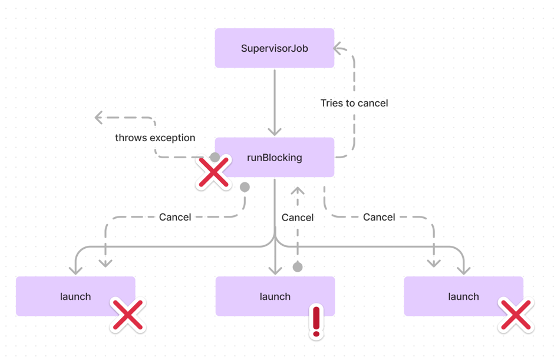

# Best practices

## Don't use async with an immediate await

`async`와 `await`를 동시에 사용하는 것은 피해야 합니다.  
이렇게 하면 `async`로 시작된 작업이 별도의 동시성을 제공하지 않고, 
즉시 `await`로 기다려야 하기에 별도의 코루틴을 시작하는 의미가 사라집니다.

```kotlin
// Don't
suspend fun getUser(): User = coroutineScope {
    val user = async { repo.getUser() }.await()
    user.toUser()
}
// Do
suspend fun getUser(): User {
    val user = repo.getUser()
    return user.toUser()
}
```

비동기 작업 시 다음과 같은 주의사항이 있습니다.

1. 스코프가 필요한 경우 `async { ... }.await()` 대신 `coroutineScope { ... }`를 사용하는 것이 좋습니다.
2. 컨텍스트 변경이 필요한 경우 `withContext`를 사용하는 것이 좋습니다.
3. 여러 개의 `async` 작업 시 가독성을 위해 모든 작업에 `async`를 적용하는 것이 좋습니다.

```kotlin
fun showNews() {
    viewModelScope.launch {
        val config = async { getConfigFromApi() }
        val news = async { getNewsFromApi(config.await()) }
        val user = async { getUserFromApi() }
        
        view.showNews(user.await(), news.await())
    }
}
```

----

## Use coroutineScope instead of withContext(EmptyCoroutineContext)

코루틴 사용 시 `withContext`와 `coroutineScope` 사이에서 선택해야 할 수 잇습니다.

`withContext`는 컨텍스트를 오버라이드 할 수 있지만, 컨텍스트 변경이 필요하지 않는 경우 `withContext(EmptyCoroutineContext)`를 사용하는 경우에는
`coroutineScope`를 사용하는 것이 코드가 더 명확해지고 의미가 분명해집니다.

----

## Use awaitAll

비동기 작업을 기다릴 때 `awaitAll`을 사용 시 첫 번째 `async` 작업에서 예외가 발생하면 `await`를 중지하기에, 불필요한 대기 시간을 줄이고 문제를 빠르게 파악할 수 있습니다.  
반면에 `map { it.await() }` 사용 시 각 작업을 순차적으로 기다리게 되므로, 하나의 작업에서 문제가 발생하면 그 이전의 모든 작업이 완료될 떄까지 대기해야 합니다.

따라서 `awaitAll`을 사용하면 시스템 리소스를 더 효율적으로 활용할 수 있습니다.

----

## Suspending functions should be safe to call from any thread

일시 중지 함수 호출 시 어떤 스레드에서든 안전하게 호출되어야 합니다.  
이는 Android에서 `Dispatchers.Main`을 자주 사용하기에 중요합니다.

스레드 블로킹이 필요한 경우에는 `Dispatchers.IO`나 블로킹을 위해 설계된 사용자 정의 디스패처를 사용해야 합니다.  
또한 CPU 집중적 작업을 하는 경우 `Dispatchers.Default`를 사용해야 합니다.

이러한 디스패처 설정은 `withContext`를 통해 이루어져야 하므로, 함수 호출에서 디스패처를 직접 설정할 필요가 없습니다.

```kotlin
class DiscSaveRepository(
    private val discReader: DiscReader
): SaveRepository {
    override suspend fun loadSave(name: String): SaveData = 
        withContext(Dispatchers.IO) { discReader.read("save/$name") }
}
```

`Flow`를 반환하는 함수는 `flowOn`을 통해 디스패처를 지정해야 하며, 일반적으로 이는 함수의 마지막 단계에서 이루어집니다.

Android View를 업데이트 하는 일시 중지 함수에서 `Dispatchers.Main.immediate`를 사용하는 경우는 프로젝트의 정책에 따라야 하며,
일반적으로 Presentation 계층과 같이 `Dispatchers.Main`가 기본적으로 간주되는 경우에는 사용할 필요가 없습니다.

만약 위 클래스를 단위 테스트하려면 디스패처를 주입해야 하므로, 다음과 같이 테스트 환경에서 디스패처를 쉽게 오버라이드 할 수 있습니다.

```kotlin
class DiscSaveRepository(
    private val discReader: DiscReader,
    private val dispatcher: CoroutineContext = Dispatchers.IO
): SaveRepository {
    override suspend fun loadSave(name: String): SaveData = 
        withContext(dispatcher) { discReader.read("save/$name") }
}
```

----

## Use Dispatchers.Main.immediate instead of Dispatchers.Main

`Dispatchers.Main.immediate`는 `Dispatchers.Main`의 최적화 버전으로 필요하지 않는 경우 코루틴의 재배치를 피할 수 있습니다.  
이로 인해 성능이 향상되고, 일반적으로 UI 업데이트와 같은 작업에서 사용됩니다.

----

## Remember to use yield in heavy functions

CPU 집중적인 작업을 하는 경우 `yield`를 사용하는 것이 좋습니다.  

`yield`는 코루틴을 일시 중지시키고 즉시 재개시켜 현재 코루틴이 현재 수행 중인 작업을 일시적으로 중단하고 다른 코루틴에게 실행을 양보하도록 합니다.  
이는 다른 코루틴이나 스레드가 실행될 수 있는 기회를 만들어 하나의 코루틴이 시스템 리소스를 독점하는 것을 방지할 수 있습니다.

즉, `yield` 호출 시 코루틴 스케줄러는 필요한 경우 코루틴을 다른 스레드로 이동시킬 수 있으며, 이는 하나의 프로세스나 코루틴이 너무 많은 시간을 차지하여 다른 작업들이 실행 되지 못하도록 하는것을 방지합니다.

```kotlin
suspend fun cpuIntensiveOperations() = withContext(Dispatchers.Default) {
    cpuIntensiveOperation1()
    yield()
    cpuIntensiveOperation2()
    yield()
    cpuIntensiveOperation3()
}
```

## Understand that suspending functions await completion of their children

코루틴은 부모-자식 관계를 형성하며, 부모 코루틴은 자식 코루틴이 완료될 때까지 완료되지 않습니다.

이런 관계는 `coroutineScope`나 `withContext`와 같은 스코프 함수를 통해 명시적으로 형성될 수 있습니다.  
이 함수들은 자식 코루틴이 완료될 때까지 부모 코루틴을 일시 중지시키고, 복잡한 비동기 작업을 동기화하는 데 유용할 수 있습니다.

```kotlin
suspend fun longTask() = coroutineScope {
    launch {
        delay(1000)
        println("Done 1")
    }
    
    launch {
        delay(2000)
        println("Done 2")
    }
}

suspend fun main() {
    println("Before")
    longTask()
    println("After")
}
// Before
// 1s delay Done 1
// 1s delay Done 2
// After
```

---

## Understand that Job is not inherited: it is used as a parent

코루틴 컨텍스트 중 `Job`은 상속되지 않는 유일한 컨텍스트 요소입니다.  
대신, 코루틴을 생성할 때 부모 코루틴의 `Job`이 자식 코루틴의 `Job`의 상위 `Job`으로 설정됩니다.  
이렇게 되면 부모 코루틴이 취소될 경우 자식 코루틴도 취소될 수 있습니다.

이 특성을 이해하지 못하면 코루틴의 생명주기 관리에 문제가 발생될 수 있습니다.  
예를 들어 `SupervisorJob`을 코루틴 빌더의 인수로 전달하는 것은 아무런 효과가 없으므로 이러한 실수를 피해야 합니다.

```kotlin
// Don't
fun main() = runBlocking(SupervisorJob()) { ... }
```

`Job`은 코루틴의 생명주기를 관리하는 중요한 컨텍스트 요소입니다.

자식 코루틴에서 예외가 발생되면 이는 부모 코루틴까지 전파되어 부모와 모든 자식 코루틴이 취소됩니다.  
이러한 맥락에서 `SupervisorJob`을 부모 `Job`으로 사용하는 것은 실질적으로 의미가 없습니다.



`SupervisorJob`을 `withContext` 또는 `runBlocking`과 같이 함께 사용하는 것은 자식 코루틴에서의 예외를 무시하려는 의도로 보이지만, 효과가 없습니다.

올바른 접근 방식은 `supervisorScope`를 사용하여 새로운 코루틴 스코프를 생성하며, 이 스코프 내에서 발생한 예외가 부모 코루틴에게 전파되지 않습니다.  
따라서 자식 코루틴에서 안전하게 예외를 처리할 수 있습니다.

---

## Don’t break structured concurrency

구조화된 동시성은 코루틴의 안전한 관리를 위해 중요한 개념입니다.  
그러나 명시적인 `Job`을 코루틴 컨텍스트로 설정하면, 이 코루틴은 부모 코루틴과 연결이 끊어지게 됩니다.

이로 인해 코루틴의 취소가 제대로 이루어지지 않고, 리소스를 낭비하게 될 수 있습니다. 더 나악, 메모리 누수의 위험도 증가합니다.  
따라서 `Job`을 코루틴에 명시적으로 설정하는 것은 피해야 하며, 구조화된 동시성을 유지해야 합니다.

```kotlin
// Don't
suspend fun getNews() = withContext(Job()) { ... }
```

---

## Use SupervisorJob when creating CoroutineScope

코루틴 스코프 생성 시 `SupervisorJob`을 사용하면, 한 코루틴에서 발생한 예외가 스코프 내의 다른 코루틴들에게 전파되지 않습니다.  
이는 각 코루틴이 독립적으로 실패할 수 있게 하며, 한 코루틴의 문제가 전체 시스템에 영향을 미치는 것을 방지합니다.

따라서 여러 코루틴이 독립적으로 작동해야 하는 경우, 스코프 생성 시 `SupervisorJob`을 사용하는 것이 좋습니다.

```kotlin
// Don't
val scope = CoroutineScope(Job())

// Do
val scope = CoroutineScope(SupervisorJob())
```

---

## Consider cancelling scope children

코루틴 스코프는 한 번 취소되면 재사용이 불가능합니다.  
따라서 스코프에서 시작된 모든 작업을 종료하고자 하지만 스코프 자체는 유지하고 싶다면, 스코프의 자식 코루틴들만 취소할 수 있습니다.  
이렇게 하면 스코프는 여전히 활성화된 상태로 남아 있으며, 추가적인 비용이 들지 않습니다.

```kotlin
fun onCleared() {
    // scope.cancel() 대신
    scope.coroutineContext.cancelChildren()
}
```

안드로이드에서는 사용자 정의 스코프를 정의하고 취소하는 대신, `viewModelScope` 및 `lifecycleScope`를 사용하는 것이 좋습니다.  
이 스코프들은 자동으로 취소되므로 별도의 스코프가 관리가 필요하지 않습니다.

---

## Before using a scope, consider under which conditions it is cancelled

코루틴 스코프를 선택하기 전에 해당 스코프가 언제 취소되는지를 반드시 고려해야 합니다.  
안드로이드에서는 각 ViewModel 과 Lifecycle 소유자가 자체적인 스코프를 가지고 있으며, 이들은 특정 라이프사이클 이벤트에 다라 자동으로 취소됩니다.

따라서 `GlobalScope` 대신 이러한 스코프를 사용하는 것이 좋습니다.  
`GlobalScope`에서 시작된 코루틴은 자동으로 취소되지 않고 앱이 종료되었을 때 취소됩니다. 이 때문에 사용할 떄 주의해야 합니다.

```kotlin
class MainViewModel: ViewModel() {
    val scope = CoroutineScope(SupervisorJob())
    
    fun onCreate() {
        viewModelScope.launch {
            launch { task1() } // MainViewModel
            GlobaLScope.launch { task2() } // Application
            scope.launch { task2() } // scope
        }
    }
}
```

---

## Don't use GlobalScope

`GlobalScope`는 코루틴을 간단하게 시작할 수 있지만 여러 문제점이 있습니다.  
이는 부모 코루틴이 없기에 자동 취소가 없고, 테스트를 위한 오버라이딩이 어렵습니다.

따라서 `SupervisorJob`을 컨텍스트로 사용하여 사용자 정의 스코프를 생성하는 것이 좋습니다.

```kotlin
val scope = CoroutineScope(SupervisorJob())
fun exmaple() {
    // Don't do
    GlobalScope.launch { task() }
    
    // Do
    scope.launch { task() }
}
```

```kotlin
public object GlobalScope : CoroutineScope {
    override val coroutineContext: CoroutineContext
        get() = EmptyCoroutineContext
}
```

