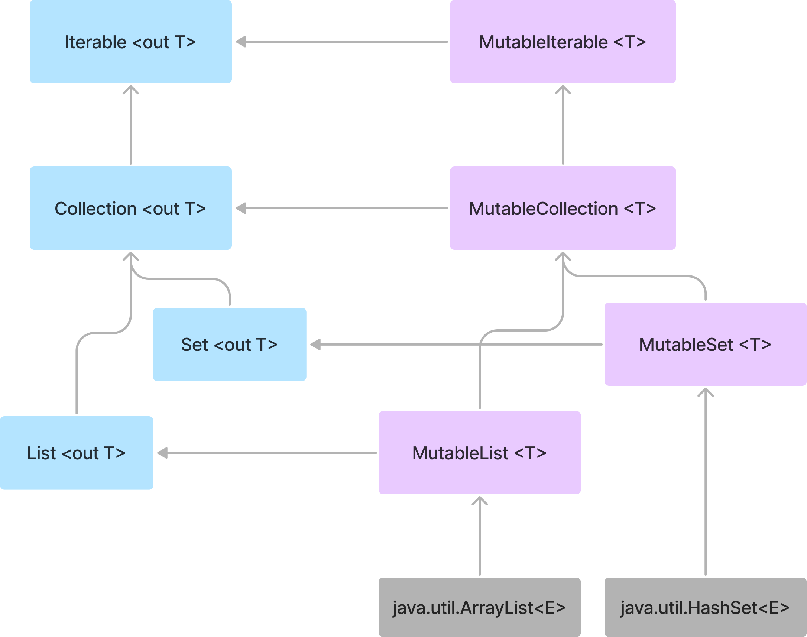

# Item 1 : Limit mutability

Kotlin은 '불변 객체'와 '가변 객체'를 구분하여 상태를 관리할 수 있다.  
이 중 '가변 객체'를 통해 상태를 관리하는 것은 양날의 검과 같다.

시간이 지남에 따라 변하는 상태를 표현하는 것이 간편하여 유용하지만, 아래의 이유로 인해 상태 관리가 어려워 진다.

- 상태의 변화를 추적해야 하므로 코드를 이해하고 디버그하는 것이 어려움.
- 상태가 언제든지 변경될 수 있기에 로직의 추론이 어려움.
- 멀티 스레드 환경에서 동기화 메커니즘이 없는 경우, 상태의 변동성은 잠재적인 충돌을 발생함.
- 변경 가능한 모든 상태를 테스트해야 하기에 테스트가 어려움.
- 상태가 변경 되면 상태를 사용하고 있던 요소들에게 변경 사항을 반드시 알려야 함.

그럼에도, 상태 변경을 통해 실제 시스템의 상태를 나타내는 방법은 유용하기에, **가변성을 최대한 제한하고 변경점을 최소화하는 것이 중요**하다.

Kotlin은 이런 가변성을 쉽게 제한할 수 있도록 설계되었고, 이를 지원하는 다양한 기능과 특성을 제공한다.

[1. Read-only `val`](#read-only-val)  
[2. 'Mutable Collection'과 'Read-only Collection'의 분리](#mutable-collection과-read-only-collection의-분리)  
[3. `data class`의 `copy()`](#copy-in-data-classes)

## Read-only `val`

`val`은 재할당을 허용하지 않지만, 반드시 불변 값을 갖거나 최종적인 값을 의미하진 않는다.  
또한 '가변 객체를 보유'할 수 있고, 다른 프로퍼티를 의존한 뒤 'custom getter'를 통해 정의될 수 있다.

```kotlin
val a = 10
a = 20 // Error

val list = mutableListOf(1, 2, 3)
list.add(4) // OK
```

```kotlin
var name: String = "Java"
var surname: String = "Hello"
val fullName: String
    get() = "$name $surname"

fun main() {
    println(fullName) // Java Hello
    name = "Kotlin"
    println(fullName) // Kotlin Hello
}
```

위와 같이 `val`은 참조의 변경이 불가능한 대신에 'custom getter' or 'delegate'를 통해 참조 객체의 내부 상태를 변경할 수 있다.
여기서 중요한 점은 '참조의 변경이 불가능'하다는 점이다. 즉, **변경점을 제공하지 않는다.**

앞서 말한것처럼, 변경점은 동기화나 프로그램을 추론할 때 문제의 원인이 될 수 있기에 개발자들은 `var` 보다 `val`을 선호한다.

만약, 상태 변경이 필요하지 않다면, 고정된 값을 명확하게 정의하여 final 프로퍼티로 정의하는 것이 좋다 : `val name = "yongsuk"`

## 'Mutable Collection'과 'Read-only Collection'의 분리



Kotlin에서 컬렉션 계층 구조는 위와 같이 설계되어 있기에 'Read-only Collection'을 지원한다.

하늘색 박스들은 'Read-only Collection'으로 수정을 허용하는 메소드를 제공하지 않는다.  
반면, 보라색 박스들은 'Mutable Collection'으로 'Read-only Collection'을 확장하고, 수정을 허용하는 메서드를 제공한다.

이는 Kotlin 프로퍼티가 작동하는 방식과 유사하며, `val`은 'getter'만을 포함하고, `var`은 'getter'와 'setter'를 포함한다.

'Read-only Collection'도 `val`의 'getter' 방식과 동일하게 내부적으로 변경이 가능하지만, 외부에서는 변경이 불가능하다.
예를 들어, `Iterable<T>.map`은 `ArrayList`를 생성하여 작업을 수행하고, 서브 타입인 'Read-only Collection'인 `List`로 반환하여 외부에서 변경이 불가능하도록 한다.

```kotlin
inline fun <T, R> Iterable<T>.map(
    transform: (T) -> R
): List<R> {
    val list = ArrayList<R>()
    for (item in this@map) {
        list.add(transform(item))
    }
    return list
}
```

위와 같이 'Read-only Collection'은 많은 유연성을 제공한다.  
예를 들어, 메모리 사용이 중요한 모바일 앱의 경우 `ArrayList`를 통해 작업을 수행하고, 'Read-only Collection'으로 반환 할 수 있다.
그리고 빠른 Insert/Delete 작업이 필요한 서버 사이드는 `LinkedList`를 통해 작업을 수행하고, 'Read-only Collection'으로 반환 할 수 있다.

주의할 점은 개발자가 의도적으로 'Read-only Collection'을 'Down-casting'하여 컬렉션의 불변성을 우회하려는 시도해서는 안된다.
이는 모든 Kotlin 개발자들의 'contract'로써 지켜져야 한다.

```kotlin
// Don't do this
val list = listOf(1, 2, 3)

if (list is MutableList) {
    list.add(4)
}
```

    위 코드 중 `listOf()`는 JVM 환경에서는 `ArrayList`를 반환하기에, 주의해야 함.
    Java의 `List`는 Kotlin의 `MutableList`와 같이 다를 수 있는것처럼 보이지만, 
    `ArrayList`는 `MutableList`의 모든 연산을 지원하지 않고 '다르기에' 주의애야 함.

만약 'Read-only Collection'을 'Mutable Collection'로 변환하고 싶다면, `toMutableList()`를 사용하여 새로운 객체롭 복사하여 사용하자.

```kotlin
val list = listOf(1, 2, 3)

val mutableList = list.toMutableList()
mutableList.add(4)
```

## Copy in data classes

`String`, `Int`와 같이 내부 상태가 변하지 않는 불변 객체를 선호하는 이유는 다음과 같다.

- 한 번 생성된 후 변경되지 않으므로, 프로그램 추론이 쉬움.
- 불변 객체는 공유되어도 상태가 변하지 않아, 병렬 프로그래밍 시 'Race-condition', 'Deadlock' 등 문제를 방지할 수 있음.
- 상태가 변경되지 않기에, 불변 객체의 참조를 안전하게 캐싱하여 여러 곳에서 재사용이 가능함.
- 복사할 때 원본 객체의 상태가 변하지 않으므로, 'Defensive copy', 'Deep copy' 등 필요하지 않음.
- 상태가 변경되지 않기에, 불변 객체를 기반으로 다른 객체를 구성하기 좋음
- `Set`에 추가하거나 `Map`의 키로 사용할 수 있음.

```kotlin
val names: SortedSet<FullName> = TreeSet()
val person = FullName("AAA", "AAA")
names.add(person)
names.add(FullName("BBB", "BBB"))
names.add(FullName("CCC", "CCC"))

print(names) // [AAA AAA, BBB BBB, CCC CCC]
print(person in names) // true

person.name = "ZZZ"
print(names) // [ZZZ AAA, BBB BBB, CCC CCC]
print(person in names) // false, because person is at incorrect position
```

불변 객체에 데이터 변경이 필요한 경우, 객체 내부의 변경이 아닌 데이터 변경 후의 새로운 객체를 생성하는 메서드를 사용해야 한다.
예를 들어, `Int`에서 `plus`, `minus` 메서드는 연산 후 새로운 `Int`를 반환하는 것처럼 말이다.

```kotlin
class User(
    val name: String,
    val surname: String
) {
    fun withSurname(surname: String): User = User(name, surname)
}

// usage
var user = User("yongsuk", "park")
user = user.withSurname("kim")
print(user) // User(name=yongsuk, surname=kim)
```

그러나 위와 같은 작업은 모든 프로퍼티에 대해 수행하는 경우 번거로운 작업이 될 수 있기에, `data class`의 `copy()`를 사용하는 것이 좋다.
`copy()`는 기존 객체의 상태를 기본값으로, 변경하고자 하는 특정 프로퍼티만 새로운 값으로 지정하여 새로운 객체로 생성할 수 있다.

```kotlin
data class User(
    val name: String,
    val surname: String
)

// usage
var user = User("yongsuk", "park")
user = user.copy(surname = "kim")
print(user) // User(name=yongsuk, surname=kim)
```

## Different kinds of mutation points

변경이 가능한 목록이 필요하면 'Mutable Collection' 또는 `var`을 통해 만들 수 있다.

```kotlin
val list: MutableList<Int> = mutableListOf()
var list2: List<Int> = listOf()

list.add(1)
list2 = list2 + 1
```

만약 목록을 변경할 때 'plus-assign'을 사용하여 변경한다면, 각각 다른 행동으로 동작된다.

```kotlin
list1 += 1 // Translates to list1.plusAssign(1)
list2 += 1 // Translates to list2 = list2.plus(1)
```

'Mutable Collection'은 리스트 구현체에서 변화가 일어나고, 구현이 직관적이 쉽다.

`var`은 해당 프로퍼티 자체를 단일 변경점으로 갖고 있기에 해당 속성에 대한 접근을 제어함으로써 동기화 관리가 수월하다.
또한 `var`은 'custom setter' 또는 'Delegate'를 사용하여 프로퍼티에 대한 변경을 추적할 수 있다.

```kotlin
var names by Delegates.observable(listOf<String>()) { _, old, new ->
    println("Names changed from $old to $new")
}

names += "Yongsuk" // Names changed from [] to [Yongsuk]
names += "Minsu" // Names changed from [Yongsuk] to [Yongsuk, Minsu]
```

그럼에도 위 2가지 방법은 가변 상태를 가지고 있어 멀티 스레드 환경에서 동기화 문제가 있기에 별도로 동기화 메커니즘을 구현해서 사용해야 한다.
또한 상태를 변경하는 모든 방식은 비용이 되기에 일반적인 경우에는 불필요한 상태 변경 가능성을 제거하는 것이 좋다.

---

# Item 2 : Minimize the scope of variables

상태를 정의할 때 변수와 프로퍼티의 범위를 최소화하는 것이 좋으며, 다음 두 가지 방법으로 이를 수행할 수 있다.

- 프로퍼티 대신 로컬 변수 사용
- 가능한 최소 범위의 변수 사용 (e.g : 변수가 loop 내에서만 사용된다면, loop 내에서 정의)

이와 같이 변수와 프로퍼티 범위를 최소화하면 다음과 같은 이점이 있다.

- 해당 변수가 영향을 미치는 코드의 양이 줄어들어, 코드 복잡성을 줄이고 오류 가능성을 낮출 수 있다.
- 다른 개발자와 협업 시, 공통으로 사용되는 프로퍼티의 목적을 추론하기 쉬워진다.

변수를 `val` 또는 `var` 중 어떤 것으로 선언하든, 개발자는 항상 변수가 정의될 때 초기화되는 것을 선호해야 하며,
이는 `if`, `when`, `try-catch`, `?:`와 표현식을 사용하여 지원 된다.

```kotlin
val user: User =
    if (hasValue) {
        getValue()
    } else {
        User()
    }

fun updateWeather(degrees: Int) {
    val (description, color) = when {
        degrees < 5 -> "cold" to Color.BLUE
        degrees < 23 -> "mild" to Color.YELLOW
        else -> "hot" to Color.RED
    }
}
```

## Capturing

'loop' 내에서만 변수를 사용된다면 'loop' 내에서 변수를 정의하는 것이 좋다.  
예를 들어, 'Sequence builder'를 사용하여 에라토스테네스의 체 알고리즘을 구현하여 소수를 찾는 방식은 다음과 같다.

```kotlin
val primes: Sequence<Int> = sequence {
    var numbers = generateSequence(2) { it + 1 }

    while (true) {
        val prime = numbers.first()
        yield(prime)
        numbers = numbers.drop(1).filter { it % prime != 0 }
    }
}

print(primes.take(10).toList()) // [2,3,5,7,11,13,17,19,23,29]
```

그러나, 이를 'loop' 외부 범위에서 변수를 정의하여 사용하면 다음과 같이 올바르지 못한 구현이 될 수 있다.

```kotlin
val primes: Sequence<Int> = sequence {
    var numbers = generateSequence(2) { it + 1 }

    var prime: Int
    while (true) {
        prime = numbers.first()
        yield(prime)
        numbers = numbers.drop(1).filter { it % prime != 0 }
    }
}

print(primes.take(10).toList()) // [2, 3, 5, 6, 7, 8, 9, 10, 11, 12]
```

이는, `prime` 변수가 외부 범위에서 캡처되었기 떄문인데, 'Sequence'에서 연산들은 게으르게 수행된다.  
이는 'Sequence'가 실제로 평가되어야 할 때 연산을 수행함을 의미하는데, 이 때 연산들이 지연되고, 이들이 쌓이게 되면서 `prime` 값이 변경될 때마다
`filter { it % prime != 0 }` 해당 연산에 영향을 주게되어 잘못된 결과를 반환하게 된다.

```kotlin
// numbers = [ 2, 3, 4, 5, 6, 7, 8, 9, 10, 11, ... ]

// Loop #1
prime = numbers.first() // numbers first '2'
yield(prime) // primes add '2'
// `drop(1).filter { ... } ` operations are lazy, so they are not executed yet 

// Loop #2
// 실제 numbers 시퀀스가 평가 되어야 할 때 == first(), toList(), take() 등이 호출될 때
prime = numbers
    .drop(1).filter { it % 2 != 0 } // drop '2' and filter '4', '6', '8', ...
    .first() // numbers first '3'

yield(prime) // primes add '3'
// `drop(1).filter { ... } ` operations are lazy, so they are not executed yet

// Loop #3
// `prime` 변수가 반복문 외부에 캡처되었기 때문에, 이전 prime 값에 영향을 받음
prime = numbers
    .drop(1).filter { it % 3 != 0 } // drop '2' and filter '3', '6', '9', ...
    .drop(1).filter { it % 3 != 0 } // drop '4'
    .first() // numbers first '5'

yield(prime) // primes add '5'
```

이와 같은 이유로 개발자들은 의도되지 않은 캡처링의 위험성을 인지 해야하고, 이를 방지하기 위해 변수의 범위를 최소화하는 것이 좋다.

---

# Item 3 : Eliminate platform types as soon as possible

Kotlin의 'Null-Safety'는 'NPE'을 방지하며 '타입 시스템'을 통해 변수가 'null'이 될 수 있는지 명시적으로 처리한다.   
만약 Java와 같이 'Null-Safety'가 확실하지 않은 언어와 상호작용 시, 'Null-safety'를 보장할 수 없게 된다.

그럼에도 Kotlin은 Java의 `@Nullable`과 `@NotNull` 어노테이션을 통해, Nullability에 대한 정보를 얻을 수 있다.

- `@Nullable` : 'Nullable' 타입으로 간주하고, `String?`으로 해석
- `@NotNull` : 'Non-nullable' 타입으로 간주하고, `String`으로 해석

Java에서는 모든 타입이 'Nullable' 타입이지만, 개발자 입장에서는 객체가 절대 'null'이 될 수 없다는 것을 확신할 수 있는 경우에는
'Non-null assertion `!!`'을 사용하여 해당 타입을 명시적으로 'Non-Nullable' 타입으로 나타낼 수 있다.

그럼에도, Java에서의 제네릭 타입과 `@Nullable` 또는 `@NotNull` 어노테이션이 없는 타입을 다룰 때, Kotlin에서는 기본적으로 'Nullable' 타입으로 간주하기에,
'Non-null assertion'을 수행하고 'null'을 필터링 하는 작업으로 프로그램 안전성을 보장 해야한다.

```kotlin
val users: List<List<User>> = UserRepo().groupedUsers!!.map { it!!.filterNotNull() }
```

하지만, 이와 같은 작업을 수행하는 것은 번거로운 작업이기에, Kotlin에서는 Java 코드와 상호작용 시 발생하는 'Nullability' 문제를 해결하기 위해 'Platform Type'이라는 개념을 도입했다.

## Platform Type

'Platform Type'은 상호작용하는 언어에서 가져온 타입의 'Nullability'가 명확하지 않을 때 사용하는 특별한 타입으로, `String!`과 같이 타입 뒤에 `!`를 붙여 표기한다.
그러나 이 표기법은 코드 내 직접적으로 표기가 불가능하고, 변수나 프로퍼티에 할당될 때 추론되어 사용해야 한다.

**'Platform Type'은 'Nullable'과 'Non-Nullable' 중 의도하는 타입으로 선택할 수 있다.**

```kotlin
val repo = UserRepo()
val user1 = repo.user           // Type of user1 is User!
val user2: User = repo.user     // Type of user2 is User
val user3: User? = repo.user    // Type of user3 is User?
```

그럼에도, 'Non-nullable' 타입으로 가정한 것이 시간이 지나 'Nullable' 타입으로 변경될 수 있는 위험성이 존재하기에,
상호작용하는 Java 코드 일부를 제어할 수 있다면, 가능한 `@Nullable`과 `@NotNull` 어노테이션을 적극적으로 명시하는 것이 좋다.

Kotlin 코드에서 'Platform type'을 다룰 때, 명시적으로 'Nullable', 'Non-Nullable' 타입으로 변환하는 것이 좋다.
이는 안정성을 높이고 예기치 못한 'NPE'를 방지하는데 도움이 되는데, 다음 두 코드의 동작 차이를 보자.

```java
public class JavaClass {
    public String getValue() {
        return null;
    }
}
```

```kotlin
fun statedType() {
    val value: String = JavaClass().value // NPE Error
    print(value.length)
}

fun platformType() {
    val value = JavaClass().value
    print(value.length) // NPE Error
}
```

위 `statedType`과 같이 타입을 명시적으로 작성 했을 때, 'Nullable' 타입을 잘못 받고 있음이 명확해지고,
컴파일러가 경고를 통해 알려주기에 예상치 못한 'NPE'를 방지할 수 있다.

반대로 `platformType`와 같이 명시적으로 타입을 작성하지 않는 경우, 'Platform Type'으로 지정된 변수는 'Nullable' 타입과 'Non-Nullable' 타입이 될 수 있기에 '허용'
된다.
그 후 `value.length`와 같이 'Non-Nullable' 타입으로 사용하려고 하면, 값이 존재하지 않기에 'NPE'가 발생한다.
이와 같이 언제, 어느곳에서 사용할 지 모르기에 런타임 에러로 발생될 확률이 높고 코드가 복잡해지면 그 원인을 찾기 어려울 수 있다.

이와 같은 이유로 'Platform Type'은 'Nullability'가 명확하지 않기에 사용을 지향하고, 사용할 때는 명시적으로 'Nullable' or 'Non-Nullable' 타입으로 변환하는 것이 좋다.

---

# Item 4: Do not expose inferred types

Kotlin의 'inferred type'은 개발자가 타입을 명시하지 않아도, 컴파일러가 적절한 타입을 자동으로 결정해주는 기능이다.

변수에 값을 할당할 때, 컴파일러는 오른쪽 항의 정확한 타입을 변수의 타입으로 추론한다. 
이는 할당된 값이 인터페이스나 상위 클래스의 타입을 구현하더라도, 실제 할당된 객체 타입을 기준으로 타입이 결정됨을 의미한다.

```kotlin
open class Animal
class Zebra : Animal()

fun main() {
    var animal = Zebra()
    animal = Animal() // Error: Type mismatch
}
```

만약 'inferred type'이 제한적이라고 느끼면, 타입을 명시적으로 선언하여 이를 해결 할 수 있다.

```kotlin
var animal: Animal = Zebra() // Specify type explicitly
animal = Animal() // OK
```

그러나, 라이브러리나 다른 모듈에서 타입을 명시적으로 제어할 수 없는 경우에 'inferred type'의 노출은 위험한 일이 될 수 있다.
예를 들어, 다음과 같은 시나리오를 생각해보자.

1. 자동차를 생산하기 위한 공장을 나타내는 인터페이스가 있음.
    - `interface CarFactory { fun produce(): Car }`
2. 대부분의 공장은 아무런 요청이 없는 경우, 기본적인 자동차를 생산함.
   - `val DEFAULT_CAR: Car = Sonata()`
3. 그리고 `DEFAULT_CAR`는 어차피 `Car` 타입임이 확실하기에, 명시적으로 선언되어 있던 타입을 생략함.
   - `interface CarFactory { fun produce(): DEFAULT_CAR }`
4. 시간이 지나. 나중에 어떤 개발자가 다른 코드를 보지 않고, `DEFAULT_CAR`만을 보고 해당 타입을 추론할 수 있다고 결정해버림.
   - `val DEFAULT_CAR = Sonata()`
5. 이 후, 모든 자동차 공장은 `Car`가 아닌, `Sonata`만을 생산하게 되는 문제가 발생함.

이와 같이 `CarFactory` 직접 제어할 수 있다면, 해당 문제를 쉽게 발견하여 수정할 수 있지만,
이들이 라이브러리나 외부 모듈의 일부라면, 해당 문제를 발견하고 수정하는 것은 불가능에 가깝고, 따로 문의하여 시간과 비용이 많이 들게 된다.


---

# Itme 5 : Argument와 State에 대한 기대값을 명시

### 기대값 명시의 중요성

- 문서를 읽지 않는 프로그래머들에게 기대치가 명확히 보인다.
- 기대값에 충족되지 않으면 함수는 예외를 발생시켜 예상치 못한 동작을 방지한다.
- 코드에 대한 일정한 검사가 이루어지므로 단위 테스트의 필요성이 줄어든다.
- 모든 검사는 스마트 캐스팅과 함께 작동하므로 캐스팅을 덜 하게 된다.

### 기대값을 명시하는 방법

| 항목            | 설명                                                             | 예시                                                                                  |
|---------------|----------------------------------------------------------------|-------------------------------------------------------------------------------------|
| Arguments     | - 함수의 인자에 대한 기대값을 명시한다. </br> - 인자가 요구사항을 만족시키지 않으면 예외를 발생시킨다. | ```require(n >= 0) { "Number must be non-negative" }```                             |
| State         | - 함수가 특정 조건에서만 실행될 수 있다는 것을 명시한다.                              | ```check(isInitialized) { "TextToSpeech not initialized" }```                       |
| Assertions    | - 함수가 의도대로 실행되는지 확인한다.                                         | ```assert(ret.size == number)```                                                    |
| Nullability   | - `Elvis` 연산자를 사용하여 더 높은 가독성과 유연성을 제공한다.                       | ```val email = user.email ?: throw IllegalArgumentException("Email required")```    |
| Smart-Casting | - `require`에서 한번 확인한 값은 추후에도 컴파일러에 의해 `true`로 추론된다.            | ```require(person.outfit is Dress)``` </br> ```val dress: Dress = person.outfit ``` |

---

# Item 6 : 사용자 지정 오류보단 표준 오류 권장

- 본문 참고

---

# Item 7 : 무조건 적인 예외가 아닌 Null or Result<Failed>

| 항목                         | 설명                                             |
|----------------------------|------------------------------------------------|
| 예외 사용                      | 일반적인 제어 흐름에서 사용되어서는 아니되며, 오류 상황을 다루는 데 사용해야한다. |
| 예외 사용의 문제점                 | 가독성 저하, 예외의 강제성 부재, 성능 저하, 최적화 억제 등이 발생될 수 있다. |
| `null` 혹은 `Result<Failed>` | 오류가 예상될 때 사용                                   |
| `throw` 사용                 | 오류가 예싱치 못할때 사용                                 |

---

# Item 8 : 안정적인 Null 처리

`null`은 값이 없음을 나타내는 표현입니다. 함수가 `null`을 반환한다는 것은 특정 조건에 일치하는 값이 없음을 의미합니다.

### Null 안전하게 사용

| 방법      | 예시                                     |
|---------|----------------------------------------|
| 안전한 호출  | `printer?.print()`                     |
| 스마트 캐스팅 | `if (printer != null) printer.print()` |

### Throw 에러 던지기

| 방법                  | 예시                                                      |
|---------------------|---------------------------------------------------------|
| not-null 연산자 (`!!`) | `printer!!.print()`                                     |
| `requireNotNull()`  | `requireNotNull(printer).print()`                       |
| `checkNotNull()`    | `checkNotNull(printer).print()`                         |
| 직접 예외 던지기           | `if (printer == null) throw PrinterNotFoundException()` |

### not-null `!!` 연산자 사용과 주의점

`!!` 연산자는 `null`이 아님을 확신하고 사용하는 연산자입니다. 하지만 실제로는 `null`일 가능성이 있으므로 사용에 주의가 필요합니다.

### nullability 정보의 은폐

`null` 가능성에 대한 정보가 감추어지면 중요한 상황에서 `null`을 쉽게 놓칠 수 있습니다.   
이럴 때는 `lateinit` 또는 `Delegates.notNull`을 사용하는 것이 좋습니다.

### 불필요한 nullability 피하기

`null` 값은 중요한 정보를 전달할 수 있지만, 그 값의 핸들링에는 주의가 필요하며, 불필요한 경우에는 피하는 것이 좋습니다.

이를 위해 Kotlin에서는 다음과 같은 방법들을 제공합니다

- 결과를 예상하는 함수의 변형을 제공하여 값의 부재를 처리합니다. 예를 들어, `List<T>`의 `getOrNull()` 등.
- 초기화가 보장되는 경우, `lateinit` 프로퍼티나 `notNull` 대리자를 사용합니다.
- 컬렉션을 반환하는 경우, `null`보다는 `empty` 컬렉션을 반환하는 것이 바람직합니다.

### lateinit과 notnull 대리

클래스 생성 시에는 초기화가 불가능하지만, 첫 사용 전에 반드시 초기화되어야 하는 프로퍼티가 있는 경우 `lateinit`을 사용할 수 있습니다.

이를 활용하면 nullable → not-null로 "언팩"하는 작업이 필요 없으며, 필요에 따라 쉽게 nullable로 전환할 수 있습니다.   
하지만, 프로퍼티가 초기화된 후에는 초기화되지 않은 상태로 되돌릴 수 없습니다.

단, 기본형에 해당하는 타입으로 프로퍼티를 초기화해야 하는 경우에는 `Delegates.notNull`을 사용할 수 있습니다.   
이 경우에는 프로퍼티 대리자로 대체하여 `lazy`하게 초기화하는 것도 가능합니다.

---

# Item 9 : use()를 통한 리소스 관리

어떤 리소스들, 예를 들어 파일 입출력이나 네트워크 연결과 같은 리소스들은 사용 후 반드시 닫혀야 합니다.   
이를 처리하지 않으면 메모리 누수와 같은 문제가 발생할 수 있기에 `Closeable` 인터페이스를 구현하므로 사용이 끝난 후에는 `close()`를 호출해야 합니다.

예전에는 이러한 리소스 관리를 `try-finally` 블록을 사용해 `close()`를 호출하였습니다.   
하지만 이 방식은 `close()` 메소드가 예외를 던질 수 있는 문제와 두 블록에서 모두 예외가 발생하면 한쪽의 예외만 전파되는 문제가 있었습니다.

Kotlin에서는 이러한 문제를 해결하기 위해 `use` 함수를 제공합니다.  
이 함수를 사용하면, 리소스을 올바르게 닫고 예외를 처리하는 작업을 간결하게 할 수 있습니다.

---

# Item 10 : 테스트의 중요성

코드의 안정성을 확보하는 가장 좋은 방법 중 하나는 테스트를 실시하는 것입니다.  
이는 앱이 사용자 관점에서 올바르게 작동하는지 확인하는데 필수적입니다.

### 유닛 테스트

유닛 테스트는 시스템의 특정 부분이 올바르게 작동하는지 확인하고 개발 과정에서 빠른 피드백을 제공하는 테스트 방법입니다.

### 장점

잘 이루어진 유닛 테스트는 신뢰성을 높이고, 리팩토링에 대한 부담감을 줄여줍니다.   
수동으로 로직을 확인하는 것보다 효율적입니다.

### 단점

유닛 테스트 작성에는 시간이 필요하며, 테스트 가능한 코드로 수정이 필요합니다.  
좋은 유닛 테스트 작성에는 여러 조건을 만족해야하기에 작성 난이도가 높습니다.

### 필요성

복잡한 기능, 변경 가능성이 있는 부분, 리팩토링이 필요한 부분, 비즈니스 로직, 외부 라이브러리, 수정된 프로덕션 버그 등에 유닛 테스트가 필요합니다.