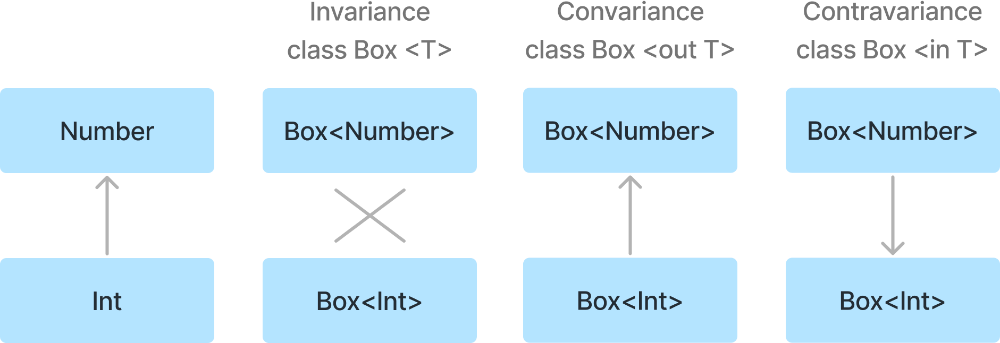
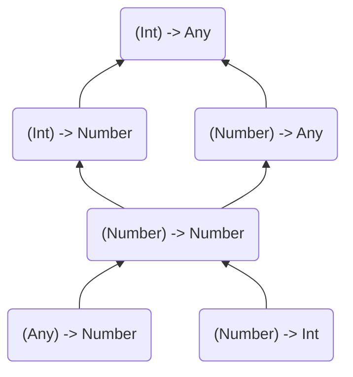

# Item 19 : Do not repeat knowledge

프로그래밍에서 'knowledge'를 표현하면 다음과 같다.

- 의도적으로 생성된 모든 '정보 조각'을 의미하며, 코드 또는 데이터로 표현된다.
- 코드 또는 데이터가 없는 경우에는, 기본 동작을 사용하고 싶다는 의미로 나타낼 수 있다.
    - e.g : 상속을 받고 메서드를 'override' 하지 않을 때, 해당 메서드가 상위 클래스와 동일하게 동작하기를 원하는것으로 나타낼 수 있다.

소프트웨어에서 'knowledge'는 '알고리즘', 'UI 디자인' 등이 될 수 있으며, 다음과 같은 방식으로 표현될 수 있다.

- 코드 : 가장 직접적인 표현 방식, 함수•클래스•변수 등을 통해 구체적인 동작과 로직을 표현
- 구성 : 앱의 동작 환경을 정의하는 방식, 런타임에 프로그램의 행동 조정 가능
- 템플릿 : 문서•UI 레이아웃•코드 구조 등 미리 정의하여 재사용 가능한 형태로 만들 수 있음

결과적으로, 프로그램은 어떤 형태로든 'knowledge'를 보유하고 있으며, 다음 두 가지 'knowledge'를 중요하게 생각한다.

- 로직 : 프로그램의 동작 방식과 UI 디자인에 대한 예상
- 공통 알고리즘 : 기대하는 동작을 달성하기 위해 구현한 알고리즘

## Everything can change

프로그래밍에서 유일한 상수는 '변화'라는 말이 있다.  
5 ~ 10년 전의 서비스들을 살펴보면, 변경되지 않는 앱 또는 웹사이트가 있는지 생각해보면 많이 없을 것이다.  
또한, Android OS도 08년에 처음 출시되어, 'Vanilla'까지 계속 업데이트 되고 있고,
Kotlin도 16년도에 1.0 버전 출시 후 계속 업데이트 되어 2.0 안정화 출시를 앞두고 있다.

이러한 변화는 UI 디자인과 기술에서 더욱 빠르게 발생하며, 이에 맞춰 사용자들의 요구사항도 빈번하게 변경되고 달라진다.  
이는 곧, 기존의 서비스들이 계속해서 사용자 요구사항에 맞춰 업데이트 되어야 함을 의미한다.  
결과적으로, 현대의 S/W 개발은 기술의 발전, 경쟁 상대의 변화, 사용자 피드백 등 여러 요인에 의해 '지속적인 변화'가 필수적임을 알 수 있다.

이러한 변화에 가장 큰 문제점 중 하나는 '반복되는 knowledge'이다.  
예를 들어, 프로젝트 내 전역적으로 사용되는 버튼의 디자인이 변경된다면 모든 위치의 디자인을 바꾸는 것은 번거롭고 실수를 유발할 수 있다.
또한, DB 테이블 이름이 바뀌는 경우, 모든 SQL문에 맞게 수정되지 않으면 큰 문제가 발생할 수 있다.

이러한 문제를 선임 개발자들이 일찍이 인지하고, 이를 해결하기 위해 다양한 도구와 기능을 만들었다.  
전역적으로 사용되는 버튼은 Style Pattern, Custom View, Component 등을 통해 해결할 수 있고,
텍스트 형식의 SQL문 대신 ORM, DAO를 사용하여 해결할 수 있다.

이러한 해결법들은 다양한 종류의 추상화를 나타내며, 프로젝트를 다양한 종류의 중복성으로부터 보호한다.

## When should we allow code repetition?

비슷해 보이는 코드 블록이 있을지라도, 실제로 동일한 기능을 수행하거나 동일한 문제를 해결하는 것은 아니다.  
이처럼 각 코드가 다른 목적으로 사용될 수 있기에, 동일해 보이는 코드를 무작정 하나로 추출하여 재사용하는 것은 안된다.

예를 들어, 같은 프로젝트에 두 개의 독립적인 안드로이드 앱이 있다고 가정해보자.  
두 앱은 비슷한 'Build configuration'을 갖지만, 각 앱은 독립적인 요구사항과 개발 사이클을 지닌다.  
이때, 각 'Build configuration'을 무작정 하나의 'common configuration'으로 만들면 다음과 같은 문제가 발생할 수 있다.

- 한 앱에서 'Configuration'의 변경이 필요한 경우, 다른 앱에 영향을 주기에 관리의 복잡성이 증가한다.
- 새로운 방식의 'common configuration'이 도입되어, 개발자들이 다시 패턴과 규칙을 만들어 지켜야하는 비용이 발생한다.

이처럼, 공통 로직으로 추출하는 것은 각 코드 블록들이 **향후에 어떻게 변경될 가능성이 있는지에 대한 고려**가 필요하다.  

- 동일한 비지니스 로직 또는 요구사항에 영향을 받으면, 함께 변경될 가능성이 높기에 공통 로직으로 추출하는 것이 효율적이다.
- 비슷하지만 서로 다른 목적으로 사용되는 경우, 별도로 변경될 가능성이 높기에 강제로 공통 로직으로 추출하는 것은 향후 유지보수를 어렵게 하고, 프로젝트의 유연성을 떨어뜨릴 수 있다.

## Single responsibility principle

프로젝트에서의 '변화'는 다양한 관점에서 주도할 수 있으며, 이는 '관리자 • 개발자 • 외부 시스템' 등에서 발생 할 수 있다.  
이처럼 클래스나 모듈에 변경을 요구하는 어떠한 외부 요소를 '**액터**'라고 한다.  
만약, 액터가 여럿인 경우에 각각의 요구사항들이 충돌할 수 있기에, 이러한 상황을 피해야 한다.

SRP는 '클래스가 **변경**되어야 하는 이유는 **단 하나의 이유**여야 한다'는 원칙을 가지며, 
위 상황에 접목하면 '2명 이상의 액터가 동일한 클래스를 변경하는 상황이 없어야 한다.'로 간소화 할 수 있다. 

이처럼 SRP는 공통 로직으로 추출하지 말아야하는 상황을 판단하는데 도움을 줄 수 있으며, 아래 예시를 보자.  
대학에서 '장학 부서'와 '인증 부서'가 각각의 목적으로 '학생 정보'를 사용한다고 가정해보면 다음과 같이 사용할 수 있을 것이다.

```kotlin
class Student {
    // 인증 부서 - 학생의 합격 유무
    fun isPassing(): Boolean =
        calculatePointsFromPassedCourses() > 60

    // 장학 부서 - 학생의 장학금 자격 유무
    fun qualifiesForScholarship(): Boolean =
        calculatePointsFromPassedCourses() > 80
  
    // 지난 학기의 점수 계산
    private fun calculatePointsFromPassedCourses(): Int {
        // ...
    }
}
```

그런데, 어느날 장학금 기준이 변경되어, 일부 과목을 제외하기로 결정하였다.  
이에 따라, '장학 부서' 개발자는 '지난 학기의 점수를 계산하는 함수' 수정이 필요한 상황이다.  
그러나, 이러한 수정은 의도치 않게 '인증 부서'에도 영향을 줄 수 있기에, 곤란한 상황이 발생하게 된다.

이처럼, 같은 클래스나 파일 내 위치한 두 기능이 서로 강하게 의존되어 있으면 문제가 되는 상황이 많이 발생할 수 있다.  
이를 위해, 기능이나 역할을 별도의 클래스로 추출하여 독립적으로 변경될 수 있도록 하여 문제를 해결할 수 있다.

위 예시를 통해 알 수 있는 것은, '서로 다른 출처'에서 오는 'knowledge'는 독립적으로 변할 수 있기에 'different knowledge'로 다루어야 한다.
또한, 이러한 'different knowledge'를 분리하지 않으면, 재사용이 가능한 부분과 그렇지 않은 부분으로 구별하는 것이 어려워지고, 재사용되서는 안되는 부분을 재사용하게 되는 실수가 발생될 수 있다.

---

# Item 20 : Do not repeat common algorithms

개발자들은 종종 일반적인 문제를 해결하기 위해, 특정 코드 패턴이나 알고리즘을 구현하려는 경향이 있다.
이런 코드 패턴이나 알고리즘은 비지니스 로직과 별개로, 수학적 연산이나 컬렉션 처리와 같은 일반적인 기능 수행 등 다양한 형태로 나타난다.

이때, 필요한 기능이 이미 '표준 라이브러리'로 제공되고 있다면, 직접 구현하는 것은 불필요한 행동이다.  
그럼에도, 짧지만 반복되는 알고리즘을 함수로 추출하는 접근 방식은 개발 프로세스의 여러 측면에서 이점을 제공한다.

1. 함수 호출 1번으로 훨씬 간결한 코드 작성을 하기에 프로그래밍 속도가 향상된다.
2. 알고리즘이 함수 이름으로 명시되어 있어, 구현을 하나하나 이해하지 않아도 해당 기능을 바로 알 수 있다.
3. 불필요한 정보가 최소화되어, 코드 내 특이점(오류 상황, 비정상 로직 등)을 파악하기 쉬워진다.
4. 한 번의 최적화로 모든 사용처에 성능 향상 이점을 볼 수 있다.

'표준 라이브러리'는 대부분의 일반적인 알고리즘을 '확장 함수'로 제공하고 있으며, 다양한 유틸리티의 거대한 집합으로 정의된다.  
이 때문에 표준 라이브러리 함수들을 학습하는 것은 까다롭지만, 매우 가치 있는 일이다.

## Implementing your own utils

그럼에도, 모든 프로젝트에는 표준 라이브러리가 제공하지 않는 특정 알고리즘이 필요한 순간들이 있다.  
이런 경우에는 널리 알려진 함수들을 활용하여, 보편적인 유틸리티 함수로 정의하는 것이 좋다.

아래는 컬렉션에 있는 숫자의 곱을 계산하는 함수를 정의한 예시이다.

```kotlin
fun Iterable<Int>.product() = fold(1) { acc, i -> acc * i }
```

또한 보편적인 유틸리티 함수를 정의할 때, 이미 잘 알려진 수학적 개념을 미리 구현하는 것도 좋다. 
이런 수학적 개념들은 이름 자체가 이미 명확하기에, 먼 미래에 다른 개발자가 해당 함수를 필요로 할 때, 미리 구현되어 있다면 큰 도움을 받을 것이다.

이 때, **주의할 점은 동일한 결과를 얻는 중복 함수**를 만드는 것이다.  
각 함수들은 반드시 테스트되고, 개발자들이 기억하고 있어야 하며, 유지보수 되어야 하기에 비용으로 간주된다.  
만약, 함수를 무분별하게 추가하게 되면 이 비용이 계속해서 증가함으로, 필요한 함수가 이미 존재하는지 확인하는 것이 중요하다.

개발자들은 'top-level function', 'property delegate', 'class'에 이르기까지, 다양한 방법으로 공통 알고리즘을 추출할 수 있다.
그럼에도 불구하고, 표준 라이브러리와 같이 대부분 함수를 '확장 함수'로 정의하는 이유는 다음과 같다.

1. 함수는 상태를 필요로 하지 않기에, 'Side-effect'가 없는 행동을 표현하는데 적합하다.
2. 함수의 파라미터를 수정하는 것보다, 리시버를 수정하는 것이 더 직관적이다.
3. 객체의 메서드에 비해, 객체에만 '제안'되기에 '힌트' 중에서 찾기 더 쉽다.  
   예를 들어, `TextUtils.isEmpty("Text")` 보다 `"Text".isEmpty()`가 더 찾기 쉽다.
4. '확장 함수'는 명확한 호출 컨텍스트를 제공하기에, 'class / super class의 메서드' 또는 'top-level function'과의 혼동을 줄일 수 있다.

---

# Item 21 : Use property delegation to extract common property pattern

Kotlin은 'property delegation'을 통해 자주 사용되는 프로퍼티 패턴을 쉽게 추출할 수 있다.

자주 사용되는 프로퍼티 패턴 중 하나로, 첫 번째로 접근할 때만 초기화되는 특성을 갖는 'lazy 프로퍼티'가 있다.   
이처럼 'lazy 프로퍼티'는 자주 사용되므로, 표준 라이브러리에서 `lazy` 함수를 통해 제공되고 있다. 

```kotlin
val value by lazy { createValue() }
```

또한 값이 변경될 때마다 특정 동작을 실행하는 'observable 프로퍼티'도 자주 사용되는 프로퍼티 패턴이다.  
이 경우 표준 라이브러리에서 `Delegates.observable` 함수를 통해 제공되고 있다.

```kotlin
var key: String? by Delegates.observable(null) { _, old, new ->
    println("key changed from $old to $new")
}
```

추가로, ViewBinding, Dependency Injection, DataBinding 등과 같은 패턴도 추출할 수 있다.

```kotlin
private val textSize by bindDimension(R.dimen.font_size)
private val vm: MainViewModel by viewModels()
private val token: String by preferences.bind(TOKEN_KEY)
```

위임(delegation)은 프로퍼티의 'getter•setter'를 기반으로 구현되며, 이 접근자들은 다른 객체의 메서드로 위임될 수 있다.
'getter'는 'getValue' 함수로, 'setter'는 'setValue' 함수로 위임되며, 'by' 키워드 뒤에 위치하여 아래와 같이 생성할 수 있다.

```kotlin
var token: String? by LogginProperty(null)
var failedLoginCount: Int by LogginProperty(0)

private class LoggingProperty<T>(var value: T) {
    
    operator fun getValue(thisRef: Any?, property: KProperty<*>): T {
        return value
    }

    operator fun setValue(thisRef: Any?, property: KProperty<*>, value: T) {
        this.value = value
    }
}
```

'property delegation'의 원리를 이해하려면 'by' 키워드가 실제로 컴파일될 때 발생하는 과정을 아는 것이 좋다.  
위 예시에서 'token' 프로퍼티는 아래와 같이 컴파일된다.

```kotlin
@JvmField
private val `token$delegate` = LoggingProperty<Stirng?>(null)

var token: String?
    get() = `token$delegate`.getValue(this, ::token)
    set(value) { 
        `token$delegate`.setValue(this, ::token, value)  
    }
```

이를 통해 알 수 있는것은 'getValue'와 'setValue'가 값을 처리할 때, 참조(::)를 통해 프로퍼티의 이름을 얻는 것을 알 수 있고, 컨텍스트(this)를 통해 함수가 어디서 사용되는지 알 수 있다.

만약 이때, 'setValue'와 'getValue'가 여러 타입의 컨텍스트를 갖는다면, 상황에 따라 적절한 메서드가 선택된다.

```kotlin
class SwipeRefreshBinderDelegate(val id: Int) {
    private var cache: SwipeRefreshLayout? = null
    
    operator fun getValue(
        activity: Activity,     // Activity
        prop: KProperty<*>
    ): SwipeRefreshLayout {
        return cache ?: activity
            .findViewById<SwipeRefreshLayout>(id)
            .also { cache = it }
    }
    
    operator fun getValue(
        fragment: Fragment,     // Fragment
        prop: KProperty<*>
    ): SwipeRefreshLayout {
        return cache ?: fragment.view
            .findViewById<SwipeRefreshLayout>(id)
            .also { cache = it }
    }
}
```

---

# Item 22 : Use generics when implementing common algorithms

함수에 'argument'로 값을 전달하는 것과 같이, 'argument'로 타입을 전달할 수 있다.  
아래 `filter`와 같이 타입 파라미터를 갖는 함수를 제네릭 함수라고 한다.

```kotlin
inline fun <T> Iterable<T>.filter(predicate: (T) -> Boolean): List<T>
```

물론, 컴파일 과정에서 제네릭 타입 정보가 사라지지만, 개발하는 동안 올바른 타입의 요소만 전달하도록 강제할 수 있기에,  
개발자들에게 더 좋은 프로그래밍 경험을 제공해준다.

## Generic constraints

타입 파라미터는 특정 타입이나 그 타입의 하위 타입으로만 제한될 수 있다는 중요한 특징을 가진다.  
이런 제약 조건은 콜론(:)과 함께 상위 타입을 지정하여 설정할 수 있다.

```kotlin
// `T` 타입이 `Comparable<T>` 인터페이스를 구현해야 함. 
// 즉, `T` 타입의 객체들은 서로 비교 가능해야 함을 의미함.
fun <T : Comparable<T>> Iterable<T>.sorted(): List<T> { /*...*/ }

// `C`가 `T` 타입의 요소를 받을 수 있어야 함. 
// `C`는 `MutableCollection<T>`의 하위 타입이어야 함. 
fun <T, C : MutableCollection<in T>> Iterable<T>.toCollection(destination: C): C { /* ... */ }
```

또한, 타입에 제약 조건을 추가하는 것은 해당 타입의 인스턴스가 제공하는 모든 메서드를 활용할 수 있는 이점을 가질 수 있다.

-   `T : Iterable<Int>`인 경우, 인스턴스를 순회하는 과정에서 반환되는 요소들이 `Int` 타입임을 보장할 수 있다.
-   `T : Comparable<T>`인 경우, `T` 타입의 요소들이 서로 비교 가능함을 보장할 수 있다.
-   `T : Any`인 경우, 해당 타입이 'Non-Nullable 타입'의 어떤 타입이라도 될 수 있음을 보장한다.

드물지만, 한 타입에 대해 제약 조건을 여러 개를 지정해야 하는 경우, 'where' 키워드를 사용하여 추가적인 제약을 설정할 수 있다.

```kotlin
fun <T : Animal> pet(animal: T) where T : GoodTempered { /* ... */ } // or
fun <T> pet(animal: T) where T : Animal, T : GoodTempered { /* ... */ }
```

---

# Item 23 : Avoid shadowing type parameters

'Shadowing'으로 인해, 같은 이름의 프로퍼티와 파라미터를 정의할 수 있으며, 이런 상황은 개발자들에게 익숙하고 눈에 잘 띄기에 IDE가 경고를 하지 않는다.

```kotlin
class Forest(val name: String) {
    
    fun addTree(name: String) {
        // ...
    }
}
```

또한, 클래스 타입 파라미터를 함수 타입 파라미터로 섀도잉하는 경우에도 IDE가 경고를 하지 않는다.  
하지만, 반대로 이런 상황은 개발자들에게 눈에 잘 띄지 않아 심각한 문제로 이어질 수 있다.  
보통 이런 실수는 제네릭의 동작 방식을 잘 이해하지 못하는 개발자로 인해 발생한다.  

아래 예시를 보자.

```kotlin
interface Tree
class Birch: Tree
class Spruce: Tree

class Forest<T: Tree> {
    
    fun <T: Tree> addTree(tree: T) { 
        // ...
    }
}

val forest = Forest<Birch>()
forest.addTree(Birch())
forest.addTree(Spruce())
```

위 코드의 문제점은 'Forest'의 인스턴스가 특정 타입의 'Tree' 만을 다루도록 제네릭을 사용하여 'type-safe'를 보장하려 했지만,
'addTree'에서 다른 타입의 'Tree'도 추가할 수 있게 함으로써 이런 의도를 무시하고 있다.

이런 상황은 바람직 하지 않고, 개발자의 의도를 이해하기 어려울 수 있다.  

이에 대한 한 가지 해결책은 'addTree'가 클래스 타입 파라미터 T를 사용하도록 하여, 
'Forest' 인스턴스 생성 시 지정된 타입과 일치해야 하는 것을 보장하게 하는 것이다. 

```kotlin
class Forest<T: Tree> {
    fun addTree(tree: T) { /* ... */ }
}

val forest = Forest<Birch>()
forest.addTree(Birch())         // OK
forest.addTree(Spruce())        // Error: Type mismatch
```

---

# Item 24 : Consider variance for generic types

아래와 같은 제네릭 클래스 'Cup'은 '타입 파라미터 `T`'가 'variance modifier'를 적용하지 않아, 기본적으로 불변성을 가진다.  
즉, 'Cup' 클래스를 사용하여 생성된 타입들 간에서는 서로 '관계'가 없다는 것을 의미한다.  

예를 들어, 다음과 같은 타입들 사이에 '관계'가 없다는 것을 의미한다.

```kotlin
class Cup<T>

val anys: Cup<Any> = Cup<Int>()             // Error: Type mismatch
val nothings: Cup<Nothing> = Cup<Int>()     // Error: Type mismatch
```

만약, 생성된 타입들 간에 '관계'를 가지고 싶다면, 'variance modifier'를 통해 다음과 같이 지정할 수 있다.

'out' 키워드를 통해 타입 파라미터에 공변성을 지정할 수 있다.  
예를 들어, 'Cup'이 공변성을 가지고 있고, 'Puppy'가 'Dog'의 하위 타입이면 `Cup<Puppy>`는 `Cup<Dog>`의 하위 타입이 된다.

```kotlin
class Cup<out T>

open class Dog
class Puppy: Dog()

fun main() {
    val dog: Cup<Dog> = Cup<Puppy>()            // OK
    val puppy: Cup<Puppy> = Cup<Dog>()          // Error: Type mismatch
    
    val anys: Cup<Any> = Cup<Int>()             // OK
    val nothings: Cup<Nothing> = Cup<Int>()     // Error: Type mismatch
}
```

'in' 키워드를 통해 타입 파라미터에 반공변성을 지정할 수 있다.  
예를 들어, 'Cup'이 반공변성을 가지고 있고, 'Puppy'가 'Dog'의 하위 타입이면 `Cup<Puppy>`는 `Cup<Dog>`의 상위 타입이 된다.

```kotlin
class Cup<in T>

open class Dog
class Puppy: Dog()

fun main(args: Array<String>) {
    val dog: Cup<Dog> = Cup<Puppy>()            // Error: Type mismatch
    val puppy: Cup<Puppy> = Cup<Dog>()          // OK
    
    val anys: Cup<Any> = Cup<Int>()             // Error: Type mismatch
    val nothings: Cup<Nothing> = Cup<Int>()     // OK
}
``` 

이러한 불변성, 공변성, 반공변성은 아래와 같은 다이어그램으로 간단하게 나타낼 수 있다.



## Function types

제네릭 클래스와 달리, 함수 타입들 사이에서는 예상되는 타입, 파라미터, 반환 타입 등이 서로 달라도 '관계'를 가질 수 있다.  
즉, 함수의 파라미터 타입이나 반환 타입이 서로 달라도, 함수 타입들이 서로 호환될 수 있다.

```kotlin
fun printProcessNumber(transition: (Int) -> Any) {
    print(transition(42))
}

val intToDouble: (Int) -> Number = { it.toDouble() }
printProcessNumber(intToDouble)

val numberAsText: (Number) -> Any = { it.toShort() }
printProcessNumber(numberAsText)

val identity: (Number) -> Number = { it }
printProcessNumber(identity)

val numberToInt: (Number) -> Int = { it.toInt() }
printProcessNumber(numberToInt)

val numberHash: (Any) -> Number = { it.hashCode() }
printProcessNumber(numberHash)
```

이처럼 서로 호환될 수 있는 이유는 함수의 모든 타입들 사이에는 다음과 같은 '관계'가 존재하기 때문이다.



위 계층 구조를 따라 아래로 내려갈 때, 타입 시스템 내에서 다음과 같이 이동됨을 알 수 있다.

- 파라미터 타입은 더 상위 타입으로 이동
- 반환 타입은 더 하위 타입으로 이동

이를 통해 알 수 있는 점은, 함수 타입에서 파라미터 타입들은 반공변성을 가지고, 반환 타입들은 공변성을 가지는 점을 알 수 있다.

> ( T<sub>1in</sub> , T<sub>2in</sub> ) → T<sub>out</sub>

## The safety of variance modifiers

Java에서 배열은 타입에 관계없이 모든 배열에 정렬과 같은 일반적인 연산을 수행할 수 있도록 하기 위해 '공변성'을 가지고 있도록 설계되었다.
그러나, 이런 설계는 다음과 같은 문제점을 가지고 있다.

```java
Integer[] numbers = new Integer[] { 1, 2, 3 };
Object[] objects = numbers;

void test() {
    objects[2] = "Hello";   // Runtime Error: ArrayStoreException
}
```

'numbers'를 'Object[]'로 캐스팅하지만, 내부적으로 사용되는 타입은 변경되지 않고 'Integer'로 유지된다.  
이러한 상태에서 'objects'에 'String' 타입의 값을 할당하려고 시도하면 타입이 다르기에 오류가 발생하게 된다.

이처럼 컴파일할 때에는 오류가 발생되지 않지만, 런타임에 오류가 발생하게 되며, 이런 상황은 Java의 문제점을 명확하게 보여준다.

---

Kotlin에서는 이러한 문제를 일찍이 인지하고, 프로그램을 보호하기 위해서 배열을 불변성으로 설정하였다.   
즉, `Array<Int>`를 `Array<Any>`로 업캐스팅 하는 것을 허용하지 않는다.

그러나, Kotlin에서 함수의 파라미터로 특정 타입이 요구될 때, 해당 타입의 하위 타입도 전달될 수 있다는 점을 알고 있어야 한다.
즉, 'argument'를 전달할 때 암시적인 업캐스팅이 가능함을 알고 있어야 한다.

```kotlin
open class Dog
class Puppy: Dog()
class Hound: Dog()

fun takeDog(dog: Dog) { 
    // ...
}

takeDog(Dog())
takeDog(Puppy())
takeDog(Hound())
```

이러한 암시적인 업캐스팅은 '공변성'을 적용할 때 문제가 될 수 있다.  

만약, '공변 타입 파라미터 `T`'가 'public in-position(함수의 파라미터 타입)'으로 적용되면, 공변성과 업캐스팅이 결합되어 어떤 하위 타입이든 전달할 수 있게 된다.
이렇게 될 경우, 예상치 못한 타입이 전달될 수 있기에 프로그램의 안정성을 해칠 수 있다.

```kotlin
class Box<out T> {
    private var value: T? = null
    
    fun set(value: T) {     // Illegal in Kotlin
        this.value = value
    }

    fun get(): T = 
        value ?: error("Value not set")
}

val puppyBox = Box<Puppy>()
val dogBox: Box<Dog> = puppyBox
dogBox.set(Hound())         // But I have a place for a Puppy

val dogHouse = Box<Dog>()
val box: Box<Any> = dogHouse
box.set("Some string")      // But I have a place for a Dog
box.set(42)                 // But I have a place for a Dog
```

그렇기에, Kotlin에서는 이런 문제를 방지하기 위해 '공변 타입 파라미터'를 'public in-position'에서 사용하는 것을 허용하지 않는다. 
이에 따라, 'visibility'를 'private'으로 제한하여 객체 외부에서의 공변성을 이용한 업캐스팅을 제한하고, 객체 내부에서 필요한 작업을 수행하도록 한다.

```kotlin
class Box<out T> {
    private var value: T? = null
    
    private fun set(value: T) {
        this.value = value
    }
    
    fun get(): T = value ?: error("Value not set")
}
```

반대로, 'public out-position'은 안전하다고 판단하여 따로 제약을 두지 않는다.  
이러한 이유로, 데이터 생성자나 불변 데이터를 갖는 경우, '공변성'을 적용하는 것이 좋다.

예를 들어, 함수가 파라미터 타입 `List<Any?>`를 요구할 때, `List<out E>`를 사용하면 
`E`는 어떤 타입이든 간에 `Any` 타입의 하위 타입이므로, 변환 없이 제공할 수 있다.

```kotlin
fun printList(list: List<Any?>) {
    list.joinToString().let(::println)
}

val intList: List<Int> = listOf(1, 2, 3)
val stringList: List<String> = listOf("A", "B", "C")

printList(intList)      // OK
printList(stringList)   // OK
```

반면, `MutableList<E>`는 불변성을 가지기에 정확한 타입을 요구하며, 이런 불변성으로 불안전한 상황을 방지한다.

```kotlin
fun append(list: MutableList<Any>) {
    list.add(42)
}

val strs = mutableListOf<String>("A", "B", "C")
append(strs) // Illegal in kotlin
```

---

위 공변성과 'public in-position'의 문제와 유사하게, 반공변성과 'public out-position'의 문제도 존재한다.

'out-position'은 아래와 같은 암시적인 업캐스팅을 허용한다.

```kotlin
open class Car
interface Boat
class Amphibious: Car(), Boat

fun getAmphibious(): Amphibious = Amphibious()      // out-position

val car: Car = getAmphibious()                      // Upcasting
val boat: Boat = getAmphibious()                    // Upcasting
```

하지만, 이런 암시적인 업캐스팅은 반공변성에서 문제가 될 수 있다.

'out-position'에 반공변성 타입 파라미터를 적용하게 되면, 다른 타입의 객체를 반환할 수 있는 문제가 발생할 수 있다.  
아래 예시를 보면, 'Box'에서 생성된 타입과 완전히 다른 타입이 반환될 수 있는 문제가 발생한다.

```kotlin
class Box<in T> {
    val value: T   // Illegal in Kotlin
}

val garage: Box<Car> = Box(Car())
val amphibiousSpot: Box<Amphibious> = garage
val boat: Boat = garage.value       // But I only have a Car

val noSpot: Box<Nothing> = Box<Car>(Car())
val boat: Nothing = noSpot.value    // I cannot product Nothing
```

Kotlin에서는 이러한 상황을 방지하기 위해 'public out-position'에서 반공변성 타입 파라미터의 사용을 허용하지 않는다.
이에 따라 'visibility'를 'private'으로 제한하여 객체 외부에서의 반공변성을 이용한 다운캐스팅을 제한하고, 객체 내부에서 필요한 작업을 수행하도록 한다.

```kotlin
class Box<in T> {
    private var value: T? = null
    
    fun set(value: T) {
        this.value = value
    }
    
    private fun get(): T = value ?: error("Value not set")
}
```

이처럼 반공변성 타입 파라미터는 오로지 사용되거나 수용될 때 사용되며, 예시로는 'Coroutine'의 'Continuation'이 있다.

```kotlin
public interface Continuation<in T> {
    public val context: CoroutineContext
    public fun resumeWith(result: Result<T>)
}
```

## Variance modifier positions

'variance modifier'는 두 가지 위치에서 사용될 수 있다.

앞서 적용한 것과 같이 클래스나 인터페이스를 선언할 때 적용하는 'declaration-side'에서의 사용이다.

```kotlin
class Box<out T>(val value: T)      // Declaration-side variance modifier 
val boxStr: Box<String> = Box("Hello World")
val boxAny: Box<Any> = boxStr
```

또 다른 하나는 특정 변수에 대한 'variance modifier'를 적용하는 'use-site'에서의 사용이다.

```kotlin
class Box<T>(val value: T) 
val boxStr: Box<String> = Box("Hello World")
val boxAny: Box<out Any> = boxStr   // use-side variance modifier
```

이러한 'use-site variance'는 모든 인스턴스에 'variance modifier'를 제공할 수 없는 상황에서 하나의 타입만 제공하고 싶을 때 유용하다.

예를 들어, `MutableList<E>`에 반공변성을 적용하게 되면, 해당 컬렉션이 원소를 반환하는 것이 불가능해지기에 사용할 수 없다.
하지만, 단일 파라미터 타입을 반공변성 타입으로 만들어, 어떤 타입도 받아들일 수 있는 컬렉션으로 만들 수 있다.

```kotlin
interface Dog
interface Cutie

data class Puppy(val name: String) : Dog, Cutie
data class Hound(val name: String) : Dog
data class Cat(val name: String) : Cutie

fun fillWithPuppies(list: MutalbleList<in Puppy>) {
    list.add(Puppy("Bobby"))
    list.add(Puppy("Rex"))
}

val dogs = mutableListOf<Dog>(Hound("Max"))
fillWithPuppies(dogs)
println(dogs)       // [Hound(name=Max), Puppy(name=Bobby), Puppy(name=Rex)]

val animals = mutableListOf<Cutie>(Cat("Smokey"))
fillWithPuppies(animals)
println(animals)    // [Cat(name=Smokey), Puppy(name=Bobby), Puppy(name=Rex)]
```

---

'variance modifier'를 사용할 때, 특정 위치에서의 사용이 제한될 수 있음을 알아야 한다.  
`MutableList<out E>`의 경우 `set`은 `T`의 모든 하위 타입, 즉 `Nothing`을 포함한 모든 타입이 전달될 수 있기에 사용할 수 없다.
또한, `MutableList<in T>`의 경우 `get`은 `T`의 모든 상위 타입, 즉 `Any?`를 포함한 모든 타입이 반환될 수 있기에 사용할 수 없다.

결과적으로, 제네릭 객체에서 오직 읽기만 하는 경우에는 공변성(out)을, 쓰기만 하는 경우에는 반공변성(in)을 사용하는 것이 좋다.

---

# Item 25 : Reuse between different platforms by extracting common modules

기업들은 대부분 하나의 플랫폼만을 위한 애플리케이션을 개발하지 않고, 여러 플랫폼을 대상으로 애플리케이션을 개발한다.
여기서 여러 플랫폼을 대상으로 하는 서비스들의 비즈니스 로직은 대부분 일치하며, 이런 프로젝트들은 코드를 공유함으로써 큰 이점을 얻을 수 있다.

## Full-stack

웹 개발을 기반으로 서비스를 제공하는 기업이 많으며, 주요 제품은 웹 사이트가 될 것이다.
하지만, 대부분 서비스는 백엔드가 필요하며, 프론트 개발은 주로 JS가, 백엔드 개발은 주로 Java가 사용되고 있다.
그러나, Kotlin이 Java의 대안으로 떠오르고 있고, 대부분의 프레임워크에서 Java의 대체자로 채택되고 이다.
또한 Kotlin은 JS로도 컴파일 될 수 있어, Kotlin/JS 라이브러리를 통해 다양한 웹 개발이 가능하다.

이는 백엔드와 프론트 개발이 모두 Kotlin을 통해 개발할 수 있음을 알 수 있고,
JVM ByteCode와 JS로 컴파일 가능한 공유 코드를 통해 API 엔드포인트 정의와 같은 공통 요소를 재사용할 수 있다.

## Mobile

Kotlin의 멀티플랫폼 기능은 모바일 환경에서 특히 중요하다.

대부분의 기업이 Android와 iOS 두 플랫폼을 모두 서비스하는 것이 일반적이고, 두 플랫폼의 내부 로직은 거의 같은 경우가 많다.
이를 Kotlin 멀티 플랫폼을 통해 공통 모듈을 만들고, 비즈니스 로직을 한 번만 구현하여 두 플랫폼에서 사용하도록 할 수 있다.
Android는 Gradle을 통해 바로 사용하고, iOS는 Kotlin/Native를 이용해 공통 코드를 컴파일하고, 이를 네이티브 코드로 변환하여 사용합니다.