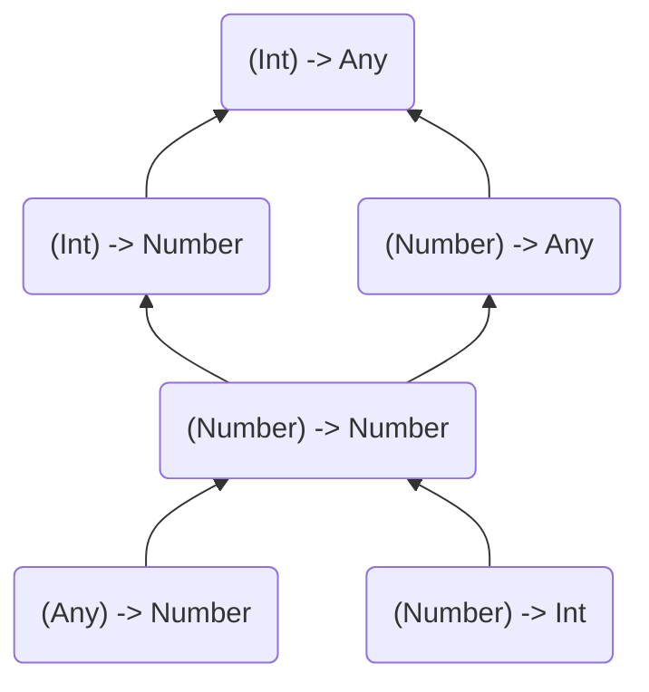

아래와 같은 제네릭 클래스가 있다고 가정해보자.

```kotlin
class Cup<T>
```

위 선언의 타입 파라미터 T에는 'variance' 수정자인 'out' 또는 'in'가 적용되지 않아, 기본적으로 불변성을 가진다.  
즉, 이 제네릭 클래스를 사용하여 생성된 타입끼리는 서로 관계가 없다는 것을 뜻한다.

예를 들어, `Cup<Int>`,`Cup<Number>`, `Cup<Any>`, `Cup<Nothing>` 과 같은 타입들 사이에는 어떠한 연관성도 존재하지 않는다.

```kotlin
fun main() {
    val anys: Cup<Any> = Cup<Int>()             // Error Type mismatch
    val nothings: Cup<Nothing> = Cup<Int>()     // Error Type mismatch
}
```

만약, 생성된 타입끼리의 연관성이 필요한 경우에 'variance' 수정자('out' 또는 'in')를 사용해야 한다.  

'out'은 타입 파라미터를 '공변적'으로 동작하게 한다.  
즉, 'A' 가 'B'의 하위 타입이고, 'Cup'이 공변성을 갖는 경우, `Cup<A>`는 `Cup<B>`의 하위 타입이 됨을 의미한다.

```kotlin
class Cup<out T>
open class Dog
class Puppy: Dog()                          // sub type of Dog

fun main(args: Array<String>) {
    val b: Cup<Dog> = Cup<Puppy>()          // OK
    val a: Cup<Puppy> = Cup<Dog>()          // Error Type mismatch
    
    val anys: Cup<Any> = Cup<Int>()         // OK
    val nothings: Cup<Nothing> = Cup<Int>() // Error Type mismatch
}
```

'in'은 타입 파라미터를 '반공변적'으로 동작하게 한다.  
즉, 'A' 가 'B'의 하위 타입이고, 'Cup'이 반공변성을 갖는 경우, `Cup<A>`는 `Cup<B>`의 상위 타입이 됨을 의미한다.

```kotlin
class Cup<in T>
open class Dog
class Puppy: Dog()                          // sub type of Dog

fun main(args: Array<String>) {
    val b: Cup<Dog> = Cup<Puppy>()          // Error Type mismatch
    val a: Cup<Puppy> = Cup<Dog>()          // OK
    
    val anys: Cup<Any> = Cup<Int>()         // Error Type mismatch
    val nothings: Cup<Nothing> = Cup<Int>() // OK
}
```

'variance' 수정자는 아래 다이어그램과 같이 동작한다.


## Function types

함수 타입들 사이의 '특별한 관계'는 예상되는 타입, 파라미터, 반환 타입이 서로 달라도 존재할 수 있다.  
즉, 함수의 파라미터 타입이나 반환 타입이 서로 다를 때에도 특정 조건 하에서 이런 함수 타입들이 서로 호환될 수 있다. 

이를 실제로 확인하려면, `(Int) -> Any` 함수를 'argument'로 받는 함수를 살펴보자.

```kotlin
fun printProcessedNumber(transition: (Int) -> Any) { 
    print(transition(42))
}
```

위 함수는 `(Int) -> Any`의 함수 타입을 받을 수 있지만, 이와 더불어 다음과 같은 함수 타입들도 함께 사용할 수 있다.

- `(Int) -> Number`
- `(Number) -> Any`
- `(Number) -> Number`
- `(Any) -> Number`
- `(Number) -> Int`

```kotlin
val intToDouble: (Int) -> Number = { it.toDouble() }
val numberAsText: (Number) -> Any = { it.toShort() }
val identity: (Number) -> Number = { it }
val numberToInt: (Number) -> Int = { it.toInt() }
val numberHash: (Any) -> Number = { it.hashCode() }

printProcessedNumber(intToDouble)
printProcessedNumber(numberAsText)
printProcessedNumber(identity)
printProcessedNumber(numberToInt)
printProcessedNumber(numberHash)
```

이런 호환이 가능한 이유는 모든 타입들 사이에 다음과 같은 '관계'가 존재하기 때문이다.



위 계층 구조를 따라 아래로 내려갈 때, 파라미터 타입은 타입 시스템 내에서 더 상위 타입으로 이동하고, 반환 타입은 더 하위 타입으로 이동함을 알 수 있다.

이처럼, Kotlin에서 함수 타입의 모든 파라미터 타입들은 'in'이라는 'variance' 수정자를 통해 '반공변성'을 가지고,  
반대로 반환 타입은 'out'이라는 'variance' 수정자를 통해 '공변성'을 가진다.

> ( T<sub>1in</sub> , T<sub>2in</sub> ) → T<sub>out</sub>

이런 사실은 함수 타입을 사용할 때 도움이 된다.  
'variance' 수정자가 적용된 다른 타입들도 있으며, 그 중 하나는 'out' 수정자를 사용하는 'List'가 있다.   
반면, 'MutableList'는 'variance' 수정자가 없는데, 이처럼 'variance' 수정자의 안전성을 이해하기 위해서, 왜 이런 차이가 필요한지 이해해야 한다.

---

## The safety of variance modifiers

java에서 배열은 타입에 관계 없이 모든 배열에서 정렬과 같은 일반 연산을 수행할 수 있도록, 공변적으로 설계되었다.  
그러나, 이런 결정에는 큰 문제가 있으며, 이를 이해하기 위해 컴파일 시에는 오류가 없지만, 런타임 오류를 발생시키는 다음 작업을 살펴보자.

```java
// Java
Integer[] numbers = {1, 4, 2, 1};
Object[] objects = numbers;
objects[2] = "B"; // RunTime Error: ArrayStoreException
```

보다시피, 'number'를 'Object[]'로 캐스팅해도 내부적으로 사용되는 타입이 실제로 변경되지 않고 'Integer'인 상태로 남아 있다.  
이 때문에, 해당 배열에 'String' 타입의 값을 할당하려고 할 때 런타임 오류가 발생하게 된다. 이는 java의 명백한 오류를 보여준다.    
Kotlin에서는 'Array'는 물론 'IntArray', 'CharArray' 등도 불변성으로 설정하여, 이러한 문제로부터 보호한다.  
따라서 `Array<Int>`를 `Array<Any>`로 업캐스팅 하는 것은 Kotlin에서 불가능하다.

여기서 잘못된 점을 파악하려면, 우선 파라미터로 특정 타입이 요구될 때, 해당 타입의 하위 타입도 전달될 수 있다는 점을 이해해야 한다.  
'argument'를 전달할 때 자동으로 상위 타입으로의 변환, 즉 아래와 같이 암시적인 업캐스팅이 가능함을 의미한다.

```kotlin
open class Dog
class Puppy: Dog()
class Hound: Dog()

fun takeDog(dog: Dog) { /* ... */ }

takeDog(Dog())
takeDog(Puppy())
takeDog(Hound())
```

여기서 위 예제는 공변성과 어울리지 않는다.  
만약, '공변 타입 파라미터'가 'in-position'(예를 들어, 파라미터의 타입)에 적용되면, 공변성과 업캐스팅이 결합되어 원하는 어떤 타입이든 전달할 수 있게 된다.

이는, 예상치 못한 타입을 파라미터로 전달할 수 있게 되어 불안정한 상황을 초래하게 된다.   
예를 들어, 'Dog' 타입으로 선언된 인스턴스에 'String'을 전달하려는것과 같이 말이다.

```kotlin
class Box<out T> {
    private var value: T? = null
    
    fun set(value: T) {     // Illegal in Kotlin
        this.value = value
    }

    fun get(): T = value ?: error("Value not set")
}

val puppyBox = Box<Puppy>()
val dogBox: Box<Dog> = puppyBox
dogBox.set(Hound())         // But I have a place for a Puppy

val dogHouse = Box<Dog>()
val box: Box<Any> = dogHouse
box.set("Some string")      // But I have a place for a Dog
box.set(42)                 // But I have a place for a Dog
```

캐스팅을 한 후에도 실제 객체는 그대로 있지만, 타입 시스템에 의해 다르게 취급되기 때문에 안전하지 않다.  
만약, 실제로 'Dog' 타입의 값만 허용되는 공간에 'Int' 값을 넣는 것이 가능했다면, 반드시 오류가 발생할 것이다.  
그래서 Kotlin은 이런 문제를 방지하기 위해 '공변 타입 파라미터'를 함수의 파라미터로 사용하는 것을 금지하고 있다.

```kotlin
class Box<out T> {
    var value: T? = null    // Error
    
    fun set(value: T) {     // Error 
        this.value = value   
    }
    
    fun get(): T = value ?: error("Value not set")
}
```

객체 내부에서는 공변성을 이용한 업캐스팅을 할 수 없으므로, 가시성을 'private'로 제한하는 것은 문제가 되지 않는다.

```kotlin
class Box<out T> {
    private var value: T? = null
    
    private fun set(value: T) {
        this.value = value
    }
    
    fun get(): T = value ?: error("Value not set")
}
```

공변성은 'public out-position'에 대해 안전하기에 제약이 없다.   
이러한 이유로, 생산자나 불변 데이터를 가지는 경우, 즉 데이터를 생성하거나 외부에 노출되는 타입들에 대해서 공변성을 적용한다.

한 가지 좋은 예시로 Kotlin에서 `T`가 공변인 `List<T>`를 들 수 있다.  
덕분에 함수가 `List<Any?>`를 요구할 때, 어떤 종류의 리스트든 변환 없이 제공할 수 있다.  
반면에, `MutableList<T>`에서 T는 불변이기에, 정확한 타입을 요구한다. 이렇게 함으로써 안전하지 않은 상황을 방지한다.

```kotlin
fun append(list: MutableList<Any>) {
    list.add(42)
}

val strs = mutableListOf<String>("A", "B", "C")
append(strs) // Illegal in kotlin

val str: String = strs[3]
print(str)
```

또 다른 좋은 예시로 'Response'와 'variance' 수정자를 같이 사용하여 아래와 같은 많은 이점을 얻을 수 있다.

- `Response<T>`가 필요할 때, `T`의 모든 하위 타입에 해당하는 '응답'을 받아들일 수 있다.  
  - `Response<Any>`를 기대하는 상황에서, `Response<Int>`나 `Response<String>`을 받아들일 수 있다.
- `Response<T1, T2>`가 필요할 때, `T1`과 `T2`의 모든 하위 타입에 해당하는 '응답'을 받아들일 수 있다.  
- `Failure<T>`가 필요할 때, `T`의 모든 하위 타입에 해당하는 '실패'를 받아들일 수 있다.  
  - `Failure<Number>`를 기대하는 상황에서, `Failure<Int>`나 `Failure<Double>`을 받아들일 수 있다.
  - `Failure<Any>`를 기대하는 상황에서, `Failure<Int>`나 `Failure<String>`을 받아들일 수 있다.
- `Success`는 잠재적인 오류 타입을 명시할 필요가 없으며, `Failure는`는 잠재적인 성공 값의 타입을 명시할 필요가 없다.  
  이는 공변성과 `Nothing` 타입을 사용함으로써 가능해진다.

```kotlin
sealed class Response<out R, out E>
data class Success<out R>(val value: R) : Response<R, Nothing>()
data class Failure<out E>(val error: E) : Response<Nothing, E>()
```

공변성과 'public in-position'에서의 문제와 유사하게, 반공변 타입 파라미터를 'public out-position'(함수의 반환 타입이나 프로퍼티 타입)으로 사용하려 할 때 비슷한 문제가 발생한다.
'out-position'은 암시적인 업캐스팅을 허용하기도 한다.

```kotlin
open class Car
interface Boat
class Amphibious: Car(), Boat

fun getAmphibious(): Amphibious = Amphibious()

val car: Car = getAmphibious()
val boat: Boat = getAmphibious()
```

'out-position'에서 암시적인 업캐스팅의 허용은 반공변성과 어울리지 않다.

'out-position'에서 타입 파라미터를 사용하면 해당 타입의 객체를 반환해야 하는데, 반공변성이 적용된 타입 파라미터는 반환 타입으로 사용될 수 없어 문제가 될 수 있다. 
아래 예시를 보면, 반공변 타입을 사용하여 한 타입의 'Box'로 시작하여, 필요로 하는 것과 완전히 다른 타입의 'Box'로 이동할 수 있게 된다.

```kotlin
class Box<in T> {
    val value: T    // Illegal in Kotlin
}

val garage: Box<Car> = Box(Car())
val amphibiousSpot: Box<Amphibious> = garage
val boat: Boat = garage.value       // But I only have a Car

val noSpot: Box<Nothing> = Box<Car>(Car())
val boat: Nothing = noSpot.value    // I cannot product Nothing
```

이런 상황을 방지하기 위해 Kotlin은 'public out-position'에서 반공변성 타입 파라미터를 사용하는 것을 금지한다.

```kotlin
class Box<in T> {
    var value: T? = null    // Error
    
    fun set(value: T) { 
        this.value = value   
    }
    
    fun get(): T = value    // Error
        ?: error("Value not set")
}
```

또한, 이런 요소들을 'private'로 제한하여 사용할 수 있다.

```kotlin
class Box<in T> {
    private var value: T? = null
    
    fun set(value: T) {
        this.value = value
    }
    
    private fun get(): T = value ?: error("Value not set")
}
```

아래와 같이 타입 파라미터가 오로지 소비되거나 수용될 때, 반공변성을 사용한다.  
잘 알려진 예시로는 'Coroutine'의 'Continuation' 인터페이스가 있다.

```kotlin
public interface Continuation<in T> {
    public val context: CoroutineContext
    public fun resumeWith(result: Result<T>)
}
```

## Variance modifier positions

'variance' 수정자는 두 가지 위치에서 활용될 수 있다.   
첫 번째 방법은 '선언 측(declaration-side)'에서의 사용이다.

이는 클래스나 인터페이스를 선언할 때 적용하며, 해당 클래스나 인터페이스가 사용되는 모든 곳에 영향을 준다. 

```kotlin
class Box<out T>(val value: T)  // Declaration-side variance modifier 
val boxStr: Box<String> = Box("Hello World")
val boxAny: Box<Any> = boxStr
```

다른 하나는 '사용 위치(use-site)'에 적용되며, 이는 특정 변수에 대한 'variance' 수정자이다.

```kotlin
class Box<T>(val value: T) 
val boxStr: Box<String> = Box("Hello World")
val boxAny: Box<out Any> = boxStr   // use-side variance modifier
```

'use-site variance'는 모든 인스턴스에 대해 'variance' 수정자를 제공할 수 없을 때, 특정 변수에 대해서만 필요로 한 경우 사용된다.  

예를 들어, 'MutableList'에는 'in' 수정자를 사용할 수 없다. 이는 'in' 수정자를 사용하게 되면 해당 컬렉션이 원소를 반환하는 것이 불가능해지기 때문이다.  
그러나, 단일 파라미터 타입에 대해서는 해당 타입을 반공변('in')으로 만들어, 어떤 타입도 받아들일 수 있는 컬렉션을 허용할 수 있다.

```kotlin
interface Dog
interface Cutie

data class Puppy(val name: String) : Dog, Cutie
data class Hound(val name: String) : Dog
data class Cat(val name: String) : Cutie

fun fillWithPuppies(list: MutalbleList<in Puppy>) {
    list.add(Puppy("Bobby"))
    list.add(Puppy("Rex"))
}

val dogs = mutableListOf<Dog>(Hound("Max"))
fillWithPuppies(dogs)
println(dogs)       // [Hound(name=Max), Puppy(name=Bobby), Puppy(name=Rex)]

val animals = mutableListOf<Cutie>(Cat("Smokey"))
fillWithPuppies(animals)
println(animals)    // [Cat(name=Smokey), Puppy(name=Bobby), Puppy(name=Rex)]
```

'variance' 수정자를 사용할 때, 특정 위치에서의 사용이 제한될 수 있음을 알아야 한다.  

`MutableList<out T>`의 경우, `get`을 사용해 원소를 얻을 수 있고, 이때 얻은 원소는 `T` 타입이다.  
그러나, `set`은 `T`의 모든 하위 타입, 즉 `Nothing`을 포함한 모든 타입이 전달될 수 있기 때문에 `set`을 사용할 수 없다.

`MutableList<in T>`를 사용하면 `get`과 `set`을 모두 사용 가능하지만, `get`을 사용했을 때는 반환 타입이 `Any?`가 된다.  
이는 `T`의 모든 상위 타입, 즉 `Any?`를 포함한 모든 타입이 반환될 수 있기 때문이다.

그래서 **제네릭 객체에서 오직 읽기만 할 때는 'out'을, 쓰기만 할 때는 'in'을 사용하는 것이 적합**하다.
