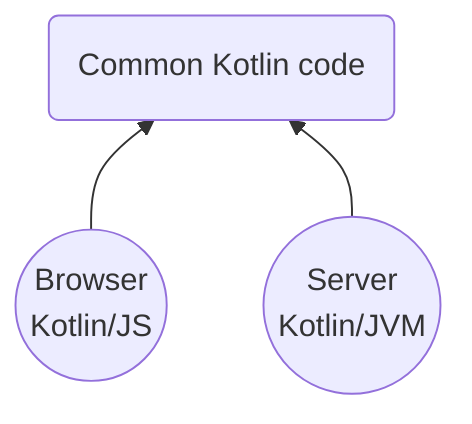
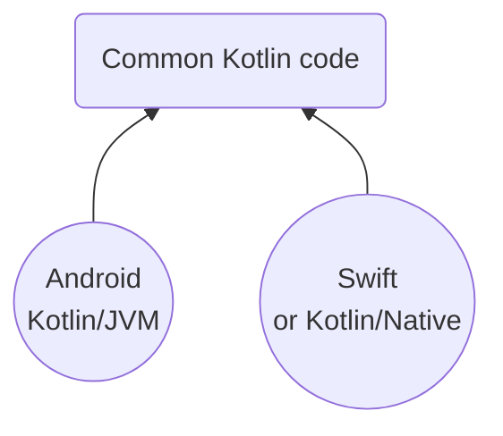
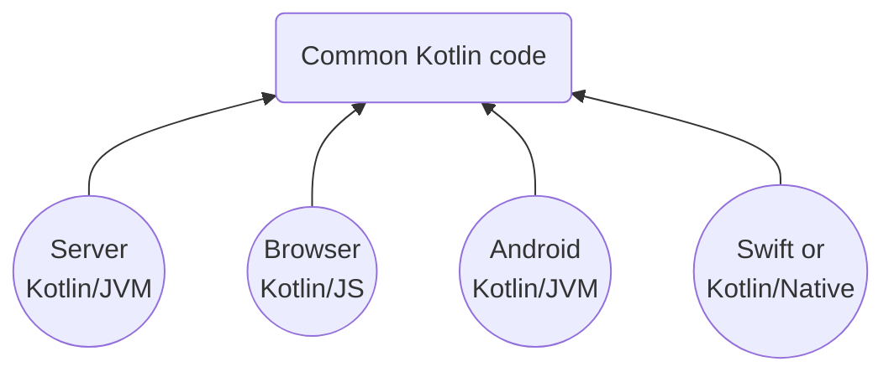

기업들은 대부분 한 플랫폼만을 위한 애플리케이션을 개발하지 않고, 두 개 이상의 플랫폼을 대상으로 제품을 개발한다.

예를 들어, 네트워크를 통해 서로 통신하는 클라이언트와 서버 애플리케이션을 생각해볼 수 있다. 
이들이 서로 통신해야 하므로, 재사용할 수 있는 공통점이 종종 있으며, 특히 다른 플랫폼에 대한 동일한 제품의 구현체는 더욱 많은 유사점을 공유한다.
이 중 비즈니스 로직은 거의 일치하며, 이런 프로젝트들은 코드를 공유함으로써 큰 이점을 얻을 수 있다.

## Full-stack development

웹 개발을 기반으로 서비스를 제공하는 기업이 많으며, 이 회사의 주요 제품은 웹 사이트가 될 것이다.  
하지만, 대부분의 서비스에서는 백엔드 애플리케이션이 필요하며, 웹은 JS가 거의 독점적으로 사용되고, 백엔드는 Java로 개발되는 경우가 많다.  
이처럼 Java와 JS는 상당히 다르기에, 개발 작업은 보통 분리되어 진행된다.

그러나 Kotlin이 백엔드 개발에 있어 Java의 대안으로 떠오르고 있으며, 모든 프레임워크에서 Java의 대체재로 사용될 수 있다.  
이는 많은 백엔드 프로젝트가 Kotlin으로 전환되고 있음을 의미한다.

또한 Kotlin은 JS로도 컴파일 될 수 있어, Kotlin/JS 라이브러리를 통해 다양한 웹 애플리케이션을 개발할 수 있다.  
예를 들어, React 프레임워크와 Kotlin/JS를 통해 웹 프론트엔드 개발을 할 수 있고, 이를 통해 백엔드와 웹 사이트 모두를 Kotlin으로 개발할 수 있다.

더욱이 JVM ByteCode와 JS 모두 컴파일 할 수 있는 공유 부분을 통해 API 엔드 포인트 정의나 공통 추상화같은 요소들을 재사용할 수 있다.

## Mobile development

모바일 환경에서는 Kotlin의 멀티플랫폼 기능이 더욱 중요하다. 대부분의 기업에서는 Android 애플리케이션만을 제공하지 않는다. 
iOS 애플리케이션도 필요로 하는 경우가 많으며, 같은 애플리케이션의 두 플랫폼은 매우 유사하다.
디자인은 종종 다르게 구현되어 있지만, 내부 로직은 거의 같은 경우가 많다.

이를 Kotlin 멀티 플랫폼 기능을 활용하여, 공통 모듈을 만들고, 그 안에 단 한 번만 비지니스 로직을 구현하여 두 플랫폼 모두에서 사용할 수 있다.
비지니스 로직은 원칙적으로 프레임워크나 플랫폼과 독립적이어야 하지만, 
이러한 공통 로직은 순수 Kotlin이나 다른 공통 모듈을 사용해 작성 할 수 있으며 다양한 플랫폼에서 활용될 수 있다.

Android에서는 Gradle을 통해 구축되므로 바로 사용할 수 있어, 프로젝트 내의 공통 부분을 가지고 작업하는 것과 비슷한 경험을 제공한다.

iOS의 경우 Kotlin/Native를 이용해 공통 부분을 Objective-C 프레임워크로 컴파일한 후, LLVM을 사용하여 네이티브 코드로 변환한다.
그리고 나서 Swift를 통해 Xcode에서 이를 사용할 수 있다. 또는 Kotlin/Native를 사용하여 애플리케이션 전체를 구현하는 방법도 있다.

## Libraries

공통 모듈을 정의하는 것은 라이브러리를 개발할 때에도 매우 유용한 방법이다. 특히, 플랫폼에 크게 의존하지 않는 라이브러리는 공통 모듈로 쉽게 이동할 수 있으며, 
이를 통해 JVM, JS, Native 환경에서 실행되는 다양한 언어(Java, Scala, JS, Swift, Objective-C, C, C++, Python, C# 등)에서 해당 라이브러리를 사용할 수 있게 된다.

## All together

Kotlin을 활용하면, 다양한 디바이스와 플랫폼을 대상으로 개발할 수 있고, 그 사이에서 코드를 자유롭게 재사용할 수 있다.

- Spring or Ktor 같은 Kotlin/JVM을 통해 백엔드 개발
- React 등에서 Kotlin/JS를 통해 웹 개발
- Android SDK를 사용하여 Kotlin/JVM을 통해 안드로이드 개발
- Kotlin/Native를 사용하여 Objective-C or Swift에서 사용 가능한 iOS 프레임워크 개발
- TornadoFX에서 Kotlin/JVM을 이용해 데스크톱 애플리케이션 개발
- Kotlin/Native로 Raspberry Pi, Linux, Mac OS에서 실행되는 프로그램 개발

