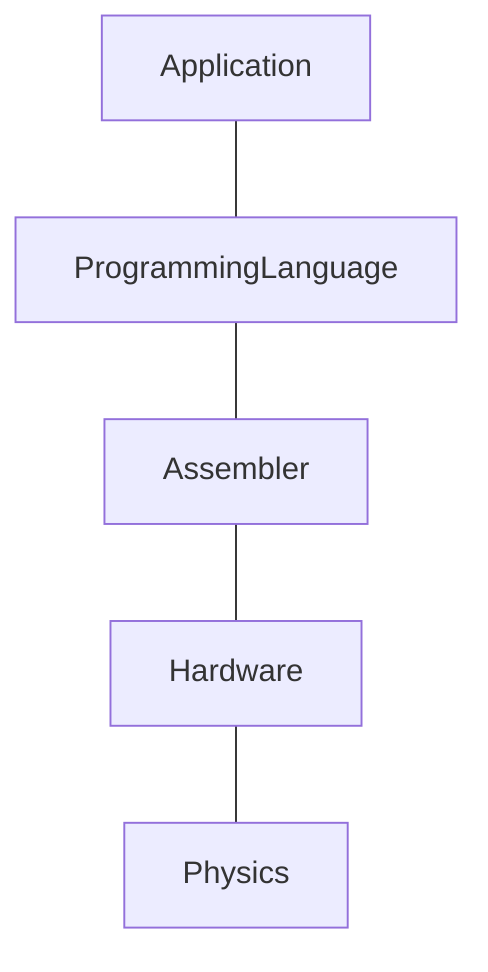

추상화는 프로그래밍 세계에서 매우 중요한 개념이며, OOP에서 추상화가 캡슐화와 상속과 함께 3대 핵심 개념 중 하나로 여겨진다.
함수형 프로그래밍에서는 프로그래밍 작업 전체를 추상화와 구성으로 보는 관점이 일반적이다.

추상화는 일반화 과정이나 결과로서, 특성을 제거하거나 아이디어를 객체로부터 멀어지게 하는 것이다.

즉, 추상화는 복잡성을 숨기는 단순화의 한 형태로, 프로그래밍에서 기본적인 예로 인터페이스를 들 수 있다.  
인터페이스는 클래스의 일부 특성만을 나타내기에 클래스의 추상화로 볼 수 있다. 구체적으로는 메서드와 프로퍼티의 집합을 의미한다.

---

# Item 26 : Each function should be written in terms of a single level of abstraction

잘 분리된 계층 구조는 특정 계층에서 작업을 할 때, 하위 계층이 예상한 대로 동작할 것이라는 믿음을 바탕으로 모든 세부 사항을 깊게 이해하지 않아도 된다.
이러한 장점은 어셈블리 언어나 JVM 바이트코드에 대한 지식을 갖지 않아도 프로그래밍을 할 수 있다는 것을 의미한다.

이로 인해, 컴퓨터 과학에서는 계층 위에 계층을 쌓아 올리면서, 어떤 기술이나 언어가 얼마나 '고수준(high-level)'인지를 구분하기 시작했다. 
더 높은 수준일수록 물리적인 부분으로부터 멀어지며, 프로그래밍에서는 프로세서와 멀어지는 것을 의미한다.



고수준일수록 세부적인 부분에 대해 걱정을 하지 않아도 된다는 장점이 있지만, 이는 동시에 제어력의 손실과 교환하는 것을 의미한다. 
예를 들어, Java에서는 메모리 관리를 가비지 컬렉터가 자동으로 해주지만, 메모리 최적화를 하는 것이 더 어렵다.

## Single Level of Abstraction Principle

복잡한 문제를 해결하기 위해서 코드 작성 시에도 추상화를 적용할 수 있으며, 이를 위한 가장 기본적인 방법은 '함수'를 사용하는 것이다. 
이때, 'SLAP(함수를 한 가지 추상화 수준에서 구현)'를 도입하면 프로그램의 각 로직들이 어떻게 상호작용 하는지 명확하게 이해할 수 있다.  

예를 들어, 커피 머신 클래스가 있다고 가정해 보자.  
커피를 만드는 과정은 여러 단계를 거치며, 이를 단일 함수 'makeCoffee'로 전체 과정을 표현할 수 있다.

```kotlin
class CoffeeMachine {
    
    fun makeCoffee() {
        // ...
    }
}
```

그러나, 위와 같은 함수는 기능이 추가되고 수정될 수록 코드가 길어지며, 극단적으로는 수백 줄에 달하는 코드로 구현될 수 있다.
이렇게 긴 함수는 읽을 수 없을 정도로 복잡하고, 어떤 동작을 하는지 파악하기 어려워진다.
또한, 전체적인 맥락을 이해하기 어려워지고, 특정 부분을 찾는 것도 쉽지 않아진다.

이러한 단점으로 인해, 고수준의 함수는 'high-level step' 별로 분리하여 함수로 작성하는 것이 좋다.

```kotlin
class CoffeeMachine {
    
    fun makeCoffee() {
        boilWater()
        brewCoffee()
        pourCoffee()
        pourMilk()
    }
    
    private fun boilWater() { /* ... */ }
    private fun brewCoffee() { /* ... */ }
    private fun pourCoffee() { /* ... */ }
    private fun pourMilk() { /* ... */ }
}
```

이렇게 함으로써, 처음 시작 할 작업과 각 단계의 절차들을 쉽게 이해할 수 있도록 단순화할 수 있다.  
또한, 각각의 'private' 함수들은 책의 파트처럼, 전체적인 구조에서 특정 부분을 담당하는 것처럼 보이게 할 수 있다.
이는 코드를 더 읽기 쉽게하고, 누군가 세부적인 구현을 이해하고자 할 때, 간편하게 이동하여 확인하거나 수정할 수 있게 한다.  
이처럼 간단한 추상화를 통해 'high-level step'을 분리함으로써 전체적인 가독성과 유지보수성을 높일 수 있다.

'SLAP' 원칙에 따르면 새롭게 추가되는 함수들도 간단하게 유지되어야 한다.  
만약, 프로그램 내 추상화 된 함수 보다 더 복잡한 함수가 존재하면, 'intermediary abstraction'로 추출해야 한다. 
이를 통해, 읽기 쉬운 작은 단위의 함수들을 여럿으로 만들고, 이들 모두 동일한 'single level abstraction'으로 맞춰야 한다.
'every level abstraction'에서는 '추상적인 용어(메서드나 클래스)'로 작업하며, 해당 기능이나 데이터가 어떻게 구현되는지 이해하려면 해당 정의로 직접 이동하여 확인할 수 있다.

위와 같은 방식으로 함수를 분리함으로써 프로그램의 기능이나 동작에 영향을 주지 않으면서, 가독성을 크게 향상할 수 있다.

추가적으로, 함수 분리 시, 각 함수들을 재사용하거나 단위 테스트하기 용이하다는 장점도 얻을 수 있다.  
예를 들어, 다른 에스프레소 커피를 만들기 위해 별도의 함수를 설정해야 한다면, 추출된 함수를 재사용하여 쉽게 구현할 수 있다.

```kotlin
fun makeEspressoCoffee() {
    boilWater()
    brewCoffee()
    pourCoffee()
}
```

## Abstraction levels in program architecture

추상화 계층의 개념은 함수보다 더 높은 수준에도 적용이 가능하다.  

프로그램 구조를 추상화하여 분리하면 다음과 같은 이점을 얻을 수 있다.

- 하위 시스템의 세부 구현을 숨겨, 시스템의 다른 부분에 영향을 주지 않고 내부 구현을 변경할 수 있다.
- 프로그램 내 서로 다른 관심사를 분리하며, 특정 로직에 대한 변경이 전체 시스템에 미치는 영향을 최소화한다.
- 시스템 구성 요소 간 상호작용을 원활하게 하고, 다양한 플랫폼에서도 동작하도록 한다. 
- 비지니스 로직을 'problem-domain terms'로 표현하게 하여 기술적인 세부 사항보다는 실제 문제를 해결하는데 집중할 수 있다.


이러한 개념은 모듈형 시스템을 설계할 때도 중요하다.
독립적으로 분리된 모듈은 특정 계층의 요소를 숨기는데 효과적인 방법을 제공한다.

예를 들어, 애플리케이션 개발 시 일반적으로 화면을 출력하거나 백엔드의 HTTP 처리 등을 담당하는 모듈은 하위 계층 모듈로 간주되고, 
'Usecase', '비지니스 로직'을 다루는 모듈은 보다 상위 계층 모듈로 간주된다.


이처럼 잘 분리된 계층 구조를 가진 프로젝트는 시스템의 어느 한 부분을 확인하더라도, 전체 구조와 해당 계층의 역할, 기능, 연결성을 쉽게 이해할 수 있다.

예를 들어, 소프트웨어 개발에서 'DB 설계', 'UI 개발', 'API 개발' 등 분리된 계층 구조를 가질 때,
'API 개발'을 살펴보면 **해당 계층이 어떻게 데이터 베이스와 연결되고, UI에 어떤 데이터를 제공하는지 쉽게 이해**할 수 있다.

이러한 장점이 있기에 프로그램 개발 시 잘 분리된 계층 구조를 가진 프로젝트를 선호한다.

---

## Item 27 : 추상화를 통한 코드 보호

추상화를 통해 함수나 클래스의 구현 시 세부 사항을 보호하고 나중에 자유롭게 코드를 변환하기 위해 필요합니다.

### 상수 활용 추상화

코드의 가독성을 높이고 관리를 용이하게 만드는 방법입니다.
예를 들어, 패스워드 유효성 검사에서 '7'이라는 최소 길이를 상수로 추출하면 코드의 이해가 더 쉬워지고 변경이 필요할 때도 유용합니다.

### 함수 활용 추상화

반복적인 작업을 간결하게 만들 수 있습니다.
예를 들어, 토스트 메시지를 반복해서 사용한다면, 이를 함수로 추출해 재사용할 수 있습니다.

### 클래스 활용 추상화

클래스는 상태를 유지할 수 있고, 여러 함수를 노출할 수 있기 때문에 강력한 추상화 방법입니다.
이를 통해 DI 프레임워크를 사용한 클래스 생성 위임, 클래스 모킹 등의 유연한 동작이 가능합니다.
하지만 클래스가 `final`로 선언된 경우 확장성에 제한이 있을 수 있습니다.

### 인터페이스 활용 추상화

객체를 인터페이스 뒤에 숨김으로써 실제 구현을 추상화하고, 추상화에만 의존하도록 강제함으로써 결합도를 낮춥니다.
인터페이스는 라이브러리 개발자들이 클래스의 가시성을 제한하고 해당 구현을 자유롭게 변경할 수 있는 유연성을 제공합니다.
인터페이스의 Fake class를 통한 테스트는 모킹보다 간단하며 모킹 라이브러리를 필요로 하지 않습니다.

### 추상화의 문제점과 균형

추상화는 새로운 개념의 도입이 필요하며 프로젝트를 이해하는 데에 추가적인 학습 요소가 될 수 있습니다.
이를 극복하기 위해서는 비용과 효과를 고려하여 적절한 균형을 찾아야 합니다.
추상화의 적절한 균형은 프로젝트의 복잡성, 팀의 규모와 경험, 프로젝트의 크기, 도메인 배경 지식 등 다양한 요소를 고려해야 합니다.

---

## Item 28 : API 안정성 명시

개발자들이 새로운 버전의 라이브러리 사용과 이로 인한 문제가 발생하지 않도록 API 안정성을 명시하는 것이 중요합니다.

### SemVer(Semantic Versioning)

SemVer은 API의 안정성을 명시하기 위한 표준화된 버전 관리 시스템입니다.
MAJOR.MINOR.PATCH 형식으로 구성되며, 각 부분은 API의 변화에 따라 증가합니다.

|  구성   |                             설명                             |
|:-----:|:----------------------------------------------------------:|
| MAJOR | - API 변화가 호환되지 않을때 증가 <br/> - 증가 시 `MINER`와 `PATCH` 0으로 설정 |
| MINOR |    - 호환 가능한 방식으로 기능 추가 시 증가 <br/> - 증가 시 `PATCH` 0으로 설정    |
| PATCH |                  -  호환 가능한 버그 수정이 있을 때 증가                  |

### 안정적인 API에 불안정한 요소 추가 시

안정적인 API에 아직 안정적이지 않은 새로운 요소를 도입하는 경우, `@Experimental`을 사용하여 경고하거나, `@Deprecated`를 사용하여 API를 변경하려는 사람들에게 차이점을 알려줄 수
있습니다.

이를 통해 API를 사용하는 개발자들이 적절한 조치를 취할 수 있도록 하며 변경사항에 대한 명확한 정보를 제공하고 안정적인 마이그레이션을 지원합니다.

---

## Item 29 : 외부 API 사용시 래핑

프로젝트에서 불안정한 API를 많이 사용하는 것은 큰 위험을 수반합니다.
API의 변경은 해당 API를 사용하는 코드 전체의 수정을 필요로 하기 때문입니다.
따라서 가능한 API 사용을 제한하고, 로직을 분리하여 이를 관리하는 것이 바람직합니다.

### 래핑을 통한 문제점 해결

그럼에도 API 사용이 필요한 경우 래핑하는 방법으로 문제를 완화 시킬 수 있습니다.
래핑을 통해 프로젝트 내에서 API를 제한적으로 사용하고, 필요에 따라 수정하거나 변경할 수 있습니다.
또한 라이브러리에 문제가 생긴 경우, 다른 라이브러리로 대체할 수도 있습니다.

### 래핑의 단점

래핑에 필요한 추가적인 코드가 필요하고, 래핑된 API를 사용하려면 개발자들이 해당 API의 작동 방식을 이해해야 합니다.
또한 래핑된 API에 대한 레퍼런스를 직접 작성해야 할 수도 있습니다.

### API 래핑 여부 결정

라이브러리의 안정성, 버전, 사용자 수 등을 검토하여 라이브러리의 신뢰성을 판단해야 하며,
특히 사용자 수가 많을수록 해당 라이브러리가 안정적일 가능성이 높습니다.

---

## Item 30 : API 설계 시 요소 가시성 최소화

API 설계 시 요소의 가시성을 최소화 하는 중요한 이유는 아래와 같습니다.

### 학습과 유지 관리

인터페이스가 작을수록 학습하고 유지 관리하기 쉽습니다. 클래스 내 기능이 적을수록 그 클래스를 이해하고 유지 관리하는 것이 더 쉽습니다.

### API 변경 용이성

API의 변경이 필요할 때, 기존 요소를 숨기는 것보다 새로운 것을 공개하는 것이 더 간단합니다. 이미 공개된 요소는 외부에서 사용되고 있을 가능성이 높아, 이를 변경하는 것은 복잡할 수 있습니다.

### 클래스 상태 책임

클래스 상태를 나타내는 속성들이 외부에서 변경될 경우, 클래스는 자신의 상태를 제대로 책임지지 못하게 됩니다. 이를 방지하기 위해 속성에 대한 접근자의 가시성을 적절히 제한하는 것이 필요합니다.

### 추적 용이성

가시성이 제한된 클래스는 상태 변화를 추적하기 더 쉽습니다. 이는 속성 상태를 이해하는 것을 도와주며, 특히 동시성 문제를 다루는 경우에 중요합니다.

### Visiblity Modifier

| modifier    | 설명                                                    |
|-------------|-------------------------------------------------------|
| `private`   | 선언된 클래스 내에서만 볼 수 있습니다.                                |
| `protected` | 선언된 클래스와 서브 클래스 내에서만 볼 수 있습니다. (최상위 선언에는 사용할 수 없습니다.) |
| `public`    | 모든 곳에서 볼 수 있습니다. 이는 기본으로 적용되는 수정자 입니다.                |
| `internal`  | 같은 모듈 내에서 볼 수 있습니다.                                   |

---

## Item 31 : 문서를 통한 Contract 정의

문서화 및 주석은 코드 가독성과 이해도를 높이는 중요한 도구 입니다.
특히, 코드의 작동 방식, 이해하기 어려움 개념, 예상되는 동작 등을 명확히 하는데 도움을 줄 수 있습니다.

### 계약(Contract) 중요성
계약은 사용자의 기대치와 개발자의 약속을 연결하는 매개체입니다. 
잘 정의된 계약이 있다면, 개발자는 클래스가 어떻게 사용되는지 걱정하지 않아도 되고, 사용자는 내부 작동 원리에 대해 걱정할 필요가 없습니다.

### 계약 정의
이름, 주석 및 문서화, 타입 등을 사용하여 계약을 명확히 정의할 수 있습니다. 
이러한 방법들은 사용자가 객체나 메서드의 동작을 이해하는 데 도움이 됩니다.

### 주석의 필요성
주석은 코드의 목적과 동작을 더 잘 이해할 수 있게 돕는 도구입니다. 
하지만, 항상 필요한 것은 아니며, 경우에 따라 주석 없이 코드를 이해하는 것이 더 적절할 수 있습니다. 
가독성이 높고 의미가 명확한 코드의 경우, 주석이 오히려 방해가 될 수 있습니다.

### Kdoc
함수를 주석으로 문서화 시 공식적인 형식을 Kdoc이라 하며 마크다운 형식으로 작성하고 있습니다.

Kdoc의 구조는 다음과 같습니다.
 
- 문서의 첫 번째 문단은 요소의 요약 설명
- 문서의 두 번째 부분은 요소의 상세 설명
- 그 후의 각 줄은 태그로 시작하며, 태그들은 요소를 설명하기 위해 사용

### 리스코프 치환 원칙(Liskov Susbstitution Principle)

OOP에서 중요 규칙 중 하나로, 하위 클래스는 상위 클래스의 계약을 이행해야 한다는 원칙입니다.
각 클래스는 상위 클래스로 사용될 수 있으며, 상위 클래스의 역할을 충실히 수행하지 못하면 예상치 못한 문제가 발생할 수 있습니다.

---

## Item 32 : 추상화된 계약 존중

계약(Contract)과 가시성(Visibility)은 개발자 간 일종의 합의를 나타냅니다.
이런 합의를 위반하는 것은 계약의 일부가 아닌 `private` 속성과 함수가 될 수 있습니다.
이들은 언제든지 변경될 수 있으므로 예측 불가능한 문제를 초래할 수 있습니다.

### 계약은 보증과 같음

계약을 위반하여 구현 시 코드가 작동하지 않게 되면 이는 API를 사용하는 개발자의 문제 입니다.

### 계약은 상속됨

클래스를 상속하거나 다른 라이브러리에서 인터페이스를 확장할 때는 계약을 존중해야 합니다.
이를 준수하지 않으면 확장된 객체가 올바르게 작동되지 않을 수 있습니다.