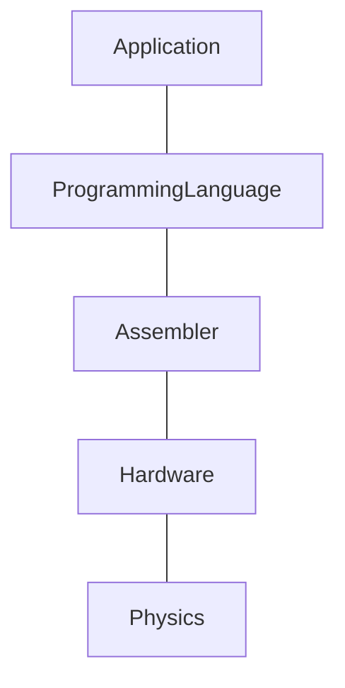
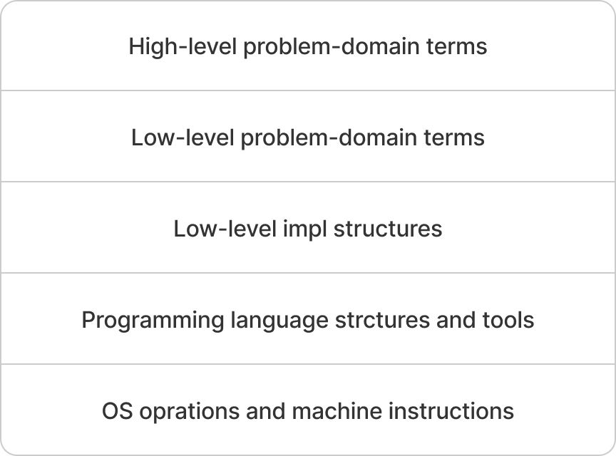
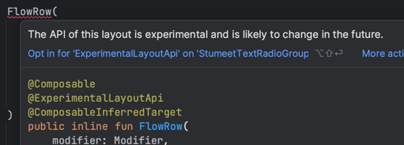
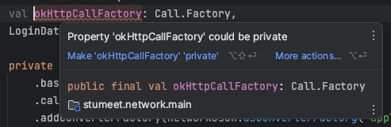

추상화는 프로그래밍 세계에서 매우 중요한 개념이며, OOP에서 추상화가 캡슐화와 상속과 함께 3대 핵심 개념 중 하나로 여겨진다.
함수형 프로그래밍에서는 프로그래밍 작업 전체를 추상화와 구성으로 보는 관점이 일반적이다.

추상화는 일반화 과정이나 결과로서, 특성을 제거하거나 아이디어를 객체로부터 멀어지게 하는 것이다.

즉, 추상화는 복잡성을 숨기는 단순화의 한 형태로, 프로그래밍에서 기본적인 예로 인터페이스를 들 수 있다.  
인터페이스는 클래스의 일부 특성만을 나타내기에 클래스의 추상화로 볼 수 있다. 구체적으로는 메서드와 프로퍼티의 집합을 의미한다.

---

# Item 26 : Each function should be written in terms of a single level of abstraction

잘 분리된 계층 구조는 특정 계층에서 작업을 할 때, 하위 계층이 예상한 대로 동작할 것이라는 믿음을 바탕으로 모든 세부 사항을 깊게 이해하지 않아도 된다.
이러한 장점은 어셈블리 언어나 JVM 바이트코드에 대한 지식을 갖지 않아도 프로그래밍을 할 수 있다는 것을 의미한다.

이로 인해, 컴퓨터 과학에서는 계층 위에 계층을 쌓아 올리면서, 어떤 기술이나 언어가 얼마나 '고수준(high-level)'인지를 구분하기 시작했다.
더 높은 수준일수록 물리적인 부분으로부터 멀어지며, 프로그래밍에서는 프로세서와 멀어지는 것을 의미한다.



고수준일수록 세부적인 부분에 대해 걱정을 하지 않아도 된다는 장점이 있지만, 이는 동시에 제어력의 손실과 교환하는 것을 의미한다.
예를 들어, Java에서는 메모리 관리를 가비지 컬렉터가 자동으로 해주지만, 메모리 최적화를 하는 것이 더 어렵다.

## Single Level of Abstraction Principle

복잡한 문제를 해결하기 위해서 코드 작성 시에도 추상화를 적용할 수 있으며, 이를 위한 가장 기본적인 방법은 '함수'를 사용하는 것이다.
이때, 'SLAP(함수를 한 가지 추상화 수준에서 구현)'를 도입하면 프로그램의 각 로직들이 어떻게 상호작용 하는지 명확하게 이해할 수 있다.

예를 들어, 커피 머신 클래스가 있다고 가정해 보자.  
커피를 만드는 과정은 여러 단계를 거치며, 이를 단일 함수 'makeCoffee'로 전체 과정을 표현할 수 있다.

```kotlin
class CoffeeMachine {

    fun makeCoffee() {
        // ...
    }
}
```

그러나, 위와 같은 함수는 기능이 추가되고 수정될 수록 코드가 길어지며, 극단적으로는 수백 줄에 달하는 코드로 구현될 수 있다.
이렇게 긴 함수는 읽을 수 없을 정도로 복잡하고, 어떤 동작을 하는지 파악하기 어려워진다.
또한, 전체적인 맥락을 이해하기 어려워지고, 특정 부분을 찾는 것도 쉽지 않아진다.

이러한 단점으로 인해, 고수준의 함수는 'high-level step' 별로 분리하여 함수로 작성하는 것이 좋다.

```kotlin
class CoffeeMachine {

    fun makeCoffee() {
        boilWater()
        brewCoffee()
        pourCoffee()
        pourMilk()
    }

    private fun boilWater() { /* ... */
    }
    private fun brewCoffee() { /* ... */
    }
    private fun pourCoffee() { /* ... */
    }
    private fun pourMilk() { /* ... */
    }
}
```

이렇게 함으로써, 처음 시작 할 작업과 각 단계의 절차들을 쉽게 이해할 수 있도록 단순화할 수 있다.  
또한, 각각의 'private' 함수들은 책의 파트처럼, 전체적인 구조에서 특정 부분을 담당하는 것처럼 보이게 할 수 있다.
이는 코드를 더 읽기 쉽게하고, 누군가 세부적인 구현을 이해하고자 할 때, 간편하게 이동하여 확인하거나 수정할 수 있게 한다.  
이처럼 간단한 추상화를 통해 'high-level step'을 분리함으로써 전체적인 가독성과 유지보수성을 높일 수 있다.

'SLAP' 원칙에 따르면 새롭게 추가되는 함수들도 간단하게 유지되어야 한다.  
만약, 프로그램 내 추상화 된 함수 보다 더 복잡한 함수가 존재하면, 'intermediary abstraction'로 추출해야 한다.
이를 통해, 읽기 쉬운 작은 단위의 함수들을 여럿으로 만들고, 이들 모두 동일한 'single level abstraction'으로 맞춰야 한다.
'every level abstraction'에서는 '추상적인 용어(메서드나 클래스)'로 작업하며, 해당 기능이나 데이터가 어떻게 구현되는지 이해하려면 해당 정의로 직접 이동하여 확인할 수 있다.

위와 같은 방식으로 함수를 분리함으로써 프로그램의 기능이나 동작에 영향을 주지 않으면서, 가독성을 크게 향상할 수 있다.

추가적으로, 함수 분리 시, 각 함수들을 재사용하거나 단위 테스트하기 용이하다는 장점도 얻을 수 있다.  
예를 들어, 다른 에스프레소 커피를 만들기 위해 별도의 함수를 설정해야 한다면, 추출된 함수를 재사용하여 쉽게 구현할 수 있다.

```kotlin
fun makeEspressoCoffee() {
    boilWater()
    brewCoffee()
    pourCoffee()
}
```

## Abstraction levels in program architecture

추상화 계층의 개념은 함수보다 더 높은 수준에도 적용이 가능하다.

프로그램 구조를 추상화하여 분리하면 다음과 같은 이점을 얻을 수 있다.

- 하위 시스템의 세부 구현을 숨겨, 시스템의 다른 부분에 영향을 주지 않고 내부 구현을 변경할 수 있다.
- 프로그램 내 서로 다른 관심사를 분리하며, 특정 로직에 대한 변경이 전체 시스템에 미치는 영향을 최소화한다.
- 시스템 구성 요소 간 상호작용을 원활하게 하고, 다양한 플랫폼에서도 동작하도록 한다.
- 비지니스 로직을 'problem-domain terms'로 표현하게 하여 기술적인 세부 사항보다는 실제 문제를 해결하는데 집중할 수 있다.



이러한 개념은 모듈형 시스템을 설계할 때도 중요하다.
독립적으로 분리된 모듈은 특정 계층의 요소를 숨기는데 효과적인 방법을 제공한다.

예를 들어, 애플리케이션 개발 시 일반적으로 화면을 출력하거나 백엔드의 HTTP 처리 등을 담당하는 모듈은 하위 계층 모듈로 간주되고,
'Usecase', '비지니스 로직'을 다루는 모듈은 보다 상위 계층 모듈로 간주된다.


이처럼 잘 분리된 계층 구조를 가진 프로젝트는 시스템의 어느 한 부분을 확인하더라도, 전체 구조와 해당 계층의 역할, 기능, 연결성을 쉽게 이해할 수 있다.

예를 들어, 소프트웨어 개발에서 'DB 설계', 'UI 개발', 'API 개발' 등 분리된 계층 구조를 가질 때,
'API 개발'을 살펴보면 **해당 계층이 어떻게 데이터 베이스와 연결되고, UI에 어떤 데이터를 제공하는지 쉽게 이해**할 수 있다.

이러한 장점이 있기에 프로그램 개발 시 잘 분리된 계층 구조를 가진 프로젝트를 선호한다.

---

# Item 27 : Use abstraction to project code against changes

추상화를 통해 실제 코드를 숨기는 것은 개발자를 세부 구현으로부터 보호하고, 나중에 자유롭게 코드를 변경할 수 있도록 한다.  
예를 들어, 정렬 알고리즘을 함수로 추출하고, 나중에 사용 방법을 변경하지 않고도 쉽게 성능을 최적화할 수 있다.

아래 추상화 방법들을 통해, 어떻게 변화로부터 개발자를 보호하고, 그 과정에서 자율성을 제공하는지 알아보자.

## Constant

리터럴 상수 값들은 자체적으로 설명 없이 사용되는 경우가 많으며, 이는 코드를 이해하기 어렵게 만들기에 문제가 된다.  
이런 리터럴 상수 값을 상수 프로퍼티로 옮김으로써, 값에 의미 있는 이름을 부여할 수 있고, 값을 변경 해야하는 상황이 발생했을 때 더 쉽게 관리할 수 있다.

아래 예시와 같이, 패스워드 유효성 검사에서 숫자 '7'은 문맥에 따라 이해할 수 있겠지만, 이를 프로퍼티로 추출하여 더 명확하게 표현할 수 있다.

```kotlin
// Before
fun isPasswordValid(text: String): Boolean {
    if (text.length < 7) return false
    // ...
}

// After
const val MIN_PASSWORD_LENGTH = 7

fun isPasswordValid(text: String): Boolean {
    if (text.length < MIN_PASSWORD_LENGTH) return false
}
```

## Function

안드로이드 앱 개발 중 'Toast Message' 표시를 아래와 같이 간단한 확장 함수로 추출할 수 있으며,  
이는 추후에 변경될 때에도 사용 방법을 수정할 필요 없이, 함수 내부만 수정하여 모든 곳에 적용할 수 있는 이점을 얻을 것이다.

```kotlin
// Before
Toast.makeText(this, "Hello, World!", Toast.LENGTH_SHORT).show()

// After
fun Context.toast(msg: String, duration: Int = Toast.LENGTH_SHORT) {
    Toast.makeText(this, msg, duration).show()
}
```

하지만, 만약 'Toast'가 아닌 'Snackbar'로 메시지 표시 방식 자체를 변경해야 한다고 가정해보자.

이런 변경사항을 미리 알고 있었으면, "메시지를 어떻게 보여주는가?" 보다는 사용자에게 "메시지를 전달한다."라는 점을 더 중요하게 생각했을 것이다.
이처럼 더 추상적인 방법으로 메시지를 표시하면 다음과 같이 'Toast', 'Snackbar' 보다 더 상위 수준의 함수로 추출할 수 있다.

```kotlin
enum class MessageLength { SHORT, LONG }

fun Context.showMessage(
    msg: String,
    length: MessageLength = MessageLength.LONG
) {
    val duration = when (length) {
        SHORT -> Length.LENGTH_SHORT
        LONG -> Length.LENGTH_LONG
    }

    Toast.makeText(this, msg, duration).show()
    // or Snackbar.make(this, msg, duration).show()
}
```

위 상황에서 가장 큰 변화는 함수의 이름인데, 일부 개발자들은 함수 이름을 단지 'label' 정도로 생각한다.  
하지만, 함수 시그니처는 자신이 어떤 추상화인지 알려주기에, 의미 있는 이름은 매우 중요하기에 이런 변화를 간과해서는 안된다.  
또한, 함수 이름을 변경하는 것은, 이를 사용하는 모든 곳을 수정해야 하기에 예상치 못한 오류가 발생될 수 있어 주의해야 한다.

이처럼, 함수는 매우 간단한 추상화 방법이지만, 상태를 보유하지 않기에 제한적이다.  
또한, 위 예시와 같이 함수 시그니처가 변경되면 함수 사용법에 영향을 주므로, 더 강력하게 구현을 추상화하는 클래스를 사용하는 것이 좋다.

## Class

클래스가 함수보다 더 강력하게 구현을 추상화할 수 있는 이유는 상태를 유지할 수 있고, 여러 함수를 노출할 수 있기 때문이다.  
위 'showMessage'를 클래스로 추출하고, 추가적으로 상태를 통해 메시지 표시를 구분해 보면 다음과 같을 수 있다.

```kotlin
enum class MessageLength { SHORT, LONG }

class MessageDisplay(val context: Context) {

    var isToastMessageType = false

    fun show(
        msg: String,
        length: MessageLength = MessageLength.SHORT
    ) {
        val duration = when (length) {
            SHORT -> Length.LENGTH_SHORT
            LONG -> Length.LENGTH_LONG
        }

        if (isToastMessageType) Toast.makeText(context, msg, duration).show()
        else Snackbar.make(context, msg, duration).show()
    }
}

// usage
val messageDisplay = MessageDisplay(context)
messageDisplay.show("Hello, World!")        // Snackbar

messageDisplay.isToastMessageType = true
messageDisplay.show("Hello, World!")        // Toast
```

클래스는 함수 보다 더 많은 자율성을 제공하지만, 여전히 한계점이 존재한다.

예를 들어, 'final class'는 상속을 허용하지 않아, 기능을 확장하거나 변경할 수 없어 제한적이고,  
'open class'는 서브 클래스를 제공하여 상속을 허용하고 확장할 수 있지만,  
결국 기존 클래스와 강하게 연결되어 있어서 상위 클래스에 변경사항이 생기면 서브 클래스에도 영향을 준다.

이런 한계점을 극복하고, 클래스 보다 더 높은 수준의 자율성을 추구하려면, 클래스를 인터페이스 뒤에 숨겨 추상화를 더 강화할 수 있다.

## Interface

Kotlin 표준 라이브러리를 보면, 대부분 인터페이스로 추상화되어 있음을 알 수 있다.

- 'listOf()'는 'List' 인터페이스를 반환하며, 다른 '팩토리 메서드'들도 비슷하다.
- 컬렉션을 처리하는 함수들은 'Iterable', 'Collection'에 대한 확장 함수로, 'List', 'Map' 등의 인터페이스를 반환한다.
- 'property delegation'은 'ReadOnlyProperty' 또는 'ReadWriteProperty' 인터페이스 뒤에 숨겨져 있다.
- 'lazy { ... }' 또한 'Lazy' 인터페이스를 반환한다.

이처럼 인터페이스 뒤에 객체를 숨김으로써, 실제 구현을 추상화하고 사용자가 해당 추상화에만 의존하도록 강제함으로써, 결합도를 낮출 수 있다.

이를 토대로 'MessageDisplay'를 인터페이스로 추출하면 다음과 같을 수 있다.

```kotlin
enum class MessageLength { SHORT, LONG }

interface MessageDisplay {
    fun show(msg: String, length: MessageLength = MessageLength.SHORT)
}

class ToastDisplay(val context: Context) : MessageDisplay {

    override fun show(msg: String, length: MessageLength) {

        val duration = when (length) {
            SHORT -> Length.LENGTH_SHORT
            LONG -> Length.LENGTH_LONG
        }

        Toast.makeText(context, msg, duration).show()
    }
}

class SnackbarDisplay(val context: Context) : MessageDisplay {

    override fun show(msg: String, length: MessageLength) {

        val duration = when (length) {
            SHORT -> Length.LENGTH_SHORT
            LONG -> Length.LENGTH_LONG
        }

        Snackbar.make(context, msg, duration).show()
    }
}
```

이처럼, 인터페이스로 추상화를 하면 더 많은 자율성을 얻을 수 있다.

예를 들어, 태블릿에서는 'ToastDisplay', 모바일에서는 'SnackbarDisplay'를 각각 사용할 수 있다.  
더 나아가, 플랫폼 공통 모듈에서 'MessageDisplay'를 사용하여, 각 플랫폼에 맞게 다양한 구현을 적용할 수 있도록 할 수 있다.

또한, 'Mock 클래스' 대신, 'Fake 인터페이스'를 통해 간편하게 테스트할 수 있다.

```kotlin
val msgDisplay: MessageDisplay = FakeMessageDisplay()
```

## Next ID

간단한 방법으로 프로젝트에 '유니크 ID'가 필요하다고 가정해 보면,  
'Top-level 프로퍼티'를 통해 ID를 저장하고, 새로운 ID가 필요할 때마다 값을 증가시켜 구현할 것이다.

```kotlin
var nextId: Int = 0
fun getNextId(): Int = nextId++

// usage
val newId = getNextId()
```

하지만, 이런 방법은 많은 변경 사항이 발생할 수 있다.

예를 들어, 현재 ID를 'Int'로 표현하고 있기에, 타입에 종속된 연산(e.g : 숫자를 비교하여 어떤 ID가 더 오래되었는지 확인하는 등)을 수행할 수 있을 것이다.  
그러나 시간이 지나, ID를 'String'으로 변경해야 하는 상황이 생긴다면, 타입에 종속된 연산들을 모두 수정해야 할 것이다.

이를 방지하고, 향후 ID 타입을 쉽게 변경할 수 있도록 ID를 별도의 클래스로 추출하는 것이 좋다.

```kotlin
data class Id(private val id: Int)

private var nextId: Int = 0
fun getNextId(): Id = Id(nextId++)
```

## Problems with abstraction

추상화는 코드를 구조화하고 재사용성을 높이는데 도움이 되지만, 이와 동시에 코드를 읽는 사람에게 추가적인 학습 부담을 주며, 프로젝트 복잡성을 증가시킨다.  
특히, 새로운 추상화 개념을 도입할 때, 도입하려는 추상화 개념을 이미 알고 있어야 하거나 배워야 하는 요구가 있으며, 추가적으로 프로젝트 내에서 이해해야 할 요소가 하나 더 늘어나게 된다.

물론, 위와 같은 문제는 'visibility'를 제한하여 필요한 개발자만 해당 추상화를 사용하거나, 구체적인 작업에 초점을 두어서 범위를 제한하는 방식으로 문제점을 완화할 수 있다.

이를 통해 알 수 있는 것은, 자신이 작업하는 특정 기능이나 서비스 범위로 제한하여 추상화를 도입하면, 위와 같은 문제점을 완화할 수 있다는 것이다.  
이러한 이유로, **대규모 프로젝트에는 모듈성을 적용하는 것이 좋다.**

한편으로, 추상화는 개발자가 고려해야 할 사항들을 줄여 주기에 개발 과정을 단순화시키는 이점을 제공한다.  
그러나 반대로, 너무 많은 추상화는 코드가 실제로 어떻게 동작하는지 이해하는데 어려움을 줄 수 있다.

예를 들어, 여전히 'showMessage'가 'Toast'를 표시할 것이라 생각하여 사용하다가, 실제로는 'Snackbar'로 표시된다면 놀랄 것이다.  
이처럼, 의도치 않은 동작을 확인한 개발자는 'Toast.make'를 통해 찾으려 했지만, 실제로는 'showMessage'를 통해 표시되었기에 이를 찾는데 어려움을 겪을 것이다.

이런 예시와 같이 추상화가 많을수록 코드를 이해하기 어렵게 만들고, 개발자가 실행한 행동이 어떤 결과를 가져올지 확신할 수 없게 만들어 불안감을 가질 수 있다.

## Where is the balance?

기본적인 원칙은, 프로젝트 복잡성이 증가하면 개발자에게 더 많은 자율성을 제공하고, 더 체계적으로 코드를 관리할 수 있음을 의미한다.  
그러나, 동시에 복잡성의 증가로 인해 프로젝트에서 실제로 어떤 일이 일어나고 있는지 이해하기 어려워진다.

이는 프로젝트 복잡성이 너무 단순하거나 너무 복잡한 것도 바람직하지 않으며, 최선의 방법은 이 두 가지 사이의 밸런스를 잡는 것이다.  
추가적으로, 이 밸런스는 다음과 같은 요소들에 따라 유동적으로 변할 수 있다.

- Team size
- Team experience
- Project size
- Feature set
- Domain knowledge

모든 프로젝트는 계속해서 밸런스를 잡아가고 있지만, 쉽지 않은 작업이다.  
이런 밸런스를 잡기 위해서는 지속적인 학습과 경험이 필요하며, 아래는 프로젝트 복잡성의 밸런스를 잡기 위한 몇 가지 제안사항들이다.

- 개발자가 많은 대규모 프로젝트에서는 객체 생성과 사용 방법을 나중에 변경하기 어렵기에, 복잡성이 증가하더라도 더 추상적인 솔루션을 사용하는 것이 좋다.  
  추가적으로, 'module'이나 'feature' 별로 코드를 독립적으로 분리하여 작성하는 것도 복잡성을 낮추는데 도움이 될 수 있다.
- 대부분의 경우, 객체 생성과 관련된 설정을 'DI 프레임워크'를 통해 정의하기에, 객체 생성 복잡성에 대해서 걱정할 필요가 없다.
- 다양한 앱 버전을 만들거나(release, debug, bench-mark 등), 테스트를 수행할 때, 코드를 범용적으로 만들어 다양한 시나리오에 적용할 수 있도록 일정 수준의 추상화가 필요하다.
- 프로젝트가 작고 실험적인 단계에 있을 때는 추상화를 다루지 말고, 개발 초기의 아이디어를 신속하게 직접 구현하는 것이 좋다.  
  단, 프로젝트 규모가 커지고 릴리즈 단계로 진행될 때는 가능한 빨리 추상화를 도입하여, 코드를 더 체계적으로 관리하는 것이 좋다.

또한, 개발자들은 프로젝트 설계 및 구현 시, 특정 부분이 변경될 가능성과 해당 변경사항이 발생할 확률을 지속적으로 고려하여 추상화를 해야 한다.

- 시스템이 일반적인 메커니즘으로 전환해야 하는지?
    - 'ID/PW'만 사용하다가, 'SNS' 및 'FaceID' 등 지원해야 하는 경우
- 플랫폼에 독립적인 메커니즘이 필요한 지?
    - 'Android'에만 사용되는 'Message'를 'iOS'에서도 사용해야 하는 경우
- 특정 메커니즘을 모의(mock) 해야 하는지?
    - 결제 시스템에서 결제 처리를 위한 '모의 결제'가 필요한 경우

이런 고려사항을 통해, 개발자는 시간이 지나면서 변화하는 패턴을 관찰하고, 이를 바탕으로 변경 사항들을 대비할 수 있어야 한다.

---

# Item 28 : Specify API stability

프로그래밍에서는 'Stable standard API'를 선호하며, 이유는 다음과 같다.

1. 불안정한 API는 자주 업데이트 되기에, 업데이트될 때마다 API 사용자에게 추가적인 작업과 변경사항을 요구한다.
    - API 사용 방식이 변경된 경우, 이에 맞춰 기존 코드를 수정해야 하는 부담감이 생김.
    - 변경사항을 적용하지 않는 경우, 'Bugfix', 'Vulnerability corrections'과 같은 필수 사항이 누락되기에 프로젝트에 문제가 발생할 수 있음.
2. API 업데이트 내용 또한 'knowledge'로 취급되기에, 이를 다시 학습하고 이해하는데 시간과 노력이 필요하다.

시간이 흐름에 따라 사용자 요구사항과 기술의 발전으로 기존 API를 개선해야 하는 상황이 발생할 수 밖에 없다.  
하지만, 이런 변경은 위에 언급한 것과 같이 사용자에게 부담을 주기에, 이를 완화하고자 API 안정성을 명시하기 시작하였다.

가장 간단한 방법은 해당 API 안정성을 문서화하여 사용자들에게 보여주는 방식이 있지만,
보다 공식적으로 'Semantic Versioning'을 통해 API 버전을 명시하는 것이 좋다.

'Semantic Versioning'은 'MAJOR', 'MINOR', 'PATCH' 버전을 통해 API의 안정성을 명시하며 다음과 같은 규칙을 따른다.

- MAJOR : 이전 버전과 '호환되지 않는 변경사항'이 있을 때 증가
- MINOR : 이전 버전과 호환되는 '새로운 기능이 추가'되었을 때 증가
- PATCH : 이전 버전과 호환되는 '버그 수정'이 있을 때 증가
- 'MAJOR' 버전이 증가되면, 'MINOR'와 'PATCH' 버전은 0으로 설정
- 'MINOR' 버전이 증가되면, 'PATCH' 버전은 0으로 설정
- 'Pre-release' 출시 시 'MAJOR.MINOR.PATCH' 뒤에 'alpha/beta/rc' 표기 : [link](https://semver.org/#spec-item-9)
- 'Build metadata'는 'MAJOR.MINOR.PATCH' 뒤에 'mata-data' 표기 : [link](https://semver.org/#spec-item-10)
- 'MAJOR' 버전이 0인 경우, 초기 개발을 의미하여 언제든지 변경될 수 있기에 불안정한 API로 간주해야 함

불안정한 요소를 안정화된 API에 추가하고, 일부 사용자에게 사용할 수 있도록 허용하고 싶을 때는 `@Experimental` 어노테이션을 명시하여 사용자에게 경고나 오류를 표시할 수 있다.



또는 안정화된 API의 일부를 변경해야 하는 경우, 사용자에게 이런 변경사항을 처리할 수 있도록 도와주기 위해 `@Deprecated` 어노테이션을 명시하여 사용자에게 알릴 수 있다.

```kotlin
@Deprecated(
    message = "Use suspending 'getUsers()' instead",
    replaceWith = ReplaceWith("getUsers()"),
    level = DeprecationLevel.WARNING
)
fun getUsers(callback: (List<User>) -> Unit) {
    // ...
}

suspend fun getUsers(): List<User> {
    // ...
}
```

---

# Item 29 : Consider wrapping external API

라이브러리 개발자가 불안정하다고 명시한 API와 안정적으로 유지하지 못할 것이라고 판단되는 API를 지나치게 사용하는 것은 불가피하게 API가 변경될 수 있다는 리스크를 가진다.
이로 인해, API가 변경될 경우 프로젝트 내 사용되던 모든 Use-Case를 수정해야 하므로, 가능한 비지니스 로직 내에서의 사용을 자제하고 분리시키는 것이 좋다.

이런 리스크를 감안하고도 사용해야 하는 경우, 자체적으로 'unstable external API'를 래핑하여 사용하는 경우가 있다.
이런 래핑을 통해 프로젝트에서는 다음과 같은 자율성과 안정성을 얻을 수 있다.

- API가 변경되면 래퍼 내부의 한 곳에서만 수정하면 되기에 변경사항을 쉽게 관리할 수 있다.
- 프로젝트 스타일과 로직에 맞게 'external API'를 사용할 수 있도록 커스터마이징 할 수 있다.
- 'external API'에 이슈가 발생한 경우, 손쉽게 '다른 external API'로 교체할 수 있다.
- 필요에 따라 래핑된 객체의 상태를 추적하거나, 래핑 된 객체의 동작을 변경할 수 있다.

하지만, 프로젝트에 'external API'를 래핑하는 방식을 반대하는 의견도 있다.

- 'external API'가 업데이트되면 모든 래퍼 클래스를 업데이트해야 하기에, 많은 양의 코드를 수정해야 할 수 있다.
- 'external API'를 'internal API'로 변환하는 것과 같기에, 이를 사용하는 개발자들은 새로운 API를 다시 학습해야 한다.
- 'internal API'에 대한 자료가 부족할 수 있기 때문에, 외부 커뮤니티(e.g : Stack overflow)에 대한 도움을 기대하기 어렵다.

결과적으로, 'external API'를 래핑할지 말지는 위 두 의견을 모두 이해한 뒤에 결정하는 것이 좋다.  
그럼에도 제일 좋은 방식은 'stable external API'를 사용하는 것이다.

많은 API 중 어떤 것들이 안정적인지 알 수 없을 때에는 'external API'의 버전 번호와 사용자 수 지표를 확인하면 도움이 될 수 있다.
왜냐하면 사용자 수가 많은 API는 변경 사항이 정말 작게 발생하더라도, 많은 프로젝트에서 이를 대응해야 하는 것을 API 개발자가 인지하고 있기 때문에,
변경 사항에 대해 더욱 신중을 기울일 수밖에 없기에 더욱 안정적이다.  
반대로, 'unstable external API'는 사용자 수가 적고 새로운 라이브러리라는 것을 알 수 있다.

---

# Item 30 : Minimize elements visibility

API를 설계할 때 가능한 간결하게 만드는데에는 다음과 같은 이유가 있다.

**인터페이스가 작을수록 러닝커브가 낮고, 유지보수 하기 더 쉽다.**  
수십개의 메서드를 지닌 클래스 보단, 몇 개의 메서드를 지닌 클래스가 이해하기 쉽다. 
또한, 공개된 요소들이 적을 수록, 변경사항이 발생했을 때 영향을 받는 코드가 적어지고 테스트 할 항목들이 줄어 유지보수가 쉬워진다.

**API에 변경사항을 적용하고 싶을 때, 기존 요소를 숨기는 것보다 새로운 요소를 노출하는 것이 더 쉽다.**  
'public API'의 변경은 사용자 코드에 대한 업데이트가 필수적이며, 이는 'public API'가 오래 될수록 더 많은 사용자가 있어 더욱 광범위하게 영향을 준다.
여기에 더해, 'public API' 요소에 가시성을 제한하는 것은 이미 사용 중인 기능에 대한 대안을 제공해야함으로 더욱 복잡하고 어렵다.  
이러한 이유로, 처음부터 사용자들이 간결한 API를 사용하도록 강제하여, 변경 사항이 있을 때 새로운 요소를 쉽게 추가할 수 있도록 하는 것이 좋다.

**클래스 상태를 나타내는 프로퍼티가 외부에서 변경될 수 있으면, 자신의 상태를 책임질 수 없다.**  
클래스의 상태가 'internal contract'를 모르는 외부 환경에 의해 변경될 수 있으면, 그 상태는 불변성을 보장할 수 없다.  
아래와 같이 'elementsAdded' 프로퍼티에 가시성 제한이 없었다면, 
데이터에 얼마나 많은 변경이 일어났는지 알 수 없어 해당 데이터를 신뢰할 수 없게 된다.

```kotlin
class CounterSet<T>(/* ... */) : MutableSet<T> by innerSet {

    var elementsAdded: Int = 0
        private set
}
```

이처럼 Kotlin에서 모든 프로퍼티가 기본적으로 캡슐화 되었다는 점은 접근자에 가시성을 제한할 수 있기에 매우 유용하다.

객체의 내부 상태를 보호하는 것은 서로 다른 프로퍼티가 의존성을 가질 때 특히 중요하다.  
예를 들어, 아래와 코드와 같이 'initialized'의 'setter'가 외부에 노출되었다면, 다른 프로퍼티를 신뢰할 수 없게 될 것이다.

```kotlin
class MutableLazyHolder<T>(val initializer: () -> T) {

    private var value: Any = Any()
    private var initialized = false

    override fun get(): T {
        if (!initialized) {
            value = initializer()
            initialized = true
        }

        return value as T
    }

    override fun set(value: T) {
        this.value = value
        initialized = true
    }
}
```

## Using visibility modifiers

일반적으로, 요소를 외부에 노출시켜야 하는 이유가 없다면 가시성을 제한하는 것이 좋다.  
또한, 클래스와 요소에 덜 제한적인 가시성 타입을 사용해야 할 이유가 없다면, 최대한 제한적으로 설정하는 것이 좋다.

클래스 멤버의 경우가 다음과 같은 4가지 'visibility modifier'가 있다.

| modifier         | description                          |
|------------------|--------------------------------------|
| public (default) | 선언된 클래스를 볼 수 있는 클라이언트라면 어디에서든 볼 수 있음 |
| private          | 클래스 내부에서만 볼 수 있음                     |
| protected        | 클래스 내부와 하위 클래스에서만 볼 수 있음             |
| internal         | 해당 모듈 내에서만 볼 수 있음                    |

함수, 프로퍼티, 클래스 등과 같은 'Top-level 요소'에는 다음 3가지 'visibility modifier'가 있다.

| modifier         | description       |
|------------------|-------------------|
| public (default) | 모든 곳에서 볼 수 있음     |
| private          | 같은 파일 내에서만 볼 수 있음 |
| internal         | 같은 모듈 내에서만 볼 수 있음 |

이러한 관례는 Kotlin에서도 따르며, 만약 요소가 로컬에서만 사용되면, 가시성을 'private'으로 제한하도록 다음과 같이 제안한다.



하지만 이런 규칙은 'DTO 클래스의 프로퍼티'에 적용해서는 안되며, 해당 프로퍼티는 사용되기 위해 존재하는 것이므로 표시하는 것이 좋다.
만약, 필요하지 않다면 해당 프로퍼티를 완전히 제거하는게 좋다.

```kotlin
data class User(
    val name: String,
    val age: Int
)
```

---

## Item 31 : 문서를 통한 Contract 정의

문서화 및 주석은 코드 가독성과 이해도를 높이는 중요한 도구 입니다.
특히, 코드의 작동 방식, 이해하기 어려움 개념, 예상되는 동작 등을 명확히 하는데 도움을 줄 수 있습니다.

### 계약(Contract) 중요성

계약은 사용자의 기대치와 개발자의 약속을 연결하는 매개체입니다.
잘 정의된 계약이 있다면, 개발자는 클래스가 어떻게 사용되는지 걱정하지 않아도 되고, 사용자는 내부 작동 원리에 대해 걱정할 필요가 없습니다.

### 계약 정의

이름, 주석 및 문서화, 타입 등을 사용하여 계약을 명확히 정의할 수 있습니다.
이러한 방법들은 사용자가 객체나 메서드의 동작을 이해하는 데 도움이 됩니다.

### 주석의 필요성

주석은 코드의 목적과 동작을 더 잘 이해할 수 있게 돕는 도구입니다.
하지만, 항상 필요한 것은 아니며, 경우에 따라 주석 없이 코드를 이해하는 것이 더 적절할 수 있습니다.
가독성이 높고 의미가 명확한 코드의 경우, 주석이 오히려 방해가 될 수 있습니다.

### Kdoc

함수를 주석으로 문서화 시 공식적인 형식을 Kdoc이라 하며 마크다운 형식으로 작성하고 있습니다.

Kdoc의 구조는 다음과 같습니다.

- 문서의 첫 번째 문단은 요소의 요약 설명
- 문서의 두 번째 부분은 요소의 상세 설명
- 그 후의 각 줄은 태그로 시작하며, 태그들은 요소를 설명하기 위해 사용

### 리스코프 치환 원칙(Liskov Susbstitution Principle)

OOP에서 중요 규칙 중 하나로, 하위 클래스는 상위 클래스의 계약을 이행해야 한다는 원칙입니다.
각 클래스는 상위 클래스로 사용될 수 있으며, 상위 클래스의 역할을 충실히 수행하지 못하면 예상치 못한 문제가 발생할 수 있습니다.

---

# Item 32 : Respect abstraction contracts

'contract'와 'visibility'는 개발자들 사이의 일종의 '합의'이지만, 거의 대부분 개발자들에 의해 위반된다.  
예를 들어, 단일 프로젝트 내의 모든 것은 다음과 같이 리플렉션을 통해 원하는 모든 것을 열고 사용 할 수 있다.

```kotlin
class Employee {
    private val id: Int = 2

    override fun toString() = "User(id=$id)"

    private fun privateFunction() {
        println("Private function called")
    }
}

fun callPrivateFunction(employee: Employee) {
    employee::class.declaredMemberFunctions
        .first { it.name == "privateFunction" }
        .apply { isAccessible = true }
        .call(employee)
}

fun changeEmployeeId(employee: Employee, newId: Int) {
    employee::class.java.getDeclaredField("id")
        .apply { isAccessible = true }
        .set(employee, newId)
}

fun main() {
    val employee = Employee()
    callPrivateFunction(employee)   // Prints: "Private function called"
    
    changeEmployeeId(employee, 1)
    println(employee)               // Prints: "User(id=1)"
}
```

위에서 'private' 프로퍼티와 함수 이름과 같은 세부 구현사항을 의존하고 있는 것을 알 수 있으며, 이는 'contract'를 위반하는 행동이다.
프로퍼티와 함수는 언제든지 변경될 수 있기에 이러한 의존은 잠재적인 위험을 가지고 있다.

'contract'를 'warranty'와 같다고 생각해야 한다.  
즉, 소프트웨어 개발에서 정의된 'contract'를 준수하면 코드를 보호 받을 수 있다. 
그러나, 이를 무시하고 자신의 방식대로 시스템을 변경하거나 확장하면, 여러 부작용이 발생할 수 있으며 이는 오로지 해당 개발자의 책임이다.

## Contracts are inherited

클래스 상속 또는 라이브러리의 인터페이스 확장 시 'contract'를 준수하는 것은 매우 중요하다.

예를 들어, 모든 클래스는 'equals'와 'hashCode'를 지닌 'Any'를 확장한다.  
이 메서드들은 잘 정립된 'contract'를 가지며, 이를 준수하지 않으면 예상치 못한 결과가 발생할 수 있다.  
만약, 'hashCode'가 'equals'와 일관성이 없다면, 다음과 같이 'HashSet'을 사용할 때 문제가 발생할 수 있다.

```kotlin
class Id(val id: Int) {
    
    override fun equals(other: Any?) = 
        other is Id && other.id == id
}

val set = mutableSetOf(Id(id = 1))
    set.add(Id(id = 1))
set.add(Id(id = 1))
println(set.size)       // Prints: 3
```