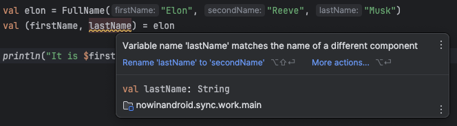

여러 데이터를 묶어서 전달해야 하는 상황이 생길 수 있는데, 
이런 경우에는 클래스에 'data modifier'를 추가해서 아래와 같이 'data class'로 사용할 수 있다.

```kotlin
data class Player(
    val id: Int,
    val name: String,
    val points: Int
)

val player = Player(1, "Player 1", 1000)
```

'data modifier'를 추가하면, 다음과 같이 유용한 함수들을 자동으로 생성한다.

- 'toString'
- 'equals'와 'hashCode'
- 'copy'
- 'componentN'

'data class' 관점에서 하나씩 살펴보자.

'toString'은 클래스의 이름과 'primary constructor'의 모든 프로퍼티 값을 그 이름과 함께 표시한다.
이는 디버깅 및 로깅 작업에서 유용하게 사용할 수 있다.

```kotlin
print(player) // Player(id=1, name=Player 1, points=1000)
```

'equals'는 'primary constructor'의 모든 프로퍼티가 동일한지, 'hashCode'가 일관성이 있는지 확인한다.

```kotlin
print(player == Player(1, "Player 1", 1000))    // true
print(player == Player(1, "Player 2", 1000))    // false
```

'copy'는 'data class'가 불변일 때 가장 유용하게 사용할 수 있다.  
'copy'는 원본 객체의 모든 프로퍼티를 기본값으로 가진 새로운 객체를 생성하지만, 'named arguments'를 사용하여 각각의 값을 변경할 수 있다.

```kotlin
val newObj = player.copy(name = "Player 22")
```

'copy'는 'data modifier' 덕분에 생성되는 다른 메서드들처럼 내부적으로 생성되기에 외부에 노출되지 않는다.  
만약, 'copy'를 볼 수 있었다면, 'Player' 클래스에 대해서는 다음과 같이 보였을 것이다.

```kotlin
fun copy(
    id: Int = this.id,
    name: String = this.name,
    age: Int = this.age
) = Player(id, name, age)
```

객체가 불변인 경우에는 'deep copy'가 필요하지 않기에, 'copy'를 통한 'shallow copy'가 문제가 되지 않는다.

'componentN' 함수들은 'data class' 프로퍼티에 순차적으로 접근할 수 있는 기능을 제공한다.  
예를 들어, 'component1()'은 첫 번째 프로퍼티, 'component2()'는 두 번째 프로퍼티에 접근할 수 있다.  
이런 특성으로 인해, 'componentN' 함수들은 구조를 분해(destructuring)'하여 선언할 때 유용하다.

```kotlin
val (id, name, points) = player
```

Kotlin에서의 'destructuring'은 'componentN' 함수를 사용하는 변수 정의로 직접 변환되기에, 위 예시는 내부적으로 다음과 같이 컴파일된다.

```kotlin
val id = player.component1()
val name = player.component2()
val point = player.component3()
```

이 접근 방식은 장단점이 존재한다.

가장 큰 장점은 변수의 이름을 원하는대로 지을 수 있으며, 'componentN' 함수가 제공되는 한, 모든 방식으로 'destructuring' 할 수 있다.  
여기에는 'List'와 'Map.Entry'도 포함된다.

```kotlin
val visited = listOf("China", "Japan", "Korea")
val (first, second, third) = visited

print("$first, $second, $third")      // China, Japan, Korea

val trip = mapOf(
    "China" to "Tianjin",
    "Japan" to "Tokyo",
    "Korea" to "Seoul"
)

for ((country, city) in trip) {
    println("We loved $city in $country")
}

// We loved Tianjin in China
// We loved Tokyo in Japan
// We loved Seoul in Korea
```

반면에, 'data class' 내 요소의 순서가 변경될 떄마다 모든 'destructuring'을 조정해주어야 한다는 단점이 존재한다.  
또한, 순서를 혼동해서 잘못된 'destructuring'을 하기 쉽다.

```kotlin
data class FullName(
    val firstName: String,
    val secondName: String,
    val lastName: String
)

val elon = FullName("Elon", "Reeve", "Musk")
val (name, surname) = elon

println("It is $name $surname!")    // It is Elon Reeve!
```

'desctructuring'를 사용할 때는 주의가 필요하다.

'data class'의 'primary constructor' 프로퍼티와 동일한 이름을 사용하는 것이 좋다.  
이렇게 사용하면, 순서가 잘못된 경우 IDEA 등의 툴에서 경고가 표시되므로, 이를 통해 수정할 수 있다.



## Prefer data classes instead of tuples

'data class'는 일반적으로 'tuples' 보다 더 많은 기능을 제공한다.  
구체적으로, 'tuples'은 'Serializable'을 구현하고, 커스텀 'toString' 메서드를 가진 'generic data class'이다.

```kotlin
public data class Pair<out A, out B>(
    public val first: A,
    public val second: B
) : Serializable {
    
    override fun toString(): String = 
        "($first, $second)"
}

public data class Triple<out A, out B, out C>(
    public val first: A,
    public val second: B,
    public val third: C
) : Serializable {
    
    override fun toString(): String = 
        "($first, $second, $third)"
}

```

Kotlin은 'beta' 버전일 때 'tuple'을 통해 다양한 타입의 값을 그룹화할 수 있는 기능을 제공했었다.  
하지만 'tuple'은 '(Int, String, String, Long)'과 같이 사용했을 때, 구체적인 의미나 사용 목적을 직관적으로 이해하기 어려운 문제가 있다.  
이러한 문제를 'data class'를 사용하여 해결 하였다.

대부분의 'tuples'가 제거되었지만, 'Pair'와 'Triple'이 남은 이유는 이들이 다음과 같은 상황에서 'local purpose'로 사용될 수 있기 때문이다.

- 값에 즉시 이름을 지정해야 하는 경우 

```kotlin
val (description, color) = when {
    degrees < 5 -> "cold" to Color.BLUE
    degrees < 23 -> "mild" to Color.YELLOW
    else -> "hot" to Color.RED
}
```

- 표준 라이브러리 함수에서 흔히 볼 수 있는 것처럼, 예측할 수 없는 집계를 나타내는 경우

```kotlin
val (odd, even) = numbers.partition { it % 2 == 1 }
val map = mapOf(1 to "San Francisco", 2 to "Seoul")
```

그 외의 경우에는 'data class'를 선호하는 것이 좋다.

예를 들어, 전체 이름을 이름과 성으로 파싱하는 함수가 필요할 때, 누군가는 이 이름과 성을 'Pair<String, String>'으로 표현할 수 있다. 

```kotlin
fun String.parseName(): Pair<String, String>? {
    val indexOfLastSpace = this.trim().lastIndexOf(' ')

    if (indexOfLastSpace < 0) return null
    val firstName = this.take(indexOfLastSpace)
    val lastName = this.drop(indexOfLastSpace)

    return Pair(firstName, lastName)
}

// usage
val fullName = "yongsuk kim"
val (firstName, lastName) = fullName.parseName() ?: return
```

여기에서 문제점은 누군가 위 코드를 읽었을 떄, 'Pair<String, String>'이 전체 이름을 나타낸다는 것이 명확하지 않다는 것이다.  
더욱이, 누군가는 'surname'이 먼저 온다고 생각할 수 있기에, 값의 순서가 명확하지 않다.

```kotlin
val fullName = "yongsuk kim"
val (lastName, firstName) = fullName.parseName() ?: return
print("His name is $firstName")    // His name is kim
```

보다 안전하게 사용하고 함수를 읽기 쉽게 만드려면, 다음과 같이 'data class'를 사용해야 한다.

```kotlin
data class FullName(
    val firstName: String,
    val lastName: String
)

fun String.parseName(): FullName? {
    val indexOfLastSpace = this.trim().lastIndexOf(' ')

    if (indexOfLastSpace < 0) return null
    val firstName = this.take(indexOfLastSpace)
    val lastName = this.drop(indexOfLastSpace)

    return FullName(firstName, lastName)
}

// usage
val fullName = "yongsuk kim"
val (firstName, lastName) = fullName.parseName() ?: return
```

이처럼 비용이 거의 들지 않으면서, 다음과 같이 함수를 더 개선한다.

- 함수의 반환 타입이 명확해짐
- 반환 타입이 더 짧고 전달하기 쉬움
- 'data class'에 설명된 이름과 다른 이름의 변수로 'destructuring' 하는 경우 경고가 표시됨