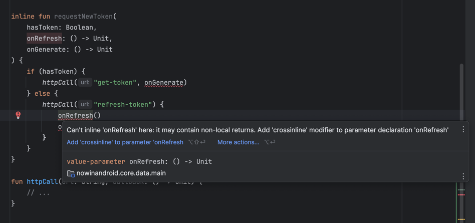

Kotlin 표준 라이브러리에 있는 대부분의 고차 함수들이 'inline modifier'와 함께 정의되어 있는 것을 볼 수 있을 것이다.  
그 이유를 알기 전에, 아래 Kotlin 표준 라이브러리의 'reapet' 함수 구현 방식을 살펴보자.

```kotlin
inline fun repeat(times: Int, action: (Int) -> Unit) {
    for (index in 0 until times) {
        action(index)
    }
}
```

이 'inline modifier'가 수행하는 작업은, 컴파일 과정 중에 해당 함수를 사용하는 모든 부분이 함수의 본문으로 대체된다는 것이다.  
게다가, 'repeat' 내에서 함수 파라미터로 전달된 함수의 모든 호출 또한 해당 함수의 본문으로 대체된다.

```kotlin
repeat(10) {
    print(it)
}

// 따라서 위 함수의 호출은 컴파일 과정 중에 다음과 같이 대체 된다.

for (index in 0 until 10) {
    print(index)
}
```

이러한 변화는 함수가 평소에 실행되는 방식과 크게 다르다.  
보통 함수의 경우, 실행이 함수 본문으로 이동하여 모든 문장을 실행한 후 함수가 호출된 위치로 돌아간다.  
호출을 본문으로 대체하는 것은 이와 매우 다른 동작 방식이며, 이 방식은 몇가지 장점이 있다.

1. 타입 인자를 실체화(reified)할 수 있다.
2. 함수형 파라미터를 가진 함수들은 'inline'으로 처리될 때 더 빨라진다.
3. 'Non-local' 반환이 허용된다.

하지만, 'inline modifier'를 사용하는 데에는 일부 비용도 발생한다.  
'inline modifier'의 장점과 비용을 검토해보자.

---

## A type argument can be reified

Java에서는 초기 버전에 제네릭이 없었다.   
제네릭은 2004년 Java의 J2SE 5.0 버전에서 처음 도입되었지만, 여전히 JVM 바이트코드에서는 제네릭이 존재하지 않았다.  
그래서 컴파일 시, 제네릭 타입이 지워진다. 예를 들어, `List<Int>`가 `List`로 컴파일되는 것을 볼 수 있다.  
이 때문에 객체가 `List<Int>` 인지 직접 확인할 수 없고, 단지 그것이 `List`라는 사실만 알 수 있다.

```kotlin
any is List<Int>    // Error
any is List<*>      // OK
```

같은 이유로, 타입 인자에 대한 연산을 할 수 없다.

```kotlin
fun <T> printTypeName() {
    print(T::class.simpleName)  // Error
}
```

이러한 제한 사항은 함수를 'inline'으로 선언함으로써 해결할 수 있다.  
'inline' 함수에서는 함수 호출이 함수 본문으로 대체되므로, 'reified modifier'를 사용하여 타입 파라미터의 사용을 실제 타입 인자로 바꿀 수 있다.

```kotlin
inline fun <reified T> printTypeName() {
    print(T::class.simpleName)      // OK
}

// usage
printTypeName<Int>()                // Int
printTypeName<Char>()               // Char
printTypeName<String>()             // String
```

컴파일 과정에서 'printTypeName'의 본문이 해당 함수를 호출하는 코드 자리에 직접 삽입된다.  
이 과정에서 함수의 타입 파라미터는 실제로 제공된 타입 인자로 대체되어, 컴파일된 코드에는 구체적인 타입 정보가 포함된다.

```kotlin
print(Int::class.simpleName)        // Int
print(Char::class.simpleName)       // Char
print(String::class.simpleName)     // String
```

'reified modifier'는 매우 유용하다.   
이는 표준 라이브러리의 'filterIsInstance' 함수에 사용되어, 컬렉션에서 특정 타입의 요소만을 선택적으로 필터링하는 기능을 제공한다.

```kotlin
class Worker
class Manager

val employees: List<Any> =
    listOf(Worker(), Manager(), Worker())

val workers: List<Worker> =
    employees.filterIsInstance<Worker>()
```

---

## Functions with functional parameters are faster when they are inlined

모든 함수는 'inline'으로 처리될 때 성능이 소폭 향상된다.  
이는 실행 중에 추가적인 점프가 발생하지 않으며, 함수 호출의 백스택 추적이 불필요해지기 때문이다.  
따라서, 표준 라이브러리에서 자주 사요오디는 소규모 함수들은 위와 같은 이유로 자주 'inline' 처리된다.

```kotlin
inline fun print(message: Any?) {
    System.out.print(message)
}
```

그러나, 함수에 함수형 파라미터가 없는 경우, 함수를 'inline'으로 처리하는 것은 무의미한 행동이다.  
때문에, IntelliJ IDEA는 이러한 함수에 대해 경고를 발생시킨다.

무의미한 이유에 대해 이해하기 위해서는, 먼저 함수를 객체로 다루는데 있어서 어떤 문제가 있는지 이해해야 한다.  
함수 리터럴로 생성된 객체들은 적절한 방법으로 관리되어야 하며, 이는 개발환경에 따라 다르게 처리된다.   
Kotlin/JS에서는 JavaScript가 함수를 일급 객체로 취급하므로, 함수나 함수 참조로 간단히 관리할 수 있다.  
반면, Kotlin/JVM에서는 JVM 익명 클래스나 일반 클래스를 사용하여 함수 객체를 생성해야 하므로, 추가적인 처리가 필요하다.

따라서 다음 람다 표현식은 JVM 익명 클래스 같은 클래스로 컴파일 된다.

```kotlin
val lambda: () -> Unit = {
    // code
}

// Java
Function0<Unit> lambda = new Function0<Unit>() {
    public Unit invoke() {
        // code
    }
};
```

또는 별도의 파일에 정의된 일반 클래스로 컴파일될 수 도 있다.

```java
// Java
// Additional class in separate file

public class Test$lambda implements Function0<Unit> {
    public Unit invoke() {
        // code
    }
}

// usage
Function0 lambda = new Test$lambda();
```

위 두 옵션, 즉 람다 표현식을 JVM 익명 클래스나 별도의 클래스로 컴파일하는 방식 사이에는 유의미한 차이가 없다.

함수 타입이 JVM에서 인자가 없는 함수 타입으로 컴파일 될 때, 'FunctionN' 타입으로 변환된다는 점을 유의해야 한다.  
그리고, 다른 함수 타입들에 대해서도 일관되게 적용된다.

- `() -> Unit` compiles to `Function0<Unit>`
- `() -> Int` compiles to `Function0<Int>`
- `(Int) -> Int` compiles to `Function1<Int, Int>`
- `(Int, Int) -> Int` compiles to `Function2<Int, Int, Int>`

이러한 모든 타입들은 Kotlin 컴파일러에 의해 생성된 인터페이스를 통해 생성된다.  
그러나 생성된 인터페이스는 요구에 따라 동적으로 생성되므로, Kotlin 코드 내에서 명시적으로 사용할 수는 없다. 대신, 함수 타입을 사용해야 한다.   
그럼에도 불구하고, 함수 타입들이 실제로 인터페이스라는 것을 알게 되면, 몇 가지 고려할 수 있는 새로운 가능성이 열린다.

```kotlin
class OnClickListener : () -> Unit {
    override fun invoke() {
        // ...
    }
}
```

'Item 45 : Avoid unnecessary object creation'에서는 함수 본문을 객체로 감쌀 때 코드 실행 속도가 느려진다고 설명했다.  
이는 아래에 제시된 두 함수를 비교했을 때, 첫 번째 함수가 더 빠른 이유를 대신 설명해준다.

```kotlin
inline fun repeatInline(times: Int, action: (Int) -> Unit) {
    for (index in 0 until times) {
        action(index)
    }
}

fun repeatNoinline(times: Int, action: (Int) -> Unit) {
    for (index in 0 until times) {
        action(index)
    }
}
```

차이점은 분명히 존재하지만, 실제로는 그 차이가 크게 중요하지 않은 경우가 많다.  
하지만, 만약 테스트를 잘 설계한다면, 이러한 차이를 명확하게 확인할 수 있다.

```kotlin
@Benchmark
fun nothingInline(blackHole: BlackHole) {
    repeatInline(100_000_000) { blackHole.consume(it) }
}

@Benchmark
fun nothingNoInline(blackHole: BlackHole) {
    repeatNoinline(100_000_000) { blackHole.consume(it) }
}
```

첫번째 함수는 평균적으로 189ms 걸리는 반면, 두번째 함수는 평균 447ms가 걸린다.
이 차이는 첫 번째 함수가 단순히 숫자들을 반복하면서 빈 함수만 호출하는 반면, 두 번째 함수는 숫자들을 반복하고 객체를 통해 빈 함수를 호출하기 때문에 발생한다.
이 모든 차이는 추가 객체를 사용한다는 점에서 발생한다. (Item 42: Avoid unnecessary object creation)

더 일반적인 예를 들어보면, 5,000개의 제품이 있고, 구매한 제품의 가격을 합산해야 한다고 가정해보자.   
이를 간단히 아래와 같이 할 수 있다.

```kotlin
users.filter { it.bought }.sumByDouble { it.price }
```

위 계산을 수행하는데 평균 38ms가 소요되었다. 만약, 이 함수가 'inline' 함수가 아니였다면 얼마나 걸렸을까? 평균 42ms가 걸렸다.  
이 차이가 크게 보이지는 않지만, 컬렉션 처리를 위해 메서드를 사용할 때마다 약 10%의 차이가 생기는 것이다.

'inline' 함수와 'non-inline' 함수 사이에는 여러 차이점이 있지만, 함수 리터럴 내에서 지역 변수를 캡처하는 경우에 그 차이가 두드러진다.  
캡처된 값을 사용할 때마다, 그 값은 어떤 객체에 포장되어야 하며, 그 객체를 통해 해당 값을 사용해야 한다.

```kotlin
var a = 2L
noinlinerepeat(100_000_000) {
    a += a / 2
}
```

'non-inline' 람다에서 지역 변수를 직접적으로 사용하는 것은 불가능하다.  
이러한 제약으로 인해 컴파일 과정에서 'a' 변수의 값은 참조 객체로 감싸진다.

```kotlin
val a = Ref.LongRef()
a.element = 2L
noinlineRepeat(100_000_000) {
    a.element += a.element / 2
}
```

함수 리터럴로 생성된 함수 내에서 지역 변수는 종종 반복적으로 사용될 수 있기에 이러한 차이점은 더욱 중요하다.

예를 들어, 위 예시에서 'a' 값을 두 번 조작하면, 2 * 100,000,000번의 추가적인 객체 사용이 발생하게 된다.  
이 차이를 명확하게 확인하기 위해서 다음 두 함수를 비교해보자.

```kotlin
fun repeatInline() {
    var a = 2L
    repeat(100_000_000) {
        a += a / 2
    }
}

fun repeatNoInline() {
    var a = 2L
    noinlineRepeat(100_000_000) {
        a += a / 2
    }
}
```

첫 번째 함수는 0.2ns가 걸리는 반면, 두 번째 함수는 283,000,000ns가 걸린다.  
이 차이는 함수가 객체로 컴파일되고, 지역 변수가 포장되어야 한다는 사실이 누적되어 나타난 결과이다.

함수형 타입의 파라미터를 가진 함수가 실제로 어떻게 사용될지 대부분 예측할 수 없기에, 컬렉션 처리와 같은 유틸리티 함수를 정의할 때 해당 파라미터를 가진 함수를 'inline'으로 만드는 습관은 좋은 습관이다.
위와 같은 성능 차이로 인해 표준 라이브러리에 있는 함수형 타입의 파라미터를 가진 대부분의 확장 함수들이 'inline'으로 처리되어 있는 것이다.

---

## Non-local return is allowed

앞서 정의한 'repeatNoInline' 함수는 제어 구조와 많이 비슷하다. 이를 'if' 조건문이나 'for' 반복문과 비교해 볼 수 있다.

```kotlin
if (value != null) {
    print(value)
}

for (i in 1..10) {
    print(i)
}

repeatNoninline(10) {
    print(it)
}
```

위 비교에서 중요한 차이점 중 하나는 'repeatNoninline'은 내부에서 `return`이 허용되지 않는다는 것이다.

```kotlin
fun main() {
    repeatNoninline(10) {
        print(it)
        return  // Error : Not allowed
    }
}
```

이 현상은 함수 리터럴이 어떻게 컴파일되는지에 따른 결과이다.  
만약 코드가 다른 클래스 내에 있다면, 'main' 함수로부터 직접 반환하는 것은 불가능하다.   
그러나, 함수 리터럴이 'inline' 처리될 경우, 이와 같은 제한이 적용되지 않는다.  
결국, 코드는 어차피 'main' 함수 내에 위치하게 되기 때문에 `return`을 허용할 수 있게 된다.

```kotlin
fun main() {
    repeatInline(10) {
        print(it)
        return  // OK
    }
}
```

덕분에 함수는 제어 구조처럼 보이고 동작할 수 있다.

```kotlin
fun getSomeMoney(): Money? {
    repeat(100) {
        val money = searchForMoney()
        if (money != null) return money
    }
    return null
}
```

---

## Costs of inline modifier

'inline modifier' 매우 유용하지만, 모든 상황에서 사용될 수 있는것은 아니다.  
'inline' 함수는 재귀적으로 사용할 수 없다. 만약 재귀적으로 사용한다면, 해당 함수는 자신을 무한히 대체하는 상황에 빠질 것이다.  
재귀 사이클은 특히 위험한데, 컴파일 동안에는 오류를 던지지 않지만, 대신 런타임에 오류를 발생시키기 때문이다.

```kotlin
inline fun a() {
    b()
}
inline fun b() {
    c()
}
inline fun c() {
    a()
}
```

'inline' 함수는 제한적인 'visibility' 요소를 사용할 수 없다.  
예를 들어, 'public inline' 함수 내에서는 'private' 또는 'internal' 함수나 프로퍼티를 사용할 수 없다.  
실제로, 'inline' 함수는 자신 보다 더 제한적인 'visibility'를 가진 요소를 사용할 수 없다.

```kotlin
internal inline fun read() {
    val reader = Reader()   // Error
    // ...
}

private class Reader {
    // ...
}
```

이러한 점으로 인해 'inline' 함수가 구현을 숨길 수 없는 이유이며, 따라서 클래스 내에서 'inline' 함수를 사용하는 경우는 드물다.

마지막으로, 'inline' 함수는 코드의 양을 증가시킨다.   
실질적인 규모를 이해하기 위해, 3을 출력하는 함수를 정의해보자.

```kotlin
inline fun printThree() {
    print(3)
}
```

또한 아래와 같이 추가로 함수를 만들어 보자.

```kotlin
inline fun threePrintThree() {
    printThree()
    printThree()
    printThree()
}
```

이에 만족하지 말고, 한번 더 추가로 정의해보자.

```kotlin
inline fun threeThreePrintThree() {
    threePrintThree()
    threePrintThree()
    threePrintThree()
}

inline fun threeThreeThreePrintThree() {
    threeThreePrintThree()
    threeThreePrintThree()
    threeThreePrintThree()
}
```

이를 컴파일 하면 다음과 같이 될 것이며, 이들이 점점 코드의 양을 증가시키는 것을 볼 수 있다.

```kotlin
inline fun printThree() {
    print(3)
}

inline fun threePrintThree() {
    print(3)
    print(3)
    print(3)
}
```

이 예제는 추상적인 상황을 다루고 있지만, 'inline' 함수를 지나치게 사용하는 것이 가져올 수 있는 큰 문제점 하나를 잘 보여준다.  
이처럼, 너무 많은 'inline' 함수들이 서로를 호출하는 구조는 코드의 크기가 기하급수적으로 늘어날 수 있으므로, 이는 매우 위험한 상황을 초래할 수 있다.

---

## Crossinline and noinline

'inline' 함수를 사용하고 싶지만, 어떤 이유로 함수 타입 인자 모두를 'inline'으로 처리할 수 없는 경우가 있다.  
이러한 경우에는 다음과 같은 'modifier'를 사용할 수 있다.

|  Modifier   | Description                                                                                                                                       |
|:-----------:|---------------------------------------------------------------------------------------------------------------------------------------------------|
| crossinline | - 함수가 'inline' 처리될 필요는 있지만, 'non-local' 리턴을 허용하지 않아야 할 때 사용하는 'modifier' <br/> - 예를 들어, 'non-inline'된 다른 람다 같은, 리턴이 허용되지 않는 다른 영역에서 사용될 경우에 적합하다. |
|  noinline   | - 특정 함수 인자가 'inline' 처리 되어서는 안 됨을 지정할 때 사용하는 'modifier' <br/> - 주로, 해당 함수가 'inline' 되지 않는 다른 함수로 전달될 때 유용하다.                                      |

```kotlin
inline fun requestNewToken(
    hasToken: Boolean,
    crossinline onRefresh: () -> Unit,
    noinline onGenerate: () -> Unit
) {
    if (hasToken) {
        httpCall("get-token", onGenerate) // We must use noinline to pass function as an argument to a function that is not inlined
    } else {
        httpCall("refresh-token") {
            onRefresh()     // We must use crossinline to inline function in a context where non-local return is not allowed
            onGenerate()
        }
    }
}

fun httpCall(url: String, callback: () -> Unit) {
    // ...
}
```

'crossinline'과 'noinline'가 갖는 의미를 이해하는 것은 중요하지만, 
실제로 필요한 순간에 IDEA가 적절히 제안해주기에, 이들을 항상 기억할 필요는 없다.

