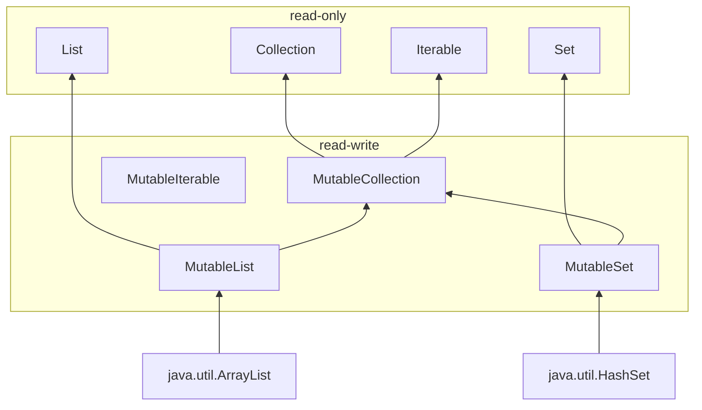

# Kotlin 가변성(Mutability)
Kotlin에서는 프로그램을 모듈로 설계하며, 각 모듈은 `class`, `object`, `function`, `type alias`, `Top-level Properties` 등 다양한 종류의 요소로 구성된다.

---

## Kotlin 상태(State)
Kotlin은 아래와 같은 방식을 사용하면 `상태`를 가질 수 있다.
- read-write 속성인 `var`사용
- `mutable object`사용

다음 아래 코드를 보자.
``` kotlin
class BankAccount {
    var balance: Int = 0
        private set
    
    fun deposit(amount: Int) {
        balance += amount
    }
    
    @Throws(InsufficientFunds::class)
    fun withdraw(amount: Int) {
        if (balance < amount) throw InsufficientFunds()
        balance -= amount
    }
    
    class InsufficientFunds : Exception()
    
    ...
    ...
    
    val account = BankAccount()
    // account.balance = 0
    account.deposit(100)
    // account.balance = 100
    account.withdraw(50)
    // account.balance = 50
}
```

`BankAccount`에는 해당 계정이 얼마나 돈이 있는지 나타내는 `상태`를 가진 `balance`가 있다.

**위와 같이 `balance`가 가변성을 갖고 있다면, 아래과 같은 이유로 `상태` 관리가 어렵다.**
- **많은 변이점을 갖는 프로그램은 코드를 이해하고 디버그하는 것이 어렵다.** 특히 예상치 못한 오류 시 문제가 될 수 있다.
- 가변 상태는 언제든지 변경될 수 있기 때문에 코드를 이해하고 **추론하는 것을 어렵게** 만든다.
- **다중 스레드 프로그램**에서 모든 변동성은 잠재적인 충돌을 야기해 적절한 **동기화를 필요로 한다.**
- 가변 요소는 **모든 가능한 상태를 테스트**해야 하므로 테스트하기가 어렵다.
- **상태가 변하면, 변경 사항을 알려야 한다.** 이를테면 가변적인 컬렉션에 요소를 추가하면 재정렬 해야한다.

---

## Kotlin 가변성 제한

**Kotlin은 가변성을 제한하는 방법을 제공한다.**
- read-only 속성인 `val` 사용
- `mutable collection`과 `immutable collection` 구분
- `data class`에서의 `copy`

### read-only 속성인 val
1. `val`은 값을 재할당하지 못하는것이고 `mutable object`을 사용하고 있으면 내부적으로 상태를 변경할 수 있다.

```kotlin
val list = mutableListOf(1, 2, 3)
list.add(4)
println(list) // [1, 2, 3, 4]
```

2. `val`은 다른 프로퍼티를 활용하는 `custom getter`로 정의할 수 있다.
```kotlin
    var name: String = "Kotlin"
    var surname: String = "Hello"
    val fullName: String
        get() = "$name $surname"

    fun main() { 
        println(fullName) // Kotlin Hello
        name = "Java"
        println(fullName) // Java Hello
    }
```

3. `val`이 불변성을 의미해도 `val`로 선언된 변수가 참조하는 객체 자체의 상태가 불변이라는 의미는 아니다. 
이는 해당 객체가 가변성을 가질 수 있기 때문이다.
그렇기에 `val` 키워드는 변수에 재할당을 방지하는 역할을 하지만, 변수가 가리키는 객체의 내부 상태를 변경하는 것을 방지하지 않는다.
```kotlin
    fun calculate(): Int { 
        println("Calculating...")
        return 42
    }
    
    val fizz = calculate()
    val buzz get() = calculate()

    fun main() {
        println(fizz) // 42
        println(buzz) // Calculating... 42
    }
```

> Kotlin에서 속성이 기본적으로 캡슐화되고 사용자 정의 접근자(`getter`,`setter`)를 가질 수 있다는 특성은 API를 변경하거나 정의할 때 유연성을 제공한다.
> 위 항목은 Item 16에서 더 내용을 보충 할 예정이다.

4. `val`은 정의 옆에 상태가 작성되므로 코드 실행을 예측하기 쉽고 smart-casted를 사용할 수 있다.

```kotlin
    var name: String? = "Kotlin"
    var surname: String = "Hello"
    val fullName: String?
        get() = name?.let { "$it $surname" }
    val fullName2: String? = name?.let { "$it $surname" }
    
    fun main() {
        if(fullName != null) {
            println(fullName.length) // smart-casted Error
        }
        
        if (fullName2 != null) {
            println(fullName2.length) // Kotlin Hello
        }
    }
```
> - `fullName`은 `getter`에 의해 값이 동적으로 생성되기에 컴파일러가 null이 아님을 보장할 수 없어 `smart-casted`를 사용할 수 없다.
> - `fullName2`은 `getter`를 사용하여 `null`이 아니라는 조건을 통과하면 자동으로 `fullName2`의 타입이 `nullable` -> `non-nullable`로 `smart-casted`된다.


### mutable Collection과 immutable Collection

- Kotlin은 `Properties`와 같이 `immutable collection`을 지원한다. 아래 구조를 보자. 



- `immutable collection`은 반드시 `불변`일 필요가 없다. `Iterable.map` 혹은 `Iterable.filter`와 같은 함수를 통해 _**기존 Collction에서 변경된**_ `immutable collection`을 생성할 수 있다.
- `immutable collection`을 `read-write collection`으로 변경하고 싶다면 복사본을 생성하는 `List.toMutableList`를 사용하자.

### Data Class에서의 copy
`String`과 `Int`와 같이 내부 상태를 변경하지 않는 객체인 `immutable object`를 선호하는데에는 다음과 같은 이유가 있다.
1. 생성되면 상태가 동일하게 유지되므로 코드를 이해하기 쉽다.
2. 불변성은 객체를 공유했을 때도 충돌이 없기에 병렬 프로그래밍이 간편하다.
3. 상태가 변하지 않으므로 참조를 캐싱할 수 있다.
4. 방어적인 복사가 필요 없고, 깊은 복사를 하지 않아도 된다.
5. 다른 객체 즉, `mutable`, `immutable` object를 구성하는데 이상적이다.
6. `Hash`기반 Collection에서 안정적으로 활용될 수 있어 `set` 또는 `map`의 **key**로 사용할 수 있다.

---

## 다른 종류의 변경 가능 지점
변경 가능한 목록을 만들어야 한다고 가정할 때 2가지 방법으로 나타낼 수 있다.

```kotln
val list1: MutableList<Int = mutableListOf()
var list2: List<Int> = listOf()
```

이 때 2가지 모두 속성을 수정할 수 있지만 방법이 다르다.

```kotlin
list1.add(1)
list2 = list2 + 1
```

내부적으로 처리되는 방법은 다음과 같이 동작된다.

```kotlin
list1 += 1 // list1.plusAssign(1)
list2 += 1 // list2.plus(1)
```

위 2가지 방법 모두 동일하게 동작하지만 변경 가능 지점이 다르다.
- `mutableList` : 구체적인 리스트 구현 내부에 변경 가능 지점이 있어 내부적으로 적절한 동기화 여부를 확신할 수 없다.
- `var properties` : 변경 가능 지점이 `properties` 자체이기에 멀티 스레드 처리 안정성이 좋다.

> `var properties`에 `mutable collection`을 사용하지 말자. 
> 만약 사용하게 될 경우 2가지 지점에 대한 동기화를 구현해야 하고 모호성으로 인해 `+=` 연산자를 사용할 수 없게 된다.

---

## 변경 가능 지점을 유출하지 말자
- `mutable object`를 외부에 노출할 경우 문제가 발생될 수 있다.
```kotlin
data class User(val name: String)

class UserRepository {
    private val users: MutableMap<Int, String> = mutableMapOf()
    
    fun loadAll() : MutableMap<Int, String> = users
}

val userRepository = UserRepository()
val users = userRepository.loadAll()
users[3] = "Kotlin"

// ...

println(userRepository.loadAll()) // {3=Kotlin}
```

위와 같은 수정이 발생되는 것을 방지하기 위해 2가지 방법을 사용할 수 있다.

### 방어적 복제
```kotlin
class UserHolder {
    private val user: MutableUser()
    fun get(): MutableUser = user.copy()
}
```

### 반환 타입을 immutable type으로 Up-Casting
```kotlin
data class User(val name: String)

class UserRepository {
    private val users: MutableMap<Int, String> = mutableMapOf()

    fun loadAll() : Map<Int, String> = users
}
```
---

# 정리
- `var`보다 `val`을 선호해라
- `mutable` 보다 `immutable`을 선호해라
- 변경이 필요한 경우 `immutable data class`를 만들고 `copy`를 사용해라
- `상태`를 유지하라면 `mutable collection`보다 `immutable collection`을 사용해라
- 변경점을 신중하게 설계하고 불필요한 변경점을 만들지마라
- `mutable object`를 외부에 노출하지 마라