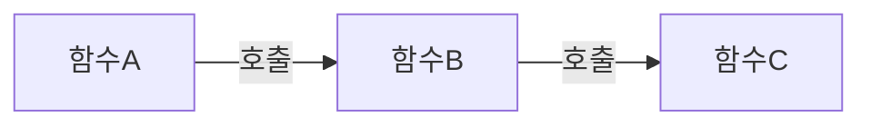

# Null or Fail Result 사용

---

선언한 함수가 원하는 결과를 생성하지 못하는 경우가 있을 수 있습니다.  
일반적인 예시로는 다음과 같은 경우가 있을 수 있습니다.

1. 서버를 통해 데이터를 얻으려는 중 인터넷에 문제가 발생
2. 조건을 충족하는 첫 번째 요소를 가져오려고 시도하였지만 목록에 해당 요소가 없는 경우
3. 텍스트에서 객체를 파싱하려고 시도하였지만 텍스트 형식이 잘못된 경우

이러한 상황을 처리하는 2가지 메커니즘이 있습니다.
1. 실패를 나타내는 `null` 혹은 `sealed class` 반환합니다.
2. 예외를 던진다. (`throw`)

---

## 예외를 예외적인 상황에만 사용해야하는 목적
예외는 오류 상황을 처리하거나 특수한 조건에서의 프로그램 행동을 제어하기 위한 목적으로 사용되며,
일반적인 제어 흐름에서 사용되어서는 안됩니다.   

이를 예외적인 상황에만 사용해야 하는 주된 이유는 다음과 같습니다.

### 프로그램 가독성
예외의 전파 방식은 대부분의 개발자에게 가독성이 떨어지며 코드에서 쉽게 누락될 수 있습니다.

위 상황에서 '`C`에서 `예외`가 발생했다' 가정하면 이 예외는 `B`를 통해 `A`까지 전파됩니다.  
하지만 `A`와 `B`에서는 `C`에서 예외가 발생했다는 것을 즉시 알 수가 없습니다.  
이처럼 예외가 어떻게 발생하고 호출 스택에 따라 상향 전파되는지가 명확하지 않아 코드를 읽는데 어려움을 줄 수 있습니다.

### 예외 처리의 강제성 부재
Kotlin에서는 Java와 달리 예외를 확인하지 않으며[^ce] 예외를 처리하도록 강제하거나 권장 받지 않습니다.

예를 들어, 서버와의 API 통신을 위해 `loadData()`를 사용한다고 가정했을 때, 
Kotlin은 예외를 선언할 필요가 없으므로 `loadData()`가 예외를 던질 수 있다는 것이 명확하지 않습니다.
이는 `loadData()`가 실패하고 준비된 예외 처리 없이 예외를 던질 경우 프로그램이 예상치 못한 충돌을 겪을 수 있습니다.

>Java와 달리 Checked Exception이 없기에 Kotlin에서는 예외를 적절히 사용하고 예외 처리에 신경 써야한다.

### 성능 
예외는 예외적인 조건에 대비해 설계되어 있습니다. 
그렇기 때문에, 프로그램의 일반 제어 흐름을 위해 예외를 사용하는 것은 비효율적이며 성능에 문제를 일으킬 수 있습니다.

예를 들어, 문자열이 정수로 변환될 수 있는지를 확인하기 위해 예외를 사용하여 흐름을 제어하는 경우,
이는 정규 표현식이나 비슷한 방법으로 일반 조건 확인을 사용하는 것보다 성능이 떨어질 수 있습니다.

### 최적화의 억제
`try-catch` 블록 내에 코드를 배치하면 컴파일러가 수행할 수 있는 일부 최적화가 억제됩니다.

중요한 성능을 담당하는 코드가 `try` 블록에 존재하면 실행이 느려질 수 있습니다.
그 이유는 JVM이 `try` 블록 내에서 언제든 예외가 발생할 수 있으므로 호출 스택을 유지하고 예외 발생 시 
스택을 풀도록 준비해야하기 때문에 추가적인 리소스를 필요로하며 실행이 느려집니다.

---

## Null or Fail Result 사용
위 `Throw`와는 반대로 개발자가 예상되는 오류들을 나타내기에는 `null` 또는 `Failure`가 적합합니다.

- 오류가 예상되는 경우 `null` 또는 `Failure`를 사용합니다.
- 오류가 예상되지 않는 경우 `throw`를 사용합니다.

```kotlin
sealed class Result<outT> {
    data class Success<outT>(val result : T) : Result<T>()
    data class Failure(val throwable : Throwable) : Result<Nothing>()
}

class JsonParsingException : Exception()

inline fun <reified T> String.readObject(): Result<T> {
    if(incorrectSign) return Failure(JsonParsingException())
    
    return Success(result)
}
```


[^ce]: Checked Exception - 컴파일러가 예외를 처리하도록 강제하는 Java의 예외 처리 방식